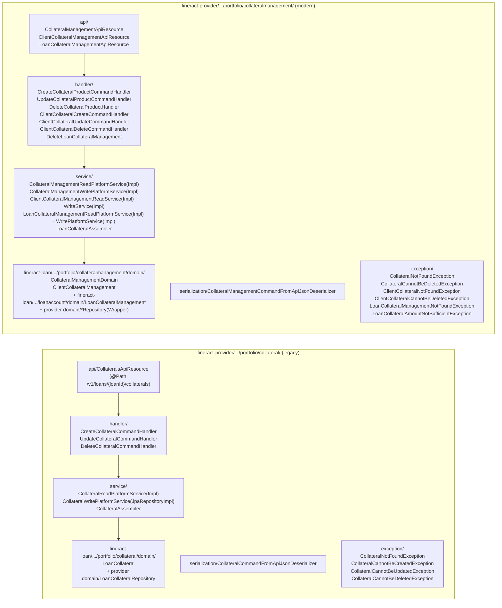
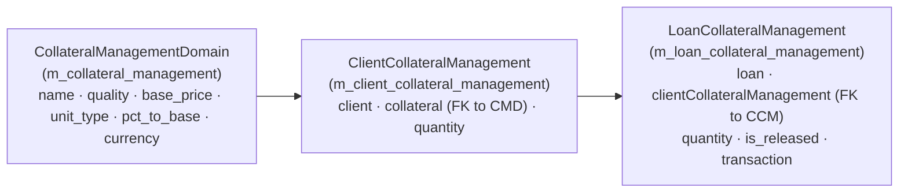
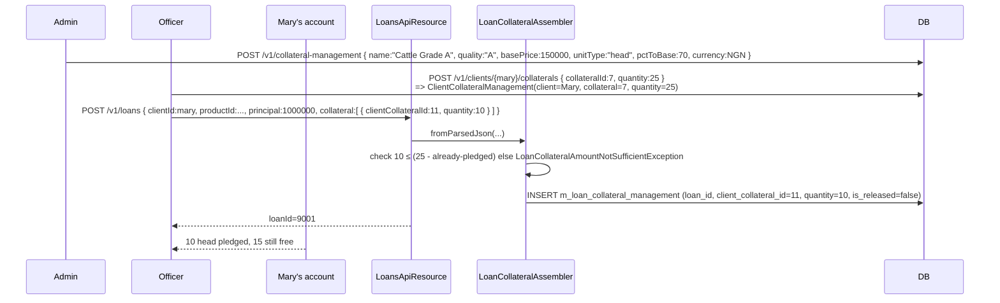

The **collateral** subsystem in Apache Fineract has gone through two generations and both still ship side-by-side. The legacy `portfolio/collateral/` package models collateral as a free-form free-value attached to a single loan; the newer `portfolio/collateralmanagement/` package models collateral as **typed, quantified inventory owned by a client and then pledged in measured quantities to one or more loans**.

The new package is the one to use for new code. The old one stays in tree because older deployments have loans referencing legacy `m_loan_collateral` rows that must continue to read and behave correctly.

This page maps both, and clarifies what the four REST resources actually do.

## The two packages at a glance



## Legacy: `portfolio/collateral/`

### `LoanCollateral` entity

`fineract-loan/src/main/java/org/apache/fineract/portfolio/collateral/domain/LoanCollateral.java` (`m_loan_collateral`):

```java
@Entity
@Table(name = "m_loan_collateral")
public class LoanCollateral extends AbstractPersistableCustom<Long> {
    @ManyToOne(optional = false) @JoinColumn(name = "loan_id",     nullable = false) private Loan loan;
    @ManyToOne                  @JoinColumn(name = "type_cv_id",   nullable = false) private CodeValue type;        // LoanCollateralType code
    @Column(name = "value",       scale = 6, precision = 19)                         private BigDecimal value;
    @Column(name = "description", length = 500)                                      private String description;
}
```

This is the minimal model: pick a type from a `CodeValue` (`LoanCollateralType`), supply a monetary `value`, optionally a free-text description, attached to one loan. No quantity, no client-side inventory, no shared collateral pool.

### REST: `CollateralsApiResource`

`fineract-provider/.../portfolio/collateral/api/CollateralsApiResource.java`:

```java
@Path("/v1/loans/{loanId}/collaterals")
public class CollateralsApiResource {
  @GET @Path("template")              CollateralData newCollateralTemplate(@PathParam("loanId") Long loanId)
  @GET                                List<CollateralData> retrieveCollateralDetails(@PathParam("loanId") Long loanId)
  @GET @Path("{collateralId}")        CollateralData retrieveCollateralDetails(@PathParam("loanId") Long loanId,
                                                                              @PathParam("collateralId") Long CollateralId)
  @POST                               CommandProcessingResult createCollateral(@PathParam("loanId") Long loanId, String json)
  @PUT @Path("{collateralId}")        CommandProcessingResult updateCollateral(@PathParam("loanId") Long loanId,
                                                                              @PathParam("collateralId") Long collateralId, String json)
  @DELETE @Path("{collateralId}")     CommandProcessingResult deleteCollateral(@PathParam("loanId") Long loanId,
                                                                              @PathParam("collateralId") Long collateralId)
}
```

Three command handlers: `CreateCollateralCommandHandler`, `UpdateCollateralCommandHandler`, `DeleteCollateralCommandHandler`. The `CollateralCommandFromApiJsonDeserializer` enforces that `collateralTypeId` is a valid `CodeValue` of code `LoanCollateralType` and `value` is non-negative.

### Why deprecated?

The model has three structural limitations:

1. **No inventory of what the client owns** — only what was pledged on a specific loan.
2. **No way to pledge the same asset across loans** — the same car cannot back two loans without inserting two rows.
3. **No quantity** — only a single value figure, so 50 cattle vs 1 cow vs 1 truck all become a `value` you have to manually compute.

The new package was added to address each of these.

## Modern: `portfolio/collateralmanagement/`

### Three entities, one model

The new package separates *what kind of thing* (product), *what the client owns* (inventory), and *what is pledged* (allocation):



#### 1. `CollateralManagementDomain` — the collateral *product*

`fineract-loan/src/main/java/org/apache/fineract/portfolio/collateralmanagement/domain/CollateralManagementDomain.java` (`m_collateral_management`):

```java
@Entity
@Table(name = "m_collateral_management")
public class CollateralManagementDomain extends AbstractPersistableCustom<Long> {
    @Column(name = "name",        length = 20)                                          private String name;
    @Column(name = "quality",     nullable = false, length = 40)                        private String quality;
    @Column(name = "base_price",  nullable = false, scale = 5, precision = 20)          private BigDecimal basePrice;
    @Column(name = "unit_type",   nullable = false, length = 10)                        private String unitType;       // "head" for cattle, "ha" for land, "kg" for grain
    @Column(name = "pct_to_base", nullable = false, scale = 5, precision = 20)          private BigDecimal pctToBase;  // haircut/LTV percentage
    @ManyToOne @JoinColumn(name = "currency")                                            private ApplicationCurrency currency;
    @OneToMany(mappedBy = "collateral", cascade = CascadeType.ALL, orphanRemoval = true, fetch = FetchType.EAGER)
    private Set<ClientCollateralManagement> clientCollateralManagement = new HashSet<>();
}
```

This is the *catalog row*: "Cattle, Grade A, ₦150,000 per head, applied at 70% of base". The MFI creates these once.

#### 2. `ClientCollateralManagement` — what a client owns

`fineract-loan/src/main/java/org/apache/fineract/portfolio/collateralmanagement/domain/ClientCollateralManagement.java`:

```java
@Entity
@Table(name = "m_client_collateral_management")
public class ClientCollateralManagement extends AbstractPersistableCustom<Long> {
    @Column(name = "quantity", scale = 5, precision = 20)                                          private BigDecimal quantity;
    @ManyToOne(optional = false) @JoinColumn(name = "client_id",     nullable = false)             private Client client;
    @ManyToOne(optional = false) @JoinColumn(name = "collateral_id", nullable = false)             private CollateralManagementDomain collateral;
    @OneToMany(cascade = CascadeType.ALL, mappedBy = "clientCollateralManagement", fetch = FetchType.LAZY)
    private Set<LoanCollateralManagement> loanCollateralManagementSet = new HashSet<>();
}
```

"Mary owns 25 head of *Cattle, Grade A*." One row per (client, collateral type) — you increase `quantity` when she acquires more.

#### 3. `LoanCollateralManagement` — the actual pledge

`fineract-loan/.../portfolio/loanaccount/domain/LoanCollateralManagement.java`:

```java
@Entity
@Table(name = "m_loan_collateral_management")
public class LoanCollateralManagement extends AbstractPersistableCustom<Long> {
    @Column(name = "quantity", nullable = false, scale = 5, precision = 20)                        private BigDecimal quantity;
    @ManyToOne                  @JoinColumn(name = "transaction_id")                               private LoanTransaction loanTransaction;
    @ManyToOne(optional = false) @JoinColumn(name = "loan_id",                referencedColumnName = "id", nullable = false) private Loan loan;
    @Column(name = "is_released", nullable = false)                                                private boolean isReleased;
    @ManyToOne(optional = false) @JoinColumn(name = "client_collateral_id",   nullable = false)    private ClientCollateralManagement clientCollateralManagement;
}
```

"Loan #9001 pledges 10 of Mary's 25 head." Two flags do the heavy lifting:

- `quantity` — units locked against this loan.
- `is_released` — set to `true` when the loan is repaid, releasing the units back to `ClientCollateralManagement`.

Optionally a `transaction_id` links the pledge to the *loan transaction* (disbursal or top-up) that triggered it, so a foreclosure history is reproducible.

### Invariants enforced by the write services

- The sum of `LoanCollateralManagement.quantity` for `is_released = false` across a given `ClientCollateralManagement` must not exceed the client's owned `quantity`. Violations raise `LoanCollateralAmountNotSufficientException`.
- A `ClientCollateralManagement` row cannot be deleted while any associated `LoanCollateralManagement` has `is_released = false` — `ClientCollateralCannotBeDeletedException`.
- A `CollateralManagementDomain` (product) cannot be deleted while any client owns inventory of it — `CollateralCannotBeDeletedException`.

## REST: three resources, three scopes

### `CollateralManagementApiResource` — products

`fineract-provider/.../portfolio/collateralmanagement/api/CollateralManagementApiResource.java`:

```java
@Path("/v1/collateral-management")
public class CollateralManagementApiResource {
  @POST                              CommandProcessingResult create(...)                  // CreateCollateralProductCommandHandler
  @GET @Path("template")             ... // dropdown options
  @GET                               List<CollateralManagementData> retrieveAll(...)
  @GET @Path("{collateralId}")       CollateralManagementData retrieveOne(...)
  @PUT @Path("{collateralId}")       CommandProcessingResult update(...)                  // UpdateCollateralProductCommandHandler
  @DELETE @Path("{collateralId}")    CommandProcessingResult delete(...)                  // DeleteCollateralProductHandler
}
```

### `ClientCollateralManagementApiResource` — inventory

`fineract-provider/.../portfolio/collateralmanagement/api/ClientCollateralManagementApiResource.java`:

```java
@Path("/v1/clients/{clientId}/collaterals")
public class ClientCollateralManagementApiResource {
  @GET                                       retrieveAll(@PathParam("clientId") Long clientId, ...)
  @GET @Path("{clientCollateralId}")         retrieveOne(@PathParam("clientId") Long clientId,
                                                         @PathParam("clientCollateralId") Long collateralId)
  @GET @Path("template")                     ClientCollateralCreateResponse template(@PathParam("clientId") Long clientId)
  @POST                                      ClientCollateralCreateResponse addCollateral(@PathParam("clientId") Long clientId, String json)   // ClientCollateralCreateCommandHandler
  @PUT @Path("{collateralId}")               ClientCollateralUpdateResponse updateCollateral(...)                                              // ClientCollateralUpdateCommandHandler
  @DELETE @Path("{collateralId}")            ClientCollateralDeleteResponse deleteCollateral(...)                                              // ClientCollateralDeleteCommandHandler
}
```

### `LoanCollateralManagementApiResource` — pledge

`fineract-provider/.../portfolio/collateralmanagement/api/LoanCollateralManagementApiResource.java`:

```java
@Path("/v1/loan-collateral-management")
public class LoanCollateralManagementApiResource {
  @GET    @Path("{collateralId}")  LoanCollateralResponseData retrieveOne(@PathParam("collateralId") Long collateralId)
  @DELETE @Path("{id}")            CommandProcessingResult deleteLoanCollateral(@PathParam("loanId") Long loanId,
                                                                                @PathParam("id") Long id)            // DeleteLoanCollateralManagement
}
```

Note **there is no separate `POST`** for creating a `LoanCollateralManagement` row — pledges are created as a side-effect of the loan creation API (`POST /v1/loans` with a `collateral` array). The `LoanCollateralAssembler` (`fineract-provider/.../portfolio/collateralmanagement/service/LoanCollateralAssembler.java`) parses the loan-creation JSON and creates the `LoanCollateralManagement` rows in the same transaction as the `Loan`.

## End-to-end: pledging cattle for a new loan



When the loan is repaid in full, the loan write service walks every `LoanCollateralManagement` row of the loan and flips `is_released = true` — Mary's 10 head are returned to her free inventory.

## Read services

| Service | Returns | Used by |
| --- | --- | --- |
| `CollateralManagementReadPlatformServiceImpl` | `Collection<CollateralManagementData>` from `m_collateral_management` | Product list/template |
| `ClientCollateralManagementReadServiceImpl` | `Collection<ClientCollateralManagementData>` joining client × product | Client inventory tab |
| `LoanCollateralManagementReadPlatformServiceImpl` | `Collection<LoanCollateralResponseData>` joining loan × client collateral × product | Loan details tab |
| `CollateralReadPlatformServiceImpl` (legacy) | `Collection<CollateralData>` from `m_loan_collateral` | Old loan details rendering |

The data DTOs live in `fineract-provider/.../portfolio/collateralmanagement/data/`; the cross-module shared shape `ClientCollateralManagementData` lives in `fineract-core/.../portfolio/client/data/ClientCollateralManagementData.java` and `fineract-core/.../portfolio/collateralmanagement/data/ClientCollateralManagementData.java` (yes, both — there are two record types with the same name in different `data` packages used by different layers).

## Exception map (full)

`fineract-provider/.../portfolio/collateral/exception/` (legacy):

- `CollateralNotFoundException`
- `CollateralCannotBeCreatedException` — collateral on a loan in an invalid status.
- `CollateralCannotBeUpdatedException`, `CollateralCannotBeDeletedException` — loan no longer mutable.

`fineract-provider/.../portfolio/collateralmanagement/exception/` (modern):

- `CollateralNotFoundException` (NB: same simple name; different package) — product missing.
- `CollateralCannotBeDeletedException` — product still referenced.
- `ClientCollateralNotFoundException`
- `ClientCollateralCannotBeDeletedException` — inventory row still pledged on a live loan.
- `LoanCollateralManagementNotFoundException`
- `LoanCollateralAmountNotSufficientException` — pledge exceeds available quantity.

## Migration guidance

New deployments should:

1. Define `CollateralManagementDomain` products through `POST /v1/collateral-management`.
2. Track each client's inventory through `POST /v1/clients/{id}/collaterals`.
3. Pledge in the loan-creation payload (`collateral: [...]`).
4. Never use `/v1/loans/{loanId}/collaterals` for new loans.

Existing deployments keep the legacy endpoints functional for backward compatibility — both `m_loan_collateral` and `m_loan_collateral_management` may contain rows referencing the same loan, and both are reported in the loan's *Collaterals* tab.

## See also

<CardGroup cols={2}>
  <Card title="Clients" href="/portfolio/clients" icon="user">
    The owner of `ClientCollateralManagement` inventory.
  </Card>
  <Card title="Funds" href="/portfolio/funds" icon="sack-dollar">
    A peer reference-data subsystem — funds tag the source of money; collateral types tag the *kind* of security.
  </Card>
  <Card title="Account transfers & SIs" href="/portfolio/account-transfers-and-standing-instructions" icon="arrows-rotate">
    What you set up to actually repay the loan against which collateral is pledged.
  </Card>
</CardGroup>
