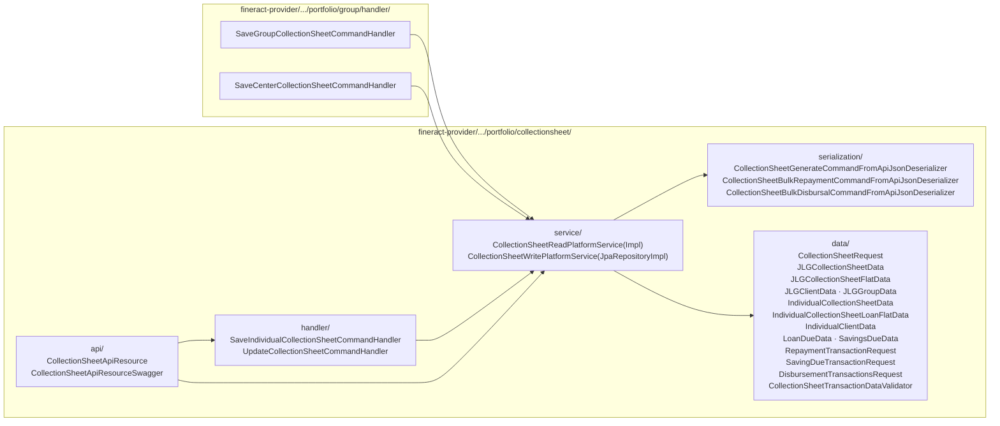
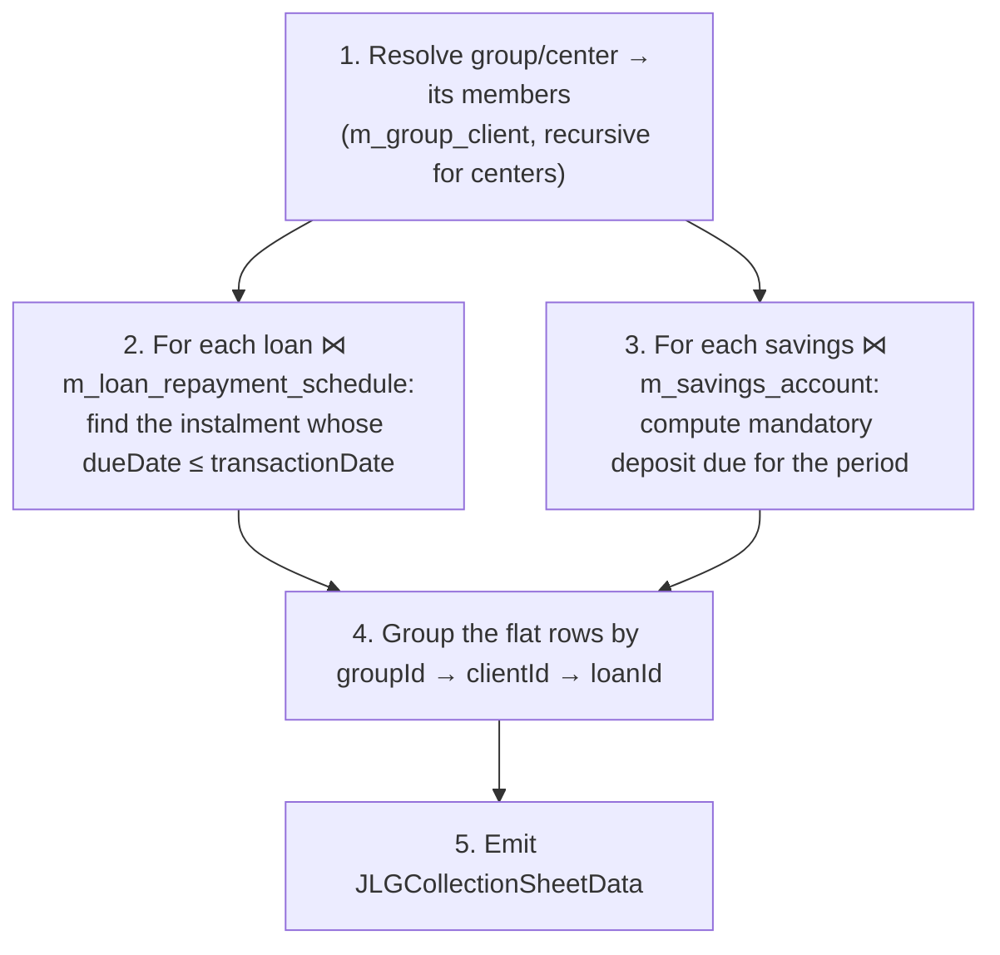
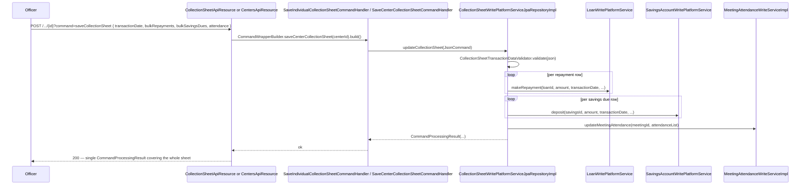
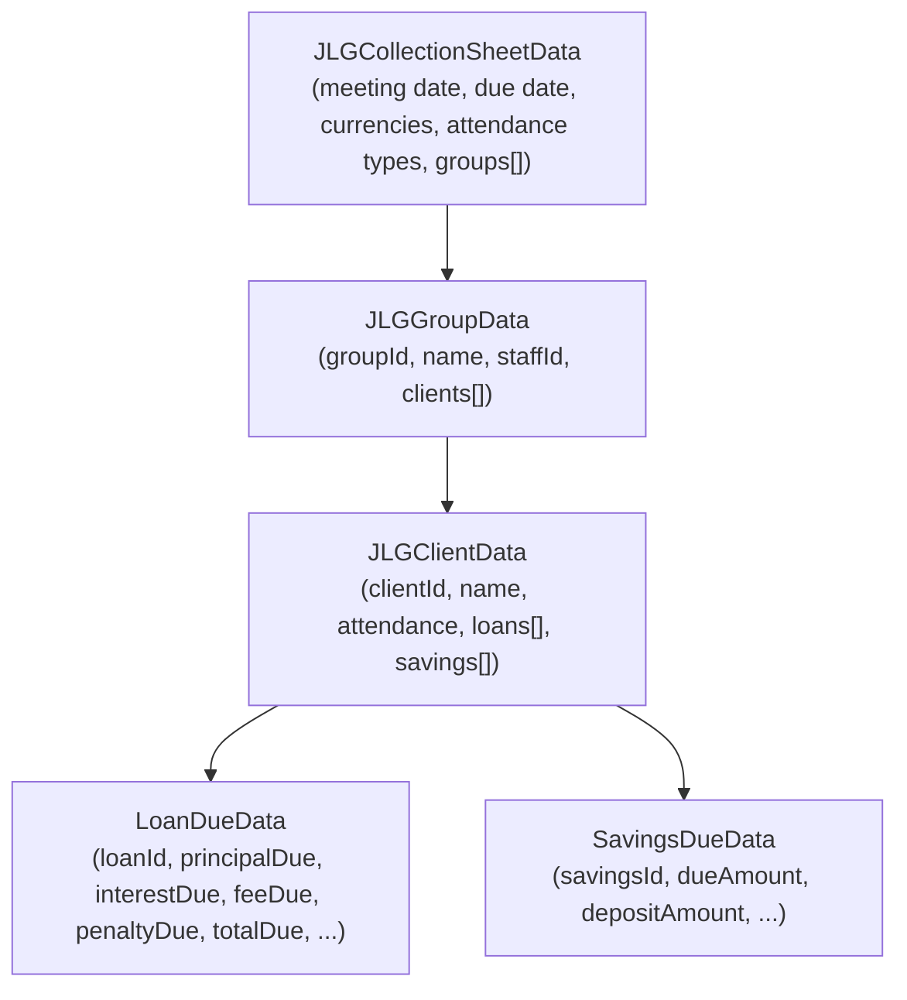
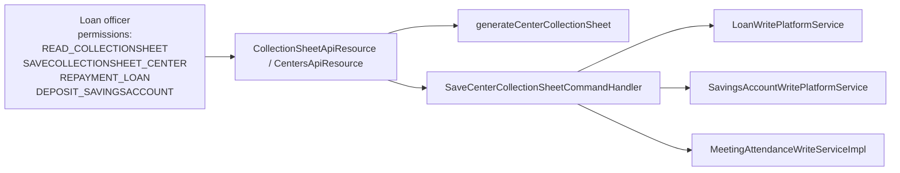

The **collection sheet** is the operational artefact a loan officer carries to a JLG / center meeting: a one-page tabular list of every client expected to pay, what they owe in loan instalments, what they owe in mandatory savings deposits, and what they actually deposited. Apache Fineract pre-computes this list for a given meeting date by walking the [group](/portfolio/groups) / [center](/portfolio/centers) membership, intersecting with the [calendar](/portfolio/meetings-and-calendars) recurrence, and aggregating the loan repayment schedules.

Two flavours exist:

- **JLG / group / center sheet** — generated against a group or center via `?command=generateCollectionSheet` on `/v1/groups/{id}` or `/v1/centers/{id}`. Returns `JLGCollectionSheetData`.
- **Individual sheet** — generated against a free-form office + meeting date via `POST /v1/collectionsheet?command=generateCollectionSheet`. Returns `IndividualCollectionSheetData`. Used when an MFI operates non-grouped lending.

The "save" of either is bulk: one POST writes loan repayments + savings deposits + meeting attendance in a single transaction.

## Where the code lives



## The two views

### 1. JLG / group / center sheet

Endpoints (on the groups/centers resources, not the collection sheet resource):

```http
POST /v1/groups/{groupId}?command=generateCollectionSheet
POST /v1/groups/{groupId}?command=saveCollectionSheet
POST /v1/centers/{centerId}?command=generateCollectionSheet
POST /v1/centers/{centerId}?command=saveCollectionSheet
```

The `generate*` actions are read-only (they go through `CollectionSheetReadPlatformService.generateGroupCollectionSheet(...)` / `generateCenterCollectionSheet(...)`), and `save*` are handled by `SaveGroupCollectionSheetCommandHandler` / `SaveCenterCollectionSheetCommandHandler` in `fineract-provider/.../portfolio/group/handler/`.

Response shape: `JLGCollectionSheetData` (`fineract-provider/.../collectionsheet/data/JLGCollectionSheetData.java`) — a center- or group-rooted tree of `JLGGroupData → JLGClientData → LoanDueData/SavingsDueData`.

### 2. Individual sheet — for non-grouped lending

Endpoint (on the dedicated collection-sheet resource):

```http
POST /v1/collectionsheet?command=generateCollectionSheet
POST /v1/collectionsheet?command=saveCollectionSheet
```

`fineract-provider/src/main/java/org/apache/fineract/portfolio/collectionsheet/api/CollectionSheetApiResource.java`:

```java
@Path("/v1/collectionsheet")
public class CollectionSheetApiResource {

  @POST
  public Response generateCollectionSheet(@QueryParam("command") String commandParam,
                                          CollectionSheetRequest collectionSheetRequest) {
    final String payload = toApiJsonSerializer.serialize(collectionSheetRequest);
    final CommandWrapperBuilder builder = new CommandWrapperBuilder().withJson(payload);
    if (CommandParameterUtil.is(commandParam, GENERATE_COLLECTION_SHEET_COMMAND_VALUE)) {
      this.context.authenticatedUser().validateHasReadPermission(CollectionSheetConstants.COLLECTIONSHEET_RESOURCE_NAME);
      JsonElement parsed = fromJsonHelper.parse(payload);
      JsonQuery query    = JsonQuery.from(payload, parsed, fromJsonHelper);
      return Response.ok(collectionSheetReadPlatformService.generateIndividualCollectionSheet(query)).build();
    } else if (CommandParameterUtil.is(commandParam, SAVE_COLLECTION_SHEET_COMMAND_VALUE)) {
      CommandWrapper commandRequest = builder.saveIndividualCollectionSheet().build();
      return Response.ok(commandsSourceWritePlatformService.logCommandSource(commandRequest)).build();
    }
    return Response.ok().build();
  }
}
```

Response shape: `IndividualCollectionSheetData` (`fineract-provider/.../collectionsheet/data/IndividualCollectionSheetData.java`) — a flat list of `IndividualClientData` rows.

## Request shape: `CollectionSheetRequest`

`fineract-provider/.../collectionsheet/data/CollectionSheetRequest.java` carries the common bag:

```java
public class CollectionSheetRequest {
  private String   locale;
  private String   dateFormat;
  private Long     officeId;
  private Long     staffId;                // optional filter
  private LocalDate transactionDate;       // == meeting date
  private LocalDate dueDate;               // for individual sheets
  private List<RepaymentTransactionRequest> bulkRepaymentTransactions;
  private List<SavingDueTransactionRequest> bulkSavingsDueTransactions;
  private List<DisbursementTransactionsRequest> bulkDisbursementTransactions;
  // attendance, charges, notes...
}
```

For the *generate* phase, only the upper fields are populated. For *save*, the bulk lists carry the operator's filled-in amounts.

## Read flow: how dues are computed

`CollectionSheetReadPlatformServiceImpl.generateGroupCollectionSheet(...)` is a JDBC service that runs a single wide SQL `JOIN` to build a `JLGCollectionSheetFlatData` rowset and then post-processes it into the nested `JLGCollectionSheetData`:



The SQL is built dynamically because center vs group vs individual all share a base schema with different WHERE clauses. `CollectionSheetGenerateCommandFromApiJsonDeserializer` first validates the request shape (officeId, calendarId, transactionDate, dueDate present and well-typed).

### The flat row

`JLGCollectionSheetFlatData` (`fineract-provider/.../collectionsheet/data/JLGCollectionSheetFlatData.java`) is the SQL projection that drives both flavours of sheet:

| Field | Source |
| --- | --- |
| `groupId`, `groupName` | `m_group` |
| `staffId`, `staffName` | `m_staff` joined via group |
| `levelId` | `m_group.level_id` — discriminates group vs center |
| `clientId`, `clientName` | `m_client` via `m_group_client` |
| `loanId`, `loanAccountNo` | `m_loan` |
| `principalDue`, `interestDue`, `feeDue`, `penaltyDue` | `m_loan_repayment_schedule` aggregated |
| `total`, `principalPaid`, etc. | aggregated post-write balances |
| `currency` | `m_loan.currency_code` |

`JLGClientData`/`JLGGroupData` are the assembled tree nodes the API returns.

## Save flow



Everything in one DB transaction — if any loan repayment fails (e.g. closed loan), the whole sheet rolls back.

### Bulk request DTOs

`fineract-provider/.../collectionsheet/data/`:

```java
public class RepaymentTransactionRequest {
  private Long loanId; private BigDecimal transactionAmount;
  private LocalDate transactionDate; private String paymentTypeId; ...
}

public class SavingDueTransactionRequest {
  private Long savingsId; private BigDecimal transactionAmount;
  private LocalDate transactionDate; ...
}

public class DisbursementTransactionsRequest {
  private Long loanId; private BigDecimal transactionAmount;
  private LocalDate actualDisbursementDate; ...
}
```

A single sheet save can therefore *also* disburse newly approved loans on the same meeting — the disbursal arm is what the bulk‑disbursal deserializer validates.

## Validators

`fineract-provider/.../portfolio/collectionsheet/serialization/`:

- `CollectionSheetGenerateCommandFromApiJsonDeserializer` — `validate(json)` for the *generate* path. Requires `officeId`, `transactionDate`, optionally `calendarId`, `staffId`.
- `CollectionSheetBulkRepaymentCommandFromApiJsonDeserializer` — validates the `bulkRepaymentTransactions` array shape and unsigned amounts.
- `CollectionSheetBulkDisbursalCommandFromApiJsonDeserializer` — validates `bulkDisbursementTransactions`.

`CollectionSheetTransactionDataValidator` (`fineract-provider/.../collectionsheet/data/`) layers business rules on top (loan must be `ACTIVE`, savings account same currency, etc.).

## Command handlers

| Source endpoint | Handler | Method |
| --- | --- | --- |
| `POST /v1/centers/{id}?command=saveCollectionSheet` | `SaveCenterCollectionSheetCommandHandler` (in `group/handler/`) | `updateCollectionSheet(JsonCommand)` |
| `POST /v1/groups/{id}?command=saveCollectionSheet` | `SaveGroupCollectionSheetCommandHandler` (in `group/handler/`) | `updateCollectionSheet(JsonCommand)` |
| `POST /v1/collectionsheet?command=saveCollectionSheet` | `SaveIndividualCollectionSheetCommandHandler` | `updateCollectionSheet(JsonCommand)` |
| `POST /v1/collectionsheet (legacy)` | `UpdateCollectionSheetCommandHandler` | `updateCollectionSheet(JsonCommand)` |

All four ultimately call `CollectionSheetWritePlatformServiceJpaRepositoryImpl.updateCollectionSheet(...)`. The split exists so the audit log records the right `entityName` (CENTER / GROUP / COLLECTIONSHEET).

## Read API: `CollectionSheetReadPlatformService`

```java
public interface CollectionSheetReadPlatformService {
    JLGCollectionSheetData generateGroupCollectionSheet(Long groupId, JsonQuery query);
    JLGCollectionSheetData generateCenterCollectionSheet(Long groupId, JsonQuery query);
    IndividualCollectionSheetData generateIndividualCollectionSheet(JsonQuery query);
}
```

Each method takes a `JsonQuery` (the parsed request body) and runs the wide JDBC query, then assembles the nested DTO.

## Anatomy of `JLGCollectionSheetData`



The UI binds the nested shape directly to a `<table>` with collapsible rows.

## Generation invariants

- `transactionDate` must coincide with a valid occurrence of the group's/center's calendar — else `MeetingDateException`.
- For a center sheet, *all child groups* are walked; for a group sheet, only that one group.
- Mandatory savings due is computed *only* for accounts whose `m_savings_account.is_mandatory_savings = true`.
- Closed/loan-closed accounts are skipped — they never produce a row.

## Performance shape

The whole sheet is one JDBC round-trip plus N DTO assemblies. Typical center sheets at ~30 groups × ~10 clients × 1–2 loans = ~600 rows generate in tens of milliseconds — Fineract relies on the indexes that the standard Liquibase migrations create on `m_loan_repayment_schedule(loan_id, duedate)`, `m_group_client(group_id, client_id)`, `m_calendar_instance(entity_id, entity_type_enum)`.

## Permission codes

Distinct permissions guard read vs. write:

| HTTP entry | Permission |
| --- | --- |
| `?command=generateCollectionSheet` (centers/groups, `POST /v1/collectionsheet`) | `READ_COLLECTIONSHEET` |
| `?command=saveCollectionSheet` (centers) | `SAVECOLLECTIONSHEET_CENTER` |
| `?command=saveCollectionSheet` (groups)  | `SAVECOLLECTIONSHEET_GROUP` |
| `?command=saveCollectionSheet` (individual sheet on `/v1/collectionsheet`) | `SAVECOLLECTIONSHEET_COLLECTIONSHEET` |
| `POST /v1/collectionsheet?command=update` (legacy) | `UPDATE_COLLECTIONSHEET` |

Because the save action triggers loan repayments under the hood, the operating user **also** needs `REPAYMENT_LOAN` and `DEPOSIT_SAVINGSACCOUNT` — these are checked downstream by the loan and savings write services.

## End-to-end roles for a center meeting



## See also

<CardGroup cols={2}>
  <Card title="Groups" href="/portfolio/groups" icon="people-group">
    The membership that feeds the sheet.
  </Card>
  <Card title="Centers" href="/portfolio/centers" icon="building">
    The most common owner of the calendar that drives the sheet's due date.
  </Card>
  <Card title="Meetings & calendars" href="/portfolio/meetings-and-calendars" icon="calendar">
    The RRULE that anchors `transactionDate`.
  </Card>
  <Card title="Account transfers & standing instructions" href="/portfolio/account-transfers-and-standing-instructions" icon="arrows-rotate">
    Sister flow that moves money between accounts when an automated rule fires.
  </Card>
</CardGroup>
