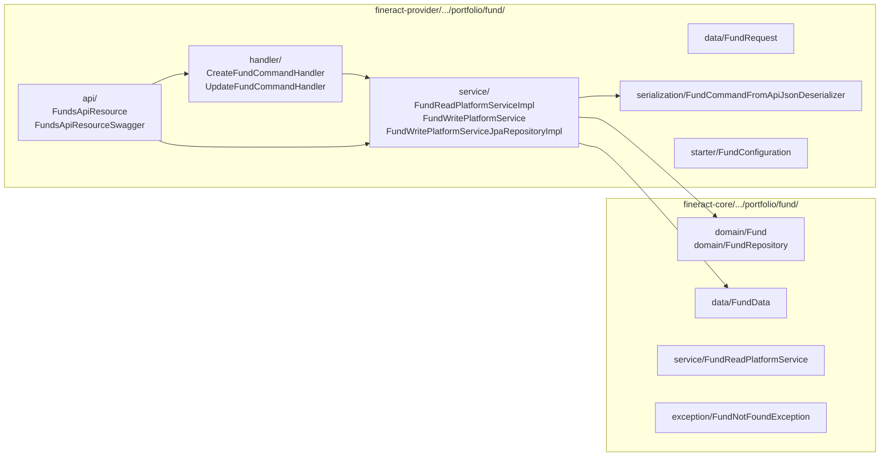
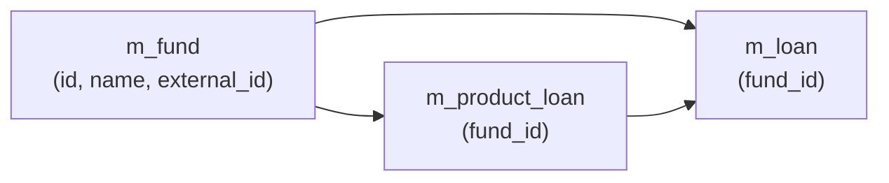
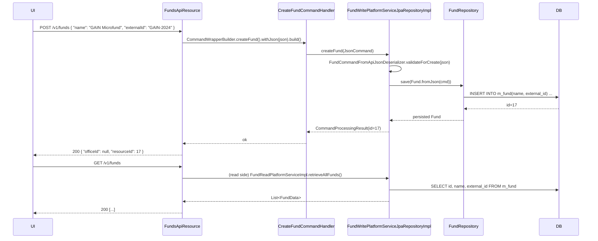

A **fund** in Apache Fineract is the simplest aggregate in the portfolio: a name and an external ID. It exists so that every loan and every loan product can be tagged with the *origin of the money it lends*. MFIs use this to report on donor‑funded vs self‑funded portfolios, to segregate concessional lending from commercial, and to satisfy compliance reporting that asks "which capital pool did this loan come out of?".

The entity owns no behaviour beyond create / update / list / read — there is no balance, no draw-down, no replenishment. It is a foreign-key target, deliberately minimal.

## Where the code lives



## `Fund` entity

`fineract-core/src/main/java/org/apache/fineract/portfolio/fund/domain/Fund.java` (`m_fund`):

```java
@Entity
@Table(name = "m_fund", uniqueConstraints = {
    @UniqueConstraint(columnNames = { "name" },        name = "fund_name_org"),
    @UniqueConstraint(columnNames = { "external_id" }, name = "fund_externalid_org") })
public class Fund extends AbstractPersistableCustom<Long> {

    @Getter @Column(name = "name")                        private String name;
    @Column(name = "external_id", length = 100)           private String externalId;

    public static Fund fromJson(final JsonCommand command) {
        final String name       = command.stringValueOfParameterNamed("name");
        final String externalId = command.stringValueOfParameterNamed("externalId");
        return new Fund(name, externalId);
    }

    public Map<String, Object> update(final JsonCommand command) { ... }
}
```

That is the entire class — two columns, two unique indexes:

| Column | Java field | Notes |
| --- | --- | --- |
| `name` | `name` | Required, globally unique. UI label. |
| `external_id` | `externalId` | Optional, globally unique when present. Lets an external donor system reference the fund. |

There is no `description`, no `currency_code`, no `effective_from`, no audit envelope. The entity extends `AbstractPersistableCustom<Long>`, not `AbstractAuditable...`.

### `update` semantics

The `update(JsonCommand)` method on `Fund` returns a `Map<String,Object>` of changed-fields (the *delta*), patching the entity in-place. This is the canonical pattern used by every Fineract write service that mutates an entity from a `JsonCommand`.

## REST: `FundsApiResource`

`fineract-provider/src/main/java/org/apache/fineract/portfolio/fund/api/FundsApiResource.java`:

```java
@Path("/v1/funds")
@Component
public class FundsApiResource {

  @GET                       String retrieveFunds(@Context UriInfo uriInfo)
  @POST                      String createFund(String apiRequestBodyAsJson)
  @GET @Path("{fundId}")     FundData retrieveFund(@PathParam("fundId") Long fundId)
  @PUT @Path("{fundId}")     String updateFund(@PathParam("fundId") Long fundId, String json)
}
```

There is **no `DELETE`**. A fund, once any loan or loan product references it, is effectively immortal — removing it would orphan an FK. The intentional omission keeps callers from creating dangling references. To "retire" a fund, MFIs typically rename it to something like `[CLOSED] Donor X 2018`.

## Request body: `FundRequest`

`fineract-provider/src/main/java/org/apache/fineract/portfolio/fund/data/FundRequest.java`:

```java
public class FundRequest {
    private String name;        // required for create; nullable on update
    private String externalId;  // optional
}
```

## Deserializer

`fineract-provider/.../portfolio/fund/serialization/FundCommandFromApiJsonDeserializer.java` enforces:

- On create: `name` is mandatory and ≤ 100 chars.
- On update: at least one of `name`/`externalId` must be present; both are nullable individually.
- No fields beyond `name`, `externalId`, `locale` are allowed in the JSON payload.

A new key in the JSON triggers `PlatformApiDataValidationException` — the standard Fineract "unsupported parameter" failure.

## Command handlers

`fineract-provider/src/main/java/org/apache/fineract/portfolio/fund/handler/`:

| Handler | `@CommandType` | Method on `FundWritePlatformService` |
| --- | --- | --- |
| `CreateFundCommandHandler` | `FUND / CREATE` | `createFund(JsonCommand)` |
| `UpdateFundCommandHandler` | `FUND / UPDATE` | `updateFund(Long fundId, JsonCommand)` |

`FundWritePlatformServiceJpaRepositoryImpl` does:

1. **Validate** through `FundCommandFromApiJsonDeserializer`.
2. **Load** (for update) via `FundRepository.findById(fundId).orElseThrow(() -> new FundNotFoundException(fundId))`.
3. **Persist** through `FundRepository.save(...)`.
4. **Catch** `DataIntegrityViolationException` → `handleFundDataIntegrityIssues(...)` which inspects the SQL error to produce a meaningful `PlatformDataIntegrityException`:
   - `fund_name_org` violation → `"error.msg.fund.duplicate.name"`.
   - `fund_externalid_org` violation → `"error.msg.fund.duplicate.externalId"`.

## Read service

`fineract-core/.../portfolio/fund/service/FundReadPlatformService.java` defines:

```java
public interface FundReadPlatformService {
    Collection<FundData> retrieveAllFunds();
    FundData retrieveFund(Long fundId);
}
```

`fineract-provider/.../portfolio/fund/service/FundReadPlatformServiceImpl.java` is a simple JdbcTemplate query — no joins, no enums to resolve:

```sql
SELECT f.id AS id, f.name AS name, f.external_id AS externalId FROM m_fund f
```

`FundData` (`fineract-core/.../portfolio/fund/data/FundData.java`) is a 3-field record.

## Relationship to loans

A fund is referenced from **two** places in the loan aggregate:



### On `LoanProduct`

`fineract-loan/.../portfolio/loanproduct/domain/LoanProduct.java`:

```java
@ManyToOne
@JoinColumn(name = "fund_id")
private Fund fund;        // default fund for loans of this product
```

When a loan officer originates a loan from a product, the product's default fund pre-fills the loan-creation form. The officer can override.

### On `Loan`

`fineract-loan/.../portfolio/loanaccount/domain/Loan.java`:

```java
@ManyToOne
@JoinColumn(name = "fund_id")
private Fund fund;        // the fund this specific loan was drawn from
```

The loan's `fund_id` is the source of truth for reports — *not* the product's, because the loan can override.

### Where the data is consumed

- **Loan reports** (`r_*` tables in standard reports) join `m_loan.fund_id` to `m_fund` to slice the portfolio by source.
- **Loan creation API** (`/v1/loans?command=...`) accepts `fundId` and validates it through `FundRepository` — `FundNotFoundException` if missing.
- **Loan product create / update** does the same on `fundId`.
- **Provisioning** does *not* segregate by fund — provisioning categories are product-scoped in `fineract-accounting/provisioning`.

## Exception

`fineract-core/.../portfolio/fund/exception/FundNotFoundException.java`:

```java
public class FundNotFoundException extends AbstractPlatformResourceNotFoundException {
    public FundNotFoundException(final Long id) {
        super("error.msg.fund.id.invalid", "Fund with identifier " + id + " does not exist", id);
    }
}
```

A 404 from `GET /v1/funds/{id}`, `PUT /v1/funds/{id}`, or any loan/product write that supplies a missing `fundId`.

## A complete CRUD round-trip



## Why so minimal?

The fund entity stays small on purpose:

- **No balance** — Fineract is a loan/savings ledger, not a treasury-management system. Tracking how much capital remains in a fund would duplicate accounting concerns better served by GL accounts and provisioning rules.
- **No currency** — a fund is a *label*, not money. Loans booked from the same fund can be in different currencies (a fund can be denominated in USD donor money but lend KES).
- **No effective-from/effective-to** — funds don't expire; they get superseded by new funds with new names.
- **No audit envelope** — the entity is treated as reference data, not transactional.

When MFIs need richer fund modelling (e.g. capital budgets, draw schedules, donor reporting), they typically build it as an external module that *references* `m_fund.id` rather than embedding the logic in Fineract.

## Permissions

The four operations each have a matching `m_permission` row:

| HTTP | Permission code |
| --- | --- |
| `GET /v1/funds`, `GET /v1/funds/{id}` | `READ_FUND` |
| `POST /v1/funds` | `CREATE_FUND` |
| `PUT /v1/funds/{id}` | `UPDATE_FUND` |

There is no `DELETE_FUND` permission because there is no delete endpoint.

Like every other reference-data resource, fund writes can be put behind *maker‑checker* by toggling `is_make_checker_enabled = true` on the matching permission row.

## Bulk-import target

Funds appear as a column on the **loan products** bulk-import template (`fineract-provider/.../infrastructure/bulkimport/`). The importer resolves `fundName` to a `fund_id` via `FundReadPlatformService.retrieveAllFunds()` and creates the loan product with the matching FK. If `fundName` doesn't exist it is **not auto-created** — the row fails with a validation error, by design: funds should be deliberately curated, not silently spawned.

## Why it is in `fineract-core`

Both `LoanProduct` and `Loan` live in `fineract-loan` and have `@ManyToOne` joins to `Fund`. To keep that compile-time relationship working without `fineract-loan` depending on `fineract-provider`, the `Fund` entity and its `FundRepository` had to land in `fineract-core` (the shared lowest-level module). Only the *write side* (the deserializer, the command handlers, the REST resource) stays in the provider.

## See also

<CardGroup cols={2}>
  <Card title="Clients" href="/portfolio/clients" icon="user">
    The other end of the loan: the borrower.
  </Card>
  <Card title="Collateral management" href="/portfolio/collateral-management" icon="lock">
    Sister reference-data subsystem — collateral types are similarly thin entities loans tag against.
  </Card>
</CardGroup>
