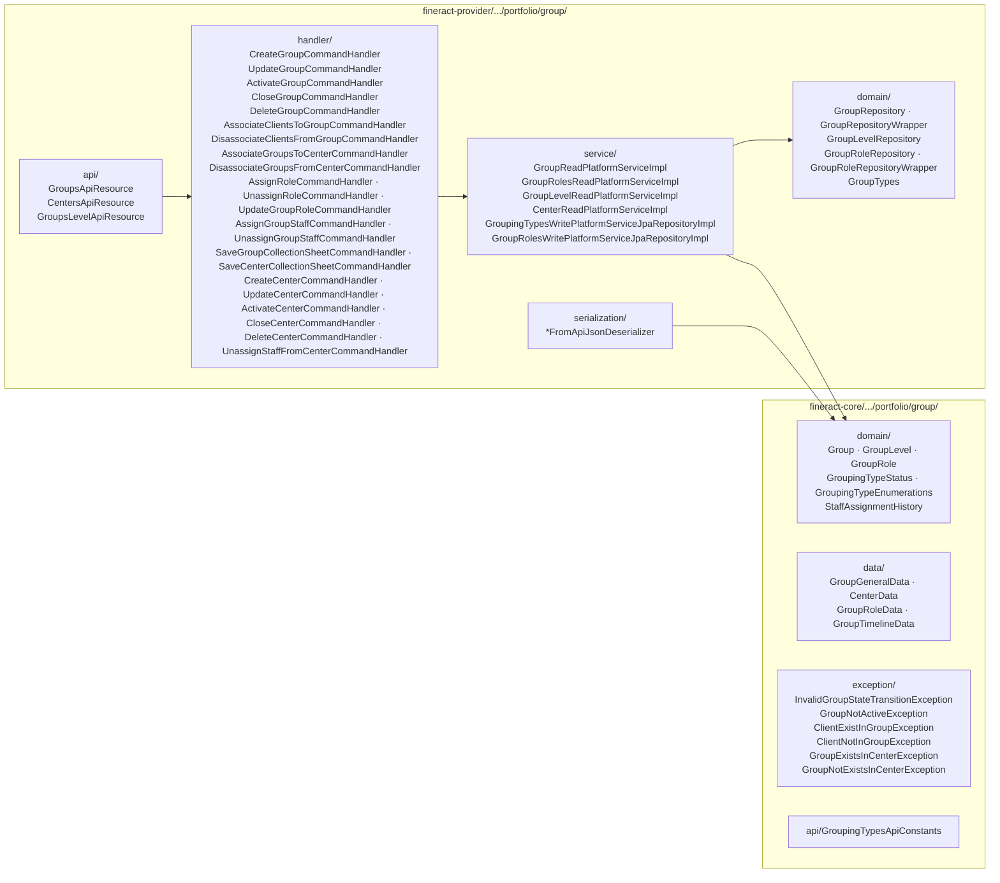
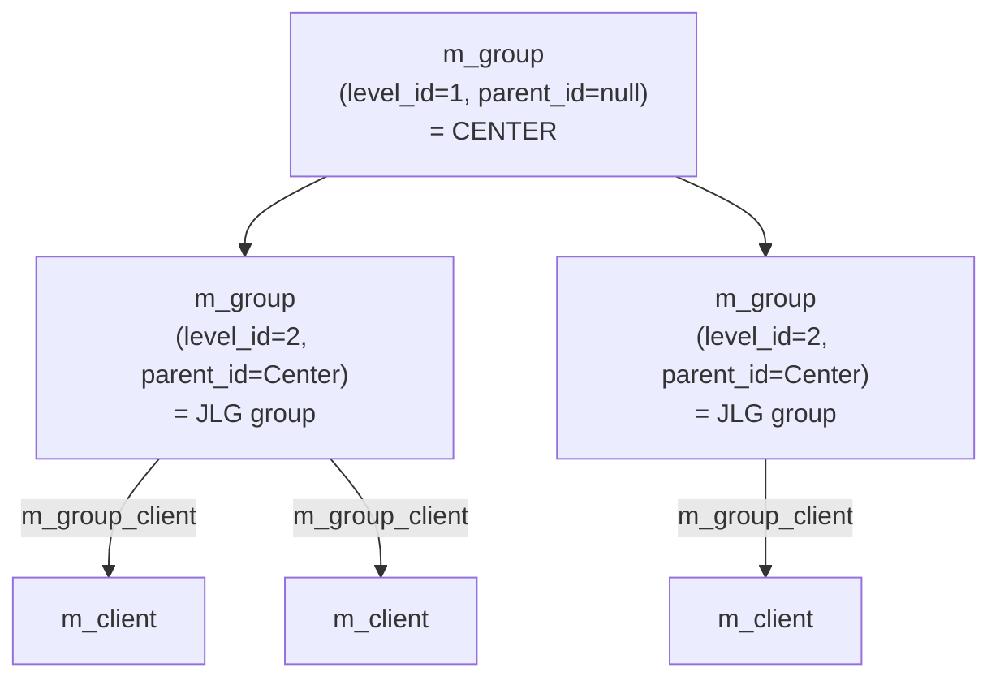
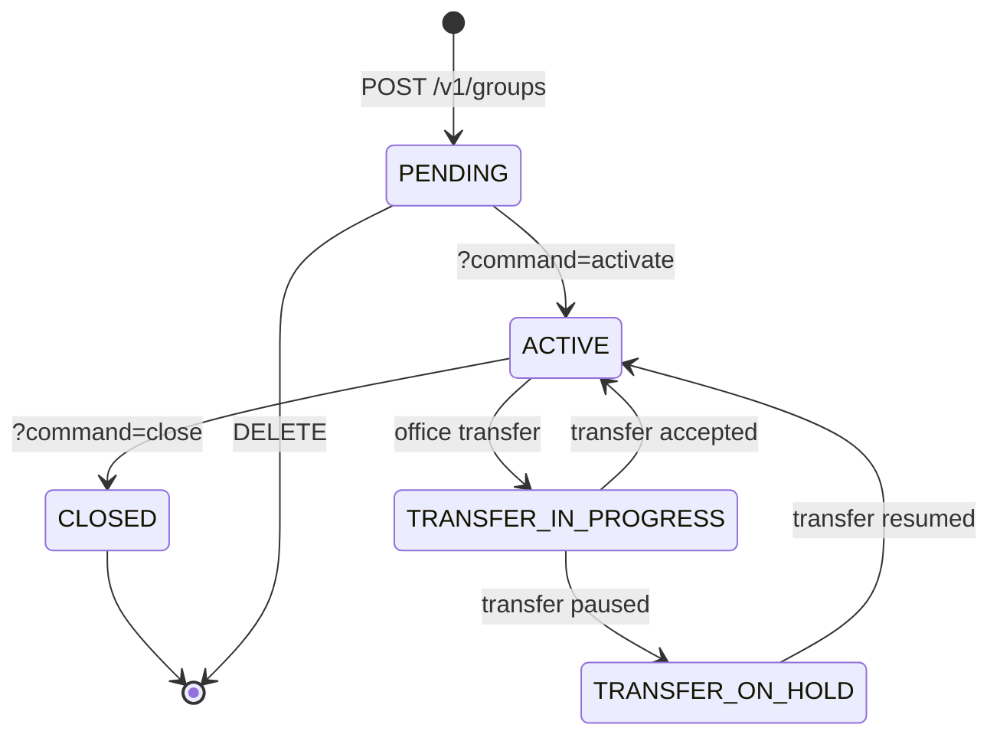

Apache Fineract's **groups** subsystem models the social structure that group-lending MFIs (Grameen-style, Joint Liability Group, village banking) need: clients organised into small peer groups, those groups optionally rolled up into *centers* that meet on a shared schedule, and a configurable role system so the *Chairperson*, *Secretary* and *Treasurer* aren't free-form text fields.

It is one entity, `Group`, doing triple duty: a JLG (level 2), a center (level 1), or anything else an MFI cares to define through `m_group_level`. The discriminator is `level_id`, not a subclass. This page maps the schema, the lifecycle, the REST surface and the relationship with [centers](/portfolio/centers), [meetings](/portfolio/meetings-and-calendars) and [collection sheets](/portfolio/collection-sheet).

## Two homes



## The `Group` entity

`fineract-core/src/main/java/org/apache/fineract/portfolio/group/domain/Group.java` (`m_group` table):

```java
@Entity
@Table(name = "m_group")
public final class Group extends AbstractPersistableCustom<Long> {

    @Column(name = "account_no", length = 20, unique = true, nullable = false) private String accountNumber;
    @Column(name = "external_id", length = 100, unique = true)                 private String externalId;
    @Column(name = "status_enum", nullable = false)                            private Integer status;

    @Column(name = "activation_date", nullable = true) private LocalDate activationDate;
    @ManyToOne @JoinColumn(name = "activatedon_userid", nullable = true) private AppUser activatedBy;

    @ManyToOne @JoinColumn(name = "office_id", nullable = false) private Office office;
    @ManyToOne @JoinColumn(name = "staff_id",  nullable = true)  private Staff staff;

    // self-reference — center holds groups, group holds clients
    @ManyToOne(fetch = FetchType.LAZY)
    @JoinColumn(name = "parent_id")          private Group parent;

    @OneToMany(fetch = FetchType.EAGER)
    @JoinColumn(name = "parent_id")          private List<Group> groupMembers; // children when this is a center

    @ManyToOne @JoinColumn(name = "level_id", nullable = false) private GroupLevel groupLevel;

    @Column(name = "display_name", length = 100, unique = true) private String name;
    @Column(name = "hierarchy", length = 100)                   private String hierarchy;

    @ManyToMany
    @JoinTable(name = "m_group_client",
               joinColumns        = @JoinColumn(name = "group_id"),
               inverseJoinColumns = @JoinColumn(name = "client_id"))
    private Set<Client> clientMembers;                                          // M:N

    // lifecycle bookkeeping
    @ManyToOne(fetch = FetchType.LAZY) @JoinColumn(name = "closure_reason_cv_id") private CodeValue closureReason;
    @Column(name = "closedon_date") private LocalDate closureDate;
    @ManyToOne(optional = true, fetch = FetchType.LAZY) @JoinColumn(name = "closedon_userid") private AppUser closedBy;
    @Column(name = "submittedon_date") private LocalDate submittedOnDate;
    @ManyToOne(optional = true, fetch = FetchType.LAZY) @JoinColumn(name = "submittedon_userid") private AppUser submittedBy;

    @OneToMany(cascade = CascadeType.ALL, mappedBy = "center", orphanRemoval = true)
    private Set<StaffAssignmentHistory> staffHistory;

    @OneToMany(mappedBy = "group", cascade = CascadeType.REMOVE)
    private Set<GroupRole> groupRole;
}
```

### Self-reference: how *center* and *group* live in one table

There is no `Center` class. A center is a `Group` whose `level_id` points to the `Center` row in `m_group_level`. Its children (regular groups) point back through `parent_id`.



The `hierarchy` text column materialises the full chain (`.<centerId>.<groupId>.`) and is what most read queries `LIKE`-filter against for office/user scoping.

## `GroupLevel`: the discriminator

`fineract-core/.../portfolio/group/domain/GroupLevel.java` (`m_group_level`):

```java
@Entity
@Table(name = "m_group_level")
public class GroupLevel extends AbstractPersistableCustom<Long> {
    @Column(name = "parent_id")                              private Long parentId;
    @Column(name = "super_parent", nullable = false)         private boolean superParent;
    @Column(name = "level_name", nullable = false, length = 100, unique = true) private String levelName;
    @Column(name = "recursable", nullable = false)           private boolean recursable;
    @Column(name = "can_have_clients", nullable = false)     private boolean canHaveClients;
}
```

Default seed (set by Liquibase changelog):

| `id` | `level_name` | `parent_id` | `super_parent` | `recursable` | `can_have_clients` |
| --- | --- | --- | --- | --- | --- |
| 1 | `Center` | NULL | `true` | `false` | `false` |
| 2 | `Group` | 1 | `false` | `false` | `true` |

So out of the box, *Center → Group → Client*. The flags exist so an MFI with deeper hierarchies (federation → cluster → village bank → SHG) can simply insert more rows.

### Two-level enum: `GroupTypes`

`fineract-provider/.../portfolio/group/domain/GroupTypes.java` is the Java-side mirror of the seed rows used by tests and external APIs:

```java
public enum GroupTypes {
    INVALID(0L, "lendingStrategy.invalid", "invalid"),
    CENTER (1L, "groupTypes.center",       "center"),
    GROUP  (2L, "groupTypes.group",        "group");
}
```

It is **not** authoritative — `GroupLevel` rows are. The enum is a convenience for code that needs to ask *is this a center?* without an extra join.

## `GroupRole`: role-based members

`fineract-core/.../portfolio/group/domain/GroupRole.java` (`m_group_roles`):

```java
@Entity
@Table(name = "m_group_roles")
public class GroupRole extends AbstractPersistableCustom<Long> {
    @ManyToOne(fetch = FetchType.LAZY) @JoinColumn(name = "group_id")   private Group group;
    @ManyToOne(fetch = FetchType.LAZY) @JoinColumn(name = "client_id")  private Client client;
    @ManyToOne(fetch = FetchType.LAZY) @JoinColumn(name = "role_cv_id") private CodeValue role;
}
```

Each row says *client X plays role R inside group G* where `R` is a `CodeValue` from the `GroupRoles` code (typical values: *Chairperson*, *Secretary*, *Treasurer*, *Member*).

Note `client_id` is constrained — only an existing group **member** (i.e. a row in `m_group_client`) can be assigned a role. The validation lives in `GroupRolesWritePlatformServiceJpaRepositoryImpl.createRole`.

## Lifecycle: `GroupingTypeStatus`

`fineract-core/.../portfolio/group/domain/GroupingTypeStatus.java`:

```java
public enum GroupingTypeStatus {
    INVALID(0),
    PENDING(100),
    ACTIVE(300),
    TRANSFER_IN_PROGRESS(303),
    TRANSFER_ON_HOLD(304),
    CLOSED(600);
}
```

Note groups have **no** `REJECTED`/`WITHDRAWN` — there's nothing to reject; you simply delete an unactivated draft group.



`InvalidGroupStateTransitionException` is thrown when a command targets a status it is not allowed for — e.g. trying to *associate clients* against a `PENDING` group whose `submittedOnDate` is after the proposed activation date.

## REST surface

### `/v1/groups` — generic groups

`fineract-provider/src/main/java/org/apache/fineract/portfolio/group/api/GroupsApiResource.java`:

```java
@Path("/v1/groups")
public class GroupsApiResource {
  @GET                                          String retrieveAll(...)
  @GET @Path("template")                        String retrieveTemplate(...)
  @GET @Path("{groupId}")                       String retrieveOne(@PathParam("groupId") Long groupId, ...)
  @POST                                         String create(String json)
  @PUT @Path("{groupId}")                       String update(@PathParam("groupId") Long groupId, ...)
  @DELETE @Path("{groupId}")                    String delete(@PathParam("groupId") Long groupId)
  @POST @Path("{groupId}/command/unassign_staff") String unassignLoanOfficer(...)
  @POST @Path("{groupId}")                      String activateOrGenerateCollectionSheet(@PathParam("groupId") Long groupId,
                                                                                         @QueryParam("command") String commandParam,
                                                                                         String json)
  @GET @Path("{groupId}/accounts")              String retrieveAccounts(...)
  @GET @Path("{groupId}/glimaccounts")          String retrieveglimAccounts(...)
  @GET @Path("{groupId}/gsimaccounts")          String retrieveGsimAccounts(...)
  @GET @Path("downloadtemplate")                Response getGroupsTemplate(...)
  @POST @Path("uploadtemplate")                 String postGroupTemplate(...)
}
```

The `?command=` switch on `POST /{groupId}` covers:

| `command` | Handler | Result |
| --- | --- | --- |
| `activate` | `ActivateGroupCommandHandler` | `PENDING → ACTIVE`, sets `activationDate`. |
| `close` | `CloseGroupCommandHandler` | `ACTIVE → CLOSED`, sets `closureDate` + `closureReason`. |
| `associateClients` | `AssociateClientsToGroupCommandHandler` | Inserts rows in `m_group_client`. |
| `disassociateClients` | `DisassociateClientsFromGroupCommandHandler` | Removes rows from `m_group_client`. |
| `transferClients` | `TransferClientsBetweenGroupsCommandHandler` | Moves clients across two groups within the same center. |
| `assignStaff` | `AssignGroupStaffCommandHandler` | Sets `staff_id`, opens a `StaffAssignmentHistory` row. |
| `unassignStaff` | `UnassignGroupStaffCommandHandler` | Closes the open `StaffAssignmentHistory`. |
| `saveCollectionSheet` | `SaveGroupCollectionSheetCommandHandler` | See [Collection sheet](/portfolio/collection-sheet). |
| `assignRole` | `AssignRoleCommandHandler` | Creates a `GroupRole` row. |
| `unassignRole` | `UnassignRoleCommandHandler` | Deletes a `GroupRole` row. |
| `updateRole` | `UpdateGroupRoleCommandHandler` | Replaces the client behind a `GroupRole`. |
| `generateCollectionSheet` | (read) | Returns the unsaved collection-sheet preview without mutating. |

### `/v1/grouplevels` — read-only

`fineract-provider/.../portfolio/group/api/GroupsLevelApiResource.java`:

```java
@Path("/v1/grouplevels")
public class GroupsLevelApiResource {
  @GET String retrieveAllLevels(@Context UriInfo uriInfo);
}
```

A single GET returning the seeded `m_group_level` rows. There is **no write API** — adding a new level is a DB-level migration, intentionally so. This keeps the hierarchy a deployment-time decision, not a runtime one.

### `/v1/centers` — centers as top-level groups

`fineract-provider/.../portfolio/group/api/CentersApiResource.java` is structurally identical to `GroupsApiResource` but scoped to `level_id = 1`:

```java
@Path("/v1/centers")
public class CentersApiResource {
  @GET                          retrieveAll(...)
  @GET @Path("template")        retrieveTemplate(...)
  @GET @Path("{centerId}")      retrieveOne(...)
  @POST                         create(...)
  @PUT @Path("{centerId}")      update(...)
  @DELETE @Path("{centerId}")   delete(...)
  @POST @Path("{centerId}")     activate(@QueryParam("command") cmd, ...)   // activate, close, etc.
  @GET @Path("{centerId}/accounts") retrieveGroupAccount(...)
  @GET @Path("downloadtemplate") ...
  @POST @Path("uploadtemplate") ...
}
```

Center-specific commands route through their own handlers (`CreateCenterCommandHandler`, `ActivateCenterCommandHandler`, `CloseCenterCommandHandler`, `UnassignStaffFromCenterCommandHandler`, etc.) — the *type discriminator* lets command audit retain `groupingType=center`. See [Centers](/portfolio/centers) for the full center walkthrough.

## JLG (Joint Liability Group) pattern

A Joint Liability Group is the canonical *cell* in microfinance: 4–10 women co-guarantee one another's loans. In Fineract this is just a normal `Group` whose `level_id` = 2. What makes it a JLG is:

1. **Children of a center.** `parent_id` points to a level-1 group.
2. **Synchronous repayment schedule.** A `Calendar` of `CalendarType.COLLECTION` is attached at the center level — every JLG loan under it inherits the center's repayment dates via `CalendarInstance` (entity type `LOAN`). See [Meetings & Calendars](/portfolio/meetings-and-calendars).
3. **Collection sheet driven.** The `JLGCollectionSheetData` flat row uses `m_group_client` membership × `m_calendar` recurrence × `m_loan_repayment_schedule` to drive a single weekly meeting screen. See [Collection sheet](/portfolio/collection-sheet).

The trust-group / village-banking variant is just a JLG whose loans are GLIM/GSIM (Group Loan Individual Monitoring) — `GroupsApiResource.retrieveglimAccounts` and `retrieveGsimAccounts` exist to read these.

## Read service: `GroupReadPlatformServiceImpl`

`fineract-provider/.../portfolio/group/service/GroupReadPlatformServiceImpl.java` — JDBC; the main entry points return `GroupGeneralData`:

- `retrieveAll(SearchParameters)` — paginated, with optional `staffId`/`officeId`/`status`/`name`/`hierarchy` filters.
- `retrieveOne(groupId)` — single row plus parent center, staff, level metadata.
- `retrieveGroupWithClosureReasons` — used by the close-group screen.
- `retrieveTemplate(officeId, staffId)` — populates the *Create group* form (offices, parents, calendars).

`CenterReadPlatformServiceImpl` is the same idea, scoped through a `WHERE level_id = 1` filter and projecting `CenterData` (in `fineract-core/.../portfolio/group/data/`).

## Group ↔ Client membership rules

The write service enforces:

- A `Group` can hold clients only when `m_group_level.can_have_clients = true` — i.e. usually only level 2.
- Adding a client whose `office_id` differs from the group's raises `ClientHasBeenClosedException` / `InvalidOfficeException`.
- Deleting a group whose `m_group_client` is non-empty raises `ClientExistInGroupException`.
- Closing a group with open loans/savings raises `InvalidGroupStateTransitionException`.

For center↔group membership the parallel exceptions are `GroupExistsInCenterException` and `GroupNotExistsInCenterException`.

## Storage shape

```sql
-- m_group
id, account_no, external_id, status_enum, activation_date, activatedon_userid,
office_id, staff_id, parent_id, level_id, display_name, hierarchy,
closure_reason_cv_id, closedon_date, closedon_userid,
submittedon_date, submittedon_userid

-- m_group_client (M:N)
group_id  -> m_group.id
client_id -> m_client.id

-- m_group_roles
id, group_id, client_id, role_cv_id

-- m_group_level
id, parent_id, super_parent, level_name, recursable, can_have_clients

-- m_staff_assignment_history (audit, OneToMany on Group.staffHistory)
id, center_id, staff_id, start_date, end_date, ...
```

## See also

<CardGroup cols={2}>
  <Card title="Centers" href="/portfolio/centers" icon="building">
    The level-1 specialisation of `Group`.
  </Card>
  <Card title="Meetings & Calendars" href="/portfolio/meetings-and-calendars" icon="calendar">
    How a recurring schedule attaches to a group/center.
  </Card>
  <Card title="Collection sheet" href="/portfolio/collection-sheet" icon="clipboard-list">
    The weekly aggregate of dues per group, generated and saved through `SaveGroupCollectionSheetCommandHandler`.
  </Card>
  <Card title="Transfers" href="/portfolio/transfers" icon="arrow-right-arrow-left">
    What `TRANSFER_IN_PROGRESS`/`TRANSFER_ON_HOLD` mean for a group.
  </Card>
</CardGroup>
