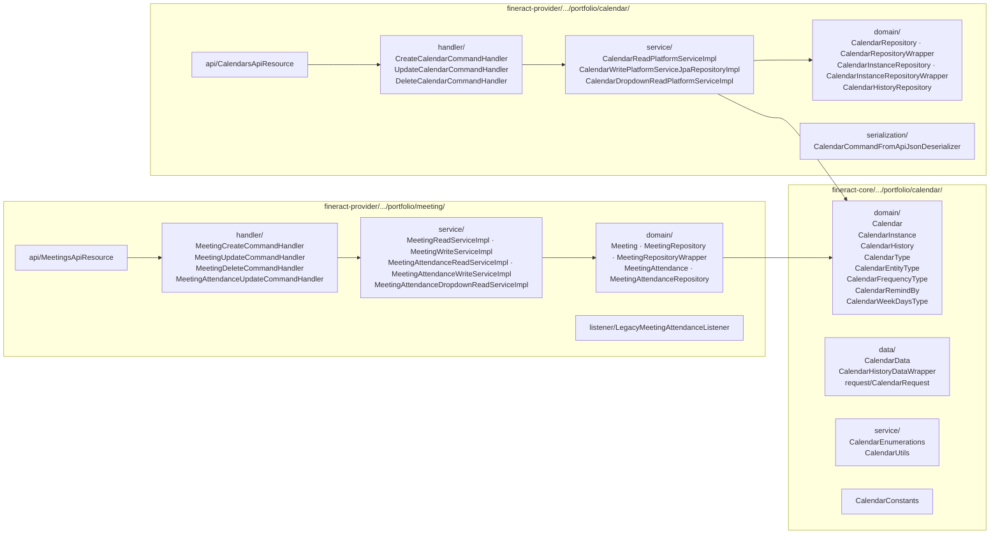
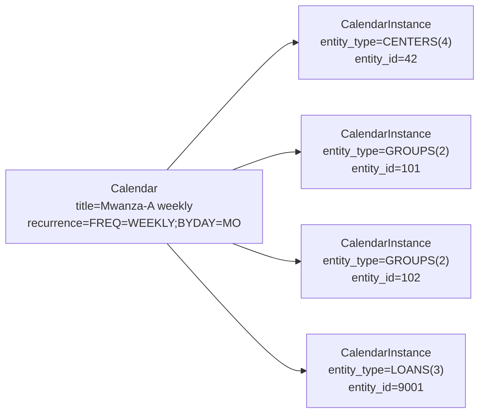
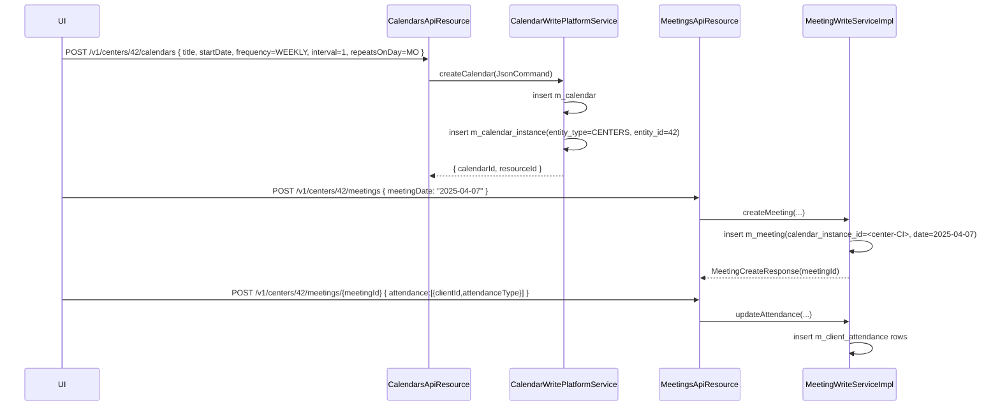

The **calendar** subsystem is Apache Fineract's general-purpose recurrence engine. It models *when* something happens — a JLG meeting, a training session, an audit — using an iCal-style `recurrence` string. The **meeting** subsystem rides on top: every visit becomes a row in `m_meeting`, every attendance mark becomes a row in `m_client_attendance`.

Crucially, the calendar is also the **source of truth for repayment dates** of group loans. When you create a `Calendar` of type `COLLECTION` on a [center](/portfolio/centers) and attach a loan to it via a `CalendarInstance` (`entity_type=LOANS`), the loan's repayment schedule generator reads the recurrence directly — there is no separate "loan schedule" pattern.

## Two homes



## Calendar entity

`fineract-core/src/main/java/org/apache/fineract/portfolio/calendar/domain/Calendar.java` (`m_calendar`):

```java
@Entity
@Table(name = "m_calendar")
public class Calendar extends AbstractAuditableWithUTCDateTimeCustom<Long> {
    @Column(name = "title",        length = 50,  nullable = false) private String title;
    @Column(name = "description",  length = 100)                  private String description;
    @Column(name = "location",     length = 100)                  private String location;
    @Column(name = "start_date",   nullable = false)              private LocalDate startDate;
    @Column(name = "end_date")                                     private LocalDate endDate;
    @Column(name = "duration")                                     private Integer duration;
    @Column(name = "calendar_type_enum", nullable = false)         private Integer typeId;       // CalendarType
    @Column(name = "repeating",     nullable = false)              private boolean repeating;
    @Column(name = "recurrence",    length = 100)                  private String recurrence;    // iCal RRULE
    @Column(name = "remind_by_enum")                               private Integer remindById;   // CalendarRemindBy
    @Column(name = "first_reminder")                               private Integer firstReminder;
    @Column(name = "second_reminder")                              private Integer secondReminder;
    @Column(name = "meeting_time")                                 private LocalTime meetingtime;
}
```

### `CalendarType`

```java
public enum CalendarType {
    COLLECTION(1), TRAINING(2), AUDIT(3), GENERAL(4);
}
```

`COLLECTION` is the one that matters operationally — it is what loan repayment schedules and collection-sheet generation key off.

### `CalendarFrequencyType`

`fineract-core/.../portfolio/calendar/domain/CalendarFrequencyType.java`:

```java
public enum CalendarFrequencyType {
    INVALID(0),
    DAILY(1),
    WEEKLY(2),
    MONTHLY(3),
    YEARLY(4);
}
```

It is not stored on `Calendar` as a column — it is parsed *out of* the `recurrence` string by `CalendarUtils` (`fineract-core/.../portfolio/calendar/service/CalendarUtils.java`). The `recurrence` is an iCal-style RRULE such as:

```
FREQ=WEEKLY;INTERVAL=1;BYDAY=MO
FREQ=MONTHLY;INTERVAL=1;BYMONTHDAY=15
```

`CalendarUtils.getFirstRepaymentMeetingDate(...)`, `getNextRecurringDate(...)` and `getRecurringDates(...)` are the read-side primitives consumed by the loan schedule generator and the meetings UI.

### `CalendarRemindBy`

```java
public enum CalendarRemindBy { EMAIL(1), SMS(2); }
```

`first_reminder` / `second_reminder` are *day offsets* (positive integers) before the meeting.

### `CalendarWeekDaysType`

ISO-style codes `MO/TU/WE/TH/FR/SA/SU` mapped to `1..7` — used when serialising the `BYDAY` part of an RRULE.

## Calendar instance: the polymorphic glue

A `Calendar` is not directly attached to a center/group/loan; it is attached through `CalendarInstance` so the **same** calendar row can drive a center, all its child groups, **and** all loans booked under those groups, without duplication.

`fineract-core/.../portfolio/calendar/domain/CalendarInstance.java` (`m_calendar_instance`):

```java
@Entity
@Table(name = "m_calendar_instance")
public class CalendarInstance extends AbstractPersistableCustom<Long> {
    @ManyToOne(cascade = CascadeType.PERSIST)
    @JoinColumn(name = "calendar_id", nullable = false) private Calendar calendar;
    @Column(name = "entity_id",        nullable = false) private Long entityId;       // PK of the target row
    @Column(name = "entity_type_enum", nullable = false) private Integer entityTypeId;// CalendarEntityType
}
```

### `CalendarEntityType`

`fineract-core/.../portfolio/calendar/domain/CalendarEntityType.java`:

```java
public enum CalendarEntityType {
    INVALID(0),
    CLIENTS(1),
    GROUPS(2),
    LOANS(3),
    CENTERS(4),
    SAVINGS(5),
    LOAN_RECALCULATION_REST_DETAIL(6),
    LOAN_RECALCULATION_COMPOUNDING_DETAIL(7);
}
```

So a single center calendar can have many instances:



## How calendars drive loan repayment dates

When a new loan is created against a center/group that has a `COLLECTION` calendar, the loan write service creates an additional `CalendarInstance(entity_type=LOANS, entity_id=loanId)` referencing the **same** `Calendar`. From then on:

1. The loan repayment schedule generator (in `fineract-loan/.../loanaccount/loanschedule/`) walks `Calendar.recurrence` via `CalendarUtils.getRecurringDates(startDate, recurrence, ...)`.
2. If the calendar's `recurrence` ever changes mid-life, the *old* RRULE is archived into `m_calendar_history` (entity `CalendarHistory`) so the original schedule is reproducible.
3. `MeetingFrequencyMismatchException` is raised by `CalendarWritePlatformService` if a caller tries to attach a loan to a calendar whose frequency conflicts with the loan product's `repayment_period_frequency_enum`.

## `CalendarsApiResource`

`fineract-provider/.../portfolio/calendar/api/CalendarsApiResource.java`:

```java
@Path("/v1/{entityType}/{entityId}/calendars")
public class CalendarsApiResource {

  @GET                                CalendarData retrieveCalendar(@PathParam("calendarId") Long calendarId, ...)
  @GET @Path("template")              CalendarData retrieveNewCalendarDetails(...)
  @GET                                List<CalendarData> retrieveCalendarsByEntity(@PathParam("entityType") String entityType,
                                                                                   @PathParam("entityId") Long entityId, ...)
  @POST                               CommandProcessingResult createCalendar(@PathParam("entityType") String entityType,
                                                                            @PathParam("entityId") Long entityId,
                                                                            CalendarRequest calendarRequest)
  @PUT @Path("{calendarId}")          CommandProcessingResult updateCalendar(... String jsonRequestBody)
  @DELETE @Path("{calendarId}")       CommandProcessingResult deleteCalendar(...)
}
```

`{entityType}` is the API-URL spelling of `CalendarEntityType`: `centers`, `groups`, `clients`, `loans`, `savings`. The resource looks the string up via the `apiUrl` of the enum (`CalendarEntityType.fromString(...)` style helper in `CalendarConstants`).

### Allowed input parameters

From `fineract-core/.../portfolio/calendar/CalendarConstants.java`, the `CalendarSupportedParameters` enum enumerates every JSON key the deserializer accepts:

`id, entityType, entityId, title, description, location, startDate, endDate, createdDate, duration, typeId, repeating, remindById, firstReminder, secondReminder, locale, dateFormat, frequency, interval, repeatsOnDay, reschedulebasedOnMeetingDates, presentMeetingDate, newMeetingDate, meetingtime, timeFormat, ...`

`CalendarCommandFromApiJsonDeserializer` rejects unknown keys and applies type validation.

### Reschedule semantics

A non-trivial concern: if the MFI shifts a center's meeting from Monday to Thursday mid-year, what happens to next week's instalment? The `reschedulebasedOnMeetingDates` flag (with `presentMeetingDate` and `newMeetingDate`) tells `CalendarWritePlatformServiceJpaRepositoryImpl.updateCalendar` to:

1. Snapshot the current `Calendar` row into `CalendarHistory`.
2. Apply the new RRULE.
3. Walk every linked loan and re-anchor its remaining schedule from `newMeetingDate`.

If `reschedulebasedOnMeetingDates=false`, only future installments slide; the past stays untouched.

## Meeting entity

`fineract-provider/src/main/java/org/apache/fineract/portfolio/meeting/domain/Meeting.java`:

```java
@Entity
@Table(name = "m_meeting")
public class Meeting extends AbstractPersistableCustom<Long> {
    @ManyToOne
    @JoinColumn(name = "calendar_instance_id", nullable = false) private CalendarInstance calendarInstance;
    @Column(name = "meeting_date",     nullable = false)         private LocalDate meetingDate;
}
```

A meeting is a **single occurrence** of the calendar's recurrence — i.e. a single (calendar_instance, date) tuple — augmented with attendance.

## Attendance: `MeetingAttendance` / `ClientAttendance`

`fineract-provider/.../portfolio/meeting/domain/MeetingAttendance.java`:

```java
@Entity
@Table(name = "m_client_attendance")
public class MeetingAttendance extends AbstractPersistableCustom<Long> {
    @ManyToOne @JoinColumn(name = "meeting_id", nullable = false) private Meeting meeting;
    @ManyToOne @JoinColumn(name = "client_id",  nullable = false) private Client client;
    @Column(name = "attendance_type_enum", nullable = false) private Integer attendanceTypeId;
}
```

`MeetingAttendanceType` (`fineract-provider/.../portfolio/meeting/data/MeetingAttendanceType.java`) enumerates `PRESENT`, `ABSENT`, `APPROVED`, `LEAVE`, `LATE` (per the seeded enumerations). The Java enum and the table name (`m_client_attendance`) carry the *legacy* name from before the refactor — both spellings coexist in the codebase.

## `MeetingsApiResource`

`fineract-provider/.../portfolio/meeting/api/MeetingsApiResource.java`:

```java
@Path("/v1/{entityType}/{entityId}/meetings")
public class MeetingsApiResource {

  @GET @Path("template")               MeetingData template(...)
  @GET                                 Collection<MeetingData> retrieveMeetings(@QueryParam("limit") Integer limit, ...)
  @GET @Path("{meetingId}")            MeetingData retrieveMeeting(...)
  @POST                                MeetingCreateResponse createMeeting(...)
  @PUT @Path("{meetingId}")            MeetingUpdateResponse updateMeeting(...)
  @DELETE @Path("{meetingId}")         MeetingDeleteResponse deleteMeeting(...)
  @POST @Path("{meetingId}")           MeetingAttendanceUpdateResponse updateMeetingAttendance(...)  // attendance command
}
```

`{entityType}` is again `centers|groups|clients` — the meeting hangs off the same CalendarEntityType the meeting was created against.

### Commands

| HTTP | Command | Handler |
| --- | --- | --- |
| `POST .../{entityType}/{entityId}/meetings` | `CREATE_MEETING` | `MeetingCreateCommandHandler` |
| `PUT .../meetings/{id}` | `UPDATE_MEETING` | `MeetingUpdateCommandHandler` |
| `DELETE .../meetings/{id}` | `DELETE_MEETING` | `MeetingDeleteCommandHandler` |
| `POST .../meetings/{id}` | `SAVEORUPDATEATTENDANCE_MEETING` | `MeetingAttendanceUpdateCommandHandler` |

### `LegacyMeetingAttendanceListener`

`fineract-provider/.../portfolio/meeting/listener/LegacyMeetingAttendanceListener.java` is the *bridge* to the older event bus — it consumes attendance‑mark events and forwards them to legacy consumers (e.g. report tables). Modern attendance reads should use `MeetingAttendanceReadServiceImpl` directly.

## Read-side: dropdowns and stats

- `CalendarDropdownReadPlatformServiceImpl` — `Map<Long,String>` of calendar types, frequencies, reminder modes for forms.
- `CalendarReadPlatformServiceImpl.retrieveCalendarsByEntity(...)` — back-fills the `Calendars` tab on a center/group/loan page.
- `MeetingAttendanceReadServiceImpl.retrieveMeetingAttendanceByMeetingId(...)` — used by `MeetingsApiResource` to render the attendance grid.
- `MeetingAttendanceDropdownReadServiceImpl.retrieveAttendanceTypeOptions()` — populates the *Attendance type* `<select>`.

## Exceptions

`fineract-provider/.../portfolio/calendar/exception/`:

- `CalendarNotFoundException` — unknown `calendarId`.
- `CalendarInstanceNotFoundException` — no `m_calendar_instance` for the given `(entityType, entityId)`.
- `CalendarEntityTypeNotSupportedException` — caller passed an `entityType` outside `CalendarEntityType`.
- `MeetingFrequencyMismatchException` — loan attaches to a calendar with an incompatible RRULE.

`fineract-core/.../portfolio/calendar/exception/`:

- `CalendarDateException` — `startDate > endDate`, or the supplied recurring date is invalid.
- `CalendarParameterUpdateNotSupportedException` — caller tried to update an immutable parameter (e.g. `entityType`).
- `NotValidRecurringDateException` — the date supplied in `presentMeetingDate` is not actually a valid occurrence of the existing RRULE.

`fineract-provider/.../portfolio/meeting/exception/`:

- `MeetingNotFoundException`
- `MeetingDateException` — meeting date does not fall on a valid occurrence.
- `MeetingNotSupportedResourceException` — meetings called against an unsupported entity type.

## End-to-end: creating a weekly meeting on a center



## See also

<CardGroup cols={2}>
  <Card title="Centers" href="/portfolio/centers" icon="building">
    The most common owner of a `COLLECTION` calendar.
  </Card>
  <Card title="Groups" href="/portfolio/groups" icon="people-group">
    Child groups inherit the center calendar through their own `CalendarInstance`.
  </Card>
  <Card title="Collection sheet" href="/portfolio/collection-sheet" icon="clipboard-list">
    Uses the calendar's next occurrence as the "due-on" date.
  </Card>
</CardGroup>
