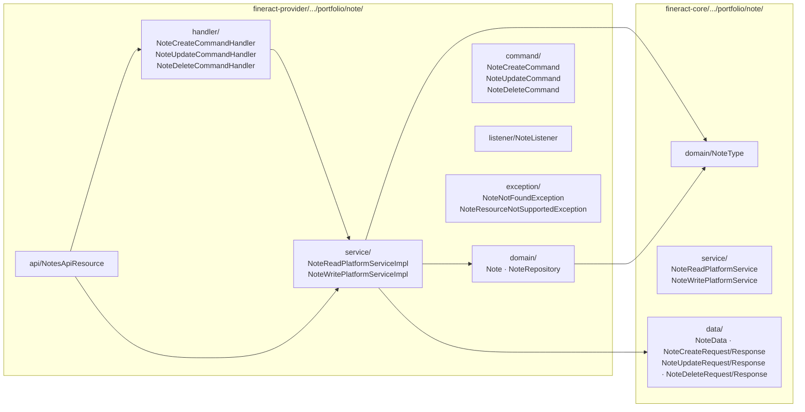
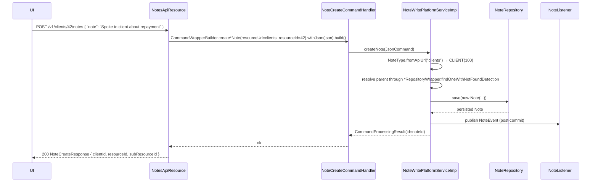

The **notes** subsystem is the small, generic free-text annotation layer that lets users — loan officers, supervisors, auditors — attach a short comment to virtually any portfolio entity in Apache Fineract. It is a single `Note` entity with seven optional `@ManyToOne` columns (one per attachable parent type), and a single REST resource that polymorphically dispatches on the URL prefix.

The pattern is *one entity, seven columns, one resource* — chosen specifically to avoid a per-type proliferation of `ClientNote`, `LoanNote`, `SavingsNote` tables. Only one of the seven `@JoinColumn` fields is ever non-null for a given row, selected by `note_type_enum`.

## Where the code lives



## The `Note` entity — polymorphic by sparse FK

`fineract-provider/src/main/java/org/apache/fineract/portfolio/note/domain/Note.java` (`m_note`):

```java
@Entity
@Table(name = "m_note")
public class Note extends AbstractAuditableWithUTCDateTimeCustom<Long> {

    @ManyToOne @JoinColumn(name = "client_id",                     nullable = true) private Client client;
    @ManyToOne @JoinColumn(name = "group_id",                      nullable = true) private Group group;
    @ManyToOne @JoinColumn(name = "loan_id",                       nullable = true) private Loan loan;
    @ManyToOne @JoinColumn(name = "loan_transaction_id",           nullable = true) private LoanTransaction loanTransaction;
    @ManyToOne @JoinColumn(name = "savings_account_id",            nullable = true) private SavingsAccount savingsAccount;
    @ManyToOne @JoinColumn(name = "savings_account_transaction_id",nullable = true) private SavingsAccountTransaction savingsAccountTransaction;
    @ManyToOne @JoinColumn(name = "share_account_id",              nullable = true) private ShareAccount shareAccount;

    @Column(name = "note",           length = 1000) private String note;
    @Column(name = "note_type_enum")               private Integer noteTypeId;
}
```

### Invariant

For every row, **exactly one** of the seven FK columns is non-null, and `note_type_enum` matches it according to `NoteType`. The write service enforces this in `NoteWritePlatformServiceImpl.createNote(...)`:

```java
final NoteType type = NoteType.fromApiUrl(resourceUrl);
if (type == null) throw new NoteResourceNotSupportedException(resourceUrl);
switch (type) {
  case CLIENT             -> note.setClient(client);
  case GROUP              -> note.setGroup(group);
  case LOAN               -> note.setLoan(loan);
  case LOAN_TRANSACTION   -> note.setLoanTransaction(tx);
  case SAVING_ACCOUNT     -> note.setSavingsAccount(sa);
  case SAVINGS_TRANSACTION-> note.setSavingsAccountTransaction(sat);
  case SHARE_ACCOUNT      -> note.setShareAccount(shareAcc);
}
note.setNoteTypeId(type.getValue());
```

### `NoteType` enum

`fineract-core/src/main/java/org/apache/fineract/portfolio/note/domain/NoteType.java`:

```java
public enum NoteType {
    CLIENT             (100, "noteType.client",              "clients",            "Client note"),
    LOAN               (200, "noteType.loan",                "loans",              "Loan note"),
    LOAN_TRANSACTION   (300, "noteType.loan.transaction",    "loanTransactions",   "Loan transaction note"),
    SAVING_ACCOUNT     (500, "noteType.saving",              "savings",            " account note"),
    GROUP              (600, "noteType.group",               "groups",             "Group note"),
    SHARE_ACCOUNT      (700, "noteType.shares",              "accounts/share",     "Share account note"),
    SAVINGS_TRANSACTION(800, "noteType.savings.transaction", "savingsTransactions","Savings transaction note");
}
```

Two static maps make the enum reversible by `value` and by `apiUrl`:

```java
public static NoteType fromInt(int i);
public static NoteType fromApiUrl(String url);
```

`fromApiUrl` is what `NotesApiResource` calls with the value of `{resourceType}` from the path — this is **the** mechanism that lets one resource serve every parent type.

## The single REST resource: `NotesApiResource`

`fineract-provider/src/main/java/org/apache/fineract/portfolio/note/api/NotesApiResource.java`:

```java
@Path("/v1/{resourceType:.+}/{resourceId}/notes")
public class NotesApiResource {

  @GET                    List<NoteData> retrieveNotesByResource(@PathParam("resourceType") String resourceType,
                                                                @PathParam("resourceId")   Long   resourceId)
  @GET @Path("{noteId}")  NoteData       retrieveNote(@PathParam("resourceType") String, ...)

  @POST                   NoteCreateResponse addNewNote(@PathParam("resourceType") String resourceType,
                                                       @PathParam("resourceId")   Long   resourceId,
                                                       @Valid final NoteCreateRequest request)

  @PUT @Path("{noteId}")    NoteUpdateResponse updateNote(@PathParam("resourceType") String resourceType,
                                                          @PathParam("resourceId")   Long   resourceId,
                                                          @PathParam("noteId")       Long   noteId,
                                                          @Valid NoteUpdateRequest request)

  @DELETE @Path("{noteId}") NoteDeleteResponse deleteNote(@PathParam("resourceType") String resourceType,
                                                          @PathParam("resourceId")   Long   resourceId,
                                                          @PathParam("noteId")       Long   noteId)
}
```

### Path templates the resource accepts

The regex `{resourceType:.+}` is intentionally permissive so that *nested* parent paths (specifically `accounts/share`) match. Concretely:

| URL prefix | `resourceType` value | `NoteType` |
| --- | --- | --- |
| `/v1/clients/{id}/notes` | `clients` | `CLIENT(100)` |
| `/v1/loans/{id}/notes` | `loans` | `LOAN(200)` |
| `/v1/loanTransactions/{id}/notes` | `loanTransactions` | `LOAN_TRANSACTION(300)` |
| `/v1/savings/{id}/notes` | `savings` | `SAVING_ACCOUNT(500)` |
| `/v1/groups/{id}/notes` | `groups` | `GROUP(600)` |
| `/v1/accounts/share/{id}/notes` | `accounts/share` | `SHARE_ACCOUNT(700)` |
| `/v1/savingsTransactions/{id}/notes` | `savingsTransactions` | `SAVINGS_TRANSACTION(800)` |

Any other prefix triggers `NoteResourceNotSupportedException`.

<Info>
This is one of only a handful of resources in Fineract whose `@Path` uses a regex group. The other big offender is `NotesApiResource`'s sibling, the Documents API.
</Info>

## Request/response shapes

`fineract-core/.../portfolio/note/data/`:

```java
public record NoteCreateRequest (
    String note,            // ≤ 1000 chars
    String locale,
    String dateFormat
) {}

public record NoteCreateResponse (
    Long officeId,
    Long groupId,
    Long clientId,
    Long loanId,
    Long savingsId,
    Long resourceId,
    Long subResourceId      // == note row's PK
) {}

public record NoteUpdateRequest (String note, String locale, String dateFormat) {}
public record NoteUpdateResponse(Long officeId, Long groupId, Long clientId,
                                 Long loanId, Long savingsId, Long resourceId,
                                 Long subResourceId, Map<String,Object> changes) {}

public record NoteDeleteRequest () {}
public record NoteDeleteResponse(Long officeId, Long groupId, Long clientId,
                                 Long loanId, Long savingsId, Long resourceId,
                                 Long subResourceId) {}

public final class NoteData {
    private Long id;
    private Long clientId;
    private Long groupId;
    private Long loanId;
    private Long loanTransactionId;
    private Long savingsAccountId;
    private Long shareAccountId;
    private EnumOptionData noteType;
    private String note;
    private OffsetDateTime createdOn;     // audit
    private Long createdById;
    private String createdByUsername;
    private OffsetDateTime updatedOn;
    private Long updatedById;
    private String updatedByUsername;
}
```

## Command lifecycle



### Three handlers

`fineract-provider/.../portfolio/note/handler/`:

| Handler | `@CommandType` | Method |
| --- | --- | --- |
| `NoteCreateCommandHandler` | `CLIENTNOTE / CREATE` (and the 6 siblings — `GROUPNOTE/CREATE`, `LOANNOTE/CREATE`, ...) | `NoteWritePlatformService.createNote(...)` |
| `NoteUpdateCommandHandler` | `*NOTE / UPDATE` | `updateNote(...)` |
| `NoteDeleteCommandHandler` | `*NOTE / DELETE` | `deleteNote(...)` |

There are 21 `@CommandType` permutations registered (7 parent types × 3 verbs) but only 3 handler classes — the resource side discriminates by URL, the handlers themselves do not branch on parent.

## Listener

`fineract-provider/.../portfolio/note/listener/NoteListener.java` subscribes to the application event bus to react when a note is added. It is used by Fineract's notification framework to push a *"New note on client X by user Y"* event — out of the box it is registered but inert; products override it.

## Read service

`fineract-provider/.../portfolio/note/service/NoteReadPlatformServiceImpl.java` runs three JDBC queries:

- `retrieveNotesByResource(resourceId, noteTypeId)` — list backing `GET /v1/{type}/{id}/notes`. Joins `m_note` against `m_appuser` twice to resolve `created_by`/`last_modified_by` usernames.
- `retrieveNote(noteId, resourceId, noteTypeId)` — single row variant.
- `getNoteById(noteId)` — internal helper.

The mapper projects into `NoteData` (in `fineract-core/.../portfolio/note/data/NoteData.java`) including the resolved `EnumOptionData` for `noteType`.

## Validation

`NoteCommand` siblings (`NoteCreateCommand`, `NoteUpdateCommand`, `NoteDeleteCommand`) in `fineract-provider/.../portfolio/note/command/` enforce the only real rule:

- `note` is required for create and update.
- `note` ≤ 1000 chars (matches the `m_note.note VARCHAR(1000)` column).

Deletion has no rule.

## Storage shape

```sql
-- m_note
id                              bigint   PK
client_id                       bigint   FK -> m_client.id              (nullable)
group_id                        bigint   FK -> m_group.id               (nullable)
loan_id                         bigint   FK -> m_loan.id                (nullable)
loan_transaction_id             bigint   FK -> m_loan_transaction.id    (nullable)
savings_account_id              bigint   FK -> m_savings_account.id     (nullable)
savings_account_transaction_id  bigint   FK -> m_savings_account_transaction.id (nullable)
share_account_id                bigint   FK -> m_share_account.id       (nullable)
note                            varchar(1000)
note_type_enum                  int
created_on_utc, created_by_id, last_modified_on_utc, last_modified_by_id  -- audit envelope
```

A check‑constraint to enforce "exactly one FK non-null" is *not* present in the default Liquibase changesets — the invariant is upheld at write time by `NoteWritePlatformServiceImpl`.

## Exceptions

`fineract-provider/.../portfolio/note/exception/`:

- `NoteNotFoundException` — 404 from `NoteRepository.findById` miss.
- `NoteResourceNotSupportedException` — 400 when `{resourceType}` does not map to a `NoteType.apiUrl`.

## When to use it

- For human-readable annotations only — there's no machine-parsed structure on notes.
- For audit observations during loan/savings transaction (e.g. *"Customer paid with foreign currency, used today's rate"*).
- For "next-call" reminders during arrears collection — though the dedicated collateral / collection workflow modules are better choices.

It is **not** a chat thread (no `parent_note_id`), and there's no read-receipt or @mention. If you need richer collaboration, build it as a separate aggregate that *references* a note.

## See also

<CardGroup cols={2}>
  <Card title="Clients" href="/portfolio/clients" icon="user">
    The most common parent — `/v1/clients/{id}/notes`.
  </Card>
  <Card title="Collection sheet" href="/portfolio/collection-sheet" icon="clipboard-list">
    The collection-sheet save flow optionally records a per-row note.
  </Card>
</CardGroup>
