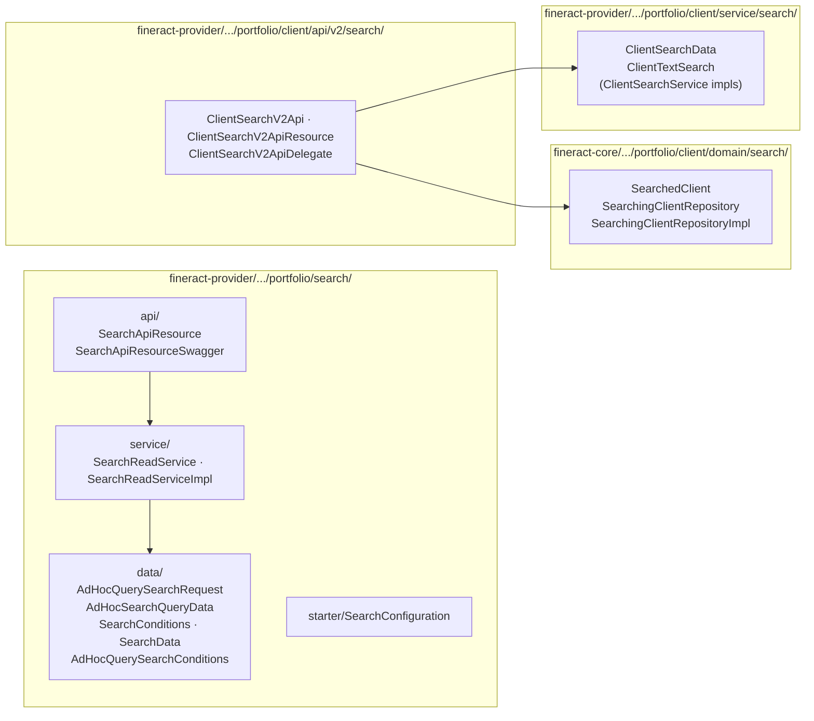
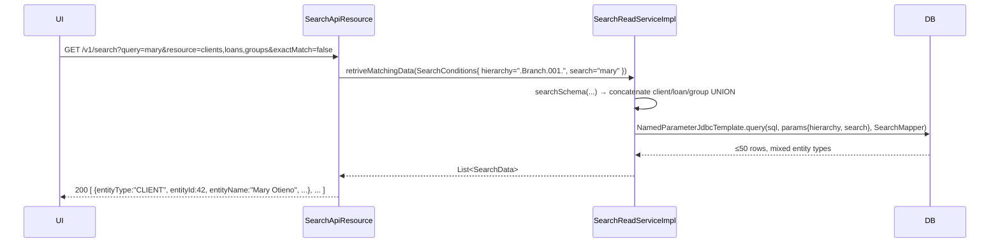

The **portfolio search** subsystem is a deliberately thin layer in Apache Fineract: there is no Lucene, no Elasticsearch, no inverted index — just a hand-written `UNION` over the relevant `m_*` tables. It is enough because portfolio entities live in *the same database* the search runs against, the volumes are MFI-scale (millions, not billions), and search results need to honour office hierarchy / permissions immediately.

Two APIs co-exist:

- **v1** — `SearchApiResource` (`/v1/search`). A single endpoint that scans across clients, loans, savings, share accounts, client identifiers, groups and centers via a single SQL `UNION`. Plus an `/advance` POST for ad-hoc filtered queries (the *Adhoc Query* tool).
- **v2** — `ClientSearchV2ApiResource` (`/v2/clients/search`). A newer, JPA-Criteria-based, *client-only* search returning a paged result. Designed for typeahead / autocomplete.

This page covers both.

## Where the code lives



## v1: `SearchApiResource`

`fineract-provider/src/main/java/org/apache/fineract/portfolio/search/api/SearchApiResource.java`:

```java
@Path("/v1/search")
public class SearchApiResource {

  @GET                          List<SearchData>    search(@QueryParam("query") String query,
                                                           @QueryParam("resource") String resource,
                                                           @QueryParam("exactMatch") Boolean exactMatch)
  @GET @Path("/template")       AdHocSearchQueryData retrieveAdHocSearchQueryTemplate(...)
  @POST @Path("/advance")       Collection<AdHocSearchQueryData> advancedSearch(AdHocQuerySearchRequest request)
}
```

### `GET /v1/search`

The whoami-everything endpoint. Inputs:

| Query param | Meaning |
| --- | --- |
| `query` | The substring to look for. With `exactMatch=false` (default) wrapped as `%query%`. |
| `resource` | Comma-separated whitelist: `clients,groups,loans,clientIdentifiers,savings,shares`. Each toggle enables one branch of the UNION. |
| `exactMatch` | When `true`, `LIKE` becomes a literal equality on the indexed columns (`account_no`, `external_id`, etc.). |

Bound via `SearchConditions` (`fineract-provider/.../portfolio/search/data/SearchConditions.java`) which exposes `isClientSearch()`, `isLoanSeach()`, `isSavingSeach()`, `isShareSeach()`, `isClientIdentifierSearch()`, `isGroupSearch()` for the service to gate each UNION branch.

### The UNION SQL strategy

`SearchReadServiceImpl.searchSchema(SearchConditions)` assembles the query at runtime. Every branch is a fixed text block returning the **same projected columns**:

```
entityType, entityId, entityName, entityExternalId, entityAccountNo,
parentId, parentName, entityMobileNo, entityStatusEnum,
subEntityType, parentType
```

The branches are concatenated with ` union `, capped at 50 rows by `sqlGenerator.limit(50, 0)` (the database dialect's `LIMIT 50 OFFSET 0` or equivalent — picked by `DatabaseSpecificSQLGenerator`).

`fineract-provider/.../portfolio/search/service/SearchReadServiceImpl.java`:

```java
final String clientMatchSql = """
    ( (select 'CLIENT' as entityType, c.id as entityId, c.display_name as entityName,
       c.external_id as entityExternalId, c.account_no as entityAccountNo,
       c.office_id as parentId, o.name as parentName, c.mobile_no as entityMobileNo,
       c.status_enum as entityStatusEnum, null as subEntityType, null as parentType
       from m_client c join m_office o on o.id = c.office_id
       where o.hierarchy like :hierarchy
       and (c.account_no like :search or c.display_name like :search
            or c.external_id like :search or c.mobile_no like :search))
       order by c.id desc)""";
```

The same pattern repeats for:

| Branch | Table joins | Search columns |
| --- | --- | --- |
| `CLIENT` | `m_client` ⋈ `m_office` | `account_no`, `display_name`, `external_id`, `mobile_no` |
| `LOAN` | `m_loan` ⋈ `m_client`/`m_group` ⋈ `m_office` ⋈ `m_product_loan` | `account_no`, `external_id` |
| `SAVING` | `m_savings_account` ⋈ `m_client`/`m_group` ⋈ `m_office` ⋈ `m_savings_product` | `account_no`, `external_id` |
| `SHARE` | `m_share_account` ⋈ `m_client` ⋈ `m_office` ⋈ `m_share_product` | `account_no`, `external_id` |
| `CLIENTIDENTIFIER` | `m_client_identifier` ⋈ `m_client` ⋈ `m_office` | `document_key` |
| `GROUP`/`CENTER` | `m_group` ⋈ `m_office`, discriminated on `g.level_id` | `account_no`, `display_name`, `external_id` |

`entityType` is hard-coded per branch; the group branch emits `'CENTER'` when `g.level_id = 1` else `'GROUP'`. The result lets the UI render a single uniform list with a coloured chip per entity type.

### Office hierarchy enforcement

Every branch's `WHERE` clause includes `o.hierarchy like :hierarchy`. The `hierarchy` parameter is the materialised path of the **calling user's office** (with `%` appended) — so a branch user can only see entities belonging to her own office tree. The bind is made in `retriveMatchingData`:

```java
params.addValue("hierarchy", hierarchy + "%");
```

Note that LOAN, SAVING and SHARE branches do `o.hierarchy IS NULL OR o.hierarchy like :hierarchy` because rows attached to a group route their office via the group's office, not the client's.

### SQL injection guard

`SqlValidator.validate(string)` is called on every user-supplied param that ends up in raw SQL (date columns, percentage conditions). The actual `:search` and `:hierarchy` go through `NamedParameterJdbcTemplate` so are pre-parameterised; the validator is the second-line defence for the ad-hoc branch.

### Row mapper

```java
private static final class SearchMapper implements RowMapper<SearchData> {
  @Override public SearchData mapRow(ResultSet rs, int rowNum) throws SQLException {
    return new SearchData(
      rs.getLong("entityId"),
      rs.getString("entityAccountNo"),
      rs.getString("entityExternalId"),
      rs.getString("entityName"),
      rs.getString("entityType"),
      rs.getLong("parentId"),
      rs.getString("parentName"),
      rs.getString("entityMobileNo"),
      JdbcSupport.getInteger(rs, "entityStatusEnum"),
      rs.getString("subEntityType"),
      rs.getString("parentType"));
  }
}
```

`entityStatusEnum` carries the entity's status code (e.g. `300` for an active client, `100` for a pending one) — but the v1 API does **not** resolve it to a label; the UI maps it client-side. This keeps the SQL fast.

## `POST /v1/search/advance` — ad-hoc query

The *Adhoc Query Templates* feature exposes a free-form, filterable search:

```java
@POST @Path("/advance")
public Collection<AdHocSearchQueryData> advancedSearch(AdHocQuerySearchRequest request);
```

`fineract-provider/.../portfolio/search/data/AdHocQuerySearchRequest.java` carries:

```java
@Data
@Builder
public class AdHocQuerySearchRequest implements Serializable {
  private List<Long> loanProducts;
  private List<Long> offices;
  private String loanStatus;
  private String loanDateOption;            // 'disbursalDate', 'approvedDate', ...
  private LocalDate loanFromDate;
  private LocalDate loanToDate;
  private boolean includeOutStandingAmountPercentage;
  private String outStandingAmountPercentageCondition;  // '<', '<=', '=', ...
  private BigDecimal minOutStandingAmountPercentage;
  private BigDecimal maxOutStandingAmountPercentage;
  private boolean includeOutstandingAmount;
  private String outstandingAmountCondition;
  private BigDecimal minOutstandingAmount;
  private BigDecimal maxOutstandingAmount;
}
```

The result is a list of `AdHocSearchQueryData` rows — by default `(officeName, loanProductName, count, loanOutStanding, percentage)` aggregates. The mapping is built in `SearchReadServiceImpl` by concatenating user filters into the `WHERE` of a `GROUP BY office, product` query; each filter token is sanitised via `sqlValidator.validate(...)` before string-concat to defeat SQL injection on the comparison operator and date-option columns (the *only* places raw SQL fragments are still concatenated rather than parameter-bound).

`GET /v1/search/template` returns the option lists (offices reachable by the user, active loan products) for the `/advance` form.

## v2: `ClientSearchV2ApiResource`

A modern, type-safe replacement scoped to clients only:

```java
@Path("/v2/clients")
public class ClientSearchV2ApiResource implements ClientSearchV2Api {

  @POST @Path("search")
  Page<ClientSearchData> searchByText(PagedRequest<ClientTextSearch> request);
}
```

### Request shape

`PagedRequest<ClientTextSearch>` (from `fineract-core/.../infrastructure/core/service/PagedRequest.java`) wraps:

```java
public class ClientTextSearch {
  private String text;            // the substring to search
  // additional client-scoped filters added by extensions
}
```

with `pageable` (page index, size, sort) from Spring Data.

### Implementation

`fineract-core/src/main/java/org/apache/fineract/portfolio/client/domain/search/SearchingClientRepositoryImpl.java` uses the **JPA Criteria API**:

```java
@Repository
public class SearchingClientRepositoryImpl implements SearchingClientRepository {
  @PersistenceContext private EntityManager entityManager;

  public Page<SearchedClient> searchByText(ClientTextSearch criteria, Pageable pageable) {
    CriteriaBuilder cb = entityManager.getCriteriaBuilder();
    // build a CriteriaQuery<SearchedClient> over Client, applying:
    //   - text LIKE on accountNumber/displayName/externalId/mobileNo
    //   - office hierarchy filter
    //   - status != INVALID
    TypedQuery<SearchedClient> queryToExecute = entityManager.createQuery(query);
    // paging + count query
  }
}
```

`SearchedClient` (in the same package) is a **projection** record, not the full `Client` entity:

```java
public record SearchedClient(
    Long id, String accountNumber, String displayName,
    Long officeId, String mobileNo, Integer status) {}
```

A delegate (`ClientSearchV2ApiDelegate`) translates `SearchedClient` rows into `ClientSearchData` for the public response, joining in derived data (resolved status enum, office name) where the projection doesn't already carry it.

### Why v2?

- **Pagination is first-class** — no fixed `LIMIT 50` cap.
- **Type safety** — Criteria API instead of string concatenation; bind parameters resolved by JPA.
- **Easy to extend** — adding a new filter is adding a `Predicate` in Criteria, not a new SQL `UNION` branch.
- **Decoupled projection** — `SearchedClient` is a thin DTO so the search query doesn't have to fetch the whole `Client` row.

The trade-off: v2 only covers clients. The v1 multi-entity UNION endpoint is still the only way to search across the entire portfolio in one shot.

## End-to-end: a global search



## Strategy summary

| Concern | v1 strategy | v2 strategy |
| --- | --- | --- |
| Indexing technology | Plain SQL `LIKE`, indexes on `account_no`/`external_id`/`mobile_no`/`document_key` | JPA Criteria, same underlying indexes |
| Scope | Multi-entity UNION | Clients only |
| Pagination | Hard `LIMIT 50` (no offset) | `Pageable` |
| Filtering | Resource toggle + `query` | Free-form `ClientTextSearch` DTO |
| Hierarchy guard | `o.hierarchy like :hierarchy` | Same predicate, expressed via `CriteriaBuilder` |
| Injection safety | `NamedParameterJdbcTemplate` + `SqlValidator` for operators | Bind parameters by JPA |
| Status resolution | Raw int returned, client-side decode | Resolved into `ClientSearchData` in the delegate |

## Exceptions

The search subsystem does **not** define its own exception hierarchy — invalid parameters bubble up as `PlatformApiDataValidationException` from upstream validators, and bad SQL fragments raise `PlatformDataIntegrityException` from the JDBC driver. The `/advance` endpoint validates operator strings via `SqlValidator`; any value not on the whitelist becomes a 400.

## Permissions

| HTTP entry | Permission |
| --- | --- |
| `GET /v1/search` | `READ_SEARCH` (sometimes seeded as the generic `READ_*` group) |
| `GET /v1/search/template` | `READ_SEARCH` |
| `POST /v1/search/advance` | `READ_ADHOCSEARCHQUERY` |
| `POST /v2/clients/search` | `READ_CLIENT` |

The v1 endpoint is intentionally **office-hierarchy bound** — a user who lacks read-permission on a child office's clients simply receives an empty result rather than a 403, because the SQL filter prunes the rows server-side.

## When to skip search and query directly

Some integration use cases are better served by direct REST GETs than by search:

- **Listing all active clients of an office** → `GET /v1/clients?officeId=...&status=active`. Cheaper than `?query=` because it uses an indexed status filter.
- **Resolving an external ID** → `GET /v1/clients/external-id/{externalId}`. Single-row, no UNION.
- **Loan/savings account lookup by account number** → `GET /v1/loans/{accountNo}` (when the deployment uses the `account_no` path variant) avoids the UNION too.

Use `/v1/search` for **human-driven** typeahead where a single substring crosses multiple entity types; use direct GETs for **machine-driven** integration.

## See also

<CardGroup cols={2}>
  <Card title="Clients" href="/portfolio/clients" icon="user">
    The most-searched entity. `m_client.display_name`, `account_no`, `external_id`, `mobile_no` are the indexed columns.
  </Card>
  <Card title="Groups" href="/portfolio/groups" icon="people-group">
    The group branch is the same UNION arm, switched on `level_id`.
  </Card>
  <Card title="Notes" href="/portfolio/notes" icon="note-sticky">
    Notes are deliberately *not* searched — they are free text and would explode the UNION.
  </Card>
</CardGroup>
