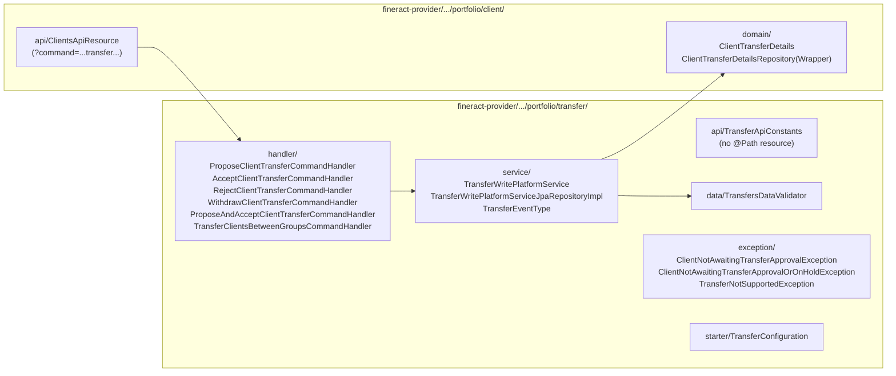
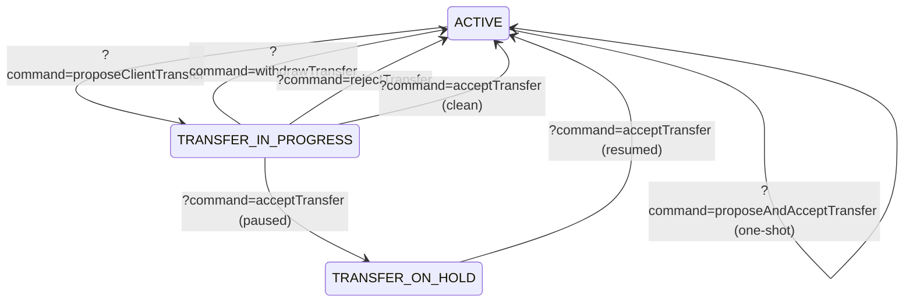

The **transfers** subsystem is how an Apache Fineract client (or a whole group) moves from one office to another in the institutional tree — typically because the borrower has physically relocated, because branches are being merged, or because a portfolio is being re-assigned between loan officers across offices.

A transfer is *not* a simple `UPDATE m_client SET office_id = ?`. There are loans in mid-life, savings balances, calendar attachments, group memberships and staff assignments that must move with the client; some of these are policy choices the originating office makes, others the receiving office must approve. The subsystem models this as a four-event workflow (`PROPOSAL → ACCEPTANCE | REJECTION | WITHDRAWAL`) with a paired sub-state on the client (`TRANSFER_IN_PROGRESS` / `TRANSFER_ON_HOLD`) and a small audit table.

## Where the code lives

The transfer logic is **not** exposed under a dedicated `/v1/transfers` resource — every transfer verb is a `?command=` on `/v1/clients/{id}` (or a peer endpoint on groups). The package contributes only the handlers and write services:



## The sub-statuses on `Client`

`ClientStatus` (in [Clients](/portfolio/clients#lifecycle-the-clientstatus-state-machine)) carries two transfer-related values:

| Status | Numeric | When set |
| --- | --- | --- |
| `TRANSFER_IN_PROGRESS(303)` | 303 | After `proposeClientTransfer`, *before* the destination office accepts. |
| `TRANSFER_ON_HOLD(304)` | 304 | After an `acceptClientTransfer` whose business rules require manual intervention (e.g. open loan whose first repayment falls after the transfer date). |

The standard `ACTIVE(300)` ↔ transfer flow:



The single-shot `proposeAndAcceptClientTransfer` exists for the case where both sides of the move are the same supervisor — most rural MFI use cases.

## REST verbs

All wired through `ClientsApiResource.evaluateCommand`:

| `?command=` value | Builder method (`CommandWrapperBuilder`) | Handler | From state |
| --- | --- | --- | --- |
| `proposeClientTransfer` | `proposeClientTransfer(clientId)` | `ProposeClientTransferCommandHandler` | `ACTIVE` |
| `withdrawTransfer` | `withdrawClientTransferRequest(clientId)` | `WithdrawClientTransferCommandHandler` | `TRANSFER_IN_PROGRESS` |
| `acceptTransfer` | `acceptClientTransfer(clientId)` | `AcceptClientTransferCommandHandler` | `TRANSFER_IN_PROGRESS` or `TRANSFER_ON_HOLD` |
| `rejectTransfer` | `rejectClientTransfer(clientId)` | `RejectClientTransferCommandHandler` | `TRANSFER_IN_PROGRESS` |
| `proposeAndAcceptTransfer` | `proposeAndAcceptClientTransfer(clientId)` | `ProposeAndAcceptClientTransferCommandHandler` | `ACTIVE` |
| (groups) `transferClientsBetweenGroups` | `transferClientsBetweenGroups(sourceGroupId)` | `TransferClientsBetweenGroupsCommandHandler` | within same center |

`ClientsApiResource` also exposes a special **read** endpoint for the proposal preview:

```java
@GET @Path("{clientId}/transferproposaldate")
public String retrieveTransferTemplate(@PathParam("clientId") Long clientId, @Context UriInfo uriInfo);
```

It returns the next safe transfer date — i.e. the earliest date past which there are no loan/savings transactions scheduled, so the destination office takes the client over cleanly.

## Request payload shape

`fineract-provider/src/main/java/org/apache/fineract/portfolio/transfer/api/TransferApiConstants.java` enumerates the accepted JSON keys:

| Key | Purpose |
| --- | --- |
| `destinationOfficeId` | Where to. |
| `destinationGroupId` | Optionally, the receiving group at the destination. |
| `inheritDestinationGroupLoanOfficer` | If true, the receiving group's loan officer is inherited; else the staff stays. |
| `staffId` | Explicit staff override at the destination. |
| `transferActiveLoans` | Move loans across with the client, or keep them at the source office. |
| `transferDate` | Effective date of the move; everything booked on or after this date must be reversed at the source. |
| `note` | Free-text reason — written into the audit table. |
| `clients` | (Group-move variant) List of client IDs being moved. |
| `destinationGroupId` | (Group→Group move) Receiving group within the same center. |

`TransfersDataValidator` (`fineract-provider/.../portfolio/transfer/data/TransfersDataValidator.java`) wraps a `DataValidatorBuilder` over these.

## The audit row: `ClientTransferDetails`

`fineract-provider/src/main/java/org/apache/fineract/portfolio/client/domain/ClientTransferDetails.java` (`m_client_transfer_details`):

```java
@Entity
@Table(name = "m_client_transfer_details")
public class ClientTransferDetails extends AbstractPersistableCustom<Long> {
    @Column(name = "client_id",              length = 20, unique = true, nullable = false) private Long clientId;
    @Column(name = "from_office_id",         nullable = false) private Long fromOfficeId;
    @Column(name = "to_office_id",           nullable = false) private Long toOfficeId;
    @Column(name = "proposed_transfer_date", nullable = true)  private LocalDate proposedTransferDate;
    @Column(name = "transfer_type",          nullable = false) private Integer transferType;        // TransferEventType
    @Column(name = "submitted_on",           nullable = false) private LocalDate submittedOn;
    @Column(name = "submitted_by",           nullable = false) private Long submittedBy;
}
```

One row is written per **event** (proposal/accept/reject/withdraw) — the table is the transfer's audit log, not its state.

### `TransferEventType`

`fineract-provider/.../portfolio/transfer/service/TransferEventType.java`:

```java
public enum TransferEventType {
    PROPOSAL(1),
    ACCEPTANCE(2),
    WITHDRAWAL(3),
    REJECTION(4);
}
```

The convenience method `isAcceptance()` is used by the accept handler to discriminate between the *propose-and-accept* one-shot and the standard two-step.

The current intent of the in-progress transfer is also mirrored on `Client.transferToOffice` and `Client.proposedTransferDate` (set by the propose handler, cleared by accept/reject/withdraw).

## Write service: `TransferWritePlatformServiceJpaRepositoryImpl`

`fineract-provider/src/main/java/org/apache/fineract/portfolio/transfer/service/TransferWritePlatformServiceJpaRepositoryImpl.java` exposes:

```java
CommandProcessingResult transferClientsBetweenGroups(Long sourceGroupId, JsonCommand jsonCommand);
CommandProcessingResult proposeAndAcceptClientTransfer(Long clientId, JsonCommand jsonCommand);
CommandProcessingResult proposeClientTransfer(Long clientId, JsonCommand jsonCommand);
CommandProcessingResult acceptClientTransfer(Long clientId, JsonCommand jsonCommand);
CommandProcessingResult rejectClientTransfer(Long clientId, JsonCommand jsonCommand);
CommandProcessingResult withdrawClientTransfer(Long clientId, JsonCommand jsonCommand);
```

Each method:

1. Loads the client through `ClientRepositoryWrapper.findOneWithNotFoundDetection`.
2. Asserts the current `status_enum` is the expected start state — else throws `ClientNotAwaitingTransferApprovalException` or `ClientNotAwaitingTransferApprovalOrOnHoldException`.
3. Validates JSON via `TransfersDataValidator`.
4. Updates `Client.status`, `Client.transferToOffice`, `Client.proposedTransferDate` as needed.
5. On `ACCEPTANCE`, **also moves**:
   - The client's `office_id` to the destination.
   - Active loans (if `transferActiveLoans=true`) — re-assigned to a destination office staff member.
   - Savings accounts.
   - Group membership (`m_group_client` row deleted at source, re-created at destination group if `destinationGroupId` supplied).
   - Calendar instances anchored at the client — re-pointed to the destination's center calendar where applicable.
6. Inserts a row in `m_client_transfer_details` describing the event.

Reject and withdraw simply rewind `Client.status` to `ACTIVE` and append an audit row.

## Why a transfer can land in `TRANSFER_ON_HOLD`

`AcceptClientTransferCommandHandler` will *not* finalise the move when the validator catches any of:

- A loan transaction (repayment, charge, disbursal) recorded on or after `transferDate` — the constant
  `transferClientLoanException = "error.msg.cannot.transfer.client.as.loan.transaction.present.on.or.after.transfer.date"`.
- A savings transaction in the same window — `transferClientSavingsException`.
- The destination office is the same as the current office — `transferClientToSameOfficeException`.

In the first two cases, the system rather than failing simply parks the client in `TRANSFER_ON_HOLD`. The destination supervisor then chooses to either:

- Reverse the conflicting transactions and re-issue `acceptTransfer`.
- Cancel via `withdrawTransfer` (returns the client to `ACTIVE` at the source).

## Group transfers: a two-flavour story

Two distinct scenarios, two distinct command paths:

1. **Inter-group transfer within the same center** — handled by `TransferClientsBetweenGroupsCommandHandler`. Triggered as `POST /v1/groups/{sourceGroupId}?command=transferClients`. Affects only the `m_group_client` rows; no office change, no `ClientTransferDetails` row.
2. **Inter-office group transfer** — *the group itself* moves. Implemented through the same group-status transitions (`TRANSFER_IN_PROGRESS(303)` / `TRANSFER_ON_HOLD(304)` on `GroupingTypeStatus`). The current production code path uses the same client-side commands looped over every client in the group; a dedicated group-transfer resource has been discussed but not merged.

## Exception map

`fineract-provider/.../portfolio/transfer/exception/`:

| Exception | When |
| --- | --- |
| `ClientNotAwaitingTransferApprovalException` | `acceptTransfer` or `rejectTransfer` invoked when status ≠ `TRANSFER_IN_PROGRESS`. |
| `ClientNotAwaitingTransferApprovalOrOnHoldException` | `acceptTransfer` (resume) invoked when status ≠ `TRANSFER_IN_PROGRESS|TRANSFER_ON_HOLD`. |
| `TransferNotSupportedException` | Move attempted for an entity Fineract cannot relocate (e.g. a closed savings account). |

## End-to-end: a two-step transfer with hold

```mermaid
sequenceDiagram
  participant Src as Source officer
  participant Dst as Destination officer
  participant Api as ClientsApiResource
  participant Svc as TransferWritePlatformServiceJpaRepositoryImpl
  participant DB
  Src->>Api: POST /v1/clients/42?command=proposeClientTransfer<br/>{ destinationOfficeId, transferDate, note }
  Api->>Svc: proposeClientTransfer(clientId=42, JsonCommand)
  Svc->>DB: validate; set client.status=TRANSFER_IN_PROGRESS(303); set transfer_to_office_id
  Svc->>DB: insert ClientTransferDetails(transfer_type=PROPOSAL)
  Svc-->>Api: CommandProcessingResult(clientId=42)

  Dst->>Api: POST /v1/clients/42?command=acceptClientTransfer<br/>{ destinationGroupId, transferActiveLoans:true }
  Api->>Svc: acceptClientTransfer(42, ...)
  Svc->>DB: detect savings_txn on or after transferDate → mark TRANSFER_ON_HOLD(304)
  Svc->>DB: insert ClientTransferDetails(transfer_type=ACCEPTANCE)
  Svc-->>Api: CommandProcessingResult(hold note)

  Dst->>Api: (reverse offending savings tx) POST /v1/clients/42?command=acceptClientTransfer
  Api->>Svc: acceptClientTransfer(42, ...)
  Svc->>DB: move office_id, loans, savings, group membership; set client.status=ACTIVE
  Svc-->>Api: CommandProcessingResult(ok)
  Api-->>Dst: 200
```

## What gets moved with the client

| Asset / link | Moved on accept? | Notes |
| --- | --- | --- |
| `Client.office_id` | Yes | Always — this is the entire point. |
| Active loans (`m_loan` where `loan_status_id` in active set) | Conditional | Only when `transferActiveLoans=true`. Loan officer at destination must be assignable. |
| Savings accounts | Yes | All non-closed savings move automatically. |
| Share accounts | Yes | Currency must match destination office capability. |
| `m_group_client` membership | Conditional | Old row deleted; new row created at `destinationGroupId` if supplied. Otherwise client becomes standalone. |
| `CalendarInstance` of the client | Conditional | Loan calendars get re-pointed via the destination center's calendar; client-scoped calendars are deleted. |
| `m_staff_assignment_history` | New row | A `staffHistory` row is opened at the destination if a new loan officer is assigned. |
| `ClientIdentifier`, `ClientAddress`, `ClientFamilyMembers` | Yes (in-place) | Stay attached to the same `client_id`; no re-key needed. |
| `Note` rows | Yes (in-place) | Same. |
| Client charges (`ClientCharge`) | Yes (in-place) | Same. |

## The propose-and-accept short-circuit

For MFIs where the same supervisor controls both the source and the destination, a single round-trip is supported:

```http
POST /v1/clients/42?command=proposeAndAcceptClientTransfer
{
  "destinationOfficeId": 7,
  "destinationGroupId":  101,
  "transferActiveLoans": true,
  "transferDate":        "2025-04-15",
  "note":                "Branch consolidation Mwanza"
}
```

Internally `ProposeAndAcceptClientTransferCommandHandler` calls the write service's `proposeAndAcceptClientTransfer(...)` method which, within one transaction:

1. Writes `PROPOSAL` event.
2. Writes `ACCEPTANCE` event.
3. Performs the office-id update + all the moves listed above.
4. Sets `Client.status` directly to `ACTIVE` (skipping `TRANSFER_IN_PROGRESS`).

The two-row event log makes both phases reproducible from the audit.

## Idempotency and locking

- The write service obtains a pessimistic row lock on `Client` for the duration of the propose/accept/reject/withdraw flow via `ClientRepositoryWrapper.findOneWithNotFoundDetection`. A concurrent attempt by a second supervisor sees `OptimisticLockException` from the JPA layer.
- Re-issuing the same command (e.g. user double-clicks *Accept*) is rejected by the from-state guard — `ClientNotAwaitingTransferApprovalException` if the first call already moved the status.

## See also

<CardGroup cols={2}>
  <Card title="Clients" href="/portfolio/clients" icon="user">
    The lifecycle state machine that the transfer flow plugs into.
  </Card>
  <Card title="Groups" href="/portfolio/groups" icon="people-group">
    Group memberships are recreated at the destination when the receiving group is supplied.
  </Card>
  <Card title="Account transfers & standing instructions" href="/portfolio/account-transfers-and-standing-instructions" icon="arrows-rotate">
    Distinct subsystem — moves *money* between accounts, not clients between offices.
  </Card>
  <Card title="Meetings & Calendars" href="/portfolio/meetings-and-calendars" icon="calendar">
    The calendar instances re-pointed on a successful accept.
  </Card>
</CardGroup>
