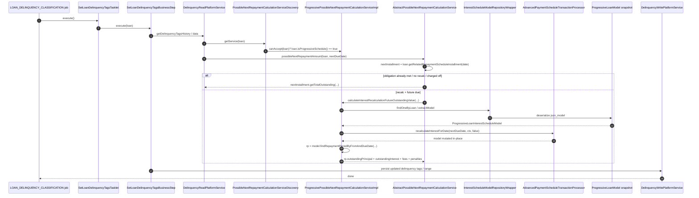

Apache Fineract ships a shared **delinquency** framework in `fineract-loan`. It owns the buckets, the
`LoanDelinquencyAction` audit trail, the `DelinquencyEffectivePauseHelper`, the tagging job
(`LOAN_DELINQUENCY_CLASSIFICATION`) and the `LoanCOBBusinessStep` that runs daily. What the framework
explicitly delegates is the bit that only the loan engine knows how to compute: the **expected outstanding
on the next due date**. For cumulative loans that delegation lives in `fineract-loan`; for progressive
loans it lives in `fineract-progressive-loan` and is exactly one class —
`ProgressivePossibleNextRepaymentCalculationServiceImpl`.

<Info>
The progressive engine does **not** ship its own COB business step or its own batch job. It reuses
`SetLoanDelinquencyTagsBusinessStep` (`fineract-provider/.../cob/loan/`) and its surrounding
`LOAN_DELINQUENCY_CLASSIFICATION` Spring Batch configuration verbatim. The only progressive-specific code is
a `PossibleNextRepaymentCalculationService` implementation that the framework discovers at runtime.
</Info>

## The framework contract

The contract is defined in `fineract-loan`:

```java
// fineract-loan/.../portfolio/delinquency/service/PossibleNextRepaymentCalculationService.java
public interface PossibleNextRepaymentCalculationService {
    boolean canAccept(Loan loan);
    BigDecimal possibleNextRepaymentAmount(Loan loan, LocalDate nextPaymentDueDate);
}
```

The framework picks an implementation per loan through a strategy-style discoverer:

```java
// fineract-loan/.../portfolio/delinquency/service/PossibleNextRepaymentCalculationServiceDiscovery.java
@Service
@AllArgsConstructor
public class PossibleNextRepaymentCalculationServiceDiscovery {
    private final List<PossibleNextRepaymentCalculationService> services;

    public PossibleNextRepaymentCalculationService getService(final Loan loan) {
        return services.stream().filter(s -> s.canAccept(loan)).findAny().orElse(null);
    }
}
```

`canAccept(loan)` is therefore the routing rule. For the progressive implementation it is the one-liner:

```java
@Override
public boolean canAccept(Loan loan) {
    return loan.isProgressiveSchedule();
}
```

The base class is also in `fineract-loan` and already encodes the **common decision tree** — when to use the
persisted installment value as-is, and when to call the engine-specific recalculation:

```java
// fineract-loan/.../portfolio/delinquency/service/AbstractPossibleNextRepaymentCalculationService.java
public abstract class AbstractPossibleNextRepaymentCalculationService implements PossibleNextRepaymentCalculationService {

    @Override
    public BigDecimal possibleNextRepaymentAmount(Loan loan, LocalDate nextPaymentDueDate) {
        LoanRepaymentScheduleInstallment nextInstallment = loan.getRelatedRepaymentScheduleInstallment(nextPaymentDueDate);
        if (nextInstallment == null || nextInstallment.isObligationsMet()) {
            return BigDecimal.ZERO;
        }
        if (loan.isInterestRecalculationEnabled()
                // if rest frequency type is same as repayment, then interest values should be on the
                // repayment schedule correctly.
                && !loan.getLoanInterestRecalculationDetails().getRestFrequencyType().isSameAsRepayment()
                // if charge off, installments already shows correct values, no further calculation is required.
                && !loan.isChargeOffOnDate(nextPaymentDueDate)
                // all strategy works like same as repayment on installment due date.
                && nextInstallment.getDueDate().isAfter(ThreadLocalContextUtil.getBusinessDate())
                // there is no overdue / overdue related to that installment is calculated.
                && !nextInstallment.getFromDate().isEqual(ThreadLocalContextUtil.getBusinessDate())
                && MathUtil.isGreaterThanZero(loan.getDisbursedAmount())) {
            // try to predict future outstanding balances with interest recalculation
            return calculateInterestRecalculationFutureOutstandingValue(loan, nextPaymentDueDate, nextInstallment);
        }
        return nextInstallment.getTotalOutstanding(loan.getCurrency()).getAmount();
    }

    public abstract BigDecimal calculateInterestRecalculationFutureOutstandingValue(Loan loan,
            LocalDate nextPaymentDueDate, LoanRepaymentScheduleInstallment nextInstallment);
}
```

A subclass only has to fill in `calculateInterestRecalculationFutureOutstandingValue(...)` — the projected
outstanding on the next due date when interest recalculation is active and the rest frequency is *not* the
same as the repayment frequency.

## The progressive implementation

It lives at
`fineract-progressive-loan/src/main/java/org/apache/fineract/portfolio/delinquency/service/ProgressivePossibleNextRepaymentCalculationServiceImpl.java`:

```java
@RequiredArgsConstructor
@Transactional(readOnly = true)
public class ProgressivePossibleNextRepaymentCalculationServiceImpl
        extends AbstractPossibleNextRepaymentCalculationService {

    private final InterestScheduleModelRepositoryWrapper interestScheduleModelRepository;
    private final AdvancedPaymentScheduleTransactionProcessor advancedPaymentScheduleTransactionProcessor;

    @Override
    public BigDecimal calculateInterestRecalculationFutureOutstandingValue(Loan loan, LocalDate nextPaymentDueDate,
            LoanRepaymentScheduleInstallment nextInstallment) {
        MonetaryCurrency currency = loan.getCurrency();
        Optional<ProgressiveLoanModel> progressiveLoanModel = interestScheduleModelRepository.findOneByLoan(loan);
        Optional<ProgressiveLoanInterestScheduleModel> optionalScheduleModel = interestScheduleModelRepository
                .extractModel(progressiveLoanModel);
        if (optionalScheduleModel.isEmpty()) {
            return BigDecimal.ZERO;
        }
        ProgressiveLoanInterestScheduleModel scheduleModel = optionalScheduleModel.get();
        List<LoanRepaymentScheduleInstallment> repaymentScheduleInstallments = loan.getRepaymentScheduleInstallments();
        ProgressiveTransactionCtx ctx = new ProgressiveTransactionCtx(loan.getCurrency(),
                repaymentScheduleInstallments, Set.of(),
                new MoneyHolder(loan.getTotalOverpaidAsMoney()), new ChangedTransactionDetail(),
                scheduleModel, loan.getActiveLoanTermVariations());
        ctx.setChargedOff(loan.isChargedOff());
        ctx.setWrittenOff(loan.isClosedWrittenOff());
        ctx.setContractTerminated(loan.isContractTermination());

        advancedPaymentScheduleTransactionProcessor.recalculateInterestForDate(nextPaymentDueDate, ctx, false);
        RepaymentPeriod repaymentPeriod = scheduleModel
                .findRepaymentPeriodByFromAndDueDate(nextInstallment.getFromDate(), nextInstallment.getDueDate())
                .orElseGet(scheduleModel::getLastRepaymentPeriod);

        return repaymentPeriod.getOutstandingPrincipal().add(repaymentPeriod.getOutstandingInterest())
                .add(nextInstallment.getFeeChargesOutstanding(currency))
                .add(nextInstallment.getPenaltyChargesOutstanding(currency))
                .getAmount();
    }

    @Override
    public boolean canAccept(Loan loan) {
        return loan.isProgressiveSchedule();
    }
}
```

Step-by-step:

1. **Load the persisted snapshot.** `interestScheduleModelRepository.findOneByLoan(loan)` returns the
   `ProgressiveLoanModel` (the `m_loan_progressive_model` row), and `extractModel(...)` deserialises its
   JSON blob into a live `ProgressiveLoanInterestScheduleModel`. If the loan has no snapshot — for example
   it was disbursed in legacy mode — the service returns `BigDecimal.ZERO`.
2. **Assemble the transaction context.** `ProgressiveTransactionCtx` carries the schedule model, the
   installments, an empty change set, the term variations, and the flags `chargedOff`, `writtenOff`,
   `contractTerminated` from the `Loan` aggregate. This context is the unit of work the advanced-payment
   transaction processor operates on.
3. **Recalculate interest till the next due date.** `recalculateInterestForDate(nextPaymentDueDate, ctx,
   prepayAttempt=false)` runs the EMI calculator's `recalculateModelOverdueAmountsTillDate(...)` and friends
   for that date, mutating the *copy* of the schedule model in `ctx` (the call is read-only because the
   service is annotated `@Transactional(readOnly = true)` and the snapshot model is the in-memory one).
4. **Pull the resulting outstanding amounts.** `findRepaymentPeriodByFromAndDueDate(...)` returns the
   `RepaymentPeriod` for that installment, from which `getOutstandingPrincipal()` and
   `getOutstandingInterest()` come straight out of the recalculated model.
5. **Add fees and penalties from the persisted installment.** Charges are not part of the interest model —
   they live on `LoanRepaymentScheduleInstallment` and are summed in with `getFeeChargesOutstanding(currency)`
   and `getPenaltyChargesOutstanding(currency)`.

## Wiring as a Spring bean

`ProgressivePossibleNextRepaymentCalculationServiceImpl` is *not* a `@Component`. It is registered through
the central bean configuration of the module so it can be conditionally replaced without changing the
implementation:

```java
// fineract-progressive-loan/.../portfolio/configuration/FineractProgressiveLoanBeanConfiguration.java
@Configuration
public class FineractProgressiveLoanBeanConfiguration {

    @Bean
    @ConditionalOnMissingBean(ProgressivePossibleNextRepaymentCalculationServiceImpl.class)
    public ProgressivePossibleNextRepaymentCalculationServiceImpl progressivePossibleNextRepaymentCalculationService(
            InterestScheduleModelRepositoryWrapper interestScheduleModelRepository,
            AdvancedPaymentScheduleTransactionProcessor advancedPaymentScheduleTransactionProcessor) {
        return new ProgressivePossibleNextRepaymentCalculationServiceImpl(interestScheduleModelRepository,
                advancedPaymentScheduleTransactionProcessor);
    }
}
```

Because Spring will inject every `PossibleNextRepaymentCalculationService` bean into the
`PossibleNextRepaymentCalculationServiceDiscovery` `List<...>` collaborator, this single `@Bean`
declaration is enough — the discoverer will then call `canAccept(loan)` on each and pick the progressive
one for progressive loans.

```mermaid
flowchart LR
    A[Loan]
    A -->|isProgressiveSchedule? yes/no| Disc
    Disc[PossibleNextRepaymentCalculationServiceDiscovery]
    Disc -->|canAccept = true| ProgImpl
    Disc -.->|no match for cumulative loans| Null["null<br/>nextPaymentAmount stays unset"]
    subgraph fineract-loan
        Disc
        Abstract[AbstractPossibleNextRepaymentCalculationService]
    end
    subgraph fineract-progressive-loan
        ProgImpl[ProgressivePossibleNextRepaymentCalculationServiceImpl]
    end
    Abstract <|.. ProgImpl
    ProgImpl --> Repo[InterestScheduleModelRepositoryWrapper]
    Repo --> Snap[ProgressiveLoanModel snapshot]
    ProgImpl --> APSTP[AdvancedPaymentScheduleTransactionProcessor]
    APSTP --> EMI[ProgressiveEMICalculator]
```

The discoverer's `getService(...)` returns `null` when no implementation accepts the loan, and
`DelinquencyReadPlatformServiceImpl` is explicit about that — cumulative loans simply do not get a
`nextPaymentAmount` populated on the collection data:

```java
// fineract-loan/.../delinquency/service/DelinquencyReadPlatformServiceImpl.java
PossibleNextRepaymentCalculationService possibleNextRepaymentCalculationService = possibleNextRepaymentCalculationServiceDiscovery
        .getService(loan);
if (possibleNextRepaymentCalculationService != null) {
    collectionData.setNextPaymentAmount(
            possibleNextRepaymentCalculationService.possibleNextRepaymentAmount(loan, collectionData.getNextPaymentDueDate()));
}
```

`ProgressivePossibleNextRepaymentCalculationServiceImpl` is therefore — at time of writing — the **only**
production implementation of `PossibleNextRepaymentCalculationService` in the codebase.

## Trigger: `LOAN_DELINQUENCY_CLASSIFICATION`

The job that ultimately consumes the service is part of the **Close of Business** machinery, declared in
`fineract-core` and wired up in `fineract-loan`:

```java
// fineract-core/.../infrastructure/jobs/service/JobName.java
LOAN_DELINQUENCY_CLASSIFICATION("Loan Delinquency Classification"), //
```

```java
// fineract-loan/.../portfolio/loanaccount/jobs/setloandelinquencytags/SetLoanDelinquencyTagsConfig.java
@Configuration
@AllArgsConstructor
public class SetLoanDelinquencyTagsConfig {

    @Autowired private JobRepository jobRepository;
    @Autowired private PlatformTransactionManager transactionManager;
    @Autowired private DelinquencyEffectivePauseHelper delinquencyEffectivePauseHelper;
    @Autowired private DelinquencyReadPlatformService delinquencyReadPlatformService;

    private DelinquencyWritePlatformService delinquencyWritePlatformService;
    private LoanRepaymentScheduleInstallmentRepository loanRepaymentScheduleInstallmentRepository;
    private LoanTransactionRepository loanTransactionRepository;

    @Bean
    public Step setLoanDelinquencyTagsStep() {
        return new StepBuilder(JobName.LOAN_DELINQUENCY_CLASSIFICATION.name(), jobRepository)
                .tasklet(setLoanDelinquencyTagsTasklet(), transactionManager).build();
    }

    @Bean
    public Job setLoanDelinquencyTagsJob() {
        return new JobBuilder(JobName.LOAN_DELINQUENCY_CLASSIFICATION.name(), jobRepository)
                .start(setLoanDelinquencyTagsStep())
                .incrementer(new RunIdIncrementer()).build();
    }

    @Bean
    public SetLoanDelinquencyTagsTasklet setLoanDelinquencyTagsTasklet() {
        return new SetLoanDelinquencyTagsTasklet(delinquencyWritePlatformService,
                loanRepaymentScheduleInstallmentRepository, loanTransactionRepository,
                delinquencyEffectivePauseHelper, delinquencyReadPlatformService);
    }
}
```

The tasklet drives the COB step
`SetLoanDelinquencyTagsBusinessStep` (`fineract-provider/.../cob/loan/SetLoanDelinquencyTagsBusinessStep.java`),
which iterates over the loans-of-the-day, calls the framework's read/write services and ultimately needs the
"expected next repayment" amount that this page is about. For progressive loans, that question reaches
`ProgressivePossibleNextRepaymentCalculationServiceImpl.calculateInterestRecalculationFutureOutstandingValue(...)`
through the abstract base class's `possibleNextRepaymentAmount(...)`.

### The COB step name

The business step exposes its identifier via `SetLoanDelinquencyTagsBusinessStep.getEnumStyledName()`:

```java
// fineract-provider/.../cob/loan/SetLoanDelinquencyTagsBusinessStep.java
return "LOAN_DELINQUENCY_CLASSIFICATION";
```

That is the string operators see in `/v1/jobs/{name}` and in the workflow editor. The end-to-end test
helpers (`fineract-e2e-tests-core/.../test/data/job/DefaultJob.java`) also know it as the short code
`LA_DECL`:

```java
LOAN_DELINQUENCY_CLASSIFICATION("Loan Delinquency Classification", "LA_DECL"), //
```

## End-to-end sequence on a progressive loan



## Comparison with the cumulative engine

| Concern                                          | `fineract-loan` (cumulative)                                   | `fineract-progressive-loan` (progressive)                     |
|--------------------------------------------------|----------------------------------------------------------------|--------------------------------------------------------------|
| Framework class                                  | `AbstractPossibleNextRepaymentCalculationService` (unused)     | Same — extended                                              |
| `PossibleNextRepaymentCalculationService` impl   | None — discoverer returns `null`                               | `ProgressivePossibleNextRepaymentCalculationServiceImpl`      |
| Routing key                                      | n/a                                                            | `loan.isProgressiveSchedule()`                                |
| Future outstanding source                        | `nextPaymentAmount` stays unset on the collection data         | Loads the persisted `ProgressiveLoanModel` snapshot           |
| Transaction processor                            | Standard `LoanRepaymentScheduleTransactionProcessor` family    | `AdvancedPaymentScheduleTransactionProcessor`                 |
| Snapshot persistence                             | None                                                           | `m_loan_progressive_model.json_model`                         |
| EMI recomputation per recalc                     | n/a                                                            | `recalculateModelOverdueAmountsTillDate(...)` + period read   |
| Fees/penalties                                   | n/a                                                            | Read from `LoanRepaymentScheduleInstallment`                  |

When a progressive implementation **is** picked up, the shared `AbstractPossibleNextRepaymentCalculationService`
applies a five-part guard before calling out to the subclass: interest recalculation must be enabled, the
rest frequency must not match the repayment frequency, the loan must not be charged off as of the date,
the next due date must be strictly in the future (and the installment must not start today), and the loan
must have a positive disbursed amount. Inside those guards the progressive subclass runs the
snapshot-driven recomputation described above; outside them, the abstract base just returns the persisted
`nextInstallment.getTotalOutstanding(...)`.

## Why a snapshot?

Recomputing a progressive schedule from scratch every COB day, for every active loan, would be O(loans ×
installments × interest periods). The persisted `ProgressiveLoanModel.json_model` keeps the calculator
state warm so the only work the delinquency service does per loan is:

- One `SELECT` from `m_loan_progressive_model`.
- One Gson deserialisation (handled by
  `ProgressiveLoanInterestScheduleModelParserServiceGsonImpl`).
- One call into `recalculateInterestForDate(...)` that only walks the schedule forward to the **target
  date** — not to maturity.
- One `RepaymentPeriod.getOutstandingPrincipal() + getOutstandingInterest()` arithmetic.

This is what makes a daily COB classification job over a portfolio of progressive loans tractable.

## File map

```text
fineract-progressive-loan/src/main/java/org/apache/fineract/portfolio/
├── configuration/
│   └── FineractProgressiveLoanBeanConfiguration.java          — registers the @Bean
└── delinquency/service/
    └── ProgressivePossibleNextRepaymentCalculationServiceImpl.java   — the implementation

fineract-loan/src/main/java/org/apache/fineract/portfolio/delinquency/service/
├── PossibleNextRepaymentCalculationService.java                — interface
├── AbstractPossibleNextRepaymentCalculationService.java        — shared decision tree
└── PossibleNextRepaymentCalculationServiceDiscovery.java       — strategy discoverer

fineract-loan/src/main/java/org/apache/fineract/portfolio/loanaccount/jobs/setloandelinquencytags/
├── SetLoanDelinquencyTagsConfig.java                           — Spring Batch job definition
└── SetLoanDelinquencyTagsTasklet.java                          — drives the COB step

fineract-provider/src/main/java/org/apache/fineract/cob/loan/
└── SetLoanDelinquencyTagsBusinessStep.java                     — COB business step
```

## See also

<CardGroup cols={2}>
  <Card title="EMI Calculator" icon="calculator" href="./emi-calculator">
    The `recalculateModelOverdueAmountsTillDate(...)` and `getOutstandingAmountsTillDate(...)` operations
    the delinquency service relies on.
  </Card>
  <Card title="Schedule Generator" icon="list-ol" href="./schedule-generator">
    The same `InterestScheduleModelRepositoryWrapper` that the delinquency service uses to load the
    snapshot.
  </Card>
</CardGroup>
