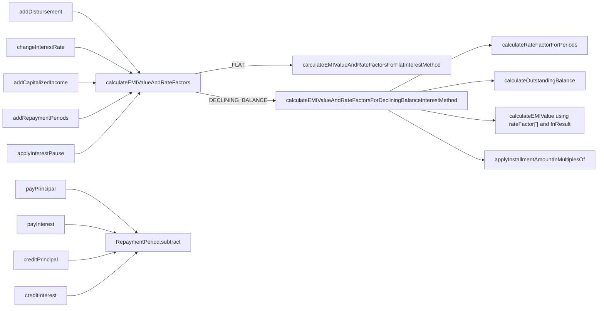

The Apache Fineract **progressive EMI calculator** is the maths kernel of the `fineract-progressive-loan`
module. It lives in
`fineract-progressive-loan/src/main/java/org/apache/fineract/portfolio/loanproduct/calc/` and is built around
two types: the `EMICalculator` interface (the contract) and the `ProgressiveEMICalculator` class (a single
Spring `@Component` ≈ 2200 lines that handles every schedule mutation a progressive loan can experience).

<Info>
The calculator never touches the database directly. It works entirely against an in-memory
`ProgressiveLoanInterestScheduleModel` which is populated by the schedule generator (for a fresh loan) or by
the GSON parser (for a persisted snapshot). The schedule generator and the transaction processor then push
events — disbursement, interest-rate change, repayment — into it.
</Info>

## The contract: `EMICalculator`

`calc/EMICalculator.java` declares the full surface area of the calculator. Two helpers build the in-memory
model, the rest are event handlers and queries:

```java
// calc/EMICalculator.java
public interface EMICalculator {

    @NotNull
    ProgressiveLoanInterestScheduleModel generatePeriodInterestScheduleModel(
            @NotNull List<LoanScheduleModelRepaymentPeriod> periods,
            @NotNull ILoanConfigurationDetails loanProductRelatedDetail,
            Integer installmentAmountInMultiplesOf, MathContext mc);

    @NotNull
    ProgressiveLoanInterestScheduleModel generateInstallmentInterestScheduleModel(
            @NotNull List<RepaymentScheduleInstallmentData> installments,
            @NotNull ILoanConfigurationDetails loanProductRelatedDetail,
            Integer installmentAmountInMultiplesOf, MathContext mc);

    void addDisbursement(ProgressiveLoanInterestScheduleModel m, LocalDate due, Money amount);
    void addCapitalizedIncome(ProgressiveLoanInterestScheduleModel m, LocalDate due, Money amount);
    void changeInterestRate(ProgressiveLoanInterestScheduleModel m, LocalDate on, BigDecimal newRate);
    void addRepaymentPeriods(ProgressiveLoanInterestScheduleModel m, LocalDate on,
                             int n, List<ProcessedTransactionData> alreadyProcessed);
    void addBalanceCorrection(ProgressiveLoanInterestScheduleModel m, LocalDate on, Money amount);
    void payInterest(ProgressiveLoanInterestScheduleModel m, LocalDate from, LocalDate due,
                     LocalDate txn, Money amount);
    void payPrincipal(ProgressiveLoanInterestScheduleModel m, LocalDate from, LocalDate due,
                      LocalDate txn, Money amount);
    void creditPrincipal(ProgressiveLoanInterestScheduleModel m, LocalDate txn, Money amount);
    void creditInterest (ProgressiveLoanInterestScheduleModel m, LocalDate txn, Money amount);

    @NotNull PeriodDueDetails getDueAmounts(@NotNull ProgressiveLoanInterestScheduleModel m,
                                            @NotNull LocalDate from, @NotNull LocalDate due,
                                            @NotNull LocalDate target);
    @NotNull Money getPeriodInterestTillDate(...);
    Money getOutstandingLoanBalanceOfPeriod(ProgressiveLoanInterestScheduleModel m, LocalDate target);
    OutstandingDetails getOutstandingAmountsTillDate(ProgressiveLoanInterestScheduleModel m, LocalDate target);
    Money getOutstandingInterestTillDate(@NotNull ProgressiveLoanInterestScheduleModel m, @NotNull LocalDate tillDate);
    void calculateRateFactorForRepaymentPeriod(RepaymentPeriod rp, ProgressiveLoanInterestScheduleModel m);
    Money getSumOfDueInterestsOnDate(ProgressiveLoanInterestScheduleModel m, LocalDate target);
    void applyInterestPause(ProgressiveLoanInterestScheduleModel m, LocalDate from, LocalDate end);

    void updateModelRepaymentPeriodsDuringReAge(...);
    boolean recalculateModelOverdueAmountsTillDate(ProgressiveLoanInterestScheduleModel m,
                                                   LocalDate target, boolean prepayAttempt);

    OutstandingDetails precalculateReAgeEqualAmortizationAmount(...);
    void reAgeEqualAmortization(...);
    EqualAmortizationValues calculateEqualAmortizationValues(Money total, Integer n,
                                                              Integer multipleOf, MonetaryCurrency currency);
    EqualAmortizationValues calculateAdjustedEqualAmortizationValues(...);

    void changeDueDate(ProgressiveLoanInterestScheduleModel m, LoanApplicationTerms terms,
                       LocalDate targetDueDate, LocalDate newDueDate);
    void updateModelRepaymentPeriodsDuringReAmortization(ProgressiveLoanInterestScheduleModel m, LocalDate txn);
    void updateModelRepaymentPeriodsDuringReAmortizationWithEqualInterestSplit(
            ProgressiveLoanInterestScheduleModel m, LocalDate txn);
}
```

## The model: `ProgressiveLoanInterestScheduleModel`

The calculator is stateful only through the model it receives. The model holds:

- A list of `RepaymentPeriod` instances — one per installment, each with a list of `InterestPeriod`
  sub-segments.
- The `ILoanConfigurationDetails` (currency, day-count, repayment frequency, interest method).
- The `MathContext` used everywhere (rounding policy comes from `MoneyHelper`).
- The `installmentAmountInMultiplesOf` rounding granularity (e.g. round to nearest 10 of currency).

A fresh model is built from the schedule generator's list of date pairs:

```java
// calc/ProgressiveEMICalculator.java
@Override
public ProgressiveLoanInterestScheduleModel generatePeriodInterestScheduleModel(
        @NotNull List<LoanScheduleModelRepaymentPeriod> periods,
        @NotNull ILoanConfigurationDetails loanProductRelatedDetail,
        final Integer installmentAmountInMultiplesOf, final MathContext mc) {
    return generateInterestScheduleModel(periods,
            LoanScheduleModelRepaymentPeriod::periodFromDate,
            LoanScheduleModelRepaymentPeriod::periodDueDate,
            loanProductRelatedDetail, installmentAmountInMultiplesOf, mc);
}

private <T> ProgressiveLoanInterestScheduleModel generateInterestScheduleModel(
        @NotNull List<T> periods, Function<T, LocalDate> from, Function<T, LocalDate> to,
        @NotNull ILoanConfigurationDetails loanProductRelatedDetail,
        final Integer installmentAmountInMultiplesOf, final MathContext mc) {
    final Money zero = Money.zero(loanProductRelatedDetail.getCurrencyData(), mc);
    final AtomicReference<RepaymentPeriod> prev = new AtomicReference<>();
    List<RepaymentPeriod> repaymentPeriods = periods.stream().map(e -> {
        RepaymentPeriod rp = RepaymentPeriod.create(prev.get(), from.apply(e), to.apply(e),
                                                    zero, mc, loanProductRelatedDetail);
        prev.set(rp);
        return rp;
    }).toList();
    return new ProgressiveLoanInterestScheduleModel(repaymentPeriods, loanProductRelatedDetail,
                                                    installmentAmountInMultiplesOf, mc);
}
```

`generateInstallmentInterestScheduleModel(...)` is the equivalent that rebuilds the model from persisted
installments — it filters out down-payments and "additional" installments before passing them through the
same private builder. The conversion entity → data is performed by
`calc/converter/RepaymentScheduleInstallmentConverter.java`:

```java
// calc/converter/RepaymentScheduleInstallmentConverter.java
public static RepaymentScheduleInstallmentData toData(LoanRepaymentScheduleInstallment installment) {
    return RepaymentScheduleInstallmentData.of(installment.getFromDate(), installment.getDueDate(),
                                                installment.isDownPayment(), installment.isAdditional());
}
```

## Step 1 — rate factors per interest period

For every `InterestPeriod` the calculator computes a **rate factor** — the multiplicative growth factor that
the outstanding balance picks up over the period:

> `rate factor = 1 + (rate of interest × (repaid_every / days_in_year) × actual_days_in_period / calculated_days_in_period)`

The dispatcher is `calculateRateFactorPerPeriod(...)`:

```java
// calc/ProgressiveEMICalculator.java
private BigDecimal calculateRateFactorPerPeriod(final ProgressiveLoanInterestScheduleModel scheduleModel,
        final RepaymentPeriod repaymentPeriod, final LocalDate interestPeriodFromDate,
        final LocalDate interestPeriodDueDate) {
    final MathContext mc = scheduleModel.mc();
    final ILoanConfigurationDetails loanProductRelatedDetail = scheduleModel.loanProductRelatedDetail();
    final BigDecimal interestRate = calcNominalInterestRatePercentage(
            scheduleModel.getInterestRate(interestPeriodFromDate), scheduleModel.mc());
    final DaysInYearType  daysInYearType  = DaysInYearType.fromInt(loanProductRelatedDetail.getDaysInYearType());
    final DaysInMonthType daysInMonthType = DaysInMonthType.fromInt(loanProductRelatedDetail.getDaysInMonthType());
    final PeriodFrequencyType repaymentFrequency = loanProductRelatedDetail.getRepaymentPeriodFrequencyType();
    final BigDecimal repaymentEvery = BigDecimal.valueOf(loanProductRelatedDetail.getRepayEvery());

    BigDecimal daysInYear = getNumberOfDays(daysInYearType, daysInYearCustomStrategy,
            interestPeriodFromDate, repaymentPeriod.getFromDate(), repaymentPeriod.getDueDate());
    final BigDecimal actualDaysInPeriod = BigDecimal.valueOf(
            DateUtils.getDifferenceInDays(interestPeriodFromDate, interestPeriodDueDate));
    final BigDecimal calculatedDaysInRepaymentPeriod = BigDecimal.valueOf(
            DateUtils.getDifferenceInDays(repaymentPeriod.getFromDate(), repaymentPeriod.getDueDate()));
    final BigDecimal daysInMonth = daysInMonthType.isDaysInMonth_30()
            ? BigDecimal.valueOf(30) : calculatedDaysInRepaymentPeriod;

    // Same-as-repayment-period interest calc method short-circuits months / weeks:
    if (loanProductRelatedDetail.getInterestCalculationPeriodMethod() != null
            && loanProductRelatedDetail.getInterestCalculationPeriodMethod().isSameAsRepaymentPeriod()) {
        if (repaymentFrequency.isMonthly()) {
            return rateFactorByRepaymentPeriod(interestRate, BigDecimal.ONE, repaymentEvery,
                    BigDecimal.valueOf(12), actualDaysInPeriod, calculatedDaysInRepaymentPeriod, mc);
        }
        if (repaymentFrequency.isWeekly()) {
            return rateFactorByRepaymentPeriod(interestRate, BigDecimal.ONE, repaymentEvery,
                    BigDecimal.valueOf(52), actualDaysInPeriod, calculatedDaysInRepaymentPeriod, mc);
        }
    }

    return switch (daysInMonthType) {
        case ACTUAL  -> rateFactorByRepaymentPeriod(interestRate, actualDaysInPeriod, BigDecimal.ONE,
                            daysInYear, BigDecimal.ONE, BigDecimal.ONE, mc);
        case DAYS_30 -> calculateRateFactorPerPeriodBasedOnRepaymentFrequency(interestRate, repaymentFrequency,
                            repaymentEvery, daysInMonth, daysInYear, actualDaysInPeriod,
                            calculatedDaysInRepaymentPeriod, mc);
        default      -> throw new UnsupportedOperationException(
                            "Unsupported combination: Days in month: " + daysInMonthType);
    };
}
```

The `*ByRepaymentEveryDay`, `*ByRepaymentEveryWeek`, `*ByRepaymentEveryMonth` and
`rateFactorByRepaymentPeriod` family of methods then plug the values into the formula. Note that "actual
days / calculated days" is a **Reschedule** adjustment: in a rescheduled loan the interest must still be
computed on the original period length so the customer is not under-charged.

The dispatcher per repayment frequency:

```java
private BigDecimal calculateRateFactorPerPeriodBasedOnRepaymentFrequency(final BigDecimal interestRate,
        final PeriodFrequencyType repaymentFrequency, final BigDecimal repaymentEvery,
        final BigDecimal daysInMonth, final BigDecimal daysInYear,
        final BigDecimal actualDaysInPeriod, final BigDecimal calculatedDaysInPeriod,
        final MathContext mc) {
    return switch (repaymentFrequency) {
        case DAYS   -> rateFactorByRepaymentEveryDay(interestRate, repaymentEvery, daysInYear,
                                                     actualDaysInPeriod, calculatedDaysInPeriod, mc);
        case WEEKS  -> rateFactorByRepaymentEveryWeek(interestRate, repaymentEvery, daysInYear,
                                                      actualDaysInPeriod, calculatedDaysInPeriod, mc);
        case MONTHS -> rateFactorByRepaymentEveryMonth(interestRate, repaymentEvery, daysInMonth, daysInYear,
                                                       actualDaysInPeriod, calculatedDaysInPeriod, mc);
        default     -> throw new UnsupportedOperationException("Invalid repayment frequency");
    };
}
```

## Step 2 — the EMI value

With all `(1 + rᵢ)` factors known, the calculator solves for the **equal monthly installment** using the
standard amortising-loan closed form. The implementation walks the periods twice — once to compute
`Π (1 + rᵢ)`, once to compute the cumulative `Σ Π` term for the denominator:

```java
// calc/ProgressiveEMICalculator.java
private BigDecimal calculateRateFactorPlus1NForEmi(final List<RepaymentPeriod> periods,
        final ProgressiveLoanInterestScheduleModel scheduleModel, MathContext mc) {
    return periods.stream()
            .map(period -> getRateFactorPlus1ForEmi(period, scheduleModel))
            .reduce(BigDecimal.ONE, (acc, value) -> acc.multiply(value, mc));
}

private BigDecimal calculateFnResultForEmi(final List<RepaymentPeriod> periods,
        final ProgressiveLoanInterestScheduleModel scheduleModel, final MathContext mc) {
    return periods.stream()
            .skip(1)
            .map(period -> getRateFactorPlus1ForEmi(period, scheduleModel))
            .reduce(BigDecimal.ONE,
                    (previousFnValue, currentRateFactor) -> fnValue(previousFnValue, currentRateFactor, mc));
}

/** Calculate the EMI (Equal Monthly Installment) value */
private BigDecimal calculateEMIValue(final BigDecimal rateFactorPlus1N, final BigDecimal outstandingBalanceForRest,
        final BigDecimal fnResult, MathContext mc) {
    return rateFactorPlus1N.multiply(outstandingBalanceForRest, mc).divide(fnResult, mc);
}
```

That is, the standard:

> `EMI = OB · ∏ (1+rᵢ) / fn`

where `fn` is the recursive denominator built from the same rate factors. The driver is
`calculateEMIOnActualModelWithDecliningBalanceInterestMethod(...)`:

```java
private void calculateEMIOnActualModelWithDecliningBalanceInterestMethod(
        List<RepaymentPeriod> repaymentPeriods, ProgressiveLoanInterestScheduleModel scheduleModel) {
    final MathContext mc = scheduleModel.mc();
    final BigDecimal rateFactorN = MathUtil.stripTrailingZeros(
            calculateRateFactorPlus1NForEmi(repaymentPeriods, scheduleModel, mc));
    final BigDecimal fnResult = MathUtil.stripTrailingZeros(
            calculateFnResultForEmi(repaymentPeriods, scheduleModel, mc));
    final RepaymentPeriod startPeriod = repaymentPeriods.getFirst();

    final Money outstandingBalance = startPeriod.getInitialBalanceForEmiRecalculation();

    final Money equalMonthlyInstallment = Money
            .of(outstandingBalance.getCurrencyData(),
                calculateEMIValue(rateFactorN, outstandingBalance.getAmount(), fnResult, mc), mc)
            .add(calculateEMIValueForFixedInterest(repaymentPeriods, mc));
    final Money finalEqualMonthlyInstallment = applyInstallmentAmountInMultiplesOf(scheduleModel,
                                                                                    equalMonthlyInstallment);

    repaymentPeriods.forEach(period -> {
        if (!finalEqualMonthlyInstallment.isLessThan(period.getTotalPaidAmount())) {
            period.setEmi(finalEqualMonthlyInstallment);
            period.setOriginalEmi(finalEqualMonthlyInstallment);
        }
    });
}
```

After the EMI is found, the calculator rounds it to the **multiples-of** granularity declared on the product:

```java
private Money applyInstallmentAmountInMultiplesOf(final ProgressiveLoanInterestScheduleModel scheduleModel,
        final Money equalMonthlyInstallment) {
    return scheduleModel.installmentAmountInMultiplesOf() != null
            && scheduleModel.installmentAmountInMultiplesOf() > 0
                    ? safeRoundingForEMI(equalMonthlyInstallment, scheduleModel.installmentAmountInMultiplesOf())
                    : equalMonthlyInstallment;
}

// Rounds EMI to multiplesOf; falls back to currency precision when that would zero a positive EMI,
// so a small principal stays spread across installments instead of piling onto a single one.
private Money safeRoundingForEMI(final Money unRoundedEMI, final Integer multiplesOf) {
    final Money roundedEMI = Money.roundToMultiplesOf(unRoundedEMI, multiplesOf);
    if (roundedEMI.isZero() && unRoundedEMI.isGreaterThanZero()) {
        return unRoundedEMI;
    }
    return roundedEMI;
}
```

## Step 3 — interest method dispatch

The dispatcher picks between **declining-balance** (the progressive default) and **flat**:

```java
private void calculateEMIValueAndRateFactors(final LocalDate calculateFromRepaymentPeriodDueDate,
        final ProgressiveLoanInterestScheduleModel scheduleModel, final EmiChangeOperation operation) {
    switch (scheduleModel.loanProductRelatedDetail().getInterestMethod()) {
        case FLAT ->
            calculateEMIValueAndRateFactorsForFlatInterestMethod(calculateFromRepaymentPeriodDueDate,
                                                                 scheduleModel, operation);
        case DECLINING_BALANCE -> calculateEMIValueAndRateFactorsForDecliningBalanceInterestMethod(
                                        calculateFromRepaymentPeriodDueDate, scheduleModel, operation);
        default -> throw new UnsupportedOperationException(
                "Unsupported interest method: " + scheduleModel.loanProductRelatedDetail().getInterestMethod());
    }
}
```

Declining-balance is the more interesting branch:

```java
private void calculateEMIValueAndRateFactorsForDecliningBalanceInterestMethod(
        final LocalDate calculateFromRepaymentPeriodDueDate,
        final ProgressiveLoanInterestScheduleModel scheduleModel, final EmiChangeOperation operation) {
    final List<RepaymentPeriod> relatedRepaymentPeriods =
            scheduleModel.getRelatedRepaymentPeriods(calculateFromRepaymentPeriodDueDate);
    final boolean onlyOnActualModelShouldApply = scheduleModel.isEmpty()
            || operation.getAction() == EmiChangeOperation.Action.INTEREST_RATE_CHANGE
            || operation.getAction() == EmiChangeOperation.Action.ADD_REPAYMENT_PERIODS
            || scheduleModel.isCopy();

    applyInterestMoratoriumIfRequired(scheduleModel);
    calculateRateFactorForPeriods(relatedRepaymentPeriods, scheduleModel);
    calculateOutstandingBalance(scheduleModel);
    if (onlyOnActualModelShouldApply) {
        calculateEMIOnActualModel(relatedRepaymentPeriods, scheduleModel);
    } else {
        calculateEMIOnNewModelAndMerge(relatedRepaymentPeriods, scheduleModel, operation);
    }
    applyPrincipalMoratoriumIfRequired(relatedRepaymentPeriods, scheduleModel);
    calculateOutstandingBalance(scheduleModel);
    calculateLastUnpaidRepaymentPeriodEMI(scheduleModel, calculateFromRepaymentPeriodDueDate);
    if (onlyOnActualModelShouldApply) {
        checkAndAdjustEmiIfNeededOnRelatedRepaymentPeriods(scheduleModel, relatedRepaymentPeriods);
    }
}
```

For mutations that should not disturb already paid periods (e.g. a partial disbursement on a live loan), the
calculator clones the model, replays the disbursement on the clone without paid amounts, computes the new
EMIs and only copies the `EMI` / `originalEmi` fields back into the live model:

```java
private void calculateEMIOnNewModelAndMerge(List<RepaymentPeriod> repaymentPeriods,
        ProgressiveLoanInterestScheduleModel scheduleModel, final EmiChangeOperation operation) {
    if (repaymentPeriods.isEmpty()) { return; }
    final ProgressiveLoanInterestScheduleModel scheduleModelCopy = scheduleModel.copyWithoutPaidAmounts();

    addDisbursement(scheduleModelCopy,    operation.withZeroAmount());
    addCapitalizedIncome(scheduleModelCopy, operation.withZeroAmount());

    final LocalDate firstDueDate = repaymentPeriods.getFirst().getDueDate();
    scheduleModel.copyPeriodsFrom(firstDueDate, scheduleModelCopy.repaymentPeriods(),
            (newRepaymentPeriod, actualRepaymentPeriod) -> {
                actualRepaymentPeriod.setEmi(newRepaymentPeriod.getEmi());
                actualRepaymentPeriod.setOriginalEmi(newRepaymentPeriod.getOriginalEmi());
            });
}
```

## Step 4 — per-period principal / interest split

Once the EMI is set on every related repayment period, the calculator derives the **per-period principal**
as `EMI – interest_due_for_period`. That value is what `ProgressiveLoanScheduleGenerator` then reads back to
build the customer-facing schedule:

```java
// ProgressiveLoanScheduleGenerator.generate(...)
emiCalculator.findRepaymentPeriod(interestScheduleModel,
                                  repaymentPeriod.getFromDate(),
                                  repaymentPeriod.getDueDate())
    .ifPresent(interestRepaymentPeriod -> {
        final Money principalDue = interestRepaymentPeriod.getDuePrincipal();
        final Money interestDue  = interestRepaymentPeriod.getDueInterest();

        repaymentPeriod.addPrincipalAmount(principalDue);
        repaymentPeriod.addInterestAmount(interestDue);
        repaymentPeriod.setOutstandingLoanBalance(interestRepaymentPeriod.getOutstandingLoanBalance());

        scheduleParams.addTotalCumulativePrincipal(principalDue);
        scheduleParams.addTotalCumulativeInterest(interestDue);
        scheduleParams.addTotalRepaymentExpected(principalDue.plus(interestDue, mc));
    });
```

The familiar table — "balance, principal, interest, total" — comes directly from `RepaymentPeriod`
getters: `getOutstandingLoanBalance()`, `getDuePrincipal()`, `getDueInterest()`, `getEmi()`. With the
embeddable sample (100 USD, 6 monthly installments, 7% nominal, 30/360 declining-balance), the resulting
table is:

```text
Disbursement - Date: 2024-01-01, Amount: 100.00
#1 Due 2024-02-01  Balance 83.57  Principal 16.43  Interest 0.58  Total 17.01
#2 Due 2024-03-01  Balance 67.05  Principal 16.52  Interest 0.49  Total 17.01
#3 Due 2024-04-01  Balance 50.43  Principal 16.62  Interest 0.39  Total 17.01
#4 Due 2024-05-01  Balance 33.71  Principal 16.72  Interest 0.29  Total 17.01
#5 Due 2024-06-01  Balance 16.90  Principal 16.81  Interest 0.20  Total 17.01
#6 Due 2024-07-01  Balance  0.00  Principal 16.90  Interest 0.10  Total 17.00
```

The **interest share shrinks**, the **principal share grows** — the canonical declining-balance amortisation
shape — and the last installment carries the rounding remainder (`17.00` vs `17.01`).

## Step 5 — events on a live loan

Once a loan is disbursed the same calculator handles every event that mutates the schedule. The dispatch is
based on the `EmiChangeOperation` action enum (`calc/data/EmiChangeOperation.java`):



| Event                         | Calculator method                  | Replays through                                  |
|-------------------------------|------------------------------------|--------------------------------------------------|
| Tranche disbursement          | `addDisbursement`                  | `calculateEMIValueAndRateFactors`                |
| Capitalized income            | `addCapitalizedIncome`             | `calculateEMIValueAndRateFactors`                |
| Interest-rate change          | `changeInterestRate`               | `calculateEMIValueAndRateFactors`                |
| Add periods (term extension)  | `addRepaymentPeriods`              | `calculateEMIValueAndRateFactors`                |
| Re-age                        | `updateModelRepaymentPeriodsDuringReAge` | Builds a temporary schedule and merges it back |
| Re-amortisation               | `updateModelRepaymentPeriodsDuringReAmortization` / `…WithEqualInterestSplit` | Same |
| Due-date change               | `changeDueDate`                    | Recomputes affected periods                      |
| Interest pause                | `applyInterestPause`               | Zeroes rate factors in the range                 |
| Repayment (principal)         | `payPrincipal`                     | Updates `RepaymentPeriod` paid amounts           |
| Repayment (interest)          | `payInterest`                      | Updates `RepaymentPeriod` paid amounts           |
| Credit principal/interest     | `creditPrincipal` / `creditInterest` | Creates virtual EMI for the period             |
| Late repayment / overdue      | `recalculateModelOverdueAmountsTillDate` / `addBalanceCorrection` | Shifts balance forward |

The `EmiAdjustment` data class (`calc/data/EmiAdjustment.java`) records the per-event adjustment so the
caller can re-display a diff to the user.

## Outstanding amounts and prepayment

For a target date — e.g. when computing a pay-off quote — the calculator exposes two pure functions:

```java
@Override
public Money getOutstandingLoanBalanceOfPeriod(ProgressiveLoanInterestScheduleModel m, LocalDate target);

@Override
public OutstandingDetails getOutstandingAmountsTillDate(ProgressiveLoanInterestScheduleModel m, LocalDate target);
```

`getOutstandingAmountsTillDate` returns an `OutstandingDetails` record with `outstandingPrincipal` and
`outstandingInterest`. The progressive schedule generator uses it from
`calculatePrepaymentAmount(...)`:

```java
// ProgressiveLoanScheduleGenerator.calculatePrepaymentAmount(...)
Optional<ProgressiveLoanInterestScheduleModel> savedModel =
        interestScheduleModelRepositoryWrapper.getSavedModel(loan, transactionDate);
ProgressiveLoanInterestScheduleModel model = savedModel.orElseThrow();
OutstandingDetails outstandingAmounts = emiCalculator.getOutstandingAmountsTillDate(model, transactionDate);
```

## Helpers around the calculator

`EMICalculatorDataMapper` (`calc/EMICalculatorDataMapper.java`) is the facade the rest of the codebase uses
to feed entities into the calculator without depending on the converter package directly:

```java
public final class EMICalculatorDataMapper {
    public static RepaymentScheduleInstallmentData toRepaymentScheduleInstallmentData(
            LoanRepaymentScheduleInstallment installment);
    public static List<RepaymentScheduleInstallmentData> toRepaymentScheduleInstallmentDataList(
            List<LoanRepaymentScheduleInstallment> installments);
    public static LoanReAgeParameterData toLoanReAgeParameterData(LoanReAgeParameter parameter);
    public static ProcessedTransactionData toProcessedTransactionData(LoanTransaction transaction);
    public static List<ProcessedTransactionData> toProcessedTransactionDataList(
            List<LoanTransaction> transactions);
}
```

The corresponding immutable data types under `calc/data/` are:

| Class                                  | Purpose                                                              |
|----------------------------------------|----------------------------------------------------------------------|
| `ProgressiveLoanInterestScheduleModel` | The complete model the calculator mutates                            |
| `RepaymentPeriod`                      | One installment + its `InterestPeriod` sub-segments                  |
| `InterestPeriod`                       | Atomic interest segment (rate factor + outstanding balance)          |
| `EmiChangeOperation`                   | Tagged operation passed to the EMI recalc (`DISBURSEMENT`, `INTEREST_RATE_CHANGE`, ...) |
| `EmiAdjustment`                        | The before/after EMI delta on a related period set                   |
| `OutstandingDetails`                   | `(outstandingPrincipal, outstandingInterest)`                        |
| `PeriodDueDetails`                     | `(maxDuePrincipal, maxDueInterest)` on a given target date           |
| `RepaymentScheduleInstallmentData`     | Input DTO when rebuilding from persisted installments                |
| `EqualAmortizationValues`              | Result of `calculateEqualAmortizationValues` (re-age helper)         |
| `LoanReAgeParameterData`               | Re-age parameter projection                                          |
| `OverdueBalanceCorrection`             | Balance adjustment when an installment is paid late                  |
| `ProcessedTransactionData`             | Replay-friendly transaction snapshot                                 |
| `InterestRate`                         | Effective rate at a date (handles mid-life rate changes)             |
| `LoanInterestScheduleModelModifiers`   | Aggregated flags / extension hooks                                   |

## Why so much code for one formula?

The closed-form EMI formula is two lines of arithmetic. The 2200 lines of `ProgressiveEMICalculator` exist
because real-world loans require all of:

- Multiple **disbursement tranches** (full-term or remaining-term modes).
- **Interest-rate changes** mid-term that must not disturb already-paid periods.
- **Capitalized income** and **buy-down fees** that increase the principal balance after disbursement.
- **Re-age** and **re-amortisation** operations that re-flow the remaining outstanding balance over a new
  number of periods.
- **Grace / moratorium** on principal or interest, and **interest pause**.
- **Overdue balance correction** when an installment is paid late and the principal shifts forward.
- **Charge-off**, **write-off** and **contract termination** flags surfaced via `ProgressiveTransactionCtx`.
- Day-count permutations (`ACTUAL/ACTUAL`, `30/360`, `30/365`, custom `FEB_29_PERIOD_ONLY`).
- Rounding to a product-defined **installment-amount multiple** without destroying very small loans.

Each of those becomes an `EmiChangeOperation` action and routes through the same
`calculateEMIValueAndRateFactors` dispatcher. The calculator is therefore both the maths and the source of
truth for how the progressive schedule reacts to every life-cycle event.

## File map

```text
fineract-progressive-loan/src/main/java/org/apache/fineract/portfolio/loanproduct/calc/
├── EMICalculator.java                        Interface
├── ProgressiveEMICalculator.java             Implementation (≈ 2200 lines)
├── EMICalculatorDataMapper.java              Facade over converters
├── converter/
│   ├── RepaymentScheduleInstallmentConverter.java
│   ├── LoanTransactionConverter.java
│   └── LoanReAgeParameterConverter.java
└── data/
    ├── ProgressiveLoanInterestScheduleModel.java
    ├── RepaymentPeriod.java        InterestPeriod.java
    ├── EmiChangeOperation.java     EmiAdjustment.java
    ├── OutstandingDetails.java     PeriodDueDetails.java
    ├── RepaymentScheduleInstallmentData.java
    ├── EqualAmortizationValues.java
    ├── LoanReAgeParameterData.java
    ├── OverdueBalanceCorrection.java
    ├── ProcessedTransactionData.java
    ├── InterestRate.java
    └── LoanInterestScheduleModelModifiers.java
```

## See also

<CardGroup cols={2}>
  <Card title="Schedule Generator" icon="list-ol" href="./schedule-generator">
    How `ProgressiveLoanScheduleGenerator` calls the calculator to build a complete schedule.
  </Card>
  <Card title="Installment Data" icon="table-rows" href="./repayment-schedule-installment">
    The `RepaymentScheduleInstallmentData` DTO and how it differs from the persisted entity.
  </Card>
</CardGroup>
