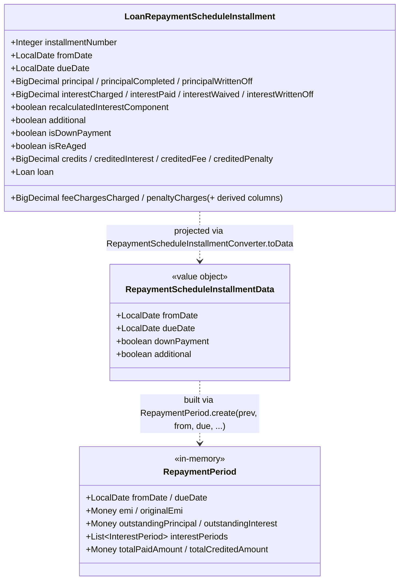

In Apache Fineract a loan installment is normally a row of `m_loan_repayment_schedule` mapped to the
`LoanRepaymentScheduleInstallment` JPA entity that ships with `fineract-loan`. The **progressive** engine
reuses that same persistent entity — there is no `ProgressiveLoanRepaymentScheduleInstallment` — but layers
two additional shapes on top of it:

- An immutable input DTO, `RepaymentScheduleInstallmentData` (under
  `fineract-progressive-loan/.../loanproduct/calc/data/`), that the EMI calculator consumes.
- A converter, `RepaymentScheduleInstallmentConverter` (under
  `fineract-progressive-loan/.../loanproduct/calc/converter/`), that projects the JPA entity into the DTO.

This page explains both layers, walks through the field differences, and shows how an installment carries
extra concepts that only the progressive engine needs (`isDownPayment`, `isAdditional`, "re-aged",
credited principal/interest).

<Info>
Down-payments, additional installments, credited principal/interest and the "re-aged" flag are all features
that originated with the advanced-payment / progressive strategy but were added to the shared
`LoanRepaymentScheduleInstallment` entity to keep one schedule table per loan. The progressive engine simply
*uses* more of those fields than the cumulative engine does.
</Info>

## The shared persistent entity: `LoanRepaymentScheduleInstallment`

The actual row lives in `fineract-loan` and maps to `m_loan_repayment_schedule`:

```java
// fineract-loan/.../loanaccount/domain/LoanRepaymentScheduleInstallment.java
public class LoanRepaymentScheduleInstallment extends AbstractAuditableWithUTCDateTimeCustom<Long>
        implements Comparable<LoanRepaymentScheduleInstallment> {

    @Column(name = "installment", nullable = false)             private Integer    installmentNumber;
    @Column(name = "fromdate")                                  private LocalDate  fromDate;
    @Column(name = "duedate", nullable = false)                 private LocalDate  dueDate;

    // Principal
    @Column(name = "principal_amount", scale = 6, precision = 19)             private BigDecimal principal;
    @Column(name = "principal_completed_derived",  scale = 6, precision = 19) private BigDecimal principalCompleted;
    @Column(name = "principal_writtenoff_derived", scale = 6, precision = 19) private BigDecimal principalWrittenOff;

    // Interest
    @Column(name = "interest_amount",              scale = 6, precision = 19) private BigDecimal interestCharged;
    @Column(name = "interest_completed_derived",   scale = 6, precision = 19) private BigDecimal interestPaid;
    @Column(name = "interest_waived_derived",      scale = 6, precision = 19) private BigDecimal interestWaived;
    @Column(name = "interest_writtenoff_derived",  scale = 6, precision = 19) private BigDecimal interestWrittenOff;
    @Column(name = "accrual_interest_derived",     scale = 6, precision = 19) private BigDecimal interestAccrued;
    @Column(name = "reschedule_interest_portion",  scale = 6, precision = 19) private BigDecimal rescheduleInterestPortion;

    // Fees / penalties (each with completed / waived / writtenoff / accrual)
    @Column(name = "fee_charges_amount", ...) private BigDecimal feeChargesCharged; // + 4 more
    @Column(name = "penalty_charges_amount", ...) private BigDecimal penaltyCharges;  // + 4 more

    @Column(name = "total_paid_in_advance_derived", scale = 6, precision = 19) private BigDecimal totalPaidInAdvance;
    @Column(name = "total_paid_late_derived",       scale = 6, precision = 19) private BigDecimal totalPaidLate;

    @Column(name = "completed_derived",   nullable = false) private boolean obligationsMet;
    @Column(name = "obligations_met_on_date")               private LocalDate obligationsMetOnDate;

    @Column(name = "recalculated_interest_component", nullable = false) private boolean recalculatedInterestComponent;
    @Column(name = "is_additional",                   nullable = false) private boolean additional;

    // Credit allocation columns — used heavily by the progressive engine
    @Column(name = "credits_amount",     scale = 6, precision = 19) private BigDecimal credits;
    @Column(name = "credited_interest",  scale = 6, precision = 19) private BigDecimal creditedInterest;
    @Column(name = "credited_fee",       scale = 6, precision = 19) private BigDecimal creditedFee;
    @Column(name = "credited_penalty",   scale = 6, precision = 19) private BigDecimal creditedPenalty;

    @Column(name = "is_down_payment", nullable = false) private boolean isDownPayment;
    @Column(name = "is_re_aged",      nullable = false) private boolean isReAged;
}
```

Two constructors are exposed for the progressive flow:

```java
public LoanRepaymentScheduleInstallment(Loan loan, Integer installmentNumber, LocalDate fromDate, LocalDate dueDate,
        BigDecimal principal, BigDecimal interest, BigDecimal feeCharges, BigDecimal penaltyCharges,
        boolean recalculatedInterestComponent, Set<LoanInterestRecalcuationAdditionalDetails> compoundingDetails,
        BigDecimal rescheduleInterestPortion, boolean isDownPayment) { ... }

public static LoanRepaymentScheduleInstallment newReAgedInstallment(Loan loan, Integer installmentNumber, ...);
public static LoanRepaymentScheduleInstallment newInstallmentWithMovedPaidAmountDuringReAging(Loan loan, ...);
```

Both branches use the same entity; the difference is in **which fields the cumulative vs. the progressive
engine populates and reads**.

## The progressive DTO: `RepaymentScheduleInstallmentData`

When the EMI calculator rebuilds its in-memory model from the persisted installments, it cannot accept the
heavy `@Entity` directly — it would drag in JPA proxies, lazy loading and Loan back-references. Instead the
calculator works against a tiny immutable DTO:

```java
// fineract-progressive-loan/.../loanproduct/calc/data/RepaymentScheduleInstallmentData.java
@Getter
@Builder
public final class RepaymentScheduleInstallmentData {

    private final LocalDate fromDate;
    private final LocalDate dueDate;
    private final boolean   downPayment;
    private final boolean   additional;

    public static RepaymentScheduleInstallmentData of(LocalDate fromDate, LocalDate dueDate,
                                                       boolean downPayment, boolean additional) {
        return RepaymentScheduleInstallmentData.builder()
                .fromDate(fromDate).dueDate(dueDate)
                .downPayment(downPayment).additional(additional)
                .build();
    }
}
```

Only the **date pair** plus two booleans survive the projection. The reason is that the calculator does not
re-derive what has already been paid — that is the job of `AdvancedPaymentScheduleTransactionProcessor` —
it only needs to know how the periods are *shaped* so it can build the matching list of `RepaymentPeriod`
objects.

## The bridge: `RepaymentScheduleInstallmentConverter`

The converter under `loanproduct/calc/converter/` is intentionally a one-liner:

```java
// fineract-progressive-loan/.../loanproduct/calc/converter/RepaymentScheduleInstallmentConverter.java
public final class RepaymentScheduleInstallmentConverter {

    private RepaymentScheduleInstallmentConverter() {}

    public static RepaymentScheduleInstallmentData toData(LoanRepaymentScheduleInstallment installment) {
        return RepaymentScheduleInstallmentData.of(
                installment.getFromDate(), installment.getDueDate(),
                installment.isDownPayment(), installment.isAdditional());
    }

    public static List<RepaymentScheduleInstallmentData> toDataList(
            List<LoanRepaymentScheduleInstallment> installments) {
        return installments.stream().map(RepaymentScheduleInstallmentConverter::toData).toList();
    }
}
```

The facade `EMICalculatorDataMapper` wraps it so callers do not depend on the converter directly:

```java
// fineract-progressive-loan/.../loanproduct/calc/EMICalculatorDataMapper.java
public static RepaymentScheduleInstallmentData toRepaymentScheduleInstallmentData(
        LoanRepaymentScheduleInstallment installment) {
    return RepaymentScheduleInstallmentConverter.toData(installment);
}

public static List<RepaymentScheduleInstallmentData> toRepaymentScheduleInstallmentDataList(
        List<LoanRepaymentScheduleInstallment> installments) {
    return RepaymentScheduleInstallmentConverter.toDataList(installments);
}
```

## What the calculator does with the DTO

`ProgressiveEMICalculator.generateInstallmentInterestScheduleModel(...)` is what consumes the list:

```java
// loanproduct/calc/ProgressiveEMICalculator.java
@Override
@NotNull
public ProgressiveLoanInterestScheduleModel generateInstallmentInterestScheduleModel(
        @NotNull List<RepaymentScheduleInstallmentData> installments,
        @NotNull ILoanConfigurationDetails loanProductRelatedDetail,
        final Integer installmentAmountInMultiplesOf, final MathContext mc) {
    installments = installments.stream()
            .filter(installment -> !installment.isDownPayment() && !installment.isAdditional())
            .toList();
    return generateInterestScheduleModel(installments,
            RepaymentScheduleInstallmentData::getFromDate,
            RepaymentScheduleInstallmentData::getDueDate,
            loanProductRelatedDetail, installmentAmountInMultiplesOf, mc);
}
```

Two filters are critical:

- **Down-payment installments** are excluded from the interest model. A down payment is an immediate
  principal reduction, not a "period" in the amortising-loan sense — its presence would distort the
  rate-factor product.
- **Additional installments** (the ones marked `is_additional = true`, typically created by re-amortisation
  or by `addRepaymentPeriods`) are also excluded; they are recomputed by the calculator itself once the base
  model is built.

The two booleans on the DTO are therefore the *minimum* information the calculator needs to faithfully
reconstruct the schedule.

## Diagram: in-memory vs. persistent shapes



## Where progressive-specific columns are populated

The columns that the progressive engine writes (and that the cumulative engine leaves untouched) are
populated by the progressive transaction processor and the EMI calculator:

| Column                         | Field                        | Populated by                                       |
|--------------------------------|------------------------------|----------------------------------------------------|
| `is_down_payment`              | `isDownPayment`              | `ProgressiveLoanScheduleGenerator.processDisbursements(...)` when `loanApplicationTerms.isDownPaymentEnabled()` |
| `is_additional`                | `additional`                 | `EMICalculator.addRepaymentPeriods(...)` and re-amortisation flows |
| `is_re_aged`                   | `isReAged`                   | `EMICalculator.updateModelRepaymentPeriodsDuringReAge(...)`        |
| `credits_amount`               | `credits`                    | `EMICalculator.creditPrincipal(...)`                |
| `credited_interest`            | `creditedInterest`           | `EMICalculator.creditInterest(...)`                 |
| `credited_fee` / `credited_penalty` | `creditedFee` / `creditedPenalty` | `AdvancedPaymentScheduleTransactionProcessor` charge handling |
| `recalculated_interest_component` | `recalculatedInterestComponent` | Interest-recalculation periods created by the calculator |
| `reschedule_interest_portion`  | `rescheduleInterestPortion`  | Re-amortisation with equal interest split           |

The cumulative engine does not call any of the `credit*` or re-age operations on the calculator, so those
columns stay zero for cumulative loans.

## Difference summary — cumulative vs. progressive use of the same row

| Concept                            | `fineract-loan` (cumulative)                          | `fineract-progressive-loan` (progressive)             |
|------------------------------------|--------------------------------------------------------|-------------------------------------------------------|
| Table                              | `m_loan_repayment_schedule`                            | `m_loan_repayment_schedule` (same)                    |
| JPA entity                         | `LoanRepaymentScheduleInstallment`                     | same                                                  |
| In-memory shape for the calculator | N/A (cumulative engine works on the entity directly)   | `RepaymentScheduleInstallmentData` + `RepaymentPeriod`|
| Down-payments                      | Not produced                                           | Produced as separate installments with `is_down_payment=true` |
| Re-age installments                | Not produced                                           | `is_re_aged=true`, principal/interest shifted forward |
| Additional installments            | Rare (manual)                                          | Routinely added by `addRepaymentPeriods(...)`         |
| `credited_*` fields                | Unused                                                 | Written by `creditPrincipal` / `creditInterest`       |
| Principal/interest split           | Total interest divided evenly, principal back-derived  | Declining-balance EMI solved period-by-period         |
| Persisted side-state               | None beyond the row                                    | `ProgressiveLoanModel.json_model` snapshot            |

## How the snapshot is used

The progressive engine keeps a parallel **JSON snapshot** of the interest model
(`m_loan_progressive_model.json_model`, mapped by `ProgressiveLoanModel`) so that mid-life queries like a
prepayment quote do not need to recompute the entire schedule. The snapshot is restored to a fresh
`ProgressiveLoanInterestScheduleModel` instance by `ProgressiveLoanInterestScheduleModelParserServiceGsonImpl`
and queried via:

```java
// ProgressiveLoanScheduleGenerator.calculatePrepaymentAmount(...)
Optional<ProgressiveLoanInterestScheduleModel> savedModel =
        interestScheduleModelRepositoryWrapper.getSavedModel(loan, transactionDate);
ProgressiveLoanInterestScheduleModel model = savedModel.orElseThrow();
OutstandingDetails outstandingAmounts = emiCalculator.getOutstandingAmountsTillDate(model, transactionDate);
```

When the snapshot is *not* current (`hasValidModelForDate(loanId, businessDate)` returns false), the
service falls back to `readProgressiveLoanInterestScheduleModel(...)` which rebuilds the model **from the
persisted installments** using exactly the converter path described above.

## File map

```text
fineract-progressive-loan/src/main/java/org/apache/fineract/portfolio/
└── loanproduct/calc/
    ├── EMICalculatorDataMapper.java                                   — facade
    ├── converter/
    │   ├── RepaymentScheduleInstallmentConverter.java                 — entity → DTO
    │   ├── LoanTransactionConverter.java                              — transaction → ProcessedTransactionData
    │   └── LoanReAgeParameterConverter.java                           — reage param → DTO
    └── data/
        ├── RepaymentScheduleInstallmentData.java                      — the immutable DTO this page is about
        ├── RepaymentPeriod.java                                       — the in-memory installment
        ├── InterestPeriod.java
        ├── ProgressiveLoanInterestScheduleModel.java
        └── ...
└── loanaccount/domain/
    └── ProgressiveLoanModel.java                                       — JSON snapshot of the model
```

The persistent `LoanRepaymentScheduleInstallment` itself stays in
`fineract-loan/src/main/java/org/apache/fineract/portfolio/loanaccount/domain/LoanRepaymentScheduleInstallment.java`.

## See also

<CardGroup cols={2}>
  <Card title="EMI Calculator" icon="calculator" href="./emi-calculator">
    How `RepaymentPeriod` and `InterestPeriod` are derived from the DTO.
  </Card>
  <Card title="Schedule Generator" icon="list-ol" href="./schedule-generator">
    Where the progressive engine writes the down-payment, additional and re-aged installments.
  </Card>
</CardGroup>
