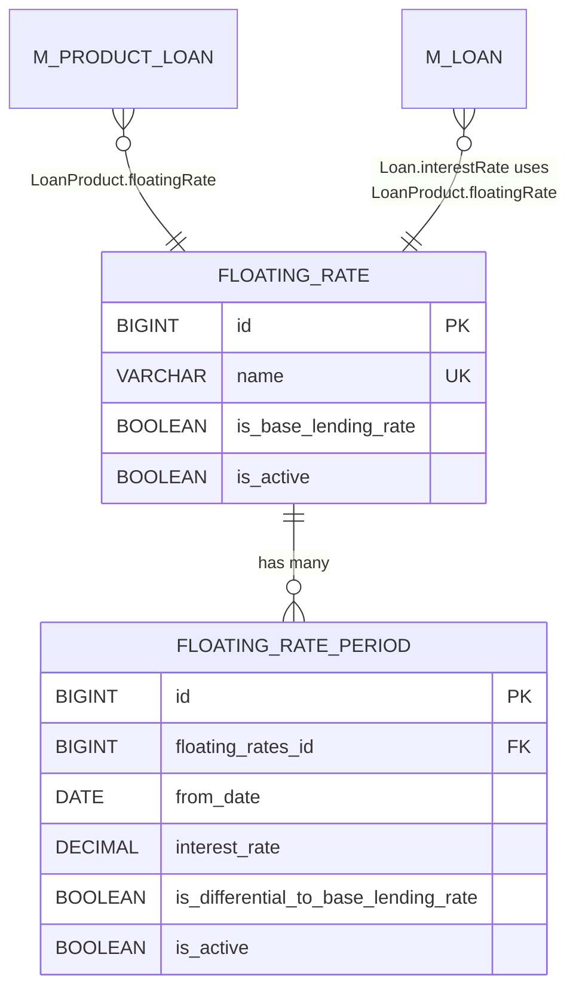
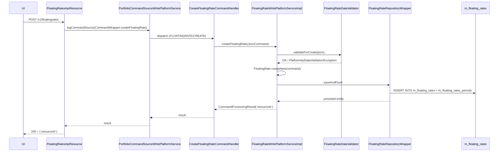

The [`fineract-rates`](https://github.com/apache/fineract/tree/develop/fineract-rates) module is Apache Fineract's mechanism for **floating** (a.k.a. variable / indexed) interest rates on loan products. Instead of stamping a fixed interest rate on a loan at disbursement, a floating-interest product points at a `FloatingRate` whose `ratePeriods` describe how the index has moved over time. At any business date the loan looks up the applicable rate, optionally adds its own differential, and produces an effective per-installment interest figure. Crucially, exactly one `FloatingRate` in the system can be marked as the **base lending rate (BLR)**; all other floating rates can declare themselves *differential to BLR*, in which case their numbers are deltas applied on top of the BLR rate at the same date.

This page is the reference for the floating-rate side of the module. The next page ([Rate API and handlers](/rates/rate-api-and-handlers)) covers the simpler, percent-of-fee `Rate` entity that lives in `fineract-provider`.

## Module layout

`fineract-rates/src/main/java/org/apache/fineract/portfolio/floatingrates/`:

| Subpackage | Notable contents |
|------------|------------------|
| `api/` | `FloatingRatesApiResource` (`/v1/floatingrates`), `FloatingRatesApiResourceSwagger` |
| `data/` | `FloatingRateData`, `FloatingRatePeriodData`, `FloatingRateRequest`, `FloatingRatePeriodRequest`, the `FloatingRateDTO` resolution token, `InterestRatePeriodData` (the final per-loan effective rate row) |
| `domain/` | `FloatingRate`, `FloatingRatePeriod`, `FloatingRateRepository`, `FloatingRateRepositoryWrapper` |
| `exception/` | `FloatingRateNotFoundException` |
| `handler/` | `CreateFloatingRateCommandHandler`, `UpdateFloatingRateCommandHandler` |
| `serialization/` | `FloatingRateDataValidator` |
| `service/` | `FloatingRatesReadPlatformService` / `Impl`, `FloatingRateWritePlatformService` / `Impl` |
| `starter/` | `FloatingRatesConfiguration` Spring beans |

## The data model



### `FloatingRate`

`fineract-rates/.../domain/FloatingRate.java`:

```java
@Entity
@Table(name = "m_floating_rates",
       uniqueConstraints = { @UniqueConstraint(columnNames = { "name" }, name = "unq_name") })
public class FloatingRate extends AbstractAuditableWithUTCDateTimeCustom<Long> {

    @Column(name = "name", length = 200, unique = true, nullable = false)
    private String name;

    @Column(name = "is_base_lending_rate", nullable = false)
    private boolean isBaseLendingRate;

    @Column(name = "is_active", nullable = false)
    private boolean isActive;

    @OrderBy(value = "fromDate,id")
    @OneToMany(cascade = CascadeType.ALL, mappedBy = "floatingRate",
               orphanRemoval = true, fetch = FetchType.EAGER)
    private List<FloatingRatePeriod> floatingRatePeriods;
}
```

Two flags drive the entire model:

- **`isBaseLendingRate`** — there can be **at most one** row in `m_floating_rates` with this flag set to true at any moment. The repository helper `FloatingRateRepository.retrieveBaseLendingRate()` finds it; the validator (`FloatingRateDataValidator.validateForCreate`) refuses a second one with `baselendingrate.duplicate`. Other floating rates may declare *their* periods as `isDifferentialToBaseLendingRate=true`, in which case the period's `interestRate` is read as a delta layered on top of the BLR period covering the same date.
- **`isActive`** — a soft toggle. Inactive floating rates still exist (and historical loans still resolve against them) but cannot be attached to new products.

The `@OrderBy("fromDate,id")` is load-bearing: the resolution algorithm in `fetchInterestRates(...)` walks the list in date order and assumes monotonic ordering.

### `FloatingRatePeriod`

`fineract-rates/.../domain/FloatingRatePeriod.java`:

```java
@Entity
@Table(name = "m_floating_rates_periods")
public class FloatingRatePeriod extends AbstractAuditableWithUTCDateTimeCustom<Long> {

    @ManyToOne @JoinColumn(name = "floating_rates_id", nullable = false)
    private FloatingRate floatingRate;

    @Column(name = "from_date", nullable = false)            private LocalDate fromDate;
    @Column(name = "interest_rate", scale = 6, precision = 19, nullable = false)
                                                             private BigDecimal interestRate;
    @Column(name = "is_differential_to_base_lending_rate", nullable = false)
                                                             private boolean isDifferentialToBaseLendingRate;
    @Column(name = "is_active", nullable = false)            private boolean isActive;

    public FloatingRatePeriodData toData(final FloatingRateDTO floatingRateDTO) {
        BigDecimal interest = getInterestRate().add(floatingRateDTO.getInterestRateDiff());
        if (isDifferentialToBaseLendingRate()) {
            interest = interest.add(floatingRateDTO.fetchBaseRate(fetchFromDate()));
        }
        final LocalDate fromDate = getFromDate();
        return new FloatingRatePeriodData(getId(), fromDate, interest, isDifferentialToBaseLendingRate(), isActive());
    }
}
```

Three numeric concepts to keep straight:

| Variable | Meaning |
|----------|---------|
| `period.interestRate` | The number stored on the period itself. For a BLR period this is the absolute rate. For a non-BLR period with `isDifferentialToBaseLendingRate=true` this is the *delta* over BLR. |
| `FloatingRateDTO.interestRateDiff` | Per-loan / per-product differential carried into the resolution call (e.g. *product adds +0.5%, loan adds +0.25%*). |
| `FloatingRateDTO.baseLendingRatePeriods` | The actual BLR period series passed in, used to resolve the base rate at each period's `fromDate`. |

The result returned by `toData(...)` is the **effective** rate at that period's start: `interestRate + interestRateDiff [+ blrRateAt(fromDate) if differential]`.

The unique constraint named `unq_rate_period` (referenced in `FloatingRateWritePlatformServiceImpl.handleDataIntegrityIssues`) prevents two periods on the same `floatingRate` having the same `fromDate` and being simultaneously active.

## How periods overlap and resolve

The resolution algorithm is `FloatingRate.fetchInterestRates(FloatingRateDTO)`:

```java
public Collection<FloatingRatePeriodData> fetchInterestRates(final FloatingRateDTO floatingRateDTO) {
    Collection<FloatingRatePeriodData> applicableRates = new ArrayList<>();
    FloatingRatePeriod previousPeriod = null;
    boolean addPeriodData = false;
    for (FloatingRatePeriod floatingRatePeriod : this.floatingRatePeriods) {
        if (floatingRatePeriod.isActive()) {
            if (applicableRates.isEmpty()
                    && DateUtils.isBefore(floatingRateDTO.getStartDate(), floatingRatePeriod.fetchFromDate())) {
                if (floatingRateDTO.isFloatingInterestRate()) {
                    addPeriodData = true;
                }
                if (previousPeriod != null) {
                    applicableRates.add(previousPeriod.toData(floatingRateDTO));
                } else if (!addPeriodData) {
                    applicableRates.add(floatingRatePeriod.toData(floatingRateDTO));
                }
            }
            if (addPeriodData) {
                applicableRates.add(floatingRatePeriod.toData(floatingRateDTO));
            }
            previousPeriod = floatingRatePeriod;
        }
    }
    if (applicableRates.isEmpty() && previousPeriod != null) {
        applicableRates.add(previousPeriod.toData(floatingRateDTO));
    }
    return applicableRates;
}
```

Two modes are encoded in `floatingRateDTO.isFloatingInterestRate()`:

1. **Non-floating loan** (`isFloatingInterestRate == false`) — only one period is returned. It is either:
   - the last `previousPeriod` whose `fromDate <= loan.startDate`, or
   - the *first* period if every period starts after the loan, or
   - the only active period.
   The loan locks that rate in for its lifetime.

2. **Floating loan** (`isFloatingInterestRate == true`) — multiple period rows are returned. The first one is the snapshot active **as of** `loan.startDate` (the "previous" period), then every subsequent active period is included so the loan schedule can re-rate at each `fromDate` boundary.

The "applicableRates.isEmpty() && DateUtils.isBefore(loan.startDate, period.fromDate)" check is the moment the algorithm has just walked **past** the loan's start date for the first time; that's when the snapshot is captured. Each period is then translated to `FloatingRatePeriodData` via `toData(...)`, which folds in the differential and the BLR rate.

### `FloatingRateDTO`

`fineract-rates/.../data/FloatingRateDTO.java` — the call-site context:

```java
public class FloatingRateDTO {
    private final boolean isFloatingInterestRate;
    private final LocalDate startDate;
    private BigDecimal interestRateDiff;          // mutable: product + loan differentials added
    private BigDecimal actualInterestRateDiff;    // original; used to reset between schedule runs
    private final Collection<FloatingRatePeriodData> baseLendingRatePeriods;

    public BigDecimal fetchBaseRate(LocalDate date) {
        BigDecimal rate = null;
        for (FloatingRatePeriodData periodData : this.baseLendingRatePeriods) {
            final LocalDate periodFromDate = periodData.getFromDate();
            if (!DateUtils.isAfter(periodFromDate, date)) {
                rate = periodData.getInterestRate();
                break;
            }
        }
        return rate;
    }

    public void addInterestRateDiff(final BigDecimal diff) { this.interestRateDiff = this.interestRateDiff.add(diff); }
    public void resetInterestRateDiff()                    { this.interestRateDiff = this.actualInterestRateDiff; }
}
```

Three notable behaviours:

- `fetchBaseRate(date)` walks the **already-resolved** BLR periods list and returns the rate of the latest period whose `fromDate` is `<= date`. The loop assumes the list is in reverse-fromDate order; the consumer is responsible for passing it that way.
- `interestRateDiff` is *mutable*. The loan schedule may add a per-installment differential and then reset it for the next installment via `resetInterestRateDiff()`.
- `baseLendingRatePeriods` is itself a `Collection<FloatingRatePeriodData>` — i.e. already-resolved BLR period rows, not raw `FloatingRatePeriod` entities. The consumer typically calls `blrFloatingRate.fetchInterestRates(blrDTO)` first to flatten the BLR, then passes the result here.

### Two-level overlap example

Setup:

- **BLR floating rate** `id=1`, periods:
  - `2024-01-01` @ 7.00% (non-differential)
  - `2024-07-01` @ 7.50%
  - `2025-01-01` @ 8.00%

- **Mortgage floating rate** `id=2`, `isDifferentialToBaseLendingRate=false` for some periods, `true` for others:
  - `2024-01-01` @ 1.25% (differential)
  - `2024-09-01` @ 1.50% (differential)
  - `2025-04-01` @ 9.20% (absolute — `isDifferentialToBaseLendingRate=false`)

A floating loan opened `2024-05-15` against `id=2`, `floatingRateDTO.interestRateDiff = 0.25` (loan-specific spread on top of product):

```
walk id=2 periods:
  p1(2024-01-01, 1.25, diff=true)  → loan.startDate(2024-05-15) NOT before 2024-01-01,
                                     so applicableRates still empty; previousPeriod = p1.
  p2(2024-09-01, 1.50, diff=true)  → loan.startDate(2024-05-15) IS before 2024-09-01,
                                     applicableRates empty → enter the if-block.
                                     isFloatingInterestRate=true → addPeriodData=true.
                                     previousPeriod=p1, so add p1.toData(dto):
                                         interest = 1.25 + 0.25 + BLR(2024-01-01)
                                                  = 1.25 + 0.25 + 7.00 = 8.50
                                     then (since addPeriodData) add p2.toData:
                                         interest = 1.50 + 0.25 + BLR(2024-09-01)
                                                  = 1.50 + 0.25 + 7.50 = 9.25
  p3(2025-04-01, 9.20, diff=false) → addPeriodData true → add p3.toData:
                                     interest = 9.20 + 0.25 = 9.45  (no BLR add, not differential)

Result: [
  (2024-01-01, 8.50, true),
  (2024-09-01, 9.25, true),
  (2025-04-01, 9.45, false)
]
```

The loan schedule then re-rates the installment interest at each period boundary.

If instead the loan is **not** floating (`isFloatingInterestRate=false`), only the *first* row `(2024-01-01, 8.50, true)` is emitted — the rate at disbursement is locked in.

## REST: `/v1/floatingrates`

`fineract-rates/.../api/FloatingRatesApiResource.java`:

| Method | Path | Operation | Command |
|--------|------|-----------|---------|
| `POST` | `/v1/floatingrates` | `createFloatingRate(FloatingRateRequest)` | `FLOATINGRATE/CREATE` |
| `GET` | `/v1/floatingrates` | `retrieveAll()` | (read) |
| `GET` | `/v1/floatingrates/{floatingRateId}` | `retrieveOne(id)` | (read) |
| `PUT` | `/v1/floatingrates/{floatingRateId}` | `updateFloatingRate(id, FloatingRateRequest)` | `FLOATINGRATE/UPDATE` |

No `DELETE` — floating rates are never removed; you toggle `isActive=false`. Permission resource: `"FLOATINGRATE"`. The update Swagger description states: *"Updates new Floating Rate. Rate Periods in the past cannot be modified. All the future rateperiods would be replaced with the new ratePeriods data sent."* — this is enforced in `FloatingRate.updateRatePeriods(...)`.

### `FloatingRateRequest`

`fineract-rates/.../data/FloatingRateRequest.java`:

```java
@Data @NoArgsConstructor @AllArgsConstructor
public class FloatingRateRequest implements Serializable {
    private String name;
    private Boolean isBaseLendingRate;
    private Boolean isActive;
    private List<FloatingRatePeriodRequest> ratePeriods;
}
```

Each `FloatingRatePeriodRequest` carries `fromDate`, `interestRate`, `isDifferentialToBaseLendingRate`, plus the locale/dateFormat pair the FromJsonHelper needs to parse them.

### Create example

```http
POST /fineract-provider/api/v1/floatingrates
Content-Type: application/json

{
  "name": "PRIME-USD-2024",
  "isBaseLendingRate": false,
  "isActive": true,
  "ratePeriods": [
    { "fromDate": "2024-04-01", "interestRate": 1.50,
      "isDifferentialToBaseLendingRate": true,  "dateFormat": "yyyy-MM-dd", "locale": "en" },
    { "fromDate": "2024-10-01", "interestRate": 1.75,
      "isDifferentialToBaseLendingRate": true,  "dateFormat": "yyyy-MM-dd", "locale": "en" }
  ]
}
```

What happens (`FloatingRateWritePlatformServiceImpl.createFloatingRate`):

1. `FloatingRateDataValidator.validateForCreate(json)`:
   - Schema check via `checkForUnsupportedParameters` against `SUPPORTED_PARAMETERS_FOR_FLOATING_RATES`.
   - `name` non-blank ≤ 200.
   - If `isBaseLendingRate=true`, ensures no other BLR exists via `floatingRateRepository.retrieveBaseLendingRate()`.
   - For each rate period: `fromDate` must be **after `DateUtils.getBusinessLocalDate().plusDays(1)`** (i.e. future-dated), `interestRate` non-null and non-negative, `isDifferentialToBaseLendingRate=true` requires that a BLR exists and that *this* rate is itself **not** the BLR. Duplicate `fromDate` across the array is rejected with `multiple.same.date`.
2. `FloatingRate.createNew(command)` parses the same JSON via `getRatePeriods(command)` and constructs the entity with all `FloatingRatePeriod.isActive=true`.
3. `floatingRateRepository.saveAndFlush(...)`.
4. On `DataIntegrityViolationException`, `handleDataIntegrityIssues` translates the two SQL constraint names:
   - `unq_name` → `error.msg.floatingrates.duplicate.name`
   - `unq_rate_period` → `error.msg.floatingrates.duplicate.active.fromdate`

### Update semantics

`FloatingRate.update(JsonCommand)`:

```java
public Map<String, Object> update(final JsonCommand command) {
    if (command.isChangeInStringParameterNamed("name", this.name))    { this.name = ...; }
    if (command.isChangeInBooleanParameterNamed("isBaseLendingRate", this.isBaseLendingRate)) {
        this.isBaseLendingRate = ...;
    }
    if (command.isChangeInBooleanParameterNamed("isActive", this.isActive)) { this.isActive = ...; }

    final List<FloatingRatePeriod> newRatePeriods = getRatePeriods(command);
    if (newRatePeriods != null && !newRatePeriods.isEmpty()) {
        updateRatePeriods(newRatePeriods);
    }
}

private void updateRatePeriods(final List<FloatingRatePeriod> newRatePeriods) {
    final LocalDate today = DateUtils.getBusinessLocalDate();
    if (this.floatingRatePeriods != null) {
        for (FloatingRatePeriod ratePeriod : this.floatingRatePeriods) {
            LocalDate fromDate = ratePeriod.getFromDate();
            if (DateUtils.isAfter(fromDate, today)) {     // future-dated → deactivate
                ratePeriod.setActive(false);
            }
        }
    }
    for (FloatingRatePeriod newRatePeriod : newRatePeriods) {
        newRatePeriod.updateFloatingRate(this);
        this.floatingRatePeriods.add(newRatePeriod);       // append all incoming
    }
}
```

The contract is: *"Rate Periods in the past cannot be modified. All the future rate periods would be replaced with the new ratePeriods data sent."* Concretely:

1. Walk the existing periods. Any whose `fromDate` is *in the future* gets `isActive=false` (soft-deactivate, history-preserving).
2. Append every incoming period as a brand-new row. The validator already verified all incoming `fromDate`s are themselves in the future.
3. Past periods are never touched. The audit trail is intact because deactivated future periods stay in `m_floating_rates_periods` with `is_active=0`.

This explains the resolution algorithm's `if (floatingRatePeriod.isActive())` guard — deactivated future periods are silently skipped.

## Command handlers

`fineract-rates/.../handler/`:

```java
@Service
@CommandType(entity = "FLOATINGRATE", action = "CREATE")
public class CreateFloatingRateCommandHandler implements NewCommandSourceHandler {
    private final FloatingRateWritePlatformService writePlatformService;
    @Transactional
    @Override
    public CommandProcessingResult processCommand(final JsonCommand command) {
        return this.writePlatformService.createFloatingRate(command);
    }
}

@Service
@CommandType(entity = "FLOATINGRATE", action = "UPDATE")
public class UpdateFloatingRateCommandHandler implements NewCommandSourceHandler {
    private final FloatingRateWritePlatformService writePlatformService;
    @Transactional
    @Override
    public CommandProcessingResult processCommand(final JsonCommand command) {
        return this.writePlatformService.updateFloatingRate(command);
    }
}
```

Both are autowired via constructor (the `@Autowired` is on the explicit constructor in this module; most handlers use Lombok `@RequiredArgsConstructor`). Routing is via `CommandHandlerProvider` keyed on `(entity="FLOATINGRATE", action)`.

## Spring wiring

`fineract-rates/.../starter/FloatingRatesConfiguration.java`:

```java
@Configuration
public class FloatingRatesConfiguration {

    @Bean
    @ConditionalOnMissingBean(FloatingRatesReadPlatformService.class)
    public FloatingRatesReadPlatformService floatingRatesReadPlatformService(JdbcTemplate jdbcTemplate) {
        return new FloatingRatesReadPlatformServiceImpl(jdbcTemplate);
    }

    @Bean
    @ConditionalOnMissingBean(FloatingRateWritePlatformService.class)
    public FloatingRateWritePlatformService floatingRateWritePlatformService(FloatingRateDataValidator fromApiJsonDeserializer,
            FloatingRateRepositoryWrapper floatingRateRepository) {
        return new FloatingRateWritePlatformServiceImpl(fromApiJsonDeserializer, floatingRateRepository);
    }
}
```

`@ConditionalOnMissingBean` lets custom downstream modules override either bean (e.g. swap the read impl for one that caches the BLR aggressively).

## Where floating rates plug into loans

In `fineract-loan` and the loan-product layer:

- `LoanProduct.floatingRate` is a `@ManyToOne FloatingRate` reference. The product also stores `interestRateDifferential` (the product-level spread on top of the floating rate) and `isFloatingInterestRateCalculationAllowed`.
- A loan derived from such a product carries `Loan.isFloatingInterestRate` (per-loan flag — even if the product allows it, an individual loan can be set to lock).
- When the schedule is generated:
  1. Read `loanProduct.floatingRate`.
  2. If it is differential, also read the BLR via `FloatingRateRepository.retrieveBaseLendingRate()` and flatten its periods.
  3. Build a `FloatingRateDTO(isFloating, loan.disbursementDate, productDiff + loanDiff, blrPeriods)`.
  4. Call `floatingRate.fetchInterestRates(dto)` → `Collection<FloatingRatePeriodData>`.
  5. Feed the result into the schedule generator; for floating loans the schedule re-rates per period, for locked loans it uses the single returned row.

The actual schedule-generation code lives in `fineract-loan/.../portfolio/loanaccount/loanschedule/` and `fineract-loan/.../portfolio/loanproduct/`; the only thing `fineract-rates` cares about is providing a correct `Collection<FloatingRatePeriodData>` for any `(floatingRate, startDate, isFloating, diff)` quadruple.

## Read path

`FloatingRatesReadPlatformService` (interface + JDBC impl) provides:

- `retrieveAll()` — all floating rates (lightweight: id + name + `isActive` + `isBaseLendingRate` + created/modified audit).
- `retrieveOne(id)` — single rate with its periods.

`FloatingRateData` (`fineract-rates/.../data/FloatingRateData.java`) is what the read service returns. It is `Comparable` (by id + name + flags) so callers can sort, and `Serializable` for downstream caching. The `interestRateFrequencyTypeOptions` field is empty in the standard list response and populated on the template endpoint (planned for future use; the BLR template returns it as the dropdown for installment-rate frequency).

## Exceptions

`fineract-rates/.../exception/FloatingRateNotFoundException` — raised by `FloatingRateRepositoryWrapper.findOneWithNotFoundDetection(id)` when an unknown id is referenced. Mapped to HTTP 404 by `fineract-provider/.../infrastructure/core/exceptionmapper`.

Two **data-integrity** errors are thrown directly from `FloatingRateWritePlatformServiceImpl.handleDataIntegrityIssues`:

| Constraint name | Error code | Message |
|-----------------|-----------|---------|
| `unq_name` | `error.msg.floatingrates.duplicate.name` | "Floating Rate with name `X` already exists" |
| `unq_rate_period` | `error.msg.floatingrates.duplicate.active.fromdate` | "Attempt to add multiple floating rate periods with same fromdate" |

Other JPA failures fall through to `ErrorHandler.getMappable(...)` which wraps them in `error.msg.floatingrates.unknown.data.integrity.issue`.

## Worked end-to-end create

```http
POST /fineract-provider/api/v1/floatingrates
{
  "name": "USD-BLR",
  "isBaseLendingRate": true,
  "isActive": true,
  "ratePeriods": [
    { "fromDate": "2024-08-01", "interestRate": 6.50, "dateFormat": "yyyy-MM-dd", "locale": "en" }
  ]
}
```

Sequence:



If `isBaseLendingRate=true` and one already exists, validation fails with code `baselendingrate.duplicate` ("Base Lending Rate already exists"). If two periods share a `fromDate`, validation fails with `multiple.same.date` ("More than one entry in ratePeriods have same fromDate."). If those checks pass but the DB constraint `unq_name` fires first (race condition), the integrity handler reports `error.msg.floatingrates.duplicate.name`.

## Summary

- `FloatingRate` is a versioned curve indexed by `fromDate`. One — and only one — row in `m_floating_rates` can be the **base lending rate**.
- Other floating rates can declare their periods as **differential to BLR**, in which case `period.interestRate` is read as a delta added to `BLR.fetchBaseRate(period.fromDate)`.
- `FloatingRate.fetchInterestRates(FloatingRateDTO)` is the single resolution routine. For non-floating loans it returns one row (the active rate at disbursement). For floating loans it returns the active rate at disbursement plus every subsequent active period — the schedule generator re-rates at each boundary.
- `FloatingRate.update(...)` is *future-only*: existing past periods are immutable; existing future periods are soft-deactivated; new incoming periods are appended.
- The REST surface is just `POST / GET list / GET one / PUT`; there is no delete. `FLOATINGRATE/CREATE` and `FLOATINGRATE/UPDATE` are the two command actions.
- Wiring is `@Configuration FloatingRatesConfiguration` with `@ConditionalOnMissingBean` overrides; the resource is auto-registered by Jersey.

For the unrelated `Rate` entity (a flat percentage applied to loan fees, lives in `fineract-provider`), continue to [Rate API and handlers](/rates/rate-api-and-handlers).
