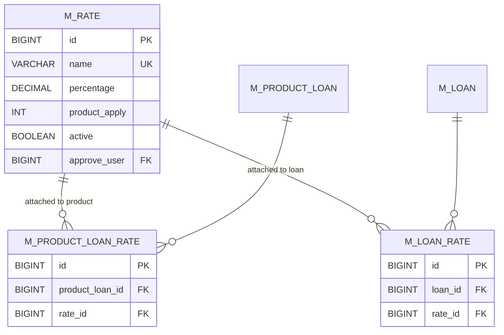
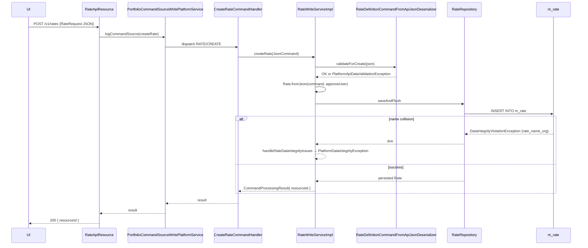

Alongside the floating-interest infrastructure of `fineract-rates` ([Floating rates](/rates/floating-rates)), Apache Fineract carries a much simpler, complementary abstraction in `fineract-provider`: the **`Rate`** entity. A `Rate` is just *"a named percentage I want to associate with a loan product (and, by extension, every loan derived from it)"*. The flagship use case is jurisdiction-specific fee surcharges or rate adjustments — e.g. a "VAT on interest" rate, a "regulatory levy" rate, a "ICA Bowpi 10%" rate — that the schedule generator or fee posting needs to layer on top of the base interest / fee figures.

This page documents:

- the JPA entity in `fineract-core/src/main/java/org/apache/fineract/portfolio/rate/domain/Rate.java`,
- the `RateAppliesTo` enum (currently `LOAN` only),
- the REST surface at `/v1/rates` (`fineract-provider/.../rate/api/RateApiResource.java`),
- the two command handlers (`RATE/CREATE`, `RATE/UPDATE`),
- the read/write services, the JSON deserializer, the assembler that hydrates rates into loan products, and the integrity-error mapping.

It also clarifies how `Rate` differs from `Charge`, `FloatingRate`, and `TaxComponent` — three other percentage-bearing concepts in the codebase.

## Where the code lives

The `Rate` story is intentionally split between modules:

| File | Module | Why |
|------|--------|-----|
| `Rate.java`, `RateAppliesTo.java` | `fineract-core/src/main/java/org/apache/fineract/portfolio/rate/domain/` | Loan product / loan account modules need to compile against the entity without depending on `fineract-provider`. |
| `RateData.java` | `fineract-core/src/main/java/org/apache/fineract/portfolio/rate/data/` | Same — read DTO is shared. |
| `RateRepository`, `RateRepositoryWrapper` | `fineract-provider/src/main/java/org/apache/fineract/portfolio/rate/domain/` | Repository bound to the provider Spring context. |
| `RateApiResource`, `RateApiConstants`, `RateRequest` | `fineract-provider/.../portfolio/rate/api/` | The `/v1/rates` Jersey resource. |
| `CreateRateCommandHandler`, `UpdateRateCommandHandler` | `fineract-provider/.../portfolio/rate/handler/` | `@CommandType` dispatch. |
| `RateDefinitionCommandFromApiJsonDeserializer` | `fineract-provider/.../portfolio/rate/serialization/` | JSON validation. |
| `RateAssembler`, `RateEnumerations`, `RateReadServiceImpl`, `RateWriteServiceImpl` | `fineract-provider/.../portfolio/rate/service/` | Read/write platform services. |
| `RateConfiguration` | `fineract-provider/.../portfolio/rate/starter/` | Spring bean wiring. |
| `RateAlreadyExistException`, `RateNotFoundException` | `fineract-provider/.../portfolio/rate/exception/` | Typed errors. |

The original `Rate` model was contributed by Bowpi GT (see the `Bowpi GT Created by Jose on 19/07/2017.` Javadoc tag on most files in this package).

## The `Rate` entity

`fineract-core/src/main/java/org/apache/fineract/portfolio/rate/domain/Rate.java`:

```java
@Entity
@Table(name = "m_rate", uniqueConstraints = { @UniqueConstraint(columnNames = { "name" }, name = "name") })
public class Rate extends AbstractAuditableCustom {

    @Column(name = "name", length = 250, unique = true)
    private String name;

    @Column(name = "percentage", scale = 10, precision = 2, nullable = false)
    private BigDecimal percentage;

    @Column(name = "product_apply", length = 100)
    private Integer productApply;

    @Column(name = "active", nullable = false)
    private boolean active;

    @ManyToOne
    @JoinColumn(name = "approve_user", nullable = true)
    private AppUser approveUser;
}
```

Key facts:

- **Single row in `m_rate`** per rate-card entry. The unique constraint named `name` (the constraint name is the same as the column name) prevents duplicates; the write service maps that violation to a `PlatformDataIntegrityException` with code `error.msg.fund.duplicate.externalId` (yes, the error code says "fund" — the integrity handler reuses the funds module's message bundle).
- **`percentage`** is `BigDecimal` with `scale = 10, precision = 2`. Conceptually that should be the other way round (`scale = 2, precision = 10`) for a percentage; the column is defined as written so the actual stored values can hold one or two whole digits with up to a few decimals. Treat it as a percentage *value* — e.g. `12.5` for 12.5%.
- **`productApply`** is an `Integer` column storing the `RateAppliesTo` ordinal. The model defines only `LOAN(1)` today (see below); the column has length 100 historically.
- **`approveUser`** is an optional `AppUser` reference — the user authorised to apply this rate. The column allows null; if set, only that operator can attach the rate to a product (the enforcement is in `fineract-loan`'s product write services, not here).

### `Rate.fromJson` and `Rate.update`

```java
public static Rate fromJson(final JsonCommand command, AppUser user) {
    final String name = command.stringValueOfParameterNamed("name");
    final BigDecimal percentage = command.bigDecimalValueOfParameterNamed("percentage");
    final RateAppliesTo productApply = RateAppliesTo.fromInt(command.integerValueOfParameterNamed("productApply"));
    final boolean active = command.booleanPrimitiveValueOfParameterNamed("active");
    return new Rate(name, percentage, productApply, active, user);
}

public Map<String, Object> update(final JsonCommand command) {
    final Map<String, Object> actualChanges = new LinkedHashMap<>(7);

    if (command.isChangeInStringParameterNamed("name", this.name)) { /* set, record */ }
    if (command.isChangeInBigDecimalParameterNamed("percentage", this.percentage)) { /* set, record */ }

    if (command.isChangeInIntegerParameterNamed("productApply", this.productApply)) {
        final String errorMessage = "Update of Rate applies to is not supported";
        throw new ChargeParameterUpdateNotSupportedException("rate.applies.to", errorMessage);
    }

    if (command.isChangeInBooleanParameterNamed("active", this.active)) { /* set, record */ }
    if (command.isChangeInLongParameterNamed("approveUserId", getApproveUserId())) {
        final Long newValue = command.longValueOfParameterNamed("approveUserId");
        actualChanges.put("approveUserId", newValue);
        // note: actual approveUser swap is done in RateWriteServiceImpl.updateRate
    }
    return actualChanges;
}
```

Two important nuances:

1. **`productApply` is immutable after create**. Changing it throws `ChargeParameterUpdateNotSupportedException("rate.applies.to", ...)` — yes, this re-uses the exception class from `fineract-charge/.../exception/ChargeParameterUpdateNotSupportedException.java`, because both the charge and rate modules share the "you cannot change what this resource applies to once set" pattern.
2. **`approveUser` swap happens in the write service**, not in the entity. The entity records the *desired* new id in the change map; `RateWriteServiceImpl.updateRate(...)` reads the change map, looks up the new `AppUser` (or 404s with `UserNotFoundException`), and only then mutates `rateToUpdate.setApproveUser(newApproveUser)`.

### `RateAppliesTo`

`fineract-core/src/main/java/org/apache/fineract/portfolio/rate/domain/RateAppliesTo.java`:

```java
public enum RateAppliesTo {
    INVALID(0, "rateAppliesTo.invalid"),
    LOAN(1, "rateAppliesTo.loan");

    public static RateAppliesTo fromInt(final Integer rateAppliesTo) {
        return rateAppliesTo != null && rateAppliesTo == 1 ? LOAN : INVALID;
    }
    public boolean isLoanRate() { return this.value.equals(LOAN.getValue()); }
    public static Object[] validValues() { return new Object[] { LOAN.getValue() }; }
}
```

`LOAN` is the only real value. The enum exists for future extension (e.g. `RateAppliesTo.SAVINGS`), but only the loan path is implemented today. `RateEnumerations.rateAppliesTo(Integer)` is the canonical int → `EnumOptionData` converter for the REST DTO:

```java
public static EnumOptionData rateAppliesTo(final RateAppliesTo type) {
    switch (type) {
        case LOAN: return new EnumOptionData(1L, "rateAppliesTo.loan", "Loan");
        default:   return new EnumOptionData(0L, "rateAppliesTo.invalid", "Invalid");
    }
}
```

## REST: `/v1/rates`

`fineract-provider/.../portfolio/rate/api/RateApiResource.java`:

```java
@Path("/v1/rates")
@Component
@Tag(name = "Rate", description = "")
@RequiredArgsConstructor
public class RateApiResource {
    private static final Set<String> RESPONSE_DATA_PARAMETERS = new HashSet<>(
            Arrays.asList("id", "name", "percentage", "productApply", "active"));
    private static final String RESOURCE_NAME_FOR_PERMISSIONS = "RATE";

    @GET @Path("{rateId}")    public RateData retrieveRate(@PathParam("rateId") Long rateId) { ... }
    @POST                     public CommandProcessingResult createRate(final RateRequest rateRequest) { ... }
    @GET                      public List<RateData> getAllRates() { ... }
    @PUT @Path("{rateId}")    public CommandProcessingResult updateRate(@PathParam("rateId") Long rateId, final RateRequest rateRequest) { ... }
}
```

Endpoint reference:

| Method | Path | Operation | Permission resource |
|--------|------|-----------|---------------------|
| `GET` | `/v1/rates` | `getAllRates()` | `RATE` |
| `GET` | `/v1/rates/{rateId}` | `retrieveRate(rateId)` | `RATE` |
| `POST` | `/v1/rates` | `createRate(RateRequest)` → `RATE/CREATE` | enforced by command audit layer |
| `PUT` | `/v1/rates/{rateId}` | `updateRate(rateId, RateRequest)` → `RATE/UPDATE` | enforced by command audit layer |

Notably, **there is no `DELETE`**. To retire a rate you set `active=false`. There is also **no `template`** endpoint — the only dropdown the UI needs is `RateAppliesTo`, and that has one real value (`LOAN`).

### `RateRequest`

`fineract-provider/.../portfolio/rate/api/RateRequest.java`:

```java
@Data @AllArgsConstructor @NoArgsConstructor
public class RateRequest implements Serializable {
    private String     name;
    private BigDecimal percentage;
    private Integer    productApply;
    private Boolean    active;
    private String     locale;
}
```

`approveUserId` is *not* on `RateRequest` but is supported by the JSON deserializer (see below) — clients send it as a top-level JSON field, the `RateRequest` POJO simply omits it.

### `RateApiConstants`

`fineract-provider/.../portfolio/rate/api/RateApiConstants.java`:

```java
public static final String approveUserIdParamName = "approveUserId";
public static final String rate                   = "rate";
public static final String rateName               = "name";
public static final String ratePercentage         = "percentage";
public static final String rateProductApply       = "productApply";
```

## Command handlers

`fineract-provider/.../portfolio/rate/handler/`:

```java
@Service
@CommandType(entity = "RATE", action = "CREATE")
public class CreateRateCommandHandler implements NewCommandSourceHandler {
    private final RateWriteService writePlatformService;
    @Override
    public CommandProcessingResult processCommand(final JsonCommand command) {
        return this.writePlatformService.createRate(command);
    }
}

@Service
@CommandType(entity = "RATE", action = "UPDATE")
public class UpdateRateCommandHandler implements NewCommandSourceHandler {
    private final RateWriteService writePlatformService;
    @Transactional
    @Override
    public CommandProcessingResult processCommand(final JsonCommand command) {
        return this.writePlatformService.updateRate(command.entityId(), command);
    }
}
```

Both are autowired via constructor (`@Autowired` on the explicit constructor). `CommandHandlerProvider` (from `fineract-command`) maintains the `Map<(entity, action), NewCommandSourceHandler>`, so `RATE/CREATE` and `RATE/UPDATE` route automatically.

## The JSON deserializer

`fineract-provider/.../portfolio/rate/serialization/RateDefinitionCommandFromApiJsonDeserializer.java`:

```java
private static final Set<String> SUPPORTED_PARAMETERS = new HashSet<>(
        Arrays.asList("id", "name", "percentage", "productApply", "active", "approveUser", "locale"));

public void validateForCreate(final String json) {
    this.fromApiJsonHelper.checkForUnsupportedParameters(typeOfMap, json, SUPPORTED_PARAMETERS);
    final DataValidatorBuilder baseDataValidator = new DataValidatorBuilder(errors).resource(RateApiConstants.rateName);

    final String name = this.fromApiJsonHelper.extractStringNamed("name", element);
    baseDataValidator.reset().parameter("name").value(name).notBlank().notExceedingLengthOf(250);

    final BigDecimal percentage = this.fromApiJsonHelper.extractBigDecimalWithLocaleNamed("percentage", element);
    baseDataValidator.reset().parameter("percentage").value(percentage).notBlank();

    final String productApply = this.fromApiJsonHelper.extractStringNamed("productApply", element);
    baseDataValidator.reset().parameter("productApply").value(productApply).notBlank().notExceedingLengthOf(100);

    throwExceptionIfValidationWarningsExist(errors);
}
```

`validateForUpdate(json)` is the same shape but every field is optional — the deserializer only asserts non-blank if the field is present.

Quirks:

- The supported-set lists `approveUser` (no `Id` suffix) — clients should send the field by that name even though the constant in `RateApiConstants` is `approveUserIdParamName`. The write service reads it as a long named `approveUserId`. In practice both spellings round-trip safely because `checkForUnsupportedParameters` is the only consumer of the `approveUser` string and the write path independently reads `approveUserId`.
- `id` is in `SUPPORTED_PARAMETERS` so existing payloads containing `id` survive the schema check on update.

## The write service

`fineract-provider/.../portfolio/rate/service/RateWriteServiceImpl.java`:

### Create

```java
public CommandProcessingResult createRate(JsonCommand command) {
    try {
        this.context.authenticatedUser();
        this.fromApiJsonDeserializer.validateForCreate(command.json());

        final Long approveUserId = command.longValueOfParameterNamed(approveUserIdParamName);
        AppUser approveUser = null;
        if (approveUserId != null) {
            approveUser = this.appUserRepository.findById(approveUserId)
                    .orElseThrow(() -> new UserNotFoundException(approveUserId));
        }
        final Rate rate = Rate.fromJson(command, approveUser);
        this.rateRepository.saveAndFlush(rate);
        return new CommandProcessingResultBuilder()
                .withCommandId(command.commandId()).withEntityId(rate.getId()).build();
    } catch (JpaSystemException | DataIntegrityViolationException dve) {
        handleRateDataIntegrityIssues(command, dve.getMostSpecificCause(), dve);
        return CommandProcessingResult.empty();
    } catch (PersistenceException dve) { ... }
}
```

### Update

```java
@Transactional
public CommandProcessingResult updateRate(final Long rateId, final JsonCommand command) {
    this.context.authenticatedUser();
    final Rate rateToUpdate = this.rateRepository.findById(rateId)
            .orElseThrow(() -> new RateNotFoundException(rateId));

    final Map<String, Object> changes = rateToUpdate.update(command);
    this.fromApiJsonDeserializer.validateForUpdate(command.json());

    if (changes.containsKey(approveUserIdParamName)) {
        final Long newApproveUserId = (Long) changes.get(approveUserIdParamName);
        AppUser newApproveUser = newApproveUserId == null ? null
                : this.appUserRepository.findById(newApproveUserId)
                      .orElseThrow(() -> new UserNotFoundException(newApproveUserId));
        rateToUpdate.setApproveUser(newApproveUser);
    }
    if (!changes.isEmpty()) {
        this.rateRepository.saveAndFlush(rateToUpdate);
    }
    return new CommandProcessingResultBuilder()
            .withCommandId(command.commandId()).withEntityId(rateId).with(changes).build();
}
```

Two interesting ordering decisions:

- **Validation happens *after* `update(...)`** on the update path. The entity's `update` raises `ChargeParameterUpdateNotSupportedException` immediately if `productApply` is being changed, which short-circuits the JSON validator. This is unusual — most Fineract write services validate first — but it works because the entity-level rule is stricter than the deserializer's.
- **`approveUser` mutation is two-step**. The entity records the desired id in the change map but does not touch the `AppUser` reference. The write service then reads the change map and performs the actual `setApproveUser` call once it has loaded (or rejected) the user.

### Data-integrity mapping

```java
private void handleRateDataIntegrityIssues(final JsonCommand command, final Throwable realCause, final Exception dve) {
    if (realCause.getMessage().contains("rate_name_org")) {
        final String name = command.stringValueOfParameterNamed("name");
        throw new PlatformDataIntegrityException("error.msg.fund.duplicate.externalId",
                "A rate with name '" + name + "' already exists", "name", name);
    }
    log.error("Error due to Exception", dve);
    throw ErrorHandler.getMappable(dve, "error.msg.fund.unknown.data.integrity.issue",
            "Unknown data integrity issue with resource: " + realCause.getMessage());
}
```

Two notes worth flagging in code review:

- The matched constraint name is `rate_name_org`, but the entity declares the constraint as just `name`. In practice the DB-generated constraint name depends on Liquibase change-set naming. Real installs may surface this as a fallthrough to the "unknown" branch, which still produces a sensible 409.
- The error code key is `error.msg.fund.duplicate.externalId` (borrowed from the funds module), not a rate-specific one. Cosmetic only; the client receives a 409 with a meaningful message.

## The read service

`fineract-provider/.../portfolio/rate/service/RateReadServiceImpl.java` is JDBC-backed and exposes:

| Method | SQL | Returns |
|--------|-----|---------|
| `retrieveAllRates()` | `select ... from m_rate r` | every rate, regardless of `active` |
| `retrieveOne(rateId)` | `select ... from m_rate r where r.id = ?` | single; 404 → `RateNotFoundException` |
| `retrieveByName(name)` | `select ... from m_rate r where r.name = ?` | single by unique name |
| `retrieveLoanApplicableRates()` | `select ... where r.active=? and product_apply=?` (true, 1) | active LOAN rates for the create-loan UI |
| `retrieveLoanRates(loanId)` | `... join m_loan_rate lr on lr.rate_id = r.id where lr.loan_id = ?` | rates attached to a specific loan instance |
| `retrieveProductLoanRates(loanProductId)` | `... join m_product_loan_rate lr on lr.rate_id = r.id where lr.product_loan_id = ?` | rates attached to a loan product template |

The `RateMapper` inner class projects the row into `RateData`:

```java
public String rateSchema() {
    return " r.id as id, r.name as name, r.percentage as percentage, "
         + "r.product_apply as productApply, r.active as active from m_rate r ";
}
public String loanRateSchema()        { return rateSchema() + " join m_loan_rate lr on lr.rate_id = r.id"; }
public String productLoanRateSchema() { return rateSchema() + " join m_product_loan_rate lr on lr.rate_id = r.id"; }
```

`RateData` itself (in `fineract-core`):

```java
public final class RateData implements Serializable {
    private Long id;
    private String name;
    private BigDecimal percentage;
    private EnumOptionData productApply;     // built by RateEnumerations.rateAppliesTo(...)
    private boolean active;
}
```

## How rates attach to loans



Two join tables, both maintained by `fineract-loan`:

- **`m_product_loan_rate`** — many-to-many between `LoanProduct` and `Rate`. Rates added to a loan product are automatically copied onto every loan derived from it (the copy is the next join).
- **`m_loan_rate`** — many-to-many between `Loan` and `Rate`. Snapshot rates a specific loan applies. New rates can be added per-loan on top of what the product brought in, subject to the loan-write services' rules.

### `RateAssembler`

`fineract-provider/.../portfolio/rate/service/RateAssembler.java` is the entry point used by the loan product / loan write services to translate inbound JSON into managed `Rate` entities:

```java
public List<Rate> fromParsedJson(final JsonElement element) {
    final List<Rate> rateItems = new ArrayList<>();
    if (element.isJsonObject()) {
        final JsonObject topLevelJsonElement = element.getAsJsonObject();
        if (topLevelJsonElement.has(LoanProductConstants.RATES_PARAM_NAME)
                && topLevelJsonElement.get(LoanProductConstants.RATES_PARAM_NAME).isJsonArray()) {
            final JsonArray array = topLevelJsonElement.get(LoanProductConstants.RATES_PARAM_NAME).getAsJsonArray();
            List<Long> idList = new ArrayList<>();
            for (int i = 0; i < array.size(); i++) {
                final JsonObject rateElement = array.get(i).getAsJsonObject();
                final Long id = this.fromApiJsonHelper.extractLongNamed("id", rateElement);
                if (id != null) idList.add(id);
            }
            rateItems.addAll(rateRepository.findMultipleWithNotFoundDetection(idList));
        }
    }
    return rateItems;
}
```

The contract: when a loan product or loan account is created/updated with a JSON body that contains:

```json
"rates": [ { "id": 5 }, { "id": 12 } ]
```

`LoanProductConstants.RATES_PARAM_NAME = "rates"`, the assembler returns the corresponding managed `Rate` entities, raising 404 for any id that doesn't exist (via `RateRepositoryWrapper.findMultipleWithNotFoundDetection`). The loan-product write service then reconciles the returned list against the existing `m_product_loan_rate` rows.

## Spring wiring

`fineract-provider/.../portfolio/rate/starter/RateConfiguration.java`:

```java
@Configuration
public class RateConfiguration {
    @Bean @ConditionalOnMissingBean(RateAssembler.class)
    public RateAssembler rateAssembler(FromJsonHelper helper, RateRepositoryWrapper repo) {
        return new RateAssembler(helper, repo);
    }
    @Bean @ConditionalOnMissingBean(RateReadService.class)
    public RateReadService rateReadService(JdbcTemplate jdbcTemplate, PlatformSecurityContext context) {
        return new RateReadServiceImpl(jdbcTemplate, context);
    }
    @Bean @ConditionalOnMissingBean(RateWriteService.class)
    public RateWriteService rateWriteService(RateRepository rateRepository, AppUserRepository appUserRepository,
            PlatformSecurityContext context, RateDefinitionCommandFromApiJsonDeserializer deserializer) {
        return new RateWriteServiceImpl(rateRepository, appUserRepository, context, deserializer);
    }
}
```

`@ConditionalOnMissingBean` lets custom modules override any of the three beans. For example, a country-specific module could replace `RateAssembler` with one that also resolves rates by external identifier.

## End-to-end example

```http
POST /fineract-provider/api/v1/rates
Content-Type: application/json

{
  "name": "VAT on Interest 19%",
  "percentage": 19,
  "productApply": 1,
  "active": true,
  "locale": "en"
}
```



Now attaching the new rate to a loan product:

```http
PUT /fineract-provider/api/v1/loanproducts/42
{
  ...,
  "rates": [ { "id": 17 } ]
}
```

In `fineract-loan`'s loan-product write service, the assembler `RateAssembler.fromParsedJson(element)` is invoked over the request JSON, returns `List.of(rate17)`, and the product write service syncs `m_product_loan_rate` to add the row. From then on every newly disbursed loan against product 42 gets `rate_id=17` snapshotted into `m_loan_rate`.

## Exceptions

`fineract-provider/.../portfolio/rate/exception/`:

| Exception | Trigger | HTTP |
|-----------|---------|------|
| `RateNotFoundException(rateId)` | `RateRepository.findById(...)` empty on PUT path; `RateReadServiceImpl.retrieveOne(...)` `EmptyResultDataAccessException` | 404 |
| `RateNotFoundException(name)` | `RateReadServiceImpl.retrieveByName(...)` empty | 404 |
| `RateAlreadyExistException` | Reserved for higher-level guards (e.g. attempting to attach the same rate to a product twice). Mapped to 403. | 403 |

Cross-module:

- `ChargeParameterUpdateNotSupportedException("rate.applies.to", ...)` — re-used from `fineract-charge`; raised when `productApply` is changed.
- `UserNotFoundException(approveUserId)` — re-used from `fineract-provider/.../useradministration/exception/`; raised when `approveUserId` references an unknown `AppUser`.

## How `Rate` differs from its siblings

Four percentage-bearing concepts live in the Fineract portfolio. Easy to confuse; here is the disambiguation table.

| Concept | Module | Entity | What its percentage means | Attached to |
|---------|--------|--------|---------------------------|-------------|
| `Charge` | `fineract-charge` | `Charge` (`m_charge`) | If `chargeCalculation` is percentage-based, the percentage of principal / interest / disbursement | Loan, Savings, Client, Share — via product and account joins |
| `FloatingRate` | `fineract-rates` | `FloatingRate`, `FloatingRatePeriod` | The (potentially differential) interest rate index used by a floating-interest loan | `LoanProduct.floatingRate` |
| `TaxComponent` | `fineract-tax` | `TaxComponent` (with `TaxGroup`) | A tax-bucket percentage applied to a fee or interest amount | Via `TaxGroup` on `Charge`, `LoanProduct`, `SavingsProduct` |
| `Rate` | `fineract-core` / `fineract-provider` | `Rate` (`m_rate`) | A flat, named, *loan-only* percentage adjustment (e.g. statutory levy, VAT surcharge) | `LoanProduct` / `Loan` via `m_product_loan_rate` / `m_loan_rate` |

So `Charge` *is* a fee/penalty, `TaxComponent` *splits* an amount, `FloatingRate` *moves* the base interest, and `Rate` *adjusts* a derived loan figure by a flat percentage. They compose: a loan can have a `FloatingRate`-driven interest schedule, with `Charge`s (some of which carry `TaxGroup`s decomposed via `TaxUtils.splitTax`) attached, plus `Rate` rows pushing a flat surcharge through the schedule.

## Summary

- `Rate` is the simplest of the percentage entities in the codebase: a named `BigDecimal`, a `RateAppliesTo` (`LOAN` only today), an active flag, and an optional `approveUser`.
- The REST surface is `GET /v1/rates`, `GET /v1/rates/{id}`, `POST /v1/rates` (→ `RATE/CREATE`), `PUT /v1/rates/{id}` (→ `RATE/UPDATE`). No delete, no template.
- The entity lives in `fineract-core` so loan / loan-product modules can compile against it without depending on `fineract-provider`.
- `productApply` is immutable after create (`ChargeParameterUpdateNotSupportedException`); `approveUser` swaps are done by the write service after entity-level validation flags the change.
- `RateAssembler` is the join point with `fineract-loan`: it accepts a `rates: [{id}]` array on loan-product and loan JSON payloads, hydrates managed `Rate` entities, and lets the loan write services reconcile `m_product_loan_rate` and `m_loan_rate`.
- Spring wiring (`RateConfiguration`) is `@ConditionalOnMissingBean` for all three beans, so custom modules can override any of the assembler, read service, or write service.

For the time-varying interest-rate index machinery, see [Floating rates](/rates/floating-rates).
