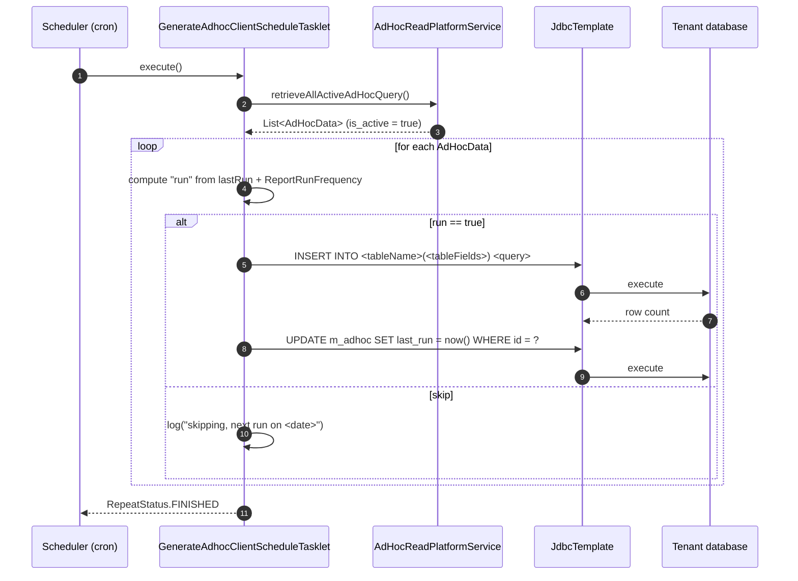

The **ad-hoc query** subsystem in Apache Fineract is a small, self-contained scheduler that runs an arbitrary `SELECT` on a recurring cadence and inserts the resulting rows into a target table. It is what powers in-database snapshotting patterns — "every Monday, freeze active loan counts per branch into `m_loan_snapshot`" — without you having to invent a stretchy report, register a Spring Batch job, or write any glue code. You configure a row through `/v1/adhocquery`, mark it active, and the `GENERATE_ADHOC_CLIENT_SCHEDULE` batch job takes care of the rest.

This page documents the `AdHoc` entity, the REST API, the frequency enum, the validation rules, and the scheduling tasklet.

## Entity: `AdHoc`

`fineract-provider/src/main/java/org/apache/fineract/adhocquery/domain/AdHoc.java`:

```java
@Entity
@Table(name = "m_adhoc")
public class AdHoc extends AbstractAuditableCustom {

    @Column(name = "name", length = 100)
    private String name;

    @Column(name = "query", length = 2000)
    private String query;                   // SELECT statement, no leading INSERT INTO

    @Column(name = "table_name", length = 100)
    private String tableName;               // INSERT INTO <this>

    @Column(name = "table_fields", length = 2000)
    private String tableFields;             // column list for the INSERT

    @Column(name = "email", length = 500)
    private String email;                   // optional notification address

    @Column(name = "report_run_frequency_code")
    private Long reportRunFrequency;        // FK to ReportRunFrequency enum

    @Column(name = "report_run_every")
    private Long reportRunEvery;            // interval for CUSTOM frequency

    @Column(name = "is_active", nullable = false)
    private boolean active;
}
```

Two non-mapped columns the tasklet touches via raw JDBC are `last_run` (`DATETIME`) and the inherited audit columns. The DTO that flows over the wire mirrors all of those plus the audit fields and a `reportRunFrequencies` template list:

```java
public class AdHocData {
    private Long          id;
    private String        name;
    private String        query;
    private String        tableName;
    private String        tableFields;
    private String        email;
    private boolean       isActive;
    private ZonedDateTime createdOn;
    private Long          createdById;
    private Long          updatedById;
    private ZonedDateTime updatedOn;
    private String        createdBy;
    private List<EnumOptionData> reportRunFrequencies;   // template only
    private Long          reportRunFrequency;
    private Long          reportRunEvery;
    private ZonedDateTime lastRun;
}
```

### The composed INSERT

The job concatenates the three configured columns into a single SQL statement:

```sql
INSERT INTO <tableName> (<tableFields>) <query>
```

So `query` is expected to be a complete `SELECT` (parentheses around it are optional) whose column list matches `tableFields`. The simplest possible configuration:

| Field | Value |
| ----- | ----- |
| `name` | `Active Clients Per Branch` |
| `tableName` | `m_client_snapshot` |
| `tableFields` | `snapshot_date, office_id, active_clients` |
| `query` | `SELECT CURDATE(), office_id, COUNT(*) FROM m_client WHERE is_deleted = 0 AND status_enum = 300 GROUP BY office_id` |
| `reportRunFrequency` | `1` (DAILY) |
| `isActive` | `true` |

…produces:

```sql
INSERT INTO m_client_snapshot (snapshot_date, office_id, active_clients)
SELECT CURDATE(), office_id, COUNT(*)
FROM m_client
WHERE is_deleted = 0 AND status_enum = 300
GROUP BY office_id
```

## Frequency: `ReportRunFrequency`

`fineract-provider/src/main/java/org/apache/fineract/adhocquery/domain/ReportRunFrequency.java`:

```java
public enum ReportRunFrequency {
    DAILY  (1, "reportRunFrequency.daily"),
    WEEKLY (2, "reportRunFrequency.weekly"),
    MONTHLY(3, "reportRunFrequency.monthly"),
    YEARLY (4, "reportRunFrequency.yearly"),
    CUSTOM (5, "reportRunFrequency.custom");

    private final long value;
    private final String code;

    public static ReportRunFrequency fromId(final long id) { ... }
}
```

For `DAILY` through `YEARLY` the gap between runs is implicit. For `CUSTOM`, the gap is `reportRunEvery` days, which lets you say things like "every 10 days" or "every 90 days" without abusing weekly/monthly.

## REST API: `AdHocApiResource`

Mounted at `/v1/adhocquery`. `fineract-provider/src/main/java/org/apache/fineract/adhocquery/api/AdHocApiResource.java`:

```java
@Path("/v1/adhocquery")
@Tag(name = "AdhocQuery Api")
public class AdHocApiResource {

    private static final Set<String> RESPONSE_DATA_PARAMETERS = new HashSet<>(Arrays.asList(
            "id", "name", "query", "tableName", "tableField", "isActive",
            "createdBy", "createdOn", "createdById", "updatedById", "updatedOn", "email"));

    private final PlatformSecurityContext context;
    private final AdHocReadPlatformService adHocReadPlatformService;
    private final DefaultToApiJsonSerializer<AdHocData> toApiJsonSerializer;
    private final PortfolioCommandSourceWritePlatformService commandsSourceWritePlatformService;

    @GET
    @Produces({ MediaType.APPLICATION_JSON })
    public List<AdHocData> retrieveAll() { ... }

    @GET @Path("template")
    @Produces({ MediaType.APPLICATION_JSON })
    public AdHocData template() { ... }

    @POST
    @Consumes({ MediaType.APPLICATION_JSON })
    @Produces({ MediaType.APPLICATION_JSON })
    public CommandProcessingResult createAdHocQuery(final AdHocRequest adHocRequest) { ... }

    @GET @Path("{adHocId}")
    @Produces({ MediaType.APPLICATION_JSON })
    public AdHocData retrieveAdHocQuery(@PathParam("adHocId") final Long adHocId) { ... }

    @PUT @Path("{adHocId}")
    @Consumes({ MediaType.APPLICATION_JSON })
    @Produces({ MediaType.APPLICATION_JSON })
    public CommandProcessingResult update(@PathParam("adHocId") final Long adHocId,
                                          final AdHocRequest adHocRequest) { ... }

    @DELETE @Path("{adHocId}")
    @Produces({ MediaType.APPLICATION_JSON })
    public CommandProcessingResult deleteAdHocQuery(@PathParam("adHocId") final Long adHocId) { ... }
}
```

| Method | Path | Effect |
| ------ | ---- | ------ |
| `GET` | `/v1/adhocquery` | List all ad-hoc queries (active and inactive). |
| `GET` | `/v1/adhocquery/template` | Template payload with the available `reportRunFrequencies`. |
| `GET` | `/v1/adhocquery/{adHocId}` | Single row. |
| `POST` | `/v1/adhocquery` | Create. |
| `PUT` | `/v1/adhocquery/{adHocId}` | Partial update. |
| `DELETE` | `/v1/adhocquery/{adHocId}` | Hard delete. |

Writes go through the standard CQRS pipeline via `CommandWrapperBuilder.createAdHoc()` / `updateAdHoc(id)` / `deleteAdHoc(id)`, which means each write is logged in `m_portfolio_command_source` and can be wrapped in maker-checker.

### Validation

`AdHocDataValidator` (`fineract-provider/src/main/java/org/apache/fineract/adhocquery/service/AdHocDataValidator.java`) constrains the JSON keys to a closed set:

```java
private static final Set<String> supportedParameters = new HashSet<>(Arrays.asList(
        NAME, QUERY, TABLE_NAME, TABLE_FIELDS, EMAIL, "isActive",
        REPORT_RUN_FREQUENCY, REPORT_RUN_EVERY));
```

Per-field rules on create:

| Field | Constraint |
| ----- | ---------- |
| `name` | not blank, ≤ 100 chars |
| `query` | not blank, ≤ 2000 chars |
| `tableName` | not blank, ≤ 100 chars |
| `tableFields` | not blank, ≤ 1000 chars |
| `email` | optional, ≤ 500 chars |
| `reportRunFrequency` | between `DAILY` (1) and `CUSTOM` (5) |
| `reportRunEvery` | optional, > 0 (used by CUSTOM) |

Update validation is the same rules but each field is `parameterExists`-guarded, so you can `PUT` just `{ "isActive": false }` to pause a snapshot.

### Examples

#### Create

```http
POST /fineract-provider/api/v1/adhocquery HTTP/1.1
Content-Type: application/json
Fineract-Platform-TenantId: default
```

```json
{
  "name": "Active Clients Per Branch",
  "query": "SELECT CURDATE(), office_id, COUNT(*) FROM m_client WHERE is_deleted=0 AND status_enum=300 GROUP BY office_id",
  "tableName": "m_client_snapshot",
  "tableFields": "snapshot_date, office_id, active_clients",
  "email": "ops@example.com",
  "reportRunFrequency": 1,
  "isActive": true
}
```

#### List

```http
GET /fineract-provider/api/v1/adhocquery HTTP/1.1
```

```json
[
  {
    "id": 1,
    "name": "Active Clients Per Branch",
    "query": "SELECT CURDATE(), office_id, COUNT(*) FROM m_client ...",
    "tableName": "m_client_snapshot",
    "tableFields": "snapshot_date, office_id, active_clients",
    "email": "ops@example.com",
    "isActive": true,
    "reportRunFrequency": 1,
    "reportRunEvery": null,
    "lastRun": "2024-04-01T05:00:00+00:00",
    "createdBy": "mifos",
    "createdOn": "2024-03-01T08:12:00+00:00"
  }
]
```

#### Template

```http
GET /fineract-provider/api/v1/adhocquery/template HTTP/1.1
```

returns an empty `AdHocData` populated only with the frequency catalogue:

```json
{
  "reportRunFrequencies": [
    { "id": 1, "code": "reportRunFrequency.daily",   "value": "Daily" },
    { "id": 2, "code": "reportRunFrequency.weekly",  "value": "Weekly" },
    { "id": 3, "code": "reportRunFrequency.monthly", "value": "Monthly" },
    { "id": 4, "code": "reportRunFrequency.yearly",  "value": "Yearly" },
    { "id": 5, "code": "reportRunFrequency.custom",  "value": "Custom" }
  ]
}
```

#### Pause one

```http
PUT /fineract-provider/api/v1/adhocquery/1 HTTP/1.1
Content-Type: application/json
```

```json
{ "isActive": false }
```

## The Spring Batch job: `GENERATE_ADHOC_CLIENT_SCHEDULE`

The configuration lives in `fineract-provider/src/main/java/org/apache/fineract/portfolio/savings/jobs/generateadhocclientschhedule/GenerateAdhocClientScheduleConfig.java` (the directory name has a typo — `schhedule` — that has been preserved for backwards compatibility):

```java
@Configuration
public class GenerateAdhocClientScheduleConfig {

    @Autowired private JobRepository                jobRepository;
    @Autowired private PlatformTransactionManager   transactionManager;
    @Autowired private AdHocReadPlatformService     adHocReadPlatformService;
    @Autowired private JdbcTemplate                 jdbcTemplate;

    @Bean
    protected Step generateAdhocClientScheduleStep() {
        return new StepBuilder(JobName.GENERATE_ADHOC_CLIENT_SCHEDULE.name(), jobRepository)
                .tasklet(generateAdhocClientScheduleTasklet(), transactionManager).build();
    }

    @Bean
    public Job generateAdhocClientScheduleJob() {
        return new JobBuilder(JobName.GENERATE_ADHOC_CLIENT_SCHEDULE.name(), jobRepository)
                .start(generateAdhocClientScheduleStep())
                .incrementer(new RunIdIncrementer()).build();
    }

    @Bean
    public GenerateAdhocClientScheduleTasklet generateAdhocClientScheduleTasklet() {
        return new GenerateAdhocClientScheduleTasklet(adHocReadPlatformService, jdbcTemplate);
    }
}
```

Like every Fineract batch job it appears in `m_scheduled_jobs` under its `JobName` (`GENERATE_ADHOC_CLIENT_SCHEDULE`) and can be enabled/disabled, re-cron'd, or fired ad-hoc through `POST /v1/jobs/{jobId}?command=executeJob`.

### Tasklet

`fineract-provider/src/main/java/org/apache/fineract/portfolio/savings/jobs/generateadhocclientschhedule/GenerateAdhocClientScheduleTasklet.java`:

```java
public RepeatStatus execute(StepContribution contribution, ChunkContext chunkContext) throws Exception {
    final Collection<AdHocData> adhocs = adHocReadPlatformService.retrieveAllActiveAdHocQuery();
    if (!adhocs.isEmpty()) {
        adhocs.forEach(adhoc -> {
            boolean run = true;
            LocalDate next = null;
            if (adhoc.getReportRunFrequency() != null) {
                if (adhoc.getLastRun() != null) {
                    LocalDate start = adhoc.getLastRun().toLocalDate();
                    LocalDate end   = ZonedDateTime.now(DateUtils.getDateTimeZoneOfTenant()).toLocalDate();
                    switch (ReportRunFrequency.fromId(adhoc.getReportRunFrequency())) {
                        case DAILY -> {
                            next = start.plusDays(1);
                            run  = DateUtils.getExactDifferenceInDays(start, end) >= 1;
                        }
                        case WEEKLY -> {
                            next = start.plusDays(7);
                            run  = DateUtils.getExactDifferenceInDays(start, end) >= 7;
                        }
                        case MONTHLY -> {
                            next = start.plusMonths(1);
                            run  = DateUtils.getExactDifference(start, end, ChronoUnit.MONTHS) >= 1;
                        }
                        case YEARLY -> {
                            next = start.plusYears(1);
                            run  = DateUtils.getExactDifference(start, end, ChronoUnit.YEARS) >= 1;
                        }
                        case CUSTOM -> {
                            next = start.plusDays((long) adhoc.getReportRunEvery());
                            run  = DateUtils.getExactDifferenceInDays(start, end) >= adhoc.getReportRunEvery();
                        }
                    }
                }
            }

            if (run) {
                final StringBuilder insertSqlBuilder = new StringBuilder(900);
                insertSqlBuilder.append("INSERT INTO ")
                                .append(adhoc.getTableName())
                                .append("(").append(adhoc.getTableFields()).append(") ")
                                .append(adhoc.getQuery());
                if (!insertSqlBuilder.isEmpty()) {
                    final int result = jdbcTemplate.update(insertSqlBuilder.toString());
                    log.debug("{}: Records affected by generateClientSchedule: {}",
                              ThreadLocalContextUtil.getTenant().getName(), result);

                    jdbcTemplate.update("UPDATE m_adhoc SET last_run=? WHERE id=?",
                                        new Date(), adhoc.getId());
                }
            }
        });
    }
    return RepeatStatus.FINISHED;
}
```

A few important behaviours fall out of that loop:

1. **First run is unconditional.** If `lastRun` is null, the inner `if (adhoc.getLastRun() != null)` is skipped and `run` keeps its default value `true` — so a freshly created active row is executed at the very next batch tick, regardless of `reportRunFrequency`.
2. **Skip vs. run is determined by elapsed time, not by an absolute schedule.** A `DAILY` query that last ran at 23:59 will be eligible at 00:00 the next day; the gap (≥ 1 day) — measured by `DateUtils.getExactDifferenceInDays(start, end)` — is what decides.
3. **Custom interval uses `reportRunEvery` directly.** So `reportRunFrequency = 5, reportRunEvery = 10` is "every 10 days since `lastRun`".
4. **The job persists `last_run` *after* the INSERT.** That means a failing INSERT (e.g. unique-key violation, broken column list) leaves `last_run` untouched, and the next batch tick will retry — useful when fixing a bad query, but also a footgun for genuinely broken ones, which will spam the log indefinitely.
5. **There is no run history.** Unlike report mailing jobs, ad-hoc has no `m_adhoc_run_history` table. The audit trail is whatever the target snapshot table records via the inserted rows themselves.
6. **The `email` column is unused by the tasklet.** It is a hint persisted for human reference; sending email is not part of the ad-hoc scheduler.

### Flow diagram



## Schema quick reference

```sql
CREATE TABLE m_adhoc (
    id                         BIGINT PRIMARY KEY AUTO_INCREMENT,
    name                       VARCHAR(100),
    query                      VARCHAR(2000),
    table_name                 VARCHAR(100),
    table_fields               VARCHAR(2000),
    email                      VARCHAR(500),
    report_run_frequency_code  BIGINT,
    report_run_every           BIGINT,
    is_active                  BOOLEAN NOT NULL,
    last_run                   DATETIME,
    -- + AbstractAuditableCustom columns:
    created_by, created_on_utc, last_modified_by, last_modified_on_utc, version
);
```

`report_run_frequency_code` is *not* a foreign key — it stores the raw `ReportRunFrequency.value` (1 → DAILY, … 5 → CUSTOM). `last_run` is the only column the tasklet updates outside the JPA flow; everything else is touched only by the resource-driven write services.

## When **not** to use ad-hoc query

The ad-hoc engine has the smallest surface in this section of the wiki on purpose. It is great when:

- You need an in-database aggregate that you query later via a regular stretchy report, a BI tool, or a SAVINGS/LOAN trigger.
- The cadence is calendar-based (`DAILY`, `WEEKLY`, …) and a few-minute drift is acceptable.

It is the wrong tool when:

- You need the output delivered to a human inbox. Use a [report mailing job](/reporting/report-mailing-job).
- You need an export-format-aware download. Use the [reports runner](/reporting/reports-api-and-runner) (`/v1/runreports/{name}?exportCSV=true`).
- You need exactly-once execution (`last_run` is updated only after a successful INSERT, so a SQL error means the tasklet will retry on every tick until you intervene).

## Permissions

Ad-hoc queries are guarded by the standard CQRS command permissions:

- `CREATE_ADHOC`
- `UPDATE_ADHOC`
- `DELETE_ADHOC`
- `READ_ADHOC`

There is **no per-query permission** — anyone who can read one can read all, and anyone who can create one can execute arbitrary SQL on the platform's primary connection. Treat the ad-hoc resource as a power-user endpoint and gate it accordingly in your tenant role matrix.

## File map

```
fineract-provider/src/main/java/org/apache/fineract/adhocquery/
├── api/
│   ├── AdHocApiResource.java
│   └── AdHocJsonInputParams.java
├── data/
│   ├── AdHocData.java
│   └── AdHocRequest.java
├── domain/
│   ├── AdHoc.java
│   ├── AdHocRepository.java
│   └── ReportRunFrequency.java
├── exception/
│   └── AdHocNotFoundException.java
├── handler/
│   ├── CreateAdHocCommandHandler.java
│   ├── DeleteAdHocCommandHandler.java
│   └── UpdateAdHocCommandHandler.java
├── service/
│   ├── AdHocDataValidator.java
│   ├── AdHocReadPlatformService.java
│   ├── AdHocReadPlatformServiceImpl.java
│   ├── AdHocWritePlatformService.java
│   └── AdHocWritePlatformServiceJpaRepositoryImpl.java
└── starter/AdhocQueryConfiguration.java

fineract-provider/src/main/java/org/apache/fineract/portfolio/savings/jobs/generateadhocclientschhedule/
├── GenerateAdhocClientScheduleConfig.java
└── GenerateAdhocClientScheduleTasklet.java
```

## See also

- [Reporting overview](/reporting/overview) — how ad-hoc query relates to stretchy reports, report mailing, and MIX XBRL.
- [Reports API and runner](/reporting/reports-api-and-runner) — the synchronous SQL engine and the `ReportingProcessService` SPI.
- [Report mailing job](/reporting/report-mailing-job) — the scheduled email engine, which shares the "execute on a calendar" pattern but delivers a file by email rather than INSERTing rows.
