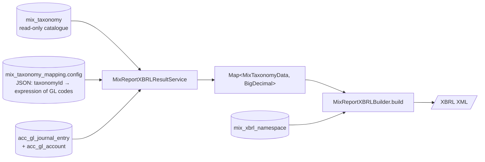

The **MIX** engine in Apache Fineract is a small but standalone module (`fineract-mix`) that turns a tenant's chart of accounts into an XBRL (eXtensible Business Reporting Language) document compatible with the MIX Market taxonomy. It exists so microfinance institutions can satisfy MIX's annual reporting obligation directly from their Fineract instance, without an external ETL pipeline.

Unlike the other engines, MIX is **single-tenant configured once, run many**: there is one taxonomy catalogue (read-only, prepopulated from migrations), one mapping row per tenant (the one place customers configure things), and one generation endpoint that emits XML for a given start/end date and currency.

## High-level pipeline



There are three persisted entities and one mapping/configuration table:

| Table | Entity | Role |
| ----- | ------ | ---- |
| `mix_taxonomy` | `MixTaxonomy` | Read-only catalogue of MIX taxonomy concepts (assets, liabilities, equity, income, expense, portfolio, …). |
| `mix_taxonomy_mapping` | `MixTaxonomyMapping` | Tenant configuration — JSON map of taxonomy id → arithmetic expression of GL codes. |
| `mix_xbrl_namespace` | `MixReportXBRLNamespace` | XBRL namespace prefixes used in the output document (`mx`, `iso4217`, `link`, …). |

## Catalogue: `MixTaxonomy`

`fineract-mix/src/main/java/org/apache/fineract/mix/domain/MixTaxonomy.java`:

```java
@Table("mix_taxonomy")
public final class MixTaxonomy implements Serializable {

    @Column("id")           private Long    id;
    @Column("name")         private String  name;        // XBRL element name, e.g. "AssetsCurrent"
    @Column("namespace_id") private Long    namespaceId; // FK to mix_xbrl_namespace
    @Column("dimension")    private String  dimension;   // optional XBRL dimension axis
    @Column("type")         private Integer type;        // 0=Portfolio, 1=BalanceSheet, 2=Income, 3=Expense
    @Column("description")  private String  description;
}
```

The companion `MixTaxonomyData` DTO (`fineract-mix/.../data/MixTaxonomyData.java`) carries the same fields plus the resolved namespace prefix and the four `type` constants:

```java
public static final Integer PORTFOLIO     = 0;
public static final Integer BALANCE_SHEET = 1;
public static final Integer INCOME        = 2;
public static final Integer EXPENSE       = 3;
```

The catalogue is **populated by Liquibase migrations** and is expected to track the official MIX taxonomy version (see the comment in `MixReportXBRLBuilder`: *"see https://www.xbrl.org/taxonomyrecognition/mx_2009-06-19_summary-page.htm"*). End users never insert or update rows here; they only reference taxonomy ids when they edit the mapping.

### XBRL namespaces

`mix_xbrl_namespace` holds the prefix/URL pairs declared at the top of the generated XBRL document:

```java
@Table("mix_xbrl_namespace")
public class MixReportXBRLNamespace implements Serializable {
    @Id @Column("id")     private Long   id;
    @Column("prefix")     private String prefix;  // e.g. "mx"
    @Column("url")        private String url;     // e.g. "http://www.themix.org/..."
}
```

`MixTaxonomy.namespaceId` joins to a row here so each taxonomy concept knows which prefix to emit (`mx:AssetsCurrent`, `iso4217:USD`, …).

## The mapping: `MixTaxonomyMapping`

This is the only entity tenants actually edit. There is normally **one row** (`id = 1`) per tenant — the legacy behaviour the API exploits, see the API resource below.

`fineract-mix/src/main/java/org/apache/fineract/mix/domain/MixTaxonomyMapping.java`:

```java
@Table("mix_taxonomy_mapping")
public final class MixTaxonomyMapping implements Serializable {

    @Column("id")          private Long   id;
    @Column("identifier")  private String identifier;  // free-form, e.g. MFI registration id
    @Column("config")      private String config;      // JSON map: {"<taxonomyId>": "<expression>"}
    @Column("currency")    private String currency;    // ISO 4217 reporting currency
}
```

### What goes into `config`

`config` is a JSON object whose keys are taxonomy ids (from `mix_taxonomy.id`) and whose values are arithmetic expressions over GL account codes. Each GL code reference is wrapped in `{}` so the engine can substitute it for the account's balance over the reporting period. A minimal example:

```json
{
  "1":  "{1101} + {1102} + {1103}",
  "2":  "{2101} + {2102}",
  "10": "{4001} - {4002}",
  "11": "{5001} + {5002} + {5003}"
}
```

Here `{1101}` means "the period balance of GL account whose `gl_code = '1101'`". `MixReportXBRLResultServiceImpl` evaluates each expression with a JavaScript `ScriptEngine` so simple arithmetic (`+ - * / parentheses`) just works.

The substitution and evaluation happen in `processMappingString`:

```java
private BigDecimal processMappingString(Map<String, BigDecimal> accountBalanceMap, String mappingString) {
    final List<String> glCodes = getGLCodes(mappingString);
    for (final String glcode : glCodes) {
        final BigDecimal balance = accountBalanceMap.get(glcode);
        mappingString = mappingString.replaceAll(
                "\\{" + glcode + "\\}",
                balance != null ? balance.toString() : "0");
    }
    // evaluate the expression
    final Number value = (Number) SCRIPT_ENGINE.eval(mappingString);
    return BigDecimal.valueOf(value != null ? value.floatValue() : 0f);
}
```

GL balances come from `acc_gl_journal_entry` for the reporting period:

```java
// retrieved through MixReportXBRLResultServiceImpl.getAccountSql
SELECT debits.glcode AS 'glcode',
       debits.name AS 'name',
       COALESCE(debits.debitamount, 0) - COALESCE(credits.creditamount, 0) AS 'balance'
FROM (SELECT acc_gl_account.gl_code AS 'glcode', name, SUM(amount) AS 'debitamount'
      FROM acc_gl_journal_entry, acc_gl_account
      WHERE acc_gl_account.id = acc_gl_journal_entry.account_id
        AND acc_gl_journal_entry.type_enum = 2          -- DEBIT
        AND acc_gl_journal_entry.entry_date <= :endDate
        AND acc_gl_journal_entry.entry_date >  :startDate
      GROUP BY glcode) debits
LEFT OUTER JOIN (...) credits ON debits.glcode = credits.glcode
UNION ...
```

i.e. **debits − credits** per GL code, aggregated over the requested window — exactly the convention the MIX taxonomy expects for balance-sheet and income concepts.

## REST APIs

There are three resources, all stateless JAX-RS components under `fineract-mix/src/main/java/org/apache/fineract/mix/api/`.

### `MixTaxonomyApiResource` — list taxonomy concepts

Mounted at `/v1/mixtaxonomy`. Single read-only endpoint:

```java
@Path("/v1/mixtaxonomy")
@Tag(name = "Mix Taxonomy", description = "")
public class MixTaxonomyApiResource {

    private final MixTaxonomyReadService readTaxonomyService;

    @GET
    @Produces({ MediaType.APPLICATION_JSON })
    @Operation(summary = "List Mix Taxonomies", operationId = "retrieveAllMixTaxonomies")
    public List<MixTaxonomyData> retrieveAll() {
        return readTaxonomyService.retrieveAll();
    }
}
```

The list is used by the mapping UI to render a "for taxonomy X, type expression Y" form. Every entry carries `id`, `name`, `namespace`, `dimension`, `type`, `description`.

```http
GET /fineract-provider/api/v1/mixtaxonomy HTTP/1.1
```

```json
[
  { "id": 1,  "name": "AssetsCurrent",        "namespace": "mx", "type": 1, "description": "..." },
  { "id": 2,  "name": "LiabilitiesCurrent",   "namespace": "mx", "type": 1, "description": "..." },
  { "id": 10, "name": "Revenue",              "namespace": "mx", "type": 2, "description": "..." },
  ...
]
```

### `MixTaxonomyMappingApiResource` — read / update the mapping

Mounted at `/v1/mixmapping`:

```java
@Path("/v1/mixmapping")
@Tag(name = "Mix Mapping")
public class MixTaxonomyMappingApiResource {

    private final MixTaxonomyMappingReadService readTaxonomyMappingService;
    private final CommandDispatcher dispatcher;

    @GET
    @Produces({ MediaType.APPLICATION_JSON })
    @Operation(summary = "Retrieve Mix Taxonomy Mapping", operationId = "retrieveMixTaxonomyMapping")
    public MixTaxonomyMappingData retrieveTaxonomyMapping() {
        return this.readTaxonomyMappingService.retrieveTaxonomyMapping();
    }

    @PUT
    @Consumes({ MediaType.APPLICATION_JSON })
    @Produces({ MediaType.APPLICATION_JSON })
    @Operation(summary = "Update Mix Taxonomy Mapping", operationId = "updateMixTaxonomyMapping")
    public MixTaxonomyMappingUpdateResponse updateTaxonomyMapping(
            final MixTaxonomyMappingUpdateRequest request) {
        if (request.getId() == null) {
            request.setId(1L);            // legacy single-row behaviour
        }
        final var command = new MixTaxonomyMappingUpdateCommand();
        command.setPayload(request);
        return dispatcher.dispatch(command).get();
    }
}
```

A few things to note:

- **No POST.** The mapping is updated, not created — the bootstrap migration inserts a single empty row.
- The legacy behaviour `if (request.getId() == null) request.setId(1L)` ensures clients that omit `id` still target the canonical row. Multiple-mapping support is on the TODO list (see the inline comment in the source: *"TODO support multiple configuration file loading; this is the legacy behavior"*).
- The PUT goes through the standard `CommandDispatcher` so it participates in maker-checker if the `MIXMAPPING_UPDATE` command is configured for approval.

The write itself is a one-liner:

```java
@Transactional
public MixTaxonomyMappingUpdateResponse updateMapping(@Valid MixTaxonomyMappingUpdateRequest request) {
    final var taxonomyMapping = mapper.map(request);
    repository.save(taxonomyMapping);
    return MixTaxonomyMappingUpdateResponse.builder().entityId(taxonomyMapping.getId()).build();
}
```

The DTOs:

```java
public class MixTaxonomyMappingData {
    private String identifier;
    private String config;       // JSON string
    private String currency;     // ISO 4217
}

public class MixTaxonomyMappingUpdateRequest {
    private Long   id;
    private String identifier;
    private String config;
    private String currency;
}

public class MixTaxonomyMappingUpdateResponse {
    private Long entityId;
}
```

#### Read the current mapping

```http
GET /fineract-provider/api/v1/mixmapping HTTP/1.1
```

```json
{
  "identifier": "MFI-12345",
  "config": "{\"1\":\"{1101}+{1102}\",\"2\":\"{2101}\",\"10\":\"{4001}\"}",
  "currency": "USD"
}
```

#### Update it

```http
PUT /fineract-provider/api/v1/mixmapping HTTP/1.1
Content-Type: application/json
```

```json
{
  "identifier": "MFI-12345",
  "currency": "USD",
  "config": "{ \"1\": \"{1101}+{1102}+{1103}\", \"2\": \"{2101}+{2102}\", \"10\": \"{4001}-{4002}\" }"
}
```

```json
{ "entityId": 1 }
```

### `MixReportApiResource` — generate the XBRL document

Mounted at `/v1/mixreport`. The endpoint returns `application/xml`:

```java
@Path("/v1/mixreport")
@Tag(name = "Mix Report")
public class MixReportApiResource {

    private final MixReportXBRLResultService xbrlResultService;
    private final MixReportXBRLBuilder       xbrlBuilder;

    @GET
    @Produces({ MediaType.APPLICATION_XML })
    @Operation(summary = "Retrieve Mix XBRL report", operationId = "retrieveMixReport")
    public String retrieveXBRLReport(
            @QueryParam("startDate") final Date startDate,
            @QueryParam("endDate")   final Date endDate,
            @QueryParam("currency")  final String currency) {
        final var data = xbrlResultService.getXBRLResult(startDate, endDate, currency);
        return this.xbrlBuilder.build(data);
    }
}
```

#### Request

```http
GET /fineract-provider/api/v1/mixreport?startDate=2024-01-01&endDate=2024-12-31&currency=USD HTTP/1.1
Accept: application/xml
```

#### Response (schematic)

```xml
<xbrl xmlns="..." xmlns:mx="http://www.themix.org/..." xmlns:iso4217="...">
  <link:schemaRef xlink:type="simple"
                  xlink:href="http://www.themix.org/sites/default/files/Taxonomy2010/dct/dc-all_2010-08-31.xsd"/>

  <mx:AssetsCurrent  contextRef="ctx_instant_0"  unitRef="Unit2"  decimals="2">125000.00</mx:AssetsCurrent>
  <mx:LiabilitiesCurrent contextRef="ctx_instant_0" unitRef="Unit2" decimals="2">42000.00</mx:LiabilitiesCurrent>
  <mx:Revenue        contextRef="ctx_duration_0" unitRef="Unit2"  decimals="2">86500.00</mx:Revenue>

  <context id="ctx_instant_0">
    <entity><identifier scheme="http://www.themix.org">000000</identifier></entity>
    <period><instant>2024-12-31</instant></period>
  </context>
  <context id="ctx_duration_0">
    <entity><identifier scheme="http://www.themix.org">000000</identifier></entity>
    <period>
      <startDate>2024-01-01</startDate>
      <endDate>2024-12-31</endDate>
    </period>
  </context>

  <unit id="Unit1"><measure>xbrli:pure</measure></unit>
  <unit id="Unit2"><measure>iso4217:USD</measure></unit>
</xbrl>
```

The builder uses dom4j (`org.dom4j.Document` / `Element`) and emits two unit declarations — `Unit1` for unitless percentages, `Unit2` for the requested currency — plus one XBRL context per period type/scenario.

#### What happens server-side

`MixReportXBRLResultServiceImpl.getXBRLResult` does the work in three passes:

1. **Load mapping** — read the single `mix_taxonomy_mapping` row and parse its `config` into a `Map<String, String>` of `taxonomyId → expression`.
2. **Load balances** — run the GL aggregation SQL above into a `Map<String, BigDecimal>` keyed by `gl_code`.
3. **Evaluate** — for each entry of the mapping config, substitute every `{glcode}` with its balance and `SCRIPT_ENGINE.eval(...)` the resulting arithmetic. The result key is the `MixTaxonomyData` row for that id (so the builder later knows the namespace, type and dimension); the value is the computed `BigDecimal`.

Then `MixReportXBRLBuilder.build(map, startDate, endDate, currency)` walks the map and emits one `<mx:Name>` element per entry, picking the right XBRL context based on the taxonomy's `type`:

- `BALANCE_SHEET` (1) → an **instant** context at `endDate`.
- `INCOME` (2) and `EXPENSE` (3) → a **duration** context from `startDate` to `endDate`.
- `PORTFOLIO` (0) → an instant context at `endDate`, with dimensional scenarios.

The builder also injects `<schemaRef>` pointing at the official MIX dictionary and the two `<unit>` declarations (`xbrli:pure` and `iso4217:<currency>`).

### Validation and errors

`MixReportXBRLMappingInvalidException` is thrown if:

- the mapping row is missing (`taxonomyMapping == null`),
- its `config` is null,
- the parsed config is empty,
- or `processMappingString` throws a `ScriptException` (malformed expression).

The default exception handler converts it to `400 Bad Request` with `error.msg.mix.taxonomy.mapping.invalid`.

## Putting it together — first-time setup

```mermaid
sequenceDiagram
    autonumber
    participant U as Tenant admin
    participant T as MixTaxonomyApiResource
    participant M as MixTaxonomyMappingApiResource
    participant R as MixReportApiResource
    participant DB as MySQL/PostgreSQL

    U->>T: GET /v1/mixtaxonomy
    T-->>U: [{id:1,name:"AssetsCurrent"}, {id:2,name:"LiabilitiesCurrent"}, ...]
    U->>U: Compose config JSON<br/>(taxonomyId &rarr; "{glcode}+{glcode}-...")
    U->>M: PUT /v1/mixmapping {identifier, currency, config}
    M-->>U: { entityId: 1 }

    Note over U: Annual reporting time

    U->>R: GET /v1/mixreport?startDate=...&endDate=...&currency=USD
    R->>DB: SELECT balances FROM acc_gl_journal_entry...
    DB-->>R: balance map
    R->>R: evaluate expressions, build XBRL DOM
    R-->>U: application/xml (XBRL document)
    U->>U: Upload to themix.org
```

## File map

```
fineract-mix/src/main/java/org/apache/fineract/mix/
├── api/
│   ├── MixReportApiResource.java
│   ├── MixTaxonomyApiResource.java
│   └── MixTaxonomyMappingApiResource.java
├── command/
│   └── MixTaxonomyMappingUpdateCommand.java
├── data/
│   ├── MixReportXBRLContextData.java
│   ├── MixReportXBRLData.java
│   ├── MixReportXBRLNamespaceData.java
│   ├── MixTaxonomyData.java
│   ├── MixTaxonomyMappingData.java
│   ├── MixTaxonomyMappingUpdateRequest.java
│   └── MixTaxonomyMappingUpdateResponse.java
├── domain/
│   ├── MixReportXBRLNamespace.java
│   ├── MixReportXBRLNamespaceRepository.java
│   ├── MixTaxonomy.java
│   ├── MixTaxonomyMapping.java
│   ├── MixTaxonomyMappingRepository.java
│   └── MixTaxonomyRepository.java
├── exception/
│   └── MixReportXBRLMappingInvalidException.java
├── handler/
│   └── MixTaxonomyMappingUpdateCommandHandler.java
├── mapping/
│   ├── MixReportXBRLNamespaceMapper.java
│   ├── MixTaxonomyMapper.java
│   ├── MixTaxonomyMappingMapper.java
│   └── MixTaxonomyMappingUpdateRequestMapper.java
└── service/
    ├── MixReportXBRLBuilder.java
    ├── MixReportXBRLNamespaceReadService.java
    ├── MixReportXBRLNamespaceReadServiceImpl.java
    ├── MixReportXBRLResultService.java
    ├── MixReportXBRLResultServiceImpl.java
    ├── MixTaxonomyMappingReadService.java
    ├── MixTaxonomyMappingReadServiceImpl.java
    ├── MixTaxonomyMappingWriteService.java
    ├── MixTaxonomyMappingWriteServiceImpl.java
    ├── MixTaxonomyReadService.java
    └── MixTaxonomyReadServiceImpl.java
```

## Caveats and known limitations

- **No prepared statements in `getAccountSql`.** The TODO in `MixReportXBRLResultServiceImpl` flags it — the start/end dates are string-concatenated. Since they arrive as `java.sql.Date` from JAX-RS (which already rejects garbage), the practical impact is low, but it is on the list to migrate to a `NamedParameterJdbcTemplate`.
- **Single mapping row.** As documented above, `request.setId(1L)` enforces this. The mapping API will return only that row.
- **Nashorn dependency.** Expression evaluation runs through `ScriptEngineManager().getEngineByName("JavaScript")`. On modern JDKs (>=15) that needs a script-engine implementation (Nashorn standalone, GraalVM JS, …) to be on the classpath — the source comment `// TODO: this doesn't work anymore in modern JVMs!!!!` is real.
- **No persistent history.** Unlike report mailing jobs, MIX runs are stateless. Each call regenerates the XBRL from the GL — you can re-issue the same report any number of times and the content will only change if the underlying journal entries change.

## Related pages

- [Reporting overview](/reporting/overview) — where the MIX engine sits relative to the stretchy SQL runner and the seeded (but currently unimplemented) Pentaho rows.
- [Reports API and runner](/reporting/reports-api-and-runner) — the *other* report runner. MIX deliberately does not register with `ReportingProcessServiceProvider` because its output is XML, not tabular.
- [Report mailing job](/reporting/report-mailing-job) — the scheduled email engine, which only knows how to mail stretchy report output, not MIX XBRL.
