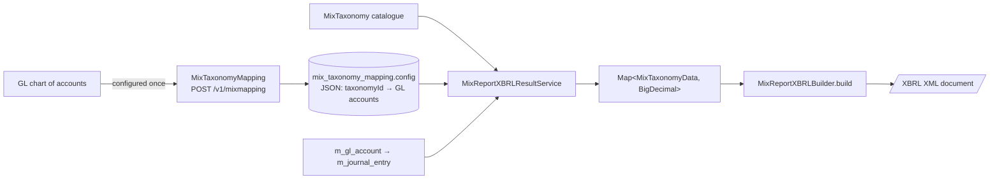
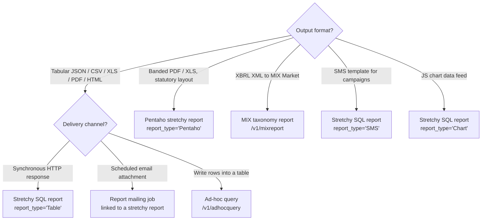
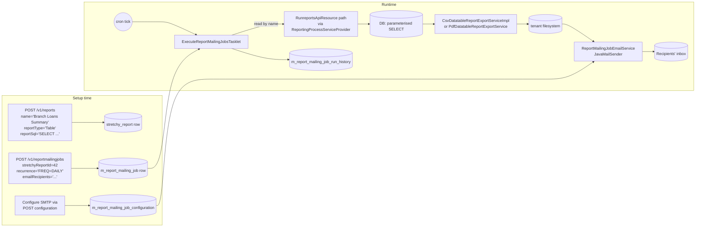

Apache Fineract ships with four loosely coupled reporting engines. Together they cover everything from interactive operational dashboards (a branch manager browsing a client list in HTML) to regulatory submissions (a country office uploading an XBRL file to MIX Market) and unattended back-office automation (a CSV emailed to the finance team every Monday at 06:00). This page is a map of those engines so the rest of the wiki has a single place to point at.

The engines are intentionally pluggable. The core abstraction lives in the `fineract-report` module and consists of a small SPI (`ReportingProcessService`) plus an annotation-based registry (`ReportingProcessServiceProvider`). Concrete engines register themselves by annotating their service bean with `@ReportService(type = { ... })`, and a single REST endpoint, `/v1/runreports/{reportName}`, picks the right engine at runtime based on the persisted `report_type` column of the report definition.

## The four engines at a glance

| Engine | Module | Catalogue table | Primary REST resource | Main use case |
| ------ | ------ | --------------- | --------------------- | ------------- |
| Stretchy SQL / Chart / SMS reports | `fineract-provider` `dataqueries` | `stretchy_report` | `/v1/reports`, `/v1/runreports/{name}` | Parameterised SQL exported as JSON/CSV/Excel/PDF |
| Pentaho `.prpt` reports | `fineract-provider` (optional bundle) | `stretchy_report` (`report_type='Pentaho'`) | `/v1/runreports/{name}` | Banded, pixel-perfect statements and statutory reports |
| MIX taxonomy / XBRL | `fineract-mix` | `mix_taxonomy`, `mix_taxonomy_mapping`, `mix_xbrl_namespace` | `/v1/mixtaxonomy`, `/v1/mixmapping`, `/v1/mixreport` | XBRL submission to [themix.org](https://www.themix.org/) |
| Report mailing jobs | `fineract-provider` `reportmailingjob` | `m_report_mailing_job`, `m_report_mailing_job_run_history` | `/v1/reportmailingjobs`, `/v1/reportmailingjobrunhistory` | Scheduled email of a stretchy/Pentaho report as XLS/PDF/CSV |
| Ad-hoc query | `fineract-provider` `adhocquery` | `m_adhoc` | `/v1/adhocquery` | One-off SQL that **writes** aggregated rows into a target table on a schedule |

The diagram below summarises how a single HTTP request flows through the registry to the engine that owns the report type:

```mermaid
flowchart LR
    A[Client] -->|GET /v1/runreports/Client Listing| B[RunreportsApiResource]
    B --> C{ReadReportingService.getReportType}
    C -->|"Table" / "Chart" / "SMS"| D[DatatableReportingProcessService]
    C -->|"Pentaho"| E[Pentaho engine bundle]
    D --> F[DatatableReportExportService]
    F -->|CSV| G1[CsvDatatableReportExportServiceImpl]
    F -->|PDF| G2[PdfDatatableReportExportService]
    F -->|JSON| G3[JsonDatatableReportExportService]
    F -->|S3| G4[S3DatatableReportExportServiceImpl]
    E --> H[ByteArrayOutputStream PDF/XLS/HTML]
```

The registry itself is a one-page Spring component — every bean implementing `ReportingProcessService` is autowired into a list, then indexed by the `type()` values of its `@ReportService` annotation. The relevant snippet from `fineract-report/src/main/java/org/apache/fineract/infrastructure/report/provider/ReportingProcessServiceProvider.java`:

```java
@Component
@Scope("singleton")
public class ReportingProcessServiceProvider {

    public static final String SERVICE_MISSING =
        "There is no ReportingProcessService registered in the ReportingProcessServiceProvider for this report type: ";

    private final Map<String, ReportingProcessService> reportingProcessServices;

    @Autowired
    public ReportingProcessServiceProvider(List<ReportingProcessService> reportingProcessServices) {
        var mapBuilder = ImmutableMap.<String, ReportingProcessService>builder();
        for (ReportingProcessService s : reportingProcessServices) {
            String[] reportTypes = s.getClass().getAnnotation(ReportService.class).type();
            for (String type : reportTypes) {
                mapBuilder.put(type, s);
            }
        }
        this.reportingProcessServices = mapBuilder.build();
    }

    public ReportingProcessService findReportingProcessService(final String reportType) {
        return reportingProcessServices.getOrDefault(reportType, null);
    }
}
```

If the registry returns `null`, the runner throws `PlatformServiceUnavailableException` with the `err.msg.report.service.implementation.missing` key, which is how Fineract degrades gracefully when, for example, the Pentaho jar is not on the classpath.

## Engine 1 — Stretchy SQL / Chart / SMS reports

A "stretchy" report is a parameterised SQL statement stored in the `stretchy_report` table and addressed by its **name** (not its ID) at runtime. The reference implementation, `DatatableReportingProcessService`, is annotated with:

```java
@Service
@ReportService(type = { "Table", "Chart", "SMS" })
public class DatatableReportingProcessService extends AbstractReportingProcessService { ... }
```

So three of the four built-in `report_type` strings are handled by the same engine; what differentiates them is the SQL the report carries and the export pipeline chosen by the request (`exportCSV=true`, `exportPDF=true`, `exportJSON=true`, `exportS3=true`, or default JSON/HTML). The export pipeline lives under `fineract-provider/src/main/java/org/apache/fineract/infrastructure/dataqueries/service/export/` and includes:

- `CsvDatatableReportExportServiceImpl`
- `PdfDatatableReportExportService`
- `JsonDatatableReportExportService`
- `S3DatatableReportExportServiceImpl`

Parameter substitution is uniform across the engines. Anything in the URL query string prefixed with `R_` becomes a `${name}` substitution token in the report SQL. `AbstractReportingProcessService.getReportParams` is the central place where that mapping (and the SQL injection screen via `SqlValidator`) happens:

```java
public Map<String, String> getReportParams(final MultivaluedMap<String, String> queryParams) {
    final Map<String, String> reportParams = new HashMap<>();
    for (Map.Entry<String, List<String>> entry : queryParams.entrySet()) {
        if (entry.getKey().startsWith("R_")) {
            String pKey = "${" + entry.getKey().substring(2) + "}";
            String pValue = entry.getValue().get(0);
            sqlValidator.validate(pValue);
            reportParams.put(pKey, pValue);
        }
    }
    return reportParams;
}
```

The dedicated page [`reporting/reports-api-and-runner`](/reporting/reports-api-and-runner) covers the `Report` JPA entity, the CRUD resource (`ReportsApiResource`), and the runner resource (`RunreportsApiResource`).

## Engine 2 — Pentaho reports

Pentaho is a separate bundle that contributes its own `ReportingProcessService` implementation registered for `report_type = "Pentaho"`. The shared catalogue (`stretchy_report`) keeps the metadata, but the `report_sql` column is left null; instead a `.prpt` file is shipped on the classpath. The `ReadReportingService` interface defined in `fineract-provider/src/main/java/org/apache/fineract/infrastructure/dataqueries/service/ReadReportingService.java` exposes the Pentaho-specific entry points:

```java
ByteArrayOutputStream generatePentahoReportAsOutputStream(
        String reportName,
        String outputTypeParam,
        Map<String, String> queryParams,
        ...);
```

Built-in Pentaho reports include **Balance Sheet** (id 48), **Income Statement** (id 49), **Trial Balance** (id 50), **Loan Account Schedule** (id 91), **Branch Expected Cash Flow** (id 92) and **Expected Payments By Date – Formatted** (id 94). They are listed alongside the SQL ones in `stretchy_report` and surface through the same `/v1/reports` and `/v1/runreports` resources — the runner simply delegates to whichever engine the registry returns for the row's `report_type`.

## Engine 3 — MIX taxonomy and XBRL

The MIX engine, in the standalone `fineract-mix` module, is unusual among the four because it produces **XML**, not tabular data. The output format is XBRL — the syntax MIX Market expects — and the public endpoint is:

```http
GET /v1/mixreport?startDate=2023-01-01&endDate=2023-12-31&currency=USD
Accept: application/xml
```

The pipeline is:



The `mix_taxonomy` table is read-only — it holds the official MIX taxonomy concepts (asset, liability, equity, income, expense, …) and their XBRL dimensions, prepopulated by Liquibase migrations. Customers map their local GL accounts to those concepts once, through the `MixTaxonomyMappingApiResource`. See [`reporting/mix-taxonomy`](/reporting/mix-taxonomy) for the schema and request/response shapes.

## Engine 4 — Report mailing jobs

Report mailing jobs glue the runner to email. The job:

1. Reads every active row of `m_report_mailing_job` whose `next_run_datetime` is in the past.
2. Re-runs the linked stretchy report through `ReportingProcessServiceProvider` with the persisted parameter map.
3. Attaches the resulting XLS/PDF/CSV to a Gmail/SMTP message and sends it.
4. Recomputes `next_run_datetime` from the iCalendar `recurrence` string and writes a row to `m_report_mailing_job_run_history`.

The work happens in a Spring Batch job called **`EXECUTE_REPORT_MAILING_JOBS`**, defined in `fineract-provider/src/main/java/org/apache/fineract/infrastructure/campaigns/jobs/executereportmailingjobs/ExecuteReportMailingJobsConfig.java`:

```java
@Bean
public Job executeReportMailingJobsJob() {
    return new JobBuilder(JobName.EXECUTE_REPORT_MAILING_JOBS.name(), jobRepository)
            .start(executeReportMailingJobsStep())
            .incrementer(new RunIdIncrementer()).build();
}
```

That job needs to know which engine to call for each `ReportMailingJob.stretchyReport`, which is exactly why `ExecuteReportMailingJobsTasklet` autowires `ReportingProcessServiceProvider` — the same registry the synchronous runner uses. Full details are on [`reporting/report-mailing-job`](/reporting/report-mailing-job).

## Engine 5 (bonus) — Ad-hoc query

The ad-hoc query feature lives in `fineract-provider/src/main/java/org/apache/fineract/adhocquery/` and is slightly different in character: instead of returning rows to a caller, it runs an arbitrary `INSERT ... SELECT` on a schedule and **writes** the aggregated rows into a target table. It is what powers, for example, "every Monday, snapshot active client counts per branch into `m_client_snapshot`". The Spring Batch job is **`GENERATE_ADHOC_CLIENT_SCHEDULE`** in `fineract-provider/src/main/java/org/apache/fineract/portfolio/savings/jobs/generateadhocclientschhedule/GenerateAdhocClientScheduleConfig.java`. The catalogue is `m_adhoc` and the resource is `/v1/adhocquery`. See [`reporting/ad-hoc-query`](/reporting/ad-hoc-query) for the entity, frequency enum, and tasklet.

## Choosing between engines

A short decision tree:



In practice, **stretchy SQL** is the everyday workhorse, **Pentaho** is reserved for documents that the user prints, **MIX** is regulatory only, **report mailing jobs** are how you give finance/management a recurring inbox digest, and **ad-hoc query** is for derived snapshot tables.

## File map

```
fineract-report/src/main/java/org/apache/fineract/infrastructure/report/
├── annotation/ReportService.java
├── provider/ReportingProcessServiceProvider.java
└── service/
    ├── AbstractReportingProcessService.java
    └── ReportingProcessService.java

fineract-provider/src/main/java/org/apache/fineract/infrastructure/dataqueries/
├── api/
│   ├── ReportsApiResource.java
│   └── RunreportsApiResource.java
├── domain/Report.java
└── service/
    ├── DatatableReportingProcessService.java
    ├── ReadReportingService.java
    └── export/

fineract-mix/src/main/java/org/apache/fineract/mix/
├── api/
│   ├── MixReportApiResource.java
│   ├── MixTaxonomyApiResource.java
│   └── MixTaxonomyMappingApiResource.java
├── domain/{MixTaxonomy.java, MixTaxonomyMapping.java, MixReportXBRLNamespace.java}
└── service/{MixReportXBRLBuilder.java, MixReportXBRLResultService.java}

fineract-provider/src/main/java/org/apache/fineract/infrastructure/reportmailingjob/
├── api/{ReportMailingJobApiResource.java, ReportMailingJobRunHistoryApiResource.java}
├── domain/{ReportMailingJob.java, ReportMailingJobRunHistory.java}
└── service/...

fineract-provider/src/main/java/org/apache/fineract/adhocquery/
├── api/AdHocApiResource.java
├── domain/{AdHoc.java, ReportRunFrequency.java}
└── service/{AdHocReadPlatformService.java, AdHocWritePlatformService.java}

fineract-provider/src/main/java/org/apache/fineract/infrastructure/campaigns/jobs/executereportmailingjobs/
├── ExecuteReportMailingJobsConfig.java
└── ExecuteReportMailingJobsTasklet.java

fineract-provider/src/main/java/org/apache/fineract/portfolio/savings/jobs/generateadhocclientschhedule/
├── GenerateAdhocClientScheduleConfig.java
└── GenerateAdhocClientScheduleTasklet.java
```

## Permissions

All four engines participate in Fineract's per-report permission model. `RunreportsApiResource.checkUserPermissionForReport` consults `AppUser.hasNotPermissionForReport(reportName)` for every non-parameter execution, and the runner refuses with `NoAuthorizationException("Not authorised to run report: " + reportName)` if the user has no `READ_<reportName>` permission. The same check fires whether the request is interactive, scheduled by a report mailing job (the job runs as the configured `runAsUser` on the `m_report_mailing_job` row), or triggered by the ad-hoc batch.

## Anatomy of the runner

The single most important request path in the whole reporting subsystem is `GET /v1/runreports/{reportName}`. Almost everything else (mailing jobs, S3 export, parameter dropdowns) reduces to a call into the runner — even when the immediate caller is a Spring Batch tasklet rather than a human. The implementation, in `fineract-provider/src/main/java/org/apache/fineract/infrastructure/dataqueries/api/RunreportsApiResource.java`, fans out by following three indirections:

1. **`ReadReportingService.getReportType(reportName, isParameterType)`** — translates a human-readable report name (`Client Listing`, `Balance Sheet`, …) into the row's `report_type` (`Table`, `Pentaho`, …).
2. **`ReportingProcessServiceProvider.findReportingProcessService(reportType)`** — returns the bean responsible for that type, or `null` if no bean is registered (e.g. the Pentaho bundle was excluded from the build).
3. **`ReportingProcessService.processRequest(reportName, queryParams)`** — engine-specific execution that ultimately returns a JAX-RS `Response` ready to ship to the client.

If you remember those three steps you can read almost any reporting bug. The runner itself is permission-aware (`checkUserPermissionForReport`) and translates a missing engine into a clean 503:

```java
if (reportingProcessService == null) {
    throw new PlatformServiceUnavailableException(
            "err.msg.report.service.implementation.missing",
            ReportingProcessServiceProvider.SERVICE_MISSING + reportType, reportType);
}
```

## Storage and migrations

The reporting subsystem owns a small but stable set of tables. Liquibase migrations seed them at first boot and keep them in sync across releases:

| Table | Owner | Seeded by migrations? | Notes |
| ----- | ----- | --------------------- | ----- |
| `stretchy_report` | `dataqueries.domain.Report` | Yes — dozens of built-in SQL/Pentaho rows | `core_report = true` is immutable except for `description` / `useReport`. |
| `stretchy_parameter` | `dataqueries.domain.ReportParameter` | Yes — `officeId`, `currencyId`, `loanProductId`, … | Each row carries a `parameter_sql` for its dropdown values. |
| `stretchy_report_parameter` | `dataqueries.domain.ReportParameterUsage` | Yes | Many-to-many; defines the parameter screen for a report. |
| `m_report_mailing_job` | `reportmailingjob.domain.ReportMailingJob` | No — purely tenant data | Soft-deleted via `is_deleted`. |
| `m_report_mailing_job_run_history` | `reportmailingjob.domain.ReportMailingJobRunHistory` | Append-only audit | Written by the batch tasklet. |
| `m_report_mailing_job_configuration` | `reportmailingjob.domain.ReportMailingJobConfiguration` | Yes — empty rows for `GMAIL_SMTP_*` | Tenant fills in SMTP credentials. |
| `mix_taxonomy` | `mix.domain.MixTaxonomy` | Yes — the MIX 2010 dictionary | Read-only at runtime. |
| `mix_taxonomy_mapping` | `mix.domain.MixTaxonomyMapping` | Yes — single empty row (`id = 1`) | Updated through `/v1/mixmapping`. |
| `mix_xbrl_namespace` | `mix.domain.MixReportXBRLNamespace` | Yes — `mx`, `iso4217`, `link`, … | Read-only at runtime. |
| `m_adhoc` | `adhocquery.domain.AdHoc` | No — purely tenant data | `last_run` updated by the batch tasklet via raw JDBC. |

Notable gaps deliberately left to the operator: SMTP credentials (`GMAIL_SMTP_USERNAME`, `GMAIL_SMTP_PASSWORD`) are not in `application.properties` — they are persisted in `m_report_mailing_job_configuration`, so they can be rotated per tenant without redeploying.

## Spring Batch jobs

Two batch jobs ship as part of the reporting subsystem and one more elsewhere consumes the reporting registry:

| `JobName` | Configuration class | Tasklet | Default cron | Purpose |
| --------- | ------------------- | ------- | ------------ | ------- |
| `EXECUTE_REPORT_MAILING_JOBS` | `ExecuteReportMailingJobsConfig` | `ExecuteReportMailingJobsTasklet` | every minute | Iterate active `m_report_mailing_job` rows; for each that is due, regenerate the report through `ReportingProcessServiceProvider` and SMTP it. |
| `GENERATE_ADHOC_CLIENT_SCHEDULE` | `GenerateAdhocClientScheduleConfig` | `GenerateAdhocClientScheduleTasklet` | every hour | Iterate active `m_adhoc` rows; for each whose `lastRun` elapsed window matches `ReportRunFrequency`, run `INSERT INTO <tableName>(<tableFields>) <query>`. |

Both jobs are visible in the **Manage Scheduler Jobs** UI under their `JobName` and can be triggered manually through:

```http
POST /fineract-provider/api/v1/jobs/{jobId}?command=executeJob HTTP/1.1
```

which is the recommended way to verify SMTP connectivity (mailing job) or a freshly created snapshot configuration (ad-hoc job) without waiting for the cron tick.

## A worked example

To make the relationships concrete, here is what a typical "scheduled CSV email" deployment looks like end to end:



The takeaway: the runner is the only place the engines actually execute SQL. Everything else (mailing-job scheduling, ad-hoc snapshotting, MIX XBRL emission) is orchestration around it.

## Where to go next

- [Reports API and runner](/reporting/reports-api-and-runner) — `Report`, `ReportsApiResource`, `RunreportsApiResource`, `ReportingProcessService`.
- [Report mailing job](/reporting/report-mailing-job) — entity, scheduling, batch job, history API.
- [MIX taxonomy](/reporting/mix-taxonomy) — XBRL output, taxonomy and mapping APIs.
- [Ad-hoc query](/reporting/ad-hoc-query) — `AdHoc` entity, `AdHocApiResource`, `GENERATE_ADHOC_CLIENT_SCHEDULE` job.
