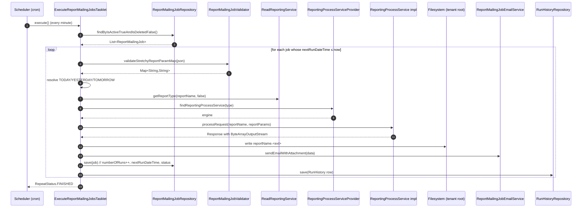

A **report mailing job** is Apache Fineract's way to automate report delivery: pick a stretchy report, freeze its parameters, pick a file format (XLS/PDF/CSV), an iCalendar recurrence string (`FREQ=DAILY;INTERVAL=1` …), a list of email recipients, and the platform's Spring Batch scheduler will run it on time, attach the output, and post a row to history. This page documents the entity, the scheduling math, the SMTP plumbing, and the two REST resources that surface it all.

<Note>
The tasklet dispatches each linked report through `ReportingProcessServiceProvider`. In the current source tree that registry only has a `DatatableReportingProcessService` bean (handling `report_type` values `Table`, `Chart`, `SMS`), so only stretchy SQL reports can actually be mailed. Linking a row whose `report_type` is `Pentaho` causes every run to fail with `err.msg.report.service.implementation.missing` (the engine is not registered) and the failure is recorded on the job and in run history.
</Note>

## The `ReportMailingJob` entity

`fineract-provider/src/main/java/org/apache/fineract/infrastructure/reportmailingjob/domain/ReportMailingJob.java`:

```java
@Entity
@Table(name = "m_report_mailing_job",
       uniqueConstraints = { @UniqueConstraint(columnNames = { "name" },
                                               name = "unique_name") })
public class ReportMailingJob extends AbstractAuditableCustom {

    @Column(name = "name", nullable = false)                 private String name;
    @Column(name = "description")                            private String description;

    @Column(name = "start_datetime", nullable = false)       private LocalDateTime startDateTime;
    @Column(name = "recurrence")                             private String recurrence;          // iCalendar RRULE

    @Column(name = "email_recipients", nullable = false)     private String emailRecipients;     // comma-separated
    @Column(name = "email_subject",    nullable = false)     private String emailSubject;
    @Column(name = "email_message",    nullable = false)     private String emailMessage;

    @Column(name = "email_attachment_file_format",
            nullable = false)                                private String emailAttachmentFileFormat; // XLS | PDF | CSV

    @ManyToOne @JoinColumn(name = "stretchy_report_id",
                           nullable = false)                 private Report stretchyReport;
    @Column(name = "stretchy_report_param_map")              private String stretchyReportParamMap;   // JSON {param: value}

    @Column(name = "previous_run_datetime")                  private LocalDateTime previousRunDateTime;
    @Column(name = "next_run_datetime")                      private LocalDateTime nextRunDateTime;
    @Column(name = "previous_run_status")                    private String previousRunStatus;        // "Success" | "Error"
    @Column(name = "previous_run_error_log")                 private String previousRunErrorLog;
    @Column(name = "previous_run_error_message")             private String previousRunErrorMessage;
    @Column(name = "number_of_runs", nullable = false)       private Integer numberOfRuns;

    @Column(name = "is_active",  nullable = false)           private boolean isActive;
    @Column(name = "is_deleted", nullable = false)           private boolean isDeleted;

    @ManyToOne @JoinColumn(name = "run_as_userid")           private AppUser runAsUser;
}
```

Two columns deserve a closer look:

- **`recurrence`** is an iCalendar RRULE (`FREQ=WEEKLY;INTERVAL=1;BYDAY=MO` etc.). It is parsed by `CalendarUtils.getNextRecurringDate(...)`. If `recurrence` is blank, the job is a **one-shot**: it runs at `startDateTime` and is then deactivated.
- **`stretchyReportParamMap`** is a JSON object whose keys are the `R_*` parameters expected by the underlying report. Any key whose name contains `date` (case-insensitive) is allowed to hold the symbolic values `Today`, `Yesterday`, or `Tomorrow` — they are resolved to a real `yyyy-MM-dd` at execution time by `ReportMailingJobStretchyReportParamDateOption` and `ReportMailingJobDateUtil`.

The two enums backing the file format and the symbolic date values live alongside:

```java
// data/ReportMailingJobEmailAttachmentFileFormat.java
public enum ReportMailingJobEmailAttachmentFileFormat {
    INVALID(0, "ReportMailingJobEmailAttachmentFileFormat.INVALID", "Invalid"),
    XLS    (1, "ReportMailingJobEmailAttachmentFileFormat.XLS",     "XLS"),
    PDF    (2, "ReportMailingJobEmailAttachmentFileFormat.PDF",     "PDF"),
    CSV    (3, "ReportMailingJobEmailAttachmentFileFormat.CSV",     "CSV");
}

// data/ReportMailingJobStretchyReportParamDateOption.java
public enum ReportMailingJobStretchyReportParamDateOption {
    INVALID  (0, "ReportMailingJobStretchyReportParamDateOption.INVALID",   "Invalid"),
    TODAY    (1, "ReportMailingJobStretchyReportParamDateOption.TODAY",     "Today"),
    YESTERDAY(2, "ReportMailingJobStretchyReportParamDateOption.YESTERDAY", "Yesterday"),
    TOMORROW (3, "ReportMailingJobStretchyReportParamDateOption.TOMORROW",  "Tomorrow");
}
```

`ReportMailingJobPreviousRunStatus` (`SUCCESS(1, …, "Success")` / `ERROR(0, …, "Error")`) carries the run-history flag — the stored string value is `Success` / `Error`.

### Run history

Each execution appends a row to `m_report_mailing_job_run_history`, mapped by `fineract-provider/src/main/java/org/apache/fineract/infrastructure/reportmailingjob/domain/ReportMailingJobRunHistory.java`:

```java
@Entity
@Table(name = "m_report_mailing_job_run_history")
public class ReportMailingJobRunHistory extends AbstractPersistableCustom<Long> {

    @ManyToOne(optional = false)
    @JoinColumn(name = "job_id", nullable = false)
    private ReportMailingJob reportMailingJob;

    @Column(name = "start_datetime", nullable = false) private LocalDateTime startDateTime;
    @Column(name = "end_datetime",   nullable = false) private LocalDateTime endDateTime;
    @Column(name = "status",         nullable = false) private String status;
    @Column(name = "error_message",  nullable = false) private String errorMessage;
    @Column(name = "error_log",      nullable = false) private String errorLog;
}
```

The history table is append-only — `EXECUTE_REPORT_MAILING_JOBS` only writes; users delete or rotate it directly via SQL if needed.

## Configuration table

SMTP credentials are not pulled from `application.properties`. They live in `m_report_mailing_job_configuration` (`ReportMailingJobConfiguration` entity), which is a generic key/value table read by `ReportMailingJobConfigurationReadPlatformServiceImpl`. The keys are the four constants in `ReportMailingJobConstants`:

```java
public static final String GMAIL_SMTP_SERVER   = "GMAIL_SMTP_SERVER";   // smtp.gmail.com
public static final String GMAIL_SMTP_PORT     = "GMAIL_SMTP_PORT";     // 587
public static final String GMAIL_SMTP_USERNAME = "GMAIL_SMTP_USERNAME"; // sender@example.com
public static final String GMAIL_SMTP_PASSWORD = "GMAIL_SMTP_PASSWORD"; // app password
```

`ReportMailingJobEmailServiceImpl` reads them out of the table on each send (so a config update takes effect on the next batch tick without a restart) and feeds them to a JavaMail `JavaMailSenderImpl`. The name is `GMAIL_*` for historical reasons — any SMTP relay that the host can reach over STARTTLS works.

The two helper files in the package are deliberately small:

- `helper/IPv4Helper.java` — converts an IPv4 address between dotted and long format. Originally added to gate the SMTP send to a private subnet.
- `util/ReportMailingJobDateUtil.java` — turns `TODAY` / `YESTERDAY` / `TOMORROW` enum values into `yyyy-MM-dd` strings using the tenant timezone, so the persisted parameter map can carry symbolic dates that always resolve relative to "now":

  ```java
  public static String getTodayDateAsString() {
      return DateUtils.getLocalDateOfTenant().format(DateUtils.DEFAULT_DATE_FORMATTER);
  }
  ```

## The CRUD API: `ReportMailingJobApiResource`

`fineract-provider/src/main/java/org/apache/fineract/infrastructure/reportmailingjob/api/ReportMailingJobApiResource.java` is mounted at `/v1/reportmailingjobs` (the constant is `ReportMailingJobConstants.REPORT_MAILING_JOB_RESOURCE_NAME = "reportmailingjobs"`).

| Method | Path | Operation | Notes |
| ------ | ---- | --------- | ----- |
| `POST` | `/v1/reportmailingjobs` | `createReportMailingJob` | Mandatory fields: `name`, `startDateTime`, `recurrence`, `emailRecipients`, `emailSubject`, `emailMessage`, `emailAttachmentFileFormatId`, `stretchyReportId`. |
| `PUT` | `/v1/reportmailingjobs/{entityId}` | `updateReportMailingJob` | Any subset of the above. Recomputes `nextRunDateTime` if `recurrence` or `startDateTime` changed. |
| `DELETE` | `/v1/reportmailingjobs/{entityId}` | `deleteReportMailingJob` | Soft delete (`is_deleted = true`). |
| `GET` | `/v1/reportmailingjobs` | `retrieveAllReportMailingJobs` | Lists non-deleted rows. |
| `GET` | `/v1/reportmailingjobs/{entityId}` | `retrieveOneReportMailingJob` | Append `?template=true` to get the same payload plus the available stretchy reports, file formats, and date options. |
| `GET` | `/v1/reportmailingjobs/template` | `retrieveTemplateReportMailingJob` | Just the template (no row), for the create UI. |

Validation is centralised in `ReportMailingJobValidator`:

- `validateCreateRequest(JsonCommand)` enforces field presence/types and confirms `emailAttachmentFileFormatId ∈ {1, 2, 3}`.
- `validateUpdateRequest(JsonCommand)` allows partial updates.
- `validateEmailRecipients(String)` splits on `,`, trims, and rejects values that do not match the email regex.
- `validateStretchyReportParamMap(String)` parses the stored JSON into a `Map<String,String>`. It is called both at write time (sanity) and at execution time (every batch tick).

The three handlers in `handler/` (`CreateReportMailingJobCommandHandler`, `UpdateReportMailingJobCommandHandler`, `DeleteReportMailingJobCommandHandler`) are thin wrappers — they just forward to `ReportMailingJobWritePlatformService` and return a `CommandProcessingResult`, which means every write goes through the standard maker-checker/command-source machinery.

### History API: `ReportMailingJobRunHistoryApiResource`

`fineract-provider/src/main/java/org/apache/fineract/infrastructure/reportmailingjob/api/ReportMailingJobRunHistoryApiResource.java`, mounted at `/v1/reportmailingjobrunhistory`:

```java
@GET
@Produces({ MediaType.APPLICATION_JSON })
@Operation(summary = "List Report Mailing Job History",
           operationId = "retrieveAllReportMailingJobRunHistory")
public String retrieveAllByReportMailingJobId(
        @QueryParam("mailingJobId") final Long mailingJobId,
        @QueryParam("offset")       final Integer offset,
        @QueryParam("limit")        final Integer limit,
        @QueryParam("orderBy")      final String orderBy,
        @QueryParam("sortOrder")    final String sortOrder) { ... }
```

Pagination is offset/limit and the result is a `Page<ReportMailingJobRunHistoryData>`. Each row carries `status`, `errorMessage`, `errorLog`, `startDateTime`, `endDateTime`, plus the link back to the job — enough to surface a "last 50 sends" panel in the UI.

## The batch job: `EXECUTE_REPORT_MAILING_JOBS`

The Spring Batch job is wired in `fineract-provider/src/main/java/org/apache/fineract/infrastructure/campaigns/jobs/executereportmailingjobs/ExecuteReportMailingJobsConfig.java`:

```java
@Bean
protected Step executeReportMailingJobsStep() {
    return new StepBuilder(JobName.EXECUTE_REPORT_MAILING_JOBS.name(), jobRepository)
            .tasklet(executeReportMailingJobsTasklet(), transactionManager).build();
}

@Bean
public Job executeReportMailingJobsJob() {
    return new JobBuilder(JobName.EXECUTE_REPORT_MAILING_JOBS.name(), jobRepository)
            .start(executeReportMailingJobsStep())
            .incrementer(new RunIdIncrementer()).build();
}

@Bean
public ExecuteReportMailingJobsTasklet executeReportMailingJobsTasklet() {
    return new ExecuteReportMailingJobsTasklet(
            reportMailingJobRepository, reportMailingJobValidator,
            readReportingService, reportingProcessServiceProvider,
            reportMailingJobEmailService, reportMailingJobRunHistoryRepository,
            fineractProperties);
}
```

`JobName.EXECUTE_REPORT_MAILING_JOBS` is the cron-scheduled name in `m_scheduled_jobs`. Like every other Fineract batch job it can be:

- enabled/disabled per tenant from the **Manage Scheduler Jobs** UI,
- re-scheduled (default is roughly every minute, configurable via cron),
- and triggered ad-hoc through `POST /v1/jobs/{jobId}?command=executeJob`.

### The tasklet

`fineract-provider/src/main/java/org/apache/fineract/infrastructure/campaigns/jobs/executereportmailingjobs/ExecuteReportMailingJobsTasklet.java` is the heart of the engine. Its `execute(...)` method:

1. Loads every `ReportMailingJob` where `is_active = true AND is_deleted = false`.
2. For each job, compares `nextRunDateTime` to the tenant's "now":

   ```java
   if (nextRunDateTime != null && DateUtils.isBefore(nextRunDateTime, localDateTimeOftenant)) {
       ...
   }
   ```

3. Builds the parameter map: parses the persisted JSON, resolves any `Today` / `Yesterday` / `Tomorrow` symbolic dates, then forwards it as a `MultivaluedStringMap` to the reporting engine:

   ```java
   if (StringUtils.containsIgnoreCase(key, "date")) {
       var dateOption = ReportMailingJobStretchyReportParamDateOption.newInstance(value);
       if (dateOption != ReportMailingJobStretchyReportParamDateOption.INVALID) {
           value = ReportMailingJobDateUtil.getDateAsString(dateOption);
       }
   }
   reportParams.add(key, value);
   ```

4. Calls the reporting engine through the same `ReportingProcessServiceProvider` registry the synchronous runner uses:

   ```java
   final String reportType = readReportingService.getReportType(reportName, false);
   final ReportingProcessService reportingProcessService =
           reportingProcessServiceProvider.findReportingProcessService(reportType);
   final Response processReport = reportingProcessService.processRequest(reportName, reportParams);
   ```

5. Writes the response body (a `ByteArrayOutputStream`) to the tenant's filesystem root, attaches the file, and emails it through `ReportMailingJobEmailServiceImpl`:

   ```java
   for (String emailRecipient : emailRecipients) {
       final ReportMailingJobEmailData reportMailingJobEmailData = new ReportMailingJobEmailData()
               .setTo(emailRecipient)
               .setText(reportMailingJob.getEmailMessage())
               .setSubject(reportMailingJob.getEmailSubject())
               .setAttachment(file);
       reportMailingJobEmailService.sendEmailWithAttachment(reportMailingJobEmailData);
   }
   ```

6. Updates the job row: increments `number_of_runs`, sets `previous_run_status`, recomputes `next_run_datetime` from the recurrence, deactivates if recurrence is blank. Then writes a row to `m_report_mailing_job_run_history`.

The next-run calculation is in `createNextRecurringDateTime`:

```java
private LocalDateTime createNextRecurringDateTime(String recurrencePattern, LocalDateTime startDateTime) {
    LocalDate nextDayLocalDate = startDateTime.plus(Duration.ofDays(1)).toLocalDate();
    LocalDate nextRecurringLocalDate = CalendarUtils.getNextRecurringDate(
            recurrencePattern, startDateTime.toLocalDate(), nextDayLocalDate);
    String nextDateTimeString = nextRecurringLocalDate + " "
            + startDateTime.getHour() + ":" + startDateTime.getMinute() + ":" + startDateTime.getSecond();
    return LocalDateTime.parse(nextDateTimeString,
            DateTimeFormatter.ofPattern("yyyy-MM-dd HH:mm:ss"));
}
```

i.e. the *time of day* is preserved across runs; only the *date* shifts. So a job scheduled at `2024-03-01 06:30:00` with `FREQ=WEEKLY;BYDAY=MO` runs every Monday at 06:30.

### Flow diagram



### Failure handling

If anything inside `generateReportOutputStream` throws — engine missing, SQL injection rejected, S3 unreachable, SMTP timeout — the exception is captured in a `StringBuilder errorLog`. The error log text is persisted on the job (`previous_run_error_log`), the `previous_run_status` column is set to `Error` (the string value of `ReportMailingJobPreviousRunStatus.ERROR`), and a row is appended to `m_report_mailing_job_run_history`. The batch step always returns `RepeatStatus.FINISHED`, so a bad job does not poison the rest of the tasklet's pass.

## Permissions and `runAsUser`

A report mailing job persists a `run_as_userid` foreign key (`@ManyToOne @JoinColumn(name = "run_as_userid", nullable = false) private AppUser runAsUser`) that records which user the job is conceptually executed on behalf of. Two things to know about how it is actually used at execution time:

- `ExecuteReportMailingJobsTasklet.generateReportOutputStream` calls `reportingProcessService.processRequest(reportName, reportParams)` **directly** — it bypasses `RunreportsApiResource.checkUserPermissionForReport`. There is no per-report permission check performed by the tasklet itself, and the security context is not switched to `runAsUser`.
- Substitution of `${currentUserHierarchy}` inside the report SQL is therefore evaluated against whatever Spring Security context the tenant scheduler runs the batch step under (typically the technical user used by the scheduler), not against `run_as_userid`. If you need office-scoped output, either pre-filter via an explicit `R_officeId`/parameter or rework the SQL to take the hierarchy as an explicit parameter rather than relying on the implicit `currentUserHierarchy` token.

The `run_as_userid` column is still useful as audit metadata (who is the human responsible for this job) and as an extension point for downstream implementations that wish to wrap the tasklet in `ThreadLocalContextUtil` to enforce that identity.

## End-to-end examples

### Create a daily Client Listing email for the head-office

```http
POST /fineract-provider/api/v1/reportmailingjobs HTTP/1.1
Content-Type: application/json
Fineract-Platform-TenantId: default
```

```json
{
  "name": "Daily HQ Client Listing",
  "description": "Daily snapshot of clients at HQ",
  "startDateTime": "2024-03-01 06:30:00",
  "dateFormat": "yyyy-MM-dd HH:mm:ss",
  "locale": "en",
  "recurrence": "FREQ=DAILY;INTERVAL=1",
  "emailRecipients": "finance@example.com, ops@example.com",
  "emailSubject": "Daily HQ Client Listing",
  "emailMessage": "Attached, please find the daily client listing.",
  "emailAttachmentFileFormatId": 1,
  "stretchyReportId": 1,
  "stretchyReportParamMap": "{\"officeId\":\"1\",\"currencyId\":\"USD\",\"R_fromDate\":\"Yesterday\",\"R_toDate\":\"Today\"}",
  "isActive": true
}
```

### Update only the recipients

```http
PUT /fineract-provider/api/v1/reportmailingjobs/42 HTTP/1.1
```

```json
{ "emailRecipients": "finance@example.com" }
```

### List the last sends for one job

```http
GET /fineract-provider/api/v1/reportmailingjobrunhistory?mailingJobId=42&limit=50&offset=0&orderBy=startDateTime&sortOrder=DESC HTTP/1.1
```

```json
{
  "totalFilteredRecords": 78,
  "pageItems": [
    {
      "id": 1024,
      "reportMailingJobId": 42,
      "startDateTime": "2024-04-01T06:30:00",
      "endDateTime":   "2024-04-01T06:30:21",
      "status": "Success",
      "errorMessage": null,
      "errorLog": null
    },
    ...
  ]
}
```

### Pull the template (UI form data)

```http
GET /fineract-provider/api/v1/reportmailingjobs/template HTTP/1.1
```

returns the `ReportMailingJobData` shell plus:

- the available stretchy reports (only those with `useReport = true`),
- the three file formats (`XLS`, `PDF`, `CSV`),
- the three date options (`Today`, `Yesterday`, `Tomorrow`),
- the recurrence frequency catalogue used by the iCalendar widget.

## Triggering manually

The job is a normal Fineract scheduled job, so it can be triggered out-of-band:

```http
POST /fineract-provider/api/v1/jobs/{jobId}?command=executeJob HTTP/1.1
```

where `{jobId}` is the id of the `EXECUTE_REPORT_MAILING_JOBS` row in `m_scheduled_jobs`. This is the recommended way to verify SMTP wiring without waiting for the cron tick.

## File map

```
fineract-provider/src/main/java/org/apache/fineract/infrastructure/reportmailingjob/
├── ReportMailingJobConstants.java
├── api/
│   ├── ReportMailingJobApiResource.java
│   ├── ReportMailingJobApiResourceSwagger.java
│   ├── ReportMailingJobRunHistoryApiResource.java
│   └── ReportMailingJobRunHistoryApiResourceSwagger.java
├── data/
│   ├── ReportMailingJobConfigurationData.java
│   ├── ReportMailingJobData.java
│   ├── ReportMailingJobEmailAttachmentFileFormat.java
│   ├── ReportMailingJobEmailData.java
│   ├── ReportMailingJobPreviousRunStatus.java
│   ├── ReportMailingJobRunHistoryData.java
│   ├── ReportMailingJobStretchyReportParamDateOption.java
│   └── ReportMailingJobTimelineData.java
├── domain/
│   ├── ReportMailingJob.java
│   ├── ReportMailingJobConfiguration.java
│   ├── ReportMailingJobConfigurationRepository.java
│   ├── ReportMailingJobEmailAttachmentFileFormat.java
│   ├── ReportMailingJobRepository.java
│   ├── ReportMailingJobRepositoryWrapper.java
│   ├── ReportMailingJobRunHistory.java
│   └── ReportMailingJobRunHistoryRepository.java
├── exception/
│   ├── ReportMailingJobConfigurationNotFoundException.java
│   ├── ReportMailingJobNotFoundException.java
│   └── ReportMailingJobRunHistoryNotFoundException.java
├── handler/
│   ├── CreateReportMailingJobCommandHandler.java
│   ├── DeleteReportMailingJobCommandHandler.java
│   └── UpdateReportMailingJobCommandHandler.java
├── helper/IPv4Helper.java
├── service/
│   ├── ReportMailingJobConfigurationReadPlatformService.java
│   ├── ReportMailingJobConfigurationReadPlatformServiceImpl.java
│   ├── ReportMailingJobEmailService.java
│   ├── ReportMailingJobEmailServiceImpl.java
│   ├── ReportMailingJobReadPlatformService.java
│   ├── ReportMailingJobReadPlatformServiceImpl.java
│   ├── ReportMailingJobRunHistoryReadPlatformService.java
│   ├── ReportMailingJobRunHistoryReadPlatformServiceImpl.java
│   ├── ReportMailingJobWritePlatformService.java
│   └── ReportMailingJobWritePlatformServiceImpl.java
├── util/ReportMailingJobDateUtil.java
└── validation/ReportMailingJobValidator.java

fineract-provider/src/main/java/org/apache/fineract/infrastructure/campaigns/jobs/executereportmailingjobs/
├── ExecuteReportMailingJobsConfig.java
└── ExecuteReportMailingJobsTasklet.java
```
