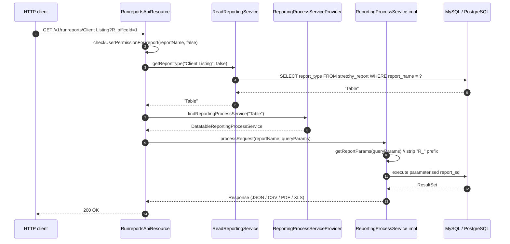

The Reports API is the single hub through which every interactive report in Apache Fineract is defined, listed, executed, and exported. It sits on top of two database tables (`stretchy_report` and `stretchy_parameter`), one runtime SPI (`ReportingProcessService`), and two JAX-RS resources: `/v1/reports` for CRUD over report metadata and `/v1/runreports/{reportName}` for execution. This page walks through each layer with pointers to source.

## The `Report` entity

A report definition is a row in `stretchy_report` mapped by `fineract-provider/src/main/java/org/apache/fineract/infrastructure/dataqueries/domain/Report.java`:

```java
@Entity
@Table(name = "stretchy_report",
       uniqueConstraints = { @UniqueConstraint(columnNames = { "report_name" },
                                               name = "unq_report_name") })
public final class Report extends AbstractPersistableCustom<Long> {

    @Column(name = "report_name", nullable = false, unique = true)
    private String reportName;

    @Column(name = "report_type", nullable = false)
    private String reportType;          // "Table" | "Chart" | "SMS" | "Pentaho"

    @Column(name = "report_subtype")
    private String reportSubType;

    @Column(name = "report_category")
    private String reportCategory;      // "Client", "Loan", "Fund", "Accounting", ...

    @Column(name = "description")
    private String description;

    @Column(name = "core_report", nullable = false)
    private boolean coreReport;         // true for migrations-shipped reports

    @Column(name = "use_report", nullable = false)
    private boolean useReport;          // shown in the UI list

    @Column(name = "report_sql")
    private String reportSql;           // null for Pentaho
}
```

Key invariants enforced by the entity and the `ReportWritePlatformServiceImpl`:

- `reportName` is **globally unique** because it is the lookup key used by the runner. The runner consults `ReadReportingService.getReportType(reportName, …)` to figure out which engine to dispatch to.
- `reportType` must be one of the values registered with `ReportingProcessServiceProvider`. Out of the box that is `Table`, `Chart`, `SMS` (all handled by `DatatableReportingProcessService`) plus `Pentaho` (when the Pentaho bundle is present). New types can be added by registering a new `@ReportService`-annotated bean — no schema change needed.
- `coreReport=true` rows are immutable except for their `description`/`useReport` flags, and **cannot** be deleted via `DELETE /v1/reports/{id}`. The CRUD endpoint enforces that explicitly with the API doc note `Only non-core reports can be deleted.`

Two related tables flesh out the parameter model:

- `stretchy_parameter` — the catalogue of reusable report parameters (`officeId`, `currencyId`, `loanProductId`, `loanOfficerId`, `fundId`, `loanPurposeId`, `startDate`, `endDate`, `parType`, …). Each row stores a UI label, a parameter SQL that produces the dropdown values, and a default value.
- `stretchy_report_parameter` — the many-to-many between reports and parameters, mapped by `ReportParameter`/`ReportParameterUsage` in the same package. The runner uses it to render the parameter screen when called with `?parameterType=true`.

## CRUD: `ReportsApiResource`

`fineract-provider/src/main/java/org/apache/fineract/infrastructure/dataqueries/api/ReportsApiResource.java` is mounted at `/v1/reports` and exposes a standard CRUD surface:

| Method | Path | Operation | Notes |
| ------ | ---- | --------- | ----- |
| `GET` | `/v1/reports` | `retrieveAllReports` | Lists every row of `stretchy_report` together with its parameters. |
| `GET` | `/v1/reports/{id}` | `retrieveOneReport` | Single row. Add `?template=true` to get the available report types + parameter catalogue. |
| `GET` | `/v1/reports/template` | `retrieveTemplateReport` | Returns metadata for the "Create Report" UI: allowed types, parameter list. |
| `POST` | `/v1/reports` | `createReport` | Body validated by `ReportCommandFromApiJsonDeserializer`; `reportType` must come from `ReportingProcessServiceProvider.findAllReportingTypes()`. |
| `PUT` | `/v1/reports/{id}` | `updateReport` | Core reports only allow `description`/`useReport` to change. |
| `DELETE` | `/v1/reports/{id}` | `deleteReport` | Refuses to delete `core_report = true` rows. |

All write operations flow through the standard CQRS command machinery — they return a `CommandProcessingResult`, log into `m_portfolio_command_source`, and can be wrapped by a maker-checker rule. The signature for create, for example:

```java
@POST
@Operation(summary = "Create a Report", operationId = "createReport")
public String createReport(final String apiRequestBodyAsJson) { ... }
```

There is no separate "stretchy report" resource — Pentaho rows are created and edited through the same endpoint with `"reportType": "Pentaho"` and a null `reportSql`. The Pentaho engine then locates the `.prpt` file on the classpath by report name.

## The runner: `RunreportsApiResource`

`fineract-provider/src/main/java/org/apache/fineract/infrastructure/dataqueries/api/RunreportsApiResource.java`, mounted at `/v1/runreports`, has only two routes but they are the most-hit endpoints in the entire reporting subsystem.

### 1. Discover the export targets

```java
@GET
@Path("/availableExports/{reportName}")
@Produces({ MediaType.APPLICATION_JSON })
@Operation(summary = "Return all available export types for the specific report",
           operationId = "retrieveAllAvailableExports")
public List<ReportExportType> retrieveAllAvailableExports(
        @PathParam("reportName") final String reportName) { ... }
```

The runner asks the engine for its `getAvailableExportTargets()`. For the SQL/Chart/SMS engine that returns CSV, PDF, JSON, S3, etc., depending on which `DatatableReportExportService` beans are wired in.

### 2. Run the report

```java
@GET
@Path("{reportName}")
@Produces({ MediaType.APPLICATION_JSON, "text/csv",
            "application/vnd.ms-excel", "application/pdf", "text/html" })
@Operation(summary = "Run a predefined report", operationId = "runReport")
public Response runReport(
        @PathParam("reportName") final String reportName,
        @Context final UriInfo uriInfo,
        @DefaultValue("false") @QueryParam("exportCSV")     final Boolean exportCSV,
        @DefaultValue("false") @QueryParam("parameterType") final Boolean parameterType,
        @QueryParam("output-type")     final String outputType,
        @QueryParam("R_officeId")      final String rOfficeId,
        @QueryParam("R_loanOfficerId") final String rLoanOfficerId,
        @QueryParam("R_fromDate")      final String rFromDate,
        @QueryParam("R_toDate")        final String rToDate,
        @QueryParam("R_currencyId")    final String rCurrencyId,
        @QueryParam("R_accountNo")     final String rAccountNo) {

    return processReportRequest(reportName, uriInfo);
}
```

Notice that the parameters listed in the method signature are **purely documentary** — they exist so Swagger picks up sensible examples. The runner does not use them directly; instead it grabs every query parameter from `UriInfo.getQueryParameters()` and forwards the whole `MultivaluedMap` to the engine:

```java
private Response processReportRequest(final String reportName, final UriInfo uriInfo) {
    MultivaluedMap<String, String> queryParams = new MultivaluedStringMap();
    queryParams.putAll(uriInfo.getQueryParameters());

    final boolean parameterTypeValue = ApiParameterHelper.parameterType(queryParams);
    checkUserPermissionForReport(reportName, parameterTypeValue);

    String reportType = readExtraDataAndReportingService.getReportType(reportName, parameterTypeValue);
    ReportingProcessService reportingProcessService =
            reportingProcessServiceProvider.findReportingProcessService(reportType);
    if (reportingProcessService == null) {
        throw new PlatformServiceUnavailableException(
                "err.msg.report.service.implementation.missing",
                ReportingProcessServiceProvider.SERVICE_MISSING + reportType, reportType);
    }
    return reportingProcessService.processRequest(reportName, queryParams);
}
```

The flow is:



Two side channels deserve attention:

- **`parameterType=true`** turns the same URL into a *meta* call: the runner returns the resolution of the report's parameter dropdowns instead of running the report. The permission check is then skipped (anyone authenticated can read parameter values), which is intentional — UI forms need it before the user has any specific report permission.
- **`exportCSV=true`** / **`exportPDF=true`** / **`exportS3=true`** select the response export pipeline inside `DatatableReportingProcessService`. The mapping is centralised in `DatatableExportTargetParameter`:

  ```java
  CSV("exportCSV"),
  PDF("exportPDF"),
  JSON("exportJSON"),
  PRETTY_JSON("pretty");
  ```

### Authorisation

```java
private void checkUserPermissionForReport(final String reportName, final boolean parameterType) {
    if (!parameterType) {
        final AppUser currentUser = this.context.authenticatedUser();
        if (currentUser.hasNotPermissionForReport(reportName)) {
            throw new NoAuthorizationException("Not authorised to run report: " + reportName);
        }
    }
}
```

Permissions are per-report — `READ_<reportName>` and `READ_REPORT` — and are seeded automatically the first time a report is created.

## SQL reports

A SQL ("Table") report is a row whose `report_sql` is a SELECT statement parameterised with `${name}` placeholders. The seed migration loads dozens of them, e.g. **Client Listing** (id 1):

```sql
select
  concat(repeat("..", ((LENGTH(ounder.hierarchy) - LENGTH(REPLACE(ounder.hierarchy, '.', '')) - 1))), ounder.name) as "Office/Branch",
  c.account_no as "Client Account No.",
  c.display_name as "Name",
  c.joined_date as "Joined",
  c.external_id as "External Id"
from m_office o
join m_office ounder on ounder.hierarchy like concat(o.hierarchy, '%')
  and ounder.hierarchy like concat('${currentUserHierarchy}', '%')
join m_client c on c.office_id = ounder.id
where o.id = ${officeId}
  and c.is_deleted = 0
order by ounder.hierarchy, c.account_no
```

Two parameters appear in that SQL:

- `${currentUserHierarchy}` — implicit, injected by the engine from the authenticated user's office.hierarchy. This is how Fineract enforces office-scoping inside SQL reports.
- `${officeId}` — explicit, set by the client via `?R_officeId=1` in the URL.

Parameter substitution is done in `AbstractReportingProcessService.getReportParams`:

```java
public Map<String, String> getReportParams(final MultivaluedMap<String, String> queryParams) {
    final Map<String, String> reportParams = new HashMap<>();
    for (Map.Entry<String, List<String>> entry : queryParams.entrySet()) {
        if (entry.getKey().startsWith("R_")) {
            String pKey = "${" + entry.getKey().substring(2) + "}";
            String pValue = entry.getValue().get(0);
            sqlValidator.validate(pValue);                 // ← SQL-injection screen
            reportParams.put(pKey, pValue);
        }
    }
    return reportParams;
}
```

`SqlValidator` rejects any value that contains an unquoted semicolon, multiline comments, or common SQL keywords outside of allowed contexts. It is the primary defence against injection — the engine does not use prepared statements for the substituted `${…}` tokens (because the same syntax is used for table/column names, not just literals), so the validator is the safety net.

## Pentaho reports

For `report_type = "Pentaho"`, the `report_sql` column stays null. The Pentaho engine, registered through its own `@ReportService(type = "Pentaho")` bean, looks up a `.prpt` (Pentaho Reporting Project) file on the classpath whose filename matches the report's `report_name`, then drives it through `ReadReportingService.generatePentahoReportAsOutputStream`:

```java
ByteArrayOutputStream generatePentahoReportAsOutputStream(
        String reportName,
        String outputTypeParam,
        Map<String, String> queryParams,
        Locale locale,
        ...);
```

`outputTypeParam` is read from the `?output-type=` query parameter and must be one of `HTML`, `PDF`, `XLS`, `CSV`. The runner does not need to know the difference — `processRequest` returns whatever the engine produces.

The migration ships a small but high-value Pentaho catalogue: `Balance Sheet` (id 48), `Income Statement` (id 49), `Trial Balance` (id 50), `Loan Account Schedule` (id 91), `Branch Expected Cash Flow` (id 92), and `Expected Payments By Date - Formatted` (id 94). These are the statements a finance team is most likely to print or attach.

## The SPI: `ReportingProcessService`

Concrete engines implement the three-method interface in `fineract-report/src/main/java/org/apache/fineract/infrastructure/report/service/ReportingProcessService.java`:

```java
public interface ReportingProcessService {
    Response processRequest(String reportName, MultivaluedMap<String, String> queryParams);
    List<ReportExportType> getAvailableExportTargets();
    Map<String, String> getReportParams(MultivaluedMap<String, String> queryParams);
}
```

…and inherit the parameter machinery from `AbstractReportingProcessService`:

```java
public abstract class AbstractReportingProcessService implements ReportingProcessService {

    private final SqlValidator sqlValidator;

    protected AbstractReportingProcessService(SqlValidator sqlValidator) {
        this.sqlValidator = sqlValidator;
    }

    @Override
    public Map<String, String> getReportParams(final MultivaluedMap<String, String> queryParams) { ... }
}
```

Registration is annotation-driven:

```java
@Service
@ReportService(type = { "Table", "Chart", "SMS" })
public class DatatableReportingProcessService extends AbstractReportingProcessService { ... }
```

To plug in a new engine — e.g. a JasperReports adapter — the recipe is simply:

1. Drop a bean implementing `ReportingProcessService` (or extending `AbstractReportingProcessService`) into the Spring context.
2. Annotate it with `@ReportService(type = { "Jasper" })`.
3. Insert a row into `stretchy_report` with `report_type = 'Jasper'`.

`ReportingProcessServiceProvider` rebuilds its `ImmutableMap<String, ReportingProcessService>` at startup and the runner finds the new bean by `report_type` automatically.

## Export pipeline

The SQL engine has its own export fan-out under `fineract-provider/src/main/java/org/apache/fineract/infrastructure/dataqueries/service/export/`:

```
DatatableReportExportService           ← SPI implemented per target
├── CsvDatatableReportExportServiceImpl
├── PdfDatatableReportExportService
├── JsonDatatableReportExportService
└── S3DatatableReportExportServiceImpl ← uploads CSV to an S3 bucket and returns the URL
```

`DatatableReportingProcessService.processRequest` resolves which one to use:

```java
DatatableExportTargetParameter exportMode = DatatableExportTargetParameter.resolverExportTarget(queryParams);
ResponseHolder response = findReportExportService(exportMode)
        .orElseThrow(() -> new GeneralPlatformDomainRuleException(
                "error.msg.report.export.mode.unavailable",
                "Export mode %s unavailable".formatted(exportMode.name())))
        .export(reportName, queryParams, reportParams, parameterTypeValue);
```

Each `ResponseHolder` carries the HTTP status, content type, filename, optional response headers, and the entity payload. `DatatableReportingProcessService` rebuilds a JAX-RS `Response` from those fields so the runner stays format-agnostic.

## Headers and content types

| Query | Engine action | Content-Type | Filename |
| ----- | ------------- | ------------ | -------- |
| *(none)* | JSON resultset | `application/json` | — |
| `exportCSV=true` | CSV file | `text/csv` | `<reportName>.csv` |
| `exportPDF=true` | PDF document | `application/pdf` | `<reportName>.pdf` |
| `output-type=XLS` | Excel (Pentaho only) | `application/vnd.ms-excel` | `<reportName>.xls` |
| `exportS3=true` | Upload to S3 | `application/json` | — (JSON returns the URL) |
| `parameterType=true` | Parameter dropdown data | `application/json` | — |

## Hook into report mailing jobs

The runner is wrapped, not replaced, by the batch scheduler. **`ExecuteReportMailingJobsTasklet`** (in `fineract-provider/src/main/java/org/apache/fineract/infrastructure/campaigns/jobs/executereportmailingjobs/`) holds the same `ReportingProcessServiceProvider` reference and re-uses it to produce the attachment:

```java
final Report stretchyReport = reportMailingJob.getStretchyReport();
final String reportName = stretchyReport.getReportName();
final String reportType = readReportingService.getReportType(reportName, false);
ReportingProcessService reportingProcessService =
        reportingProcessServiceProvider.findReportingProcessService(reportType);
Response response = reportingProcessService.processRequest(reportName, reportParams);
```

That is the integration point between this page and [`reporting/report-mailing-job`](/reporting/report-mailing-job): every scheduled email is just a programmatic call to the same engine that serves the synchronous `/v1/runreports/{name}` endpoint. The batch job name is `EXECUTE_REPORT_MAILING_JOBS`, defined in:

- `fineract-provider/src/main/java/org/apache/fineract/infrastructure/campaigns/jobs/executereportmailingjobs/ExecuteReportMailingJobsConfig.java`
- `fineract-provider/src/main/java/org/apache/fineract/infrastructure/campaigns/jobs/executereportmailingjobs/ExecuteReportMailingJobsTasklet.java`

## End-to-end examples

### List reports

```http
GET /fineract-provider/api/v1/reports HTTP/1.1
Authorization: Basic ...
Fineract-Platform-TenantId: default
```

```json
[
  {
    "id": 1,
    "reportName": "Client Listing",
    "reportType": "Table",
    "reportCategory": "Client",
    "description": "Individual Client Report …",
    "coreReport": true,
    "useReport": true,
    "reportParameters": [
      { "id": 1, "parameterId": 5, "parameterName": "OfficeIdSelectOne", "reportParameterName": "officeId" }
    ]
  },
  …
]
```

### Run a SQL report as CSV

```http
GET /fineract-provider/api/v1/runreports/Client Listing
    ?R_officeId=1&R_currencyId=USD&exportCSV=true HTTP/1.1
```

Response headers:

```
HTTP/1.1 200 OK
Content-Type: text/csv
Content-Disposition: attachment; filename=Client Listing.csv
```

### Run a Pentaho report as PDF

```http
GET /fineract-provider/api/v1/runreports/Balance Sheet
    ?R_officeId=1&R_currencyId=USD&output-type=PDF HTTP/1.1
```

### Look up a report's parameter dropdowns

```http
GET /fineract-provider/api/v1/runreports/Client Listing?parameterType=true HTTP/1.1
```

The runner skips the per-report permission and returns the populated dropdowns the UI needs to render the parameter form.

## Failure modes

| Symptom | Cause | Where |
| ------- | ----- | ----- |
| `404 ReportNotFoundException` | `report_name` does not exist | `ReadReportingServiceImpl.getReportType` |
| `503 err.msg.report.service.implementation.missing` | `report_type` has no registered engine (e.g. Pentaho jar absent) | `RunreportsApiResource.processReportRequest` |
| `401 NoAuthorizationException` | User lacks `READ_<reportName>` permission | `RunreportsApiResource.checkUserPermissionForReport` |
| `400 GeneralPlatformDomainRuleException("error.msg.report.export.mode.unavailable")` | Requested export target has no `DatatableReportExportService` bean | `DatatableReportingProcessService.processRequest` |
| `400 SqlInjectionException` | `R_*` value rejected by `SqlValidator` | `AbstractReportingProcessService.getReportParams` |

## File map

```
fineract-report/src/main/java/org/apache/fineract/infrastructure/report/
├── annotation/ReportService.java
├── provider/ReportingProcessServiceProvider.java
└── service/
    ├── AbstractReportingProcessService.java
    └── ReportingProcessService.java

fineract-provider/src/main/java/org/apache/fineract/infrastructure/dataqueries/
├── api/
│   ├── ReportsApiResource.java
│   ├── ReportsApiResourceSwagger.java
│   ├── RunreportsApiResource.java
│   └── RunreportsApiResourceSwagger.java
├── domain/
│   ├── Report.java
│   ├── ReportRepository.java
│   ├── ReportRepositoryWrapper.java
│   ├── ReportParameter.java
│   └── ReportParameterUsage.java
└── service/
    ├── DatatableReportingProcessService.java
    ├── DatatableExportTargetParameter.java
    ├── ReadReportingService.java
    ├── ReadReportingServiceImpl.java
    ├── ReportWritePlatformService.java
    ├── ReportWritePlatformServiceImpl.java
    └── export/
        ├── CsvDatatableReportExportServiceImpl.java
        ├── PdfDatatableReportExportService.java
        ├── JsonDatatableReportExportService.java
        └── S3DatatableReportExportServiceImpl.java
```
