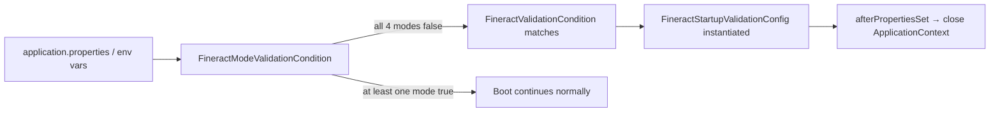
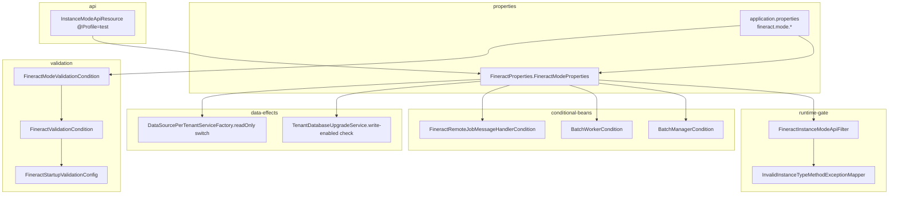

Apache Fineract is one codebase but ships as a *role-aware* runtime: the same `fineract-provider.jar` can be launched as a read-only API node, a write API node, a Spring Batch worker, or the batch manager — each role gated by four `fineract.mode.*` boolean properties. This page documents the property surface, the validator that rejects nonsensical combinations, the filter that enforces them at request time, and the bean conditions that switch entire feature sets on or off.

## The four modes

Each mode is an independent boolean. They can be combined; the default (`true` for all four) yields a "do everything" monolithic deployment.

<CardGroup cols={2}>
  <Card title="read-enabled" icon="eye">
    Permits inbound `GET` requests on `/api/**`. Without this, GETs are rejected as 405.
  </Card>
  <Card title="write-enabled" icon="pen">
    Permits inbound non-GET requests (`POST`, `PUT`, `DELETE`) **and** drives `TenantDatabaseUpgradeService` to actually apply migrations. Disabling this turns the JVM into a strict read replica.
  </Card>
  <Card title="batch-manager-enabled" icon="diagram-project">
    Marks this JVM as the Spring Batch coordinator: it owns `/v1/jobs`, `/v1/scheduler`, `/v1/loans/catch-up`, schedules jobs, and (with the right message handler) dispatches partitions to workers.
  </Card>
  <Card title="batch-worker-enabled" icon="boxes-stacked">
    Marks this JVM as a partition executor: it receives `RemoteJobMessageHandler` messages and runs batch chunks but does not own the schedule.
  </Card>
</CardGroup>

`FineractModeProperties` (file: `fineract-core/src/main/java/org/apache/fineract/infrastructure/core/config/FineractProperties.java` lines 141-151) is the typed binding:

```java
@Getter
@Setter
public static class FineractModeProperties {
    private boolean readEnabled;
    private boolean writeEnabled;
    private boolean batchWorkerEnabled;
    private boolean batchManagerEnabled;

    public boolean isReadOnlyMode() {
        return readEnabled && !writeEnabled && !batchWorkerEnabled && !batchManagerEnabled;
    }
}
```

The helper `isReadOnlyMode()` is a strict definition — only `readEnabled` is true; all other flags must be false. This is the predicate that triggers read-only data-source selection (see "Effects on the data source" below).

## Property and environment variable surface

Defaults in `fineract-provider/src/main/resources/application.properties` (lines 67-70):

```properties
fineract.mode.read-enabled=${FINERACT_MODE_READ_ENABLED:true}
fineract.mode.write-enabled=${FINERACT_MODE_WRITE_ENABLED:true}
fineract.mode.batch-worker-enabled=${FINERACT_MODE_BATCH_WORKER_ENABLED:true}
fineract.mode.batch-manager-enabled=${FINERACT_MODE_BATCH_MANAGER_ENABLED:true}
```

| Spring property | Environment variable | Default | Effect when `true` |
| --- | --- | --- | --- |
| `fineract.mode.read-enabled` | `FINERACT_MODE_READ_ENABLED` | `true` | `GET /api/**` allowed |
| `fineract.mode.write-enabled` | `FINERACT_MODE_WRITE_ENABLED` | `true` | non-GET `/api/**` allowed; Liquibase runs |
| `fineract.mode.batch-manager-enabled` | `FINERACT_MODE_BATCH_MANAGER_ENABLED` | `true` | scheduler beans active; `/v1/jobs`, `/v1/scheduler` reachable |
| `fineract.mode.batch-worker-enabled` | `FINERACT_MODE_BATCH_WORKER_ENABLED` | `true` | remote-job listener beans active |

There is also a legacy constants file that names a subset of these property keys for use in tests and internal references:

```java
// fineract-core/.../instancemode/api/FineractInstanceModeConstants.java
public final class FineractInstanceModeConstants {
    public static final String FINERACT_MODE_READ_ENABLE_PROPERTY  = "fineract.mode.read-enabled";
    public static final String FINERACT_MODE_WRITE_ENABLE_PROPERTY = "fineract.mode.write-enabled";
    public static final String FINERACT_MODE_BATCH_ENABLE_PROPERTY = "fineract.mode.batch-enabled";
    private FineractInstanceModeConstants() {}
}
```

<Note>
The third constant `fineract.mode.batch-enabled` does **not** appear in `application.properties` and is not bound to `FineractModeProperties`. It is a historical leftover; the runtime uses the split `batch-manager-enabled` / `batch-worker-enabled` keys instead.
</Note>

## Validation at startup

If all four flags are false, the JVM has no purpose. `FineractModeValidationCondition` (file: `fineract-core/.../condition/FineractModeValidationCondition.java`) detects exactly that combination:

```java
public class FineractModeValidationCondition implements Condition {
    @Override
    public boolean matches(ConditionContext context, AnnotatedTypeMetadata metadata) {
        boolean isReadModeEnabled = Optional.ofNullable(
                context.getEnvironment().getProperty("fineract.mode.read-enabled", Boolean.class)).orElse(true);
        boolean isWriteModeEnabled = ...
        boolean isBatchManagerModeEnabled = ...
        boolean isBatchWorkerModeEnabled = ...
        boolean isValidationFails = !isReadModeEnabled && !isWriteModeEnabled
                                    && !isBatchManagerModeEnabled && !isBatchWorkerModeEnabled;
        if (isValidationFails) {
            log.error("The Fineract instance type is not configured properly. At least one of these environment variables should be true: ...");
        }
        return isValidationFails;
    }
}
```

This condition feeds into `FineractValidationCondition` (`AnyNestedCondition`, file: `fineract-core/.../condition/FineractValidationCondition.java`), which in turn activates `FineractStartupValidationConfig` (see [Spring Boot Configuration](/runtime/spring-boot-configuration#fineractstartupvalidationconfig)). The startup validation bean's `afterPropertiesSet()` immediately closes the `ApplicationContext`:



A pod scheduled with all four flags off will log the error and exit non-zero — exactly the failure signal a container orchestrator needs.

## Runtime enforcement: FineractInstanceModeApiFilter

The runtime gate is `FineractInstanceModeApiFilter` (file: `fineract-core/src/main/java/org/apache/fineract/infrastructure/instancemode/filter/FineractInstanceModeApiFilter.java`). It is wired into the Spring Security chain by `SecurityConfig` (after the correlation header filter — see [Spring Boot Configuration](/runtime/spring-boot-configuration#securityconfig)):

```
TenantAwareBasicAuthenticationFilter
   → RequestResponseFilter
   → CorrelationHeaderFilter
   → FineractInstanceModeApiFilter   ← here
   → ...
```

### Decision flow

For each request that reaches the filter:

```mermaid
flowchart TD
    A[Request arrives] --> B{Path on exception list?<br/>(jobs, scheduler, instance-mode, ...)}
    B -- yes, and mode allows --> Z[proceed]
    B -- yes, but mode rejects --> R[reject 405]
    B -- no --> C{Is /actuator/**?}
    C -- yes --> Z
    C -- no --> D{HTTP method is GET?}
    D -- yes & read-enabled --> Z
    D -- no & write-enabled --> Z
    D -- otherwise --> R
```

### Exception list

Specific paths bypass the read/write decision because they are control-plane endpoints:

```java
// fineract-core/.../instancemode/filter/FineractInstanceModeApiFilter.java
private static final List<ExceptionListItem> EXCEPTION_LIST = List.of(
    item(FineractModeProperties::isBatchManagerEnabled, pi -> pi.startsWith("/v1/jobs")),
    item(FineractModeProperties::isBatchManagerEnabled, pi -> pi.startsWith("/v1/scheduler")),
    item(FineractModeProperties::isBatchManagerEnabled, pi -> pi.startsWith("/v1/loans/catch-up")),
    item(FineractModeProperties::isBatchManagerEnabled, pi -> pi.startsWith("/v1/loans/is-catch-up-running")),
    item(p -> true,                                     pi -> pi.startsWith("/v1/instance-mode")),
    item(p -> true,                                     pi -> pi.startsWith("/v1/batches"))
);
```

| Path prefix | Allowed when |
| --- | --- |
| `/v1/jobs` | `batch-manager-enabled=true` |
| `/v1/scheduler` | `batch-manager-enabled=true` |
| `/v1/loans/catch-up` | `batch-manager-enabled=true` |
| `/v1/loans/is-catch-up-running` | `batch-manager-enabled=true` |
| `/v1/instance-mode` | always (the API that flips the modes) |
| `/v1/batches` | always (request batching is allowed everywhere because individual sub-requests inside a batch are filtered by their own paths) |
| `/actuator/**` | always (separate check via `request.getServletPath().startsWith("/actuator")`) |

### Rejection

When a request is denied:

```java
private void reject(HttpServletRequest request, HttpServletResponse response) throws IOException {
    response.setStatus(HttpStatus.SC_METHOD_NOT_ALLOWED);   // 405
    ApiGlobalErrorResponse errorResponse = ApiGlobalErrorResponse.invalidInstanceTypeMethod(request.getMethod());
    response.getWriter().write(errorResponse.toJson());
}
```

The client receives HTTP 405 with the standard `ApiGlobalErrorResponse` envelope. The dedicated mapper — `InvalidInstanceTypeMethodExceptionMapper` in `fineract-core/.../exceptionmapper/` — handles the equivalent when the same error originates from inside a resource method.

## Effects on other beans

The mode flags are not only consulted by the request filter — they gate entire bean graphs.

### Liquibase migrations

`TenantDatabaseUpgradeService` (file: `fineract-provider/.../infrastructure/core/service/migration/TenantDatabaseUpgradeService.java` line 82) refuses to run migrations on a non-write instance:

```java
if (databaseStateVerifier.isLiquibaseDisabled() || !fineractProperties.getMode().isWriteEnabled()) {
    log.warn("Liquibase is disabled. Not upgrading any database.");
    if (!fineractProperties.getMode().isWriteEnabled()) {
        log.warn("Liquibase is disabled because the current instance is configured as a non-write Fineract instance");
    }
    return;
}
```

A read-only pod boots fast because it skips all migration work; the schema is assumed to have been migrated by a separate write-enabled pod (or an init container running in `liquibase-only` mode — see [Liquibase and Startup](/runtime/liquibase-and-startup)).

### Read-only data source

`DataSourcePerTenantServiceFactory` (file: `fineract-core/.../service/database/DataSourcePerTenantServiceFactory.java` lines 74-87) switches the per-tenant pool to the read-only replica connection details when `isReadOnlyMode()` is true:

```java
if (fineractProperties.getMode().isReadOnlyMode()) {
    schemaServer   = StringUtils.defaultIfBlank(tenantConnection.getReadOnlySchemaServer(),   schemaServer);
    schemaPort     = StringUtils.defaultIfBlank(tenantConnection.getReadOnlySchemaServerPort(), schemaPort);
    schemaName     = StringUtils.defaultIfBlank(tenantConnection.getReadOnlySchemaName(),     schemaName);
    schemaUsername = StringUtils.defaultIfBlank(tenantConnection.getReadOnlySchemaUsername(), schemaUsername);
    schemaPassword = StringUtils.defaultIfBlank(tenantConnection.getReadOnlySchemaPassword(), schemaPassword);
    ...
}
config.setReadOnly(fineractProperties.getMode().isReadOnlyMode());
```

The Hikari pool is also marked `readOnly=true`, which propagates `setReadOnly(true)` to each JDBC `Connection` — the database can then route to a replica or refuse writes outright. See [Multi-Tenancy](/runtime/multi-tenancy) for the data-source selection algorithm.

### Batch instance conditions

Two `@Conditional` classes in `fineract-cob` switch batch beans on or off based purely on mode flags:

```java
// fineract-cob/.../conditions/BatchManagerCondition.java
public class BatchManagerCondition extends PropertiesCondition {
    @Override protected boolean matches(FineractProperties properties) {
        return properties.getMode().isBatchManagerEnabled();
    }
}

// fineract-cob/.../conditions/BatchWorkerCondition.java
public class BatchWorkerCondition extends PropertiesCondition {
    @Override protected boolean matches(FineractProperties properties) {
        return properties.getMode().isBatchWorkerEnabled();
    }
}
```

Beans annotated `@Conditional(BatchManagerCondition.class)` only materialize when `batch-manager-enabled=true`; same pattern for workers.

### Scheduler job execution

`JobSchedulerServiceImpl` (file: `fineract-provider/.../jobs/service/JobSchedulerServiceImpl.java` line 56) skips its own work entirely on a non-manager:

```java
if (!fineractProperties.getMode().isBatchManagerEnabled()) {
    // skip scheduling
    return;
}
```

And `SchedulerJobApiResource` (line 225) checks the same flag before exposing job-control operations.

### Remote job message handler

`FineractRemoteJobMessageHandlerCondition` (file: `fineract-core/.../condition/FineractRemoteJobMessageHandlerCondition.java`) cross-validates message-handler configuration against the mode flags. Three private predicates encode the rule set:

```java
private boolean isBatchInstance(FineractProperties properties) {
    boolean isBatchManagerModeEnabled = properties.getMode().isBatchManagerEnabled();
    boolean isBatchWorkerModeEnabled  = properties.getMode().isBatchWorkerEnabled();
    return isBatchManagerModeEnabled || isBatchWorkerModeEnabled;
}

private boolean isBatchManagerAndWorkerTogether(FineractProperties properties) {
    return properties.getMode().isBatchManagerEnabled() && properties.getMode().isBatchWorkerEnabled();
}

private boolean isOnlyOneMessageHandlerEnabled(FineractProperties properties) {
    boolean isSpringEventsEnabled = properties.getRemoteJobMessageHandler().getSpringEvents().isEnabled();
    boolean isJmsEnabled          = properties.getRemoteJobMessageHandler().getJms().isEnabled();
    return isSpringEventsEnabled ^ isJmsEnabled;
}
```

Combined with the rest of the condition, this enforces: if you are a manager *and* a worker on the same JVM you may use Spring events (in-process); if you are split across pods you must use JMS (out-of-process); enabling both is an error.

### Batch API resource

`BatchApiResource` (file: `fineract-core/.../batch/api/BatchApiResource.java` line 118) inspects `isReadOnlyMode()` to enforce that batch sub-requests on a strict read-only instance must be GETs.

## Changing modes at runtime: the API

`InstanceModeApiResource` (file: `fineract-provider/src/main/java/org/apache/fineract/infrastructure/instancemode/api/InstanceModeApiResource.java`) exposes a `PUT /v1/instance-mode` endpoint that flips the four flags in the live `FineractProperties` bean:

```java
@Profile(FineractProfiles.TEST)
@Component
@Path("/v1/instance-mode")
public class InstanceModeApiResource implements InitializingBean {
    private final FineractProperties fineractProperties;

    @PUT
    @Consumes({ MediaType.APPLICATION_JSON })
    public Response changeMode(InstanceModeApiResourceSwagger.ChangeInstanceModeRequest request) {
        fineractProperties.getMode().setReadEnabled(request.isReadEnabled());
        fineractProperties.getMode().setWriteEnabled(request.isWriteEnabled());
        fineractProperties.getMode().setBatchWorkerEnabled(request.isBatchWorkerEnabled());
        fineractProperties.getMode().setBatchManagerEnabled(request.isBatchManagerEnabled());
        return Response.ok().build();
    }
}
```

Two things stand out:

1. **Test-only**: the class is annotated `@Profile(FineractProfiles.TEST)` — it only becomes a Spring bean when the `test` profile is active. Production builds never expose this endpoint.
2. **In-memory only**: the change is to the live `FineractProperties` bean; it does not persist anywhere. A JVM restart reverts to the configured values.

The resource's `afterPropertiesSet()` makes the danger explicit:

```java
log.warn("DO NOT USE THIS IN PRODUCTION!");
log.warn("Instance type changing feature is enabled");
log.warn("DO NOT USE THIS IN PRODUCTION!");
```

The request schema (`fineract-provider/.../instancemode/api/InstanceModeApiResourceSwagger.java`):

```java
public static final class ChangeInstanceModeRequest {
    public boolean readEnabled;
    public boolean writeEnabled;
    public boolean batchWorkerEnabled;
    public boolean batchManagerEnabled;
}
```

The integration test harness uses this endpoint (`integration-tests/.../support/instancemode/InstanceModeHelper.java`) to verify mode-specific behavior without restarting the JVM. The `/v1/instance-mode` path is also on `FineractInstanceModeApiFilter.EXCEPTION_LIST` (always allowed) and is `permitAll()` in `SecurityConfig` so the test can call it without authentication.

## Deployment recipes

### Single-pod monolith (default)

All four flags `true`. One JVM serves reads, writes, schedules jobs, and runs batches. Simplest deployment; no `FINERACT_MODE_*` env vars needed.

### Read replicas + writer

```text
Pod "writer"  : FINERACT_MODE_READ_ENABLED=true  WRITE_ENABLED=true  BATCH_MANAGER=true  BATCH_WORKER=true
Pod "reader-a": FINERACT_MODE_READ_ENABLED=true  WRITE_ENABLED=false BATCH_MANAGER=false BATCH_WORKER=false
Pod "reader-b": same as reader-a
```

Send `GET` traffic to `reader-*` (these will use the `read-only-*` DB connection from the tenant connection). Send writes to `writer`. Liquibase only runs on the writer.

### Split batch tier

```text
Pod "api"        : READ=true WRITE=true BATCH_MANAGER=false BATCH_WORKER=false
Pod "batch-mgr"  : READ=false WRITE=false BATCH_MANAGER=true BATCH_WORKER=false
Pod "batch-wkr-N": READ=false WRITE=false BATCH_MANAGER=false BATCH_WORKER=true
```

Requires JMS (or Kafka) for the remote-job message handler so manager and workers can communicate across pods. `FineractRemoteJobMessageHandlerCondition` will validate this is configured before allowing boot.

### Migration init container

```text
SPRING_PROFILES_ACTIVE=liquibase-only   (orthogonal — see Liquibase and Startup)
```

In this mode the `FineractWebApplicationConfiguration` does not activate, so the mode flags are largely irrelevant; only the migration code runs.

## Property→consumer cross-reference

| Property | Read by | What changes when toggled |
| --- | --- | --- |
| `fineract.mode.read-enabled` | `FineractInstanceModeApiFilter` (request gate); `FineractModeProperties.isReadOnlyMode()` | GET requests on `/api/**` |
| `fineract.mode.write-enabled` | `FineractInstanceModeApiFilter`; `TenantDatabaseUpgradeService` (line 82); `FineractModeProperties.isReadOnlyMode()` | non-GET requests; Liquibase execution |
| `fineract.mode.batch-manager-enabled` | `BatchManagerCondition`; `JobSchedulerServiceImpl` (line 56); `SchedulerJobApiResource` (line 225); `FineractRemoteJobMessageHandlerCondition`; exception-list entries in `FineractInstanceModeApiFilter` | scheduler beans; `/v1/jobs`, `/v1/scheduler`, `/v1/loans/catch-up` reachability |
| `fineract.mode.batch-worker-enabled` | `BatchWorkerCondition`; `FineractRemoteJobMessageHandlerCondition` | remote-job listener beans |
| `(all four false)` | `FineractModeValidationCondition` → `FineractStartupValidationConfig` | JVM exits at boot |
| `isReadOnlyMode()` (derived) | `DataSourcePerTenantServiceFactory` (line 74, 87); `BatchApiResource` (line 118) | per-tenant DataSource switches to read-only replica; batch sub-requests must be GETs |

## Where each piece lives



## Where to read next

- [Spring Boot Configuration](/runtime/spring-boot-configuration#securityconfig) — how `FineractInstanceModeApiFilter` enters the Spring Security chain.
- [Multi-Tenancy](/runtime/multi-tenancy) — how `isReadOnlyMode()` drives `DataSourcePerTenantServiceFactory` to switch to the read-only replica connection.
- [Liquibase and Startup](/runtime/liquibase-and-startup) — `write-enabled=false` skips migrations entirely.
- [Jersey and JAX-RS](/runtime/jersey-and-jax-rs) — `InvalidInstanceTypeMethodExceptionMapper` translates the 405 from filter and resource methods.
