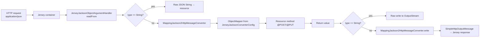
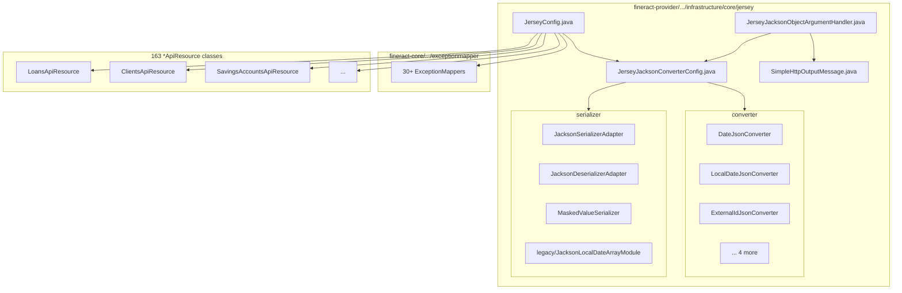

Apache Fineract serves its REST API through **Jersey** (Eclipse Foundation's JAX-RS 3.x reference implementation) rather than Spring MVC. This page documents the entire HTTP layer wiring: the `ResourceConfig` subclass, how every `@Path`-annotated bean is discovered, the Jackson `ObjectMapper` configuration, the bridge between JAX-RS `MessageBodyReader`/`Writer` and Spring's `HttpMessageConverter`, the field of 30+ `ExceptionMapper`s, and the legacy Swagger / API docs static files.

## The JerseyConfig class

The single entry point for the JAX-RS runtime is `JerseyConfig`, located at `fineract-provider/src/main/java/org/apache/fineract/infrastructure/core/jersey/JerseyConfig.java`. It extends Jersey's `ResourceConfig` and mounts the API at the `/api` application path:

```java
// fineract-provider/.../jersey/JerseyConfig.java
@Configuration(proxyBeanMethods = false)
@ApplicationPath("/api")
public class JerseyConfig extends ResourceConfig {

    JerseyConfig() {
        register(org.glassfish.jersey.media.multipart.MultiPartFeature.class);
        register(new AbstractBinder() {
            @Override
            protected void configure() {
                bind(PageableParamProvider.class).to(ValueParamProvider.class).in(Singleton.class);
            }
        });
        register(org.glassfish.jersey.server.validation.ValidationFeature.class);
        property(ServerProperties.WADL_FEATURE_DISABLE, true);
    }

    @Autowired
    ApplicationContext appCtx;

    @PostConstruct
    public void setup() {
        appCtx.getBeansWithAnnotation(Path.class).values().forEach(this::register);
        appCtx.getBeansWithAnnotation(Provider.class).values().forEach(this::register);
    }
}
```

Four registrations matter:

<CardGroup cols={2}>
  <Card title="MultiPartFeature" icon="paperclip">
    Enables `multipart/form-data` handling so endpoints like document upload and bulk import can accept `@FormDataParam` arguments.
  </Card>
  <Card title="PageableParamProvider" icon="list">
    A custom `ValueParamProvider` that lets resource methods declare a Spring Data `Pageable` parameter directly. File: `fineract-core/src/main/java/org/apache/fineract/infrastructure/core/api/jersey/PageableParamProvider.java`.
  </Card>
  <Card title="ValidationFeature" icon="check">
    Hooks Jakarta Bean Validation (`@Valid`, `@NotNull`, ...) into request handling so violations become standard JAX-RS error responses.
  </Card>
  <Card title="WADL disabled" icon="ban">
    `ServerProperties.WADL_FEATURE_DISABLE = true` turns off Jersey's auto-generated WADL endpoints — Fineract documents the API with OpenAPI/Swagger annotations instead.
  </Card>
</CardGroup>

### Automatic resource and provider discovery

The `@PostConstruct setup()` method does the heavy lifting. Rather than enumerating every resource class, Fineract asks Spring for **every bean carrying `@Path`** and **every bean carrying `@Provider`** and registers them with Jersey at startup:

```java
appCtx.getBeansWithAnnotation(Path.class).values().forEach(this::register);
appCtx.getBeansWithAnnotation(Provider.class).values().forEach(this::register);
```

This is why every `*ApiResource` class in the codebase carries both `@Path("/v1/...")` *and* `@Component` (or `@RequiredArgsConstructor` plus another stereotype) — Spring instantiates them, then Jersey adopts them.

A count of resource classes on disk:

```bash
$ find fineract-provider/src/main/java -name "*ApiResource.java" | wc -l
112
$ find . -name "*ApiResource.java" | wc -l          # across all modules
163
```

163 JAX-RS resources, all wired by **two lines of reflection-driven setup**.

```mermaid
flowchart LR
    A[Spring @ComponentScan<br/>org.apache.fineract.**] --> B[Beans with @Path]
    A --> C[Beans with @Provider]
    D[JerseyConfig.setup<br/>@PostConstruct] --> B
    D --> C
    B --> E[Jersey ResourceConfig]
    C --> E
    E --> F[Servlet container /api/*]
```

## Resource class conventions

Every JAX-RS resource follows the same shape. Pull `LoansApiResource` as a representative example (file: `fineract-provider/src/main/java/org/apache/fineract/portfolio/loanaccount/api/LoansApiResource.java`):

```java
@Path("/v1/loans")
@Component
@Tag(name = "Loans", description = "The API concept of loans models the loan application process ...")
@RequiredArgsConstructor
public class LoansApiResource { ... }
```

The conventions across the 163 resources:

| Convention | Where to look |
| --- | --- |
| Path prefix `/v1/<resource>` | Class-level `@Path` — combined with `@ApplicationPath("/api")` from `JerseyConfig`, full URL becomes `/api/v1/<resource>`. |
| Spring stereotype | `@Component` (or sometimes `@Service`) makes it a Spring bean so `JerseyConfig.setup()` will find it. |
| Constructor injection | `@RequiredArgsConstructor` (Lombok) + `final` fields — no field injection on resources. |
| OpenAPI annotations | `@Tag`, `@Operation`, `@ApiResponse`, `@Parameter`, `@RequestBody` from `io.swagger.v3.oas.annotations.*` decorate every method. |
| Method-level `@GET`/`@POST`/`@PUT`/`@DELETE` | Standard JAX-RS verbs. |
| Method-level `@Path("{loanId}")` | Sub-paths declared per method. |
| `@Produces({ MediaType.APPLICATION_JSON })` | Per method — Fineract is JSON-only for normal endpoints; multipart uploads add `@Consumes(MULTIPART_FORM_DATA)`. |
| Return type `String` | Most read endpoints return a pre-serialized JSON `String` produced by `ToApiJsonSerializer` rather than a typed object, which lets Fineract honor per-request field-selection (`fields=` query param). Write endpoints return `CommandProcessingResult` directly. |
| Parameter binding | `@PathParam`, `@QueryParam`, `@DefaultValue`, `@FormDataParam`, `@Context UriInfo` are the common annotations. |

A typical method (paraphrased shape from `LoansApiResource.retrieveLoan` around line 462):

```java
@GET
@Path("{loanId}")
@Produces({ MediaType.APPLICATION_JSON })
@Operation(summary = "Retrieve a Loan", description = "...")
public String retrieveLoan(@PathParam("loanId") final Long loanId,
                           @Context final UriInfo uriInfo, ...) { ... }
```

## JSON serialization layer

Fineract uses **Jackson** (via Spring's `MappingJackson2HttpMessageConverter`) for request/response bodies — even though it runs on Jersey, it routes JSON through Spring's converter so that the same `ObjectMapper` configuration applies to both JAX-RS and any non-Jersey component.

### The ObjectMapper bean

**File**: `fineract-provider/src/main/java/org/apache/fineract/infrastructure/core/jersey/JerseyJacksonConverterConfig.java`

```java
@Bean
public ObjectMapper objectMapper(List<JsonSerializer<?>> serializers,
                                 List<JsonDeserializer<?>> deserializers,
                                 List<JsonConverter<?>> jsonConverters) {
    List<JsonSerializer<?>> mergedSerializers = new ArrayList<>(serializers);
    mergedSerializers.addAll(jsonConverters.stream().map(JacksonSerializerAdapter::new).toList());
    List<JsonDeserializer<?>> mergedDeserializers = new ArrayList<>(deserializers);
    mergedDeserializers.addAll(jsonConverters.stream().map(JacksonDeserializerAdapter::new).toList());
    ObjectMapper objectMapper = new Jackson2ObjectMapperBuilder()
            .serializers(mergedSerializers.toArray(new JsonSerializer[0]))
            .serializationInclusion(JsonInclude.Include.NON_NULL)
            .deserializers(mergedDeserializers.toArray(new JsonDeserializer[0]))
            .featuresToDisable(DeserializationFeature.FAIL_ON_UNKNOWN_PROPERTIES)
            .featuresToEnable(MapperFeature.ACCEPT_CASE_INSENSITIVE_ENUMS)
            .build();
    objectMapper.registerModule(new JacksonLocalDateArrayModule());
    return objectMapper;
}
```

Important behaviors baked in:

- `NON_NULL` inclusion — null fields are stripped from responses.
- `FAIL_ON_UNKNOWN_PROPERTIES` disabled — clients can post extra fields without errors.
- `ACCEPT_CASE_INSENSITIVE_ENUMS` enabled — `"ACTIVE"`, `"active"`, `"Active"` all bind to the same enum value.
- All Spring-scanned `JsonSerializer`, `JsonDeserializer`, and Fineract's own `JsonConverter` beans are auto-discovered and merged.
- `JacksonLocalDateArrayModule` handles Fineract's legacy `[yyyy,m,d]` array date format for backward compatibility.

### The JsonConverter SPI

Fineract introduces a `JsonConverter<T>` interface (`fineract-provider/.../jersey/converter/JsonConverter.java`) which combines serializer + deserializer for one type. Implementations in `fineract-provider/.../jersey/converter/`:

| Converter | Type |
| --- | --- |
| `DateJsonConverter` | `java.util.Date` |
| `LocalDateJsonConverter` | `java.time.LocalDate` |
| `LocalDateTimeJsonConverter` | `java.time.LocalDateTime` |
| `LocalTimeJsonConverter` | `java.time.LocalTime` |
| `OffsetDateTimeJsonConverter` | `java.time.OffsetDateTime` |
| `ExternalIdJsonConverter` | `org.apache.fineract.infrastructure.core.domain.ExternalId` |

Each is wrapped by `JacksonSerializerAdapter` and `JacksonDeserializerAdapter` (files in `fineract-provider/.../jersey/serializer/`) so the same converter participates in both directions.

### Bridging JAX-RS and Spring

Jersey expects `MessageBodyReader` / `MessageBodyWriter`; Spring uses `HttpMessageConverter`. Fineract bridges the two with `JerseyJacksonObjectArgumentHandler` (file: `fineract-provider/src/main/java/org/apache/fineract/infrastructure/core/jersey/JerseyJacksonObjectArgumentHandler.java`):

```java
@Provider
@Produces(MediaType.APPLICATION_JSON_VALUE)
@Consumes(MediaType.APPLICATION_JSON_VALUE)
@Component
@RequiredArgsConstructor
public class JerseyJacksonObjectArgumentHandler<T> implements MessageBodyReader<T>, MessageBodyWriter<T> {
    private final MappingJackson2HttpMessageConverter converter;
    // readFrom() delegates to converter.read(...); writeTo() delegates to converter.write(...)
}
```

A small helper class, `SimpleHttpOutputMessage` (file: `fineract-provider/.../jersey/SimpleHttpOutputMessage.java`), adapts an `OutputStream`+`HttpHeaders` pair to Spring's `HttpOutputMessage` interface so the converter can write into Jersey's response stream.

`isReadable`/`isWriteable` both return `true` unconditionally because the class is registered as a JAX-RS provider for `application/json` and Jersey's content negotiation already filtered the candidates by media type.

One special case in `readFrom`: when the resource method's parameter is exactly `String`, the body is read raw and returned as the original JSON text — this lets endpoints like `LoansApiResource` accept a raw `JsonElement` / `String` and parse it with Fineract's own Gson-based `FromJsonHelper`.



### Field-selection serialization

Read endpoints return `String` so they can compute field-projection on-the-fly. `ToApiJsonSerializer<T>` (in `fineract-core/.../infrastructure/core/serialization/`) takes the result object plus an `ApiRequestJsonSerializationSettings` describing which fields the caller wants (`fields=id,name,principal&pretty=true`), then serializes with Gson. The Jersey runtime never sees the typed DTO — it just writes a pre-formatted JSON string.

This is why resource methods like `retrieveLoan` declare a `Set<String> LOAN_DATA_PARAMETERS` constant naming every supported field: the serializer cross-checks user-requested field names against that whitelist to reject unknowns.

## Exception mappers

Fineract registers **30+ JAX-RS `ExceptionMapper`s** that convert internal exceptions into structured `ApiGlobalErrorResponse` JSON. They are discovered automatically by `JerseyConfig.setup()` via the `@Provider` annotation. They all live under `fineract-core/src/main/java/org/apache/fineract/infrastructure/core/exceptionmapper/` (plus a handful in feature modules).

A representative one (`fineract-core/.../exceptionmapper/InvalidTenantIdentifierExceptionMapper.java`):

```java
@Provider
@Component
@Scope("singleton")
public class InvalidTenantIdentifierExceptionMapper implements ExceptionMapper<InvalidTenantIdentifierException> {
    @Override
    public Response toResponse(final InvalidTenantIdentifierException exception) {
        return Response.status(Status.UNAUTHORIZED)
            .entity(ApiGlobalErrorResponse.invalidTenantIdentifier())
            .type(MediaType.APPLICATION_JSON).build();
    }
}
```

The full catalog, grouped by concern:

### Auth & tenant

| Mapper | Maps to HTTP | Exception |
| --- | --- | --- |
| `InvalidTenantIdentifierExceptionMapper` | 401 | `InvalidTenantIdentifierException` |
| `BadCredentialsExceptionMapper` | 401 | Spring's `BadCredentialsException` |
| `UnAuthenticatedUserExceptionMapper` | 401 | `UnAuthenticatedUserException` |
| `AccessDeniedExceptionMapper` | 403 | Spring's `AccessDeniedException` |
| `NoAuthorizationExceptionMapper` | 403 | `NoAuthorizationException` |
| `PasswordResetRequiredExceptionMapper` | varies | Forces password change flow (lives in `fineract-security/`) |

### Validation & request shape

| Mapper | Exception |
| --- | --- |
| `PlatformApiDataValidationExceptionMapper` | `PlatformApiDataValidationException` (the canonical "your input is wrong" mapper) |
| `PlatformRequestBodyItemLimitValidationExceptionMapper` | request-body item-count limit exceeded |
| `JakartaValidationExceptionMapper` | `jakarta.validation.ValidationException` |
| `InvalidJsonExceptionMapper` | `InvalidJsonException` |
| `MalformedJsonExceptionMapper` | `MalformedJsonException` |
| `JsonSyntaxExceptionMapper` | Gson `JsonSyntaxException` |
| `JsonPathExceptionMapper` | JsonPath errors |
| `UnsupportedParameterExceptionMapper` | unknown body field |
| `UnrecognizedQueryParamExceptionMapper` | unknown query string |
| `UnsupportedCommandExceptionMapper` | unknown command alias |
| `UnsupporterOperationExceptionMapper` (sic) | feature-flag off |

### Domain / business rules

| Mapper | Exception |
| --- | --- |
| `PlatformDomainRuleExceptionMapper` | business-rule failure → 403 |
| `PlatformDataIntegrityExceptionMapper` | DB constraint violation → 409 |
| `PlatformResourceNotFoundExceptionMapper` | 404 |
| `PlatformServiceUnavailableExceptionMapper` | 503 |
| `PlatformInternalServerExceptionMapper` | 500 |
| `RollbackTransactionNotApprovedExceptionMapper` | 400 |

### Concurrency

| Mapper | Exception |
| --- | --- |
| `OptimisticLockExceptionMapper` | EclipseLink `OptimisticLockException` |
| `JakartaOptimisticLockExceptionMapper` | `jakarta.persistence.OptimisticLockException` |
| `JpaOptimisticLockExceptionMapper` | Spring `JpaOptimisticLockingFailureException` |
| `ConcurrencyFailureExceptionMapper` | Spring `ConcurrencyFailureException` |

### Idempotency, jobs, instance mode

| Mapper | Exception |
| --- | --- |
| `IdempotentCommandExceptionMapper` | duplicate `Idempotency-Key` |
| `JobIsNotFoundOrNotEnabledExceptionMapper` | scheduler errors |
| `InvalidInstanceTypeMethodExceptionMapper` | request rejected by instance-mode filter (see [Instance Mode](/runtime/instance-mode)) |

### COB & loan-specific (feature modules)

| Mapper | Module |
| --- | --- |
| `BusinessStepExceptionMapper` | `fineract-cob` |
| `BusinessStepNotBelongsToJobExceptionMapper` | `fineract-cob` |
| `LoanIdsHardLockedExceptionMapper` | `fineract-loan` |
| `LoanAccountLockCannotBeOverruledExceptionMapper` | `fineract-loan` |
| `MultiDisbursementDataRequiredExceptionMapper` | `fineract-loan` |
| `LinkedAccountRequiredExceptionMapper` | `fineract-loan` |
| `ExternalAssetOwnerInitiateTransferExceptionMapper` | `fineract-investor` |

### Catch-all

| Mapper | Exception |
| --- | --- |
| `FineractExceptionMapper` | Anything implementing the Fineract-specific marker |
| `DefaultExceptionMapper` | Last-resort for everything else — produces a generic 500 with the request correlation header for traceability |

<Note>
Both `FineractExceptionMapper` and `DefaultExceptionMapper` live in `fineract-core/.../exceptionmapper/`. Jersey picks the most specific mapper for the thrown type, so `DefaultExceptionMapper` only fires when no other mapper claims the exception.
</Note>

## Custom value-param provider: Pageable

JAX-RS does not know about Spring Data's `Pageable`. Fineract teaches Jersey to bind one through `PageableParamProvider` (file: `fineract-core/src/main/java/org/apache/fineract/infrastructure/core/api/jersey/PageableParamProvider.java`):

```java
public class PageableParamProvider implements ValueParamProvider {
    @Override
    public Function<ContainerRequest, ?> getValueProvider(Parameter parameter) { ... }
}
```

`JerseyConfig` binds it as the implementation of `ValueParamProvider`:

```java
register(new AbstractBinder() {
    @Override
    protected void configure() {
        bind(PageableParamProvider.class).to(ValueParamProvider.class).in(Singleton.class);
    }
});
```

Resource methods can now declare a parameter of type `org.springframework.data.domain.Pageable` and receive a `PageRequest` constructed from `page`, `size`, `sort` query parameters, honoring `@SortDefault` if present.

## Filters and the security stack

Jersey's own `ContainerRequestFilter` / `ContainerResponseFilter` machinery is **not** Fineract's primary filter mechanism — the request still passes through Spring Security's `SecurityFilterChain` first. The filters wired in `SecurityConfig` (see [Spring Boot Configuration](/runtime/spring-boot-configuration)) run before Jersey ever sees the request:

```
HTTP request
   → TenantAwareBasicAuthenticationFilter   (sets ThreadLocalContextUtil tenant)
   → RequestResponseFilter
   → CorrelationHeaderFilter                 (sets MDC correlation-id)
   → FineractInstanceModeApiFilter           (rejects writes on read-only instances)
   → [LoanCOBApiFilter]
   → [IdempotencyStoreFilter]
   → [CallerIpTrackingFilter]
   → [TwoFactorAuthenticationFilter]
   → Jersey servlet
       → ResourceConfig → @Path bean method
```

This means by the time a `@POST` method body runs, `ThreadLocalContextUtil.getTenant()` already returns a valid `FineractPlatformTenant`, `SecurityContextHolder` already has the authenticated principal, and the instance-mode filter has already rejected unauthorized writes.

## Swagger / OpenAPI surface

There is no live Swagger-UI hosted by the server. Instead:

- The `swagger-codegen`-style OpenAPI template lives at `fineract-provider/config/swagger/fineract-input.yaml.template` (referenced by the Gradle build).
- Resources are annotated with `io.swagger.v3.oas.annotations.*` (`@Tag`, `@Operation`, `@ApiResponse`, `@Parameter`, `@RequestBody`, `@Schema`). The build runs the Swagger annotation processor and emits `build/resources/main/static/fineract.json` (see `build.gradle` line 169: `ext['swaggerFile'] = "$rootDir/fineract-provider/build/resources/main/static/fineract.json"`).
- Legacy static API docs are served from `fineract-provider/src/main/resources/static/legacy-docs/` — at runtime they are reachable at the equivalent path because Spring Boot serves anything in `src/main/resources/static/`:
  - `apiLive.htm`
  - `apidocs.css`
  - `jquery-1.7.min.js`

This is the only directory under `static/` in the repo; modern API doc generation is delegated to the OpenAPI tooling and external Swagger UI consumers, not bundled.

## What the wiring buys you

<CardGroup cols={2}>
  <Card title="Zero boilerplate to add a resource" icon="plus">
    Annotate a class with `@Path` + `@Component`, drop it under `org.apache.fineract.**`, and it is automatically registered with Jersey at startup — no manual list to maintain.
  </Card>
  <Card title="Uniform JSON behavior" icon="code">
    All responses pass through the same `ObjectMapper`, so `NON_NULL` inclusion and date formats are consistent across 163 resources without per-class config.
  </Card>
  <Card title="Targeted error mapping" icon="triangle-exclamation">
    Throwing a domain exception is enough — the matching `ExceptionMapper` converts it to the right HTTP status and the standard `ApiGlobalErrorResponse` envelope.
  </Card>
  <Card title="Spring Data binding in JAX-RS" icon="puzzle-piece">
    `Pageable` works as a first-class method parameter without writing a `@ParamConverter` for each resource.
  </Card>
</CardGroup>

## Where each piece lives



## Where to read next

- [Spring Boot Configuration](/runtime/spring-boot-configuration) — `SecurityConfig` defines the filter chain that runs before Jersey.
- [Server Application](/runtime/server-application) — how the embedded Tomcat (or external container) reaches `JerseyConfig` at startup.
- [Multi-Tenancy](/runtime/multi-tenancy) — `TenantAwareBasicAuthenticationFilter` populates the tenant context before any `@Path` method runs.
- [Instance Mode](/runtime/instance-mode) — `FineractInstanceModeApiFilter` and the `InvalidInstanceTypeMethodExceptionMapper` it triggers.
