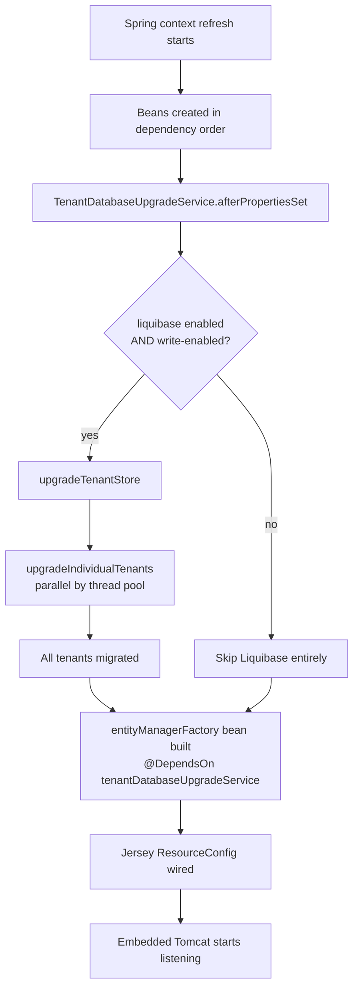
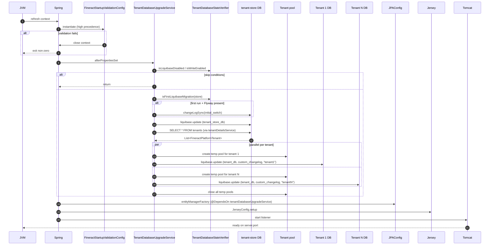

Apache Fineract treats database migration as a *first-class boot step*: before the JPA `EntityManagerFactory` is allowed to open, the tenant-store and every per-tenant schema are upgraded to head. This page documents the full migration pipeline — the master changelog, the changelog families under `tenant-store/` and `tenant/`, the `TenantDatabaseUpgradeService` orchestrator, the parallel per-tenant executor, the Flyway-to-Liquibase migration history, and the `liquibase-only` Spring profile that turns the same JAR into a one-shot migration tool.

## The startup contract

When `ServerApplication.main()` runs in default (web) mode (see [Server Application](/runtime/server-application)), the following sequence must complete *before* any HTTP listener opens:



Two `@DependsOn` declarations make this ordering mandatory:

1. `JPAConfig.entityManagerFactory` carries `@DependsOn("tenantDatabaseUpgradeService")` (file: `fineract-provider/.../config/jpa/JPAConfig.java`) — JPA cannot start before migrations finish.
2. `TenantDatabaseUpgradeService` (file: `fineract-provider/.../service/migration/TenantDatabaseUpgradeService.java`) implements `InitializingBean`, so its work happens inside `afterPropertiesSet()` during context refresh, before any downstream bean depending on it can wire.

The result: there is no "database not migrated" window in a healthy boot. Either migrations succeed and the server comes up, or they fail and the JVM exits with a `RuntimeException("Error while migrating the schema", e)`.

## Master changelog

Every Liquibase run begins at the master file `fineract-provider/src/main/resources/db/changelog/db.changelog-master.xml`. Its shape:

```xml
<databaseChangeLog ...>
    <property name="current_date" value="CURDATE()"      context="mysql"/>
    <property name="current_date" value="CURRENT_DATE"   context="postgresql"/>
    <property name="current_datetime" value="NOW()"/>
    <property name="uuid" value="uuid()"                 context="mysql"/>
    <property name="uuid" value="uuid_generate_v4()"     context="postgresql"/>

    <include file="tenant-store/initial-switch-changelog-tenant-store.xml"
             context="tenant_store_db AND initial_switch"/>
    <include file="tenant-store/changelog-tenant-store.xml"
             context="tenant_store_db AND !initial_switch"/>
    <include file="tenant/initial-switch-changelog-tenant.xml"
             context="tenant_db AND initial_switch"/>
    <include file="tenant/changelog-tenant.xml"
             context="tenant_db AND !initial_switch"/>

    <include file="db/changelog/tenant/module/loan/module-changelog-master.xml"
             context="tenant_db AND !initial_switch"/>
    <include file="db/changelog/tenant/module/investor/module-changelog-master.xml"
             context="tenant_db AND !initial_switch"/>
    <include file="db/changelog/tenant/module/savings/parts/module-changelog-master.xml"
             context="tenant_db AND !initial_switch"/>
    <includeAll path="db/custom-changelog" errorIfMissingOrEmpty="false"
                context="tenant_db AND !initial_switch AND custom_changelog"/>
    <include file="/db/changelog/tenant/module/progressiveloan/module-changelog-master.xml"
             context="tenant_db AND !initial_switch"/>
    <include file="db/changelog/tenant/module/loanorigination/module-changelog-master.xml"
             context="tenant_db AND !initial_switch"/>
    <include file="db/changelog/tenant/module/command/module-changelog-master.xml"
             context="tenant_db AND !initial_switch"/>
    <include file="db/changelog/tenant/module/workingcapitalloan/module-changelog-master.xml"
             context="tenant_db AND !initial_switch"/>

    <include file="tenant/final-changelog-tenant.xml"
             context="tenant_db AND !initial_switch"/>
</databaseChangeLog>
```

Three things to notice:

<CardGroup cols={2}>
  <Card title="Cross-database properties" icon="database">
    The `current_date`, `current_datetime`, and `uuid` properties are defined twice with different `context` values so the same changelog file works on both MySQL and PostgreSQL. Changesets reference `${current_date}` instead of a vendor-specific function.
  </Card>
  <Card title="Liquibase contexts route the run" icon="route">
    Every include is gated by a context expression — `tenant_store_db AND !initial_switch` means "only when the contexts active for this run include both `tenant_store_db` and not `initial_switch`". The orchestrator selects contexts; the changelog stays declarative.
  </Card>
  <Card title="Module changelogs are mounted later" icon="puzzle-piece">
    Feature modules (`loan`, `investor`, `savings`, `progressiveloan`, `loanorigination`, `command`, `workingcapitalloan`) live under `db/changelog/tenant/module/<name>/` and are appended to the tenant changelog. New modules add a single `<include>` line to the master — keeping the existing auto-increment identifiers stable (per the comment in the file).
  </Card>
  <Card title="Custom changelog escape hatch" icon="screwdriver-wrench">
    `<includeAll path="db/custom-changelog" errorIfMissingOrEmpty="false" context="tenant_db AND !initial_switch AND custom_changelog"/>` lets an operator drop their own changesets into a `db/custom-changelog/` directory on the classpath. Activated only when the `custom_changelog` context is set, gated on by `TenantDatabaseUpgradeService` via the `CUSTOM_CHANGELOG_CONTEXT` constant.
  </Card>
</CardGroup>

## Context families

| Context | When it activates | Purpose |
| --- | --- | --- |
| `tenant_store_db` | Set when migrating the tenant store | Routes to `tenant-store/` changelogs only |
| `tenant_db` | Set when migrating a tenant schema | Routes to `tenant/` changelogs + module includes |
| `initial_switch` | Set only on the first Liquibase run for a database that previously used Flyway | Activates the bootstrap-from-Flyway changelogs (next section) |
| `custom_changelog` | Set always during per-tenant migrations | Allows `<includeAll path="db/custom-changelog"/>` if the directory exists |
| `mysql` / `postgresql` | Set by `DatabaseAwareMigrationContextProvider` based on the JDBC connection's database type | Selects the matching cross-database property definitions and any per-vendor changesets |
| `<tenantIdentifier>` | Set on every tenant-specific run | Acts as a context discriminator so Liquibase does not cache changelog parsing across tenants (introduced in Fineract 4.21.0 per source comments) |

The contexts are passed to `ExtendedSpringLiquibase` via the factory:

```java
// fineract-provider/.../service/migration/ExtendedSpringLiquibaseFactory.java
public ExtendedSpringLiquibase create(DataSource dataSource, String... contexts) {
    String databaseContext = databaseAwareMigrationContextProvider.provide();
    return new ExtendedSpringLiquibaseBuilder(liquibaseProperties)
            .withDataSource(dataSource)
            .withResourceLoader(resourceLoader)
            .withContexts(contexts)
            .withContexts(environment.getActiveProfiles())
            .withContext(databaseContext)
            .build();
}
```

Note that **Spring active profiles** are also added as Liquibase contexts (`.withContexts(environment.getActiveProfiles())`) — meaning a changeset can be gated by `context="liquibase-only"` to run only in the migration-only profile, or by `context="test"` to run only in test environments.

## Initial-switch: the Flyway → Liquibase bridge

Fineract used Flyway in older releases. To accommodate operators upgrading from those versions, every changelog family has an `initial-switch` file that handles the transition.

`tenant/initial-switch-changelog-tenant.xml` (file: `fineract-provider/src/main/resources/db/changelog/tenant/initial-switch-changelog-tenant.xml`):

```xml
<databaseChangeLog ...>
    <include file="parts/0001_initial_schema.xml" relativeToChangelogFile="true" context="initial_switch"/>
    <include file="parts/0002_initial_data.xml"   relativeToChangelogFile="true" context="initial_switch"/>
    <!-- The first 2 changelog files are ran with the initial_switch context to handle the Flyway -> Liquibase migration -->
    <!-- The rest of the changelogs will not need this context set -->
</databaseChangeLog>
```

The mechanism, encoded in `TenantDatabaseUpgradeService.applyInitialLiquibase`:

```java
// fineract-provider/.../service/migration/TenantDatabaseUpgradeService.java
private void applyInitialLiquibase(DataSource dataSource, ExtendedSpringLiquibase liquibase, String id,
        Function<DataSource, Boolean> isUpgradableFn) throws LiquibaseException {
    if (databaseStateVerifier.isFlywayPresent(dataSource)) {
        if (isUpgradableFn.apply(dataSource)) {
            log.error("Cannot proceed with upgrading database {}", id);
            log.error("It seems the database doesn't have the latest schema changes applied until the 1.6 release");
            throw new SchemaUpgradeNeededException("Make sure to upgrade to Fineract 1.6 first and then to a newer version");
        }
        log.info("This is the first Liquibase migration for {}. We'll sync the changelog for you and then apply everything else", id);
        liquibase.changeLogSync();
        log.info("Liquibase changelog sync is complete");
    } else {
        liquibase.afterPropertiesSet();
    }
}
```

Logic:

<Steps>
  <Step title="Detect Flyway history">
    `TenantDatabaseStateVerifier.isFlywayPresent(dataSource)` checks for the presence of the `schema_version` table (the table Flyway used to record applied scripts). If absent, the database has never run Fineract or has already migrated past the cutover — no special handling required.
  </Step>
  <Step title="Verify the database is at Flyway head">
    `isTenantOnLatestUpgradableVersion` checks `schema_version` for the exact `(version, script, checksum, success=1)` tuple of the last Flyway script. The checksums are pinned constants (`TENANT_LATEST_FLYWAY_SCRIPT_CHECKSUM = 1102395052` for tenants, similar for tenant-store). If they don't match, the operator must upgrade to Fineract 1.6 first, then to a current release.
  </Step>
  <Step title="changeLogSync the initial switch">
    `ExtendedSpringLiquibase.changeLogSync()` marks the `initial_switch` changesets as applied **without executing them** — they describe the schema that Flyway already produced. Liquibase then "owns" the schema going forward.
  </Step>
  <Step title="Apply remaining changesets normally">
    The subsequent `liquibase.afterPropertiesSet()` call (without `initial_switch` context) runs every changeset added after the Flyway cutover.
  </Step>
</Steps>

`ExtendedSpringLiquibase` (file: `fineract-provider/.../service/migration/ExtendedSpringLiquibase.java`) is a five-line subclass of Spring's `SpringLiquibase` that exposes `changeLogSync()`:

```java
public class ExtendedSpringLiquibase extends SpringLiquibase {
    public void changeLogSync() throws LiquibaseException {
        try (Liquibase liquibase = createLiquibase(getDataSource().getConnection())) {
            liquibase.changeLogSync(getContexts());
        } catch (SQLException e) {
            throw new DatabaseException(e);
        }
    }
}
```

A database that never used Flyway skips all of this and Liquibase simply applies every changelog in order, building the schema from scratch.

## The tenant-store changelog family

Under `fineract-provider/src/main/resources/db/changelog/tenant-store/`:

| File | Role |
| --- | --- |
| `initial-switch-changelog-tenant-store.xml` | Bootstrap path for Flyway→Liquibase cutover |
| `changelog-tenant-store.xml` | Master include list of post-cutover parts |
| `parts/0001_initial_schema.xml` | Creates `tenant_server_connections`, `tenants` |
| `parts/0002_initial_data.xml` | Inserts the default tenant (using `fineract.tenant.*` properties) |
| `parts/0003_reset_postgresql_sequences.xml` | Postgres-only sequence fixes |
| `parts/0004_readonly_database_connection.xml` | Adds `readonly_schema_*` columns to `tenant_server_connections` |
| `parts/0005_jdbc_connection_string.xml` | Adds `schema_connection_parameters` column |
| `parts/0006_drop_retry_parameter_columns.xml` | Removes obsolete retry-tuning columns |
| `parts/0007_encrypt_existing_tenant_passwords.xml` | Encrypts `schema_password` in place via `TenantPasswordEncryptionTask` |
| `parts/0007_x_extend_tenant_ro_passwords.xml` | Widens the read-only password column |
| `parts/0008_encrypt_existing_ro_tenant_passwords.xml` | Encrypts `readonly_schema_password` |
| `parts/0009_set_and_encrypt_ro_if_not_exists.xml` | Backfills + encrypts the RO password when missing |
| `parts/0010_set_datetime_precision.xml` | Sets fractional-second precision uniformly |
| `parts/0011_standardize_character_set_and_collation.xml` | UTF-8 normalization |
| `upgrades/` | Legacy upgrade scripts retained for reference |

The custom encryption tasks are Liquibase `CustomTaskChange` implementations that hook into Spring at runtime:

```java
// fineract-provider/.../service/migration/TenantPasswordEncryptionTask.java
public class TenantPasswordEncryptionTask implements CustomTaskChange, ApplicationContextAware {
    // ...
    TenantPasswordEncryptionTask.databasePasswordEncryptor =
        applicationContext.getBean(DatabasePasswordEncryptor.class);
}
```

This is why `TenantDatabaseUpgradeService` constructor injects the entire list of `CustomTaskChange` beans (the `customTaskChangesForDependencyInjection` field) — Liquibase instantiates `CustomTaskChange` subclasses by classname and Spring needs to wire them before Liquibase runs.

## The tenant changelog family

Under `fineract-provider/src/main/resources/db/changelog/tenant/`:

| File / directory | Role |
| --- | --- |
| `initial-switch-changelog-tenant.xml` | Flyway→Liquibase bootstrap (parts 0001 + 0002) |
| `changelog-tenant.xml` | Master include list of every part 0003 onward |
| `final-changelog-tenant.xml` | Runs *after* all module changelogs (post-init data fixes) |
| `parts/0001_initial_schema.xml` | The full pre-1.6 Fineract schema in one file |
| `parts/0002_initial_data.xml` | Seed data: permissions, roles, codes, currencies |
| `parts/0003_postgresql_specific_initial_data.xml` | Postgres-only seed |
| `parts/0004_camelcase_column_renaming.xml` → `parts/0233_backfill_repayment_start_date_type_on_loan.xml` | **230+ incremental schema-evolution parts**, one per feature change |
| `upgrades/` | Legacy upgrade scripts retained for reference |

233 parts gives a sense of scale — every PR that touches the schema lands as a new `parts/XXXX_*.xml` file. The naming convention is strictly numeric-prefixed so the order matches both filesystem sort and the include order in `changelog-tenant.xml`.

The module-level changelogs (`db/changelog/tenant/module/<name>/`) follow the same convention, scoped to their feature module's tables.

## TenantDatabaseUpgradeService

The orchestrator — file: `fineract-provider/src/main/java/org/apache/fineract/infrastructure/core/service/migration/TenantDatabaseUpgradeService.java`.

```java
@Service
@Slf4j
@RequiredArgsConstructor
public class TenantDatabaseUpgradeService implements InitializingBean {

    public static final String TENANT_STORE_DB_CONTEXT  = "tenant_store_db";
    public static final String INITIAL_SWITCH_CONTEXT   = "initial_switch";
    public static final String TENANT_DB_CONTEXT        = "tenant_db";
    public static final String CUSTOM_CHANGELOG_CONTEXT = "custom_changelog";

    private final TenantDetailsService tenantDetailsService;
    @Qualifier("hikariTenantDataSource")
    private final DataSource tenantDataSource;
    private final FineractProperties fineractProperties;
    private final TenantDatabaseStateVerifier databaseStateVerifier;
    private final ExtendedSpringLiquibaseFactory liquibaseFactory;
    private final TenantDataSourceFactory tenantDataSourceFactory;
    private final Environment environment;

    // DO NOT REMOVE! Required for liquibase custom task initialization
    private final List<CustomTaskChange> customTaskChangesForDependencyInjection;

    static {
        System.setProperty("liquibase.analytics.enabled", "false");
    }
    ...
}
```

Key observations:

- The static initializer **disables Liquibase analytics** before the class is loaded — no telemetry from your migration runs leaves your network.
- `CustomTaskChange` beans are injected as a list purely so Spring instantiates them; the constructor doesn't even keep a reference but instead relies on Spring's bean-graph realization to wire the static fields inside each `CustomTaskChange` subclass.
- The `@Qualifier("hikariTenantDataSource")` ensures the orchestrator uses the *tenant-store* pool — see [Spring Boot Configuration](/runtime/spring-boot-configuration#hikaricpconfig).

### afterPropertiesSet — the entry point

```java
@Override
public void afterPropertiesSet() throws Exception {
    if (notLiquibaseOnlyMode()) {
        if (databaseStateVerifier.isLiquibaseDisabled() || !fineractProperties.getMode().isWriteEnabled()) {
            log.warn("Liquibase is disabled. Not upgrading any database.");
            if (!fineractProperties.getMode().isWriteEnabled()) {
                log.warn("Liquibase is disabled because the current instance is configured as a non-write Fineract instance");
            }
            return;
        }
    }
    try {
        Scope.setScopeManager(new ThreadLocalScopeManager());
        upgradeTenantStore();
        upgradeIndividualTenants();
    } catch (LiquibaseException e) {
        throw new RuntimeException("Error while migrating the schema", e);
    }
}
```

Three conditional skips:

1. **`spring.liquibase.enabled=false`** (read via `LiquibaseProperties` inside `databaseStateVerifier.isLiquibaseDisabled()`) — operator disables migrations entirely.
2. **`fineract.mode.write-enabled=false`** — see [Instance Mode](/runtime/instance-mode). Read-only pods skip migrations because they should not write.
3. **In `liquibase-only` profile** the check is **inverted** — `notLiquibaseOnlyMode()` returns false so the two disable checks are bypassed and migrations always run. The whole point of that profile is to migrate.

`Scope.setScopeManager(new ThreadLocalScopeManager())` switches Liquibase to a thread-local scope — required because `upgradeIndividualTenants` runs migrations concurrently across tenants and the default Liquibase scope is process-global.

### upgradeTenantStore

```java
private void upgradeTenantStore() throws LiquibaseException {
    log.info("Upgrading tenant store DB at {}:{}",
             fineractProperties.getTenant().getHost(), fineractProperties.getTenant().getPort());
    logTenantStoreDetails();
    if (databaseStateVerifier.isFirstLiquibaseMigration(tenantDataSource)) {
        ExtendedSpringLiquibase liquibase = liquibaseFactory.create(
                tenantDataSource, TENANT_STORE_DB_CONTEXT, INITIAL_SWITCH_CONTEXT);
        applyInitialLiquibase(tenantDataSource, liquibase, "tenant store",
                (ds) -> !databaseStateVerifier.isTenantStoreOnLatestUpgradableVersion(ds));
    }
    SpringLiquibase liquibase = liquibaseFactory.create(tenantDataSource, TENANT_STORE_DB_CONTEXT);
    liquibase.afterPropertiesSet();
    log.info("Tenant store upgrade finished");
}
```

`isFirstLiquibaseMigration` checks for the absence of `DATABASECHANGELOG` (Liquibase's audit table). If absent, this is the first-ever Liquibase run — go through the initial-switch flow with the `initial_switch` context. The follow-up call without `initial_switch` then applies parts 0003 onward.

### upgradeIndividualTenants

```java
private void upgradeIndividualTenants() {
    log.info("Upgrading all tenants");
    List<FineractPlatformTenant> tenants = tenantDetailsService.findAllTenants();
    List<Future<String>> futures = new ArrayList<>();
    final ThreadPoolTaskExecutor tenantUpgradeThreadPoolTaskExecutor = createTenantUpgradeThreadPoolTaskExecutor();
    if (isNotEmpty(tenants)) {
        for (FineractPlatformTenant tenant : tenants) {
            futures.add(tenantUpgradeThreadPoolTaskExecutor.submit(() -> {
                upgradeIndividualTenant(tenant);
                return tenant.getName();
            }));
        }
    }
    List<Exception> exceptions = new ArrayList<>();
    try {
        for (Future<String> future : futures) {
            future.get();
        }
    } catch (InterruptedException | ExecutionException exception) {
        exceptions.add(exception);
    } finally {
        tenantUpgradeThreadPoolTaskExecutor.shutdown();
    }
    if (exceptions.isEmpty()) {
        log.info("Tenant upgrades have successfully finished");
    } else {
        exceptions.forEach(e -> log.error("Exception: ", e));
        throw new RuntimeException("Tenant upgrades had exceptions");
    }
}
```

Concurrency is governed by `fineract.task-executor.tenant-upgrade-task-executor-*`:

```properties
fineract.task-executor.tenant-upgrade-task-executor-core-pool-size=1
fineract.task-executor.tenant-upgrade-task-executor-max-pool-size=1
fineract.task-executor.tenant-upgrade-task-executor-queue-capacity=${FINERACT_TENANT_UPGRADE_TASK_EXECUTOR_QUEUE_CAPACITY:100}
```

By default core=max=1 (sequential), but operators with N tenants can bump these to parallelize. The pool is created on demand and shut down after the loop.

### upgradeIndividualTenant

```java
private void upgradeIndividualTenant(FineractPlatformTenant tenant) throws LiquibaseException {
    try {
        ThreadLocalContextUtil.setTenant(tenant);
        log.info("Upgrade for tenant {} has started", tenant.getTenantIdentifier());
        try (HikariDataSource tenantDataSource = tenantDataSourceFactory.create(tenant)) {
            if (databaseStateVerifier.isFirstLiquibaseMigration(tenantDataSource)) {
                ExtendedSpringLiquibase liquibase = liquibaseFactory.create(tenantDataSource,
                        TENANT_DB_CONTEXT, CUSTOM_CHANGELOG_CONTEXT, INITIAL_SWITCH_CONTEXT,
                        tenant.getTenantIdentifier());
                applyInitialLiquibase(tenantDataSource, liquibase, tenant.getTenantIdentifier(),
                        (ds) -> !databaseStateVerifier.isTenantOnLatestUpgradableVersion(ds));
            }
            SpringLiquibase tenantLiquibase = liquibaseFactory.create(tenantDataSource,
                    TENANT_DB_CONTEXT, CUSTOM_CHANGELOG_CONTEXT, tenant.getTenantIdentifier());
            tenantLiquibase.afterPropertiesSet();
            log.info("Upgrade for tenant {} has finished", tenant.getTenantIdentifier());
        } catch (Exception e) {
            throw new RuntimeException("Exception while upgrading tenant " + tenant.getTenantIdentifier(), e);
        }
    } finally {
        ThreadLocalContextUtil.reset();
    }
}
```

Per-tenant steps:

1. Set `ThreadLocalContextUtil.setTenant(tenant)` so any `CustomTaskChange` accessing the current tenant works.
2. Open a *fresh* `HikariDataSource` for the tenant (try-with-resources will close it when done — this pool is **not** reused for runtime traffic).
3. Run the initial-switch path if `DATABASECHANGELOG` is missing.
4. Run the main path with contexts `tenant_db`, `custom_changelog`, and the tenant identifier itself.
5. Reset the `ThreadLocalContextUtil` on the way out so the executor thread is clean for the next tenant.

The source comment explains the tenant-identifier context:

> *"Good to know: Each tenant's identifier is provided as a context variable to avoid caching of the liquibase migration (it was introduced as part of v4.21.0)."*

Without the per-tenant context discriminator, Liquibase would parse the changelog tree once and reuse it for every tenant — fine for identical schemas, but problematic if `custom-changelog` files differ in scope.

## Liquibase-only mode

The same JAR can be run as a one-shot migration utility by activating the `liquibase-only` Spring profile. The two configurations involved:

### FineractLiquibaseOnlyApplicationConfiguration

File: `fineract-provider/src/main/java/org/apache/fineract/infrastructure/core/boot/FineractLiquibaseOnlyApplicationConfiguration.java`:

```java
@Conditional(FineractLiquibaseOnlyApplicationCondition.class)
@EnableConfigurationProperties({ FineractProperties.class, LiquibaseProperties.class })
@Import({ HikariCpConfig.class, JdbcConfig.class })
@ComponentScan(basePackages = {
        "org.apache.fineract.infrastructure.core.service.migration",
        "org.apache.fineract.infrastructure.core.service.database",
        "org.apache.fineract.infrastructure.core.service.tenant" })
public class FineractLiquibaseOnlyApplicationConfiguration implements InitializingBean {
    @Override
    public void afterPropertiesSet() throws Exception {
        log.warn("Fineract is running in Liquibase only mode");
    }
}
```

Activated by `FineractLiquibaseOnlyApplicationCondition` (file: `fineract-core/.../condition/FineractLiquibaseOnlyApplicationCondition.java`) when the `liquibase-only` profile is in active profiles — and mutually exclusive with `FineractWebApplicationConfiguration` (see [Server Application](/runtime/server-application)).

The narrow component scan is the entire point: only three packages — exactly enough to read tenants, build pools, and run migrations. No Jersey, no Spring Security, no JPA, no scheduler.

### application-liquibase-only.properties

File: `fineract-provider/src/main/resources/application-liquibase-only.properties`:

```properties
spring.main.web-application-type=none
```

A single line. `web-application-type=none` tells Spring Boot not to start any HTTP listener — the JVM will exit as soon as the context refresh (which includes `TenantDatabaseUpgradeService.afterPropertiesSet()`) completes.

### Running it

```bash
SPRING_PROFILES_ACTIVE=liquibase-only java -jar fineract-provider.jar
```

Use this:

- In a Kubernetes init container to upgrade schemas before the application Pods start.
- In a one-shot CI job before integration tests run.
- During blue/green deployments to upgrade the database without rolling restart of the API Pods.

`TenantDatabaseUpgradeService.notLiquibaseOnlyMode()` returns `false`, which **bypasses** the `isLiquibaseDisabled()` and `isWriteEnabled()` checks. Migrations always run in this mode, regardless of the `fineract.mode.*` flags.

## FineractStartupValidationConfig — guarding the boot

A safety net runs in parallel — `FineractStartupValidationConfig` (file: `fineract-provider/.../config/FineractStartupValidationConfig.java`, see [Spring Boot Configuration](/runtime/spring-boot-configuration#fineractstartupvalidationconfig)) is annotated `@Order(Ordered.HIGHEST_PRECEDENCE)` and closes the `ApplicationContext` if validation fails:

```java
@Override
public void afterPropertiesSet() throws Exception {
    terminateApplication();
}

private void terminateApplication() {
    log.error("The application startup fails on validations. Please check the log above for the details");
    ((ConfigurableApplicationContext) applicationContext).close();
}
```

It is activated by `FineractValidationCondition` (an `AnyNestedCondition`) which OR's together the mode validation, partitioned-job validation, remote-job-handler validation, and external-event-config validation. If any of those fire, the JVM exits before `TenantDatabaseUpgradeService` even gets a chance to corrupt the database with a partial migration.

## Legacy SQL artifacts

For historical context and bootstrapping, the repository also ships *raw SQL* files in `fineract-db/`:

| Path | Purpose |
| --- | --- |
| `fineract-db/mifospltaform-tenants-first-time-install.sql` | Bare tenant-store seed SQL (legacy from the Mifos era) |
| `fineract-db/old-schema-files/` | Pre-Liquibase / pre-Flyway DDL — kept for archeology, not used by the runtime |
| `fineract-db/multi-tenant-demo-backups/` | Sample tenant database dumps (`default-demo`, `bare-bones-demo`, `latam-demo`, `ceda`, `gk-maarg`, `bk_mifostenant_default.sql`) |

These are not on the classpath of `fineract-provider` and are not referenced by any Liquibase changelog. Modern installations rely entirely on the Liquibase tree described above; the SQL files are useful only if you want to bring up a database the way pre-1.0 Mifos / Fineract used to.

<Tip>
For a fresh deployment, do **not** load any SQL from `fineract-db/`. Start with an empty database, configure `spring.datasource.hikari.*` to point at it, and let `TenantDatabaseUpgradeService` build the schema from scratch — that path is guaranteed to be at head.
</Tip>

## End-to-end startup sequence



In the `liquibase-only` profile, steps 17-21 are skipped — the context refresh terminates after step 16 because `web-application-type=none`.

## Operational checklist

<CardGroup cols={2}>
  <Card title="Migrations are idempotent" icon="rotate">
    Liquibase's `DATABASECHANGELOG` table ensures each changeset runs once. Restarting a half-failed pod is safe.
  </Card>
  <Card title="Parallel tenants need pool budget" icon="gauge">
    Each parallel tenant migration opens a temporary Hikari pool. With N parallel tenants and `minimum-idle=10`, the database briefly hosts 10×N connections. Tune `tenant-upgrade-task-executor-max-pool-size` accordingly.
  </Card>
  <Card title="Use liquibase-only for production rollouts" icon="rocket">
    Run a `liquibase-only` Job to migrate, then roll new application Pods that have migrations effectively disabled (read-only or with `spring.liquibase.enabled=false`). Decouples schema change from rolling deploys.
  </Card>
  <Card title="Custom changesets go in db/custom-changelog/" icon="folder-plus">
    The `<includeAll path="db/custom-changelog" errorIfMissingOrEmpty="false">` line in the master changelog is the official extension point. Put your custom XML files there; the `custom_changelog` context is set by `TenantDatabaseUpgradeService` automatically on per-tenant runs.
  </Card>
</CardGroup>

## File map

```mermaid
flowchart TB
    subgraph properties
      AP[application.properties<br/>spring.liquibase.*]
      ALP[application-liquibase-only.properties]
    end
    subgraph configs
      WAC[FineractWebApplicationConfiguration]
      LAC[FineractLiquibaseOnlyApplicationConfiguration]
      JPA[JPAConfig @DependsOn]
      FSV[FineractStartupValidationConfig]
    end
    subgraph orchestrator
      TUS[TenantDatabaseUpgradeService]
      DSV[TenantDatabaseStateVerifier]
      ESL[ExtendedSpringLiquibase + Builder + Factory]
      DAMC[DatabaseAwareMigrationContextProvider]
      TDF[TenantDataSourceFactory]
    end
    subgraph custom-tasks
      TPE[TenantPasswordEncryptionTask]
      TPER[TenantReadOnlyPasswordEncryptionTask]
    end
    subgraph changelogs
      MAS[db.changelog-master.xml]
      TS[tenant-store/]
      T[tenant/]
      MOD[tenant/module/loan|investor|savings|...]
      CUST[db/custom-changelog/]
    end
    subgraph legacy
      FDB[fineract-db/*.sql]
    end
    AP --> WAC
    ALP --> LAC
    WAC --> TUS
    LAC --> TUS
    TUS --> DSV
    TUS --> ESL
    TUS --> TDF
    TUS --> TPE
    TUS --> TPER
    ESL --> MAS
    DAMC --> ESL
    MAS --> TS
    MAS --> T
    MAS --> MOD
    MAS --> CUST
    TUS -. precedes .-> JPA
    FSV -. may close context .-> TUS
```

## Where to read next

- [Server Application](/runtime/server-application) — the profile-driven dispatch that picks `FineractWebApplicationConfiguration` or `FineractLiquibaseOnlyApplicationConfiguration`.
- [Spring Boot Configuration](/runtime/spring-boot-configuration#fineractstartupvalidationconfig) — the validation guard that may close the context before migrations run.
- [Multi-Tenancy](/runtime/multi-tenancy) — the tenant-store schema and `TenantDetailsService` that drives `upgradeIndividualTenants`.
- [Instance Mode](/runtime/instance-mode) — why `fineract.mode.write-enabled=false` skips Liquibase on read replicas.
- [Static Weaving and JPA](/runtime/static-weaving-and-jpa) — JPA's `@DependsOn("tenantDatabaseUpgradeService")` keeps EntityManager construction behind migrations.
