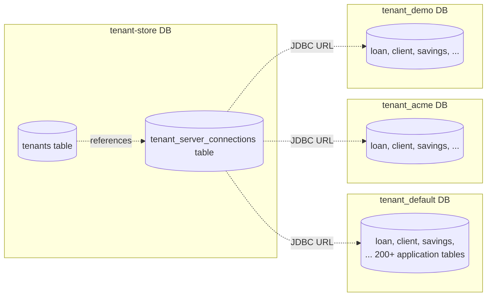

Apache Fineract is multi-tenant by design: a single deployment can host **N** financial institutions, each with its **own database schema**, while a separate **tenant-store** database holds the metadata that maps a tenant identifier to its connection details. This page walks the full chain: the `Fineract-Platform-TenantId` HTTP header, the `TenantDetailsService` lookup, the `RoutingDataSource` selector, the per-tenant Hikari pool cache, and the read-only replica swap when the JVM is in read-only mode.

## The two-database model



The two databases serve different purposes:

| Database | Liquibase context | Holds | Lifecycle |
| --- | --- | --- | --- |
| **tenant-store** | `tenant_store_db` | `tenants`, `tenant_server_connections` | Created once; new tenants are inserted, never re-bootstrapped. |
| **per-tenant schema** | `tenant_db` | All application data (loans, clients, savings, accounting, jobs, ...) | One per tenant; each carries the full Fineract schema independently. |

The split is what makes horizontal partitioning easy: you can run different tenants on entirely different DB servers — Postgres for one, MySQL/MariaDB for another — by varying the `schema_server`, `schema_server_port`, and `schema_connection_parameters` columns in the `tenant_server_connections` row.

## Tenant configuration: properties

The default tenant ships baked into `application.properties` (lines 44-65). At first boot Liquibase inserts a tenant row using these values:

```properties
# fineract-provider/src/main/resources/application.properties (excerpts, lines 44-65)
fineract.tenant.host=${FINERACT_DEFAULT_TENANTDB_HOSTNAME:localhost}
fineract.tenant.port=${FINERACT_DEFAULT_TENANTDB_PORT:3306}
fineract.tenant.username=${FINERACT_DEFAULT_TENANTDB_UID:root}
fineract.tenant.password=${FINERACT_DEFAULT_TENANTDB_PWD:mysql}
fineract.tenant.parameters=${FINERACT_DEFAULT_TENANTDB_CONN_PARAMS:}
fineract.tenant.timezone=${FINERACT_DEFAULT_TENANTDB_TIMEZONE:Asia/Kolkata}
fineract.tenant.identifier=${FINERACT_DEFAULT_TENANTDB_IDENTIFIER:default}
fineract.tenant.name=${FINERACT_DEFAULT_TENANTDB_NAME:fineract_default}
fineract.tenant.description=${FINERACT_DEFAULT_TENANTDB_DESCRIPTION:Default Demo Tenant}
fineract.tenant.master-password=${FINERACT_DEFAULT_TENANTDB_MASTER_PASSWORD:fineract}
fineract.tenant.encrytion=${FINERACT_DEFAULT_TENANTDB_ENCRYPTION:"AES/CBC/PKCS5Padding"}
fineract.tenant.read-only-host=${FINERACT_DEFAULT_TENANTDB_RO_HOSTNAME:}
fineract.tenant.read-only-port=${FINERACT_DEFAULT_TENANTDB_RO_PORT:}
fineract.tenant.read-only-username=${FINERACT_DEFAULT_TENANTDB_RO_UID:}
fineract.tenant.read-only-password=${FINERACT_DEFAULT_TENANTDB_RO_PWD:}
fineract.tenant.read-only-parameters=${FINERACT_DEFAULT_TENANTDB_RO_CONN_PARAMS:}
fineract.tenant.read-only-name=${FINERACT_DEFAULT_TENANTDB_RO_NAME:}
fineract.tenant.config.min-pool-size=${FINERACT_CONFIG_MIN_POOL_SIZE:-1}
fineract.tenant.config.max-pool-size=${FINERACT_CONFIG_MAX_POOL_SIZE:-1}
fineract.tenant.config.rounding-mode=${FINERACT_CONFIG_ROUNDING_MODE:6}
```

These bind to `FineractTenantProperties` in `fineract-core/src/main/java/org/apache/fineract/infrastructure/core/config/FineractProperties.java` lines 96-117:

```java
@Getter @Setter
public static class FineractTenantProperties {
    private String host;
    private Integer port;
    private String username;
    private String password;
    private String parameters;
    private String timezone;
    private String identifier;
    private String name;
    private String description;
    private String masterPassword;
    private String encryption;
    private String readOnlyHost;
    private Integer readOnlyPort;
    private String readOnlyUsername;
    private String readOnlyPassword;
    private String readOnlyParameters;
    private String readOnlyName;
    private FineractConfigProperties config;
}
```

| Property tree | Used for |
| --- | --- |
| `fineract.tenant.host / port / username / password / parameters / name` | The **primary** (writable) connection details for the default tenant's schema. |
| `fineract.tenant.identifier` | The `tenantIdentifier` string clients send in the `Fineract-Platform-TenantId` header. |
| `fineract.tenant.timezone` | Default tenant timezone, surfaces in scheduled-job timing and audit timestamps. |
| `fineract.tenant.master-password` + `fineract.tenant.encrytion` (sic) | Used by `DatabasePasswordEncryptor` to encrypt the `schema_password` column at rest; the typo `encrytion` matches the property key in `application.properties`. |
| `fineract.tenant.read-only-*` | Optional replica connection details; used when the JVM runs in read-only mode (see [Instance Mode](/runtime/instance-mode)). |
| `fineract.tenant.config.min-pool-size` / `max-pool-size` | Per-tenant Hikari pool sizing override (`-1` means "use defaults"). |
| `fineract.tenant.config.rounding-mode` | Numeric rounding mode for monetary calculations (6 = HALF_UP). |

The two-tier model is reflected by the bound class structure too — `FineractConfigProperties` is nested inside `FineractTenantProperties`:

```java
@Getter @Setter
public static class FineractConfigProperties {
    private int minPoolSize;
    private int maxPoolSize;
    public boolean isMinPoolSizeSet() { return minPoolSize != -1; }
    public boolean isMaxPoolSizeSet() { return maxPoolSize != -1; }
}
```

<Note>
The actual Hikari pool that connects to the **tenant-store** (not the tenant schema) is configured separately via `spring.datasource.hikari.*` and instantiated by `HikariCpConfig` — see [Spring Boot Configuration](/runtime/spring-boot-configuration#hikaricpconfig). The `fineract.tenant.*` keys above are about the **default tenant's own schema**, plus encryption / pooling defaults shared by all tenants.
</Note>

## Tenant model classes

### FineractPlatformTenant

The runtime representation of a tenant — file: `fineract-core/src/main/java/org/apache/fineract/infrastructure/core/domain/FineractPlatformTenant.java`:

```java
@Jacksonized
@Builder
@EqualsAndHashCode
@RequiredArgsConstructor
@Getter
public class FineractPlatformTenant implements Serializable {
    private final Long id;
    private final String tenantIdentifier;
    private final String name;
    private final String timezoneId;
    private final FineractPlatformTenantConnection connection;
}
```

Simple, immutable, serializable — important because instances are placed into Spring's `tenantsById` cache (see below) and passed across async-event boundaries.

### FineractPlatformTenantConnection

The connection-info side of the model — file: `fineract-core/src/main/java/org/apache/fineract/infrastructure/core/domain/FineractPlatformTenantConnection.java`:

```java
@Getter @Builder @AllArgsConstructor @Jacksonized
public class FineractPlatformTenantConnection implements Serializable {
    private final Long connectionId;
    private final String schemaServer;
    private final String schemaServerPort;
    private final String schemaConnectionParameters;
    private final String schemaUsername;
    private final String schemaPassword;
    private final String schemaName;
    // ... read-only mirror fields ...
    private final String readOnlySchemaServer;
    private final String readOnlySchemaServerPort;
    private final String readOnlySchemaName;
    private final String readOnlySchemaUsername;
    private final String readOnlySchemaPassword;
    private final String readOnlySchemaConnectionParameters;
    // ... legacy pool tuning fields ...
    private final boolean autoUpdateEnabled;
    private final int initialSize;
    private final long validationInterval;
    private final int maxActive;
    private final int minIdle;
    // ...
}
```

The class also carries `toJdbcUrl(...)` and `toProtocol(DataSource)` static helpers used by `DataSourcePerTenantServiceFactory` (referenced via `import static` near the top of that class).

## Tenant-store schema and changelogs

The tenant-store schema is bootstrapped by Liquibase changelogs under `fineract-provider/src/main/resources/db/changelog/tenant-store/`:

```
tenant-store/
├── changelog-tenant-store.xml          (master include list)
├── initial-switch-changelog-tenant-store.xml
├── parts/
│   ├── 0001_initial_schema.xml         (creates tenant_server_connections + tenants)
│   ├── 0002_initial_data.xml           (inserts the default tenant)
│   ├── 0003_reset_postgresql_sequences.xml
│   ├── 0004_readonly_database_connection.xml
│   ├── 0005_jdbc_connection_string.xml
│   ├── 0006_drop_retry_parameter_columns.xml
│   ├── 0007_encrypt_existing_tenant_passwords.xml
│   ├── 0007_x_extend_tenant_ro_passwords.xml
│   ├── 0008_encrypt_existing_ro_tenant_passwords.xml
│   ├── 0009_set_and_encrypt_ro_if_not_exists.xml
│   ├── 0010_set_datetime_precision.xml
│   └── 0011_standardize_character_set_and_collation.xml
└── upgrades/
```

The master changelog at `fineract-provider/src/main/resources/db/changelog/db.changelog-master.xml` dispatches to these via Liquibase **contexts**:

```xml
<include file="tenant-store/initial-switch-changelog-tenant-store.xml" ... context="tenant_store_db AND initial_switch"/>
<include file="tenant-store/changelog-tenant-store.xml"               ... context="tenant_store_db AND !initial_switch"/>
<include file="tenant/initial-switch-changelog-tenant.xml"            ... context="tenant_db AND initial_switch"/>
<include file="tenant/changelog-tenant.xml"                           ... context="tenant_db AND !initial_switch"/>
```

`TenantDatabaseUpgradeService` (see [Liquibase and Startup](/runtime/liquibase-and-startup)) selects the `tenant_store_db` context when upgrading the tenant store, and the `tenant_db` context once per tenant when upgrading individual schemas.

The two key tables created by `0001_initial_schema.xml`:

| Table | Purpose |
| --- | --- |
| `tenant_server_connections` | One row per *connection target*; holds JDBC host/port/user/encrypted-password, plus the read-only replica mirror columns and legacy pool-tuning columns. |
| `tenants` | One row per *logical tenant*; references `tenant_server_connections.id` via two foreign keys (`oltp_id` for OLTP traffic, `report_id` for reporting traffic). |

This `tenant → connection` indirection means N tenants can share one DB cluster (with different schemas) or each have a dedicated cluster — the connection row encodes the physical destination, the tenant row holds identity.

## Tenant lookup: TenantDetailsService

The interface — file: `fineract-core/src/main/java/org/apache/fineract/infrastructure/core/service/tenant/TenantDetailsService.java`:

```java
public interface TenantDetailsService {
    FineractPlatformTenant loadTenantById(String tenantId);
    List<FineractPlatformTenant> findAllTenants();
}
```

The implementation — file: `fineract-core/.../service/tenant/JdbcTenantDetailsService.java`:

```java
@Service("tenantDetailsService")
public class JdbcTenantDetailsService implements TenantDetailsService {
    private final JdbcTemplate jdbcTemplate;

    @Autowired
    public JdbcTenantDetailsService(@Qualifier("hikariTenantDataSource") final DataSource dataSource) {
        this.jdbcTemplate = new JdbcTemplate(dataSource);
    }

    @Override
    @Cacheable(value = "tenantsById")
    public FineractPlatformTenant loadTenantById(final String tenantIdentifier) {
        if (isBlank(tenantIdentifier)) {
            throw new IllegalArgumentException("tenantIdentifier cannot be blank");
        }
        try {
            final TenantMapper rm = new TenantMapper(false);
            final String sql = "select " + rm.schema() + " where t.identifier = ?";
            return this.jdbcTemplate.queryForObject(sql, rm, new Object[] { tenantIdentifier });
        } catch (final EmptyResultDataAccessException e) {
            throw new InvalidTenantIdentifierException("The tenant identifier: " + tenantIdentifier + " is not valid.", e);
        }
    }

    @Override
    public List<FineractPlatformTenant> findAllTenants() {
        final TenantMapper rm = new TenantMapper(false);
        final String sql = "select  " + rm.schema();
        return this.jdbcTemplate.query(sql, rm);
    }
}
```

Two important details:

1. **`@Cacheable("tenantsById")`** — results are cached. The cache name `tenantsById` is one of the names discovered by `CacheConfig`'s classpath scan (see [Spring Boot Configuration](/runtime/spring-boot-configuration#cache-sub-package)). The `TransactionBoundCacheManager` clears it at every transaction boundary, so updates to the tenant row are visible immediately.
2. **`@Qualifier("hikariTenantDataSource")`** — the JDBC template uses the tenant-store pool, not the routing data source. This breaks an infinite recursion: resolving a tenant must not itself depend on a tenant being resolved.

The SQL is built by `TenantMapper` (file: `fineract-core/.../service/tenant/TenantMapper.java`), which assembles a join between the `tenants` table aliased `t` and `tenant_server_connections` aliased `ts`, selecting either `t.oltp_id = ts.id` (default) or `t.report_id = ts.id` (when `isReport=true` is passed to the mapper constructor — used for Pentaho report execution that may go to a different replica).

`InvalidTenantIdentifierException` produces a 401 via `InvalidTenantIdentifierExceptionMapper` (see [Jersey and JAX-RS](/runtime/jersey-and-jax-rs#exception-mappers)).

## Resolving a tenant from the request

The HTTP-level resolver is `TenantAwareBasicAuthenticationFilter` — file: `fineract-security/src/main/java/org/apache/fineract/infrastructure/security/filter/TenantAwareBasicAuthenticationFilter.java`. It is inserted *before* Spring Security's `SecurityContextHolderFilter` by `SecurityConfig` (see [Spring Boot Configuration](/runtime/spring-boot-configuration#securityconfig)).

The relevant logic (lines 100-130):

```java
private static final String TENANT_ID_REQUEST_HEADER = "Fineract-Platform-TenantId";

ThreadLocalContextUtil.reset();
if ("OPTIONS".equalsIgnoreCase(request.getMethod())) {
    filterChain.doFilter(request, response);                    // preflight CORS
} else {
    String tenantIdentifier = request.getHeader(TENANT_ID_REQUEST_HEADER);
    if (StringUtils.isBlank(tenantIdentifier)) {
        tenantIdentifier = request.getParameter("tenantIdentifier");    // query-string fallback
    }
    if (tenantIdentifier == null) {
        throw new InvalidTenantIdentifierException("No tenant identifier found: ...");
    }
    boolean isReportRequest = pathInfo != null && pathInfo.contains("report");
    FineractPlatformTenant tenant = basicAuthTenantDetailsService.loadTenantById(tenantIdentifier, isReportRequest);
    ThreadLocalContextUtil.setTenant(tenant);
    // business dates, auth token, ehcache toggle ...
    super.doFilterInternal(request, response, filterChain);
}
```

Resolution order:

1. **HTTP header `Fineract-Platform-TenantId`** (canonical).
2. **Query parameter `tenantIdentifier`** (fallback — useful for browser-direct links to reports).
3. If neither is present, throw `InvalidTenantIdentifierException` → 401.

If the path contains `report`, the resolver loads the *reporting* connection (`isReport=true`) — the `TenantMapper` joins through `t.report_id` instead of `t.oltp_id`. This is how Pentaho report queries can be sent to a different database than OLTP traffic.

The resolved `FineractPlatformTenant` is stashed in a `ThreadLocal` by `ThreadLocalContextUtil.setTenant(tenant)` (file: `fineract-core/src/main/java/org/apache/fineract/infrastructure/core/service/ThreadLocalContextUtil.java`):

```java
private static final ThreadLocal<FineractPlatformTenant> tenantContext = new ThreadLocal<>();

public static FineractPlatformTenant getTenant() { return tenantContext.get(); }
public static void setTenant(final FineractPlatformTenant tenant) { tenantContext.set(tenant); }
public static void clearTenant() { tenantContext.remove(); }
```

`ThreadLocalContextUtil` is the runtime backbone — every later component reads the tenant from this `ThreadLocal`. `SpringConfig`'s switch to `MODE_INHERITABLETHREADLOCAL` for the security context (see [Spring Boot Configuration](/runtime/spring-boot-configuration#springconfig)) ensures the parent thread's tenant propagates to async worker threads.

## RoutingDataSource: the per-request DataSource

Spring beans inject **one** `DataSource` (`@Primary`, bean name `dataSource`), but at runtime each call must hit the **current tenant's** database. The trick is `RoutingDataSource` — file: `fineract-core/src/main/java/org/apache/fineract/infrastructure/core/service/database/RoutingDataSource.java`:

```java
@Service(value = "dataSource")
@Primary
public class RoutingDataSource extends AbstractDataSource {

    @Autowired
    private RoutingDataSourceServiceFactory dataSourceServiceFactory;

    @Override
    public Connection getConnection() throws SQLException {
        return determineTargetDataSource().getConnection();
    }

    public DataSource determineTargetDataSource() {
        return this.dataSourceServiceFactory.determineDataSourceService().retrieveDataSource();
    }

    @Override
    public Connection getConnection(final String username, final String password) throws SQLException {
        return determineTargetDataSource().getConnection(username, password);
    }
}
```

Every `getConnection()` re-evaluates which target pool to use. There is no caching at this layer — caching is delegated to the per-tenant pool factory.

### RoutingDataSourceServiceFactory

The factory picks between two routing strategies based on a *different* ThreadLocal (`contextHolder`):

```java
// fineract-core/.../service/database/RoutingDataSourceServiceFactory.java
@Component
public class RoutingDataSourceServiceFactory {
    @Autowired
    private ApplicationContext applicationContext;

    public RoutingDataSourceService determineDataSourceService() {
        String serviceName = "tomcatJdbcDataSourcePerTenantService";
        if (ThreadLocalContextUtil.CONTEXT_TENANTS.equalsIgnoreCase(ThreadLocalContextUtil.getDataSourceContext())) {
            serviceName = "dataSourceForTenants";
        }
        return this.applicationContext.getBean(serviceName, RoutingDataSourceService.class);
    }
}
```

| `ThreadLocalContextUtil.getDataSourceContext()` | Resolves to bean | What it returns |
| --- | --- | --- |
| `null` or any other value | `tomcatJdbcDataSourcePerTenantService` | The current tenant's schema pool. |
| `"tenants"` (`CONTEXT_TENANTS`) | `dataSourceForTenants` | The tenant-store pool itself. |

The second case lets code temporarily switch into "I want to query the tenant-store, not a tenant" mode — used by `TenantDatabaseUpgradeService` while resolving the tenant list and by management endpoints that operate on the tenant registry.

### TomcatJdbcDataSourcePerTenantService

This is the work-horse — file: `fineract-core/src/main/java/org/apache/fineract/infrastructure/core/service/database/TomcatJdbcDataSourcePerTenantService.java`. Despite the legacy name (`TomcatJdbc...`) it actually uses Hikari now.

```java
@Service
@RequiredArgsConstructor
public class TomcatJdbcDataSourcePerTenantService
        implements RoutingDataSourceService, ApplicationListener<ContextRefreshedEvent> {

    private static final Map<Long, DataSource> TENANT_TO_DATA_SOURCE_MAP = new ConcurrentHashMap<>();
    @Qualifier("hikariTenantDataSource")
    private final DataSource tenantDataSource;       // tenant-store default
    private final TenantDetailsService tenantDetailsService;
    private final DataSourcePerTenantServiceFactory dataSourcePerTenantServiceFactory;

    @Override
    public DataSource retrieveDataSource() {
        DataSource actualDataSource = this.tenantDataSource;
        final FineractPlatformTenant tenant = ThreadLocalContextUtil.getTenant();
        if (tenant != null) {
            final FineractPlatformTenantConnection tenantConnection = tenant.getConnection();
            Long tenantConnectionKey = tenantConnection.getConnectionId();
            actualDataSource = TENANT_TO_DATA_SOURCE_MAP.computeIfAbsent(tenantConnectionKey,
                    (key) -> dataSourcePerTenantServiceFactory.createNewDataSourceFor(tenant, tenantConnection));
        }
        // ... rounding-mode initialization on first hit ...
        return actualDataSource;
    }

    @Override
    public void onApplicationEvent(ContextRefreshedEvent event) {
        // Pre-warm pools at startup for every tenant
        final List<FineractPlatformTenant> allTenants = tenantDetailsService.findAllTenants();
        for (final FineractPlatformTenant tenant : allTenants) {
            initializeDataSourceConnection(tenant);
        }
    }
}
```

Three behaviors stand out:

1. **Per-`connectionId` cache** — pools are keyed by `connectionId` (the `tenant_server_connections.id`), not by tenant id. Multiple tenants sharing the same `tenant_server_connections` row therefore share a Hikari pool.
2. **Pre-warming at boot** — `onApplicationEvent(ContextRefreshedEvent)` iterates every tenant and forces pool creation, so the first request does not pay the connect-handshake cost.
3. **Fallback to tenant-store** — if `ThreadLocalContextUtil.getTenant()` is null (the resolver did not run), `retrieveDataSource` returns the tenant-store pool. This is rarely the right answer for production traffic, but it prevents NPEs in startup paths.

### DataSourcePerTenantServiceFactory

Actually constructs the pool — file: `fineract-core/.../service/database/DataSourcePerTenantServiceFactory.java`. The decision tree (lines 60-100):

<Steps>
  <Step title="Validate the master password">
    `databasePasswordEncryptor.isMasterPasswordHashValid(tenantConnection.getMasterPasswordHash())` — guards against a tampered tenant-store row. If the hash doesn't match the configured `fineract.tenant.master-password`, the factory throws and refuses to build the pool.
  </Step>
  <Step title="Pick the writable or read-only connection target">
    By default, uses `schemaServer`, `schemaServerPort`, `schemaName`, `schemaUsername`, `schemaPassword`, `schemaConnectionParameters`. If `fineractProperties.getMode().isReadOnlyMode()` is true (see [Instance Mode](/runtime/instance-mode)), the factory falls back to the `readOnly*` fields — only swapping those that are non-blank (so a partially configured replica gracefully reuses the primary host where unset).
  </Step>
  <Step title="Compose the JDBC URL">
    `FineractPlatformTenantConnection.toJdbcUrl(...)` formats the protocol (taken from the tenant-store `DataSource` via `toProtocol`), host, port, schema name, and connection parameters into a full JDBC URL.
  </Step>
  <Step title="Build a HikariConfig">
    Clones settings from the tenant-store `HikariConfig`, overrides the URL/user/password/pool-size, sets `setReadOnly(isReadOnlyMode)`, and creates a new `HikariDataSource` via `HikariDataSourceFactory`.
  </Step>
  <Step title="Register metrics">
    If a Micrometer `MeterRegistry` is present, `TenantConnectionPoolMetricsTrackerFactory` attaches per-tenant pool metrics so Prometheus / OTLP can break out connection counts per tenant.
  </Step>
</Steps>

## End-to-end request flow

Putting the pieces together for a single `GET /api/v1/clients/42`:

```mermaid
sequenceDiagram
    autonumber
    participant Client
    participant Tomcat
    participant TAF as TenantAwareBasicAuthFilter
    participant Cache as @Cacheable tenantsById
    participant TDS as JdbcTenantDetailsService
    participant Store as tenant-store DB
    participant TL as ThreadLocalContextUtil
    participant Jersey
    participant Resource as ClientsApiResource
    participant JT as JdbcTemplate
    participant RDS as RoutingDataSource
    participant TJDS as TomcatJdbcDataSourcePerTenantService
    participant Pool as Hikari pool (per tenant)
    participant TenantDB as tenant_default DB

    Client->>Tomcat: GET /api/v1/clients/42<br/>Fineract-Platform-TenantId: default
    Tomcat->>TAF: doFilterInternal
    TAF->>Cache: loadTenantById("default")
    alt cache miss
      Cache->>TDS: loadTenantById
      TDS->>Store: SELECT t.*, ts.* FROM tenants t JOIN tenant_server_connections ts ON t.oltp_id=ts.id WHERE t.identifier='default'
      Store-->>TDS: row
      TDS-->>Cache: FineractPlatformTenant
    end
    Cache-->>TAF: tenant
    TAF->>TL: setTenant(tenant)
    TAF->>Jersey: chain.doFilter
    Jersey->>Resource: retrieveOne(42)
    Resource->>JT: queryForObject(...)
    JT->>RDS: getConnection()
    RDS->>TJDS: retrieveDataSource()
    TJDS->>TL: getTenant()
    TJDS->>Pool: computeIfAbsent(connectionId) → existing pool
    Pool-->>TJDS: pool
    TJDS-->>RDS: pool
    RDS->>Pool: getConnection()
    Pool->>TenantDB: SELECT * FROM m_client WHERE id=42
    TenantDB-->>Pool: row
    Pool-->>JT: rows
    JT-->>Resource: ClientData
    Resource-->>Jersey: JSON
    Jersey-->>Client: 200 OK
    Note over TAF,TL: finally { ThreadLocalContextUtil.reset(); }
```

After the request completes, the `finally` block in `TenantAwareBasicAuthenticationFilter` calls `ThreadLocalContextUtil.reset()` so the thread (which Tomcat may reuse) has no leftover tenant binding.

## Per-tenant Liquibase

Once the tenant store is healthy, `TenantDatabaseUpgradeService.upgradeIndividualTenants()` opens each tenant's pool, runs Liquibase against it with `tenant_db` (and conditionally `custom_changelog`) contexts, and then closes the pool. See [Liquibase and Startup](/runtime/liquibase-and-startup) for the migration sequence. The Liquibase scripts that actually create the application schema live under `fineract-provider/src/main/resources/db/changelog/tenant/parts/` — there are 230+ part files, each a versioned schema change.

## Operational notes

<CardGroup cols={2}>
  <Card title="Adding a tenant" icon="user-plus">
    Insert a row into `tenant_server_connections` with the JDBC details, then a row into `tenants` referencing it. On the next request carrying `Fineract-Platform-TenantId: <new-id>`, the resolver finds the row, builds a pool, and the writer-enabled JVM runs Liquibase against the new schema. New tenants can be onboarded without restarting Fineract.
  </Card>
  <Card title="Encryption" icon="lock">
    `schema_password` is stored encrypted using the algorithm from `fineract.tenant.encrytion` (default `AES/CBC/PKCS5Padding`) with a key derived from `fineract.tenant.master-password`. `DatabasePasswordDecryptor` decrypts on pool creation. Rotating the master password requires re-encrypting every row.
  </Card>
  <Card title="Read-only replicas" icon="database">
    Set `tenant_server_connections.readonly_schema_*` columns and run the JVM in read-only instance mode (`FINERACT_MODE_WRITE_ENABLED=false`); the factory will pick the replica connection for that tenant.
  </Card>
  <Card title="Header propagation in batch" icon="layer-group">
    Spring Batch worker threads inherit the tenant from the dispatching thread via `MODE_INHERITABLETHREADLOCAL` (set by `SpringConfig.overrideSecurityContextHolderStrategy`). For remote (JMS) workers, the tenant identifier is serialized in the message payload and re-resolved on the worker side.
  </Card>
</CardGroup>

## Component map

```mermaid
flowchart TB
    subgraph HTTP[HTTP entry]
      H[Fineract-Platform-TenantId header]
    end
    subgraph filter
      TAF[TenantAwareBasicAuthenticationFilter]
    end
    subgraph context
      TL[ThreadLocalContextUtil]
    end
    subgraph tenant-store
      TDS[JdbcTenantDetailsService<br/>@Cacheable tenantsById]
      TM[TenantMapper]
      HP[hikariTenantDataSource]
    end
    subgraph routing
      RDS[RoutingDataSource @Primary 'dataSource']
      RDSF[RoutingDataSourceServiceFactory]
      TJDS[TomcatJdbcDataSourcePerTenantService]
      DSPTSF[DataSourcePerTenantServiceFactory]
      HDSF[HikariDataSourceFactory]
    end
    subgraph runtime
      JT[JdbcTemplate]
      EMF[EntityManagerFactory]
      RPool[Per-tenant Hikari pools<br/>keyed by connectionId]
    end
    H --> TAF
    TAF --> TDS
    TDS --> TM
    TDS --> HP
    TAF --> TL
    JT --> RDS
    EMF --> RDS
    RDS --> RDSF
    RDSF --> TJDS
    TJDS --> TL
    TJDS --> DSPTSF
    DSPTSF --> HDSF
    HDSF --> RPool
    TJDS --> RPool
```

## Where to read next

- [Liquibase and Startup](/runtime/liquibase-and-startup) — how the tenant-store and per-tenant schemas are migrated at boot.
- [Instance Mode](/runtime/instance-mode) — how `fineract.mode.write-enabled=false` triggers `isReadOnlyMode()` and the read-only replica swap.
- [Spring Boot Configuration](/runtime/spring-boot-configuration#hikaricpconfig) — the tenant-store `HikariCpConfig` and `JdbcConfig.jdbcTemplate(RoutingDataSource)` wiring.
- [Jersey and JAX-RS](/runtime/jersey-and-jax-rs) — `InvalidTenantIdentifierExceptionMapper` turns bad headers into 401 responses.
- [Server Application](/runtime/server-application) — `FineractWebApplicationConfiguration` excludes `DataSourceAutoConfiguration` so Fineract's `RoutingDataSource` wins.
