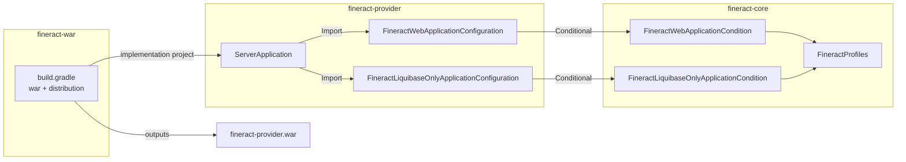
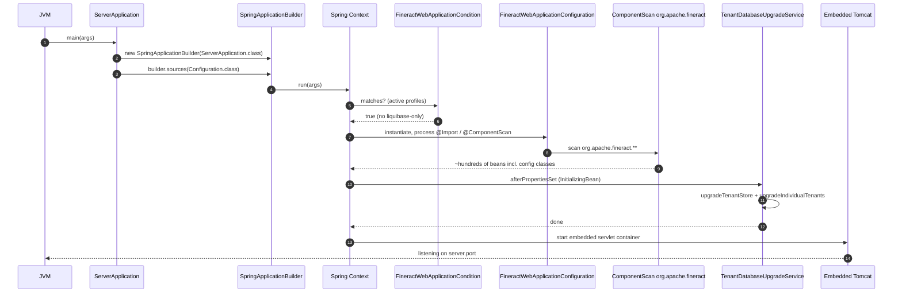

Apache Fineract is launched through a single, deliberately small entry point — the `ServerApplication` class in the `fineract-provider` module. This page traces how that one class wires together the entire runtime: how it selects between **embedded Tomcat** (developer-friendly `main()` execution) and a **WAR deployed in an external Servlet container**, how Spring profile selection routes the boot through either the full web stack or the `liquibase-only` migration stack, and how it relates to the `fineract-war/` assembly module that produces the redistributable WAR.

## The ServerApplication class

`ServerApplication` lives at `fineract-provider/src/main/java/org/apache/fineract/ServerApplication.java`. It is intentionally minimal — almost everything it does is to nominate which Spring `@Configuration` classes constitute the application graph, and then hand off to Spring Boot's `SpringApplicationBuilder`.

```java
// fineract-provider/src/main/java/org/apache/fineract/ServerApplication.java
public class ServerApplication extends SpringBootServletInitializer {

    @Import({ FineractWebApplicationConfiguration.class, FineractLiquibaseOnlyApplicationConfiguration.class })
    private static final class Configuration {}

    @Override
    protected SpringApplicationBuilder configure(SpringApplicationBuilder builder) {
        return configureApplication(builder);
    }

    private static SpringApplicationBuilder configureApplication(SpringApplicationBuilder builder) {
        return builder.sources(Configuration.class);
    }

    public static void main(String[] args) throws IOException {
        configureApplication(new SpringApplicationBuilder(ServerApplication.class)).run(args);
    }
}
```

Four observations from this tiny file drive most of what follows:

<CardGroup cols={2}>
  <Card title="Extends SpringBootServletInitializer" icon="server">
    Inheriting from `SpringBootServletInitializer` (a Spring Boot class) means the same `ServerApplication` can be picked up by an external Servlet container that finds it via the `ServletContainerInitializer` SPI when the WAR is deployed.
  </Card>
  <Card title="Has a main() method" icon="terminal">
    The same class doubles as a `public static void main` entry point, so Spring Boot's embedded Tomcat fires up directly from the IDE or `java -jar` without any external container.
  </Card>
  <Card title="Imports two configurations" icon="layer-group">
    `FineractWebApplicationConfiguration` and `FineractLiquibaseOnlyApplicationConfiguration` are both registered as sources. Only one of the two activates per run, gated by a Spring profile condition.
  </Card>
  <Card title="No @SpringBootApplication" icon="code">
    Notably, `ServerApplication` does **not** carry `@SpringBootApplication`. That annotation's responsibilities (component scan, auto-configuration) are pushed down into `FineractWebApplicationConfiguration` so they only apply in the web flavour.
  </Card>
</CardGroup>

## Two boot modes selected by profile

The inner `Configuration` class imports **both** runtime variants, and lets Spring's conditional machinery pick at most one. The discriminator is the `liquibase-only` Spring profile.

```mermaid
flowchart TD
    A[ServerApplication.main / configure] --> B[SpringApplicationBuilder]
    B --> C{ServerApplication.Configuration<br/>imports both}
    C --> D[FineractWebApplicationConfiguration]
    C --> E[FineractLiquibaseOnlyApplicationConfiguration]
    D -- "Conditional&#40;FineractWebApplicationCondition&#41;<br/>active when 'liquibase-only' NOT in profiles" --> F[Full Fineract web stack:<br/>Jersey, JPA, Security, schedulers]
    E -- "Conditional&#40;FineractLiquibaseOnlyApplicationCondition&#41;<br/>active when 'liquibase-only' IN profiles" --> G[Liquibase-only stack:<br/>tenant store + tenant migrations only]
```



### FineractWebApplicationConfiguration

Defined at `fineract-provider/src/main/java/org/apache/fineract/infrastructure/core/boot/FineractWebApplicationConfiguration.java`, this is the "everything" configuration:

```java
// fineract-provider/.../boot/FineractWebApplicationConfiguration.java
@Configuration
@EnableAutoConfiguration(exclude = { DataSourceAutoConfiguration.class, HibernateJpaAutoConfiguration.class,
        DataSourceTransactionManagerAutoConfiguration.class, GsonAutoConfiguration.class, JdbcTemplateAutoConfiguration.class,
        LiquibaseAutoConfiguration.class })
@EnableTransactionManagement
@EnableWebSecurity
@EnableConfigurationProperties({ FineractProperties.class, LiquibaseProperties.class })
@ComponentScan(basePackages = "org.apache.fineract.**")
@IntegrationComponentScan(basePackages = "org.apache.fineract.**")
@Conditional(FineractWebApplicationCondition.class)
public abstract class FineractWebApplicationConfiguration implements InitializingBean { ... }
```

The class **excludes** six Spring Boot auto-configurations explicitly — Fineract takes manual control of `DataSource`, JPA (EclipseLink not Hibernate), transactions, JSON (uses Jackson and Gson differently), `JdbcTemplate`, and Liquibase — and instead supplies replacements in the `infrastructure.core.config` package documented in [Spring Boot Configuration](/runtime/spring-boot-configuration).

<Note>
The class is `abstract` on purpose — see the source comment: *"The class needs to be abstract for some reason, otherwise the tests start to fail..."*. Spring still instantiates it through CGLIB proxying because of `@Configuration`; making it abstract simply prevents accidental direct instantiation that would short-circuit Spring's lifecycle in test contexts.
</Note>

### FineractLiquibaseOnlyApplicationConfiguration

Defined at `fineract-provider/src/main/java/org/apache/fineract/infrastructure/core/boot/FineractLiquibaseOnlyApplicationConfiguration.java`, this is a drastically narrowed configuration meant for one-shot schema management:

```java
// fineract-provider/.../boot/FineractLiquibaseOnlyApplicationConfiguration.java
@Conditional(FineractLiquibaseOnlyApplicationCondition.class)
@EnableConfigurationProperties({ FineractProperties.class, LiquibaseProperties.class })
@Import({ HikariCpConfig.class, JdbcConfig.class })
@ComponentScan(basePackages = { "org.apache.fineract.infrastructure.core.service.migration",
        "org.apache.fineract.infrastructure.core.service.database",
        "org.apache.fineract.infrastructure.core.service.tenant" })
public class FineractLiquibaseOnlyApplicationConfiguration implements InitializingBean { ... }
```

It only scans the three packages needed to:

1. Open the tenant-store Hikari pool (`HikariCpConfig` imported explicitly).
2. Resolve the configured tenants via `infrastructure.core.service.tenant`.
3. Run Liquibase migrations through `infrastructure.core.service.migration`.

No Jersey, no Spring Security web filters, no JPA `EntityManagerFactory`, no scheduler — just enough Spring to run `TenantDatabaseUpgradeService` and exit. The accompanying `application-liquibase-only.properties` file sets `spring.main.web-application-type=none` so Spring Boot does not even try to start an HTTP listener:

```properties
# fineract-provider/src/main/resources/application-liquibase-only.properties
spring.main.web-application-type=none
```

## Profile condition mechanics

The conditional gating is implemented as a small hierarchy in `fineract-core/src/main/java/org/apache/fineract/infrastructure/core/condition/`:

```java
// fineract-core/.../condition/ProfileCondition.java
public abstract class ProfileCondition implements Condition {
    @Override
    public boolean matches(ConditionContext context, AnnotatedTypeMetadata metadata) {
        String[] activeProfiles = context.getEnvironment().getActiveProfiles();
        return matches(Arrays.asList(activeProfiles));
    }
    protected abstract boolean matches(List<String> activeProfiles);
}
```

The two concrete subclasses are mirror images of each other:

| File | Matches when |
| --- | --- |
| `fineract-core/.../condition/FineractWebApplicationCondition.java` | active profiles do **not** contain `liquibase-only` |
| `fineract-core/.../condition/FineractLiquibaseOnlyApplicationCondition.java` | active profiles **do** contain `liquibase-only` |

The profile name itself is a constant in `fineract-core/src/main/java/org/apache/fineract/infrastructure/core/boot/FineractProfiles.java`:

```java
// fineract-core/.../boot/FineractProfiles.java
public final class FineractProfiles {
    public static final String LIQUIBASE_ONLY = "liquibase-only";
    public static final String DIAGNOSTICS    = "diagnostics";
    public static final String TEST           = "test";
    private FineractProfiles() {}
}
```

Activate the migration-only mode by passing `--spring.profiles.active=liquibase-only` on the command line or setting `SPRING_PROFILES_ACTIVE=liquibase-only` in the environment. See [Liquibase and Startup](/runtime/liquibase-and-startup) for what actually happens when this profile is on.

<Tip>
Because the conditionals are mutually exclusive but cover both states, **exactly one** of `FineractWebApplicationConfiguration` or `FineractLiquibaseOnlyApplicationConfiguration` always activates. There is no third "neither" branch — every boot does *something*.
</Tip>

## Embedded vs WAR execution

`ServerApplication` supports both runtime shapes through two different code paths in the same class.

<Steps>
  <Step title="Embedded Tomcat path (main)">
    `public static void main(String[] args)` calls `configureApplication(new SpringApplicationBuilder(ServerApplication.class)).run(args)`. Spring Boot detects the servlet container on the classpath (Tomcat ships transitively with `spring-boot-starter-web` / `spring-boot-starter-jersey`) and starts an embedded instance bound to `server.port` from `application.properties` (defaults to `8443` with TLS enabled).

    File: `fineract-provider/src/main/java/org/apache/fineract/ServerApplication.java` line ~52.
  </Step>
  <Step title="WAR path (configure override)">
    When packaged as a WAR and deployed to an external Tomcat / Jetty / WildFly, the Servlet container locates `ServerApplication` via `ServletContainerInitializer` because `SpringBootServletInitializer` registers itself for that SPI. The container calls `configure(SpringApplicationBuilder builder)`, Fineract returns the same builder primed with its `Configuration` sources, and Spring Boot starts in *non-embedded* mode that reuses the host container's lifecycle.

    File: `fineract-provider/src/main/java/org/apache/fineract/ServerApplication.java` line ~46.
  </Step>
  <Step title="Both paths funnel through configureApplication">
    Both `main()` and `configure()` delegate to the private `configureApplication(builder)` helper. That single method writes `builder.sources(Configuration.class)` so the conditional configurations are *always* registered, regardless of how the JVM was launched.
  </Step>
</Steps>

### Server defaults from application.properties

Embedded mode picks up the HTTP listener parameters from `fineract-provider/src/main/resources/application.properties`:

```properties
# fineract-provider/src/main/resources/application.properties (excerpt around line 380)
server.forward-headers-strategy=framework
server.port=${FINERACT_SERVER_PORT:8443}
server.servlet.context-path=${FINERACT_SERVER_SERVLET_CONTEXT_PATH:/fineract-provider}
server.compression.enabled=${FINERACT_SERVER_COMPRESSION_ENABLED:true}
server.ssl.enabled=${FINERACT_SERVER_SSL_ENABLED:true}
server.ssl.protocol=TLS
```

When deployed as a WAR, the external container governs the port and context path; Spring Boot's `server.*` properties become advisory for components like `SecurityConfig` (which uses `serverProperties.getSsl().isEnabled()` to decide whether to enforce `requiresSecure()` — see `fineract-provider/.../config/SecurityConfig.java` around line 427).

## Relationship to fineract-war

The `fineract-war/` module assembles the deployable WAR. Its `build.gradle` (`fineract-war/build.gradle`) does **not** contain any application code — it is a packaging-only module that:

1. Applies the Gradle `war` and `distribution` plugins.
2. Names the archive `fineract-provider.war`.
3. Pulls in every Fineract sub-module as `implementation` dependencies, including `fineract-provider` itself which is where `ServerApplication` lives.

```groovy
// fineract-war/build.gradle (dependencies block excerpt)
dependencies {
    implementation project(':fineract-core')
    implementation project(':fineract-accounting')
    implementation project(':fineract-loan')
    implementation project(':fineract-savings')
    implementation project(':fineract-provider')
    // ... and more module projects
}
```

The WAR uses `ServerApplication` as its bootstrap class via the Servlet SPI; no `web.xml` is required. The same module also defines two `distributions` blocks (`binary` and `src`) that produce the `apache-fineract-bin` and `apache-fineract-src` release artifacts used by the Apache release process — see lines 88+ of `fineract-war/build.gradle`.



## What happens between main() and the first HTTP request

Putting the pieces together, the boot sequence for a default `java -jar fineract-provider.jar` (web mode, no `liquibase-only` profile) looks like this:



In the `liquibase-only` profile, steps 5–7 take the *other* branch (resolving `FineractLiquibaseOnlyApplicationConfiguration`), and steps 11–12 are skipped entirely because of `spring.main.web-application-type=none` in `application-liquibase-only.properties`. The JVM exits as soon as `TenantDatabaseUpgradeService` finishes.

## What ServerApplication does NOT do

Reading the file, it is just as instructive to note what is *absent*:

<CardGroup cols={2}>
  <Card title="No @SpringBootApplication" icon="ban">
    The annotation usually seen on a Spring Boot main class is missing. Its responsibilities are split: `@EnableAutoConfiguration` lives on `FineractWebApplicationConfiguration`, and that is the only configuration that activates auto-config — the Liquibase-only configuration intentionally skips it.
  </Card>
  <Card title="No bean definitions" icon="ban">
    No `@Bean` methods are declared directly. Every bean comes from the imported configurations or from the broad `@ComponentScan(basePackages = "org.apache.fineract.**")` inside `FineractWebApplicationConfiguration`.
  </Card>
  <Card title="No exception handling" icon="ban">
    `main()` rethrows `IOException`. Boot failures become full stack traces on stderr — exactly what is wanted for a container restart loop.
  </Card>
  <Card title="No CLI parsing" icon="ban">
    All configuration is property-based (CLI `--key=value`, environment variables, `application.properties`, profiles). `ServerApplication` does not call any `args` parser of its own.
  </Card>
</CardGroup>

## Practical implications

<Note>
**Running from the IDE.** The Javadoc on `ServerApplication` states it bluntly: *"You can easily launch this via Debug as Java Application in your IDE — without needing command line Gradle stuff, no need to build and deploy a WAR, remote attachment etc."* As long as your dev DB matches `fineract.tenant.*` in `application.properties`, hitting "Run" on the class is enough.
</Note>

<Note>
**Running migrations only.** Set `SPRING_PROFILES_ACTIVE=liquibase-only` and run the same JAR. The JVM brings up the migrations, applies them to the tenant store and every tenant database, then exits. Useful in CI pipelines and Kubernetes init containers — see [Liquibase and Startup](/runtime/liquibase-and-startup).
</Note>

<Note>
**Deploying the WAR.** The build target `:fineract-war:war` produces `fineract-war/build/libs/fineract-provider.war`. Drop it into any Servlet 6.0+ container; the container will discover `ServerApplication` via `SpringBootServletInitializer.onStartup`, call `configure()`, and the same `Configuration` inner class is used as the source.
</Note>

## Where to read next

- [Spring Boot Configuration](/runtime/spring-boot-configuration) — every `@Configuration` class component-scanned by `FineractWebApplicationConfiguration`.
- [Liquibase and Startup](/runtime/liquibase-and-startup) — how `TenantDatabaseUpgradeService` runs in both web and `liquibase-only` modes.
- [Jersey and JAX-RS](/runtime/jersey-and-jax-rs) — the HTTP layer that listens on `server.port` after `ServerApplication` finishes booting.
- [Static Weaving and JPA](/runtime/static-weaving-and-jpa) — the build-time bytecode step that makes JPA work in the embedded boot.
