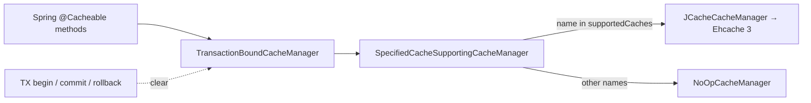

Apache Fineract takes deliberate manual control over Spring Boot's auto-configuration. Six auto-configurations are explicitly excluded (`DataSource`, JPA, transactions, Gson, `JdbcTemplate`, Liquibase — see [Server Application](/runtime/server-application)) and the replacements live in `fineract-provider/src/main/java/org/apache/fineract/infrastructure/core/config/`. This page is a structured tour of every `@Configuration` class in that package and its two sub-packages, with bean signatures, property keys, and conditions.

## Package layout

```
fineract-provider/src/main/java/org/apache/fineract/infrastructure/core/config/
├── CompatibilityConfig.java          (deprecated env-var compatibility shim)
├── ContentS3Config.java              (S3 client for document storage)
├── FineractStartupValidationConfig.java  (aborts boot if validation fails)
├── HikariCpConfig.java               (tenant-store Hikari pool)
├── JdbcConfig.java                   (JdbcTemplate wiring)
├── MetricsConfig.java                (Micrometer TimedAspect)
├── OkHttp3Config.java                (HTTP client for outbound calls)
├── SecurityConfig.java               (Spring Security filter chain)
├── SecurityValidationConfig.java     (basic-vs-OAuth2 mutual exclusion)
├── SpringConfig.java                 (event multicaster + ThreadLocal mode)
├── TaskExecutorConfig.java           (default / configurable thread pools)
├── TaskExecutorConstant.java         (bean-name constants)
├── cache/                            (Ehcache + JSR-107 + per-tx wrapper)
│   ├── CacheConfig.java
│   ├── SpecifiedCacheSupportingCacheManager.java
│   └── TransactionBoundCacheManager.java
└── jpa/                              (EclipseLink JPA setup)
    ├── EntityManagerFactoryCustomizer.java
    └── JPAConfig.java
```

`FineractProperties` (the typed root binding for `fineract.*` keys) lives in `fineract-core/src/main/java/org/apache/fineract/infrastructure/core/config/FineractProperties.java` and is referenced by almost every class below.

## CompatibilityConfig

**File**: `fineract-provider/.../config/CompatibilityConfig.java`

A deprecated bridge for installations that still set the *old* tenant DB environment variables (`fineract_tenants_driver`, `fineract_tenants_url`, `fineract_tenants_uid`, `fineract_tenants_pwd`). Activated only when the legacy `fineract_tenants_driver` env var is present:

```java
@Configuration
@ConditionalOnExpression("#{ systemEnvironment['fineract_tenants_driver'] != null }")
@Deprecated // NOTE: this will be removed in one of the next releases (probably around version 1.7.x or 1.8.x)
public class CompatibilityConfig {
```

| Bean | Type | Purpose |
| --- | --- | --- |
| `hikariConfig` | `HikariConfig` | Hand-built Hikari config from `fineract_tenants_*` env vars; pool size 3-10; idle timeout 60 s; test query `SELECT 1`. |
| `hikariTenantDataSource` | `HikariDataSource` | The actual pool, destroyed by `close()` on shutdown. |

On `@PostConstruct` it logs a multi-line warning showing both the legacy values and the modern `FINERACT_HIKARI_*` equivalents, so operators know exactly what to migrate to. The `dataSourceProperties()` method bakes in the same Hikari/MySQL tuning that `TomcatJdbcDataSourcePerTenantService` uses (`cachePrepStmts=true`, `prepStmtCacheSize=250`, `rewriteBatchedStatements=true`, etc.).

<Note>
When `fineract_tenants_driver` is unset (the default), `CompatibilityConfig` is silent and the `hikariTenantDataSource` bean is supplied by `HikariCpConfig` instead.
</Note>

## ContentS3Config

**File**: `fineract-provider/.../config/ContentS3Config.java`

Constructs an AWS SDK v2 `S3Client` for document storage, gated by `fineract.content.s3.enabled`.

```java
@Bean
@ConditionalOnProperty("fineract.content.s3.enabled")
public S3Client contentS3Client(FineractProperties fineractProperties) { ... }
```

| Property | Used for |
| --- | --- |
| `fineract.content.s3.enabled` | toggles bean creation |
| `fineract.content.s3.region` | `Region.of(...)` when non-blank |
| `fineract.content.s3.endpoint` | `endpointOverride(URI.create(...))` for MinIO etc. |
| `fineract.content.s3.path-style-addressing-enabled` | passes `forcePathStyle(true)` for non-AWS S3 |
| `fineract.content.s3.access-key` + `.secret-key` | `StaticCredentialsProvider`; otherwise falls back to `DefaultCredentialsProvider.create()` (IAM role / env chain) |

The default and the access-key fallback come straight from `application.properties` lines 188-194 of `fineract-provider/src/main/resources/application.properties`.

## FineractStartupValidationConfig

**File**: `fineract-provider/.../config/FineractStartupValidationConfig.java`

Not a bean factory — a *boot guard*. It is annotated `@Component` with `@Order(Ordered.HIGHEST_PRECEDENCE)` and `@Conditional(FineractValidationCondition.class)`. When the condition matches (meaning one of the validation conditions in `fineract-core/.../condition/` flagged a configuration problem), its `afterPropertiesSet()` immediately closes the `ApplicationContext`:

```java
@Override
public void afterPropertiesSet() throws Exception {
    terminateApplication();
}

private void terminateApplication() {
    log.error("The application startup fails on validations. Please check the log above for the details");
    ((ConfigurableApplicationContext) applicationContext).close();
}
```

`FineractValidationCondition` (file: `fineract-core/.../condition/FineractValidationCondition.java`) is an `AnyNestedCondition` that fires if *any* of these sub-conditions trigger:

- `FineractModeValidationCondition` — illegal `fineract.mode.*` combinations
- `FineractPartitionJobConfigValidationCondition`
- `FineractRemoteJobMessageHandlerCondition`
- `FineractExternalEventConfigCondition`

The net effect: misconfiguration discovered during component-scan terminates the JVM rather than letting it half-start.

## HikariCpConfig

**File**: `fineract-provider/.../config/HikariCpConfig.java`

The *primary* tenant-store data source — what Fineract connects to in order to read the tenant registry. Active when the legacy `fineract_tenants_driver` env var is **not** set:

```java
@Configuration
@ConditionalOnExpression("#{ systemEnvironment['fineract_tenants_driver'] == null }")
public class HikariCpConfig {
    @Bean(initMethod = "getConnection", destroyMethod = "close")
    @ConfigurationProperties(prefix = "spring.datasource.hikari")
    public HikariDataSource hikariTenantDataSource() { return new HikariDataSource(); }
}
```

Two notable details:

1. `initMethod = "getConnection"` forces Hikari to open the pool eagerly at boot rather than lazily on first query — failures show up immediately.
2. `@ConfigurationProperties(prefix = "spring.datasource.hikari")` binds *every* standard Hikari property from `application.properties` (`jdbc-url`, `username`, `password`, `driver-class-name`, `minimum-idle`, `maximum-pool-size`, `data-source-properties.*`, …) without enumeration.

`HikariCpConfig` is imported explicitly by `FineractLiquibaseOnlyApplicationConfiguration` so the same pool exists in migration-only mode too.

## JdbcConfig

**File**: `fineract-provider/.../config/JdbcConfig.java`

Exposes Spring's JDBC helpers backed by the tenant-aware `RoutingDataSource` (covered in [Multi-Tenancy](/runtime/multi-tenancy)):

```java
@Profile("!liquibase-only")
@Configuration
@EnableJdbcRepositories(basePackages = { "org.apache.fineract.**.domain" })
public class JdbcConfig {
    @Bean public JdbcTemplate jdbcTemplate(RoutingDataSource dataSource) { ... }
    @Bean public NamedParameterJdbcTemplate namedParameterJdbcTemplate(RoutingDataSource dataSource) { ... }
}
```

Both templates resolve their connection per-call through `RoutingDataSource.determineTargetDataSource()`, so a `JdbcTemplate` injection in a service silently switches tenants based on `ThreadLocalContextUtil.getTenant()`. `@EnableJdbcRepositories` turns on Spring Data JDBC for any interface under `org.apache.fineract.**.domain`.

The `@Profile("!liquibase-only")` excludes this configuration when running migration-only — there are no `JdbcTemplate` consumers in that path.

## MetricsConfig

**File**: `fineract-provider/.../config/MetricsConfig.java`

Six lines that matter:

```java
@Configuration
@EnableAspectJAutoProxy
public class MetricsConfig {
    @Bean
    public TimedAspect timedAspect(MeterRegistry registry) {
        return new TimedAspect(registry);
    }
}
```

Enables AspectJ-style proxying and registers Micrometer's `@Timed` aspect. Any method (or class) annotated with `io.micrometer.core.annotation.Timed` produces a histogram against whatever `MeterRegistry` Spring Boot has wired (Prometheus, OTLP, CloudWatch — see `management.*` properties in `application.properties`).

## OkHttp3Config

**File**: `fineract-provider/.../config/OkHttp3Config.java`

A single `OkHttpClient` bean used by outbound integrations (hook delivery, Pentaho, external job message handler, etc.). Timeouts and TLS strictness come from `FineractProperties`:

| Property | Type | Effect |
| --- | --- | --- |
| `fineract.client-connect-timeout` | long s | `connectTimeout` |
| `fineract.client-read-timeout`    | long s | `readTimeout` |
| `fineract.client-write-timeout`   | long s | `writeTimeout` |
| `fineract.insecure-http-client`   | bool   | installs an `X509TrustManager` that trusts everything and a hostname verifier that returns `true` — **dev/test only** |

The insecure mode is explicitly labelled with `// NOSONAR` and a `@Slf4j` warning is sensible to enable around its use. Production deployments must leave `fineract.insecure-http-client=false`.

## SecurityConfig

**File**: `fineract-provider/.../config/SecurityConfig.java` (~520 lines)

The single largest configuration class in the package. It builds the Spring Security `SecurityFilterChain`, the `AuthenticationManager`, the password encoder chain, and the CORS source. Active only when `fineract.security.basicauth.enabled=true`:

```java
@Configuration
@ConditionalOnProperty("fineract.security.basicauth.enabled")
@EnableMethodSecurity
public class SecurityConfig { ... }
```

### Beans declared

| Bean | What it does |
| --- | --- |
| `SecurityFilterChain filterChain(HttpSecurity)` | The full URL authorization map for `/api/**`. |
| `BasicAuthenticationEntryPoint basicAuthenticationEntryPoint()` | Realm name `Fineract Platform API`. |
| `DaoAuthenticationProvider authProvider()` (name `customAuthenticationProvider`) | Wraps `TenantAwareJpaPlatformUserDetailsService` with `TemporaryPasswordAwareAuthenticationProvider` + the delegating password encoder + `platformUserDetailsChecker` for post-auth checks. |
| `PasswordEncoder passwordEncoder()` | `PasswordEncoderFactories.createDelegatingPasswordEncoder()` — supports `{bcrypt}`, `{pbkdf2}`, `{scrypt}`, … prefixes. |
| `AuthenticationManager authenticationManagerBean()` | `new ProviderManager(authProvider())` with `setEraseCredentialsAfterAuthentication(false)` so the basic-auth header stays available for tenant resolution. |
| `CorsConfigurationSource corsConfigurationSource()` | Populated from `FineractProperties.security.cors`. |

### Filter chain

Filters are wired with explicit ordering relative to Spring Security's standard ones:

```text
TenantAwareBasicAuthenticationFilter
   ↳ before SecurityContextHolderFilter
RequestResponseFilter
   ↳ after ExceptionTranslationFilter
CorrelationHeaderFilter
   ↳ after RequestResponseFilter
FineractInstanceModeApiFilter
   ↳ after CorrelationHeaderFilter
[LoanCOBApiFilter + ProgressiveLoanModelCheckerFilter + IdempotencyStoreFilter]
[CallerIpTrackingFilter — if fineract.ip-tracking.enabled]
[TwoFactorAuthenticationFilter — if fineract.security.2fa.enabled]
```

Each entry name maps directly to a class under `fineract-core/.../filters/` or `fineract-security/.../filter/`.

### Authorization rules

The `filterChain` method authors hundreds of `requestMatchers(...).hasAnyAuthority(ALL_FUNCTIONS, ALL_FUNCTIONS_READ|WRITE, "PERMISSION_NAME")` lines. The pattern is consistent: each REST verb gets its own permission key (`READ_*`, `CREATE_*`, `UPDATE_*`, `DELETE_*`) and either `ALL_FUNCTIONS_READ` or `ALL_FUNCTIONS_WRITE` plus the catch-all `ALL_FUNCTIONS` always satisfy the rule. Public endpoints — `OPTIONS /api/**`, `POST /api/*/echo`, `POST /api/*/authentication`, `POST /api/*/password/forgot`, `PUT /api/*/instance-mode` — are `permitAll()`.

### Properties consumed

```properties
fineract.security.basicauth.enabled=...      # toggles class entirely
fineract.security.oauth2.enabled=...
fineract.security.2fa.enabled=...
fineract.security.hsts.enabled=...
fineract.security.cors.enabled=...
fineract.security.cors.allowed-origin-patterns=...
fineract.security.cors.allowed-methods=...
fineract.security.cors.allowed-headers=...
fineract.security.cors.exposed-headers=...
fineract.security.cors.allow-credentials=...
fineract.ip-tracking.enabled=...
```

`server.ssl.enabled` (Spring Boot's standard key) triggers `http.requiresChannel(...).requiresSecure()` for `/api/**` when set.

## SecurityValidationConfig

**File**: `fineract-provider/.../config/SecurityValidationConfig.java`

A 20-line `@PostConstruct` check that prevents the operator from enabling both auth schemes or neither:

```java
@PostConstruct
public void validate() {
    if (!Boolean.TRUE.equals(basicAuthEnabled) && !Boolean.TRUE.equals(oauthEnabled)) {
        throw new IllegalArgumentException(
            "No authentication scheme selected. Please decide if you want to use basic OR OAuth2 authentication.");
    }
    if (basicAuthEnabled && oauthEnabled) {
        throw new IllegalArgumentException(
            "Too many authentication schemes selected. Please decide if you want to use basic OR OAuth2 authentication.");
    }
}
```

Reads `fineract.security.basicauth.enabled` and `fineract.security.oauth2.enabled`. Defaults in `application.properties` make basic-auth on, OAuth2 off — the configuration just hard-fails if an operator changes one without the other.

## SpringConfig

**File**: `fineract-provider/.../config/SpringConfig.java`

Three concerns: an event-publishing executor, a Spring Security `ThreadLocal` strategy switch, and a `SecurityContextHolderStrategy` bean.

| Bean | Purpose |
| --- | --- |
| `fineractEventExecutor` (`ThreadPoolTaskExecutor`) | Thread name prefix `FineractEvent-`. Smart sizing: core = `cpus*2`, max = `cpus*5`, queue capacity 100. Overridable via `spring.task.execution.pool.core-size`, `max-size`, `queue-capacity`. Uses `CallerRunsPolicy` rejection. Waits 60 s for in-flight tasks on shutdown. |
| `applicationEventMulticaster` (`SimpleApplicationEventMulticaster`) | Dispatches Spring application events on the executor above, wrapped in `DelegatingSecurityContextAsyncTaskExecutor` so security context propagates. |
| `overrideSecurityContextHolderStrategy` (`MethodInvokingFactoryBean`) | Calls `SecurityContextHolder.setStrategyName(MODE_INHERITABLETHREADLOCAL)` so child threads see the parent's auth — required for async event listeners and batch steps. |
| `securityContextHolderStrategy` | Re-exposes the current strategy as a bean for components that want to inject it. |

The use of `MODE_INHERITABLETHREADLOCAL` is what makes Fineract's `ThreadLocalContextUtil`-based tenant resolution survive when work is offloaded to async executors.

## TaskExecutorConfig & TaskExecutorConstant

**Files**: `fineract-provider/.../config/TaskExecutorConfig.java` and `TaskExecutorConstant.java`

Two `ThreadPoolTaskExecutor` beans whose sizes come from `fineract.task-executor.*` (bound through `FineractProperties.TaskExecutor`):

```java
@Bean(TaskExecutorConstant.DEFAULT_TASK_EXECUTOR_BEAN_NAME)        // "fineractDefaultThreadPoolTaskExecutor"
public ThreadPoolTaskExecutor fineractDefaultThreadPoolTaskExecutor() { ... }

@Bean(TaskExecutorConstant.CONFIGURABLE_TASK_EXECUTOR_BEAN_NAME)   // "fineractConfigurableThreadPoolTaskExecutor"
@Scope(scopeName = ConfigurableBeanFactory.SCOPE_PROTOTYPE)
public ThreadPoolTaskExecutor fineractConfigurableThreadPoolTaskExecutor() { ... }
```

The configurable variant is `prototype`-scoped — each injection gets a fresh executor instance so callers can `setCorePoolSize` / `setMaxPoolSize` per-use without contention.

`TaskExecutorConstant` (final, all-`static`) defines the canonical bean names so callers do not stringify them:

```java
public static final String DEFAULT_TASK_EXECUTOR_BEAN_NAME      = "fineractDefaultThreadPoolTaskExecutor";
public static final String CONFIGURABLE_TASK_EXECUTOR_BEAN_NAME = "fineractConfigurableThreadPoolTaskExecutor";
public static final String EVENT_TASK_EXECUTOR_BEAN_NAME        = "externalEventJmsProducerExecutor";
public static final String LOAN_COB_CATCH_UP_TASK_EXECUTOR_BEAN_NAME = "loanCOBCatchUpThreadPoolTaskExecutor";
public static final String WORKING_CAPITAL_LOAN_COB_CATCH_UP_TASK_EXECUTOR_BEAN_NAME = "workingCapitalLoanCOBCatchUpThreadPoolTaskExecutor";
```

Default sizing from `application.properties`:

```properties
fineract.task-executor.default-task-executor-core-pool-size=${FINERACT_DEFAULT_TASK_EXECUTOR_CORE_POOL_SIZE:10}
fineract.task-executor.default-task-executor-max-pool-size=${FINERACT_DEFAULT_TASK_EXECUTOR_MAX_POOL_SIZE:100}
fineract.task-executor.tenant-upgrade-task-executor-core-pool-size=1
fineract.task-executor.tenant-upgrade-task-executor-max-pool-size=1
fineract.task-executor.tenant-upgrade-task-executor-queue-capacity=${FINERACT_TENANT_UPGRADE_TASK_EXECUTOR_QUEUE_CAPACITY:100}
```

## cache/ sub-package

Three classes wire a JCache (JSR-107) `CacheManager` backed by Ehcache 3, with a transaction-bound wrapper that clears caches at the start *and* end of every transaction.

### CacheConfig

**File**: `fineract-provider/.../config/cache/CacheConfig.java`

```java
@Bean
public TransactionBoundCacheManager defaultCacheManager(JCacheCacheManager ehCacheManager) {
    SpecifiedCacheSupportingCacheManager cacheManager = new SpecifiedCacheSupportingCacheManager();
    cacheManager.setNoOpCacheManager(new NoOpCacheManager());
    cacheManager.setDelegateCacheManager(ehCacheManager);
    cacheManager.setSupportedCaches(CONFIG_BY_NAME_CACHE_NAME);  // "configByName"
    return new TransactionBoundCacheManager(cacheManager);
}
```

Steps:

1. `ehCacheManager()` boots a JCache provider and creates one Ehcache 3 cache per name discovered by classpath reflection — `@Cacheable.value`, `@Cacheable.cacheNames`, and `@CacheConfig.cacheNames` on every type/method in `org.apache.fineract.**` are scanned with the `Reflections` library.
2. Each cache's TTL and max entries come from `fineract.cache.default-template.ttl` / `.maximum-entries`, overridden per cache via `fineract.cache.custom-templates.<cacheName>.{ttl,maximum-entries}`.
3. `SpecifiedCacheSupportingCacheManager` routes lookups: only the explicitly supported cache (`configByName`) is delegated to Ehcache; *every other cache name returns a NoOp cache*. This is a deliberate safety: writes to unsupported caches are silently dropped rather than accidentally populating a wrong store.
4. `TransactionBoundCacheManager` then wraps the manager and clears every cache when a transaction *begins* and *completes* — see "Transaction-bound caches" below.

### SpecifiedCacheSupportingCacheManager

**File**: `fineract-provider/.../config/cache/SpecifiedCacheSupportingCacheManager.java`

A 60-line `CacheManager`+`InitializingBean` that switches between a delegate (`JCacheCacheManager`) and a `NoOpCacheManager` based on the `supportedCacheNames` set. `getCache(name)` returns NoOp for any name not in the supported set.

### TransactionBoundCacheManager

**File**: `fineract-provider/.../config/cache/TransactionBoundCacheManager.java`

Implements both `CacheManager` (delegating) **and** `TransactionLifecycleCallback` (Fineract's own SPI). The two callbacks clear every cache:

```java
@Override public void afterCompletion() { resetCaches(); }
@Override public void afterBegin()     { resetCaches(); }

private void resetCaches() {
    delegate.getCacheNames().forEach(c -> {
        Cache cache = delegate.getCache(c);
        if (cache != null) cache.clear();
    });
}
```

The rationale is multi-tenant safety: because tenant selection happens *inside* a transaction, leftover cache entries from one tenant must not bleed into the next. Clearing both at begin and after completion guarantees a per-transaction cache horizon.



## jpa/ sub-package

### JPAConfig

**File**: `fineract-provider/.../config/jpa/JPAConfig.java`

Extends `JpaBaseConfiguration` (Spring Boot's base class for custom JPA setups) and pins Fineract to **EclipseLink**, static weaving, and the tenant-aware `RoutingDataSource`.

```java
@Configuration
@EnableJpaAuditing
@EnableJpaRepositories(basePackages = { "org.apache.fineract.**.domain", "org.apache.fineract.**.repository" })
@Import(JpaAuditingHandlerRegistrar.class)
public class JPAConfig extends JpaBaseConfiguration {
```

Critical decisions encoded in this file:

| Decision | How |
| --- | --- |
| EclipseLink, not Hibernate | `protected AbstractJpaVendorAdapter createJpaVendorAdapter() { return new EclipseLinkJpaVendorAdapter(); }` |
| Static weaving (not dynamic) | `vendorProperties.put(PersistenceUnitProperties.WEAVING, "static")` — entities **must** be statically woven (see [Static Weaving and JPA](/runtime/static-weaving-and-jpa)) |
| Close PC on commit | `PERSISTENCE_CONTEXT_CLOSE_ON_COMMIT = "true"` |
| Shared L2 cache off | `CACHE_SHARED_DEFAULT = "false"` — every persistence context is isolated. |
| Persistence unit name | `"jpa-pu"` |
| Wait for Liquibase | `@DependsOn("tenantDatabaseUpgradeService")` on `entityManagerFactory` — JPA won't start until migrations finish. |
| Auditing | `EnableJpaAuditing` + `AuditorAware<Long>` bean → `AuditorAwareImpl` (`fineract-core/.../domain/AuditorAwareImpl.java`). |
| Per-DB persistence-unit tweaks | Installs `DatabaseSelectingPersistenceUnitPostProcessor` which uses `DatabaseTypeResolver` to choose orm.xml fragments. |
| Pluggable customizers | Discovers every `EntityManagerFactoryCustomizer` bean and merges its packages, vendor properties, and persistence-unit post-processors. |

The `txTemplate` bean exposes a ready-to-inject `TransactionTemplate` so services can run programmatic transactions without touching `PlatformTransactionManager` directly.

### EntityManagerFactoryCustomizer

**File**: `fineract-provider/.../config/jpa/EntityManagerFactoryCustomizer.java`

A three-method SPI interface that other Fineract modules implement to *extend* JPA at boot without subclassing `JPAConfig`:

```java
public interface EntityManagerFactoryCustomizer {
    default Set<String> additionalPackagesToScan() { return Collections.emptySet(); }
    default Map<String, Object> additionalVendorProperties() { return Collections.emptyMap(); }
    default Set<PersistenceUnitPostProcessor> additionalPersistenceUnitPostProcessors() { return Collections.emptySet(); }
}
```

The Javadoc states *"The order in which the customizations are applied is not guaranteed."* — implementations must therefore be commutative.

## How they fit together

```mermaid
flowchart TB
    SA[ServerApplication]
    FWC[FineractWebApplicationConfiguration<br/>@ComponentScan org.apache.fineract.**]
    SA --> FWC
    FWC -->|scans| CFG[infrastructure/core/config/*]

    subgraph DataSource
      HCP[HikariCpConfig]
      CC[CompatibilityConfig<br/>only if legacy env var]
    end
    subgraph JDBC[JDBC and JPA]
      JC[JdbcConfig]
      JPA[JPAConfig]
      EMC[EntityManagerFactoryCustomizer]
    end
    subgraph Web
      SEC[SecurityConfig]
      SV[SecurityValidationConfig]
      OK[OkHttp3Config]
    end
    subgraph Plumbing
      SP[SpringConfig]
      TE[TaskExecutorConfig]
      MET[MetricsConfig]
      CACHE[cache/CacheConfig]
    end
    subgraph Content
      S3[ContentS3Config]
    end
    subgraph Guards
      VAL[FineractStartupValidationConfig]
    end

    CFG --> HCP
    CFG --> CC
    CFG --> JC
    CFG --> JPA
    CFG --> SEC
    CFG --> SV
    CFG --> OK
    CFG --> SP
    CFG --> TE
    CFG --> MET
    CFG --> CACHE
    CFG --> S3
    CFG --> VAL
    HCP --> JPA
    HCP --> JC
    JPA --> EMC
    SEC --> SV
```

## Properties cross-reference

A compact map of which class reads which `fineract.*` property tree:

| Property prefix | Read by |
| --- | --- |
| `fineract.security.basicauth.*`, `oauth2.*`, `2fa.*`, `hsts.*`, `cors.*` | `SecurityConfig`, `SecurityValidationConfig` |
| `fineract.tenant.*` | `FineractProperties` (consumed by `HikariCpConfig` via Spring Boot binding and by `JpaBaseConfiguration` indirectly via `RoutingDataSource`) |
| `fineract.mode.*` | `FineractInstanceModeApiFilter` (wired in by `SecurityConfig`) — see [Instance Mode](/runtime/instance-mode) |
| `fineract.task-executor.*` | `TaskExecutorConfig` |
| `fineract.cache.*` | `CacheConfig` |
| `fineract.content.s3.*` | `ContentS3Config` |
| `fineract.client-connect-timeout`, `-read-timeout`, `-write-timeout`, `insecure-http-client` | `OkHttp3Config` |
| `fineract.ip-tracking.enabled` | `SecurityConfig` (decides whether to add `CallerIpTrackingFilter`) |
| `spring.datasource.hikari.*` | `HikariCpConfig` via `@ConfigurationProperties` |

## What is intentionally absent

<CardGroup cols={2}>
  <Card title="No JPA repositories config here" icon="ban">
    `@EnableJpaRepositories` lives on `JPAConfig`, not in a separate file. Adding a new repository package means listing it in the array there.
  </Card>
  <Card title="No global @ControllerAdvice" icon="ban">
    Error handling is owned by Jersey-style `ExceptionMapper`s (see [Jersey and JAX-RS](/runtime/jersey-and-jax-rs)), not Spring `@ControllerAdvice`.
  </Card>
  <Card title="No second-level Hibernate cache" icon="ban">
    EclipseLink's shared cache is disabled (`CACHE_SHARED_DEFAULT=false`). Spring's `@Cacheable` covers selective caching instead, with mandatory whitelisting via `SpecifiedCacheSupportingCacheManager`.
  </Card>
  <Card title="No DispatcherServlet config" icon="ban">
    REST is handled by Jersey, not Spring MVC. There is no `WebMvcConfigurer` in this package.
  </Card>
</CardGroup>

## Cross-references

- [Server Application](/runtime/server-application) — how `FineractWebApplicationConfiguration` activates this whole package via `@ComponentScan`.
- [Jersey and JAX-RS](/runtime/jersey-and-jax-rs) — the JAX-RS layer that sits in front of all of the above.
- [Multi-Tenancy](/runtime/multi-tenancy) — `RoutingDataSource` consumed by `JdbcConfig` and `JPAConfig`.
- [Instance Mode](/runtime/instance-mode) — how `SecurityConfig` plugs in the `FineractInstanceModeApiFilter`.
- [Static Weaving and JPA](/runtime/static-weaving-and-jpa) — why `PersistenceUnitProperties.WEAVING="static"` is non-optional.
