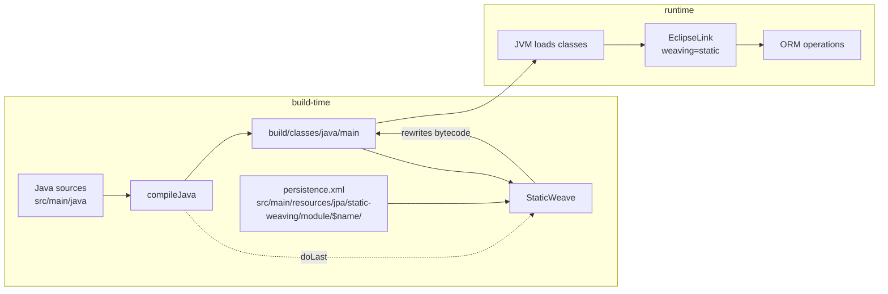
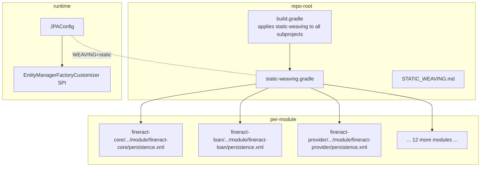

Apache Fineract uses **EclipseLink** for JPA and applies its **static weaving** transformation at build time. This page covers the entire static-weaving pipeline: the `static-weaving.gradle` script that runs the weaver, the per-module `persistence.xml` files that drive it, how the runtime `JPAConfig` connects to that weaving, and the operational consequences (entity changes require a rebuild; reflection-based tooling can be surprised).

## What static weaving does, and why Fineract needs it

EclipseLink supports two modes of *bytecode weaving* — the process that transforms compiled JPA entity classes to add lazy-loading proxies, change tracking, fetch groups, and embedded mappings without forcing entities to subclass anything:

| Mode | When | Pros | Cons |
| --- | --- | --- | --- |
| Dynamic weaving | At classload time, via a JVM agent or container ClassFileTransformer | Zero build-time work | Requires a JavaAgent or hook the container supplies — fragile in some environments |
| **Static weaving** | At build time, after compilation | No runtime instrumentation needed; debug symbols intact; predictable | Every entity change requires a rebuild step |

Fineract picks **static**. The decision is hard-wired in two places:

1. The runtime `JPAConfig.getVendorProperties()` sets `eclipselink.weaving=static` (paraphrased below).
2. Each module's `persistence.xml` for the build-time descriptor declares the same:
   ```xml
   <property name="eclipselink.weaving" value="static" />
   <property name="eclipselink.weaving.internal" value="false"/>
   ```
   (file: `fineract-core/src/main/resources/jpa/static-weaving/module/fineract-core/persistence.xml`)

Without static weaving the runtime cannot lazily load `@OneToOne` and `@ManyToOne` relationships, cannot track field-level changes for partial UPDATEs, and falls back to less efficient state checks — the official guidance from the project's own `STATIC_WEAVING.md` is that weaving "enhances JPA entities at build time to improve runtime performance".

## STATIC_WEAVING.md — the project's own brief

The repository ships an explanatory document at `STATIC_WEAVING.md` (repo root). The key passages, paraphrased:

- **Tool used**: `org.eclipse.persistence.tools.weaving.jpa.StaticWeave`.
- **When it runs**: as the last step of the `compileJava` Gradle task, in the same directory as the standard Java output (`build/classes/java/main`).
- **How a module opts in**: by placing a `persistence.xml` at `src/main/resources/jpa/static-weaving/module/<module-name>/persistence.xml`. The Gradle script auto-detects presence of that file and conditionally enables weaving.
- **What to do when it breaks**: confirm the descriptor path is correct, check that output directories exist, read the build log for `StaticWeave` errors.

This file is the single source of truth on the contract between the Gradle pipeline and the per-module descriptors.

## The Gradle script

The actual weaving task lives at `static-weaving.gradle` (repo root) and is applied to every subproject from the root `build.gradle` (line 173):

```groovy
// build.gradle (root) line 171-173
subprojects { subproject ->
    apply from: rootProject.file('static-weaving.gradle')
}
```

The script's body is structured around three guards and one `javaexec`:

```groovy
// static-weaving.gradle (paraphrased shape)
project.afterEvaluate {
    if (!project.plugins.hasPlugin('java')) {
        logger.info("ℹ Skipping static weaving configuration for non-Java project: ${project.name}")
        return
    }
    def persistenceXmlFile = file("src/main/resources/jpa/static-weaving/module/${project.name}/persistence.xml")
    def hasJpaEntities = persistenceXmlFile.exists()
    if (hasJpaEntities) {
        compileJava.doLast {
            def source = sourceSets.main.java.classesDirectory.get()
            File weavingRoot = new File(temporaryDir, "static-weaving")
            File metaInf = new File(weavingRoot, "META-INF")
            metaInf.mkdirs()
            copy { from persistenceXmlFile.toPath(); into metaInf.toPath() }
            javaexec {
                mainClass.set("org.eclipse.persistence.tools.weaving.jpa.StaticWeave")
                classpath = project.sourceSets.main.runtimeClasspath
                args = [ "-persistenceinfo", weavingRoot.absolutePath, source, source ]
            }
        }
    }
}
```

Step-by-step:

<Steps>
  <Step title="Wait for project evaluation">
    `project.afterEvaluate { ... }` defers all logic until plugins applied by each subproject are resolved — necessary because `compileJava` is added by the `java` plugin, not by the script itself.
  </Step>
  <Step title="Skip non-Java projects">
    If a subproject does not apply the `java` plugin (e.g., the `fineract-doc` module, the WAR packaging module), the script does nothing.
  </Step>
  <Step title="Look for a module persistence.xml">
    The script searches for `src/main/resources/jpa/static-weaving/module/<projectName>/persistence.xml`. Note that `<projectName>` is the Gradle subproject name — the directory matches the module exactly (`fineract-core/.../module/fineract-core/persistence.xml`, `fineract-loan/.../module/fineract-loan/persistence.xml`, etc.). The descriptor file's *parent directory name* is meaningful.
  </Step>
  <Step title="Hook compileJava.doLast">
    Weaving is registered as an additional action on `compileJava` so it always runs *after* compilation, against the same `build/classes/java/main` output the compiler just produced.
  </Step>
  <Step title="Stage persistence.xml under META-INF">
    EclipseLink's `StaticWeave` tool expects a `META-INF/persistence.xml` at a root path. The script copies the module's descriptor into `${temporaryDir}/static-weaving/META-INF/persistence.xml` so the tool can locate it.
  </Step>
  <Step title="Invoke StaticWeave">
    `javaexec` runs `org.eclipse.persistence.tools.weaving.jpa.StaticWeave` on the runtime classpath with arguments:
    - `-persistenceinfo` → the staged `META-INF` root
    - `source` → the classes directory to read from
    - `source` → the same directory to write into (in-place rewrite)
    Bytes are rewritten in place.
  </Step>
</Steps>

The script is intentionally idempotent: if `compileJava` is up-to-date, weaving does not rerun (because `doLast` actions only fire when the task itself executes). A clean build always weaves; an incremental build only re-weaves modules whose Java sources changed.



## Modules that participate

A directory listing of every `persistence.xml` in the repo (one per module that owns entities):

| Module | Descriptor path | Entity count |
| --- | --- | --- |
| `fineract-core` | `fineract-core/src/main/resources/jpa/static-weaving/module/fineract-core/persistence.xml` | ~39 |
| `fineract-accounting` | `fineract-accounting/.../module/fineract-accounting/persistence.xml` | ~51 (mostly extends core) |
| `fineract-branch` | `fineract-branch/.../module/fineract-branch/persistence.xml` | ~55 |
| `fineract-charge` | `fineract-charge/.../module/fineract-charge/persistence.xml` | ~44 |
| `fineract-cob` | `fineract-cob/.../module/fineract-cob/persistence.xml` | ~41 |
| `fineract-investor` | `fineract-investor/.../module/fineract-investor/persistence.xml` | ~117 |
| `fineract-loan` | `fineract-loan/.../module/fineract-loan/persistence.xml` | ~110 |
| `fineract-loan-origination` | `fineract-loan-origination/.../module/fineract-loan-origination/persistence.xml` | ~111 |
| `fineract-progressive-loan` | `fineract-progressive-loan/.../module/fineract-progressive-loan/persistence.xml` | ~112 |
| `fineract-provider` | `fineract-provider/.../module/fineract-provider/persistence.xml` | ~258 |
| `fineract-rates` | `fineract-rates/.../module/fineract-rates/persistence.xml` | ~41 |
| `fineract-report` | `fineract-report/.../module/fineract-report/persistence.xml` | ~39 |
| `fineract-savings` | `fineract-savings/.../module/fineract-savings/persistence.xml` | ~78 |
| `fineract-tax` | `fineract-tax/.../module/fineract-tax/persistence.xml` | ~43 |
| `fineract-working-capital-loan` | `fineract-working-capital-loan/.../module/fineract-working-capital-loan/persistence.xml` | ~132 |

`fineract-provider` carries the largest descriptor because it pulls in every entity that has not been extracted into a feature module — including a re-list of `fineract-core` entities so that the provider's own static weaving has access to the full graph. (The descriptors are not strictly disjoint; static weaving is idempotent on the same class.)

<Note>
The path under `resources/jpa/static-weaving/module/<module-name>/` is **build-time only**. At runtime, EclipseLink does not load these descriptors — the Spring `JPAConfig` constructs the persistence unit programmatically. Removing the descriptor from a JAR after build would not affect runtime behavior, but it would break re-weaving.
</Note>

## Descriptor structure

A typical descriptor (paraphrased from `fineract-core/.../persistence.xml`):

```xml
<persistence version="2.0"
             xmlns="http://java.sun.com/xml/ns/persistence">
    <persistence-unit name="jpa-pu" transaction-type="RESOURCE_LOCAL">
        <provider>org.eclipse.persistence.jpa.PersistenceProvider</provider>

        <class>org.apache.fineract.useradministration.domain.AppUser</class>
        <class>org.apache.fineract.useradministration.domain.Role</class>
        <class>org.apache.fineract.portfolio.client.domain.Client</class>
        <!-- ...one <class> entry per @Entity in this module... -->

        <exclude-unlisted-classes>false</exclude-unlisted-classes>
        <properties>
            <property name="eclipselink.weaving" value="static" />
            <property name="eclipselink.weaving.internal" value="false"/>
        </properties>
    </persistence-unit>
</persistence>
```

Important details:

- **`persistence-unit name="jpa-pu"`** — this is the *same* name used by `JPAConfig.entityManagerFactory()`. It's a happy coincidence of naming convention — the runtime PU is not actually loaded from this file, but using the same name keeps the static and runtime descriptors mentally aligned.
- **`transaction-type="RESOURCE_LOCAL"`** — matches the runtime which builds the EMF with `.jta(false)`.
- **`<exclude-unlisted-classes>false</exclude-unlisted-classes>`** — would in principle allow auto-discovery, but every entity is still listed explicitly so the build is reproducible and reviewers can see the full graph.
- **`eclipselink.weaving.internal=false`** — disables EclipseLink's internal optimization weaving, leaving only the standard JPA-specified weaving. This keeps the bytecode change set as small and predictable as possible.

A file-only comment at the top of each descriptor states the contract clearly:

> *"This file is only used for static weaving, nothing more. You can find the runtime configuration in the JPAConfig class."*

## How runtime JPA picks up the woven classes

The bridge from "bytecode-rewritten classes on disk" to "EclipseLink runtime that understands them" is `JPAConfig` (file: `fineract-provider/src/main/java/org/apache/fineract/infrastructure/core/config/jpa/JPAConfig.java` — see [Spring Boot Configuration](/runtime/spring-boot-configuration) for the full bean walk-through).

The three lines that close the loop:

```java
// fineract-provider/.../config/jpa/JPAConfig.java
@Override
protected Map<String, Object> getVendorProperties(DataSource dataSource) {
    Map<String, Object> vendorProperties = new HashMap<>();
    vendorProperties.put(PersistenceUnitProperties.WEAVING, "static");
    vendorProperties.put(PersistenceUnitProperties.PERSISTENCE_CONTEXT_CLOSE_ON_COMMIT, "true");
    vendorProperties.put(PersistenceUnitProperties.CACHE_SHARED_DEFAULT, "false");
    ...
}
```

`WEAVING = "static"` tells EclipseLink to **trust** that classes have already been woven and not to try to weave them again at classload. If you forget to run static weaving (e.g., when running a partially-built test class directly), EclipseLink will throw at first entity access because the expected `_persistence_*` instance methods do not exist on the un-woven class.

The vendor adapter chosen earlier in the same class:

```java
@Override
protected AbstractJpaVendorAdapter createJpaVendorAdapter() {
    return new EclipseLinkJpaVendorAdapter();
}
```

Combined with the auto-config exclusion of `HibernateJpaAutoConfiguration` (in `FineractWebApplicationConfiguration` — see [Server Application](/runtime/server-application)), this guarantees EclipseLink is the only JPA provider on the runtime classpath.

## What weaving actually does to your entities

Reading any post-weaving class with `javap -p` reveals new fields and methods that were not in the source. The exact list depends on the entity's mappings, but the high-impact additions are:

| Added member | Purpose |
| --- | --- |
| `_persistence_listener` field | Holds the property-change listener used for change tracking. |
| `_persistence_set/_get_<field>` methods | Indirected accessors that fire change events. |
| Lazy proxy fields for `@OneToOne` / `@ManyToOne` / `@OneToMany` | Wrap relationships so they materialize on first access, not on entity load. |
| `_persistence_new` factory method | Creates skeleton instances during cache lookup without invoking your constructor. |
| `org.eclipse.persistence.descriptors.changetracking.ChangeTracker` marker interface | Implemented at the bytecode level on every woven entity. |

The practical consequence: your entity classes look unchanged in source, but the running JVM has bytecode that EclipseLink can introspect and short-circuit through. A `Loan.getClient()` call on an un-saved `Loan` returns the actual `Client`; on a freshly loaded `Loan` it triggers a SELECT lazily when first dereferenced.

## Operational consequences

<CardGroup cols={2}>
  <Card title="Entity changes need a rebuild" icon="hammer">
    Adding a field, a relationship, or even tweaking a column annotation requires `./gradlew compileJava` so the entity is re-woven. Hot-reload tooling like JRebel only works if it understands EclipseLink's transformation — generic class redefinition will leave the JVM with a half-woven, half-unwoven class.
  </Card>
  <Card title="Adding an entity = updating persistence.xml" icon="file-pen">
    Even with `<exclude-unlisted-classes>false</exclude-unlisted-classes>`, every entity is listed explicitly. Forgetting to add a new entity to the right module's descriptor means it does not get woven — and EclipseLink fails at first access with a confusing "instance method not found" stack trace.
  </Card>
  <Card title="Reflection surprises" icon="magnifying-glass">
    Frameworks that scan classes via reflection (Mapstruct, ModelMapper, custom JSON tools) see the woven `_persistence_*` members. Most respect transient/synthetic flags but a few will treat them as real fields. Always exclude `_persistence_*` from reflective serialization.
  </Card>
  <Card title="Module isolation is partial" icon="boxes-stacked">
    The same entity (e.g., `GLAccount`) appears in both `fineract-accounting/.../persistence.xml` and `fineract-core/.../persistence.xml`. Static weaving is idempotent on the same class bytes, but the build order matters: a feature module that depends on `fineract-core` should be built **after** core so the woven class is on the classpath.
  </Card>
</CardGroup>

## Adding static weaving to a new module

Following the contract described in `STATIC_WEAVING.md`:

<Steps>
  <Step title="Create the module directory layout">
    The new module must apply the `java` Gradle plugin (any standard `fineract-*` module already does). No additional Gradle wiring is needed — `static-weaving.gradle` is applied automatically by the root `build.gradle`.
  </Step>
  <Step title="Author the persistence.xml">
    Place a file at `src/main/resources/jpa/static-weaving/module/<your-module-name>/persistence.xml` with the standard skeleton (persistence-unit name `jpa-pu`, RESOURCE_LOCAL, EclipseLink provider, `eclipselink.weaving=static`, `eclipselink.weaving.internal=false`). The parent directory name **must** match the Gradle subproject name — `static-weaving.gradle` constructs the path from `${project.name}`.
  </Step>
  <Step title="List every @Entity">
    Add a `class` line for each entity in the module (the XML element is `<class>...</class>`). Cross-module entities (those defined elsewhere but participating in this module's persistence unit) only need re-listing if static weaving against this module's bytes needs to resolve them — usually not necessary because the upstream module already wove them.
  </Step>
  <Step title="Run the build">
    `./gradlew :your-module:compileJava`. Look for the log line `Configuring EclipseLink static weaving for {name}` at INFO level; if the descriptor is missing, you will see `No JPA entities found in {name}, skipping static weaving configuration` instead.
  </Step>
  <Step title="Wire into JPAConfig (optional)">
    If your module needs extra `eclipselink.*` runtime properties or its own persistence-unit post-processor, implement `EntityManagerFactoryCustomizer` (file: `fineract-provider/.../config/jpa/EntityManagerFactoryCustomizer.java`) and expose it as a Spring bean — `JPAConfig` discovers and merges all such customizers.
  </Step>
</Steps>

## Troubleshooting

The official guidance from `STATIC_WEAVING.md`:

1. *"Check that the `persistence.xml` file exists in the correct location."* — the parent directory must equal the Gradle subproject name.
2. *"Verify that the output directories are being created correctly."* — `build/classes/java/main` must exist before `StaticWeave` runs (it does, because `compileJava.doLast` runs after compilation).
3. *"Check the build logs for any weaving-related errors."* — `StaticWeave` prints to stdout. Look for lines beginning with `[EL Severe]` for fatal issues.

Common failure modes from experience:

| Symptom | Cause |
| --- | --- |
| `NoSuchMethodException: _persistence_post_clone` | Weaving did not run; the class was compiled but not transformed. Force a clean build. |
| `Cannot find entity class X` during weaving | Module descriptor lists a class that does not exist (typo, package moved). |
| Lazy field eagerly loaded | Forgot to list the entity in `persistence.xml`, so it was not woven and EclipseLink falls back to eager. |
| Test runs from IDE work, JAR fails | The IDE's incremental compiler does not invoke `static-weaving.gradle`. Run from Gradle, not from a class-file IDE button. |

<Tip>
When debugging weaving issues, set `-Declipselink.logging.level=ALL` in the JVM and look for "Weaving class ..." log lines at boot. If you don't see them for your entity, the weaver didn't process it.
</Tip>

## What lives where



## Where to read next

- [Spring Boot Configuration](/runtime/spring-boot-configuration#jpa-sub-package) — the `JPAConfig` and `EntityManagerFactoryCustomizer` walk-through.
- [Server Application](/runtime/server-application) — how `FineractWebApplicationConfiguration` excludes `HibernateJpaAutoConfiguration` so EclipseLink wins.
- [Multi-Tenancy](/runtime/multi-tenancy) — how the woven entities are persisted into per-tenant schemas via `RoutingDataSource`.
- [Liquibase and Startup](/runtime/liquibase-and-startup) — `@DependsOn("tenantDatabaseUpgradeService")` on `entityManagerFactory` ensures migrations finish before the woven entities try to query.
