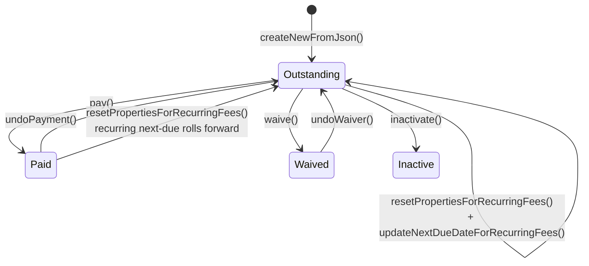
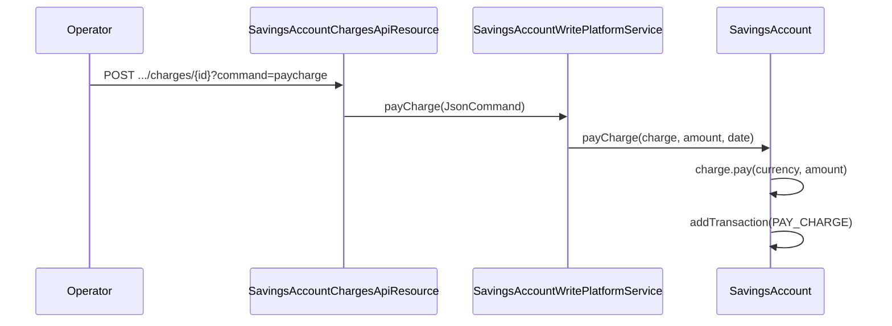
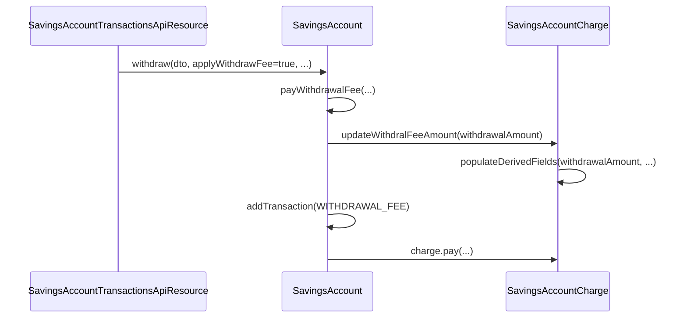
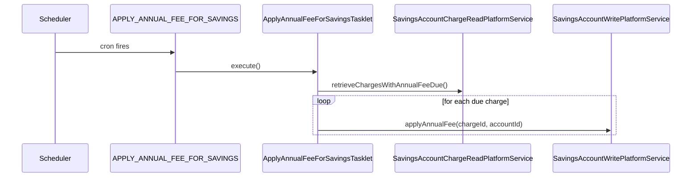
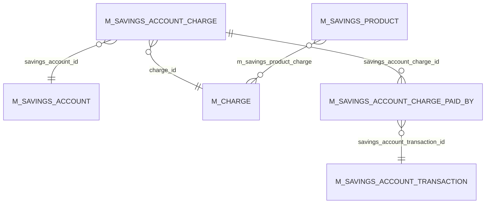

Apache Fineract attaches **charges** to savings/deposit accounts through the `SavingsAccountCharge` entity. A charge is the per-account instance of a global `Charge` definition: when due, when last paid, how much is outstanding, whether it has been waived or written off. This page walks the entity, the time-type taxonomy that drives when it fires, the pay/waive logic, the REST surface, and the two Spring Batch jobs that run charges in bulk.

## JPA mapping

```java
// fineract-savings/.../portfolio/savings/domain/SavingsAccountCharge.java
@Entity
@Table(name = "m_savings_account_charge")
public class SavingsAccountCharge extends AbstractAuditableWithUTCDateTimeCustom<Long> {

    @ManyToOne(optional = false) @JoinColumn(name = "savings_account_id", nullable = false)
    private SavingsAccount savingsAccount;
    @ManyToOne(optional = false) @JoinColumn(name = "charge_id", nullable = false)
    private Charge charge;

    @Column(name = "charge_time_enum",      nullable = false) private Integer chargeTime;
    @Column(name = "charge_due_date")                          private LocalDate dueDate;
    @Column(name = "fee_on_month")                             private Integer feeOnMonth;
    @Column(name = "fee_on_day")                               private Integer feeOnDay;
    @Column(name = "fee_interval")                             private Integer feeInterval;
    @Column(name = "charge_calculation_enum")                  private Integer chargeCalculation;
    @Column(name = "free_withdrawal_count")                    private Integer freeWithdrawalCount;
    @Column(name = "charge_reset_date")                        private LocalDate chargeResetDate;
    @Column(name = "calculation_percentage")                   private BigDecimal percentage;
    @Column(name = "calculation_on_amount")                    private BigDecimal amountPercentageAppliedTo;
    @Column(name = "amount",               nullable = false)   private BigDecimal amount;
    @Column(name = "amount_paid_derived")                      private BigDecimal amountPaid;
    @Column(name = "amount_waived_derived")                    private BigDecimal amountWaived;
    @Column(name = "amount_writtenoff_derived")                private BigDecimal amountWrittenOff;
    @Column(name = "amount_outstanding_derived", nullable=false) private BigDecimal amountOutstanding;
    @Column(name = "is_penalty",      nullable = false)        private boolean penaltyCharge = false;
    @Column(name = "is_paid_derived", nullable = false)        private boolean paid    = false;
    @Column(name = "waived",          nullable = false)        private boolean waived  = false;
    @Column(name = "is_active",       nullable = false)        private boolean status  = true;
    @Column(name = "inactivated_on_date")                      private LocalDate inactivationDate;
}
```

Each row represents *one instance* of a charge attached to one savings account. The relationship to the global `Charge` definition (in `m_charge`, owned by `fineract-core/.../portfolio/charge/domain/Charge.java`) is `@ManyToOne` — a single global definition can spawn many account-level rows.

## The time-type taxonomy

`charge_time_enum` is a `ChargeTimeType` value (`fineract-core/.../portfolio/charge/domain/ChargeTimeType.java`). Only a subset is meaningful for savings:

| Value | Constant | Meaning |
| --- | --- | --- |
| 2 | `SPECIFIED_DUE_DATE` | One-off fee on a user-specified date. |
| 3 | `SAVINGS_ACTIVATION` | Fires once when the account is activated. |
| 4 | `SAVINGS_CLOSURE` | Fires when the account is closed. |
| 5 | `WITHDRAWAL_FEE` | Auto-applied with every withdrawal. |
| 6 | `ANNUAL_FEE` | Recurs once a year on `feeOnMonth/feeOnDay`. |
| 7 | `MONTHLY_FEE` | Recurs every N months (`feeInterval`) on `feeOnDay`. |
| 10 | `OVERDRAFT_FEE` | Penalty when the account goes negative. |
| 11 | `WEEKLY_FEE` | Recurs every N weeks on `feeOnDay` (ISO day of week). |
| 16 | `SAVINGS_NOACTIVITY_FEE` | Fires when the no-activity threshold is reached. |

The entity exposes one boolean per type:

```java
// SavingsAccountCharge.java
public boolean isOnSpecifiedDueDate() { return ChargeTimeType.fromInt(chargeTime).isOnSpecifiedDueDate(); }
public boolean isSavingsActivation()  { return ChargeTimeType.fromInt(chargeTime).isSavingsActivation(); }
public boolean isSavingsNoActivity()  { return ChargeTimeType.fromInt(chargeTime).isSavingsNoActivityFee(); }
public boolean isWithdrawalFee()      { return ChargeTimeType.fromInt(chargeTime).isWithdrawalFee(); }
public boolean isAnnualFee()          { return ChargeTimeType.fromInt(chargeTime).isAnnualFee(); }
public boolean isMonthlyFee()         { return ChargeTimeType.fromInt(chargeTime).isMonthlyFee(); }
public boolean isWeeklyFee()          { return ChargeTimeType.fromInt(chargeTime).isWeeklyFee(); }
```

These booleans drive when and how the constructor populates `dueDate`, `feeOnMonth`, `feeOnDay`, `feeInterval`.

## Constructor branches

The private constructor is where the routing happens:

```java
// SavingsAccountCharge.java — abbreviated
private SavingsAccountCharge(SavingsAccount account, Charge def, BigDecimal amount,
                             ChargeTimeType chargeTime, ChargeCalculationType calc,
                             LocalDate dueDate, boolean status, MonthDay feeOnMonthDay, Integer feeInterval) {
    this.savingsAccount  = account;
    this.charge          = def;
    this.penaltyCharge   = def.isPenalty();
    this.chargeTime      = (chargeTime == null) ? def.getChargeTimeType() : chargeTime.getValue();

    if (isOnSpecifiedDueDate() && dueDate == null) {
        throw new SavingsAccountChargeWithoutMandatoryFieldException(...);
    }

    if (isAnnualFee() || isMonthlyFee()) {
        feeOnMonthDay = (feeOnMonthDay == null) ? def.getFeeOnMonthDay() : feeOnMonthDay;
        if (feeOnMonthDay == null) { throw new SavingsAccountChargeWithoutMandatoryFieldException(...); }
        this.feeOnMonth = feeOnMonthDay.getMonthValue();
        this.feeOnDay   = feeOnMonthDay.getDayOfMonth();
    } else if (isWeeklyFee()) {
        // For weekly fees feeOnDay is ISO day of the week (Mon=1)
        this.feeOnDay = dueDate.get(ChronoField.DAY_OF_WEEK);
    } else {
        this.feeOnDay = null; this.feeOnMonth = null; this.feeInterval = null;
    }

    if (isMonthlyFee() || isWeeklyFee()) {
        this.feeInterval = (feeInterval == null) ? def.feeInterval() : feeInterval;
    }

    this.dueDate           = dueDate;
    this.chargeCalculation = def.getChargeCalculation();
    if (calc != null) this.chargeCalculation = calc.getValue();

    BigDecimal chargeAmount = def.getAmount();
    if (amount != null) chargeAmount = amount;
    populateDerivedFields(BigDecimal.ZERO, chargeAmount);

    if (this.isWithdrawalFee() || this.isSavingsNoActivity()) {
        // these never have a permanent outstanding amount; outstanding is computed per-transaction
        this.amountOutstanding = BigDecimal.ZERO;
    }
    this.paid   = determineIfFullyPaid();
    this.status = status;
}
```

Notice the two exceptions thrown for missing `dueDate` / `feeOnMonthDay` — Fineract treats those as **mandatory** fields, not optional, for the relevant time-types.

## `populateDerivedFields` — calculation routing

`charge_calculation_enum` maps to a `ChargeCalculationType`. Only `FLAT` and `PERCENT_OF_AMOUNT` are meaningful for savings; everything else collapses to a zero-outstanding placeholder:

```java
// SavingsAccountCharge.java :: populateDerivedFields(BigDecimal txnAmount, BigDecimal chargeAmount)
switch (ChargeCalculationType.fromInt(this.chargeCalculation)) {
    case FLAT:
        this.percentage = null;
        this.amount = chargeAmount;
        this.amountPercentageAppliedTo = null;
        this.amountOutstanding = chargeAmount;
        // …
    break;
    case PERCENT_OF_AMOUNT:
        this.percentage = chargeAmount;             // stored "amount" is read as the %
        this.amountPercentageAppliedTo = txnAmount;
        this.amount = percentageOf(this.amountPercentageAppliedTo, this.percentage);
        this.amountOutstanding = calculateOutstanding();
    break;
    case PERCENT_OF_AMOUNT_AND_INTEREST:
    case PERCENT_OF_INTEREST:
    case PERCENT_OF_DISBURSEMENT_AMOUNT:
    case INVALID:
        // not supported for savings — zero out everything
        this.percentage = null; this.amount = null;
        this.amountPercentageAppliedTo = null;
        this.amountOutstanding = BigDecimal.ZERO;
    break;
}
```

So a `PERCENT_OF_AMOUNT` withdrawal fee is computed every time it fires — `populateDerivedFields(withdrawalAmount, percentage)` is called from `updateWithdralFeeAmount(...)` (sic — the typo is in the source method name) immediately before the fee is paid.

## Pay, waive, undo

The lifecycle of a single charge is a small state machine:



The core methods are short and each updates `amountOutstanding`, `paid`, `waived`:

```java
public Money pay(MonetaryCurrency currency, Money amountPaid) {
    Money amountPaidToDate = Money.of(currency, this.amountPaid).plus(amountPaid);
    Money outstanding = Money.of(currency, this.amountOutstanding).minus(amountPaid);
    this.amountPaid        = amountPaidToDate.getAmount();
    this.amountOutstanding = outstanding.getAmount();
    this.paid              = determineIfFullyPaid();
    if (BigDecimal.ZERO.compareTo(this.amountOutstanding) == 0) {
        updateNextDueDateForRecurringFees();   // roll annual/monthly/weekly forward
        resetPropertiesForRecurringFees();     // re-arm outstanding for the next cycle
    }
    return Money.of(currency, this.amountOutstanding);
}

public Money waive(MonetaryCurrency currency) {
    Money outstanding = Money.of(currency, this.amountOutstanding);
    this.amountWaived      = Money.of(currency, this.amountWaived).plus(outstanding).getAmount();
    this.amountOutstanding = BigDecimal.ZERO;
    this.waived = true;
    resetPropertiesForRecurringFees();
    updateNextDueDateForRecurringFees();
    return outstanding;
}

public void undoPayment(MonetaryCurrency currency, Money txnAmount) { /* reverse pay() */ }
public void undoWaiver(MonetaryCurrency currency, Money txnAmount)  { /* reverse waive() */ }
```

`resetPropertiesForRecurringFees()` only fires for the three recurring time-types and re-arms `amountOutstanding = amount` so the next cycle has a balance to collect.

The link to the actual money-moving transaction goes through `SavingsAccountChargePaidBy` (a join table row), so the audit trail is symmetrical: every paid amount is traceable to a `SavingsAccountTransaction` of type `PAY_CHARGE` / `WITHDRAWAL_FEE` / `ANNUAL_FEE`.

## REST surface: `SavingsAccountChargesApiResource`

```java
// fineract-provider/.../portfolio/savings/api/SavingsAccountChargesApiResource.java
@Path("/v1/savingsaccounts/{savingsAccountId}/charges")
public class SavingsAccountChargesApiResource { ... }
```

| HTTP | Path | Action |
| --- | --- | --- |
| GET | `/v1/savingsaccounts/{id}/charges` | List active charges on an account. |
| GET | `/v1/savingsaccounts/{id}/charges/template` | Eligible charges to attach. |
| GET | `/v1/savingsaccounts/{id}/charges/{chargeId}` | Single-charge detail. |
| POST | `/v1/savingsaccounts/{id}/charges` | Attach a charge to the account. |
| POST | `/v1/savingsaccounts/{id}/charges/{chargeId}?command=waive` | Waive. |
| POST | `/v1/savingsaccounts/{id}/charges/{chargeId}?command=paycharge` | Force-pay (against the available balance). |
| POST | `/v1/savingsaccounts/{id}/charges/{chargeId}?command=inactivate` | Stop a recurring charge. |
| PUT | `/v1/savingsaccounts/{id}/charges/{chargeId}` | Update amount / due date. |
| DELETE | `/v1/savingsaccounts/{id}/charges/{chargeId}` | Detach. |

Writes flow through `PortfolioCommandSourceWritePlatformService` → handlers in `fineract-provider/.../portfolio/savings/handler/` → `SavingsAccountWritePlatformServiceJpaRepositoryImpl` → the entity methods listed above.

## How charges fire: three pathways

There are three ways a charge gets paid, each with its own trigger:







## The `APPLY_ANNUAL_FEE_FOR_SAVINGS` job

```java
// fineract-provider/.../portfolio/savings/jobs/applyannualfeeforsavings/ApplyAnnualFeeForSavingsTasklet.java
@Slf4j
@RequiredArgsConstructor
public class ApplyAnnualFeeForSavingsTasklet implements Tasklet {

    private final SavingsAccountChargeReadPlatformService savingsAccountChargeReadPlatformService;
    private final SavingsAccountWritePlatformService savingsAccountWritePlatformService;

    @Override
    public RepeatStatus execute(StepContribution contribution, ChunkContext chunkContext) throws Exception {
        final Collection<SavingsAccountAnnualFeeData> annualFeeData =
                savingsAccountChargeReadPlatformService.retrieveChargesWithAnnualFeeDue();

        for (final SavingsAccountAnnualFeeData ref : annualFeeData) {
            try {
                savingsAccountWritePlatformService.applyAnnualFee(ref.getId(), ref.getAccountId());
            } catch (final PlatformApiDataValidationException e) {
                for (final ApiParameterError error : e.getErrors()) {
                    log.error("Apply annual fee failed for account: {} with message {}", ref.getAccountNo(), error);
                }
            } catch (final Exception ex) {
                log.error("Apply annual fee failed for account: {}", ref.getAccountNo(), ex);
            }
        }
        return RepeatStatus.FINISHED;
    }
}
```

It runs single-threaded over every charge whose next-due date is on or before today and fires `applyAnnualFee(chargeId, accountId)` on the write service. Exceptions are caught per-charge so one bad row does not stop the batch — the job logs and moves on. The job is registered as `APPLY_ANNUAL_FEE_FOR_SAVINGS("Apply Annual Fee For Savings")` in `fineract-core/.../infrastructure/jobs/service/JobName.java`.

## The `PAY_DUE_SAVINGS_CHARGES` job

`PAY_DUE_SAVINGS_CHARGES` is the catch-all charge-collection job — it runs over every `SavingsAccountCharge` whose due date is on or before today and posts a `PAY_CHARGE` transaction. Source: `fineract-provider/.../portfolio/savings/jobs/payduesavingscharges/PayDueSavingsChargesTasklet.java`. The shape mirrors the annual-fee job: read due rows, loop, call `applyChargeDue(chargeId, accountId)` on the write service.

The two jobs are separate because:

- `APPLY_ANNUAL_FEE_FOR_SAVINGS` *creates* the `ANNUAL_FEE` transaction (and rolls the next-due date forward).
- `PAY_DUE_SAVINGS_CHARGES` *collects* outstanding charge balances irrespective of time-type.

An annual fee with `chargeCalculation = FLAT` will go through both — the first creates the fee, the second collects it from the account balance.

## ER picture



## Validation

Two validators sit on the input path:

- `SavingsAccountChargeDataValidator` in `fineract-savings/.../portfolio/savings/data/` — input shape, required fields, frequency coherence.
- Inside the entity, the constructor throws `SavingsAccountChargeWithoutMandatoryFieldException` when `dueDate` or `feeOnMonthDay` is missing for the relevant time-type.

The repository façade `SavingsAccountChargeRepositoryWrapper` in `fineract-savings/.../portfolio/savings/domain/` provides typed not-found exceptions (`SavingsAccountChargeNotFoundException`).

## Source paths

- `fineract-savings/src/main/java/org/apache/fineract/portfolio/savings/domain/SavingsAccountCharge.java`
- `fineract-savings/src/main/java/org/apache/fineract/portfolio/savings/domain/SavingsAccountChargeAssembler.java`
- `fineract-savings/src/main/java/org/apache/fineract/portfolio/savings/domain/SavingsAccountChargePaidBy.java`
- `fineract-savings/src/main/java/org/apache/fineract/portfolio/savings/domain/SavingsAccountChargeRepository.java`
- `fineract-savings/src/main/java/org/apache/fineract/portfolio/savings/domain/SavingsAccountChargeRepositoryWrapper.java`
- `fineract-savings/src/main/java/org/apache/fineract/portfolio/savings/data/SavingsAccountChargeDataValidator.java`
- `fineract-savings/src/main/java/org/apache/fineract/portfolio/savings/data/SavingsAccountAnnualFeeData.java`
- `fineract-savings/src/main/java/org/apache/fineract/portfolio/savings/service/SavingsAccountChargeReadPlatformService.java`
- `fineract-core/src/main/java/org/apache/fineract/portfolio/charge/domain/ChargeTimeType.java`
- `fineract-core/src/main/java/org/apache/fineract/portfolio/charge/domain/ChargeCalculationType.java`
- `fineract-provider/src/main/java/org/apache/fineract/portfolio/savings/api/SavingsAccountChargesApiResource.java` — `/v1/savingsaccounts/{id}/charges`
- `fineract-provider/src/main/java/org/apache/fineract/portfolio/savings/service/SavingsAccountChargeReadPlatformServiceImpl.java`
- `fineract-provider/src/main/java/org/apache/fineract/portfolio/savings/jobs/applyannualfeeforsavings/ApplyAnnualFeeForSavingsTasklet.java`
- `fineract-provider/src/main/java/org/apache/fineract/portfolio/savings/jobs/applyannualfeeforsavings/ApplyAnnualFeeForSavingsConfig.java`
- `fineract-provider/src/main/java/org/apache/fineract/portfolio/savings/jobs/payduesavingscharges/PayDueSavingsChargesTasklet.java`
- `fineract-provider/src/main/java/org/apache/fineract/portfolio/savings/jobs/payduesavingscharges/PayDueSavingsChargesConfig.java`
- `fineract-core/src/main/java/org/apache/fineract/infrastructure/jobs/service/JobName.java` — `APPLY_ANNUAL_FEE_FOR_SAVINGS`, `PAY_DUE_SAVINGS_CHARGES`
