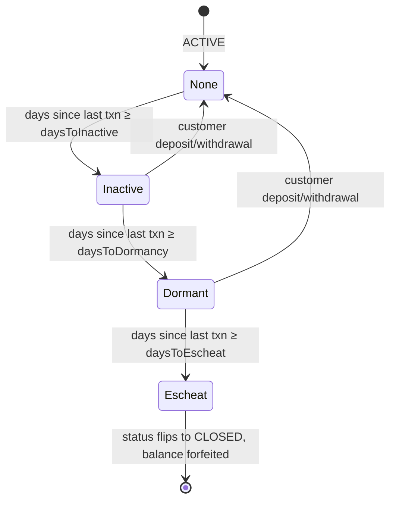
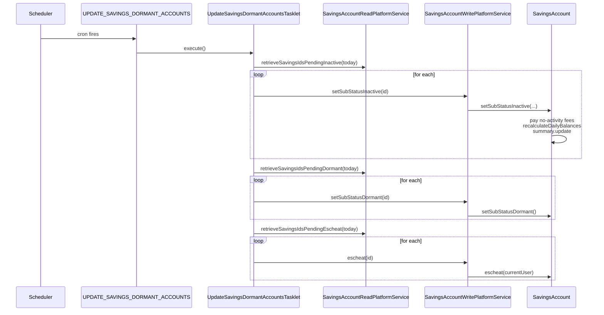

A savings account that has had no customer activity for a long time goes through a four-stage dormancy ladder in Apache Fineract: **active → inactive → dormant → escheat**. The progression is driven by the `UPDATE_SAVINGS_DORMANT_ACCOUNTS` scheduled job, configured per-product by three day-count knobs (`daysToInactive`, `daysToDormancy`, `daysToEscheat`). A sibling job, `UPDATE_DEPOSITS_ACCOUNT_MATURITY_DETAILS`, advances fixed and recurring deposit accounts from ACTIVE → MATURED on the configured maturity date.

This page walks both, plus the sub-status manipulations they trigger inside `SavingsAccount`.

## The sub-status enum

The four dormancy states (plus three operational blocks) live in `SavingsAccountSubStatusEnum`:

```java
// fineract-core/.../portfolio/savings/domain/SavingsAccountSubStatusEnum.java
public enum SavingsAccountSubStatusEnum {
    NONE(0,         "..."),
    INACTIVE(100,   "..."),
    DORMANT(200,    "..."),
    ESCHEAT(300,    "..."),
    BLOCK(400,      "..."),
    BLOCK_CREDIT(500, "..."),
    BLOCK_DEBIT(600,  "...");
}
```

Sub-status is orthogonal to the primary `SavingsAccountStatusType`. An account that has gone dormant is *still* `status_enum = 300 ACTIVE` — only `sub_status_enum` changes. Escheat is the one exception: it forces `status_enum = 600 CLOSED` as well, because the account is terminated and the balance forfeited.

## The four dormancy knobs (per product)

`SavingsProduct` carries:

```java
@Column(name = "is_dormancy_tracking_active") private Boolean isDormancyTrackingActive;
@Column(name = "days_to_inactive")            private Long daysToInactive;
@Column(name = "days_to_dormancy")            private Long daysToDormancy;
@Column(name = "days_to_escheat")             private Long daysToEscheat;
```

The job only considers accounts whose product has `isDormancyTrackingActive = true`. For each candidate it consults the three day-counts: how many days *since the last customer transaction* before the account is flipped to the next stage.

## The ladder



The "customer deposit/withdrawal" arrow back to NONE is implemented in `SavingsAccount.deposit(...)` and `.withdraw(...)`:

```java
// SavingsAccount.java — both deposit() and withdraw()
if (this.sub_status.equals(SavingsAccountSubStatusEnum.INACTIVE.getValue())
        || this.sub_status.equals(SavingsAccountSubStatusEnum.DORMANT.getValue())) {
    this.sub_status = SavingsAccountSubStatusEnum.NONE.getValue();
}
```

Any normal customer activity resets the clock. ESCHEAT is terminal — there is no recovery path; the customer money is gone.

## `setSubStatusInactive` and the no-activity fee

Crossing the *inactive* threshold has a side-effect: it auto-pays any `SAVINGS_NO_ACTIVITY_FEE` charges that are attached to the account.

```java
// SavingsAccount.java :: setSubStatusInactive(boolean backdatedTxnsAllowedTill)
public void setSubStatusInactive(final boolean backdatedTxnsAllowedTill) {
    this.sub_status = SavingsAccountSubStatusEnum.INACTIVE.getValue();
    LocalDate transactionDate = DateUtils.getBusinessLocalDate();
    for (SavingsAccountCharge charge : this.charges()) {
        if (charge.isSavingsNoActivity() && charge.isActive()) {
            charge.updateWithdralFeeAmount(this.getAccountBalance());
            UUID refNo = UUID.randomUUID();
            this.payCharge(charge, charge.getAmountOutstanding(this.getCurrency()),
                    transactionDate, backdatedTxnsAllowedTill, refNo.toString());
        }
    }
    recalculateDailyBalances(Money.zero(this.currency), transactionDate, backdatedTxnsAllowedTill, false);
    this.summary.updateSummary(this.currency, this.savingsAccountTransactionSummaryWrapper, this.transactions);
}
```

This is why the `SAVINGS_NO_ACTIVITY_FEE` time-type exists in `ChargeTimeType` — it fires exactly when the dormancy job pushes an account into INACTIVE.

## Escheat

```java
// SavingsAccount.java :: escheat(AppUser appUser)
public void escheat(AppUser appUser) {
    this.status = SavingsAccountStatusType.CLOSED.getValue();
    this.sub_status = SavingsAccountSubStatusEnum.ESCHEAT.getValue();
    this.closedOnDate = DateUtils.getBusinessLocalDate();
    this.closedBy = appUser;
    LocalDate transactionDate = DateUtils.getBusinessLocalDate();
    if (this.getSummary().getAccountBalance(this.getCurrency()).isGreaterThanZero()) {
        SavingsAccountTransaction transaction =
                SavingsAccountTransaction.escheat(this, transactionDate, /*postInterestAsOnDate*/ false);
        this.transactions.add(transaction);
    }
    recalculateDailyBalances(Money.zero(this.currency), transactionDate, false, false);
    this.summary.updateSummary(this.currency, this.savingsAccountTransactionSummaryWrapper, this.transactions);
}
```

So escheat:

1. Flips status to CLOSED and sub-status to ESCHEAT.
2. Stamps `closedOnDate` and `closedBy`.
3. If the balance is positive, writes a single `ESCHEAT` (`19`) debit transaction equal to the whole balance.
4. Recomputes balances + summary so the cached `account_balance_derived` lands at zero.

Note that `ESCHEAT.isDebit()` returns *false* even though its `TransactionEntryType` is `DEBIT` — see [Savings transactions](/savings/savings-transactions). That intentional asymmetry means the standard `recalculateDailyBalances` loop doesn't double-deduct; the balance falls to zero from the explicit `escheat` transaction processing in `summary.updateSummary(...)`.

## The `UPDATE_SAVINGS_DORMANT_ACCOUNTS` tasklet

```java
// fineract-provider/.../portfolio/savings/jobs/updatesavingsdormantaccounts/UpdateSavingsDormantAccountsTasklet.java
@Slf4j
@RequiredArgsConstructor
@Component
public class UpdateSavingsDormantAccountsTasklet implements Tasklet {

    private final SavingsAccountReadPlatformService savingAccountReadPlatformService;
    private final SavingsAccountWritePlatformService savingsAccountWritePlatformService;

    @Override
    public RepeatStatus execute(StepContribution contribution, ChunkContext chunkContext) throws Exception {
        LocalDate tenantLocalDate = DateUtils.getBusinessLocalDate();

        List<Long> savingsPendingInactive = savingAccountReadPlatformService.retrieveSavingsIdsPendingInactive(tenantLocalDate);
        if (savingsPendingInactive != null && savingsPendingInactive.size() > 0) {
            for (Long savingsId : savingsPendingInactive) {
                savingsAccountWritePlatformService.setSubStatusInactive(savingsId);
            }
        }

        List<Long> savingsPendingDormant = savingAccountReadPlatformService.retrieveSavingsIdsPendingDormant(tenantLocalDate);
        if (savingsPendingDormant != null && savingsPendingDormant.size() > 0) {
            for (Long savingsId : savingsPendingDormant) {
                savingsAccountWritePlatformService.setSubStatusDormant(savingsId);
            }
        }

        List<Long> savingsPendingEscheat = savingAccountReadPlatformService.retrieveSavingsIdsPendingEscheat(tenantLocalDate);
        if (savingsPendingEscheat != null && savingsPendingEscheat.size() > 0) {
            for (Long savingsId : savingsPendingEscheat) {
                savingsAccountWritePlatformService.escheat(savingsId);
            }
        }
        return RepeatStatus.FINISHED;
    }
}
```

The body is intentionally linear and unparallelised. The three `retrieveSavingsIdsPending*` reads each run a SQL query whose `WHERE` clause joins `m_savings_account` to `m_savings_product` and compares `(today − last_transaction_date)` against `days_to_inactive`/`days_to_dormancy`/`days_to_escheat`. The read service does the calendar arithmetic in SQL so the tasklet just iterates ids.

The order matters — inactive first (so freshly-inactive accounts can pay the no-activity fee), then dormant, then escheat. Pushing the same account through multiple transitions in one run is legal: if it has been inactive for long enough already, it will appear in *both* the pending-inactive and pending-dormant lists, and the second loop will flip it again.

The job is registered as `UPDATE_SAVINGS_DORMANT_ACCOUNTS("Update Savings Dormant Accounts")` in `JobName.java`.



## The `UPDATE_DEPOSITS_ACCOUNT_MATURITY_DETAILS` tasklet

This is the FD/RD counterpart. Every active fixed or recurring deposit that has reached its maturity date needs to be flipped to `MATURED` and have the configured on-closure action applied (withdraw, transfer to linked savings, or reinvest).

```java
// fineract-provider/.../portfolio/savings/jobs/updatedepositsaccountmaturitydetails/UpdateDepositsAccountMaturityDetailsTasklet.java
@Slf4j
@RequiredArgsConstructor
public class UpdateDepositsAccountMaturityDetailsTasklet implements Tasklet {

    private final DepositAccountReadPlatformService depositAccountReadPlatformService;
    private final DepositAccountWritePlatformService depositAccountWritePlatformService;

    @Override
    public RepeatStatus execute(StepContribution contribution, ChunkContext chunkContext) throws Exception {
        final Collection<DepositAccountData> depositAccounts = depositAccountReadPlatformService.retrieveForMaturityUpdate();

        for (final DepositAccountData depositAccount : depositAccounts) {
            try {
                final DepositAccountType depositAccountType =
                        DepositAccountType.fromInt(depositAccount.getDepositType().getId().intValue());
                depositAccountWritePlatformService.updateMaturityDetails(depositAccount.getId(), depositAccountType);
            } catch (final PlatformApiDataValidationException e) {
                for (final ApiParameterError error : e.getErrors()) {
                    log.error("Update maturity details failed for account: {} with message {}",
                            depositAccount.getAccountNo(), error.getDeveloperMessage());
                }
            } catch (final Exception ex) {
                log.error("Update maturity details failed for account: {}", depositAccount.getAccountNo(), ex);
            }
        }
        log.debug("{}: Records affected by updateMaturityDetailsOfDepositAccounts: {}",
                ThreadLocalContextUtil.getTenant().getName(), depositAccounts.size());
        return RepeatStatus.FINISHED;
    }
}
```

What `DepositAccountWritePlatformService.updateMaturityDetails(id, type)` actually does depends on `DepositAccountTermAndPreClosure.onAccountClosureType`:

| onAccountClosureType | Behaviour |
| --- | --- |
| `WITHDRAW_DEPOSIT` (100) | Flip status to `MATURED`; the customer must close manually. |
| `TRANSFER_TO_SAVINGS` (200) | Flip to `MATURED`, transfer principal + interest to `transferToSavingsAccountId`. |
| `REINVEST_PRINCIPAL_AND_INTEREST` (300) | Open a new FD/RD on the same product with principal = (old principal + interest). |
| `REINVEST_PRINCIPAL_ONLY` (400) | Open a new FD/RD with principal = old principal; pay out interest. |

For recurring deposits, the same job also re-runs `updateOverduePayments(today)` (see [Recurring deposits](/savings/recurring-deposits)) so the `noOfOverdueInstallments` / `totalOverdueAmount` roll-up stays current even on accounts that haven't seen activity.

The job is registered as `UPDATE_DEPOSITS_ACCOUNT_MATURITY_DETAILS("Update Deposit Accounts Maturity details")`.

## Configuration knobs

| Knob | Where | Effect |
| --- | --- | --- |
| `m_savings_product.is_dormancy_tracking_active` | Per product | Master switch — false means the dormancy job ignores accounts of this product. |
| `m_savings_product.days_to_inactive` | Per product | Days of inactivity before INACTIVE. |
| `m_savings_product.days_to_dormancy` | Per product | Days of inactivity before DORMANT. |
| `m_savings_product.days_to_escheat` | Per product | Days of inactivity before ESCHEAT. |
| `m_deposit_account_term_and_preclosure.on_account_closure_enum` | Per FD/RD account | Drives the maturity job's action. |
| `m_deposit_account_term_and_preclosure.transfer_interest_to_linked_account` | Per FD account | Toggles the `TRANSFER_INTEREST_TO_SAVINGS` job for this account. |
| `m_deposit_account_term_and_preclosure.transfer_to_savings_account_id` | Per FD/RD account | Destination for `TRANSFER_TO_SAVINGS` closure / interest transfer. |

## Full job catalogue (savings & deposits)

All eight scheduled jobs that touch savings/deposits, with their registered name constants:

| `JobName` constant | Human name | Tasklet | What it does |
| --- | --- | --- | --- |
| `POST_INTEREST_FOR_SAVINGS` | Post Interest For Savings | `PostInterestForSavingTasklet` | Computes and posts accrued interest for every active savings account. Parallelised. |
| `APPLY_ANNUAL_FEE_FOR_SAVINGS` | Apply Annual Fee For Savings | `ApplyAnnualFeeForSavingsTasklet` | Creates `ANNUAL_FEE` transactions and rolls next-due dates forward. |
| `PAY_DUE_SAVINGS_CHARGES` | Pay Due Savings Charges | `PayDueSavingsChargesTasklet` | Collects any due charge by posting a `PAY_CHARGE` against the account balance. |
| `UPDATE_SAVINGS_DORMANT_ACCOUNTS` | Update Savings Dormant Accounts | `UpdateSavingsDormantAccountsTasklet` | The dormancy ladder. |
| `UPDATE_DEPOSITS_ACCOUNT_MATURITY_DETAILS` | Update Deposit Accounts Maturity details | `UpdateDepositsAccountMaturityDetailsTasklet` | Flips FD/RD to MATURED, applies on-closure instructions. |
| `TRANSFER_INTEREST_TO_SAVINGS` | Transfer Interest To Savings | `TransferInterestToSavingsTasklet` | Mirrors FD interest postings into the linked savings account. |
| `GENERATE_RD_SCEHDULE` | Generate Mandatory Savings Schedule | `GenerateRdScheduleTasklet` | Tops up the recurring-deposit installment schedule to maintain 5 future installments. |
| `POST_DIVIDENTS_FOR_SHARES` | Post Dividends For Shares | `PostDividentsForSharesTasklet` | Posts approved share dividends back to the member's linked savings account. |

The first column matches the enum constant in `fineract-core/.../infrastructure/jobs/service/JobName.java`. Typo notes:

- `GENERATE_RD_SCEHDULE` — the constant name has the typo, the display name "Generate Mandatory Savings Schedule" is correct.
- `POST_DIVIDENTS_FOR_SHARES` — "DIVIDENTS" is misspelt in both the constant and the display name. Do not fix; every config row references the typo verbatim.

## Source paths

- `fineract-core/src/main/java/org/apache/fineract/portfolio/savings/domain/SavingsAccountSubStatusEnum.java`
- `fineract-core/src/main/java/org/apache/fineract/portfolio/savings/domain/SavingsAccountStatusType.java`
- `fineract-core/src/main/java/org/apache/fineract/infrastructure/jobs/service/JobName.java`
- `fineract-savings/src/main/java/org/apache/fineract/portfolio/savings/domain/SavingsAccount.java` — `setSubStatusInactive(...)`, `setSubStatusDormant()`, `escheat(...)`
- `fineract-savings/src/main/java/org/apache/fineract/portfolio/savings/domain/SavingsProduct.java` — `daysToInactive` / `daysToDormancy` / `daysToEscheat`
- `fineract-savings/src/main/java/org/apache/fineract/portfolio/savings/service/SavingsAccountReadPlatformService.java`
- `fineract-savings/src/main/java/org/apache/fineract/portfolio/savings/service/SavingsAccountWritePlatformService.java`
- `fineract-provider/src/main/java/org/apache/fineract/portfolio/savings/jobs/updatesavingsdormantaccounts/UpdateSavingsDormantAccountsTasklet.java`
- `fineract-provider/src/main/java/org/apache/fineract/portfolio/savings/jobs/updatesavingsdormantaccounts/UpdateSavingsDormantAccountsConfig.java`
- `fineract-provider/src/main/java/org/apache/fineract/portfolio/savings/jobs/updatedepositsaccountmaturitydetails/UpdateDepositsAccountMaturityDetailsTasklet.java`
- `fineract-provider/src/main/java/org/apache/fineract/portfolio/savings/jobs/updatedepositsaccountmaturitydetails/UpdateDepositsAccountMaturityDetailsConfig.java`
- `fineract-provider/src/main/java/org/apache/fineract/portfolio/savings/service/SavingsAccountReadPlatformServiceImpl.java` — `retrieveSavingsIdsPendingInactive/Dormant/Escheat`
- `fineract-provider/src/main/java/org/apache/fineract/portfolio/savings/service/SavingsAccountWritePlatformServiceJpaRepositoryImpl.java` — `setSubStatusInactive`, `setSubStatusDormant`, `escheat`
- `fineract-provider/src/main/java/org/apache/fineract/portfolio/savings/service/DepositAccountWritePlatformServiceJpaRepositoryImpl.java` — `updateMaturityDetails`
- `fineract-provider/src/main/java/org/apache/fineract/portfolio/savings/service/DepositAccountReadPlatformServiceImpl.java` — `retrieveForMaturityUpdate`
