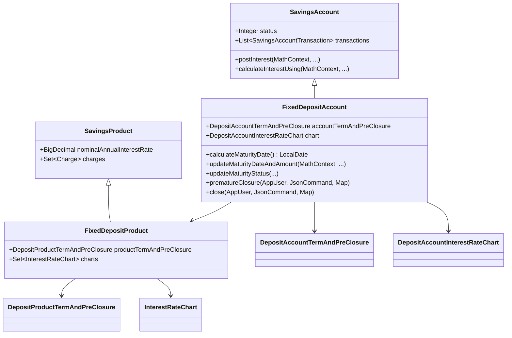
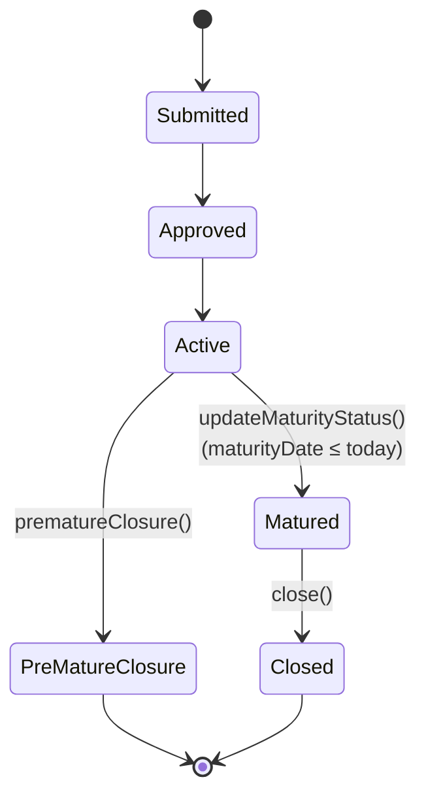
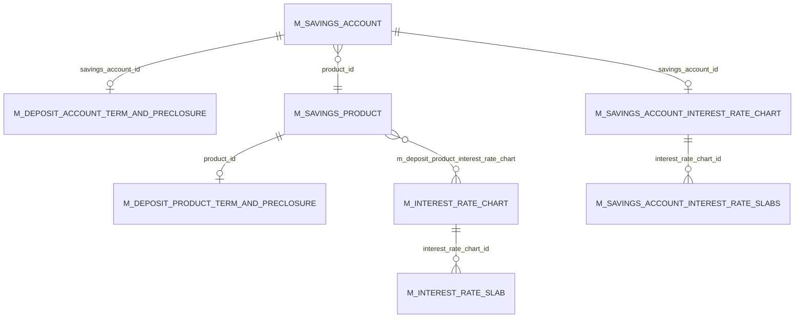

A **fixed deposit** in Apache Fineract is a savings account that locks principal for a fixed term and pays a fixed interest rate (or a tiered rate from an interest-rate chart). Mechanically it is a `SavingsAccount` subclass: the same ledger, the same transaction taxonomy, the same compounding/posting periods — plus a maturity date, a deposit-term aggregate, and a pre-closure penalty.

This page walks the entity hierarchy, the lifecycle additions, the maturity computation, the pre-closure penalty logic, and the REST surface.

## Class hierarchy



## `FixedDepositAccount`

```java
// fineract-provider/.../portfolio/savings/domain/FixedDepositAccount.java
@Entity
@DiscriminatorValue("200")
public class FixedDepositAccount extends SavingsAccount {

    @OneToOne(mappedBy = "account", cascade = CascadeType.ALL)
    private DepositAccountTermAndPreClosure accountTermAndPreClosure;

    @OneToOne(fetch = FetchType.LAZY, cascade = CascadeType.ALL, mappedBy = "account")
    protected DepositAccountInterestRateChart chart;

    @Transient protected InterestRateChartAssembler chartAssembler;
    @Transient private ConfigurationDomainService configurationDomainService;

    public static FixedDepositAccount createNewApplicationForSubmittal(Client client, Group group, SavingsProduct product, ...) {
        final SavingsAccountStatusType status = SavingsAccountStatusType.SUBMITTED_AND_PENDING_APPROVAL;
        final boolean allowOverdraft = false;                       // FD never goes overdraft
        final BigDecimal overdraftLimit = new BigDecimal(0);
        return new FixedDepositAccount(client, group, product, ...);
    }
}
```

Two things separate FD from plain savings at the JPA level:

1. The discriminator value `200` selects this class when Hibernate/EclipseLink reads `m_savings_account.deposit_type_enum = 200`.
2. Two one-to-one children — the term/pre-closure aggregate and the per-account copy of the interest-rate chart — encode "fixed-term-ness".

### The `MATURED` and `PRE_MATURE_CLOSURE` statuses

FD reuses `SavingsAccountStatusType` but adds two more values that plain savings never enters:

| Value | Meaning |
| --- | --- |
| 300 ACTIVE | After approval + activation, until maturity. |
| 700 PRE_MATURE_CLOSURE | Operator closed the account before `maturityDate`. |
| 800 MATURED | Today is on or after `maturityDate`. Pushed by the `UPDATE_DEPOSITS_ACCOUNT_MATURITY_DETAILS` job, or transactionally by `updateMaturityStatus`. |

`updateMaturityStatus` flips ACTIVE → MATURED when `maturityDate` is in the past:

```java
// FixedDepositAccount.java :: updateMaturityStatus(...)
if (!DateUtils.isDateInTheFuture(maturityDate())) {
    this.status = SavingsAccountStatusType.MATURED.getValue();
    postMaturityInterest(isSavingsInterestPostingAtCurrentPeriodEnd, financialYearBeginningMonth);
}
```



`close(currentUser, command, actualChanges)` on `FixedDepositAccount` first validates `currentStatus == MATURED` before allowing closure. To close an active FD before maturity the operator must call `prematureClosure(...)` instead.

## `DepositAccountTermAndPreClosure`

This is the term-and-maturity aggregate. One row in `m_deposit_account_term_and_preclosure` per `FixedDepositAccount` (and per `RecurringDepositAccount`).

```java
// fineract-savings/.../portfolio/savings/domain/DepositAccountTermAndPreClosure.java
@Entity
@Table(name = "m_deposit_account_term_and_preclosure")
public class DepositAccountTermAndPreClosure extends AbstractPersistableCustom<Long> {

    @Column(name = "deposit_amount")                    private BigDecimal depositAmount;
    @Column(name = "maturity_amount")                   private BigDecimal maturityAmount;
    @Column(name = "maturity_date")                     private LocalDate maturityDate;
    @Column(name = "expected_firstdepositon_date")      private LocalDate expectedFirstDepositOnDate;
    @Column(name = "deposit_period")                    private Integer depositPeriod;
    @Column(name = "deposit_period_frequency_enum")     private Integer depositPeriodFrequency;
    @Column(name = "on_account_closure_enum")           private Integer onAccountClosureType;

    @Embedded private DepositPreClosureDetail preClosureDetail;
    @Embedded protected DepositTermDetail depositTermDetail;

    @OneToOne @JoinColumn(name = "savings_account_id", nullable = false)
    private SavingsAccount account;

    @Column(name = "transfer_interest_to_linked_account", nullable = false)
    private boolean transferInterestToLinkedAccount;
    @Column(name = "transfer_to_savings_account_id")    private Long transferToSavingsAccountId;
}
```

`depositPeriod` + `depositPeriodFrequency` encode the term ("36 months", "1 year", "180 days"). `expectedFirstDepositOnDate` is the optional override for when the principal will actually arrive (useful for RD; for FD it normally equals the activation date).

`onAccountClosureType` is a `DepositAccountOnClosureType`:

```java
// fineract-core/.../portfolio/savings/DepositAccountOnClosureType.java
public enum DepositAccountOnClosureType {
    INVALID(0, ...),
    WITHDRAW_DEPOSIT(100, ...),               // pay out principal+interest on maturity
    TRANSFER_TO_SAVINGS(200, ...),            // move to linked savings account
    REINVEST_PRINCIPAL_AND_INTEREST(300, ...),// roll into a new FD same term, larger principal
    REINVEST_PRINCIPAL_ONLY(400, ...);        // roll into a new FD, interest paid out
}
```

The maturity job consults this value to decide what to do once the account reaches `MATURED` — see [Dormancy & jobs](/savings/dormancy-and-jobs).

### Maturity date computation

```java
// FixedDepositAccount.java :: calculateMaturityDate()
public LocalDate calculateMaturityDate() {
    final LocalDate startDate = accountSubmittedOrActivationDate();
    LocalDate maturityDate = null;
    final Integer depositPeriod = this.accountTermAndPreClosure.depositPeriod();
    switch (this.accountTermAndPreClosure.depositPeriodFrequencyType()) {
        case DAYS:   maturityDate = startDate.plusDays(depositPeriod);   break;
        case WEEKS:  maturityDate = startDate.plusWeeks(depositPeriod);  break;
        case MONTHS: maturityDate = startDate.plusMonths(depositPeriod); break;
        case YEARS:  maturityDate = startDate.plusYears(depositPeriod);  break;
        case INVALID: break;
    }
    return maturityDate;
}
```

This is called during activation by `updateMaturityDateAndAmountBeforeAccountActivation(...)`, and again by `updateMaturityDateAndAmount(...)` if anything that changes the maturity computation (e.g. period, frequency, opening balance) is mutated.

## `DepositPreClosureDetail`

The pre-closure penalty is an `@Embeddable` value type — its columns live on `m_deposit_account_term_and_preclosure`:

```java
// fineract-savings/.../portfolio/savings/domain/DepositPreClosureDetail.java
@Embeddable
public class DepositPreClosureDetail {
    @Column(name = "pre_closure_penal_applicable")
    private boolean preClosurePenalApplicable;

    @Column(name = "pre_closure_penal_interest", scale = 6, precision = 19)
    private BigDecimal preClosurePenalInterest;

    @Column(name = "pre_closure_penal_interest_on_enum")
    private Integer preClosurePenalInterestOnType;
}
```

`pre_closure_penal_interest_on_enum` is a `PreClosurePenalInterestOnType`:

```java
// fineract-core/.../portfolio/savings/PreClosurePenalInterestOnType.java
public enum PreClosurePenalInterestOnType {
    INVALID(0, ...),
    WHOLE_TERM(1, ...),                  // penalty subtracted from rate over the entire holding period
    TILL_PREMATURE_WITHDRAWAL(2, ...);   // penalty applies only from the original maturity onwards
}
```

The two settings differ subtly. `WHOLE_TERM` means the customer effectively earned `nominalRate − preClosurePenalInterest` for every day they held the FD. `TILL_PREMATURE_WITHDRAWAL` means they earned `nominalRate` until the pre-mature withdrawal date and the penalty only deducts interest that would have been earned beyond that point.

Inside `FixedDepositAccount`, `getEffectiveInterestRateAsFraction(mc, maturityDate, isPreMatureClosure)` consults `preClosurePenalApplicable` and the type to decide which rate to feed into the `PostingPeriod` engine.

## Pre-closure flow

```java
// FixedDepositAccount.java :: prematureClosure(...)
public void prematureClosure(AppUser currentUser, JsonCommand command, Map<String, Object> actualChanges) {
    // status must be ACTIVE
    if (!SavingsAccountStatusType.ACTIVE.hasStateOf(SavingsAccountStatusType.fromInt(this.status))) {
        baseDataValidator.reset().failWithCodeNoParameterAddedToErrorCode("not.in.active.state");
        // …throw
    }

    final LocalDate closedDate = command.localDateValueOfParameterNamed("closedOnDate");

    // closed-on date must be after activation, after lockin, before maturity, ≤ today
    if (DateUtils.isBefore(closedDate, getActivationDate())) { /* must.be.after.activation.date */ }
    if (isAccountLocked(closedDate))                          { /* must.be.after.lockin.period */ }
    if (maturityDate() != null && DateUtils.isAfter(closedDate, maturityDate())) {
        /* must.be.before.maturity.date */
    }
    if (DateUtils.isAfterBusinessDate(closedDate))            { /* cannot.be.a.future.date */ }

    // closed-on date must be ≥ last transaction date
    final List<SavingsAccountTransaction> txs = retrieveListOfTransactions();
    if (!txs.isEmpty() && txs.get(txs.size() - 1).isAfter(closedDate)) {
        /* must.be.after.last.transaction.date */
    }

    this.status = SavingsAccountStatusType.PRE_MATURE_CLOSURE.getValue();

    final Integer onAccountClosureId = command.integerValueOfParameterNamed(onAccountClosureIdParamName);
    this.accountTermAndPreClosure.updateOnAccountClosureStatus(DepositAccountOnClosureType.fromInt(onAccountClosureId));

    this.closedOnDate = closedDate;
    this.closedBy     = currentUser;
    this.summary.updateSummary(this.currency, this.savingsAccountTransactionSummaryWrapper, this.transactions);
}
```

The validation cascade is interesting in its own right: every check is followed by an `if (!dataValidationErrors.isEmpty()) throw` block, so the first failing check terminates the method even though errors are collected into a builder. That is intentional — the design is "report one premature-closure failure at a time" rather than "report all failures of the cascade".

The actual money movement (withdraw the principal+interest, or transfer to the linked savings account) is performed by `DepositAccountDomainServiceJpa.handleFDAccountPreMatureClosure(...)` after this method returns.

## `FixedDepositProduct`

```java
// fineract-savings/.../portfolio/savings/domain/FixedDepositProduct.java
@Entity
@DiscriminatorValue("200")
public class FixedDepositProduct extends SavingsProduct {

    @OneToOne(mappedBy = "product", cascade = CascadeType.ALL)
    private DepositProductTermAndPreClosure productTermAndPreClosure;

    @OneToMany(fetch = FetchType.LAZY, cascade = CascadeType.ALL)
    @JoinTable(name = "m_deposit_product_interest_rate_chart",
               joinColumns        = @JoinColumn(name = "deposit_product_id"),
               inverseJoinColumns = @JoinColumn(name = "interest_rate_chart_id", unique = true))
    protected Set<InterestRateChart> charts;

    @Transient protected InterestRateChartAssembler chartAssembler;
}
```

Two new collaborators:

- `DepositProductTermAndPreClosure` — the product-level template for term/preclosure (default deposit period, min/max term, default penalty).
- `Set<InterestRateChart>` joined via `m_deposit_product_interest_rate_chart` — tiered rate tables. See [Interest rate charts](/savings/interest-rate-charts).

The factory:

```java
public static FixedDepositProduct createNew(
        String name, String shortName, String description, MonetaryCurrency currency,
        BigDecimal interestRate,
        SavingsCompoundingInterestPeriodType ipt, SavingsPostingInterestPeriodType ppt,
        SavingsInterestCalculationType ict, SavingsInterestCalculationDaysInYearType diy,
        Integer lockinPeriodFrequency, SavingsPeriodFrequencyType lockinPeriodFrequencyType,
        AccountingRuleType accountingRuleType, Set<Charge> charges,
        DepositProductTermAndPreClosure productTermAndPreClosure,
        Set<InterestRateChart> charts,
        BigDecimal minBalanceForInterestCalculation, boolean withHoldTax, TaxGroup taxGroup) {

    final BigDecimal minRequiredOpeningBalance = null;           // FD has its own depositAmount
    final boolean withdrawalFeeApplicableForTransfer = false;
    final boolean allowOverdraft = false;
    final BigDecimal overdraftLimit = null;

    return new FixedDepositProduct(...);
}
```

So the FD product *forces* `allowOverdraft = false` and ignores `minRequiredOpeningBalance`. That makes sense — fixed deposits are locked-principal products.

## REST surface

### `FixedDepositAccountsApiResource` — `/v1/fixeddepositaccounts`

```java
@Path("/v1/fixeddepositaccounts")
public class FixedDepositAccountsApiResource { ... }
```

| HTTP | Path | Purpose |
| --- | --- | --- |
| GET | `/v1/fixeddepositaccounts` | List. |
| GET | `/v1/fixeddepositaccounts/template?clientId=&productId=` | Build a form template. |
| GET | `/v1/fixeddepositaccounts/{accountId}` | Detail. |
| POST | `/v1/fixeddepositaccounts` | Submit application. |
| PUT | `/v1/fixeddepositaccounts/{accountId}` | Modify pending/approved application. |
| POST | `/v1/fixeddepositaccounts/{accountId}?command=approve` | Approve. |
| POST | `/v1/fixeddepositaccounts/{accountId}?command=undoApproval` | Undo approval. |
| POST | `/v1/fixeddepositaccounts/{accountId}?command=reject` | Reject. |
| POST | `/v1/fixeddepositaccounts/{accountId}?command=withdrawnByApplicant` | Withdraw application. |
| POST | `/v1/fixeddepositaccounts/{accountId}?command=activate` | Activate (creates the principal deposit transaction). |
| POST | `/v1/fixeddepositaccounts/{accountId}?command=calculateInterest` | Pure preview. |
| POST | `/v1/fixeddepositaccounts/{accountId}?command=postInterest` | Force posting. |
| POST | `/v1/fixeddepositaccounts/{accountId}?command=close` | Close after maturity. |
| POST | `/v1/fixeddepositaccounts/{accountId}?command=prematureClose` | Pre-mature closure. |
| DELETE | `/v1/fixeddepositaccounts/{accountId}` | Delete pending application. |

### `FixedDepositProductsApiResource` — `/v1/fixeddepositproducts`

The product resource follows the standard product CRUD shape:

| HTTP | Path | Purpose |
| --- | --- | --- |
| GET | `/v1/fixeddepositproducts` | List. |
| GET | `/v1/fixeddepositproducts/{productId}` | Detail. |
| GET | `/v1/fixeddepositproducts/template` | Form template. |
| POST | `/v1/fixeddepositproducts` | Create. |
| PUT | `/v1/fixeddepositproducts/{productId}` | Update. |
| DELETE | `/v1/fixeddepositproducts/{productId}` | Delete. |

Write paths funnel through `PortfolioCommandSourceWritePlatformService` → `CreateFixedDepositProductCommandHandler` → `FixedDepositProductWritePlatformServiceJpaRepositoryImpl`.

## ER picture



## Source paths

- `fineract-savings/src/main/java/org/apache/fineract/portfolio/savings/domain/FixedDepositProduct.java`
- `fineract-savings/src/main/java/org/apache/fineract/portfolio/savings/domain/DepositProductTermAndPreClosure.java`
- `fineract-savings/src/main/java/org/apache/fineract/portfolio/savings/domain/DepositAccountTermAndPreClosure.java`
- `fineract-savings/src/main/java/org/apache/fineract/portfolio/savings/domain/DepositPreClosureDetail.java`
- `fineract-savings/src/main/java/org/apache/fineract/portfolio/savings/domain/DepositTermDetail.java`
- `fineract-savings/src/main/java/org/apache/fineract/portfolio/savings/domain/DepositAccountInterestRateChart.java`
- `fineract-savings/src/main/java/org/apache/fineract/portfolio/savings/domain/DepositAccountInterestRateChartSlabs.java`
- `fineract-savings/src/main/java/org/apache/fineract/portfolio/savings/domain/DepositProductAssembler.java`
- `fineract-savings/src/main/java/org/apache/fineract/portfolio/savings/service/FixedDepositProductWritePlatformService.java`
- `fineract-core/src/main/java/org/apache/fineract/portfolio/savings/DepositAccountOnClosureType.java`
- `fineract-core/src/main/java/org/apache/fineract/portfolio/savings/PreClosurePenalInterestOnType.java`
- `fineract-provider/src/main/java/org/apache/fineract/portfolio/savings/domain/FixedDepositAccount.java`
- `fineract-provider/src/main/java/org/apache/fineract/portfolio/savings/domain/FixedDepositAccountRepository.java`
- `fineract-provider/src/main/java/org/apache/fineract/portfolio/savings/domain/FixedDepositProductRepository.java`
- `fineract-provider/src/main/java/org/apache/fineract/portfolio/savings/domain/DepositAccountAssembler.java`
- `fineract-provider/src/main/java/org/apache/fineract/portfolio/savings/domain/DepositAccountDomainServiceJpa.java`
- `fineract-provider/src/main/java/org/apache/fineract/portfolio/savings/api/FixedDepositAccountsApiResource.java` — `/v1/fixeddepositaccounts`
- `fineract-provider/src/main/java/org/apache/fineract/portfolio/savings/api/FixedDepositProductsApiResource.java` — `/v1/fixeddepositproducts`
- `fineract-provider/src/main/java/org/apache/fineract/portfolio/savings/api/FixedDepositAccountTransactionsApiResource.java`
- `fineract-provider/src/main/java/org/apache/fineract/portfolio/savings/service/FixedDepositAccountInterestCalculationService.java`
- `fineract-provider/src/main/java/org/apache/fineract/portfolio/savings/service/FixedDepositAccountInterestCalculationServiceImpl.java`
- `fineract-provider/src/main/java/org/apache/fineract/portfolio/savings/service/FixedDepositProductWritePlatformServiceJpaRepositoryImpl.java`
