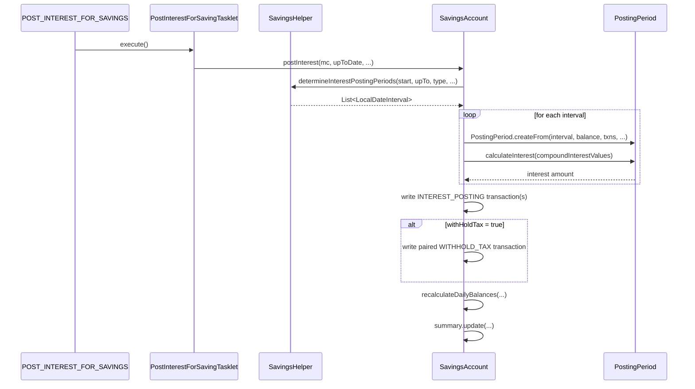
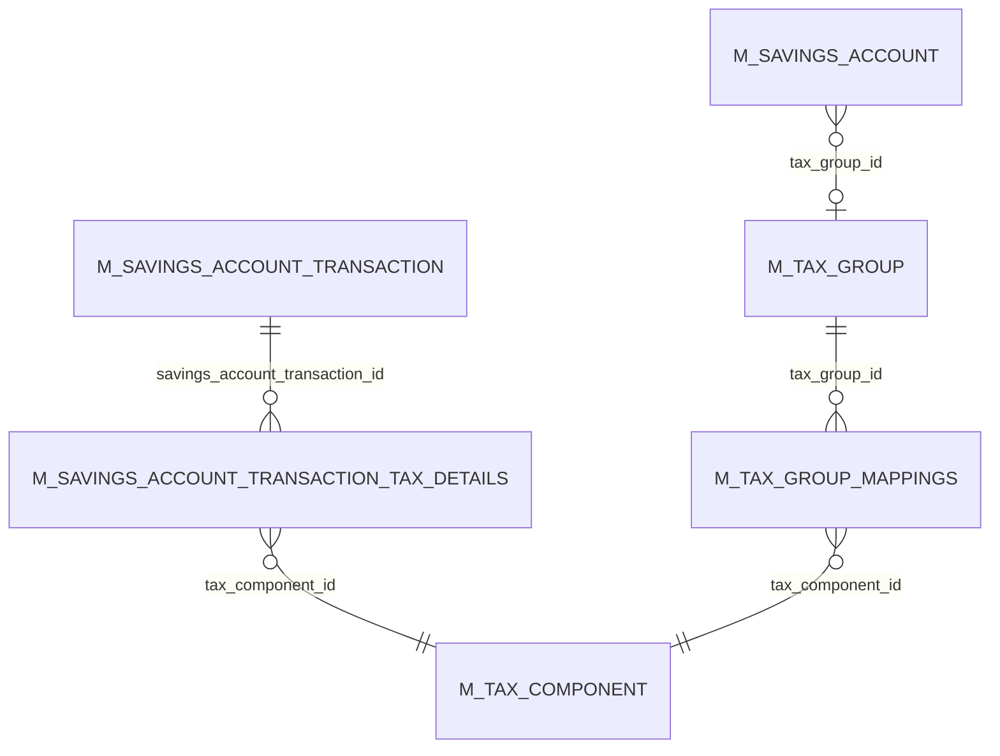

The interest engine is the heart of Apache Fineract's savings and deposit subsystem. It computes how much interest each account has earned, decides when to credit it as `INTEREST_POSTING` transactions, and orchestrates the matching withholding-tax debits. This page walks the four interest-related enums, the period-decomposition algorithm, the `PostingPeriod` aggregator that the entity delegates to, the idempotent posting loop, and the two scheduler jobs that drive the whole thing in batch.

## The four enums

Four `fineract-core` enums together describe an account's interest contract:

```
SavingsCompoundingInterestPeriodType    daily / monthly / quarterly / biannual / annual
SavingsPostingInterestPeriodType        daily / monthly / quarterly / biannual / annual
SavingsInterestCalculationType          daily-balance / average-daily-balance
SavingsInterestCalculationDaysInYearType  360 / 365
```

### Compounding vs posting

- **Compounding period** is how often interest *accrued so far* is rolled into the principal that the next slice of interest accrues on. Short compounding (e.g. daily) approximates continuous compounding.
- **Posting period** is how often the accrued interest is actually written to the ledger as an `INTEREST_POSTING` transaction (and, if `withHoldTax = true`, a paired `WITHHOLD_TAX` debit).

You can compound daily but post quarterly. You cannot post more often than you compound — `SavingsProduct.validateInterestPostingAndCompoundingPeriodTypes(...)` enforces this. The actual enums:

```java
// fineract-core/.../portfolio/savings/SavingsCompoundingInterestPeriodType.java
public enum SavingsCompoundingInterestPeriodType {
    INVALID(0, ...), DAILY(1, ...),
    // WEEKLY(2, ...), BIWEEKLY(3, ...),  // commented out
    MONTHLY(4, ...), QUATERLY(5, ...), BI_ANNUAL(6, ...), ANNUAL(7, ...);
}

// fineract-core/.../portfolio/savings/SavingsPostingInterestPeriodType.java
public enum SavingsPostingInterestPeriodType {
    INVALID(0, ...), DAILY(1, ...), MONTHLY(4, ...),
    QUATERLY(5, ...), BIANNUAL(6, ...), ANNUAL(7, ...);
}
```

The integer literals are sparse for historical reasons — values 2 and 3 are reserved for weekly/biweekly compounding which has been disabled since early versions but the constants are kept commented out. Don't repurpose them.

### Calculation type: daily vs average-daily

```java
// fineract-core/.../portfolio/savings/SavingsInterestCalculationType.java
public enum SavingsInterestCalculationType {
    INVALID(0, ...),
    DAILY_BALANCE(1, ...),
    AVERAGE_DAILY_BALANCE(2, ...);
}
```

The two settings produce different numbers:

| Mode | Interest for a single compounding period |
| --- | --- |
| `DAILY_BALANCE` | `Σ(balance_d × rate / daysInYear)` for `d` in period |
| `AVERAGE_DAILY_BALANCE` | `(Σ balance_d / N) × N × rate / daysInYear` for `N` days in period |

For periods where the balance is constant the two methods give the same answer; they diverge when there are mid-period deposits or withdrawals. Daily-balance gives a slightly higher number when balances rise during the period (each day is credited at its actual balance) and a slightly lower number when balances fall.

### Days in year

```java
// fineract-core/.../portfolio/savings/SavingsInterestCalculationDaysInYearType.java
public enum SavingsInterestCalculationDaysInYearType {
    INVALID(0, ...), DAYS_360(360, ...), DAYS_365(365, ...);
}
```

The integer literal *is* the divisor — the calculation just divides by 360 or 365. There is no `ACTUAL/ACTUAL` option for savings (unlike some bond markets).

## Period decomposition: `SavingsHelper.determineInterestPostingPeriods`

This is where the calendar arithmetic lives. Given a start-of-interest date, an up-to date, the posting period type, the fiscal-year start month, and any manual "post interest as on" dates, it produces a list of `LocalDateInterval`s — one per posting period.

```java
// fineract-core/.../portfolio/savings/domain/SavingsHelper.java
public List<LocalDateInterval> determineInterestPostingPeriods(LocalDate startInterestCalcDate,
        LocalDate interestPostingUpToDate, SavingsPostingInterestPeriodType postingPeriodType,
        Integer financialYearBeginningMonth, List<LocalDate> postInterestAsOn) {

    final List<LocalDateInterval> postingPeriods = new ArrayList<>();
    LocalDate periodStartDate = startInterestCalcDate;
    LocalDate periodEndDate = periodStartDate;

    while (!DateUtils.isAfter(periodStartDate, interestPostingUpToDate)
        && !DateUtils.isAfter(periodEndDate, interestPostingUpToDate)) {

        final LocalDate interestPostingLocalDate = determineInterestPostingPeriodEndDateFrom(
                periodStartDate, postingPeriodType, interestPostingUpToDate, financialYearBeginningMonth);
        periodEndDate = interestPostingLocalDate.minusDays(1);

        if (!postInterestAsOn.isEmpty()) {
            for (LocalDate txDate : postInterestAsOn) {
                if (DateUtils.isAfter(txDate, periodStartDate) && !DateUtils.isAfter(txDate, periodEndDate)) {
                    periodEndDate = txDate.minusDays(1);
                    break;
                }
            }
        }
        postingPeriods.add(LocalDateInterval.create(periodStartDate, periodEndDate));
        periodEndDate   = interestPostingLocalDate;
        periodStartDate = interestPostingLocalDate;
    }
    return postingPeriods;
}
```

`determineInterestPostingPeriodEndDateFrom(...)` is the helper that does the calendar lookup:

```java
// SavingsHelper.java — abbreviated
switch (interestPostingPeriodType) {
    case DAILY:   periodEndDate = periodStartDate;                                   break;
    case MONTHLY: periodEndDate = periodStartDate.with(TemporalAdjusters.lastDayOfMonth()); break;
    case QUATERLY:
        for (LocalDate quarterlyDate : quarterlyDates) { /* first qtr-end after periodStartDate */ }
        break;
    case BIANNUAL:
        for (LocalDate biannualDate  : biannualDates)  { /* first half-year-end after periodStartDate */ }
        break;
    case ANNUAL:
        periodEndDate = periodStartDate.withMonth(financialYearBeginningMonth).with(TemporalAdjusters.lastDayOfMonth());
        // …adjusted forward a year if we're past it
        break;
}
periodEndDate = periodEndDate.plusDays(1);   // posting always falls on the day after period end
return periodEndDate;
```

Two non-obvious behaviours fall out of this:

1. **Quarterly and biannual periods are anchored to the *financial year*** (`financialYearBeginningMonth` is a global config), not the calendar year.
2. **A manual `postInterestAsOn` date splits the current period** — the algorithm closes the open period at the manual date and starts a new one. That is how operators can force an out-of-cycle interest posting (for e.g. quarter-end reporting) without breaking the regular schedule.

## `PostingPeriod` aggregator

Each interval is wrapped into a `PostingPeriod` value object that owns the transactions inside the interval and knows how to compute interest on them.

```java
// fineract-core/.../portfolio/savings/domain/interest/PostingPeriod.java
public class PostingPeriod {
    private BigDecimal interestEarnedUnrounded;
    private Money     interestEarnedRounded;
    private final LocalDateInterval periodInterval;
    private final List<EndOfDayBalance> endOfDayBalances;
    private final SavingsCompoundingInterestPeriodType interestCompoundingType;
    private final SavingsInterestCalculationType       interestCalculationType;
    private final BigDecimal interestRateAsFraction;
    private final long       daysInYear;
    // …
    public BigDecimal calculateInterest(CompoundInterestValues compoundInterestValues) {
        BigDecimal interestEarned = BigDecimal.ZERO;
        for (CompoundingPeriod compoundingPeriod : compoundingPeriods) {
            final BigDecimal interestUnrounded =
                    compoundingPeriod.calculateInterest(this.interestCompoundingType,
                            this.interestCalculationType, ...);
            interestEarned = interestEarned.add(interestUnrounded);
        }
        this.interestEarnedUnrounded = interestEarned;
        this.interestEarnedRounded   = Money.of(this.currency, this.interestEarnedUnrounded);
        return interestEarned;
    }
}
```

Internally it walks the *compounding* periods (sub-divisions of the posting period), asks each `CompoundingPeriod` to compute its interest under the chosen `SavingsInterestCalculationType`, and sums the lot. The compounding maths uses `EndOfDayBalance` snapshots produced by `SavingsAccountTransactionDetailsForPostingPeriod`.

The end-to-end flow looks like:



## Idempotent posting

`SavingsAccount.postInterest(...)` is **idempotent**. Running it twice for the same up-to date does not double-credit interest — it walks the recomputed periods and, for each one:

1. Looks up any existing `INTEREST_POSTING` transaction for the posting date.
2. If one exists and the amount matches, leaves it alone.
3. If one exists and the amount has changed (e.g. a back-dated deposit retroactively boosted the period's interest), it **reverses the old posting**, optionally writes a `reversal` marker row, and writes a new `INTEREST_POSTING` for the corrected amount.
4. If none exists, writes a fresh `INTEREST_POSTING`.

```java
// SavingsAccount.java :: postInterest(...) — abbreviated
for (final PostingPeriod interestPostingPeriod : postingPeriods) {
    final LocalDate postingDate = interestPostingPeriod.dateOfPostingTransaction();
    final Money interestEarnedToBePostedForPeriod = interestPostingPeriod.getInterestEarned();

    SavingsAccountTransaction postingTransaction = findInterestPostingTransactionFor(postingDate);
    if (postingTransaction == null) {
        // create a fresh INTEREST_POSTING (or OVERDRAFT_INTEREST if negative)
        SavingsAccountTransaction newPosting = interestEarnedToBePostedForPeriod.isGreaterThanOrEqualTo(zero)
            ? SavingsAccountTransaction.interestPosting(this, office(), postingDate, interestEarnedToBePostedForPeriod, isUserPosting)
            : SavingsAccountTransaction.overdraftInterest(this, office(), postingDate, interestEarnedToBePostedForPeriod.negated(), isUserPosting);
        addTransaction(newPosting);
        if (applyWithHoldTax) createWithHoldTransaction(...);
    } else if (postingTransaction.hasNotAmount(interestEarnedToBePostedForPeriod)) {
        // amount changed — reverse + repost
        postingTransaction.reverse();
        if (postReversals) addTransaction(SavingsAccountTransaction.reversal(postingTransaction));
        addTransaction(/* new posting with corrected amount */);
        // …mirror the change on the withhold-tax row too
    }
}
```

The negative branch — when interest is *owed to the bank* because the account spent the period in overdraft — uses `OVERDRAFT_INTEREST` (`17`, debit) instead of `INTEREST_POSTING` (`3`, credit). Both go through the same period-decomposition.

## Withholding tax pairing

When `SavingsAccount.withHoldTax = true` and the account has a non-null `taxGroup`, every successful `INTEREST_POSTING` is paired with a `WITHHOLD_TAX` debit on the same date:

```java
// SavingsAccount.java :: createWithHoldTransaction(...) — abbreviated
List<Map<TaxComponent, BigDecimal>> taxSplit = TaxUtils.splitTax(amount, transactionDate,
        this.taxGroup.getTaxGroupMappings(), amount.scale());
BigDecimal totalTax = TaxUtils.totalTaxAmount(taxSplit);
if (totalTax.compareTo(BigDecimal.ZERO) > 0) {
    if (withholdTransaction.getId() == null) {
        withholdTransaction.setAmount(Money.of(currency, totalTax));
        SavingsAccountTransaction.updateTaxDetails(taxSplit, withholdTransaction);
    } else if (totalTax.compareTo(withholdTransaction.getAmount()) != 0) {
        withholdTransaction.reverse();
        SavingsAccountTransaction newWithholdTransaction = SavingsAccountTransaction.withHoldTax(
                this, office(), withholdTransaction.getTransactionDate(), Money.of(currency, totalTax), taxSplit);
        addTransaction(newWithholdTransaction);
    }
}
```

The same "reverse-and-repost when the amount changes" idempotency applies — back-dated activity that retroactively changes the interest will also retroactively change the tax.

## The `POST_INTEREST_FOR_SAVINGS` job

```java
// fineract-provider/.../portfolio/savings/jobs/postinterestforsavings/PostInterestForSavingTasklet.java
@RequiredArgsConstructor
@Component
public class PostInterestForSavingTasklet implements Tasklet {

    private static final int QUEUE_SIZE = 1;

    private final SavingsAccountReadPlatformService savingAccountReadPlatformService;
    private final ConfigurationDomainService configurationDomainService;
    private final ApplicationContext applicationContext;
    @Qualifier(TaskExecutorConstant.CONFIGURABLE_TASK_EXECUTOR_BEAN_NAME)
    private final ThreadPoolTaskExecutor taskExecutor;

    @Override
    public RepeatStatus execute(StepContribution contribution, ChunkContext chunkContext) throws Exception {
        final Queue<List<SavingsAccountData>> queue = new ArrayDeque<>();
        final int threadPoolSize = Integer.parseInt((String) chunkContext.getStepContext()
                .getJobParameters().get("thread-pool-size"));
        taskExecutor.setCorePoolSize(threadPoolSize);
        taskExecutor.setMaxPoolSize(threadPoolSize);
        final int batchSize = Integer.parseInt((String) chunkContext.getStepContext()
                .getJobParameters().get("batch-size"));
        final int pageSize  = batchSize * threadPoolSize;
        Long maxSavingsIdInList = 0L;
        final boolean backdatedTxnsAllowedTill = this.configurationDomainService.retrievePivotDateConfig();
        // page through ACTIVE savings, build SavingsSchedularInterestPosterTask runnables, dispatch
    }
}
```

The shape is:

1. Read the per-tenant `thread-pool-size` and `batch-size` from the Spring Batch job parameters.
2. Page through *active* savings accounts in chunks of `batchSize × threadPoolSize`.
3. For each chunk, spawn `threadPoolSize` `SavingsSchedularInterestPosterTask` runnables, each posting interest for `batchSize` accounts.
4. The `SavingsSchedularInterestPoster` (in `fineract-savings/.../service/`) wraps `SavingsAccountInterestPostingService.postInterest(...)`.

Two configuration knobs you'll bump into:

- **`thread-pool-size`** — controls parallelism. The job is read-heavy and write-heavy per-account; high parallelism dramatically speeds up large portfolios.
- **`retrievePivotDateConfig()`** — when true, the engine assumes a "pivot date" (set per tenant) below which historical transactions are frozen. The interest pass only walks transactions after the pivot, and `SavingsAccount.summary.getRunningBalanceOnPivotDate()` is used as the opening balance. This is what makes back-dated postings feasible without re-walking 20 years of history.

The job is registered as `POST_INTEREST_FOR_SAVINGS("Post Interest For Savings")` in `JobName.java`.

## The `TRANSFER_INTEREST_TO_SAVINGS` job

A fixed deposit configured with `transferInterestToLinkedAccount = true` writes each interest posting back into a sibling savings account. The transfer happens via the standard account-transfer machinery rather than a direct ledger write:

```java
// fineract-provider/.../portfolio/savings/jobs/transferinteresttosavings/TransferInterestToSavingsTasklet.java
@Slf4j
@RequiredArgsConstructor
public class TransferInterestToSavingsTasklet implements Tasklet {
    private final DepositAccountReadPlatformService depositAccountReadPlatformService;
    private final AccountTransfersWritePlatformService accountTransfersWritePlatformService;

    @Override
    public RepeatStatus execute(StepContribution contribution, ChunkContext chunkContext) throws Exception {
        List<Throwable> errors = new ArrayList<>();
        Collection<AccountTransferDTO> accountTransferData = depositAccountReadPlatformService.retrieveDataForInterestTransfer();
        for (AccountTransferDTO accountTransferDTO : accountTransferData) {
            try {
                accountTransfersWritePlatformService.transferFunds(accountTransferDTO);
            } catch (final PlatformApiDataValidationException e) {
                errors.add(e);
            } catch (final InsufficientAccountBalanceException e) {
                errors.add(e);
            }
        }
        if (!errors.isEmpty()) throw new JobExecutionException(errors);
        return RepeatStatus.FINISHED;
    }
}
```

`retrieveDataForInterestTransfer()` (sic) returns one `AccountTransferDTO` per pending transfer — for each FD whose latest `INTEREST_POSTING` has not yet been mirrored into the linked savings account. The `AccountTransfersWritePlatformService` is the same one used by client-facing transfers; the source/destination on the DTO mark the FD as source and the linked savings as destination.

The job is registered as `TRANSFER_INTEREST_TO_SAVINGS("Transfer Interest To Savings")`.

## Validation invariants

Two semantic invariants are enforced inside `SavingsProduct.validateInterestPostingAndCompoundingPeriodTypes(...)` and reused by FD/RD:

1. **Compounding period ≤ posting period.** You can compound daily and post monthly, but not the reverse.
2. **`DAILY_BALANCE` is the canonical mode.** `AVERAGE_DAILY_BALANCE` is supported for compatibility but most real-world deployments use daily-balance, which is what the unit tests in `fineract-provider/src/test/java/org/apache/fineract/portfolio/savings/` are built around.

## ER picture



## Source paths

- `fineract-savings/src/main/java/org/apache/fineract/portfolio/savings/domain/SavingsAccount.java` — `postInterest(...)`, `calculateInterestUsing(...)`
- `fineract-savings/src/main/java/org/apache/fineract/portfolio/savings/service/SavingsAccountInterestPostingService.java`
- `fineract-savings/src/main/java/org/apache/fineract/portfolio/savings/service/SavingsSchedularInterestPoster.java`
- `fineract-savings/src/main/java/org/apache/fineract/portfolio/savings/service/SavingsSchedularInterestPosterTask.java`
- `fineract-core/src/main/java/org/apache/fineract/portfolio/savings/SavingsCompoundingInterestPeriodType.java`
- `fineract-core/src/main/java/org/apache/fineract/portfolio/savings/SavingsPostingInterestPeriodType.java`
- `fineract-core/src/main/java/org/apache/fineract/portfolio/savings/SavingsInterestCalculationType.java`
- `fineract-core/src/main/java/org/apache/fineract/portfolio/savings/SavingsInterestCalculationDaysInYearType.java`
- `fineract-core/src/main/java/org/apache/fineract/portfolio/savings/domain/SavingsHelper.java`
- `fineract-core/src/main/java/org/apache/fineract/portfolio/savings/domain/interest/PostingPeriod.java`
- `fineract-core/src/main/java/org/apache/fineract/portfolio/savings/domain/interest/CompoundingPeriod.java`
- `fineract-core/src/main/java/org/apache/fineract/portfolio/savings/domain/interest/EndOfDayBalance.java`
- `fineract-core/src/main/java/org/apache/fineract/portfolio/savings/domain/interest/CompoundInterestHelper.java`
- `fineract-provider/src/main/java/org/apache/fineract/portfolio/savings/service/SavingsAccountInterestPostingServiceImpl.java`
- `fineract-provider/src/main/java/org/apache/fineract/portfolio/savings/jobs/postinterestforsavings/PostInterestForSavingTasklet.java`
- `fineract-provider/src/main/java/org/apache/fineract/portfolio/savings/jobs/postinterestforsavings/PostInterestForSavingsConfig.java`
- `fineract-provider/src/main/java/org/apache/fineract/portfolio/savings/jobs/transferinteresttosavings/TransferInterestToSavingsTasklet.java`
- `fineract-provider/src/main/java/org/apache/fineract/portfolio/savings/jobs/transferinteresttosavings/TransferInterestToSavingsConfig.java`
- `fineract-core/src/main/java/org/apache/fineract/infrastructure/jobs/service/JobName.java` — `POST_INTEREST_FOR_SAVINGS`, `TRANSFER_INTEREST_TO_SAVINGS`
