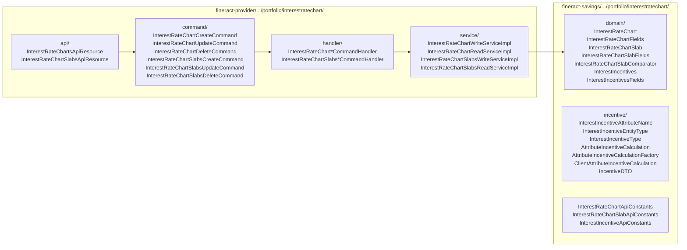
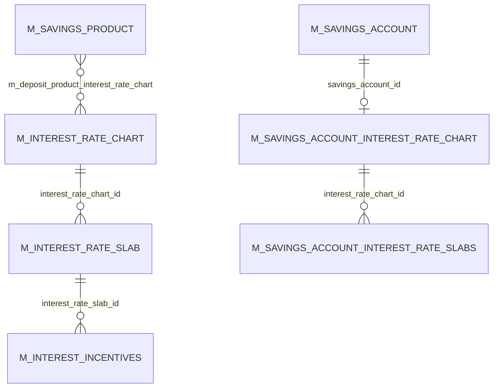
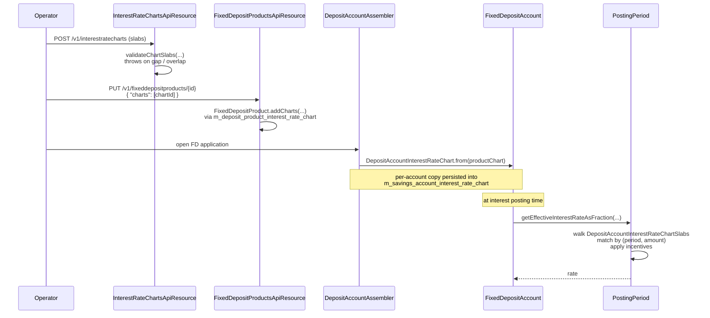
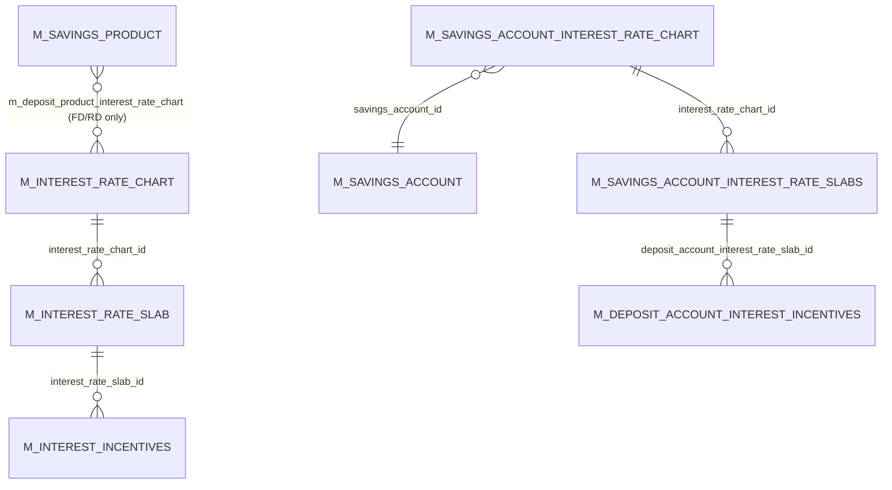

Fixed-deposit and recurring-deposit products in Apache Fineract often need *tiered* interest rates — "1.5% for terms up to 6 months, 2.0% for 6–12 months, 2.5% for 12+ months" or "2% on the first 10,000, 3% on the next 50,000, 4% above that". The `interestratechart/` package is the reusable engine for those tables. It exposes a small four-entity aggregate (chart, slab, embedded fields, incentives) and a pair of CRUD REST resources, and every deposit account that uses it gets a per-account *copy* of the chart so subsequent edits on the product don't retroactively change live accounts.

This page maps the entities, the per-account-copy pattern, the slab validation rules, the incentive layer, and the REST surface.

## Module layout



The `fineract-provider/.../portfolio/interestratechart/` tree is unusual in that the entities live in `fineract-savings` while the entire REST + command + service stack lives in `fineract-provider`. Other deposit-related entities follow the same split.

## `InterestRateChart`

```java
// fineract-savings/.../portfolio/interestratechart/domain/InterestRateChart.java
@Entity
@Table(name = "m_interest_rate_chart")
public class InterestRateChart extends AbstractPersistableCustom<Long> {

    @Embedded
    private InterestRateChartFields chartFields;

    @OneToMany(mappedBy = "interestRateChart", cascade = CascadeType.ALL,
               orphanRemoval = true, fetch = FetchType.EAGER)
    private Set<InterestRateChartSlab> chartSlabs = new HashSet<>();
}
```

The chart itself is just header + slabs. The header is an embedded value type:

```java
// fineract-savings/.../portfolio/interestratechart/domain/InterestRateChartFields.java
@Embeddable
public class InterestRateChartFields {
    @Column(name = "name", length = 100, nullable = false)        private String name;
    @Column(name = "description")                                 private String description;
    @Column(name = "from_date", nullable = false)                 private LocalDate fromDate;
    @Column(name = "end_date")                                    private LocalDate endDate;
    @Column(name = "is_primary_grouping_by_amount", nullable = false)
    private boolean isPrimaryGroupingByAmount;
}
```

`fromDate` / `endDate` make a chart **dated**: the same product can have multiple charts active over different time windows. The deposit-account assembler picks the chart whose `[fromDate, endDate]` interval contains the account submission date.

`isPrimaryGroupingByAmount` is the key flag. It tells the chart whether the slabs are organized:

- **By amount** (`true`) — "first 10,000 at 2%, next 50,000 at 3%, …" Sub-grouping by period is possible within each amount band.
- **By period** (`false`) — "0–6 months at 2%, 6–12 months at 2.5%, …" Sub-grouping by amount is possible within each period band.

The flag drives the `InterestRateChartSlabComparator` used during validation (next section).

## `InterestRateChartSlab`

Each slab is a row in `m_interest_rate_slab`. The chart owns N slabs:

```java
// fineract-savings/.../portfolio/interestratechart/domain/InterestRateChartSlab.java
@Entity
@Table(name = "m_interest_rate_slab")
public class InterestRateChartSlab extends AbstractPersistableCustom<Long> {

    @Embedded
    private InterestRateChartSlabFields slabFields;

    @ManyToOne(optional = false)
    @JoinColumn(name = "interest_rate_chart_id", referencedColumnName = "id", nullable = false)
    private InterestRateChart interestRateChart;

    @OneToMany(mappedBy = "interestRateChartSlab", cascade = CascadeType.ALL,
               orphanRemoval = true, fetch = FetchType.EAGER)
    private Set<InterestIncentives> interestIncentives = new HashSet<>();
}
```

The slab's actual data lives in another `@Embeddable`:

```java
// fineract-savings/.../portfolio/interestratechart/domain/InterestRateChartSlabFields.java
@Embeddable
public class InterestRateChartSlabFields {
    @Column(name = "description")                       private String description;
    @Column(name = "period_type_enum")                  private Integer periodType;       // SavingsPeriodFrequencyType
    @Column(name = "from_period")                       private Integer fromPeriod;
    @Column(name = "to_period")                         private Integer toPeriod;
    @Column(name = "amount_range_from", scale = 6, precision = 19) private BigDecimal amountRangeFrom;
    @Column(name = "amount_range_to",   scale = 6, precision = 19) private BigDecimal amountRangeTo;
    @Column(name = "annual_interest_rate", scale = 6, precision = 19, nullable = false)
    private BigDecimal annualInterestRate;
    @Column(name = "currency_code", nullable = false)   private String currencyCode;
}
```

Two parallel range pairs:

- `(fromPeriod, toPeriod)` + `periodType` (days/weeks/months/years) — the term band the slab covers.
- `(amountRangeFrom, amountRangeTo)` — the deposit-amount band.

A slab can populate either, both, or only one — what's mandatory depends on the chart's `isPrimaryGroupingByAmount`.

### Slab validation: `InterestRateChartSlabComparator`

The chart validates its slabs whenever a slab is added, modified or deleted, by walking the slabs in their canonical order and looking for gaps or overlaps:

```java
// InterestRateChart.java :: validateChartSlabs(DataValidatorBuilder)
public void validateChartSlabs(DataValidatorBuilder baseDataValidator) {
    Collection<InterestRateChartSlab> chartSlabs = this.setOfChartSlabs();
    List<InterestRateChartSlab> chartSlabsList = new ArrayList<>(chartSlabs);
    boolean isPrimaryGroupingByAmount = this.chartFields.isPrimaryGroupingByAmount();
    chartSlabsList.sort(new InterestRateChartSlabComparator<InterestRateChartSlab>(isPrimaryGroupingByAmount));
    boolean isPeriodChart = !isPrimaryGroupingByAmount;
    boolean isAmountChart =  isPrimaryGroupingByAmount;

    for (int i = 0; i < chartSlabsList.size(); i++) {
        InterestRateChartSlab iSlabs = chartSlabsList.get(i);
        if (!iSlabs.slabFields().isValidChart(isPrimaryGroupingByAmount)) {
            // …missing required band
        } else if (i > 0) {
            // …gap / overlap detection between iSlabs and chartSlabsList.get(i - 1)
        }
    }
}
```

The comparator is parameterised by the primary-grouping flag:

```java
// fineract-savings/.../portfolio/interestratechart/domain/InterestRateChartSlabComparator.java
public class InterestRateChartSlabComparator<T> implements Comparator<T> {
    private final boolean isPrimaryGroupingByAmount;
    public InterestRateChartSlabComparator(boolean isPrimaryGroupingByAmount) {
        this.isPrimaryGroupingByAmount = isPrimaryGroupingByAmount;
    }
    @Override
    public int compare(T o1, T o2) { /* sorts by amount-then-period or period-then-amount */ }
}
```

The generic `<T>` parameter is so the same comparator works for both `InterestRateChartSlab` (product-side) and `DepositAccountInterestRateChartSlabs` (account-side copy).

## Per-account copy: `DepositAccountInterestRateChart`

When a fixed or recurring deposit account is opened, the *product's* `InterestRateChart` is cloned into a per-account `DepositAccountInterestRateChart`. The clone is what the interest engine actually reads — subsequent edits to the product chart do not retroactively change the rates on already-open accounts.

```java
// fineract-savings/.../portfolio/savings/domain/DepositAccountInterestRateChart.java
@Entity
@Table(name = "m_savings_account_interest_rate_chart")
public class DepositAccountInterestRateChart extends AbstractPersistableCustom<Long> {

    @Embedded private InterestRateChartFields chartFields;

    @OneToOne @JoinColumn(name = "savings_account_id", nullable = false)
    private SavingsAccount account;

    @OneToMany(mappedBy = "depositAccountInterestRateChart", cascade = CascadeType.ALL,
               orphanRemoval = true, fetch = FetchType.EAGER)
    private Set<DepositAccountInterestRateChartSlabs> chartSlabs = new HashSet<>();

    public static DepositAccountInterestRateChart from(InterestRateChart productChart) {
        final Set<InterestRateChartSlab> chartSlabs = productChart.setOfChartSlabs();
        final Set<DepositAccountInterestRateChartSlabs> depositChartSlabs = new HashSet<>();
        for (InterestRateChartSlab interestRateChartSlab : chartSlabs) {
            depositChartSlabs.add(DepositAccountInterestRateChartSlabs.from(interestRateChartSlab, null));
        }
        final DepositAccountInterestRateChart depositChart =
                new DepositAccountInterestRateChart(productChart.chartFields(), null, depositChartSlabs);
        depositChart.updateChartSlabsReference();
        return depositChart;
    }
}
```

Two tables back the per-account world: `m_savings_account_interest_rate_chart` (header, joined to `m_savings_account` by `savings_account_id`) and `m_savings_account_interest_rate_slabs` (the slabs). The `from(...)` factory copies field-by-field, including embedded sub-objects, and re-wires the parent reference.

So the picture for a FD with a tiered chart is:



Note the parallel "product chart" and "account chart" hierarchies. The `DepositAccountInterestRateChart` re-embeds the same `InterestRateChartFields` value type so the two hierarchies share the in-memory shape but use different tables.

## Incentives — per-attribute rate adjustments

A slab can carry **incentives** that modify the slab's headline rate based on attributes of the depositing client:

```java
// fineract-savings/.../portfolio/interestratechart/domain/InterestIncentives.java
@Entity
@Table(name = "m_interest_incentives")
public class InterestIncentives extends AbstractPersistableCustom<Long> {

    @ManyToOne @JoinColumn(name = "interest_rate_slab_id", nullable = false)
    private InterestRateChartSlab interestRateChartSlab;

    @Embedded private InterestIncentivesFields interestIncentivesFields;
}
```

Three small enums describe an incentive:

```java
// fineract-savings/.../portfolio/interestratechart/incentive/InterestIncentiveAttributeName.java
public enum InterestIncentiveAttributeName {
    INVALID(1, ...), GENDER(2, ...), AGE(3, ...),
    CLIENT_TYPE(4, ...), CLIENT_CLASSIFICATION(5, ...);
}

// fineract-savings/.../portfolio/interestratechart/incentive/InterestIncentiveType.java
public enum InterestIncentiveType {
    INVALID(1, ...),
    FIXED(2, ...),        // override the rate to a fixed value
    INCENTIVE(3, ...);    // add/subtract a delta to the slab rate
}
```

So a slab "12-month FD at 2.5% base rate" can carry an incentive "Female clients +0.25%". When the engine values a deposit account whose client is female, the slab rate is adjusted to 2.75%.

The `incentive/` sub-package supplies the calculation classes:

```java
// fineract-savings/.../portfolio/interestratechart/incentive/AttributeIncentiveCalculationFactory.java
public final class AttributeIncentiveCalculationFactory {
    public static AttributeIncentiveCalculation findCalculation(Integer attributeName) {
        return switch (InterestIncentiveAttributeName.fromInt(attributeName)) {
            case GENDER, AGE, CLIENT_TYPE, CLIENT_CLASSIFICATION
                -> new ClientAttributeIncentiveCalculation();
            default -> null;
        };
    }
}
```

There is only one calculation class (`ClientAttributeIncentiveCalculation`) — it reflects on the `Client` aggregate to read the requested attribute and decides whether the incentive matches. Adding new attribute types means extending the enum and (potentially) the calculation class.

## REST surface

### `InterestRateChartsApiResource` — `/v1/interestratecharts`

```java
// fineract-provider/.../portfolio/interestratechart/api/InterestRateChartsApiResource.java
@Path("/v1/interestratecharts")
public class InterestRateChartsApiResource { ... }
```

| HTTP | Path | Action |
| --- | --- | --- |
| GET | `/v1/interestratecharts/template` | Build a chart form template. |
| GET | `/v1/interestratecharts?productId={id}` | List charts attached to a product. |
| GET | `/v1/interestratecharts/{chartId}` | Single chart with slabs. |
| POST | `/v1/interestratecharts` | Create. Fires `CREATE_INTERESTRATECHART`. |
| PUT | `/v1/interestratecharts/{chartId}` | Update. Fires `UPDATE_INTERESTRATECHART`. |
| DELETE | `/v1/interestratecharts/{chartId}` | Delete (only if no live FD/RD references it). |

### `InterestRateChartSlabsApiResource` — `/v1/interestratecharts/{chartId}/chartslabs`

```java
// fineract-provider/.../portfolio/interestratechart/api/InterestRateChartSlabsApiResource.java
@Path("/v1/interestratecharts/{chartId}/chartslabs")
public class InterestRateChartSlabsApiResource { ... }
```

| HTTP | Path | Action |
| --- | --- | --- |
| GET | `/v1/interestratecharts/{chartId}/chartslabs/template` | Slab form template. |
| GET | `/v1/interestratecharts/{chartId}/chartslabs` | List slabs in a chart. |
| GET | `/v1/interestratecharts/{chartId}/chartslabs/{chartSlabId}` | Single slab with incentives. |
| POST | `/v1/interestratecharts/{chartId}/chartslabs` | Create. Fires `CREATE_INTERESTRATECHARTSLAB`. |
| PUT | `/v1/interestratecharts/{chartId}/chartslabs/{chartSlabId}` | Update. Fires `UPDATE_INTERESTRATECHARTSLAB`. |
| DELETE | `/v1/interestratecharts/{chartId}/chartslabs/{chartSlabId}` | Delete. Fires `DELETE_INTERESTRATECHARTSLAB`. |

Write paths use the standard typed-DTO command pattern (`InterestRateChartCreateRequest` → `InterestRateChartCreateCommand` → `InterestRateChartCreateCommandHandler` → `InterestRateChartWriteServiceImpl`), unlike most older Fineract resources that pass `JsonCommand` directly.

## How FD/RD products consume a chart

The end-to-end flow:



`FixedDepositAccount.getEffectiveInterestRateAsFraction(...)` is the point where chart resolution happens. It consults the account-side chart copy, picks the slab that matches the FD's term and deposit amount, then runs any matching incentives via the `AttributeIncentiveCalculationFactory`. The result feeds into the standard [interest engine](/savings/interest-posting-and-compounding).

## ER picture



## Source paths

### Domain

- `fineract-savings/src/main/java/org/apache/fineract/portfolio/interestratechart/domain/InterestRateChart.java`
- `fineract-savings/src/main/java/org/apache/fineract/portfolio/interestratechart/domain/InterestRateChartFields.java`
- `fineract-savings/src/main/java/org/apache/fineract/portfolio/interestratechart/domain/InterestRateChartSlab.java`
- `fineract-savings/src/main/java/org/apache/fineract/portfolio/interestratechart/domain/InterestRateChartSlabFields.java`
- `fineract-savings/src/main/java/org/apache/fineract/portfolio/interestratechart/domain/InterestRateChartSlabComparator.java`
- `fineract-savings/src/main/java/org/apache/fineract/portfolio/interestratechart/domain/InterestRateChartRepository.java`
- `fineract-savings/src/main/java/org/apache/fineract/portfolio/interestratechart/domain/InterestRateChartRepositoryWrapper.java`
- `fineract-savings/src/main/java/org/apache/fineract/portfolio/interestratechart/domain/InterestRateChartSlabRepository.java`
- `fineract-savings/src/main/java/org/apache/fineract/portfolio/interestratechart/domain/InterestRateChartSlabRepositoryWrapper.java`
- `fineract-savings/src/main/java/org/apache/fineract/portfolio/interestratechart/domain/InterestIncentives.java`
- `fineract-savings/src/main/java/org/apache/fineract/portfolio/interestratechart/domain/InterestIncentivesFields.java`

### Incentive

- `fineract-savings/src/main/java/org/apache/fineract/portfolio/interestratechart/incentive/InterestIncentiveAttributeName.java`
- `fineract-savings/src/main/java/org/apache/fineract/portfolio/interestratechart/incentive/InterestIncentiveType.java`
- `fineract-savings/src/main/java/org/apache/fineract/portfolio/interestratechart/incentive/InterestIncentiveEntityType.java`
- `fineract-savings/src/main/java/org/apache/fineract/portfolio/interestratechart/incentive/AttributeIncentiveCalculation.java`
- `fineract-savings/src/main/java/org/apache/fineract/portfolio/interestratechart/incentive/AttributeIncentiveCalculationFactory.java`
- `fineract-savings/src/main/java/org/apache/fineract/portfolio/interestratechart/incentive/ClientAttributeIncentiveCalculation.java`
- `fineract-savings/src/main/java/org/apache/fineract/portfolio/interestratechart/incentive/IncentiveDTO.java`

### Per-account copy (lives in `portfolio.savings.domain`)

- `fineract-savings/src/main/java/org/apache/fineract/portfolio/savings/domain/DepositAccountInterestRateChart.java`
- `fineract-savings/src/main/java/org/apache/fineract/portfolio/savings/domain/DepositAccountInterestRateChartSlabs.java`
- `fineract-savings/src/main/java/org/apache/fineract/portfolio/savings/domain/DepositAccountInterestIncentive.java`
- `fineract-savings/src/main/java/org/apache/fineract/portfolio/savings/domain/DepositAccountInterestIncentives.java`

### REST + commands + handlers

- `fineract-provider/src/main/java/org/apache/fineract/portfolio/interestratechart/api/InterestRateChartsApiResource.java` — `/v1/interestratecharts`
- `fineract-provider/src/main/java/org/apache/fineract/portfolio/interestratechart/api/InterestRateChartSlabsApiResource.java` — `/v1/interestratecharts/{chartId}/chartslabs`
- `fineract-provider/src/main/java/org/apache/fineract/portfolio/interestratechart/command/InterestRateChartCreateCommand.java`
- `fineract-provider/src/main/java/org/apache/fineract/portfolio/interestratechart/command/InterestRateChartUpdateCommand.java`
- `fineract-provider/src/main/java/org/apache/fineract/portfolio/interestratechart/command/InterestRateChartDeleteCommand.java`
- `fineract-provider/src/main/java/org/apache/fineract/portfolio/interestratechart/command/InterestRateChartSlabsCreateCommand.java`
- `fineract-provider/src/main/java/org/apache/fineract/portfolio/interestratechart/command/InterestRateChartSlabsUpdateCommand.java`
- `fineract-provider/src/main/java/org/apache/fineract/portfolio/interestratechart/command/InterestRateChartSlabsDeleteCommand.java`
- `fineract-provider/src/main/java/org/apache/fineract/portfolio/interestratechart/handler/InterestRateChartCreateCommandHandler.java`
- `fineract-provider/src/main/java/org/apache/fineract/portfolio/interestratechart/handler/InterestRateChartUpdateCommandHandler.java`
- `fineract-provider/src/main/java/org/apache/fineract/portfolio/interestratechart/handler/InterestRateChartDeleteCommandHandler.java`
- `fineract-provider/src/main/java/org/apache/fineract/portfolio/interestratechart/handler/InterestRateChartSlabsCreateCommandHandler.java`
- `fineract-provider/src/main/java/org/apache/fineract/portfolio/interestratechart/handler/InterestRateChartSlabsUpdateCommandHandler.java`
- `fineract-provider/src/main/java/org/apache/fineract/portfolio/interestratechart/handler/InterestRateChartSlabsDeleteCommandHandler.java`
- `fineract-provider/src/main/java/org/apache/fineract/portfolio/interestratechart/service/InterestRateChartReadServiceImpl.java`
- `fineract-provider/src/main/java/org/apache/fineract/portfolio/interestratechart/service/InterestRateChartWriteServiceImpl.java`
- `fineract-provider/src/main/java/org/apache/fineract/portfolio/interestratechart/service/InterestRateChartSlabsReadServiceImpl.java`
- `fineract-provider/src/main/java/org/apache/fineract/portfolio/interestratechart/service/InterestRateChartSlabsWriteServiceImpl.java`
- `fineract-provider/src/main/java/org/apache/fineract/portfolio/interestratechart/service/InterestRateChartEnumerations.java`
- `fineract-provider/src/main/java/org/apache/fineract/portfolio/interestratechart/service/InterestIncentivesEnumerations.java`
