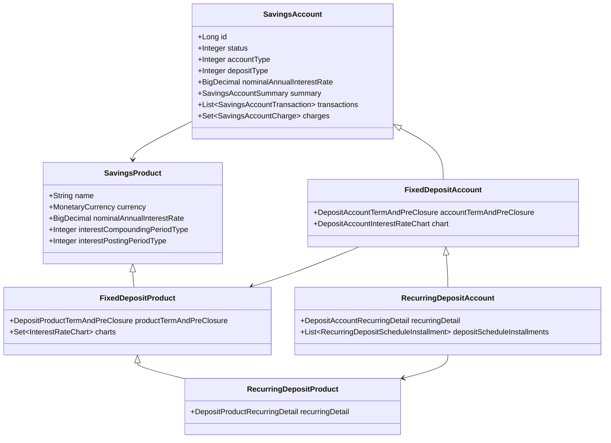
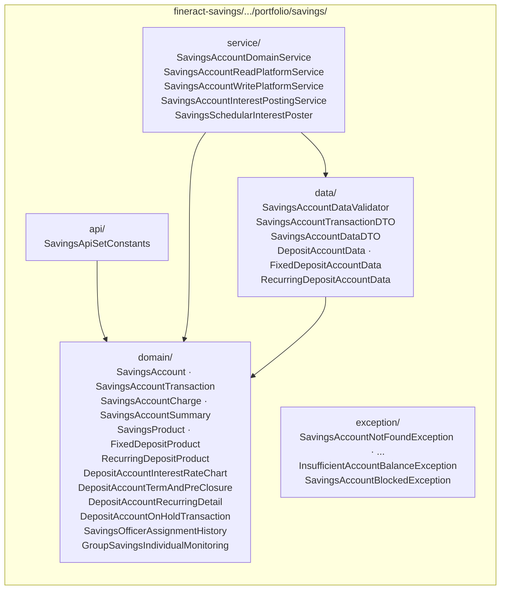
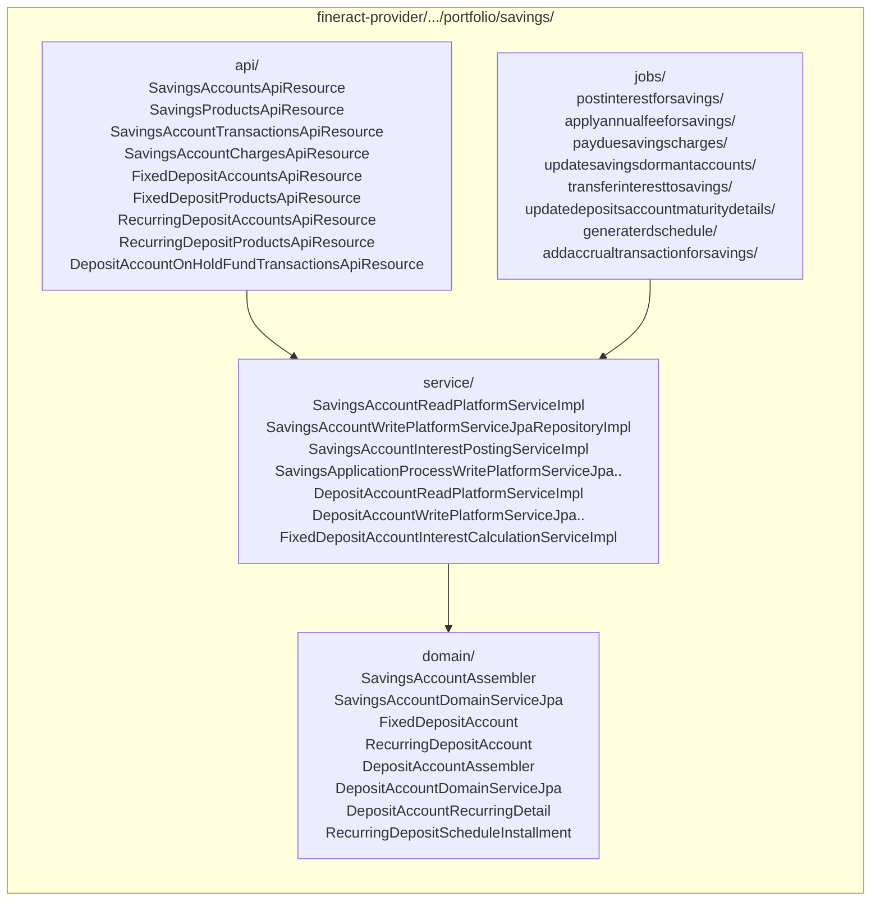
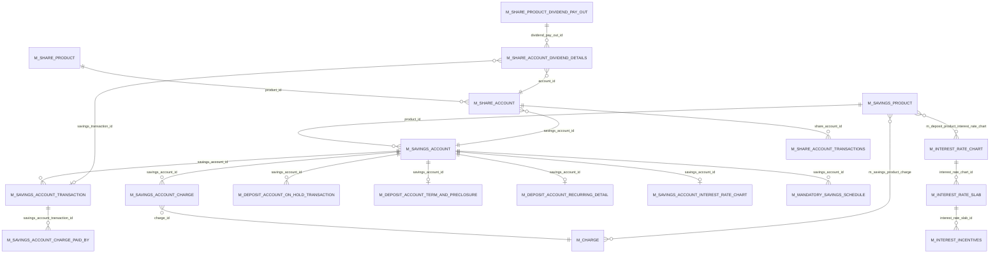

The **savings** subsystem of Apache Fineract is the second of the two big "money pillars" of the platform (alongside loans). It models *every* customer-facing deposit account: passbook savings, term/fixed deposits, recurring deposits, and — as a closely related sibling — share accounts and the dividends posted to them. All four account types share a common transactional substrate (debits, credits, interest postings, charges, holds) but diverge in how interest is calculated, when funds become available, and how the account terminates.

This page is the entry point for that whole area of the codebase. Subsequent pages in the **Savings & Deposits** group drill into individual aggregates, the interest engine, jobs, and APIs.

## Where the code lives

Unlike loans (which live almost entirely in `fineract-provider`), savings is split between two Gradle modules:

<CardGroup cols={2}>
  <Card title="fineract-savings" icon="piggy-bank">
    All domain entities, value types, transactional logic, interest-period mathematics, and the read/write platform service interfaces. Anything other modules need to compile against (e.g. the loan module reading a linked savings account, or charges/accounting pulling balances) sits here.

    Path: `fineract-savings/src/main/java/org/apache/fineract/portfolio/savings/`
  </Card>
  <Card title="fineract-provider" icon="server">
    JAX-RS API resources, the JPA-backed write platform service implementations, the deposit-account subclasses (`FixedDepositAccount`, `RecurringDepositAccount`), Spring Batch jobs, and the assembler chain that materialises commands into entities.

    Path: `fineract-provider/src/main/java/org/apache/fineract/portfolio/savings/`
  </Card>
</CardGroup>

Two adjacent packages complete the picture and are documented as part of this group:

- `fineract-provider/src/main/java/org/apache/fineract/portfolio/shareproducts/` and `.../shareaccounts/` — share capital products and member share accounts. Dividend posting writes back into a savings account via `SavingsAccountTransactionType.DIVIDEND_PAYOUT`, which is why it belongs to the same conceptual area.
- `fineract-savings/src/main/java/org/apache/fineract/portfolio/interestratechart/` plus `fineract-provider/src/main/java/org/apache/fineract/portfolio/interestratechart/` — the reusable interest-rate-chart engine used by `FixedDepositProduct` and `RecurringDepositProduct` to express tiered "amount × period" rate tables and per-attribute incentives.

## Three product types, one persistence table

The three deposit account flavours are not separate tables. They are modelled as a JPA `SINGLE_TABLE` inheritance hierarchy, discriminated by an integer in `m_savings_account.deposit_type_enum`:

```java
// fineract-savings/.../portfolio/savings/domain/SavingsAccount.java
@Entity
@Table(name = "m_savings_account", uniqueConstraints = { ... })
@Inheritance(strategy = InheritanceType.SINGLE_TABLE)
@DiscriminatorColumn(name = "deposit_type_enum", discriminatorType = DiscriminatorType.INTEGER)
@DiscriminatorValue("100")
public class SavingsAccount extends AbstractAuditableWithUTCDateTimeCustom<Long> implements IDepositAccountType { ... }
```

```java
// fineract-provider/.../portfolio/savings/domain/FixedDepositAccount.java
@Entity
@DiscriminatorValue("200")
public class FixedDepositAccount extends SavingsAccount { ... }

// fineract-provider/.../portfolio/savings/domain/RecurringDepositAccount.java
@Entity
@DiscriminatorValue("300")
public class RecurringDepositAccount extends SavingsAccount { ... }
```

The discriminator values come from `fineract-core/src/main/java/org/apache/fineract/portfolio/savings/DepositAccountType.java`:

| Value | Constant | Discriminator class |
| --- | --- | --- |
| 100 | `SAVINGS_DEPOSIT` | `SavingsAccount` |
| 200 | `FIXED_DEPOSIT` | `FixedDepositAccount` |
| 300 | `RECURRING_DEPOSIT` | `RecurringDepositAccount` |
| 400 | `CURRENT_DEPOSIT` | _(reserved; no concrete subclass)_ |

The products mirror the same inheritance: `SavingsProduct` (`@DiscriminatorValue("100")`) ← `FixedDepositProduct` (`200`) ← `RecurringDepositProduct` (`300`). `RecurringDepositProduct` extends `FixedDepositProduct` because a recurring deposit *is* a fixed deposit with an installment schedule attached.



The fact that all three live in one table makes joins trivial (the savings ledger does not care what flavour an account is) and means transaction posting, interest computation, and charge logic can be shared. The trade-off is a fairly wide table; the `m_savings_account` row carries nullable columns for fields that are only meaningful for some subtypes.

## Module map of `fineract-savings`

The `portfolio/savings/` package in `fineract-savings` is organised as a classic Fineract domain module:



And the **provider-side** complement contains everything that needs to plug into JAX-RS, the command bus, or Spring Batch:



## How the aggregates relate

Below is a minimal entity-relationship view of the savings/deposits world, focused on the persistence tables you'll meet in code. Joins go through foreign-key columns named in `@JoinColumn` annotations.



A few things to notice from this picture:

1. `m_savings_account` is the spine. Fixed-deposit and recurring-deposit-specific tables (`m_deposit_account_term_and_preclosure`, `m_deposit_account_recurring_detail`, `m_mandatory_savings_schedule`, `m_savings_account_interest_rate_chart`) all hang off it by a `savings_account_id` FK.
2. Charges are declared once on `m_savings_product` and then *instantiated* per account into `m_savings_account_charge` rows. Payment of a charge produces a row in `m_savings_account_charge_paid_by` linking it back to the actual `m_savings_account_transaction`.
3. Interest-rate charts are the same shape as everywhere else in Fineract: `m_interest_rate_chart` → `m_interest_rate_slab` → `m_interest_incentives`. When an account is opened the chart is **copied** into `m_savings_account_interest_rate_chart` so the chart can be edited later on the product without retroactively changing live accounts.
4. Share dividends land as a `DIVIDEND_PAYOUT` (`8`) transaction on the linked savings account; that is the only direct join between the shares package and the savings package.

## Where to go next

| If you need to understand… | Read |
| --- | --- |
| How a single passbook savings account moves through its lifecycle and what fields it stores | [Savings account aggregate](/savings/savings-account-aggregate) |
| The product template — interest rate, compounding, lock-in, overdraft, dormancy knobs | [Savings product](/savings/savings-product) |
| The full transaction-type taxonomy and the comparator that orders the ledger | [Savings transactions](/savings/savings-transactions) |
| How fees and penalties are attached, computed and paid | [Charges on savings](/savings/charges-on-savings) |
| Term deposits: maturity, pre-closure penalty, transfer-to-savings | [Fixed deposits](/savings/fixed-deposits) |
| Mandatory installments and the daily schedule generator | [Recurring deposits](/savings/recurring-deposits) |
| The interest engine: compounding periods, posting periods, daily-vs-average-daily | [Interest posting & compounding](/savings/interest-posting-and-compounding) |
| Dormancy lifecycle, escheat, and the maturity/dormancy jobs | [Dormancy & jobs](/savings/dormancy-and-jobs) |
| Share capital products, share accounts and dividend posting | [Share products & accounts](/savings/share-products-and-accounts) |
| Tiered interest tables and slab-based incentives | [Interest rate charts](/savings/interest-rate-charts) |

## Key file index

For quick navigation, the canonical source files referenced throughout this group:

- `fineract-savings/src/main/java/org/apache/fineract/portfolio/savings/domain/SavingsAccount.java` — root aggregate (~3,900 LOC)
- `fineract-savings/src/main/java/org/apache/fineract/portfolio/savings/domain/SavingsProduct.java`
- `fineract-savings/src/main/java/org/apache/fineract/portfolio/savings/domain/SavingsAccountTransaction.java`
- `fineract-savings/src/main/java/org/apache/fineract/portfolio/savings/domain/SavingsAccountCharge.java`
- `fineract-savings/src/main/java/org/apache/fineract/portfolio/savings/domain/SavingsAccountSummary.java`
- `fineract-savings/src/main/java/org/apache/fineract/portfolio/savings/domain/SavingsAccountTransactionComparator.java`
- `fineract-savings/src/main/java/org/apache/fineract/portfolio/savings/domain/DepositAccountTermAndPreClosure.java`
- `fineract-savings/src/main/java/org/apache/fineract/portfolio/savings/domain/DepositPreClosureDetail.java`
- `fineract-savings/src/main/java/org/apache/fineract/portfolio/savings/domain/FixedDepositProduct.java`
- `fineract-savings/src/main/java/org/apache/fineract/portfolio/savings/domain/RecurringDepositProduct.java`
- `fineract-savings/src/main/java/org/apache/fineract/portfolio/savings/domain/DepositAccountInterestRateChart.java`
- `fineract-savings/src/main/java/org/apache/fineract/portfolio/interestratechart/domain/InterestRateChart.java`
- `fineract-savings/src/main/java/org/apache/fineract/portfolio/interestratechart/domain/InterestRateChartSlab.java`
- `fineract-core/src/main/java/org/apache/fineract/portfolio/savings/SavingsAccountTransactionType.java`
- `fineract-core/src/main/java/org/apache/fineract/portfolio/savings/SavingsCompoundingInterestPeriodType.java`
- `fineract-core/src/main/java/org/apache/fineract/portfolio/savings/SavingsPostingInterestPeriodType.java`
- `fineract-core/src/main/java/org/apache/fineract/portfolio/savings/SavingsInterestCalculationType.java`
- `fineract-core/src/main/java/org/apache/fineract/portfolio/savings/SavingsInterestCalculationDaysInYearType.java`
- `fineract-core/src/main/java/org/apache/fineract/portfolio/savings/DepositAccountType.java`
- `fineract-core/src/main/java/org/apache/fineract/portfolio/savings/domain/SavingsAccountStatusType.java`
- `fineract-provider/src/main/java/org/apache/fineract/portfolio/savings/domain/FixedDepositAccount.java`
- `fineract-provider/src/main/java/org/apache/fineract/portfolio/savings/domain/RecurringDepositAccount.java`
- `fineract-provider/src/main/java/org/apache/fineract/portfolio/savings/domain/DepositAccountRecurringDetail.java`
- `fineract-provider/src/main/java/org/apache/fineract/portfolio/savings/domain/RecurringDepositScheduleInstallment.java`
- `fineract-provider/src/main/java/org/apache/fineract/portfolio/savings/api/SavingsAccountsApiResource.java` (path `/v1/savingsaccounts`)
- `fineract-provider/src/main/java/org/apache/fineract/portfolio/savings/api/SavingsProductsApiResource.java` (path `/v1/savingsproducts`)
- `fineract-provider/src/main/java/org/apache/fineract/portfolio/savings/api/SavingsAccountTransactionsApiResource.java`
- `fineract-provider/src/main/java/org/apache/fineract/portfolio/savings/api/SavingsAccountChargesApiResource.java` (path `/v1/savingsaccounts/{savingsAccountId}/charges`)
- `fineract-provider/src/main/java/org/apache/fineract/portfolio/savings/api/FixedDepositAccountsApiResource.java` (path `/v1/fixeddepositaccounts`)
- `fineract-provider/src/main/java/org/apache/fineract/portfolio/savings/api/FixedDepositProductsApiResource.java` (path `/v1/fixeddepositproducts`)
- `fineract-provider/src/main/java/org/apache/fineract/portfolio/savings/api/RecurringDepositAccountsApiResource.java` (path `/v1/recurringdepositaccounts`)
- `fineract-provider/src/main/java/org/apache/fineract/portfolio/savings/api/RecurringDepositProductsApiResource.java` (path `/v1/recurringdepositproducts`)
- `fineract-provider/src/main/java/org/apache/fineract/portfolio/interestratechart/api/InterestRateChartsApiResource.java` (path `/v1/interestratecharts`)
- `fineract-provider/src/main/java/org/apache/fineract/portfolio/interestratechart/api/InterestRateChartSlabsApiResource.java` (path `/v1/interestratecharts/{chartId}/chartslabs`)
- `fineract-provider/src/main/java/org/apache/fineract/portfolio/shareproducts/domain/ShareProduct.java`
- `fineract-provider/src/main/java/org/apache/fineract/portfolio/shareaccounts/domain/ShareAccount.java`
- `fineract-provider/src/main/java/org/apache/fineract/portfolio/shareproducts/api/ShareDividendApiResource.java` (path `/v1/shareproduct/{productId}/dividend`)

## Scheduler-facing surface

Several scheduled jobs orchestrate the savings lifecycle. They are registered in `fineract-core/src/main/java/org/apache/fineract/infrastructure/jobs/service/JobName.java`:

```java
APPLY_ANNUAL_FEE_FOR_SAVINGS("Apply Annual Fee For Savings"),
POST_INTEREST_FOR_SAVINGS("Post Interest For Savings"),
PAY_DUE_SAVINGS_CHARGES("Pay Due Savings Charges"),
UPDATE_DEPOSITS_ACCOUNT_MATURITY_DETAILS("Update Deposit Accounts Maturity details"),
TRANSFER_INTEREST_TO_SAVINGS("Transfer Interest To Savings"),
GENERATE_RD_SCEHDULE("Generate Mandatory Savings Schedule"),
POST_DIVIDENTS_FOR_SHARES("Post Dividends For Shares"),
UPDATE_SAVINGS_DORMANT_ACCOUNTS("Update Savings Dormant Accounts"),
```

Each one is implemented as a Spring Batch `Tasklet` under `fineract-provider/.../portfolio/savings/jobs/<job-name>/` (or under `shareaccounts/jobs/postdividentsforshares/` for the dividend job). The [dormancy & jobs](/savings/dormancy-and-jobs) and [interest posting & compounding](/savings/interest-posting-and-compounding) pages walk through the bodies in detail.

## Conventions used in this group

- Source paths are always written relative to the repository root, starting with `fineract-savings/`, `fineract-provider/` or `fineract-core/`.
- Where a single class spans multiple thousand lines, page snippets quote only the slice that matters; the line counts in the [Overview file index](#key-file-index) help you find the canonical definition.
- "Account" in this group means a `SavingsAccount` row (any subtype) unless explicitly prefixed with "share" or "loan".
- "Product" always refers to a `SavingsProduct` subtype: the *template* that an account is opened from, not the account itself.
