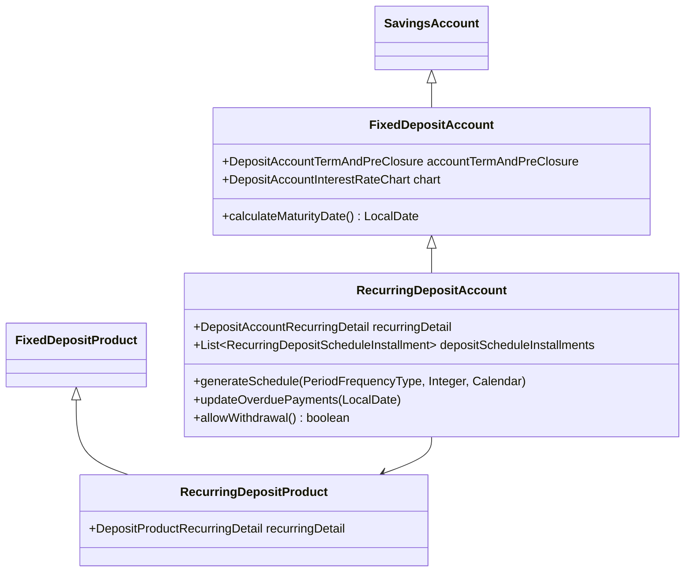
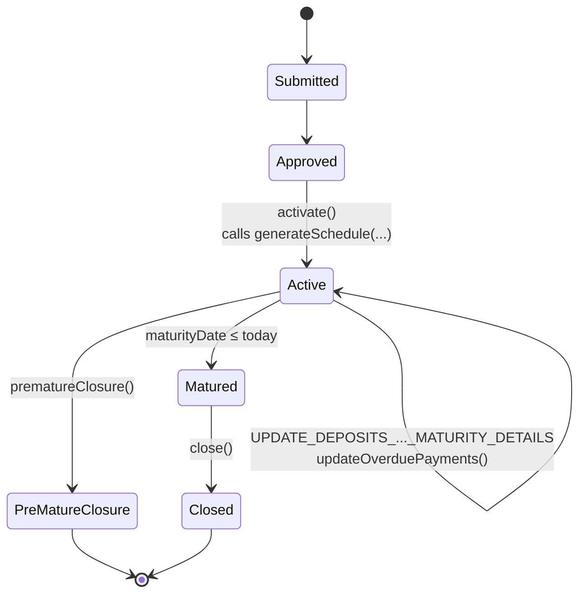
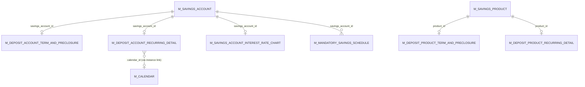

A **recurring deposit (RD)** in Apache Fineract is a fixed deposit that the customer funds in regular installments instead of one lump-sum principal. The interest-and-maturity machinery is identical to FD; the new piece is a *schedule* of expected installments and the bookkeeping that tracks late/missed contributions.

Mechanically, `RecurringDepositAccount` extends `FixedDepositAccount`, and `RecurringDepositProduct` extends `FixedDepositProduct`. The two new tables are `m_deposit_account_recurring_detail` (one row per account, summary fields) and `m_mandatory_savings_schedule` (one row per installment).

## Class hierarchy



## `RecurringDepositAccount`

```java
// fineract-provider/.../portfolio/savings/domain/RecurringDepositAccount.java
@Entity
@DiscriminatorValue("300")
public class RecurringDepositAccount extends SavingsAccount {

    @OneToOne(mappedBy = "account", cascade = CascadeType.ALL)
    private DepositAccountTermAndPreClosure accountTermAndPreClosure;

    @OneToOne(mappedBy = "account", cascade = CascadeType.ALL)
    private DepositAccountRecurringDetail recurringDetail;

    @OneToOne(fetch = FetchType.LAZY, cascade = CascadeType.ALL, mappedBy = "account")
    private DepositAccountInterestRateChart chart;

    @OrderBy(value = "installmentNumber, id")
    @OneToMany(cascade = CascadeType.ALL, mappedBy = "account", orphanRemoval = true, fetch = FetchType.LAZY)
    private List<RecurringDepositScheduleInstallment> depositScheduleInstallments = new ArrayList<>();
}
```

Note the difference from `FixedDepositAccount`: although both extend `SavingsAccount` directly, `RecurringDepositAccount` *does not* extend `FixedDepositAccount` at the JPA-discriminator level — both are direct `@DiscriminatorValue` children of `SavingsAccount` (200 and 300). The Java-side class hierarchy is `RecurringDepositAccount extends SavingsAccount` (not `extends FixedDepositAccount`), because every FD column would otherwise be inherited and a parallel `accountTermAndPreClosure` would conflict.

## `DepositAccountRecurringDetail`

```java
// fineract-provider/.../portfolio/savings/domain/DepositAccountRecurringDetail.java
@Entity
@Table(name = "m_deposit_account_recurring_detail")
public class DepositAccountRecurringDetail extends AbstractPersistableCustom<Long> {

    @Column(name = "mandatory_recommended_deposit_amount")  private BigDecimal mandatoryRecommendedDepositAmount;
    @Column(name = "total_overdue_amount")                  private BigDecimal totalOverdueAmount;
    @Column(name = "is_calendar_inherited", nullable=false) private boolean isCalendarInherited;
    @Column(name = "no_of_overdue_installments")            private Integer noOfOverdueInstallments;

    @Embedded private DepositRecurringDetail recurringDetail;

    @OneToOne @JoinColumn(name = "savings_account_id", nullable = false)
    private SavingsAccount account;
}
```

The columns split into two groups:

- **Configuration**: `mandatoryRecommendedDepositAmount` (the installment), `isCalendarInherited` (true → the schedule follows a `Calendar` attached to the parent client/group; false → the schedule is its own thing), and the embedded `DepositRecurringDetail` (adjust-on-due-date policy, advance-payment policy).
- **Roll-up**: `totalOverdueAmount` and `noOfOverdueInstallments`, recomputed by `updateOverduePayments(...)`.

The `updateMandatoryRecommendedDepositAmount(...)` write method is interesting: it only works while the parent account is ACTIVE (it raises a `PlatformApiDataValidationException` otherwise), and it cascades into the schedule via `updateScheduleInstallmentsWithNewRecommendedDepositAmount(...)`:

```java
// DepositAccountRecurringDetail.java :: updateMandatoryRecommendedDepositAmount(...)
RecurringDepositAccount depositAccount = (RecurringDepositAccount) this.account;
if (depositAccount.isNotActive()) {
    throw new PlatformApiDataValidationException(...);  // error.msg.recurringdeposit.is.not.active
}
depositAccount.updateScheduleInstallmentsWithNewRecommendedDepositAmount(newMandatoryRecommendedDepositAmount, effectiveDate);
depositAccount.updateOverduePayments(DateUtils.getBusinessLocalDate());
```

## `RecurringDepositScheduleInstallment`

One row per expected installment.

```java
// fineract-provider/.../portfolio/savings/domain/RecurringDepositScheduleInstallment.java
@Entity
@Table(name = "m_mandatory_savings_schedule")
public class RecurringDepositScheduleInstallment extends AbstractAuditableWithUTCDateTimeCustom<Long> {

    @ManyToOne(optional = false) @JoinColumn(name = "savings_account_id")
    private RecurringDepositAccount account;

    @Column(name = "installment", nullable = false)           private Integer installmentNumber;
    @Column(name = "fromdate")                                private LocalDate fromDate;
    @Column(name = "duedate",   nullable = false)             private LocalDate dueDate;
    @Column(name = "deposit_amount")                          private BigDecimal depositAmount;
    @Column(name = "deposit_amount_completed_derived")        private BigDecimal depositAmountCompleted;
    @Column(name = "total_paid_in_advance_derived")           private BigDecimal totalPaidInAdvance;
    @Column(name = "total_paid_late_derived")                 private BigDecimal totalPaidLate;
    @Column(name = "completed_derived", nullable = false)     private boolean obligationsMet;
    @Column(name = "obligations_met_on_date")                 private LocalDate obligationsMetOnDate;
}
```

The five derived columns make it cheap to answer "is this installment paid?", "by how much was it short?", "was it paid early?" without re-walking the savings ledger every time. The `RecurringDepositAccount.handlePayment(...)` pathway (called whenever a deposit lands) updates them.

## Schedule generation

```java
// RecurringDepositAccount.java :: generateSchedule(...)
public void generateSchedule(PeriodFrequencyType frequency, Integer recurringEvery, Calendar calendar) {
    this.depositScheduleInstallments.clear();
    LocalDate installmentDate = this.isCalendarInherited()
            ? CalendarUtils.getNextScheduleDate(calendar, accountSubmittedOrActivationDate())
            : depositStartDate();

    int installmentNumber = 1;
    final LocalDate maturityDate = calcualteScheduleTillDate(frequency, recurringEvery);
    final BigDecimal depositAmount = this.recurringDetail.mandatoryRecommendedDepositAmount();

    while (DateUtils.isBefore(installmentDate, maturityDate)) {
        final RecurringDepositScheduleInstallment installment =
                RecurringDepositScheduleInstallment.installment(this, installmentNumber, installmentDate, depositAmount);
        addDepositScheduleInstallment(installment);
        installmentDate = DepositAccountUtils.calculateNextDepositDate(installmentDate, frequency, recurringEvery);
        installmentNumber += 1;
    }
    updateDepositAmount();
}
```

It runs at activation time:

1. Wipe any pre-existing schedule (defensive — first-time activations have none).
2. Pick the first installment date. If the schedule is inherited from a `Calendar`, use the calendar's next-occurrence rule; otherwise use the account's own start date.
3. Step forward by the recurrence interval using `DepositAccountUtils.calculateNextDepositDate`:

```java
// fineract-savings/.../portfolio/savings/DepositAccountUtils.java
public static LocalDate calculateNextDepositDate(LocalDate lastDepositDate, PeriodFrequencyType frequency, int recurringEvery) {
    return switch (frequency) {
        case DAYS   -> lastDepositDate.plusDays(recurringEvery);
        case WEEKS  -> lastDepositDate.plusWeeks(recurringEvery);
        case MONTHS -> lastDepositDate.plusMonths(recurringEvery);
        case YEARS  -> lastDepositDate.plusYears(recurringEvery);
        // …
    };
}
```

If `calculateMaturityDate()` returns null (which it does until the account is approved), `calcualteScheduleTillDate(...)` falls back to "today + a few intervals":

```java
private LocalDate calcualteScheduleTillDate(PeriodFrequencyType frequency, Integer recurringEvery) {
    LocalDate tillDate = calculateMaturityDate();
    if (tillDate == null) {
        final LocalDate today = DateUtils.getBusinessLocalDate();
        tillDate = DepositAccountUtils.calculateNextDepositDate(today, frequency,
                recurringEvery * (DepositAccountUtils.GENERATE_MINIMUM_NUMBER_OF_FUTURE_INSTALMENTS + 1));
    }
    return tillDate;
}
```

`GENERATE_MINIMUM_NUMBER_OF_FUTURE_INSTALMENTS = 5`, so even an unactivated RD has at least five upcoming installments visible.

## Overdue tracking

```java
// RecurringDepositAccount.java :: updateOverduePayments(...)
public void updateOverduePayments(final LocalDate todayDate) {
    LocalDate overdueUptoDate = this.maturityDate();
    if (overdueUptoDate == null || DateUtils.isAfter(overdueUptoDate, todayDate)) {
        overdueUptoDate = todayDate;
    }
    int noOfOverdueInstallments = 0;
    Money totalOverdueAmount = Money.zero(getCurrency());
    for (RecurringDepositScheduleInstallment installment : depositScheduleInstallments()) {
        if (installment.isNotFullyPaidOff() && DateUtils.isAfter(overdueUptoDate, installment.dueDate())) {
            noOfOverdueInstallments++;
            totalOverdueAmount = totalOverdueAmount.plus(installment.getDepositAmountOutstanding(getCurrency()));
        }
    }
    this.recurringDetail.updateOverdueDetails(noOfOverdueInstallments, totalOverdueAmount);
}
```

It scans the installments list, counts the ones whose due date is in the past and aren't fully paid, and rolls the totals into `DepositAccountRecurringDetail.{noOfOverdueInstallments, totalOverdueAmount}`. This runs:

- After every deposit posting on an RD (so the customer's just-made payment immediately reflects).
- From `UPDATE_DEPOSITS_ACCOUNT_MATURITY_DETAILS` (see [Dormancy & jobs](/savings/dormancy-and-jobs)) — that job sweeps the whole portfolio nightly.

## The `GENERATE_RD_SCEHDULE` job

Recurring deposits open with five upcoming installments. As time passes and existing installments become due, the schedule must be extended — that is what `GENERATE_RD_SCEHDULE` (sic — typo preserved verbatim in `JobName.java`) does:

```java
// fineract-provider/.../portfolio/savings/jobs/generaterdschedule/GenerateRdScheduleTasklet.java
@Slf4j
@RequiredArgsConstructor
public class GenerateRdScheduleTasklet implements Tasklet {

    private final RoutingDataSourceServiceFactory dataSourceServiceFactory;
    private final DepositAccountReadPlatformService depositAccountReadPlatformService;
    private final PlatformSecurityContext securityContext;

    @Override
    public RepeatStatus execute(StepContribution contribution, ChunkContext chunkContext) throws Exception {
        final JdbcTemplate jdbcTemplate = new JdbcTemplate(dataSourceServiceFactory.determineDataSourceService().retrieveDataSource());
        final Collection<Map<String, Object>> scheduleDetails = depositAccountReadPlatformService.retriveDataForRDScheduleCreation();
        String insertSql = "INSERT INTO m_mandatory_savings_schedule (savings_account_id, duedate, installment, deposit_amount, completed_derived, "
                + CREATED_DATE_DB_FIELD + ", " + CREATED_BY_DB_FIELD + ", " + LAST_MODIFIED_DATE_DB_FIELD + ", " + LAST_MODIFIED_BY_DB_FIELD
                + ") " + "VALUES (?, ?, ?, ?, ?, ?, ?)";
        List<Object[]> params = new ArrayList<>();
        Long userId = securityContext.authenticatedUser().getId();
        int iterations = 0;
        for (Map<String, Object> details : scheduleDetails) {
            Long count = (Long) details.get("futureInstallments");
            if (count == null) count = 0L;
            final Long savingsId = (Long) details.get("savingsId");
            final BigDecimal amount = (BigDecimal) details.get("amount");
            final String recurrence = (String) details.get("recurrence");
            LocalDate lastDepositDate = (LocalDate) details.get("dueDate");
            Integer installmentNumber = (Integer) details.get("installment");
            while (count < DepositAccountUtils.GENERATE_MINIMUM_NUMBER_OF_FUTURE_INSTALMENTS) {
                count++;
                installmentNumber++;
                lastDepositDate = DepositAccountUtils.calculateNextDepositDate(lastDepositDate, recurrence);
                OffsetDateTime auditTime = DateUtils.getAuditOffsetDateTime();
                params.add(new Object[] { savingsId, lastDepositDate, installmentNumber, amount, false, auditTime, userId, auditTime, userId });
            }
            // …batch insert in chunks
        }
        return RepeatStatus.FINISHED;
    }
}
```

Things to notice:

- The job goes **straight to JDBC** (`JdbcTemplate.batchUpdate`). It does not rehydrate `RecurringDepositAccount` entities. The reason is throughput: for a tenant with thousands of RDs, materialising the aggregate just to add five installments would be prohibitive.
- `depositAccountReadPlatformService.retriveDataForRDScheduleCreation()` (sic) returns a flat result-set per account: the recurrence string, the last installment number, the last due date, and a count of future-due (`futureInstallments`) installments.
- The recurrence string is a Calendar recurrence (e.g. `FREQ=MONTHLY;INTERVAL=1`), parsed by `DepositAccountUtils.calculateNextDepositDate(LocalDate, String)` → `CalendarUtils.getFrequency / getInterval`.
- The loop tops up the schedule to exactly `GENERATE_MINIMUM_NUMBER_OF_FUTURE_INSTALMENTS = 5` future installments.

The job is registered in `JobName.java` as:

```java
GENERATE_RD_SCEHDULE("Generate Mandatory Savings Schedule"),
```

The human-readable name is correct ("Generate Mandatory Savings Schedule"); only the constant has the typo. Don't fix it — every config row and unit test references the misspelt name.

## REST surface: `RecurringDepositAccountsApiResource`

```java
// fineract-provider/.../portfolio/savings/api/RecurringDepositAccountsApiResource.java
@Path("/v1/recurringdepositaccounts")
public class RecurringDepositAccountsApiResource { ... }
```

The verb map mirrors fixed deposit:

| HTTP | Path | Purpose |
| --- | --- | --- |
| GET | `/v1/recurringdepositaccounts` | List. |
| GET | `/v1/recurringdepositaccounts/template?clientId=&productId=` | Form template. |
| GET | `/v1/recurringdepositaccounts/{accountId}` | Detail. |
| POST | `/v1/recurringdepositaccounts` | Submit application. |
| PUT | `/v1/recurringdepositaccounts/{accountId}` | Modify pending/approved application. |
| POST | `/v1/recurringdepositaccounts/{accountId}?command=approve` | Approve (RD schedule is **not** generated here yet). |
| POST | `/v1/recurringdepositaccounts/{accountId}?command=activate` | Activate — calls `generateSchedule(...)`. |
| POST | `/v1/recurringdepositaccounts/{accountId}?command=undoApproval` | Reverse approval. |
| POST | `/v1/recurringdepositaccounts/{accountId}?command=reject` | Reject. |
| POST | `/v1/recurringdepositaccounts/{accountId}?command=updateRecurringDepositDetails` | Change the mandatory installment amount. |
| POST | `/v1/recurringdepositaccounts/{accountId}?command=calculateInterest` | Pure preview. |
| POST | `/v1/recurringdepositaccounts/{accountId}?command=postInterest` | Force interest posting. |
| POST | `/v1/recurringdepositaccounts/{accountId}?command=close` | Close after maturity. |
| POST | `/v1/recurringdepositaccounts/{accountId}?command=prematureClose` | Pre-mature closure. |

`RecurringDepositProductsApiResource` (path `/v1/recurringdepositproducts`) follows the standard product CRUD shape and won't be repeated here.

## Lifecycle



## ER picture



## Source paths

- `fineract-savings/src/main/java/org/apache/fineract/portfolio/savings/DepositAccountUtils.java`
- `fineract-savings/src/main/java/org/apache/fineract/portfolio/savings/domain/RecurringDepositProduct.java`
- `fineract-savings/src/main/java/org/apache/fineract/portfolio/savings/domain/DepositProductRecurringDetail.java`
- `fineract-savings/src/main/java/org/apache/fineract/portfolio/savings/domain/DepositRecurringDetail.java`
- `fineract-savings/src/main/java/org/apache/fineract/portfolio/savings/domain/RecurringDepositProductRepository.java`
- `fineract-savings/src/main/java/org/apache/fineract/portfolio/savings/service/RecurringDepositProductWritePlatformService.java`
- `fineract-provider/src/main/java/org/apache/fineract/portfolio/savings/domain/RecurringDepositAccount.java`
- `fineract-provider/src/main/java/org/apache/fineract/portfolio/savings/domain/RecurringDepositAccountRepository.java`
- `fineract-provider/src/main/java/org/apache/fineract/portfolio/savings/domain/RecurringDepositScheduleInstallment.java`
- `fineract-provider/src/main/java/org/apache/fineract/portfolio/savings/domain/DepositAccountRecurringDetail.java`
- `fineract-provider/src/main/java/org/apache/fineract/portfolio/savings/api/RecurringDepositAccountsApiResource.java` — `/v1/recurringdepositaccounts`
- `fineract-provider/src/main/java/org/apache/fineract/portfolio/savings/api/RecurringDepositProductsApiResource.java` — `/v1/recurringdepositproducts`
- `fineract-provider/src/main/java/org/apache/fineract/portfolio/savings/api/RecurringDepositAccountTransactionsApiResource.java`
- `fineract-provider/src/main/java/org/apache/fineract/portfolio/savings/jobs/generaterdschedule/GenerateRdScheduleTasklet.java`
- `fineract-provider/src/main/java/org/apache/fineract/portfolio/savings/jobs/generaterdschedule/GenerateRdScheduleConfig.java`
- `fineract-provider/src/main/java/org/apache/fineract/portfolio/savings/service/RecurringDepositProductWritePlatformServiceJpaRepositoryImpl.java`
- `fineract-core/src/main/java/org/apache/fineract/infrastructure/jobs/service/JobName.java` — `GENERATE_RD_SCEHDULE`
