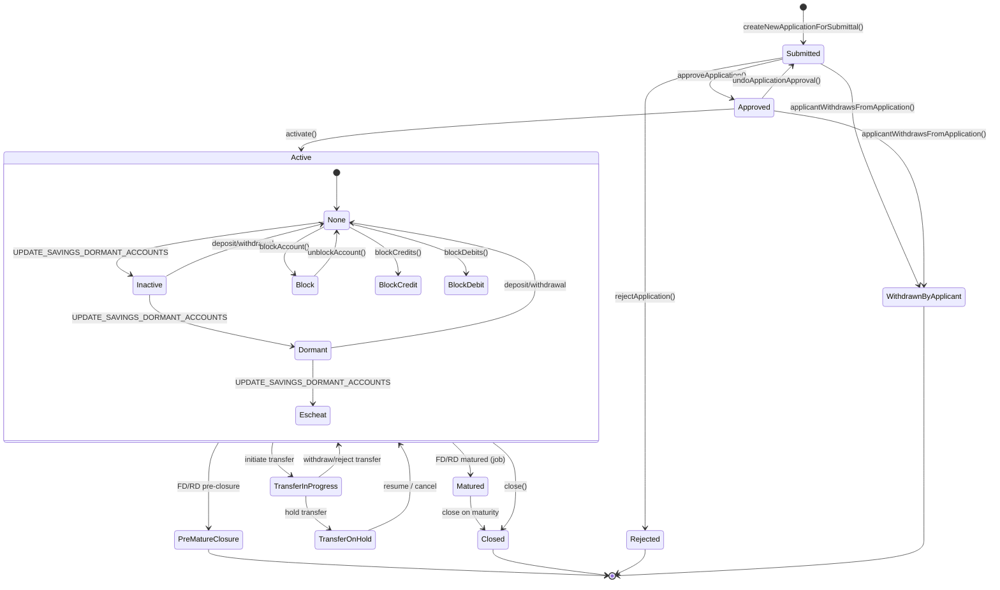
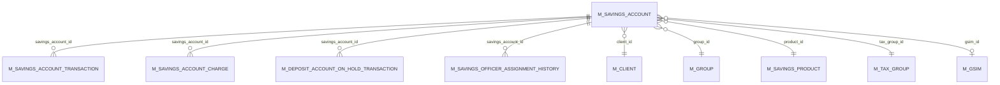

In the Apache Fineract savings and deposits world, **`SavingsAccount`** is the root aggregate. Every passbook account, every term deposit, every recurring deposit, every transaction, every charge, every interest posting hangs off a single `m_savings_account` row. This page is the field-by-field, lifecycle-by-lifecycle reference for that class.

The aggregate is defined in `fineract-savings/src/main/java/org/apache/fineract/portfolio/savings/domain/SavingsAccount.java` (~3,900 LOC). It is the parent of `FixedDepositAccount` (`@DiscriminatorValue("200")`) and `RecurringDepositAccount` (`@DiscriminatorValue("300")`), both of which live in `fineract-provider/.../portfolio/savings/domain/`.

## JPA mapping

```java
// fineract-savings/.../portfolio/savings/domain/SavingsAccount.java
@Entity
@Table(name = "m_savings_account", uniqueConstraints = {
        @UniqueConstraint(columnNames = { "account_no" }, name = "sa_account_no_UNIQUE"),
        @UniqueConstraint(columnNames = { "external_id" }, name = "sa_external_id_UNIQUE") })
@Inheritance(strategy = InheritanceType.SINGLE_TABLE)
@DiscriminatorColumn(name = "deposit_type_enum", discriminatorType = DiscriminatorType.INTEGER)
@DiscriminatorValue("100")
public class SavingsAccount extends AbstractAuditableWithUTCDateTimeCustom<Long> implements IDepositAccountType {
    @Version int version;
    @Column(name = "account_no", length = 20, unique = true, nullable = false)
    protected String accountNumber;
    @Column(name = "external_id", nullable = true)
    protected ExternalId externalId;
    // ... 60+ more columns
}
```

A few things to note about the mapping itself:

- It extends `AbstractAuditableWithUTCDateTimeCustom<Long>`, so every row carries `created_by`, `created_date`, `last_modified_by`, `last_modified_date` audit columns.
- The `@Version` field is *not* JPA-annotated as the auto-incremented surrogate key. It is the standard JPA optimistic-locking version — the surrogate id comes from the inherited base class.
- Inheritance is `SINGLE_TABLE`, so the same row physically stores FD/RD-specific columns when populated, and the discriminator decides which Java subtype Hibernate/EclipseLink hydrates.

## Field map

The 60-ish columns on `m_savings_account` fall into clear groups. The table below lists the important ones; line numbers are taken from the file as of writing.

### Identity, ownership and product link

| Column | Java field | Notes |
| --- | --- | --- |
| `account_no` | `accountNumber` | If left blank at submission, populated by `new RandomPasswordGenerator(19).generate()`. |
| `external_id` | `externalId` | `ExternalId` value type. |
| `client_id` | `client` | `@ManyToOne` to `Client`. Nullable: a savings account can belong to a group instead. |
| `group_id` | `group` | `@ManyToOne` to `Group`. |
| `gsim_id` | `gsim` | Link to `GroupSavingsIndividualMonitoring` for joint savings under a group. |
| `product_id` | `product` | `@ManyToOne` to `SavingsProduct`. Required. |
| `field_officer_id` | `savingsOfficer` | `@ManyToOne` to `Staff`. |
| `account_type_enum` | `accountType` | `AccountType` (individual / group / GSIM / JLG). |
| `deposit_type_enum` | `depositType` | `insertable = false, updatable = false` — read-only view of the discriminator. |

### Lifecycle dates / actors

Each lifecycle transition writes a date + user pair:

```java
@Column(name = "submittedon_date") protected LocalDate submittedOnDate;
@ManyToOne(fetch = FetchType.LAZY) @JoinColumn(name = "submittedon_userid")
protected AppUser submittedBy;

@Column(name = "approvedon_date")  protected LocalDate approvedOnDate;
@Column(name = "rejectedon_date")  protected LocalDate rejectedOnDate;
@Column(name = "withdrawnon_date") protected LocalDate withdrawnOnDate;
@Column(name = "activatedon_date") protected LocalDate activatedOnDate;
@Column(name = "closedon_date")    protected LocalDate closedOnDate;
```

Plus `lockedin_until_date_derived` (the *derived* date until which withdrawals are blocked), `start_interest_calculation_date`, `accrued_till_date`, `last_closed_business_date`.

### Status enums

Two enums govern the lifecycle:

```java
// fineract-core/.../portfolio/savings/domain/SavingsAccountStatusType.java
@Column(name = "status_enum", nullable = false) protected Integer status;

// fineract-core/.../portfolio/savings/domain/SavingsAccountSubStatusEnum.java
@Column(name = "sub_status_enum", nullable = false) protected Integer sub_status = 0;
```

The two are orthogonal. The primary `status` is the application/account lifecycle. The `sub_status` is layered on top of `ACTIVE` to capture dormancy and operational holds. See [Dormancy & jobs](/savings/dormancy-and-jobs) for the dormancy progression.

### Interest configuration (copied from product at creation)

```java
@Column(name = "nominal_annual_interest_rate", scale = 6, precision = 19, nullable = false)
protected BigDecimal nominalAnnualInterestRate;

@Column(name = "interest_compounding_period_enum", nullable = false)
protected Integer interestCompoundingPeriodType;     // SavingsCompoundingInterestPeriodType
@Column(name = "interest_posting_period_enum", nullable = false)
protected Integer interestPostingPeriodType;         // SavingsPostingInterestPeriodType
@Column(name = "interest_calculation_type_enum", nullable = false)
protected Integer interestCalculationType;           // SavingsInterestCalculationType
@Column(name = "interest_calculation_days_in_year_type_enum", nullable = false)
protected Integer interestCalculationDaysInYearType; // SavingsInterestCalculationDaysInYearType
```

When the account is created in `createNewApplicationForSubmittal(...)`, every interest knob is *copied* off the `SavingsProduct`. Changing the product later does **not** retroactively rewrite live accounts.

### Lock-in, balance enforcement and lien

```java
@Column(name = "lockin_period_frequency")        protected Integer lockinPeriodFrequency;
@Column(name = "lockin_period_frequency_enum")   protected Integer lockinPeriodFrequencyType;
@Column(name = "lockedin_until_date_derived")    protected LocalDate lockedInUntilDate;

@Column(name = "withdrawal_fee_for_transfer")    protected boolean withdrawalFeeApplicableForTransfer;
@Column(name = "enforce_min_required_balance")   private boolean enforceMinRequiredBalance;
@Column(name = "min_required_balance")           private BigDecimal minRequiredBalance;
@Column(name = "is_lien_allowed", nullable = false) private boolean lienAllowed;
@Column(name = "max_allowed_lien_limit")         private BigDecimal maxAllowedLienLimit;
@Column(name = "min_balance_for_interest_calculation") private BigDecimal minBalanceForInterestCalculation;
```

Withdrawals during the lock-in period throw an exception:

```java
// SavingsAccount.java :: withdraw(...) — abbreviated
if (DateUtils.isBefore(transactionDate, getLockedInUntilLocalDate())) {
    final String defaultUserMessage = "Withdrawal is not allowed. No withdrawals are allowed until after " + ...;
    throw new GeneralPlatformDomainRuleException(
        "error.msg.savingsaccount.transaction.withdrawals.blocked.during.lockin.period",
        defaultUserMessage, "transactionDate", transactionDate);
}
```

### Overdraft

```java
@Column(name = "allow_overdraft")                                       private boolean allowOverdraft;
@Column(name = "overdraft_limit", scale = 6, precision = 19)            private BigDecimal overdraftLimit;
@Column(name = "nominal_annual_interest_rate_overdraft")                protected BigDecimal nominalAnnualInterestRateOverdraft;
@Column(name = "min_overdraft_for_interest_calculation")                private BigDecimal minOverdraftForInterestCalculation;
```

When `allowOverdraft = true` the account can go negative up to `overdraftLimit`. Overdraft interest is computed independently using `nominalAnnualInterestRateOverdraft` and posted as `SavingsAccountTransactionType.OVERDRAFT_INTEREST` (value `17`, debit) — see [Interest posting & compounding](/savings/interest-posting-and-compounding).

The constructor calls `esnureOverdraftLimitsSetForOverdraftAccounts()` (sic) to fail-fast if `allowOverdraft` is on but no limit was given.

### Hold-balance / on-hold funds / withhold tax

```java
@Column(name = "on_hold_funds_derived")                  private BigDecimal onHoldFunds;
@Column(name = "total_savings_amount_on_hold")           private BigDecimal savingsOnHoldAmount;
@Column(name = "withhold_tax", nullable = false)         protected boolean withHoldTax;
@ManyToOne @JoinColumn(name = "tax_group_id")            private TaxGroup taxGroup;
@Column(name = "reason_for_block")                       protected String reasonForBlock;
```

`onHoldFunds` is updated when [`DepositAccountOnHoldTransaction`](/savings/savings-transactions#hold-and-release) entries are written. It is subtracted from the running balance when computing available balance.

### Embedded summary and child collections

```java
@Embedded protected SavingsAccountSummary summary;

@OrderBy(value = "dateOf, createdDate, id")
@OneToMany(cascade = ALL, mappedBy = "savingsAccount", orphanRemoval = true, fetch = LAZY)
protected List<SavingsAccountTransaction> transactions = new ArrayList<>();

@OneToMany(cascade = ALL, mappedBy = "savingsAccount", orphanRemoval = true, fetch = LAZY)
protected Set<SavingsAccountCharge> charges = new HashSet<>();

@OneToMany(cascade = ALL, mappedBy = "savingsAccount", orphanRemoval = true, fetch = LAZY)
private Set<SavingsOfficerAssignmentHistory> savingsOfficerHistory = new HashSet<>();

@OneToMany(cascade = ALL, mappedBy = "account", orphanRemoval = true, fetch = LAZY)
protected List<InteropIdentifier> identifiers = new ArrayList<>();
```

The `@OrderBy("dateOf, createdDate, id")` is essential — every method on `SavingsAccount` that walks `transactions` assumes the order is "date asc, then insertion order".

## SavingsAccountSummary — the embedded balance ledger

`SavingsAccountSummary` is `@Embeddable`, so its columns live directly on `m_savings_account`. It is the *cached* roll-up of the transaction ledger, recomputed whenever a transaction is posted.

```java
// fineract-savings/.../portfolio/savings/domain/SavingsAccountSummary.java
@Embeddable public final class SavingsAccountSummary {
    @Column(name = "total_deposits_derived")           private BigDecimal totalDeposits;
    @Column(name = "total_withdrawals_derived")        private BigDecimal totalWithdrawals;
    @Column(name = "total_interest_earned_derived")    private BigDecimal totalInterestEarned;
    @Column(name = "total_interest_posted_derived")    private BigDecimal totalInterestPosted;
    @Column(name = "total_withdrawal_fees_derived")    private BigDecimal totalWithdrawalFees;
    @Column(name = "total_fees_charge_derived")        private BigDecimal totalFeeCharge;
    @Column(name = "total_penalty_charge_derived")     private BigDecimal totalPenaltyCharge;
    @Column(name = "total_annual_fees_derived")        private BigDecimal totalAnnualFees;
    @Column(name = "account_balance_derived")          private BigDecimal accountBalance = BigDecimal.ZERO;
    @Column(name = "total_overdraft_interest_derived") private BigDecimal totalOverdraftInterestDerived;
    @Column(name = "total_withhold_tax_derived")       private BigDecimal totalWithholdTax;
    @Column(name = "last_interest_calculation_date")   private LocalDate lastInterestCalculationDate;
    // …
}
```

`totalFeeChargesWaived` and `totalPenaltyChargesWaived` are `@Transient` — they are recomputed every load rather than persisted.

The summary is rebuilt by the `SavingsAccountTransactionSummaryWrapper`, injected at runtime via `SavingsAccount.setHelpers(...)`. Anything that mutates the ledger (deposit, withdrawal, interest posting, charge payment, reversal) must call into the summary update path or the cached balance and the actual sum of transactions drift apart.

## Lifecycle

The application moves through `SavingsAccountStatusType` values, with explicit method names on `SavingsAccount`:

| Method | Resulting `status_enum` | Notes |
| --- | --- | --- |
| `createNewApplicationForSubmittal(...)` | `100` SUBMITTED_AND_PENDING_APPROVAL | Static factory used by `SavingsAccountAssembler`. |
| `approveApplication(currentUser, command)` | `200` APPROVED | Records `approvedOnDate` / `approvedBy`. |
| `undoApplicationApproval()` | back to `100` | Clears approval timestamps. |
| `applicantWithdrawsFromApplication(currentUser, command)` | `400` WITHDRAWN_BY_APPLICANT | Terminal. |
| `rejectApplication(currentUser, command)` | `500` REJECTED | Terminal. |
| `activate(currentUser, command)` | `300` ACTIVE | Sets `activatedOnDate`, derives `lockedInUntilDate`. |
| `close(currentUser, command)` | `600` CLOSED | Terminal. |
| `setSubStatusInactive(...)` / `setSubStatusDormant()` / `escheat(appUser)` | leaves `status=300`; sets `sub_status_enum` | See [Dormancy & jobs](/savings/dormancy-and-jobs). |

`SavingsAccountStatusType` exposes helper predicates used everywhere in the codebase:

```java
// fineract-core/.../portfolio/savings/domain/SavingsAccountStatusType.java
public enum SavingsAccountStatusType {
    INVALID(0, ...), SUBMITTED_AND_PENDING_APPROVAL(100, ...),
    APPROVED(200, ...), ACTIVE(300, ...),
    TRANSFER_IN_PROGRESS(303, ...), TRANSFER_ON_HOLD(304, ...),
    WITHDRAWN_BY_APPLICANT(400, ...), REJECTED(500, ...),
    CLOSED(600, ...), PRE_MATURE_CLOSURE(700, ...), MATURED(800, ...);

    public boolean isActive() { ... }
    public boolean isClosed() {
        return this.value.equals(CLOSED.getValue()) || isRejected() || isApplicationWithdrawnByApplicant();
    }
    public boolean isUnderTransfer() { return isTransferInProgress() || isTransferOnHold(); }
    public boolean isMatured() { ... }
    public boolean isPreMatureClosure() { ... }
}
```

States `700` and `800` are only used by `FixedDepositAccount` / `RecurringDepositAccount`.

### State diagram



The inner `Active` state mirrors `SavingsAccountSubStatusEnum`:

```java
// fineract-core/.../portfolio/savings/domain/SavingsAccountSubStatusEnum.java
public enum SavingsAccountSubStatusEnum {
    NONE(0, ...), INACTIVE(100, ...), DORMANT(200, ...), ESCHEAT(300, ...),
    BLOCK(400, ...), BLOCK_CREDIT(500, ...), BLOCK_DEBIT(600, ...);
}
```

Any inbound transaction (`deposit`, `withdraw`) that lands on an account whose sub-status is `INACTIVE` or `DORMANT` resets the sub-status to `NONE`:

```java
// SavingsAccount.java :: deposit(...) — abbreviated, around line 1185
if (this.sub_status.equals(SavingsAccountSubStatusEnum.INACTIVE.getValue())
        || this.sub_status.equals(SavingsAccountSubStatusEnum.DORMANT.getValue())) {
    this.sub_status = SavingsAccountSubStatusEnum.NONE.getValue();
}
```

The `BLOCK*` sub-statuses are sticky — they only clear through `unblockAccount()` / `unblockCredits()` / `unblockDebits()`.

## Key behaviours on `SavingsAccount`

`SavingsAccount` is a *fat aggregate*: it contains essentially all the savings business logic. The methods you will meet most often:

| Method | Purpose |
| --- | --- |
| `deposit(SavingsAccountTransactionDTO)` | Posts a deposit; resets dormancy sub-status; updates summary. |
| `withdraw(SavingsAccountTransactionDTO, applyWithdrawFee, ...)` | Posts a withdrawal; enforces lockin, min-balance, overdraft limit, blocked debits. Auto-applies the configured withdrawal fee. |
| `holdAmount(...)` / `releaseAmount(...)` | Issues `AMOUNT_HOLD` / `AMOUNT_RELEASE` transactions and updates `onHoldFunds`. |
| `postInterest(MathContext, ...)` | Computes posting periods via `PostingPeriod` and writes `INTEREST_POSTING` / `OVERDRAFT_INTEREST` transactions. Idempotent: re-posting an already-posted period is a no-op unless the amount changed (then it reverses + reposts). |
| `calculateInterestUsing(MathContext, ...)` | Pure computation; returns `List<PostingPeriod>` without persisting anything. Used by previews. |
| `applyAnnualFee(...)` / `addCharge(...)` / `waiveCharge(...)` / `payCharge(...)` | Charge lifecycle. |
| `approveApplication / undoApplicationApproval / rejectApplication / applicantWithdrawsFromApplication / activate / close` | Lifecycle transitions. |
| `escheat(AppUser)` | Sets `sub_status = ESCHEAT`, writes a single `ESCHEAT` transaction, debits the entire balance. |
| `blockAccount() / unblockAccount() / blockCredits() / blockDebits()` | Sub-status manipulation. |
| `updateDepositAmountOnHold(...)` | For loan collateral and similar holds. |

### Reading: `setHelpers` injection

`SavingsAccount` is hydrated lazily by JPA, so it does not have access to Spring beans directly. The write platform service injects them after load:

```java
account.setHelpers(savingsAccountTransactionSummaryWrapper, savingsHelper, configurationDomainService);
```

Forgetting this call manifests as `NullPointerException` deep inside `postInterest` or `recalculateDailyBalances` — it is one of the most common bugs in code that touches savings.

## Repository façade

```java
// fineract-savings/.../portfolio/savings/domain/SavingsAccountRepositoryWrapper.java
public class SavingsAccountRepositoryWrapper {
    private final SavingsAccountRepository repository;
    public SavingsAccount findOneWithNotFoundDetection(Long id) { ... }
    public SavingsAccount findOneWithNotFoundDetection(Long id, boolean loadLazyCollections) { ... }
    // ...
}
```

The wrapper applies the standard Fineract pattern of converting `Optional.empty()` from the `JpaRepository` into a typed `SavingsAccountNotFoundException`.

## ER picture



## Cross-references

- **Transactions** (the ledger that feeds the summary): [Savings transactions](/savings/savings-transactions)
- **Product** (the template `SavingsAccount` is created from): [Savings product](/savings/savings-product)
- **Charges** (the `SavingsAccountCharge` collection): [Charges on savings](/savings/charges-on-savings)
- **Interest posting maths**: [Interest posting & compounding](/savings/interest-posting-and-compounding)
- **Dormancy / sub-status machinery**: [Dormancy & jobs](/savings/dormancy-and-jobs)
- **FD/RD subclasses**: [Fixed deposits](/savings/fixed-deposits) and [Recurring deposits](/savings/recurring-deposits)

## Source paths

- `fineract-savings/src/main/java/org/apache/fineract/portfolio/savings/domain/SavingsAccount.java`
- `fineract-savings/src/main/java/org/apache/fineract/portfolio/savings/domain/SavingsAccountSummary.java`
- `fineract-savings/src/main/java/org/apache/fineract/portfolio/savings/domain/SavingsAccountRepository.java`
- `fineract-savings/src/main/java/org/apache/fineract/portfolio/savings/domain/SavingsAccountRepositoryWrapper.java`
- `fineract-savings/src/main/java/org/apache/fineract/portfolio/savings/domain/SavingsAccountTransactionSummaryWrapper.java`
- `fineract-savings/src/main/java/org/apache/fineract/portfolio/savings/domain/SavingsOfficerAssignmentHistory.java`
- `fineract-core/src/main/java/org/apache/fineract/portfolio/savings/domain/SavingsAccountStatusType.java`
- `fineract-core/src/main/java/org/apache/fineract/portfolio/savings/domain/SavingsAccountSubStatusEnum.java`
- `fineract-provider/src/main/java/org/apache/fineract/portfolio/savings/api/SavingsAccountsApiResource.java` — `/v1/savingsaccounts`
- `fineract-provider/src/main/java/org/apache/fineract/portfolio/savings/domain/SavingsAccountAssembler.java`
- `fineract-provider/src/main/java/org/apache/fineract/portfolio/savings/domain/SavingsAccountDomainServiceJpa.java`
- `fineract-provider/src/main/java/org/apache/fineract/portfolio/savings/service/SavingsAccountWritePlatformServiceJpaRepositoryImpl.java`
- `fineract-provider/src/main/java/org/apache/fineract/portfolio/savings/service/SavingsAccountReadPlatformServiceImpl.java`
