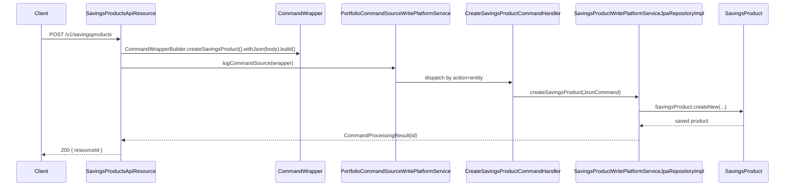
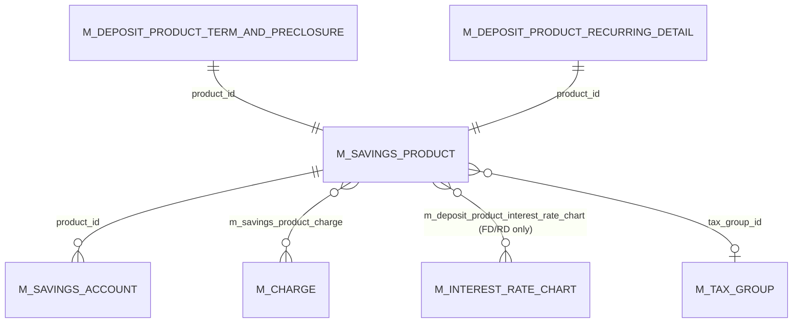

A **`SavingsProduct`** is the configuration template from which Apache Fineract savings accounts (and, via subclasses, fixed and recurring deposit accounts) are minted. Where `SavingsAccount` is the per-customer aggregate, `SavingsProduct` is the bank-side blueprint: what interest rate, how it compounds, whether overdraft is allowed, what charges attach, when dormancy kicks in.

This page maps the `SavingsProduct` class (in `fineract-savings`) and its REST surface `SavingsProductsApiResource` (in `fineract-provider`).

## JPA mapping

```java
// fineract-savings/.../portfolio/savings/domain/SavingsProduct.java
@Entity
@Table(name = "m_savings_product",
       uniqueConstraints = { @UniqueConstraint(columnNames = { "name" }, name = "sp_unq_name"),
                             @UniqueConstraint(columnNames = { "short_name" }, name = "sp_unq_short_name") })
@Inheritance
@DiscriminatorColumn(name = "deposit_type_enum", discriminatorType = DiscriminatorType.INTEGER)
@DiscriminatorValue("100")
public class SavingsProduct extends AbstractPersistableCustom<Long> {
    @Column(name = "name",       nullable = false, unique = true) protected String name;
    @Column(name = "short_name", nullable = false, unique = true) protected String shortName;
    @Column(name = "description", length = 500, nullable = false) protected String description;
    @Embedded                                                     protected MonetaryCurrency currency;
    // …
}
```

Just like `SavingsAccount`, the product hierarchy uses single-table inheritance:

```
m_savings_product.deposit_type_enum:
  100 → SavingsProduct        (passbook)
  200 → FixedDepositProduct
  300 → RecurringDepositProduct (extends FixedDepositProduct)
```

The `@Inheritance` annotation defaults to `SINGLE_TABLE`, so FD/RD product extensions just add columns and one-to-one rows in `m_deposit_product_term_and_preclosure` / `m_deposit_product_recurring_detail`.

## The interest knobs

Four columns encode the entire interest contract. Each maps to a value from a `fineract-core` enum:

```java
@Column(name = "nominal_annual_interest_rate", scale = 6, precision = 19, nullable = false)
protected BigDecimal nominalAnnualInterestRate;

@Column(name = "interest_compounding_period_enum", nullable = false)
protected Integer interestCompoundingPeriodType;   // SavingsCompoundingInterestPeriodType

@Column(name = "interest_posting_period_enum", nullable = false)
protected Integer interestPostingPeriodType;       // SavingsPostingInterestPeriodType

@Column(name = "interest_calculation_type_enum", nullable = false)
protected Integer interestCalculationType;         // SavingsInterestCalculationType

@Column(name = "interest_calculation_days_in_year_type_enum", nullable = false)
protected Integer interestCalculationDaysInYearType; // SavingsInterestCalculationDaysInYearType
```

The accessor methods convert back to the typed enum:

```java
public SavingsCompoundingInterestPeriodType interestCompoundingPeriodType() {
    return SavingsCompoundingInterestPeriodType.fromInt(this.interestCompoundingPeriodType);
}
public SavingsInterestCalculationType interestCalculationType() {
    return SavingsInterestCalculationType.fromInt(this.interestCalculationType);
}
public SavingsInterestCalculationDaysInYearType interestCalculationDaysInYearType() {
    return SavingsInterestCalculationDaysInYearType.fromInt(this.interestCalculationDaysInYearType);
}
```

The actual enum values come from `fineract-core/src/main/java/org/apache/fineract/portfolio/savings/`:

### `SavingsCompoundingInterestPeriodType`

```java
public enum SavingsCompoundingInterestPeriodType {
    INVALID(0, ...), DAILY(1, ...), MONTHLY(4, ...),
    QUATERLY(5, ...), BI_ANNUAL(6, ...), ANNUAL(7, ...);
}
```

Note the sparse numbering — values 2 (`WEEKLY`) and 3 (`BIWEEKLY`) are commented out in the source. The original spelling `QUATERLY` (sic) is preserved across the whole codebase including DB columns; don't "fix" it.

### `SavingsPostingInterestPeriodType`

```java
public enum SavingsPostingInterestPeriodType {
    INVALID(0, ...), DAILY(1, ...), MONTHLY(4, ...),
    QUATERLY(5, ...), BIANNUAL(6, ...), ANNUAL(7, ...);
}
```

The compounding period must be **finer than or equal to** the posting period — Fineract validates this in `validateInterestPostingAndCompoundingPeriodTypes(...)`.

### `SavingsInterestCalculationType`

```java
public enum SavingsInterestCalculationType {
    INVALID(0, ...), DAILY_BALANCE(1, ...), AVERAGE_DAILY_BALANCE(2, ...);
}
```

The two are very different in practice — see [Interest posting & compounding](/savings/interest-posting-and-compounding).

### `SavingsInterestCalculationDaysInYearType`

```java
public enum SavingsInterestCalculationDaysInYearType {
    INVALID(0, ...), DAYS_360(360, ...), DAYS_365(365, ...);
}
```

The integer literal *is* the days-in-year — the calculation just divides by 360 or 365 directly.

## Opening-balance, lock-in, withdrawal fee

```java
@Column(name = "min_required_opening_balance") protected BigDecimal minRequiredOpeningBalance;
@Column(name = "lockin_period_frequency")      protected Integer lockinPeriodFrequency;
@Column(name = "lockin_period_frequency_enum") protected Integer lockinPeriodFrequencyType;
@Column(name = "withdrawal_fee_for_transfer")  protected boolean withdrawalFeeApplicableForTransfer;
```

`lockinPeriodFrequencyType` references `SavingsPeriodFrequencyType` (days/weeks/months/years). When an account is activated, `SavingsAccount.activate(...)` computes `lockedInUntilDate` from `(activatedOnDate + lockinPeriodFrequency × frequencyType)`. Withdrawals before that date throw `error.msg.savingsaccount.transaction.withdrawals.blocked.during.lockin.period`.

The `withdrawalFeeApplicableForTransfer` toggle decides whether the configured withdrawal fee fires on inter-account transfers (true) or only on cash-style withdrawals (false).

## Overdraft

```java
@Column(name = "allow_overdraft")                       private boolean allowOverdraft;
@Column(name = "overdraft_limit")                       private BigDecimal overdraftLimit;
@Column(name = "nominal_annual_interest_rate_overdraft") private BigDecimal nominalAnnualInterestRateOverdraft;
@Column(name = "min_overdraft_for_interest_calculation") private BigDecimal minOverdraftForInterestCalculation;
```

If `allowOverdraft` is true the product passes those fields down to every new `SavingsAccount`, and a defensive coercion runs:

```java
// SavingsProduct.java
private void esnureOverdraftLimitsSetForOverdraftAccounts() {
    if (this.allowOverdraft) {
        this.overdraftLimit = this.overdraftLimit == null ? BigDecimal.ZERO : this.overdraftLimit;
        this.nominalAnnualInterestRateOverdraft = this.nominalAnnualInterestRateOverdraft == null
                ? BigDecimal.ZERO : this.nominalAnnualInterestRateOverdraft;
        this.minOverdraftForInterestCalculation = this.minOverdraftForInterestCalculation == null
                ? BigDecimal.ZERO : this.minOverdraftForInterestCalculation;
    }
}
```

So even a "broken" product with `allowOverdraft = true` but all the limits left null becomes safe (limit = 0, no interest).

## Minimum balance and lien

```java
@Column(name = "enforce_min_required_balance")          private boolean enforceMinRequiredBalance;
@Column(name = "min_required_balance")                  private BigDecimal minRequiredBalance;
@Column(name = "is_lien_allowed", nullable = false)     private boolean lienAllowed;
@Column(name = "max_allowed_lien_limit")                private BigDecimal maxAllowedLienLimit;
@Column(name = "min_balance_for_interest_calculation")  private BigDecimal minBalanceForInterestCalculation;
```

- `enforceMinRequiredBalance` + `minRequiredBalance`: withdrawal validation; if a withdrawal would bring the balance below the floor, it fails (unless lien-backed and allowed).
- `lienAllowed` + `maxAllowedLienLimit`: lets external products (typically loan collateral) reserve up to this much of the savings balance.
- `minBalanceForInterestCalculation`: in interest computation, days where the balance is below this value earn 0 interest (configurable per product).

## Tax withholding

```java
@Column(name = "withhold_tax", nullable = false) private boolean withHoldTax;
@ManyToOne @JoinColumn(name = "tax_group_id")    private TaxGroup taxGroup;
```

When `withHoldTax = true` the system writes a paired `WITHHOLD_TAX` (`18`, debit) transaction for every interest posting, computed from the `TaxGroup` chain (see `fineract-core/.../portfolio/tax/`).

## Dormancy knobs

These four columns drive the [dormancy job](/savings/dormancy-and-jobs):

```java
@Column(name = "is_dormancy_tracking_active") private Boolean isDormancyTrackingActive;
@Column(name = "days_to_inactive")            private Long daysToInactive;
@Column(name = "days_to_dormancy")            private Long daysToDormancy;
@Column(name = "days_to_escheat")             private Long daysToEscheat;
```

When `isDormancyTrackingActive` is true on the product, `UPDATE_SAVINGS_DORMANT_ACCOUNTS` walks the matching accounts and flips their `sub_status_enum` once those day thresholds are crossed since the last customer-initiated transaction.

## Charges

```java
@ManyToMany
@JoinTable(name = "m_savings_product_charge",
           joinColumns        = @JoinColumn(name = "savings_product_id"),
           inverseJoinColumns = @JoinColumn(name = "charge_id"))
protected Set<Charge> charges;
```

The product carries a *set* of `Charge` definitions. When `SavingsAccountAssembler` opens a new account it instantiates `SavingsAccountCharge` rows from these definitions. Changing the product's `charges` set later does **not** retroactively change the account's charge set — only newly-opened accounts pick up the new defaults. See [Charges on savings](/savings/charges-on-savings).

## Accounting rule

```java
@Column(name = "accounting_type", nullable = false) protected Integer accountingRule;
```

Maps to `AccountingRuleType` (`NONE` / `CASH_BASED` / `ACCRUAL_PERIODIC` / `ACCRUAL_UPFRONT`). For savings, only `NONE` and `CASH_BASED` are meaningful; accrual variants are loan-specific.

## Factory & constructors

The only legal way to build a `SavingsProduct` is via the static factory:

```java
public static SavingsProduct createNew(
    String name, String shortName, String description, MonetaryCurrency currency,
    BigDecimal interestRate,
    SavingsCompoundingInterestPeriodType interestCompoundingPeriodType,
    SavingsPostingInterestPeriodType interestPostingPeriodType,
    SavingsInterestCalculationType interestCalculationType,
    SavingsInterestCalculationDaysInYearType interestCalculationDaysInYearType,
    BigDecimal minRequiredOpeningBalance,
    Integer lockinPeriodFrequency,
    SavingsPeriodFrequencyType lockinPeriodFrequencyType,
    boolean withdrawalFeeApplicableForTransfer,
    AccountingRuleType accountingRuleType, Set<Charge> charges,
    boolean allowOverdraft, BigDecimal overdraftLimit,
    boolean enforceMinRequiredBalance, BigDecimal minRequiredBalance,
    boolean lienAllowed, BigDecimal maxAllowedLienLimit,
    BigDecimal minBalanceForInterestCalculation,
    BigDecimal nominalAnnualInterestRateOverdraft, BigDecimal minOverdraftForInterestCalculation,
    boolean withHoldTax, TaxGroup taxGroup,
    Boolean isDormancyTrackingActive, Long daysToInactive, Long daysToDormancy, Long daysToEscheat) { ... }
```

The constructor cascade ultimately delegates to a 32-arg protected constructor; the protected no-arg constructor is for JPA only.

## `update(JsonCommand)` — the mutation pattern

`SavingsProduct.update(JsonCommand command)` walks every input parameter, checks "is the new value different from the current value", and if so writes the change into both the entity and a `Map<String, Object> actualChanges`. The map is returned upward and ultimately serialised into the command audit log. Excerpt:

```java
// SavingsProduct.java :: update(...)
if (command.isChangeInBigDecimalParameterNamed(nominalAnnualInterestRateParamName, this.nominalAnnualInterestRate)) {
    final BigDecimal newValue = command.bigDecimalValueOfParameterNamed(nominalAnnualInterestRateParamName);
    actualChanges.put(nominalAnnualInterestRateParamName, newValue);
    actualChanges.put(localeParamName, localeAsInput);
    this.nominalAnnualInterestRate = newValue;
}
if (command.isChangeInIntegerParameterNamed(interestCompoundingPeriodTypeParamName, this.interestCompoundingPeriodType)) {
    final Integer newValue = command.integerValueOfParameterNamed(interestCompoundingPeriodTypeParamName);
    actualChanges.put(interestCompoundingPeriodTypeParamName, newValue);
    this.interestCompoundingPeriodType = SavingsCompoundingInterestPeriodType.fromInt(newValue).getValue();
}
// … 30+ similar blocks for every column
```

This idempotent "diff-and-set" pattern is the standard mutation style across all Fineract product entities.

## REST surface: `SavingsProductsApiResource`

```java
// fineract-provider/.../portfolio/savings/api/SavingsProductsApiResource.java
@Path("/v1/savingsproducts")
@RequiredArgsConstructor
@Tag(name = "Savings Product", description = "...")
public class SavingsProductsApiResource {
    private final PlatformSecurityContext context;
    private final SavingsProductReadPlatformService savingProductReadPlatformService;
    private final DefaultToApiJsonSerializer<SavingsProductData> toApiJsonSerializer;
    private final ApiRequestParameterHelper apiRequestParameterHelper;
    private final PortfolioCommandSourceWritePlatformService commandsSourceWritePlatformService;
    private final SavingsDropdownReadPlatformService dropdownReadPlatformService;
    private final ChargeReadPlatformService chargeReadPlatformService;
    private final CurrencyReadPlatformService currencyReadPlatformService;
    private final PaymentTypeReadService paymentTypeReadPlatformService;
    private final AccountingDropdownReadPlatformService accountingDropdownReadPlatformService;
    private final ProductToGLAccountMappingReadPlatformService accountMappingReadPlatformService;
    private final TaxReadPlatformService taxReadPlatformService;
    private final ConfigurationDomainService configurationDomainService;
    // …
}
```

The verbs are the canonical Fineract product CRUD:

| HTTP | Path | Purpose |
| --- | --- | --- |
| GET | `/v1/savingsproducts` | List all savings products. |
| GET | `/v1/savingsproducts/template` | Dropdown options + default values for a new-product form. |
| GET | `/v1/savingsproducts/{productId}` | Fetch one product. |
| POST | `/v1/savingsproducts` | Create. Fires `CREATE_SAVINGSPRODUCT` command. |
| PUT | `/v1/savingsproducts/{productId}` | Update — diffs via `SavingsProduct.update(JsonCommand)`. Fires `UPDATE_SAVINGSPRODUCT`. |
| DELETE | `/v1/savingsproducts/{productId}` | Delete. Fires `DELETE_SAVINGSPRODUCT`. |

Write paths flow through the command bus:



The read side goes through `SavingsProductReadPlatformService` (interface in `fineract-savings/.../service/`, impl in `fineract-provider/.../service/SavingsProductReadPlatformServiceImpl.java`) and emits `SavingsProductData` DTOs.

## Field map



## Validation

Two validators sit between JSON in and entity out:

- `SavingsProductDataValidator` — input shape, required fields, ranges.
- `SavingsProductAccountingDataValidator` — accounting-mapping coherence (e.g. when `accountingRule != NONE`, the right GL accounts must be supplied).

Both live in `fineract-savings/src/main/java/org/apache/fineract/portfolio/savings/data/`.

A semantic validator runs on the entity tree — defined on `FixedDepositProduct` and re-used by `SavingsAccount` (the savings-account variant lives at `SavingsAccount.validateInterestPostingAndCompoundingPeriodTypes`):

```java
// FixedDepositProduct.java :: validateInterestPostingAndCompoundingPeriodTypes(...)
// Rejects e.g. monthly compounding + daily posting.
```

`SavingsProduct.update(JsonCommand)` calls into the same validation path indirectly through the data validators; the rule itself is enforced by the entity-level method above. This guarantees the invariants that the [interest engine](/savings/interest-posting-and-compounding) relies on.

## Source paths

- `fineract-savings/src/main/java/org/apache/fineract/portfolio/savings/domain/SavingsProduct.java`
- `fineract-savings/src/main/java/org/apache/fineract/portfolio/savings/domain/SavingsProductRepository.java`
- `fineract-savings/src/main/java/org/apache/fineract/portfolio/savings/domain/SavingsProductAssembler.java`
- `fineract-savings/src/main/java/org/apache/fineract/portfolio/savings/domain/SavingsProductChargeAssembler.java`
- `fineract-savings/src/main/java/org/apache/fineract/portfolio/savings/data/SavingsProductDataValidator.java`
- `fineract-savings/src/main/java/org/apache/fineract/portfolio/savings/data/SavingsProductAccountingDataValidator.java`
- `fineract-savings/src/main/java/org/apache/fineract/portfolio/savings/service/SavingsProductReadPlatformService.java`
- `fineract-savings/src/main/java/org/apache/fineract/portfolio/savings/service/SavingsProductWritePlatformService.java`
- `fineract-provider/src/main/java/org/apache/fineract/portfolio/savings/api/SavingsProductsApiResource.java` — `/v1/savingsproducts`
- `fineract-provider/src/main/java/org/apache/fineract/portfolio/savings/service/SavingsProductReadPlatformServiceImpl.java`
- `fineract-provider/src/main/java/org/apache/fineract/portfolio/savings/service/SavingsProductWritePlatformServiceJpaRepositoryImpl.java`
- `fineract-core/src/main/java/org/apache/fineract/portfolio/savings/SavingsCompoundingInterestPeriodType.java`
- `fineract-core/src/main/java/org/apache/fineract/portfolio/savings/SavingsPostingInterestPeriodType.java`
- `fineract-core/src/main/java/org/apache/fineract/portfolio/savings/SavingsInterestCalculationType.java`
- `fineract-core/src/main/java/org/apache/fineract/portfolio/savings/SavingsInterestCalculationDaysInYearType.java`
- `fineract-core/src/main/java/org/apache/fineract/portfolio/savings/SavingsPeriodFrequencyType.java`
