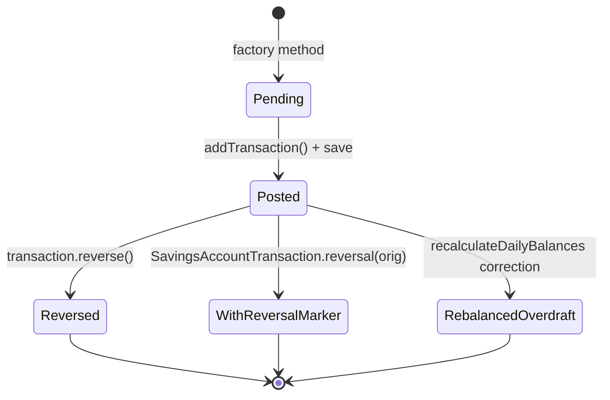
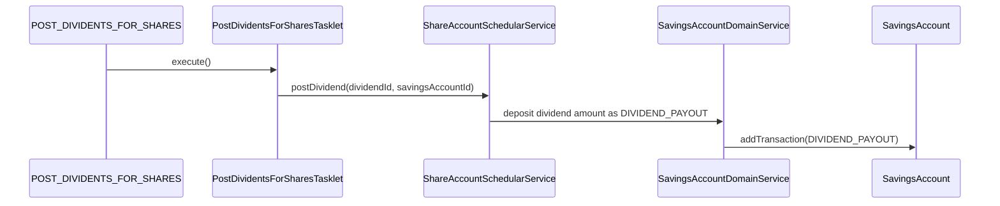
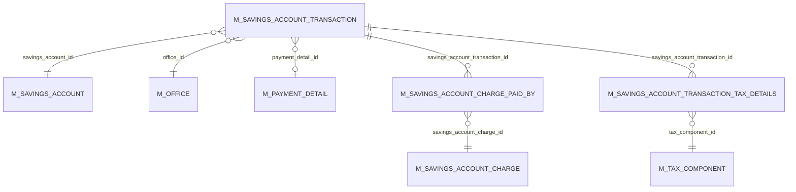

Every movement of money — every deposit, every withdrawal, every interest posting, every fee, every hold — is a row in `m_savings_account_transaction` in Apache Fineract. The `SavingsAccountTransaction` JPA entity is the ledger record. This page walks the entity, the 20-value transaction type enum, the comparator that orders the list, and the `recalculateDailyBalances` routine that rewrites running balances when the ledger is mutated.

## JPA mapping

```java
// fineract-savings/.../portfolio/savings/domain/SavingsAccountTransaction.java
@Entity
@Table(name = "m_savings_account_transaction")
public final class SavingsAccountTransaction extends AbstractAuditableWithUTCDateTimeCustom<Long> {

    @ManyToOne(optional = false) @JoinColumn(name = "savings_account_id", nullable = false)
    private SavingsAccount savingsAccount;

    @ManyToOne @JoinColumn(name = "office_id", nullable = false)
    private Office office;

    @ManyToOne(cascade = CascadeType.ALL, optional = true) @JoinColumn(name = "payment_detail_id")
    private PaymentDetail paymentDetail;

    @Column(name = "transaction_type_enum", nullable = false) private Integer typeOf;
    @Column(name = "transaction_date",       nullable = false) private LocalDate dateOf;
    @Column(name = "amount", scale = 6, precision = 19, nullable = false) private BigDecimal amount;

    @Column(name = "is_reversed", nullable = false) private boolean reversed;
    @Column(name = "external_id", length = 100, unique = true) private ExternalId externalId = ExternalId.empty();

    @Column(name = "running_balance_derived")  private BigDecimal runningBalance;
    @Column(name = "cumulative_balance_derived") private BigDecimal cumulativeBalance;
    @Column(name = "balance_end_date_derived")     private LocalDate balanceEndDate;
    @Column(name = "balance_number_of_days_derived") private Integer balanceNumberOfDays;
    @Column(name = "overdraft_amount_derived")     private BigDecimal overdraftAmount;

    @OneToMany(cascade = CascadeType.ALL, mappedBy = "savingsAccountTransaction",
               orphanRemoval = true, fetch = FetchType.EAGER)
    private Set<SavingsAccountChargePaidBy> savingsAccountChargesPaid = new HashSet<>();

    @OneToMany(cascade = CascadeType.ALL, orphanRemoval = true, fetch = FetchType.EAGER,
               mappedBy = "savingsAccountTransaction")
    private List<SavingsAccountTransactionTaxDetails> taxDetails = new ArrayList<>();

    @Column(name = "submitted_on_date", nullable = false) private LocalDate submittedOnDate;
    @Column(name = "is_manual", length = 1)               private boolean isManualTransaction;
    @Column(name = "is_loan_disbursement", length = 1)    private boolean isLoanDisbursement;

    @Column(name = "release_id_of_hold_amount", length = 20) private Long releaseIdOfHoldAmountTransaction;
    @Column(name = "reason_for_block")                       private String reasonForBlock;

    @Column(name = "is_reversal", nullable = false)          private boolean reversalTransaction;
    @Column(name = "original_transaction_id")                private Long originalTxnId;
    @Column(name = "is_lien_transaction")                    private Boolean lienTransaction;
    @Column(name = "ref_no")                                 private String refNo;
    // …
}
```

A handful of design notes:

- The class is `final` — there are no subclasses. The transaction type is encoded in the `typeOf` integer column, not via JPA inheritance.
- `runningBalance`, `cumulativeBalance`, `balanceEndDate`, `balanceNumberOfDays`, `overdraftAmount` are *derived* columns. They are computed by `SavingsAccount.recalculateDailyBalances(...)` and re-written every time the ledger changes. Don't try to set them directly.
- `is_reversed` (boolean on the original row) and `is_reversal` (boolean on the *new* row inserted to mark the reversal) are independent. A reversal scenario produces one row flipped to `is_reversed = true` plus a sibling row with `is_reversal = true` linked via `original_transaction_id`.
- `taxDetails` carries withholding-tax breakdowns generated when `SavingsAccount.withHoldTax = true` and there is interest to post.

## `SavingsAccountTransactionType` — the 20-value taxonomy

The full taxonomy lives in `fineract-core`:

```java
// fineract-core/.../portfolio/savings/SavingsAccountTransactionType.java
public enum SavingsAccountTransactionType {
    INVALID(0,  "..."),
    DEPOSIT(1,  "...", TransactionEntryType.CREDIT),
    WITHDRAWAL(2, "...", TransactionEntryType.DEBIT),
    INTEREST_POSTING(3, "...", TransactionEntryType.CREDIT),
    WITHDRAWAL_FEE(4,   "...", TransactionEntryType.DEBIT),
    ANNUAL_FEE(5,       "...", TransactionEntryType.DEBIT),
    WAIVE_CHARGES(6,    "..."),                                  // not credit, not debit
    PAY_CHARGE(7,       "...", TransactionEntryType.DEBIT),
    DIVIDEND_PAYOUT(8,  "...", TransactionEntryType.CREDIT),
    ACCRUAL(10,         "..."),                                  // not credit, not debit
    INITIATE_TRANSFER(12, "..."),
    APPROVE_TRANSFER(13,  "..."),
    WITHDRAW_TRANSFER(14, "..."),
    REJECT_TRANSFER(15,   "..."),
    WRITTEN_OFF(16,       "..."),
    OVERDRAFT_INTEREST(17,"...", TransactionEntryType.DEBIT),    // interest owed to bank
    WITHHOLD_TAX(18,      "...", TransactionEntryType.DEBIT),
    ESCHEAT(19,           "...", TransactionEntryType.DEBIT),    // forfeiture
    AMOUNT_HOLD(20,       "...", TransactionEntryType.DEBIT),    // marker only
    AMOUNT_RELEASE(21,    "...", TransactionEntryType.CREDIT);   // marker only
}
```

Numbers 9 and 11 are deliberately skipped. The enum carries a `TransactionEntryType` (`CREDIT` / `DEBIT` / unset). Three predicates on the enum bridge the gap between "entry direction" and "does this actually move the running balance":

```java
public boolean isCredit() {
    // AMOUNT_RELEASE is not credit, because the account balance is not changed
    return isCreditEntryType() && !isAmountRelease();
}
public boolean isDebit() {
    // AMOUNT_HOLD, ESCHEAT are not debit, because the account balance is not changed
    return isDebitEntryType() && !isAmountOnHold() && !isEscheat();
}
public boolean isChargeTransaction() {
    return isPayCharge() || isWithdrawalFee() || isAnnualFee();
}
```

So `AMOUNT_HOLD`/`AMOUNT_RELEASE` carry a debit/credit `entryType` but `isDebit()` / `isCredit()` deliberately return false — the runtime treats them as reservation markers, not real debits. Similarly `ESCHEAT` is logically a debit (the customer loses their balance) but it does not flow through `recalculateDailyBalances` like a normal withdrawal — see [Dormancy & jobs](/savings/dormancy-and-jobs).

### Quick group reference

| Group | Types | Source method | Notes |
| --- | --- | --- | --- |
| Customer money in / out | `DEPOSIT`, `WITHDRAWAL` | `SavingsAccount.deposit`, `.withdraw` | Standard cash-style movements. |
| Interest | `INTEREST_POSTING`, `OVERDRAFT_INTEREST` | `SavingsAccount.postInterest` | Credit and debit halves of the interest engine. |
| Tax | `WITHHOLD_TAX` | `SavingsAccount.createWithHoldTransaction` | Paired with each `INTEREST_POSTING` when `withHoldTax = true`. |
| Charges | `WITHDRAWAL_FEE`, `ANNUAL_FEE`, `PAY_CHARGE`, `WAIVE_CHARGES` | `SavingsAccountCharge` interactions | See [Charges on savings](/savings/charges-on-savings). |
| Transfers | `INITIATE_TRANSFER`, `APPROVE_TRANSFER`, `WITHDRAW_TRANSFER`, `REJECT_TRANSFER` | `SavingsAccount.initiateTransfer` etc. | Cross-office or cross-account movement. |
| Holds | `AMOUNT_HOLD`, `AMOUNT_RELEASE` | `SavingsAccount.holdAmount`, `.releaseAmount` | Touches `onHoldFunds` but **not** running balance. |
| Terminal | `WRITTEN_OFF`, `ESCHEAT` | `SavingsAccount.writeOff`, `.escheat` | Write-off applies to FD/RD; escheat applies after long dormancy. |
| Dividends | `DIVIDEND_PAYOUT` | `ShareAccountSchedularService.postDividend` | The only credit that originates outside the savings package. |
| Accrual | `ACCRUAL` | `AddAccrualTransactionForSavingsTasklet` → `SavingsAccountTransaction.accrual` | Used only for accrual-based accounting; doesn't move balance. |

## Factory methods

`SavingsAccountTransaction` has no public constructor outside the package; instances are created through 18 static factories that fix the type code:

```java
// fineract-savings/.../portfolio/savings/domain/SavingsAccountTransaction.java
public static SavingsAccountTransaction deposit(SavingsAccount, Office, LocalDate, Money, ...);
public static SavingsAccountTransaction withdrawal(SavingsAccount, Office, LocalDate, Money, ...);
public static SavingsAccountTransaction accrual(SavingsAccount, Office, LocalDate, Money, ...);
public static SavingsAccountTransaction interestPosting(SavingsAccount, Office, LocalDate, Money, boolean isUserPosting);
public static SavingsAccountTransaction overdraftInterest(SavingsAccount, Office, LocalDate, Money, boolean isUserPosting);
public static SavingsAccountTransaction withdrawalFee(SavingsAccount, Office, LocalDate, Money, ...);
public static SavingsAccountTransaction annualFee(SavingsAccount, Office, LocalDate, Money, ...);
public static SavingsAccountTransaction charge(SavingsAccount, Office, LocalDate, Money, ...);
public static SavingsAccountTransaction waiver(SavingsAccount, Office, LocalDate, Money, ...);
public static SavingsAccountTransaction initiateTransfer(SavingsAccount, Office, LocalDate, ...);
public static SavingsAccountTransaction approveTransfer(SavingsAccount, Office, LocalDate, ...);
public static SavingsAccountTransaction withdrawTransfer(SavingsAccount, Office, LocalDate, ...);
public static SavingsAccountTransaction withHoldTax(SavingsAccount, Office, LocalDate, Money, ...);
public static SavingsAccountTransaction escheat(SavingsAccount, LocalDate, boolean postInterestAsOnDate);
public static SavingsAccountTransaction copyTransaction(SavingsAccountTransaction accountTransaction);
public static SavingsAccountTransaction holdAmount(SavingsAccount, Office, LocalDate, Money, ...);
public static SavingsAccountTransaction releaseAmount(SavingsAccountTransaction accountTransaction, LocalDate transactionDate);
public static SavingsAccountTransaction reversal(SavingsAccountTransaction accountTransaction);
```

Two are *not* simple constructors:

- `releaseAmount(...)` takes the original `AMOUNT_HOLD` transaction and produces a paired `AMOUNT_RELEASE`. The new row carries the original `id` in `releaseIdOfHoldAmountTransaction` to make the pair queryable.
- `reversal(...)` takes any transaction and produces a sibling row with `reversalTransaction = true`, `originalTxnId = original.id`, and the same amount with the same sign. Persisting the pair is the standard way to "soft-reverse" a posting in Fineract.

## Ordering: `SavingsAccountTransactionComparator`

The transaction list on `SavingsAccount` is mapped with `@OrderBy("dateOf, createdDate, id")`. Inside the domain that ordering is enforced explicitly via `SavingsAccountTransactionComparator`:

```java
// fineract-savings/.../portfolio/savings/domain/SavingsAccountTransactionComparator.java
public class SavingsAccountTransactionComparator implements Comparator<SavingsAccountTransaction> {
    @Override
    public int compare(final SavingsAccountTransaction o1, final SavingsAccountTransaction o2) {
        int result = DateUtils.compare(o1.getTransactionDate(), o2.getTransactionDate());
        if (result != 0) return result;
        result = DateUtils.compareWithNullsLast(o1.getCreatedDate(), o2.getCreatedDate());
        if (result != 0) return result;
        if (o1.getId() != null && o2.getId() != null) return o1.getId().compareTo(o2.getId());
        return 0;
    }
}
```

The three keys are:

1. **`transactionDate`** ascending — the business date of the movement.
2. **`createdDate`** ascending (nulls last) — the audit timestamp, used to break ties on same-day postings. A back-dated deposit that arrives late still sorts after the same-day deposit booked earlier.
3. **`id`** ascending — final tie-breaker for batch postings (e.g. two interest postings at the same instant).

Every interest computation, balance recompute, and ledger view walks the transactions in this order. Inserting a "between" transaction (e.g. a back-dated correction) and persisting it will re-sort on the next load via JPA's `@OrderBy`.

## Running balance computation: `recalculateDailyBalances`

Running balance is **not** maintained per-write. It is recomputed by sweeping the sorted list whenever the ledger changes. The core loop:

```java
// SavingsAccount.java :: recalculateDailyBalances(...)  — abbreviated
protected void recalculateDailyBalances(final Money openingAccountBalance, final LocalDate upTo,
        final boolean backdatedTxnsAllowedTill, boolean postReversals) {
    Money runningBalance = openingAccountBalance;
    boolean calculateInterest = hasInterestCalculation() || hasOverdraftInterestCalculation();
    List<SavingsAccountTransaction> sorted = backdatedTxnsAllowedTill
            ? retrieveSortedTransactions() : retrieveListOfTransactions();

    for (final SavingsAccountTransaction transaction : sorted) {
        if (transaction.isReversed() || transaction.isReversalTransaction()) {
            transaction.zeroBalanceFields();
            continue;
        }
        Money overdraftAmount = Money.zero(this.currency);
        Money transactionAmount = Money.zero(this.currency);

        if (transaction.isCredit() || transaction.isAmountRelease()) {
            if (runningBalance.isLessThanZero()) {
                Money diff = transaction.getAmount(this.currency).plus(runningBalance);
                overdraftAmount = diff.isGreaterThanZero()
                        ? transaction.getAmount(this.currency).minus(diff)
                        : transaction.getAmount(this.currency);
            }
            transactionAmount = transactionAmount.plus(transaction.getAmount(this.currency));
        } else if (transaction.isDebit() || transaction.isAmountOnHold()) {
            if (runningBalance.isLessThanZero()) {
                overdraftAmount = transaction.getAmount(this.currency);
            }
            transactionAmount = transactionAmount.minus(transaction.getAmount(this.currency));
        }

        runningBalance = runningBalance.plus(transactionAmount);
        transaction.setRunningBalance(runningBalance);

        if (MathUtil.isEmpty(overdraftAmount) && runningBalance.isLessThanZero()
                && !transaction.isAmountOnHold()) {
            overdraftAmount = runningBalance.negated();
        }
        // …assign overdraftAmount onto the transaction, with copy-and-reverse correction
        // when the persisted overdraftAmount disagrees with the recomputed value.
    }
}
```

A few subtleties to remember:

- **Reversed and reversal transactions don't move the balance.** Both `is_reversed = true` rows and `is_reversal = true` rows have their derived columns zeroed by `zeroBalanceFields()`.
- **`AMOUNT_HOLD` is treated as a debit *for overdraft attribution*** (`isAmountOnHold()` returns true in the debit branch) but `transaction.isDebit()` returns false so it does not reduce the running balance. It does push the implicit overdraft if the account is already negative.
- **`AMOUNT_RELEASE` is treated as a credit *only for overdraft attribution*** (`isAmountRelease()` returns true in the credit branch) but `isCredit()` returns false so it does not increase the running balance.
- **Overdraft attribution is per-transaction.** Each transaction stores how much of its amount went into overdraft territory; that drives subsequent overdraft interest accrual.
- **Drift detection.** When the recomputed `overdraftAmount` for a `transaction.id != null` differs from the persisted one and the transaction is not an `ACCRUAL`, the engine reverses the row and writes a new one (and a paired reversal marker if `postReversals = true`). This keeps history honest without overwriting a posted ledger row.

After the loop the engine calls `addTransactionToExisting(...)` / `addTransaction(...)` to insert any new postings and finishes with `summary.update(...)` to refresh the cached `account_balance_derived`.

## Lifecycle of a single transaction



`reverse()` flips `is_reversed = true` on the *existing* row. `SavingsAccountTransaction.reversal(orig)` creates a *new* row marked `is_reversal = true` pointing at the original — the standard double-row pattern Fineract uses when callers want both the historical posting and an explicit, queryable reversal record.

## Hold and release

`AMOUNT_HOLD` / `AMOUNT_RELEASE` are reservation markers — they signal that a given amount of the balance is unavailable but the actual cash hasn't moved.

```java
// SavingsAccount.java :: holdAmount(...) — abbreviated
public SavingsAccountTransaction holdAmount(BigDecimal amount, LocalDate date, ...) {
    final SavingsAccountTransaction tx = SavingsAccountTransaction.holdAmount(this, office(), date, ...);
    addTransaction(tx);
    this.onHoldFunds = MathUtil.add(this.onHoldFunds, amount);
    return tx;
}
```

The companion `releaseAmount` decrements `onHoldFunds` and stamps `releaseIdOfHoldAmountTransaction` on the new row pointing to the original hold. Because `isCredit()` / `isDebit()` return false for both markers, neither row changes the running balance — yet both contribute to the overdraft attribution logic above.

A second, sibling table `m_deposit_account_on_hold_transaction` captures *funds* holds that don't go through the ledger (e.g. loan-collateral holds). Its entity is `DepositAccountOnHoldTransaction` in `fineract-savings/.../portfolio/savings/domain/`. The two layers — ledger holds and on-hold-funds — are summed for available-balance computation.

## Dividend payout

`DIVIDEND_PAYOUT` is unique: it is the only credit type that originates from outside `fineract-savings`. The flow:



See [Share products & accounts](/savings/share-products-and-accounts) for the producing side.

## REST surface

`SavingsAccountTransactionsApiResource` lives in `fineract-provider/.../portfolio/savings/api/` and shares the `/v1/savingsaccounts` mount point with the account resource — the path-grammar is:

| HTTP | Path | Action |
| --- | --- | --- |
| GET | `/v1/savingsaccounts/{accountId}/transactions/{transactionId}` | Retrieve one transaction. |
| GET | `/v1/savingsaccounts/{accountId}/transactions/template` | Build a deposit/withdrawal form template. |
| POST | `/v1/savingsaccounts/{accountId}/transactions?command=deposit` | Post a deposit. |
| POST | `/v1/savingsaccounts/{accountId}/transactions?command=withdrawal` | Post a withdrawal. |
| POST | `/v1/savingsaccounts/{accountId}/transactions?command=holdAmount` | Mark `AMOUNT_HOLD`. |
| POST | `/v1/savingsaccounts/{accountId}/transactions?command=releaseAmount` | Pair with a hold. |
| POST | `/v1/savingsaccounts/{accountId}/transactions?command=postInterestAsOn` | Force an interest posting. |
| POST | `/v1/savingsaccounts/{accountId}/transactions/{transactionId}?command=undo` | Reverse. |
| POST | `/v1/savingsaccounts/{accountId}/transactions/{transactionId}?command=modify` | Edit (limited fields). |

All write paths are dispatched through `PortfolioCommandSourceWritePlatformService` → command handlers in `fineract-provider/.../portfolio/savings/handler/`.

## ER picture



## Source paths

- `fineract-savings/src/main/java/org/apache/fineract/portfolio/savings/domain/SavingsAccountTransaction.java`
- `fineract-savings/src/main/java/org/apache/fineract/portfolio/savings/domain/SavingsAccountTransactionComparator.java`
- `fineract-savings/src/main/java/org/apache/fineract/portfolio/savings/domain/SavingsAccountTransactionDataComparator.java`
- `fineract-savings/src/main/java/org/apache/fineract/portfolio/savings/domain/SavingsAccountTransactionRepository.java`
- `fineract-savings/src/main/java/org/apache/fineract/portfolio/savings/domain/SavingsAccountTransactionTaxDetails.java`
- `fineract-savings/src/main/java/org/apache/fineract/portfolio/savings/domain/SavingsAccountTransactionSummaryWrapper.java`
- `fineract-savings/src/main/java/org/apache/fineract/portfolio/savings/domain/SavingsAccountChargePaidBy.java`
- `fineract-savings/src/main/java/org/apache/fineract/portfolio/savings/domain/DepositAccountOnHoldTransaction.java`
- `fineract-savings/src/main/java/org/apache/fineract/portfolio/savings/data/SavingsAccountTransactionDTO.java`
- `fineract-core/src/main/java/org/apache/fineract/portfolio/savings/SavingsAccountTransactionType.java`
- `fineract-core/src/main/java/org/apache/fineract/portfolio/TransactionEntryType.java`
- `fineract-provider/src/main/java/org/apache/fineract/portfolio/savings/api/SavingsAccountTransactionsApiResource.java`
- `fineract-provider/src/main/java/org/apache/fineract/portfolio/savings/api/DepositAccountOnHoldFundTransactionsApiResource.java`
