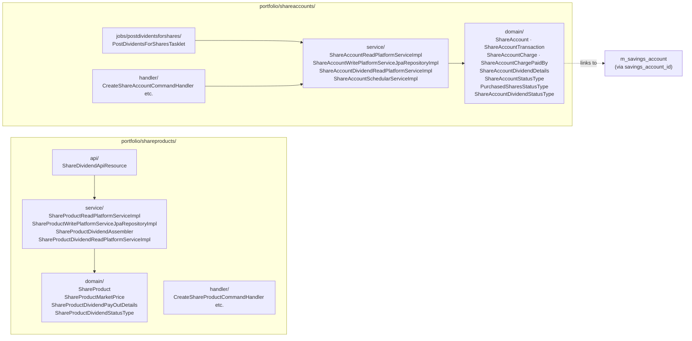
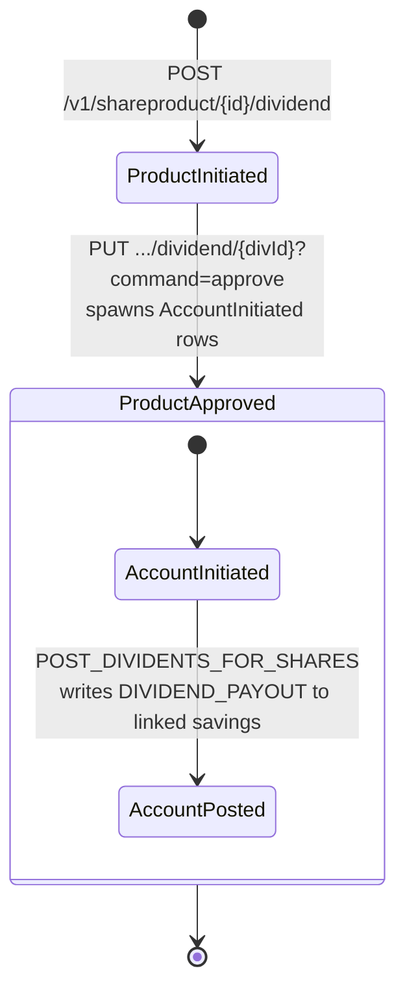
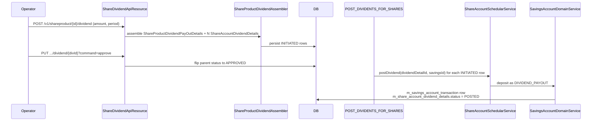
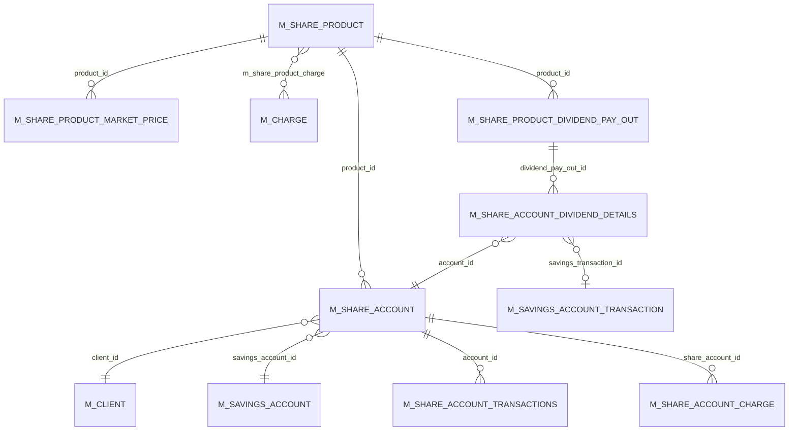

Some financial cooperatives and credit unions issue **shares** to their members rather than (or in addition to) savings accounts. Apache Fineract models this with a dedicated subsystem under `fineract-provider/.../portfolio/shareproducts/` and `fineract-provider/.../portfolio/shareaccounts/`: a share product issues a fixed pool of shares; each member's share account holds the shares they own; periodic dividends are calculated on the product and posted as `DIVIDEND_PAYOUT` transactions on each member's linked savings account.

This page maps the entities, the dividend pipeline, the REST surface, and the `POST_DIVIDENTS_FOR_SHARES` job.

## Module layout



## `ShareProduct`

```java
// fineract-provider/.../portfolio/shareproducts/domain/ShareProduct.java
@Entity
@Table(name = "m_share_product")
public class ShareProduct extends AbstractAuditableCustom {

    @Column(name = "name",       nullable = false, unique = true) private String name;
    @Column(name = "short_name", nullable = false, unique = true) private String shortName;
    @Column(name = "description")                                 private String description;
    @Column(name = "start_date")                                  private LocalDate startDate;
    @Column(name = "end_date")                                    private LocalDate endDate;
    @Column(name = "external_id", unique = true)                  private String externalId;
    @Embedded private MonetaryCurrency currency;

    @Column(name = "total_shares",            nullable = false)   private Long totalShares;
    @Column(name = "issued_shares",           nullable = false)   private Long totalSharesIssued;
    @Column(name = "totalsubscribed_shares")                      private Long totalSubscribedShares;
    @Column(name = "unit_price",              nullable = false)   private BigDecimal unitPrice;
    @Column(name = "capital_amount",          nullable = false)   private BigDecimal shareCapital;

    @Column(name = "minimum_client_shares")                       private Long minimumShares;
    @Column(name = "nominal_client_shares",   nullable = false)   private Long nominalShares;
    @Column(name = "maximum_client_shares")                       private Long maximumShares;

    @OrderBy(value = "fromDate,id")
    @OneToMany(cascade = CascadeType.ALL, mappedBy = "product", orphanRemoval = true, fetch = FetchType.EAGER)
    Set<ShareProductMarketPrice> marketPrice;

    @ManyToMany(fetch = FetchType.EAGER)
    @JoinTable(name = "m_share_product_charge",
               joinColumns        = @JoinColumn(name = "product_id"),
               inverseJoinColumns = @JoinColumn(name = "charge_id"))
    private Set<Charge> charges;

    @Column(name = "allow_dividends_inactive_clients") private Boolean allowDividendCalculationForInactiveClients;

    @Column(name = "lockin_period_frequency")          private Integer lockinPeriod;
    @Enumerated(EnumType.ORDINAL)
    @Column(name = "lockin_period_frequency_enum")     private PeriodFrequencyType lockPeriodType;
    @Column(name = "minimum_active_period_frequency")  private Integer minimumActivePeriod;
    @Enumerated(EnumType.ORDINAL)
    @Column(name = "minimum_active_period_frequency_enum") private PeriodFrequencyType minimumActivePeriodType;

    @Column(name = "accounting_type", nullable = false) protected Integer accountingRule;
}
```

Three layers of share count:

- `totalShares` — the issuable pool (e.g. 10,000 shares ever).
- `totalSharesIssued` — the count physically issued so far.
- `totalSubscribedShares` — the count subscribed by members across all `ShareAccount`s.

Per-member quotas: `minimumShares`, `nominalShares`, `maximumShares`. `nominalShares` is the suggested default a new application starts with.

`ShareProductMarketPrice` carries the historical price curve — a chronologically-ordered set of (date, unit-price) pairs the system consults when valuing redemptions.

The `accountingRule` is the standard `AccountingRuleType` enum, mapped through `m_product_mapping` to the appropriate GL accounts.

## `ShareAccount`

```java
// fineract-provider/.../portfolio/shareaccounts/domain/ShareAccount.java
@Entity
@Table(name = "m_share_account")
public class ShareAccount extends AbstractPersistableCustom<Long> {

    @ManyToOne @JoinColumn(name = "client_id")    private Client client;
    @ManyToOne @JoinColumn(name = "product_id")   private ShareProduct shareProduct;
    @Column(name = "status_enum", nullable = false) protected Integer status;
    @Column(name = "account_no", length = 20, unique = true, nullable = false) private String accountNumber;
    @Column(name = "external_id")                  private String externalId;

    @Column(name = "total_approved_shares")        private Long totalSharesApproved;
    @Column(name = "total_pending_shares")         private Long totalSharesPending;
    @Embedded                                      private MonetaryCurrency currency;

    @ManyToOne @JoinColumn(name = "savings_account_id")
    private SavingsAccount savingsAccount;          // linked passbook for dividend payouts

    @OneToMany(cascade = CascadeType.ALL, mappedBy = "shareAccount", orphanRemoval = true, fetch = FetchType.EAGER)
    private Set<ShareAccountTransaction> shareAccountTransactions;

    @OneToMany(cascade = CascadeType.ALL, mappedBy = "shareAccount", orphanRemoval = true, fetch = FetchType.EAGER)
    private Set<ShareAccountCharge> charges;

    @Column(name = "lockin_period_frequency")      private Integer lockinPeriodFrequency;
    @Enumerated(EnumType.ORDINAL)
    @Column(name = "lockin_period_frequency_enum") private PeriodFrequencyType lockinPeriodFrequencyType;
    @Column(name = "allow_dividends_inactive_clients") private Boolean allowDividendCalculationForInactiveClients;
    // …timeline columns (submitted/approved/rejected/activated/closed by + date)
}
```

The `savings_account_id` FK to `m_savings_account` is **the** link between the shares and savings packages. Every approved dividend lands as a `DIVIDEND_PAYOUT` credit on this savings account.

### Status enum

```java
// fineract-provider/.../portfolio/shareaccounts/domain/ShareAccountStatusType.java
public enum ShareAccountStatusType {
    INVALID(0, ...),
    SUBMITTED_AND_PENDING_APPROVAL(100, ...),
    APPROVED(200, ...),
    ACTIVE(300, ...),
    REJECTED(500, ...),
    CLOSED(600, ...);
}
```

A simpler ladder than savings — no dormancy, no transfer-in-progress. The transitions mirror the savings lifecycle (submit → approve → activate → close).

## `ShareAccountTransaction`

```java
// fineract-provider/.../portfolio/shareaccounts/domain/ShareAccountTransaction.java
@Entity
@Table(name = "m_share_account_transactions")
public class ShareAccountTransaction extends AbstractPersistableCustom<Long> {

    @ManyToOne(optional = false) @JoinColumn(name = "account_id", nullable = false)
    private ShareAccount shareAccount;

    @Column(name = "transaction_date") private LocalDate transactionDate;
    @Column(name = "total_shares")     private Long totalShares;
    @Column(name = "unit_price")       private BigDecimal shareValue;
    @Column(name = "amount")           private BigDecimal amount;
    @Column(name = "amount_paid")      private BigDecimal amountPaid;
    @Column(name = "charge_amount")    private BigDecimal chargeAmount;
    // …
}
```

Each row records a share purchase or redemption. The transaction's status comes from `PurchasedSharesStatusType` (column `status_enum`):

```java
// fineract-provider/.../portfolio/shareaccounts/domain/PurchasedSharesStatusType.java
public enum PurchasedSharesStatusType {
    INVALID(0, ...),
    APPLIED(100, ...),
    APPROVED(300, ...),
    REJECTED(400, ...),
    PURCHASED(500, ...),
    REDEEMED(600, ...),
    CHARGE_PAYMENT(700, ...);
}
```

So a single `ShareAccountTransaction` could represent a pending purchase (`APPLIED`), an approved purchase that hasn't been settled yet (`APPROVED`), a settled purchase (`PURCHASED`), a redemption (`REDEEMED`), a rejected application (`REJECTED`), or a charge payment (`CHARGE_PAYMENT`).

## Dividends — the two-row pattern

Dividend posting is a **two-stage** flow with a parent/child entity pair:

```java
// fineract-provider/.../portfolio/shareproducts/domain/ShareProductDividendPayOutDetails.java
@Entity
@Table(name = "m_share_product_dividend_pay_out")
public class ShareProductDividendPayOutDetails extends AbstractAuditableCustom {

    @Column(name = "product_id")                         private Long shareProductId;
    @Column(name = "amount", scale = 6, precision = 19)  private BigDecimal amount;
    @Column(name = "dividend_period_start_date")         private LocalDate dividendPeriodStartDate;
    @Column(name = "dividend_period_end_date")           private LocalDate dividendPeriodEndDate;
    @Column(name = "status", nullable = false)           private Integer status;

    @OneToMany(cascade = CascadeType.ALL, orphanRemoval = true, fetch = FetchType.EAGER,
               mappedBy = "productDividentPayOutDetails")
    private List<ShareAccountDividendDetails> accountDividendDetails = new ArrayList<>();

    public ShareProductDividendPayOutDetails(Long shareProductId, BigDecimal amount,
                                             LocalDate dividendPeriodStartDate, LocalDate dividendPeriodEndDate) {
        // …
        this.status = ShareProductDividendStatusType.INITIATED.getValue();
    }

    public void approveDividendPayout() {
        this.status = ShareProductDividendStatusType.APPROVED.getValue();
    }
}
```

```java
// fineract-provider/.../portfolio/shareaccounts/domain/ShareAccountDividendDetails.java
@Entity
@Table(name = "m_share_account_dividend_details")
public class ShareAccountDividendDetails extends AbstractPersistableCustom<Long> {

    @Column(name = "account_id", nullable = false) private Long shareAccountId;
    @Column(name = "amount", scale = 6, precision = 19) private BigDecimal amount;
    @Column(name = "status")                       private Integer status;
    @Column(name = "savings_transaction_id")       private Long savingsTransactionId;

    @ManyToOne @JoinColumn(name = "dividend_pay_out_id", nullable = false)
    private ShareProductDividendPayOutDetails productDividentPayOutDetails;
}
```

So one row in `m_share_product_dividend_pay_out` (the per-product declaration: "declare X for period Y") spawns N rows in `m_share_account_dividend_details` (the per-member allocations). Each per-member row stores `savings_transaction_id` once posted so the audit trail is complete.

### Dividend status enums

```java
// ShareProductDividendStatusType.java                   // ShareAccountDividendStatusType.java
INVALID(0, ...),                                          INVALID(0, ...),
INITIATED(100, ...),                                      INITIATED(100, ...),
APPROVED(300, ...);                                       POSTED(300, ...);
```

A product-level declaration moves INITIATED → APPROVED through the `?command=approve` REST call. A per-account row stays INITIATED until the batch job posts it to the linked savings account, at which point it flips to POSTED.



## REST surface: `ShareDividendApiResource`

```java
// fineract-provider/.../portfolio/shareproducts/api/ShareDividendApiResource.java
@Path("/v1/shareproduct/{productId}/dividend")
@RequiredArgsConstructor
public class ShareDividendApiResource { ... }
```

| HTTP | Path | Action |
| --- | --- | --- |
| GET | `/v1/shareproduct/{productId}/dividend` | List dividend declarations for a product. Filterable by status. |
| GET | `/v1/shareproduct/{productId}/dividend/{dividendId}` | Per-account breakdown of a declaration. Supports `accountNo` filter. |
| POST | `/v1/shareproduct/{productId}/dividend` | Declare a dividend. Fires `CREATE_SHAREPRODUCTDIVIDENDPAYOUT`. |
| PUT | `/v1/shareproduct/{productId}/dividend/{dividendId}?command=approve` | Approve. Fires `APPROVE_SHAREPRODUCTDIVIDENDPAYOUT`. |
| DELETE | `/v1/shareproduct/{productId}/dividend/{dividendId}` | Delete (only INITIATED). Fires `DELETE_SHAREPRODUCTDIVIDENDPAYOUT`. |

The handlers in `fineract-provider/.../portfolio/shareproducts/handler/` dispatch the commands; the actual heavy lifting (computing per-account amounts based on `(account_shares × declaration_amount / total_subscribed_shares)`) happens in `ShareProductDividendAssembler`.

## The `POST_DIVIDENTS_FOR_SHARES` job

Approved per-account rows wait in `m_share_account_dividend_details` until the scheduled job fires:

```java
// fineract-provider/.../portfolio/shareaccounts/jobs/postdividentsforshares/PostDividentsForSharesTasklet.java
@Slf4j
@RequiredArgsConstructor
public class PostDividentsForSharesTasklet implements Tasklet {

    private final ShareAccountDividendReadPlatformService shareAccountDividendReadPlatformService;
    private final ShareAccountSchedularService            shareAccountSchedularService;

    @Override
    public RepeatStatus execute(StepContribution contribution, ChunkContext chunkContext) throws Exception {
        List<Throwable> exceptions = new ArrayList<>();
        List<Map<String, Object>> dividendDetails =
                shareAccountDividendReadPlatformService.retriveDividendDetailsForPostDividents();

        for (Map<String, Object> dividendMap : dividendDetails) {
            Long id;
            Long savingsId;
            if (dividendMap.get("id") instanceof BigInteger) {
                id        = ((BigInteger) dividendMap.get("id")).longValue();
                savingsId = ((BigInteger) dividendMap.get("savingsAccountId")).longValue();
            } else {
                id        = (Long) dividendMap.get("id");
                savingsId = (Long) dividendMap.get("savingsAccountId");
            }
            try {
                shareAccountSchedularService.postDividend(id, savingsId);
            } catch (final PlatformApiDataValidationException e) {
                exceptions.add(e);
                // …log per-error
            } catch (final Exception e) {
                log.error("Post Dividends to savings failed for Divident detail Id: {} and savings Id: {}", id, savingsId, e);
                exceptions.add(e);
            }
        }
        if (!exceptions.isEmpty()) throw new JobExecutionException(exceptions);
        return RepeatStatus.FINISHED;
    }
}
```

What the tasklet does:

1. Reads (id, savingsAccountId) pairs for every per-account dividend row whose status is INITIATED and whose parent declaration is APPROVED. The reader returns raw `Map<String, Object>` rows for throughput (and to avoid hydrating the JPA aggregate).
2. The `BigInteger` cast is a database-portability adapter — MySQL returns `BigInteger` for unsigned-bigint columns, PostgreSQL returns `Long`. Both are handled.
3. For each pair calls `ShareAccountSchedularService.postDividend(dividendDetailId, savingsAccountId)`, which under the hood:
   - Loads the `ShareAccountDividendDetails`.
   - Posts a `DIVIDEND_PAYOUT` (`8`, credit) transaction on the linked `SavingsAccount`.
   - Stamps `savings_transaction_id` and flips status to POSTED.
4. Per-row errors are collected and re-thrown as a single `JobExecutionException` at the end so one failure doesn't abort the rest of the run.

The job is registered as:

```java
// fineract-core/.../infrastructure/jobs/service/JobName.java
POST_DIVIDENTS_FOR_SHARES("Post Dividends For Shares"),
```

The typo "DIVIDENTS" is in *both* the constant name and the display name (also "Divident" in the read service method `retriveDividendDetailsForPostDividents`). Don't fix it — it's referenced across configs, unit tests, and external scheduler entries.

## Why this lives in the savings group

The shares package is genuinely a separate subsystem with its own product, account, charge, and lifecycle. It belongs here because its only outbound side-effect is a savings transaction:



The customer never sees a "share account balance" go up — they see a credit on their savings passbook. That credit shows up in [Savings transactions](/savings/savings-transactions) as a `DIVIDEND_PAYOUT` (`8`).

## ER picture



## Source paths

### shareproducts/

- `fineract-provider/src/main/java/org/apache/fineract/portfolio/shareproducts/domain/ShareProduct.java`
- `fineract-provider/src/main/java/org/apache/fineract/portfolio/shareproducts/domain/ShareProductMarketPrice.java`
- `fineract-provider/src/main/java/org/apache/fineract/portfolio/shareproducts/domain/ShareProductDividendPayOutDetails.java`
- `fineract-provider/src/main/java/org/apache/fineract/portfolio/shareproducts/domain/ShareProductDividendStatusType.java`
- `fineract-provider/src/main/java/org/apache/fineract/portfolio/shareproducts/domain/ShareProductRepository.java`
- `fineract-provider/src/main/java/org/apache/fineract/portfolio/shareproducts/api/ShareDividendApiResource.java` — `/v1/shareproduct/{productId}/dividend`
- `fineract-provider/src/main/java/org/apache/fineract/portfolio/shareproducts/service/ShareProductReadPlatformServiceImpl.java`
- `fineract-provider/src/main/java/org/apache/fineract/portfolio/shareproducts/service/ShareProductWritePlatformServiceJpaRepositoryImpl.java`
- `fineract-provider/src/main/java/org/apache/fineract/portfolio/shareproducts/service/ShareProductDividendAssembler.java`
- `fineract-provider/src/main/java/org/apache/fineract/portfolio/shareproducts/service/ShareProductDividendReadPlatformServiceImpl.java`

### shareaccounts/

- `fineract-provider/src/main/java/org/apache/fineract/portfolio/shareaccounts/domain/ShareAccount.java`
- `fineract-provider/src/main/java/org/apache/fineract/portfolio/shareaccounts/domain/ShareAccountTransaction.java`
- `fineract-provider/src/main/java/org/apache/fineract/portfolio/shareaccounts/domain/ShareAccountCharge.java`
- `fineract-provider/src/main/java/org/apache/fineract/portfolio/shareaccounts/domain/ShareAccountChargePaidBy.java`
- `fineract-provider/src/main/java/org/apache/fineract/portfolio/shareaccounts/domain/ShareAccountDividendDetails.java`
- `fineract-provider/src/main/java/org/apache/fineract/portfolio/shareaccounts/domain/ShareAccountDividendStatusType.java`
- `fineract-provider/src/main/java/org/apache/fineract/portfolio/shareaccounts/domain/ShareAccountStatusType.java`
- `fineract-provider/src/main/java/org/apache/fineract/portfolio/shareaccounts/domain/PurchasedSharesStatusType.java`
- `fineract-provider/src/main/java/org/apache/fineract/portfolio/shareaccounts/service/ShareAccountReadPlatformServiceImpl.java`
- `fineract-provider/src/main/java/org/apache/fineract/portfolio/shareaccounts/service/ShareAccountWritePlatformServiceJpaRepositoryImpl.java`
- `fineract-provider/src/main/java/org/apache/fineract/portfolio/shareaccounts/service/ShareAccountSchedularServiceImpl.java`
- `fineract-provider/src/main/java/org/apache/fineract/portfolio/shareaccounts/service/ShareAccountDividendReadPlatformServiceImpl.java`
- `fineract-provider/src/main/java/org/apache/fineract/portfolio/shareaccounts/jobs/postdividentsforshares/PostDividentsForSharesTasklet.java`
- `fineract-provider/src/main/java/org/apache/fineract/portfolio/shareaccounts/jobs/postdividentsforshares/PostDividentsForSharesConfig.java`

### Linking layer

- `fineract-core/src/main/java/org/apache/fineract/portfolio/savings/SavingsAccountTransactionType.java` — `DIVIDEND_PAYOUT(8, ..., CREDIT)`
- `fineract-core/src/main/java/org/apache/fineract/infrastructure/jobs/service/JobName.java` — `POST_DIVIDENTS_FOR_SHARES`
