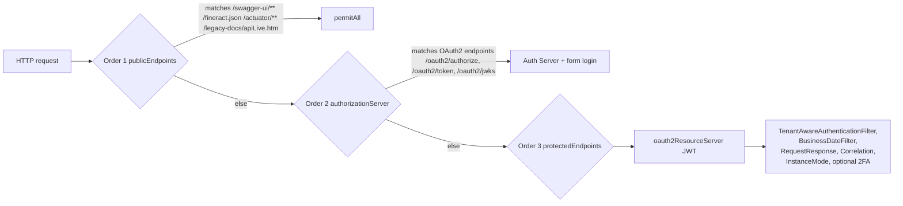
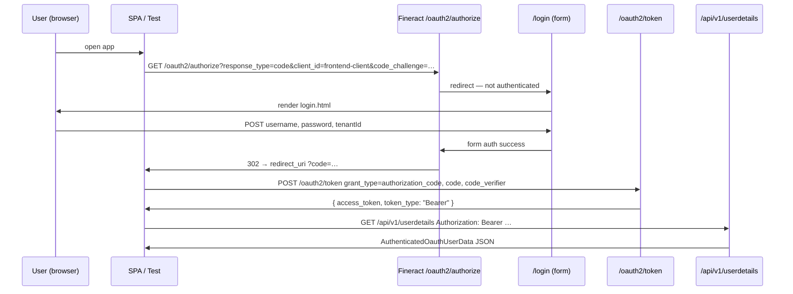

Apache Fineract ships with two mutually‑exclusive authentication front‑ends. HTTP Basic is the default and is wired by `infrastructure/core/config/SecurityConfig.java`; OAuth2 is opt‑in and wired by `infrastructure/security/config/AuthorizationServerConfig.java`. `SecurityValidationConfig` enforces that exactly one is enabled, so the two configurations never co‑exist at runtime.

This page walks through both setups, the filters they install, the `application.properties` keys that drive them, and the JWT claim mapping that lets the OAuth2 chain reuse the same `AppUser`/`Role`/`Permission` model as the Basic chain.

## Feature flags

The flags below live in `fineract-provider/src/main/resources/application.properties` and are honoured via Spring Boot's `@ConditionalOnProperty`. Each defaults from an environment variable so deployments can override without rebuilding:

```properties
fineract.security.basicauth.enabled=${FINERACT_SECURITY_BASICAUTH_ENABLED:true}
fineract.security.oauth2.enabled=${FINERACT_SECURITY_OAUTH_ENABLED:false}
```

`SecurityValidationConfig` runs a `@PostConstruct` check:

```java
// fineract-provider/.../infrastructure/core/config/SecurityValidationConfig.java
if (!Boolean.TRUE.equals(basicAuthEnabled) && !Boolean.TRUE.equals(oauthEnabled)) {
    throw new IllegalArgumentException(
        "No authentication scheme selected. Please decide if you want to use basic OR OAuth2 authentication.");
}
if (basicAuthEnabled && oauthEnabled) {
    throw new IllegalArgumentException(
        "Too many authentication schemes selected. Please decide if you want to use basic OR OAuth2 authentication.");
}
```

<Tip>
`@ConditionalOnProperty("fineract.security.basicauth.enabled")` on `SecurityConfig` and `@ConditionalOnProperty("fineract.security.oauth2.enabled")` on `AuthorizationServerConfig` mean Spring only instantiates one chain. The OAuth2 classes (`AuthenticationApiResource` is Basic‑only, `UserDetailsApiResource` is OAuth2‑only) follow the same pattern, so disabled features have zero runtime cost.
</Tip>

## HTTP Basic mode

### Wiring

`SecurityConfig#filterChain` declares a single `SecurityFilterChain` bean scoped to `/api/**`:

```java
http.securityMatcher(API_MATCHER.matcher("/api/**"))
    .authorizeHttpRequests(auth -> { /* per-endpoint authority rules */ })
    .httpBasic(hb -> hb.authenticationEntryPoint(basicAuthenticationEntryPoint()))
    .csrf(AbstractHttpConfigurer::disable)
    .sessionManagement(smc -> smc.sessionCreationPolicy(SessionCreationPolicy.STATELESS))
    .addFilterBefore(tenantAwareBasicAuthenticationFilter(), SecurityContextHolderFilter.class)
    .addFilterAfter(requestResponseFilter(), ExceptionTranslationFilter.class)
    .addFilterAfter(correlationHeaderFilter(), RequestResponseFilter.class)
    .addFilterAfter(fineractInstanceModeApiFilter(), CorrelationHeaderFilter.class);
```

Key beans:

| Bean | Type | Behaviour |
| ---- | ---- | --------- |
| `tenantAwareBasicAuthenticationFilter` | `TenantAwareBasicAuthenticationFilter` | Extends Spring's `BasicAuthenticationFilter`; reads tenant header, parses `Basic …` credentials |
| `basicAuthenticationEntryPoint` | `BasicAuthenticationEntryPoint` | Realm `"Fineract Platform API"` — sent on 401 |
| `authProvider` (`customAuthenticationProvider`) | `TemporaryPasswordAwareAuthenticationProvider` | Custom `DaoAuthenticationProvider` that also accepts a non-expired temporary password |
| `passwordEncoder` | `DelegatingPasswordEncoder` | From `PasswordEncoderFactories.createDelegatingPasswordEncoder()` (bcrypt + scrypt + argon2) |
| `authenticationManagerBean` | `ProviderManager` | `setEraseCredentialsAfterAuthentication(false)` so 2FA filter can still see credentials |

### `TenantAwareBasicAuthenticationFilter`

Source: `fineract-security/.../infrastructure/security/filter/TenantAwareBasicAuthenticationFilter.java`.

Per request, the filter:

1. Resets the `ThreadLocalContextUtil`.
2. Short‑circuits on `OPTIONS` (CORS pre‑flight).
3. Reads `Fineract-Platform-TenantId` header or `tenantIdentifier` query string; throws `InvalidTenantIdentifierException` if missing.
4. Loads `FineractPlatformTenant` via `AuthTenantDetailsService` and binds it to the thread.
5. Loads the current business‑date map from `BusinessDateReadPlatformService` and binds it to the thread.
6. Captures the `Authorization` header so subsequent processors can retrieve the basic-auth token.
7. On first request, also fixes a `baseUrl` system property and configures EhCache vs no‑cache based on `ConfigurationDomainService.isEhcacheEnabled()`.

```java
String tenantIdentifier = request.getHeader(TENANT_ID_REQUEST_HEADER);
if (org.apache.commons.lang3.StringUtils.isBlank(tenantIdentifier)) {
    tenantIdentifier = request.getParameter("tenantIdentifier");
}
if (tenantIdentifier == null && EXCEPTION_IF_HEADER_MISSING) {
    throw new InvalidTenantIdentifierException("No tenant identifier found: Add request header of '"
        + TENANT_ID_REQUEST_HEADER + "' or add the parameter 'tenantIdentifier' to query string of request URL.");
}
final FineractPlatformTenant tenant = basicAuthTenantDetailsService.loadTenantById(tenantIdentifier, isReportRequest);
ThreadLocalContextUtil.setTenant(tenant);
```

After this filter does its housekeeping, control falls through to the standard `BasicAuthenticationFilter` super-method, which calls the `AuthenticationManager` to validate the credentials.

### Verify-credentials endpoint

`AuthenticationApiResource` (`fineract-security/.../infrastructure/security/api/AuthenticationApiResource.java`) exposes `POST /v1/authentication`. It is annotated `@ConditionalOnProperty("fineract.security.basicauth.enabled")` and is the canonical way for SPAs to obtain a base64-encoded credential string and the user's permission set:

```java
final Authentication authentication =
    new UsernamePasswordAuthenticationToken(request.username, request.password);
final Authentication authenticationCheck = this.customAuthenticationProvider.authenticate(authentication);
// …
final byte[] base64EncodedAuthenticationKey = Base64.getEncoder()
    .encode((request.username + ":" + request.password).getBytes(StandardCharsets.UTF_8));
```

The response shape is `AuthenticatedUserData` (`fineract-security/.../infrastructure/security/data/AuthenticatedUserData.java`):

```json
{
  "username": "mifos",
  "userId": 1,
  "base64EncodedAuthenticationKey": "bWlmb3M6cGFzc3dvcmQ=",
  "authenticated": true,
  "officeId": 1,
  "officeName": "Head Office",
  "staffId": null,
  "staffDisplayName": null,
  "organisationalRole": null,
  "roles": [ { "id": 1, "name": "Super user", "description": "…" } ],
  "permissions": ["ALL_FUNCTIONS"],
  "shouldRenewPassword": false,
  "twoFactorAuthenticationRequired": false
}
```

`shouldRenewPassword` triggers `PasswordResetRequiredException` (mapped to HTTP 403 by `PasswordResetRequiredExceptionMapper`) when `SpringSecurityPlatformSecurityContext.doesPasswordHasToBeRenewed(user)` returns true.

### Calling the API

```bash
curl -u mifos:password \
  -H "Fineract-Platform-TenantId: default" \
  https://localhost:8443/fineract-provider/api/v1/users
```

The `Fineract-Platform-TenantId` header is **required** for every Basic-auth request.

## OAuth2 mode

OAuth2 is built on Spring Authorization Server (`spring-security-oauth2-authorization-server`) plus the standard `oauth2ResourceServer`. Setting `fineract.security.oauth2.enabled=true` activates `AuthorizationServerConfig` (`fineract-provider/.../infrastructure/security/config/AuthorizationServerConfig.java`), which defines **three** ordered filter chains.

### Three filter chains



#### `publicEndpoints` (`@Order(1)`)

```java
http.securityMatcher("/swagger-ui/**", "/fineract.json", "/actuator/**", "/legacy-docs/apiLive.htm")
    .authorizeHttpRequests(auth -> auth.anyRequest().permitAll())
    .csrf(AbstractHttpConfigurer::disable);
```

This carve‑out lets you serve Swagger UI and Spring Boot Actuator without a token.

#### `authorizationServerSecurityFilterChain` (`@Order(2)`)

```java
OAuth2AuthorizationServerConfigurer authorizationServerConfigurer = new OAuth2AuthorizationServerConfigurer();
http.securityMatcher(authorizationServerConfigurer.getEndpointsMatcher())
    .authorizeHttpRequests(auth -> auth.anyRequest().authenticated())
    .csrf(AbstractHttpConfigurer::disable)
    .sessionManagement(session -> session.sessionCreationPolicy(SessionCreationPolicy.IF_REQUIRED))
    .exceptionHandling(exceptions ->
        exceptions.authenticationEntryPoint(new LoginUrlAuthenticationEntryPoint("/login")))
    .apply(authorizationServerConfigurer);
```

The authorization server's endpoint matcher covers `/oauth2/authorize`, `/oauth2/token`, `/oauth2/jwks`, `/oauth2/revoke`, and `/oauth2/introspect`. Anonymous users sent to these endpoints are redirected to `/login`, served by `LoginController` (`GET /login` returns the `login` Thymeleaf template).

#### `protectedEndpoints` (`@Order(3)`)

```java
http.csrf(AbstractHttpConfigurer::disable)
    .authorizeHttpRequests(auth -> {
        auth.anyRequest().authenticated();
        if (fineractProperties.getSecurity().getTwoFactor().isEnabled()) {
            auth.anyRequest().hasAuthority("TWOFACTOR_AUTHENTICATED");
        }
    })
    .authenticationProvider(customAuthenticationProvider())
    .formLogin(form -> form.loginPage("/login")
        .authenticationDetailsSource(tenantAuthDetailsSource()).permitAll())
    .oauth2ResourceServer(rs -> rs.jwt(jwt -> jwt.jwtAuthenticationConverter(authenticationConverter())))
    .addFilterAfter(tenantAwareAuthenticationFilter(), SecurityContextHolderFilter.class)
    .addFilterAfter(businessDateFilter(), TenantAwareAuthenticationFilter.class)
    .addFilterAfter(requestResponseFilter(), ExceptionTranslationFilter.class)
    .addFilterAfter(correlationHeaderFilter(), RequestResponseFilter.class)
    .addFilterAfter(fineractInstanceModeApiFilter(), CorrelationHeaderFilter.class);
```

`tenantAuthDetailsSource()` is what makes the form login multi‑tenant:

```java
return request -> {
    String tenantId = request.getParameter(TENANT_ID);   // "tenantId"
    String username = request.getParameter(UsernamePasswordAuthenticationFilter.SPRING_SECURITY_FORM_USERNAME_KEY);
    String password = request.getParameter(UsernamePasswordAuthenticationFilter.SPRING_SECURITY_FORM_PASSWORD_KEY);
    return new TenantAuthenticationDetails(username, tenantId, password);
};
```

### Client registrations

OAuth2 client metadata is read from `application.properties` and assembled into an `InMemoryRegisteredClientRepository`:

```properties
fineract.security.oauth2.client.registrations.frontend-client.client-id=${FINERACT_SECURITY_OAUTH2_CLIENTS_FRONTEND_ID:frontend-client}
fineract.security.oauth2.client.registrations.frontend-client.scopes=${FINERACT_SECURITY_OAUTH2_CLIENTS_FRONTEND_SCOPES:read,write}
fineract.security.oauth2.client.registrations.frontend-client.authorization-grant-types=${FINERACT_SECURITY_OAUTH2_CLIENTS_FRONTEND_GRANTS:authorization_code,refresh_token}
fineract.security.oauth2.client.registrations.frontend-client.redirect-uris=${FINERACT_SECURITY_OAUTH2_CLIENTS_FRONTEND_REDIRECT:http://localhost:3000/callback}
fineract.security.oauth2.client.registrations.frontend-client.require-authorization-consent=${FINERACT_SECURITY_OAUTH2_CLIENTS_FRONTEND_CONSENT:false}
```

These keys are bound onto `FineractProperties.Security.Oauth2.Client.Registrations` and consumed by `registeredClientRepository`:

```java
List<RegisteredClient> clients = fineractProperties.getSecurity().getOauth2().getClient().getRegistrations().values().stream()
    .map(reg -> RegisteredClient.withId(UUID.randomUUID().toString())
        .clientId(reg.getClientId())
        .clientAuthenticationMethods(methods -> methods.add(ClientAuthenticationMethod.NONE))
        .scopes(scopes -> scopes.addAll(reg.getScopes()))
        .authorizationGrantTypes(grants -> reg.getAuthorizationGrantTypes()
            .forEach(grant -> grants.add(new AuthorizationGrantType(grant))))
        .redirectUris(uris -> uris.addAll(reg.getRedirectUris()))
        .clientSettings(ClientSettings.builder()
            .requireAuthorizationConsent(reg.isRequireAuthorizationConsent()).build())
        .build())
    .toList();
return new InMemoryRegisteredClientRepository(clients);
```

<Note>
The default client uses `ClientAuthenticationMethod.NONE` because it is intended for SPA-style **PKCE** flows. The `oauth2-tests` use exactly that: `code_challenge=…&code_challenge_method=S256`.
</Note>

Add additional clients by namespacing under `fineract.security.oauth2.client.registrations.<name>.*`.

### JWT claims and token customizer

The JWT issued by `/oauth2/token` is customized to carry the user's role names, granted authorities, and tenant id:

```java
@Bean
public OAuth2TokenCustomizer<JwtEncodingContext> tokenCustomizer() {
    return context -> {
        UsernamePasswordAuthenticationToken authentication = context.getPrincipal();
        TenantAuthenticationDetails details = (TenantAuthenticationDetails) authentication.getDetails();
        AppUser appUser = (AppUser) authentication.getPrincipal();
        List<String> roles = appUser.getRoles().stream().map(Role::getName).toList();
        List<String> scope = appUser.getAuthorities().stream().map(GrantedAuthority::getAuthority).collect(Collectors.toList());
        context.getClaims()
            .claim("scope", scope)
            .claim("role", roles)
            .claim("tenant", details.getTenantId());
    };
}
```

A decoded token therefore looks like:

```json
{
  "sub": "mifos",
  "iss": "https://localhost:8443",
  "exp": 1735056000,
  "scope": ["READ_LOAN", "CREATE_LOAN", "ALL_FUNCTIONS"],
  "role": ["Super user"],
  "tenant": "default"
}
```

The `tenant` claim is what `TenantAwareAuthenticationFilter` parses to set up `ThreadLocalContextUtil`:

```java
// fineract-security/.../infrastructure/security/filter/TenantAwareAuthenticationFilter.java
String token = resolver.resolve(request);
String tenantId;
if (token != null) {
    var jwt = JWTParser.parse(token); // not validated here!
    var claims = jwt.getJWTClaimsSet();
    tenantId = (String) claims.getClaim("tenant");
} else {
    tenantId = request.getParameter("tenantId");
}
ThreadLocalContextUtil.setTenant(tenantDetailsService.loadTenantById(tenantId, false));
```

Validation itself happens later in the chain — Spring's resource‑server filter cryptographically verifies the JWT against the authorization server's JWK set.

### JWT → AppUser conversion

`FineractJwtAuthenticationTokenConverter` (`fineract-security/.../infrastructure/security/converter/`) turns a validated `Jwt` into the platform's principal:

```java
public FineractJwtAuthenticationToken convert(@NonNull Jwt jwt) {
    try {
        UserDetails user = userDetailsService.loadUserByUsername(jwt.getSubject());
        Collection<GrantedAuthority> authorities = new JwtGrantedAuthoritiesConverter().convert(jwt);
        return new FineractJwtAuthenticationToken(jwt, authorities, user);
    } catch (UsernameNotFoundException ex) {
        throw new OAuth2AuthenticationException(new OAuth2Error(OAuth2ErrorCodes.INVALID_TOKEN), ex);
    }
}
```

- **Principal**: the JPA `AppUser` (so all platform code calling `context.authenticatedUser()` works unchanged).
- **Authorities**: extracted by Spring's default `JwtGrantedAuthoritiesConverter`, which reads the `scope` (or `scp`) claim.

### `UserDetailsApiResource`

`fineract-security/.../infrastructure/security/api/UserDetailsApiResource.java` exposes `GET /v1/userdetails` — the OAuth2 counterpart to `POST /v1/authentication`. It is `@ConditionalOnProperty("fineract.security.oauth2.enabled")` and reads the authenticated principal out of the `SecurityContext`:

```java
final FineractJwtAuthenticationToken authentication =
    (FineractJwtAuthenticationToken) context.getAuthentication();
final AppUser principal = (AppUser) authentication.getPrincipal();
// …
authenticatedUserData = new AuthenticatedOauthUserData()
    .setUsername(principal.getUsername())
    .setOfficeId(officeId).setOfficeName(officeName)
    .setStaffId(staffId).setStaffDisplayName(staffDisplayName)
    .setOrganisationalRole(organisationalRole)
    .setRoles(roles).setPermissions(permissions).setUserId(principal.getId())
    .setAccessToken(authentication.getToken().getTokenValue())
    .setAuthenticated(true)
    .setTwoFactorAuthenticationRequired(isTwoFactorRequired);
```

The response DTO is `AuthenticatedOauthUserData` — it differs from `AuthenticatedUserData` by replacing `base64EncodedAuthenticationKey` with `accessToken`.

## Authorization-code (PKCE) flow

The integration test in `oauth2-tests/src/test/java/org/apache/fineract/oauth2tests/OAuth2AuthenticationTest.java` documents the full flow:

```java
String token = loginAndClaimToken(
    "https://localhost:8443/fineract-provider/oauth2/authorize"
        + "?response_type=code&client_id=frontend-client"
        + "&redirect_uri=http%3A%2F%2Flocalhost%3A3000%2Fcallback&scope=read&state=xyz"
        + "&code_challenge=zudG_xkz8WrPPMq2MwmFP-NRvNapCL0OD-xYWRapTsU"
        + "&code_challenge_method=S256",
    requestFormSpec);

RequestSpecification requestSpecWithToken = new RequestSpecBuilder()
    .setContentType(ContentType.JSON)
    .addHeader("Authorization", "Bearer " + token)
    .build();
```

Sequence:



<Note>
End-to-end test infrastructure: the `oauth2-tests/` project drives the browser with ChromeDriver, captures the redirect via an in-process `HttpServer` on `localhost:3000`, and exchanges the code at `/oauth2/token`. Refer to `oauth2-tests/src/test/java/org/apache/fineract/oauth2tests/OAuth2AuthenticationTest.java` for the full Selenium choreography.
</Note>

## Cross-cutting beans shared by both modes

| Bean | File | Notes |
| ---- | ---- | ----- |
| `PasswordEncoder` | both | `PasswordEncoderFactories.createDelegatingPasswordEncoder()` — recognizes `{bcrypt}`, `{scrypt}`, `{argon2}`, …; encodes as bcrypt by default |
| `customAuthenticationProvider` | both | `TemporaryPasswordAwareAuthenticationProvider` — accepts permanent or non‑expired temporary password |
| `TenantAwareJpaPlatformUserDetailsService` | both | Loads `PlatformUser` by username, cached per tenant |
| `PlatformUserDetailsChecker` | Basic | Post-auth `UserDetailsChecker` — rejects locked/disabled accounts (Basic chain only; OAuth2 leaves this to JWT validation) |
| `CorsConfigurationSource` | both | Built from `fineract.security.cors.*` (see [Filters & Config](/security/filters-and-config)) |

## Temporary passwords

`TemporaryPasswordAwareAuthenticationProvider` (`fineract-provider/.../infrastructure/security/service/`) extends `DaoAuthenticationProvider` and overrides `additionalAuthenticationChecks`:

```java
final String presentedPassword = authentication.getCredentials().toString();
if (getPasswordEncoder().matches(presentedPassword, userDetails.getPassword())) {
    return;
}
if (userDetails instanceof AppUser appUser && appUser.hasValidTemporaryPassword()
        && getPasswordEncoder().matches(presentedPassword, appUser.getTemporaryPassword())) {
    return;
}
throw new BadCredentialsException(
    messages.getMessage("AbstractUserDetailsAuthenticationProvider.badCredentials", "Bad credentials"));
```

That is what lets the **forgot‑password** flow work end‑to‑end: `ForgotPasswordServiceImpl` writes a hashed temporary password with a 1-hour expiry, and the next login accepts either credential. See [Users, Roles & Permissions](/security/users-roles-permissions#forgot-password) for the full flow.

## Choosing a mode

| Use case | Recommended mode |
| -------- | ---------------- |
| Server-to-server scripts, CLI tooling, simple integrations | **Basic** with `Fineract-Platform-TenantId` header |
| SPA in the browser (PKCE), mobile apps | **OAuth2** authorization code + refresh |
| Need second‑factor enforcement for some users | Either mode + `fineract.security.2fa.enabled=true` and assign the role _without_ `BYPASS_TWOFACTOR` to those users |
| Production deployments behind a reverse proxy | Enable `fineract.security.hsts.enabled=true` regardless of mode |

## Common pitfalls

<Warning>
Forgetting `Fineract-Platform-TenantId` on Basic-auth requests results in `InvalidTenantIdentifierException` → HTTP 400 before authentication even runs. Use a query string fallback (`?tenantIdentifier=default`) for tools that cannot send custom headers.
</Warning>

<Warning>
Both chains disable CSRF (`csrf(AbstractHttpConfigurer::disable)`). The Basic chain additionally configures its `ProviderManager` with `setEraseCredentialsAfterAuthentication(false)` so the credentials survive on the `Authentication` object — `TwoFactorAuthenticationFilter` needs them to rebuild the `UsernamePasswordAuthenticationToken` with the extra `TWOFACTOR_AUTHENTICATED` authority. CSRF protection is unnecessary on either chain because requests carry credentials/tokens explicitly (no ambient session cookie to forge).
</Warning>

<Warning>
The default `frontend-client` redirect URI is `http://localhost:3000/callback`. For real deployments, override `FINERACT_SECURITY_OAUTH2_CLIENTS_FRONTEND_REDIRECT` (and any other registrations you add) to an HTTPS URL allowed by your SPA host.
</Warning>
