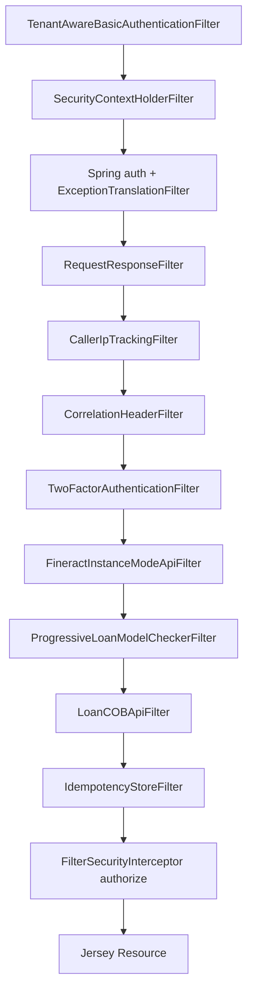
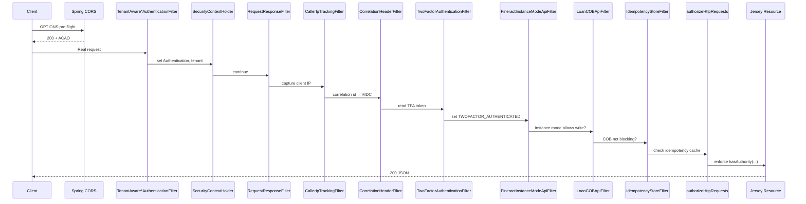

The Apache Fineract Spring Security setup is wired by two configuration classes — `SecurityConfig` for Basic auth and `AuthorizationServerConfig` for OAuth2 — and a small constellation of filters that share responsibility for tenant resolution, request logging, idempotency, COB enforcement, and (optionally) 2FA. This page enumerates every filter, fixes the chain order, and documents the CORS, HSTS, and channel-security toggles that surround them.

## Two `SecurityConfig`s, conditionally activated

| Class | Module | Condition |
| ----- | ------ | --------- |
| `infrastructure/core/config/SecurityConfig.java` | `fineract-provider` | `@ConditionalOnProperty("fineract.security.basicauth.enabled")` |
| `infrastructure/security/config/AuthorizationServerConfig.java` | `fineract-provider` | `@ConditionalOnProperty("fineract.security.oauth2.enabled")` |
| `infrastructure/core/config/SecurityValidationConfig.java` | `fineract-provider` | Always loaded — fails fast if both or neither are enabled |

Because only one chain is active per JVM, the filter inventory below splits cleanly along that line.

## Basic-auth chain

`SecurityConfig#filterChain` declares a single `SecurityFilterChain` scoped to `/api/**`:

```java
http.securityMatcher(API_MATCHER.matcher("/api/**"))
    .authorizeHttpRequests(...)
    .httpBasic(hb -> hb.authenticationEntryPoint(basicAuthenticationEntryPoint()))
    .csrf(AbstractHttpConfigurer::disable)
    .sessionManagement(smc -> smc.sessionCreationPolicy(SessionCreationPolicy.STATELESS))
    .addFilterBefore(tenantAwareBasicAuthenticationFilter(), SecurityContextHolderFilter.class)
    .addFilterAfter(requestResponseFilter(), ExceptionTranslationFilter.class)
    .addFilterAfter(correlationHeaderFilter(), RequestResponseFilter.class)
    .addFilterAfter(fineractInstanceModeApiFilter(), CorrelationHeaderFilter.class);
```

Conditional `addFilterAfter` calls follow:

```java
if (loanCOBFilterHelper != null) {
    http.addFilterAfter(loanCOBApiFilter(), FineractInstanceModeApiFilter.class)
        .addFilterAfter(idempotencyStoreFilter(), LoanCOBApiFilter.class);
    http.addFilterBefore(progressiveLoanModelCheckerFilter, LoanCOBApiFilter.class);
} else {
    http.addFilterAfter(idempotencyStoreFilter(), FineractInstanceModeApiFilter.class);
    http.addFilterAfter(progressiveLoanModelCheckerFilter, FineractInstanceModeApiFilter.class);
}
if (fineractProperties.getIpTracking().isEnabled()) {
    http.addFilterAfter(callerIpTrackingFilter(), RequestResponseFilter.class);
}
if (fineractProperties.getSecurity().getTwoFactor().isEnabled()) {
    http.addFilterAfter(twoFactorAuthenticationFilter(), CorrelationHeaderFilter.class);
}
```

The resulting order (for a deployment with COB, IP tracking, and 2FA all on):



## OAuth2 chain

`AuthorizationServerConfig` declares three `@Order`ed `SecurityFilterChain` beans (public, authorization server, protected resource server). The protected chain's filter order mirrors the Basic chain but uses `TenantAwareAuthenticationFilter` and adds `BusinessDateFilter`:

```java
.oauth2ResourceServer(rs -> rs.jwt(jwt -> jwt.jwtAuthenticationConverter(authenticationConverter())))
.addFilterAfter(tenantAwareAuthenticationFilter(), SecurityContextHolderFilter.class)
.addFilterAfter(businessDateFilter(), TenantAwareAuthenticationFilter.class)
.addFilterAfter(requestResponseFilter(), ExceptionTranslationFilter.class)
.addFilterAfter(correlationHeaderFilter(), RequestResponseFilter.class)
.addFilterAfter(fineractInstanceModeApiFilter(), CorrelationHeaderFilter.class);
```

## Filter inventory

The table below lists every filter that may be inserted into a Fineract security chain, the package it lives in, and what it does.

| Filter | Module / package | When added | What it does |
| ------ | ---------------- | ---------- | ------------ |
| `TenantAwareBasicAuthenticationFilter` | `fineract-security/.../infrastructure/security/filter/` | Basic chain only | Resolves tenant from `Fineract-Platform-TenantId` header; parses Basic credentials; loads business dates |
| `TenantAwareAuthenticationFilter` | `fineract-security/.../infrastructure/security/filter/` | OAuth2 chain only | Parses (unvalidated) JWT to read `tenant` claim; loads tenant into `ThreadLocalContextUtil` |
| `BusinessDateFilter` | `fineract-security/.../infrastructure/security/filter/` | OAuth2 chain only | Populates business-date map from `BusinessDateReadPlatformService` once tenant is known |
| `TwoFactorAuthenticationFilter` | `fineract-security/.../infrastructure/security/filter/` | Either chain, when `fineract.security.2fa.enabled` | Reads `Fineract-Platform-TFA-Token`; adds `TWOFACTOR_AUTHENTICATED` authority |
| `RequestResponseFilter` | `fineract-core/.../infrastructure/core/filters/` | Both chains | Wraps request/response for tee'd reading (idempotency, audit), measures elapsed time |
| `CallerIpTrackingFilter` | `fineract-core/.../infrastructure/core/filters/` | Both, if `fineract.ip-tracking.enabled` | Captures client IP into MDC and request context |
| `CorrelationHeaderFilter` | `fineract-core/.../infrastructure/core/filters/` | Both chains | Reads/generates correlation id (`X-Correlation-Id`), pushes to MDC via `MDCWrapper` |
| `FineractInstanceModeApiFilter` | `fineract-core/.../infrastructure/instancemode/filter/` | Both chains | Enforces read-only/batch instance modes: rejects writes on read-only nodes |
| `ProgressiveLoanModelCheckerFilter` | `fineract-core/.../infrastructure/jobs/filter/` | Both chains | Validates progressive-loan calculation parameters before reaching the resource |
| `LoanCOBApiFilter` | `fineract-core/.../infrastructure/jobs/filter/` | Both chains, if `LoanCOBFilterHelper` bean exists | Blocks loan-state-mutating endpoints while close-of-business is in progress |
| `IdempotencyStoreFilter` | `fineract-core/.../infrastructure/core/filters/` | Both chains | Honours `Idempotency-Key` request header: returns cached response if previously seen |

### `TenantAwareBasicAuthenticationFilter` in detail

Source: `fineract-security/.../infrastructure/security/filter/TenantAwareBasicAuthenticationFilter.java`. It extends Spring's `BasicAuthenticationFilter` but pre-processes the request before delegating:

```java
ThreadLocalContextUtil.reset();
if ("OPTIONS".equalsIgnoreCase(request.getMethod())) {
    filterChain.doFilter(request, response); // CORS preflight
} else {
    String tenantIdentifier = request.getHeader(TENANT_ID_REQUEST_HEADER);
    if (StringUtils.isBlank(tenantIdentifier)) {
        tenantIdentifier = request.getParameter("tenantIdentifier");
    }
    if (tenantIdentifier == null && EXCEPTION_IF_HEADER_MISSING) {
        throw new InvalidTenantIdentifierException("No tenant identifier found: Add request header of '"
            + TENANT_ID_REQUEST_HEADER + "' or add the parameter 'tenantIdentifier' to query string of request URL.");
    }
    final FineractPlatformTenant tenant =
        basicAuthTenantDetailsService.loadTenantById(tenantIdentifier, isReportRequest);
    ThreadLocalContextUtil.setTenant(tenant);
    HashMap<BusinessDateType, LocalDate> businessDates = businessDateReadPlatformService.getBusinessDates();
    ThreadLocalContextUtil.setBusinessDates(businessDates);
    // … capture authToken, set cache mode, then …
    super.doFilterInternal(request, response, filterChain);
}
```

On `InvalidTenantIdentifierException` it nulls the security context and emits a 400 with `WWW-Authenticate: Basic realm="Fineract Platform API"`. On successful authentication, an override adds a header for the SPA:

```java
@Override
protected void onSuccessfulAuthentication(HttpServletRequest request, HttpServletResponse response,
        Authentication authResult) throws IOException {
    super.onSuccessfulAuthentication(request, response, authResult);
    AppUser user = (AppUser) authResult.getPrincipal();
    response.addHeader("X-Notification-Refresh",
        userNotificationService.hasUnreadUserNotifications(user.getId()) ? "true" : "false");
}
```

A `PlatformRequestLog` is emitted via `toApiJsonSerializer` at DEBUG level for every request, useful for latency profiling.

### `TenantAwareAuthenticationFilter` (OAuth2)

Source: `fineract-security/.../infrastructure/security/filter/TenantAwareAuthenticationFilter.java`. The filter parses but does **not** cryptographically validate the JWT — that is the resource server's job. Its purpose is purely to extract the tenant id so JPA queries during the request route to the correct schema:

```java
String token = resolver.resolve(request);
String tenantId;
if (token != null) {
    var jwt = JWTParser.parse(token); // not validated here!
    var claims = jwt.getJWTClaimsSet();
    tenantId = (String) claims.getClaim("tenant");
} else {
    tenantId = request.getParameter("tenantId");
}
ThreadLocalContextUtil.setTenant(tenantDetailsService.loadTenantById(tenantId, false));
```

The `BearerTokenResolver` is the standard Spring `DefaultBearerTokenResolver`. The `tenant` claim is added by `AuthorizationServerConfig#tokenCustomizer`.

### `BusinessDateFilter`

```java
@Override
protected void doFilterInternal(@NonNull HttpServletRequest request, @NonNull HttpServletResponse response,
        @NonNull FilterChain filterChain) throws ServletException, IOException {
    if (ThreadLocalContextUtil.getTenant() != null) {
        HashMap<BusinessDateType, LocalDate> businessDates = businessDateReadPlatformService.getBusinessDates();
        ThreadLocalContextUtil.setBusinessDates(businessDates);
    }
    filterChain.doFilter(request, response);
}
```

The Basic chain folds this behaviour into `TenantAwareBasicAuthenticationFilter`; the OAuth2 chain keeps it as a separate filter because tenant resolution happens earlier (no header parsing) and the business date load can therefore be a clean second step.

### `TwoFactorAuthenticationFilter`

Covered in depth on [Two-Factor Authentication](/security/two-factor-authentication). In the chain it sits between `CorrelationHeaderFilter` and the URL-level authorization layer, so by the time `hasAuthority("TWOFACTOR_AUTHENTICATED")` is evaluated the filter has had the chance to add the authority.

## Authorization rules

The same `SecurityConfig#filterChain` declares hundreds of URL-to-authority mappings. The pattern is consistent:

```java
.requestMatchers(API_MATCHER.matcher(HttpMethod.GET, "/api/*/loans/*/notes"))
    .hasAnyAuthority(ALL_FUNCTIONS, ALL_FUNCTIONS_READ, "READ_LOANNOTE")
.requestMatchers(API_MATCHER.matcher(HttpMethod.POST, "/api/*/loans/*/notes"))
    .hasAnyAuthority(ALL_FUNCTIONS, ALL_FUNCTIONS_WRITE, "CREATE_LOANNOTE")
```

with permitAll carve-outs for public endpoints:

```java
.requestMatchers(API_MATCHER.matcher(HttpMethod.OPTIONS, "/api/**")).permitAll()
.requestMatchers(API_MATCHER.matcher(HttpMethod.POST, "/api/*/echo")).permitAll()
.requestMatchers(API_MATCHER.matcher(HttpMethod.POST, "/api/*/authentication")).permitAll()
.requestMatchers(API_MATCHER.matcher(HttpMethod.POST, "/api/*/password/forgot")).permitAll()
.requestMatchers(API_MATCHER.matcher(HttpMethod.PUT, "/api/*/instance-mode")).permitAll()
```

and a final fallback that combines `fullyAuthenticated` with the 2FA authority:

```java
List<AuthorizationManager<RequestAuthorizationContext>> authorizationManagers = new ArrayList<>();
authorizationManagers.add(fullyAuthenticated());
if (fineractProperties.getSecurity().getTwoFactor().isEnabled()) {
    authorizationManagers.add(hasAuthority("TWOFACTOR_AUTHENTICATED"));
}
.requestMatchers(API_MATCHER.matcher("/api/**"))
    .access(allOf(authorizationManagers.toArray(new AuthorizationManager[0])));
```

Anything not explicitly enumerated falls into the catch-all. Resource classes still perform a second permission check via `AppUser.validateHasXxxPermission(...)`, so a missed `requestMatchers` rule cannot silently grant access — it can only refuse it.

## Authentication beans

| Bean | Definition | Purpose |
| ---- | ---------- | ------- |
| `authProvider()` (Basic) / `customAuthenticationProvider()` (OAuth2) | `TemporaryPasswordAwareAuthenticationProvider` | DAO provider that accepts permanent or non-expired temporary password |
| `passwordEncoder()` | `PasswordEncoderFactories.createDelegatingPasswordEncoder()` | Bcrypt by default; recognises legacy `{noop}`/`{md5}` prefixes |
| `authenticationManagerBean()` | `ProviderManager(authProvider())` with `setEraseCredentialsAfterAuthentication(false)` | Used by the Basic filter; credentials retained so 2FA filter can rebuild the auth |
| `basicAuthenticationEntryPoint()` | `new BasicAuthenticationEntryPoint()` with realm `"Fineract Platform API"` | Triggers the browser's Basic prompt on 401 |
| `platformUserDetailsChecker` | `PlatformUserDetailsChecker` | `setPostAuthenticationChecks` hook — rejects locked/disabled accounts |

## CORS

CORS is opt-out (default true). All settings live in `application.properties`:

```properties
fineract.security.cors.enabled=${FINERACT_SECURITY_CORS_ENABLED:true}
fineract.security.cors.allowed-origin-patterns=${FINERACT_SECURITY_CORS_ALLOWED_ORIGIN_PATTERNS:*}
fineract.security.cors.allowed-methods=${FINERACT_SECURITY_CORS_ALLOWED_METHODS:*}
fineract.security.cors.allowed-headers=${FINERACT_SECURITY_CORS_ALLOWED_HEADERS:*}
fineract.security.cors.exposed-headers=${FINERACT_SECURITY_CORS_EXPOSED_HEADERS:*}
fineract.security.cors.allow-credentials=${FINERACT_SECURITY_CORS_ALLOW_CREDENTIALS:true}
```

`SecurityConfig#corsConfigurationSource` (and the same bean in `AuthorizationServerConfig`) builds a `UrlBasedCorsConfigurationSource`:

```java
@Bean
public CorsConfigurationSource corsConfigurationSource() {
    CorsConfiguration config = new CorsConfiguration();
    FineractProperties.CorsProperties corsConfiguration = fineractProperties.getSecurity().getCors();
    config.setAllowedOriginPatterns(corsConfiguration.getAllowedOriginPatterns());
    config.setAllowedMethods(corsConfiguration.getAllowedMethods());
    config.setAllowedHeaders(corsConfiguration.getAllowedHeaders());
    config.setExposedHeaders(corsConfiguration.getExposedHeaders());
    config.setAllowCredentials(corsConfiguration.isAllowCredentials());
    UrlBasedCorsConfigurationSource source = new UrlBasedCorsConfigurationSource();
    source.registerCorsConfiguration("/**", config);
    return source;
}
```

Spring's CORS support is only attached to the chain when `cors.enabled=true`:

```java
if (fineractProperties.getSecurity().getCors().isEnabled()) {
    http.cors(Customizer.withDefaults());
}
```

<Warning>
The defaults (`*` patterns with `allow-credentials=true`) are intentionally permissive for development. Per the CORS spec, browsers refuse `Access-Control-Allow-Origin: *` together with `Access-Control-Allow-Credentials: true`; Spring's `allowedOriginPatterns` works around that but **you must replace `*` with explicit origins for any production deployment** that accepts credentialed cross-origin requests.
</Warning>

## HSTS

```properties
fineract.security.hsts.enabled=${FINERACT_SECURITY_HSTS_ENABLED:false}
```

When enabled, every request is forced over HTTPS and the response carries `Strict-Transport-Security`:

```java
if (fineractProperties.getSecurity().getHsts().isEnabled()) {
    http.requiresChannel(channel -> channel.anyRequest().requiresSecure())
        .headers(headers -> headers.httpStrictTransportSecurity(
            hsts -> hsts.includeSubDomains(true).maxAgeInSeconds(31536000)));
}
```

The result is a 1-year (`31_536_000` seconds) max age with `includeSubDomains` set. Once a client honours HSTS, downgrade attacks on the API host are no longer possible.

## SSL channel enforcement

If Spring Boot's standard `server.ssl.enabled=true` is set, `SecurityConfig` additionally requires HTTPS for `/api/**`:

```java
if (serverProperties.getSsl().isEnabled()) {
    http.requiresChannel(channel ->
        channel.requestMatchers(API_MATCHER.matcher("/api/**")).requiresSecure());
}
```

This is independent of HSTS; together they cover both client-side (HSTS) and server-side (redirect) protections.

## Session policy and CSRF

Both chains run **stateless**:

```java
.sessionManagement(smc -> smc.sessionCreationPolicy(SessionCreationPolicy.STATELESS))
```

…except the OAuth2 authorization-server sub-chain, which uses `IF_REQUIRED` because the authorization-code flow needs a server-side session to remember the user across the consent redirect:

```java
.sessionManagement(session -> session.sessionCreationPolicy(SessionCreationPolicy.IF_REQUIRED))
```

CSRF is disabled on every chain (`AbstractHttpConfigurer::disable`). That is safe because:

- Basic auth requires credentials on every request — there is no ambient session cookie to forge.
- The OAuth2 resource chain only accepts JWTs in `Authorization: Bearer`, again with no ambient cookie.
- The authorization-server chain is short-lived and only handles the redirect dance.

## Putting it together — request sequence



## When to override what

| Need | Property to flip |
| ---- | ---------------- |
| Switch authentication mode | `fineract.security.basicauth.enabled` / `fineract.security.oauth2.enabled` |
| Add a second factor | `fineract.security.2fa.enabled=true` |
| Lock down origins | Replace `fineract.security.cors.allowed-origin-patterns=*` with explicit origins |
| Disable CORS entirely (server-to-server only) | `fineract.security.cors.enabled=false` |
| Force HTTPS at the protocol level | `fineract.security.hsts.enabled=true` and/or `server.ssl.enabled=true` |
| Track caller IPs in audit | Set `fineract.ip-tracking.enabled=true` to insert `CallerIpTrackingFilter` |

<Note>
Filter insertion is driven by Spring Boot conditional logic, not by classpath presence. To remove a filter entirely, flip the corresponding flag — there is no need to swap implementations.
</Note>
