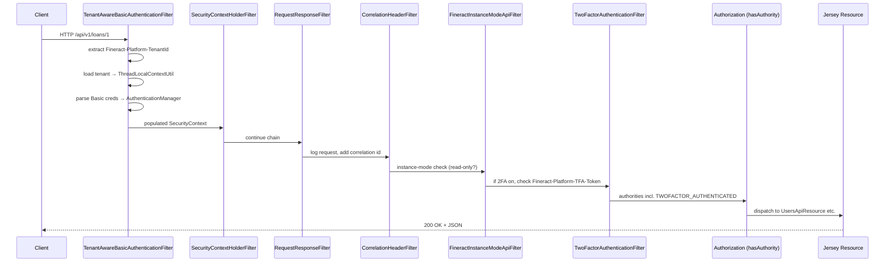
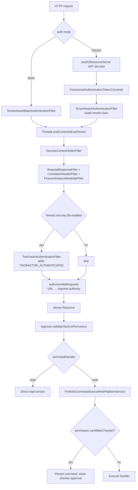

Apache Fineract layers Spring Security on top of the Jersey/JAX‑RS resource layer to provide multi‑tenant authentication, role/permission authorization, and optional two‑factor enforcement. All HTTP traffic to `/api/**` is intercepted by a configurable filter chain whose composition depends on the `fineract.security.*` properties in `fineract-provider/src/main/resources/application.properties`. This page maps the moving parts so the dedicated pages on Basic/OAuth2, 2FA, filters, users, and password preferences can drill into specifics.

## Three authentication modes

Fineract supports exactly **one** of two authentication front-ends at a time, optionally augmented with a second factor:

<CardGroup cols={3}>
  <Card title="HTTP Basic" icon="lock">
    Default. Driven by `fineract.security.basicauth.enabled=true`. Configured in `infrastructure/core/config/SecurityConfig.java`.
  </Card>
  <Card title="OAuth2 / JWT" icon="key">
    Opt‑in. `fineract.security.oauth2.enabled=true`. Configured in `infrastructure/security/config/AuthorizationServerConfig.java`.
  </Card>
  <Card title="Two‑Factor" icon="shield-halved">
    Augments either mode. `fineract.security.2fa.enabled=true`. Adds `TwoFactorAuthenticationFilter` and requires the `TWOFACTOR_AUTHENTICATED` authority on protected routes.
  </Card>
</CardGroup>

`SecurityValidationConfig` (in `fineract-provider/src/main/java/org/apache/fineract/infrastructure/core/config/SecurityValidationConfig.java`) refuses to start the application if both Basic and OAuth2 are enabled, or if neither is:

```java
if (basicAuthEnabled && oauthEnabled) {
    throw new IllegalArgumentException(
        "Too many authentication schemes selected. Please decide if you want to use basic OR OAuth2 authentication.");
}
```

## Module layout

Most reusable code lives in the `fineract-security` module; configuration that wires it into the running web application lives in `fineract-provider`.

| Module | Path | Role |
| ------ | ---- | ---- |
| `fineract-security` | `src/main/java/org/apache/fineract/infrastructure/security/` | Filters, auth services, 2FA domain, JWT converter |
| `fineract-core` | `src/main/java/org/apache/fineract/useradministration/` | `AppUser`, `Role`, `Permission` entities and `AppUserData`/`RoleData`/`PermissionData` DTOs |
| `fineract-provider` | `src/main/java/org/apache/fineract/infrastructure/core/config/SecurityConfig.java` | Wires the Basic‑auth filter chain into Spring Security |
| `fineract-provider` | `src/main/java/org/apache/fineract/infrastructure/security/config/AuthorizationServerConfig.java` | Wires the OAuth2 authorization server + resource server filter chains |
| `fineract-provider` | `src/main/java/org/apache/fineract/useradministration/` | `UsersApiResource`, `RolesApiResource`, `PermissionsApiResource`, write services, validators |
| `oauth2-tests` | `src/test/java/org/apache/fineract/oauth2tests/` | End‑to‑end Selenium/REST test of the OAuth2 authorization code flow |
| `twofactor-tests` | `src/test/java/org/apache/fineract/twofactortests/` | End‑to‑end test using GreenMail for OTP email delivery |

## Classes under `infrastructure/security/`

The table below catalogs every class shipped from `fineract-security/src/main/java/org/apache/fineract/infrastructure/security/`. Each subsequent page expands on the highlighted areas.

| Package | Class | Purpose |
| ------- | ----- | ------- |
| `api` | `AuthenticationApiResource` | `POST /v1/authentication` — Basic-auth verification endpoint; returns `AuthenticatedUserData` |
| `api` | `AuthenticationApiResourceSwagger` | OpenAPI request/response schemas for the authentication endpoint |
| `api` | `LoginController` | `GET /login` — serves the form login page used by the OAuth2 authorization endpoint |
| `api` | `TwoFactorApiResource` | `/v1/twofactor` — list delivery methods, request OTP, validate, invalidate |
| `api` | `TwoFactorConfigurationApiResource` | `/v1/twofactor/configure` — read/update tenant 2FA configuration |
| `api` | `UserDetailsApiResource` | `GET /v1/userdetails` — OAuth2 mirror of `AuthenticationApiResource` |
| `api` | `UserDetailsApiResourceSwagger` | OpenAPI schemas for the OAuth2 user-details endpoint |
| `command` | `InvalidateTFAccessTokenCommandHandler` | Command handler for `POST /v1/twofactor/invalidate` |
| `command` | `UpdateTwoFactorConfigCommandHandler` | Command handler for updating 2FA configuration |
| `constants` | `TenantConstants` | Constant keys for tenant‑related properties |
| `constants` | `TwoFactorConfigurationConstants` | Configuration keys (`otp-token-length`, `access-token-live-time`, …) |
| `constants` | `TwoFactorConstants` | `BYPASS_TWOFACTOR`, `sms`/`email` method names, access token resource name |
| `converter` | `FineractJwtAuthenticationTokenConverter` | Converts a validated `Jwt` to a `FineractJwtAuthenticationToken` carrying the `AppUser` principal |
| `data` | `AccessTokenData` | DTO returned by `/twofactor/validate` |
| `data` | `AuthenticatedOauthUserData` | OAuth2 response DTO (extends user fields with `accessToken`) |
| `data` | `AuthenticatedUserData` | Basic‑auth response DTO with `base64EncodedAuthenticationKey` |
| `data` | `FineractJwtAuthenticationToken` | Custom `JwtAuthenticationToken` whose principal is the JPA `AppUser` |
| `data` | `OTPDeliveryMethod` | DTO describing an SMS/email channel for OTP delivery |
| `data` | `OTPMetadata` | DTO with delivery target, token length, valid‑to timestamp |
| `data` | `OTPRequest` | In-memory record of an issued OTP token |
| `data` | `PlatformRequestLog` | Per‑request timing/log used by the Basic‑auth filter for diagnostics |
| `data` | `TenantAuthenticationDetails` | Authentication details carrying `tenantId`, `username`, `password` for the OAuth2 form login |
| `data` | `TwoFactorConfigurationValidator` | JSON validator for 2FA configuration updates |
| `domain` | `OTPRequestRepository` | In-memory repository (cache‑backed) for pending OTP requests |
| `domain` | `PlatformUserRepository` | Spring Data lookup of users by username, used by `UserDetailsService` |
| `domain` | `TFAccessToken` | JPA entity `twofactor_access_token` |
| `domain` | `TFAccessTokenRepository` | Spring Data repository for `TFAccessToken` |
| `domain` | `TwoFactorConfiguration` | JPA entity `twofactor_configuration` (key/value rows) |
| `domain` | `TwoFactorConfigurationRepository` | Spring Data repository for `TwoFactorConfiguration` |
| `exception` | `AccessTokenInvalidIException` | Thrown when a 2FA access token is missing/expired |
| `exception` | `EscapeSqlLiteralException` | Thrown by `SqlInjectionPreventerServiceImpl` on encode failure |
| `exception` | `ForcePasswordResetException` | Signals a forced password change before continuing |
| `exception` | `OTPDeliveryMethodInvalidException` | Unknown / disabled OTP channel |
| `exception` | `OTPTokenInvalidException` | OTP code did not match or expired |
| `exception` | `PasswordResetRequiredException` | Wraps `AuthenticatedUserData` to drive the renewal flow |
| `exception` | `PasswordResetRequiredExceptionMapper` | JAX‑RS mapper → HTTP 403 with the renewal payload |
| `exception` | `ResetPasswordException` | Thrown by `SpringSecurityPlatformSecurityContext` when the password has expired |
| `filter` | `BusinessDateFilter` | Loads business‑date map into `ThreadLocalContextUtil` (OAuth2 chain) |
| `filter` | `TenantAwareAuthenticationFilter` | Resolves tenant from JWT `tenant` claim (OAuth2 chain) |
| `filter` | `TenantAwareBasicAuthenticationFilter` | Parses `Authorization: Basic …` and `Fineract-Platform-TenantId` header |
| `filter` | `TwoFactorAuthenticationFilter` | Validates `Fineract-Platform-TFA-Token`; grants `TWOFACTOR_AUTHENTICATED` |
| `service` | `AccessTokenGenerationService` | Interface for generating 2FA access tokens |
| `service` | `AuthTenantDetailsService` | Loads `FineractPlatformTenant` from the tenant store |
| `service` | `AuthTenantDetailsServiceJdbc` | JDBC implementation that reads `tenants` table |
| `service` | `CustomAuthenticationFailureHandler` | Form-login failure handler that can return 401 or redirect |
| `service` | `RandomOTPGenerator` | `SecureRandom`-backed OTP code generator |
| `service` | `SpringSecurityPlatformSecurityContext` | Wraps `SecurityContextHolder`; extracts the authenticated `AppUser` |
| `service` | `SqlInjectionPreventerServiceImpl` | Escapes SQL literals for MySQL / PostgreSQL |
| `service` | `TenantAwareJpaPlatformUserDetailsService` | `UserDetailsService` cached by tenant + username |
| `service` | `TwoFactorConfigurationService` | Reads/updates the global 2FA configuration |
| `service` | `TwoFactorService` | Issues OTPs, creates/validates `TFAccessToken` |
| `service` | `UUIDAccessTokenGenerationService` | Default `AccessTokenGenerationService` (UUID hex string) |

A handful of provider‑side classes complete the picture:

| Path | Purpose |
| ---- | ------- |
| `fineract-provider/.../infrastructure/security/service/TwoFactorServiceImpl.java` | `@ConditionalOnProperty("fineract.security.2fa.enabled")` implementation of `TwoFactorService` |
| `fineract-provider/.../infrastructure/security/service/TwoFactorConfigurationServiceImpl.java` | Loads `m_two_factor_configuration` rows; SpEL cached per tenant |
| `fineract-provider/.../infrastructure/security/service/TemporaryPasswordAwareAuthenticationProvider.java` | `DaoAuthenticationProvider` that also accepts a non-expired temporary password |
| `fineract-provider/.../infrastructure/security/service/PlatformUserDetailsChecker.java` | Post-authentication checks (account disabled, etc.) |
| `fineract-provider/.../infrastructure/security/service/LoginAttemptEventListener.java` | Increments `failed_login_attempts` on auth failure, locks account when threshold hit |

## Request lifecycle

The Basic-auth chain in `SecurityConfig#filterChain` is the most common deployment shape. It is built from a sequence of filters added with `addFilterBefore`/`addFilterAfter` around the canonical `SecurityContextHolderFilter`:



The OAuth2 chain in `AuthorizationServerConfig` is structurally similar but begins with the JWT decoder configured by Spring Security's `oauth2ResourceServer(...).jwt(...)`. The `FineractJwtAuthenticationTokenConverter` then loads the `AppUser` by JWT subject so downstream code (e.g. `SpringSecurityPlatformSecurityContext.authenticatedUser()`) can treat both modes uniformly:

```java
// FineractJwtAuthenticationTokenConverter.java
UserDetails user = userDetailsService.loadUserByUsername(jwt.getSubject());
Collection<GrantedAuthority> authorities = new JwtGrantedAuthoritiesConverter().convert(jwt);
return new FineractJwtAuthenticationToken(jwt, authorities, user);
```

## Tenant resolution

Every authenticated request must resolve to a `FineractPlatformTenant` before reaching the JPA layer, because Hibernate connects through a tenant‑specific datasource. The two filters take complementary inputs:

- `TenantAwareBasicAuthenticationFilter` reads the **`Fineract-Platform-TenantId`** HTTP header (or the `tenantIdentifier` query string) and rejects the request with `InvalidTenantIdentifierException` if neither is present.
- `TenantAwareAuthenticationFilter` parses the JWT (without validating — that happens in the resource server filter) and pulls the **`tenant`** claim that was added by `AuthorizationServerConfig#tokenCustomizer`.

Both delegate to `AuthTenantDetailsService.loadTenantById(...)`. The resolved tenant is published via `ThreadLocalContextUtil.setTenant(tenant)`; the same util also receives the active business date map so that read services use a consistent COB date.

## Authorization model

Spring Security's `authorizeHttpRequests` DSL in `SecurityConfig` is the source of truth for **request‑level** permission checks. For example, the loan documents endpoints map to fine‑grained permissions:

```java
.requestMatchers(API_MATCHER.matcher(HttpMethod.POST, "/api/*/loans/*/documents"))
    .hasAnyAuthority(ALL_FUNCTIONS, ALL_FUNCTIONS_WRITE, "CREATE_DOCUMENT")
```

`ALL_FUNCTIONS` and `ALL_FUNCTIONS_READ` / `ALL_FUNCTIONS_WRITE` are special "wildcard" authorities granted only to super‑admin roles. Every catch‑all route under `/api/**` finally falls through to:

```java
auth.requestMatchers(API_MATCHER.matcher("/api/**"))
    .access(allOf(authorizationManagers.toArray(new AuthorizationManager[0])));
```

…which combines `fullyAuthenticated()` with `hasAuthority("TWOFACTOR_AUTHENTICATED")` whenever 2FA is enabled.

Beyond URL‑level checks, resource classes perform **entity‑level** permission validation through helpers on `AppUser`:

```java
// UsersApiResource.retrieveAll
this.context.authenticatedUser().validateHasReadPermission(RESOURCE_NAME_FOR_PERMISSIONS);
```

These map to `validateHasReadPermission`, `validateHasCreatePermission`, `validateHasUpdatePermission`, and the generic `hasAnyPermission(...)` family — all defined in `fineract-core/src/main/java/org/apache/fineract/useradministration/domain/AppUser.java`.

## End-to-end request → permission flow

The composite view below stitches together filter‑chain processing, tenant resolution, principal lookup, the resource‑level permission check, and (if enabled) the maker‑checker gate.



## Permission code conventions

Fineract permissions follow a deterministic `ACTION_ENTITY` shape. A small representative slice from `m_permission`:

| Code | Grouping | Entity | Action | `can_maker_checker` |
| ---- | -------- | ------ | ------ | ------------------- |
| `ALL_FUNCTIONS` | special | — | — | false |
| `ALL_FUNCTIONS_READ` | special | — | — | false |
| `ALL_FUNCTIONS_WRITE` | special | — | — | false |
| `CHECKER_SUPER_USER` | special | — | — | false |
| `READ_LOAN` | portfolio | LOAN | READ | false |
| `CREATE_LOAN` | portfolio | LOAN | CREATE | false |
| `UPDATE_LOAN` | portfolio | LOAN | UPDATE | false |
| `DELETE_LOAN` | portfolio | LOAN | DELETE | false |
| `APPROVE_LOAN` | portfolio | LOAN | APPROVE | false |
| `DISBURSE_LOAN` | portfolio | LOAN | DISBURSE | false |
| `CREATE_LOAN_CHECKER` | portfolio | LOAN | CREATE_CHECKER | false |

`_CHECKER` codes are the approval side of maker-checker pairs and are gated by `AppUser.validateHasCheckerPermissionTo(...)`. See [Users, Roles & Permissions](/security/users-roles-permissions#maker-checker-integration) for the full catalogue and toggle flow.

## Cross-cutting properties

```properties
# fineract-provider/src/main/resources/application.properties
fineract.security.basicauth.enabled=${FINERACT_SECURITY_BASICAUTH_ENABLED:true}
fineract.security.oauth2.enabled=${FINERACT_SECURITY_OAUTH_ENABLED:false}
fineract.security.2fa.enabled=${FINERACT_SECURITY_2FA_ENABLED:false}
fineract.security.hsts.enabled=${FINERACT_SECURITY_HSTS_ENABLED:false}
fineract.security.cors.enabled=${FINERACT_SECURITY_CORS_ENABLED:true}
fineract.security.cors.allowed-origin-patterns=${FINERACT_SECURITY_CORS_ALLOWED_ORIGIN_PATTERNS:*}
fineract.security.cors.allowed-methods=${FINERACT_SECURITY_CORS_ALLOWED_METHODS:*}
fineract.security.cors.allowed-headers=${FINERACT_SECURITY_CORS_ALLOWED_HEADERS:*}
fineract.security.cors.exposed-headers=${FINERACT_SECURITY_CORS_EXPOSED_HEADERS:*}
fineract.security.cors.allow-credentials=${FINERACT_SECURITY_CORS_ALLOW_CREDENTIALS:true}
fineract.security.oauth2.client.registrations.frontend-client.client-id=${FINERACT_SECURITY_OAUTH2_CLIENTS_FRONTEND_ID:frontend-client}
fineract.security.oauth2.client.registrations.frontend-client.scopes=${FINERACT_SECURITY_OAUTH2_CLIENTS_FRONTEND_SCOPES:read,write}
fineract.security.oauth2.client.registrations.frontend-client.authorization-grant-types=${FINERACT_SECURITY_OAUTH2_CLIENTS_FRONTEND_GRANTS:authorization_code,refresh_token}
fineract.security.oauth2.client.registrations.frontend-client.redirect-uris=${FINERACT_SECURITY_OAUTH2_CLIENTS_FRONTEND_REDIRECT:http://localhost:3000/callback}
fineract.security.oauth2.client.registrations.frontend-client.require-authorization-consent=${FINERACT_SECURITY_OAUTH2_CLIENTS_FRONTEND_CONSENT:false}
```

Each flag is mapped onto a `FineractProperties.Security.*` POJO, and each `@ConditionalOnProperty` annotation in the security packages references one of these keys verbatim. To change behaviour at runtime, set the corresponding `FINERACT_SECURITY_*` environment variable on the JVM.

## Public endpoints

Five routes are explicitly `permitAll()` in `SecurityConfig`:

```java
.requestMatchers(API_MATCHER.matcher(HttpMethod.OPTIONS, "/api/**")).permitAll()
.requestMatchers(API_MATCHER.matcher(HttpMethod.POST, "/api/*/echo")).permitAll()
.requestMatchers(API_MATCHER.matcher(HttpMethod.POST, "/api/*/authentication")).permitAll()
.requestMatchers(API_MATCHER.matcher(HttpMethod.POST, "/api/*/password/forgot")).permitAll()
.requestMatchers(API_MATCHER.matcher(HttpMethod.PUT,  "/api/*/instance-mode")).permitAll()
```

| Route | Purpose |
| ----- | ------- |
| `OPTIONS /api/**` | CORS preflight |
| `POST /api/*/echo` | Round-trip diagnostic (no business logic) |
| `POST /api/*/authentication` | Basic-auth verification endpoint |
| `POST /api/*/password/forgot` | Forgot-password trigger (deliberately non-enumerating) |
| `PUT /api/*/instance-mode` | Switch node between read/write/batch modes |

Every other `/api/**` path must satisfy the catch-all rule and the resource-level `validateHasXxxPermission(...)` call.

## Where to go next

<CardGroup cols={2}>
  <Card title="Basic Auth & OAuth2" icon="fingerprint" href="/security/basic-auth-and-oauth2">
    Detailed walkthrough of each authentication mode, including client registrations and JWT claims.
  </Card>
  <Card title="Two-Factor Authentication" icon="key" href="/security/two-factor-authentication">
    OTP generation, delivery channels, access tokens, and configuration keys.
  </Card>
  <Card title="Filters & Config" icon="filter" href="/security/filters-and-config">
    Every filter in the chain, plus CORS, HSTS, and channel-security toggles.
  </Card>
  <Card title="Users, Roles & Permissions" icon="users-gear" href="/security/users-roles-permissions">
    The `m_appuser` / `m_role` / `m_permission` model and its REST surface.
  </Card>
  <Card title="Password Preferences" icon="lock" href="/security/password-preferences">
    Validation policies, password history, and forced renewal.
  </Card>
</CardGroup>
