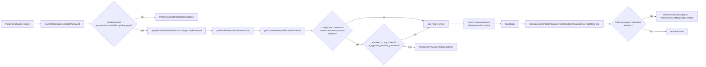

Apache Fineract enforces password rules at three independent layers — a per-tenant regex-based **validation policy**, a global **reuse-history** restriction, and a global **force-reset** schedule. All three live in tenant configuration tables and are surfaced through `PasswordPreferencesApiResource` and a small set of global-configuration knobs. This page documents the entities, the REST endpoints, and exactly where each policy is enforced in `AppUserWritePlatformServiceJpaRepositoryImpl` and `SpringSecurityPlatformSecurityContext`.

## Three layers of policy



The three layers are independent toggles; you can enforce complexity without history checking, for example, or both without forced renewal.

## Validation policies (`m_password_validation_policy`)

### Entity

Source: `fineract-provider/src/main/java/org/apache/fineract/useradministration/domain/PasswordValidationPolicy.java`.

```java
@Entity
@Table(name = "m_password_validation_policy")
public class PasswordValidationPolicy extends AbstractPersistableCustom<Long> {
    @Column(name = "regex", nullable = false)       private String regex;
    @Column(name = "description", nullable = false) private String description;
    @Column(name = "active", nullable = false)      private boolean active;

    public Map<String, Object> activate() {
        final Map<String, Object> actualChanges = new LinkedHashMap<>(1);
        if (!this.active) { actualChanges.put("active", true); this.active = true; }
        return actualChanges;
    }
    public void deActivate() { this.active = false; }
}
```

The repository, `PasswordValidationPolicyRepository`, exposes `findActivePasswordValidationPolicy()` — there is exactly one active row per tenant.

### Pre-installed policies

Liquibase seeds three rows.

| `key` | Regex | Description |
| ----- | ----- | ----------- |
| `simple` (default in fresh installs older than v0.152) | `^.{1,50}$` | "Password most be at least 1 character and not more that 50 characters long" |
| `secure` | `^(?=.*\d)(?=.*[a-z])(?=.*[A-Z])(?!.*\s).{6,50}$` | At least 6 chars, upper + lower + digit, no whitespace |
| `strong` (default after `0152_update_password_validation_policy.xml`) | `^(?!.*(.)\1)(?!.*\s)(?=.*\d)(?=.*[a-z])(?=.*[A-Z])(?=.*[^\w\s]).{12,50}$` | 12–50 chars, upper + lower + digit + special, no whitespace, no consecutive repeating characters |

The activation change-set in `0152_update_password_validation_policy.xml` flips `simple` to inactive and `strong` to active, but only if no admin has explicitly chosen another value:

```xml
<update tableName="m_password_validation_policy">
    <column name="active" valueBoolean="false"/>
    <where>key = 'simple' AND active = TRUE</where>
</update>
<update tableName="m_password_validation_policy">
    <column name="active" valueBoolean="true"/>
    <where>key = 'strong' AND active = FALSE</where>
</update>
```

There is **no API to create new policies** — only to switch which existing one is active. The Liquibase migrations are the way to extend the catalogue.

## REST surface — `/v1/passwordpreferences`

Source: `fineract-provider/.../useradministration/api/PasswordPreferencesApiResource.java`. The path comes from `PasswordPreferencesApiConstants`:

```java
// fineract-core/.../useradministration/api/PasswordPreferencesApiConstants.java
public static final String RESOURCE_NAME = "passwordpreferences";
public static final String ENTITY_NAME = "PASSWORD_PREFERENCES";
public static final String VALIDATION_POLICY_ID = "validationPolicyId";
```

| Method | Path | Permission | Behaviour |
| ------ | ---- | ---------- | --------- |
| `GET`  | `/v1/passwordpreferences` | `READ_PASSWORD_PREFERENCES` | Return the currently active policy |
| `GET`  | `/v1/passwordpreferences/template` | `READ_PASSWORD_PREFERENCES` | List **all** available policies, with `selected=true` on the active one |
| `PUT`  | `/v1/passwordpreferences` | `UPDATE_PASSWORD_PREFERENCES` | Change the active policy by id |

```java
@Path("/v1/" + PasswordPreferencesApiConstants.RESOURCE_NAME)
public class PasswordPreferencesApiResource {
    @GET
    public String retrieve(@Context final UriInfo uriInfo) {
        this.context.authenticatedUser().validateHasReadPermission(PasswordPreferencesApiConstants.ENTITY_NAME);
        final PasswordValidationPolicyData passwordValidationPolicyData =
            this.passwordValidationPolicyReadPlatformService.retrieveActiveValidationPolicy();
        // …
        return this.toApiJsonSerializer.serialize(settings, passwordValidationPolicyData,
            PasswordPreferencesApiConstants.RESPONSE_DATA_PARAMETERS);
    }

    @PUT
    public String update(@Parameter(hidden = true) final String apiRequestBodyAsJson) {
        final CommandWrapper commandRequest = new CommandWrapperBuilder()
            .updatePasswordPreferences().withJson(apiRequestBodyAsJson).build();
        final CommandProcessingResult result = this.commandsSourceWritePlatformService.logCommandSource(commandRequest);
        return this.toApiJsonSerializer.serialize(result);
    }
}
```

### PUT request body

```json
{ "validationPolicyId": 3 }
```

`PasswordPreferencesDataValidator` (`fineract-provider/.../useradministration/data/`) checks that the field is present and a positive integer:

```java
private static final Set<String> REQUEST_DATA_PARAMETERS =
    new HashSet<>(Arrays.asList(PasswordPreferencesApiConstants.VALIDATION_POLICY_ID));

public void validateForUpdate(final String json) {
    // …
    baseDataValidator.reset()
        .parameter(PasswordPreferencesApiConstants.VALIDATION_POLICY_ID)
        .value(repaymentRescheduleType).notNull().integerGreaterThanZero();
    // …
}
```

### Command handler and write service

`UpdatePasswordPreferencesCommandHandler` (`@CommandType(entity = "PASSWORD_PREFERENCES", action = "UPDATE")`) routes to `PasswordPreferencesWritePlatformServiceJpaRepositoryImpl#updatePreferences`:

```java
@Transactional @Override
public CommandProcessingResult updatePreferences(final JsonCommand command) {
    this.dataValidator.validateForUpdate(command.json());
    Long validationPolicyId = command.longValueOfParameterNamed(PasswordPreferencesApiConstants.VALIDATION_POLICY_ID);
    final List<PasswordValidationPolicy> validationPolicies = this.validationRepository.findAll();
    Map<String, Object> changes = new HashMap<>(1);
    boolean found = false;

    for (PasswordValidationPolicy policy : validationPolicies) {
        if (policy.getId().equals(validationPolicyId)) {
            found = true;
            if (!policy.isActive()) {
                changes = policy.activate();
            }
        } else if (policy.isActive() && !policy.getId().equals(validationPolicyId)) {
            policy.deActivate();
        }
    }
    if (!found) { throw new PasswordValidationPolicyNotFoundException(validationPolicyId); }
    if (!changes.isEmpty()) {
        this.validationRepository.saveAll(validationPolicies);
        this.validationRepository.flush();
    }
    // … return CommandProcessingResult
}
```

Switching policies is a single transaction that deactivates every other row and activates the chosen one.

## Where complexity is enforced

`UserDataValidator` (`fineract-provider/.../useradministration/service/`) is the single choke point for password complexity. It's invoked from create, update, and password-change validation paths:

```java
private void validatePassword(DataValidatorBuilder baseDataValidator, JsonElement element) {
    final String password = this.fromApiJsonHelper.extractStringNamed(PASSWORD, element);
    final String repeatPassword = this.fromApiJsonHelper.extractStringNamed(REPEAT_PASSWORD, element);

    final PasswordValidationPolicy validationPolicy =
        this.passwordValidationPolicy.findActivePasswordValidationPolicy();
    final String regex = validationPolicy.getRegex();
    final String description = validationPolicy.getDescription();
    DataValidatorBuilder validator = baseDataValidator.reset().parameter(PASSWORD).value(password)
        .matchesRegularExpression(regex, description);
    if (StringUtils.isNotBlank(password)) {
        validator.equalToParameter(REPEAT_PASSWORD, repeatPassword);
    }
}
```

The `description` is the human-readable error message that ships back to the client when the regex check fails — that is why the seeded `description` columns read like full sentences.

### Where the validator is wired

`validatePassword` is called in three places inside `UserDataValidator`:

- `validateForCreate(...)` — `POST /v1/users`
- `validateForUpdate(...)` — `PUT /v1/users/{userId}` (when the password field is present)
- `validateForChangePassword(...)` — `PUT /v1/users/{userId}` with `command=changeUserPassword`

The change-password endpoint goes through `ChangeUserPasswordCommandHandler` (`@CommandType(entity = "USER", action = "CHANGEPWD")`), so even password rotations driven by the user themselves run through the active validation policy.

## Password history (`m_appuser_previous_password`)

### Entity

Source: `fineract-provider/.../useradministration/domain/AppUserPreviousPassword.java`.

```java
@Entity
@Table(name = "m_appuser_previous_password")
public class AppUserPreviousPassword extends AbstractPersistableCustom<Long> {
    @Column(name = "user_id", nullable = false)   private Long userId;
    @Column(name = "removal_date")                private LocalDate removalDate;
    @Column(name = "password", nullable = false)  private String password;

    public AppUserPreviousPassword(final AppUser user) {
        this.userId = user.getId();
        this.password = user.getPassword().trim();
        this.removalDate = DateUtils.getLocalDateOfTenant();
    }
}
```

A row is created **on every password change**, capturing the just-replaced hash and stamping the date.

### Global toggle

The toggle lives in the `c_configuration` table and is named **`password-reuse-check-history-count`**. It is seeded by `0210_add_configuration_password_reuse_check_history_count.xml`:

```xml
<insert tableName="c_configuration">
    <column name="name" value="password-reuse-check-history-count"/>
    <column name="value" valueNumeric="3"/>
    <column name="enabled" valueBoolean="false"/>
    <column name="description" value="When enabled, prevents password reuse. The value specifies how many previous passwords to check (e.g., 3 = last 3 passwords). Set to 0 to check ALL previous passwords. Disable this setting to allow password reuse."/>
</insert>
```

Default value `3`, disabled. The accessor lives on `ConfigurationDomainService`:

```java
Integer getPasswordReuseRestrictionCount();
```

…and `getPasswordReuseRestrictionCount()` returns `null` when the row is disabled, in which case the history check is skipped entirely.

### Enforcement

Source: `fineract-provider/.../useradministration/service/AppUserWritePlatformServiceJpaRepositoryImpl.java`:

```java
private AppUserPreviousPassword getCurrentPasswordToSaveAsPreview(final AppUser user, final JsonCommand command) {
    final String passWordEncodedValue = user.getEncodedPassword(command, this.platformPasswordEncoder);
    AppUserPreviousPassword currentPasswordToSaveAsPreview = null;

    if (passWordEncodedValue != null) {
        final Integer passwordReuseRestrictionCount =
            this.configurationDomainService.getPasswordReuseRestrictionCount();
        if (passwordReuseRestrictionCount != null) {
            List<AppUserPreviousPassword> previousPasswords;
            if (passwordReuseRestrictionCount == 0) {
                previousPasswords = this.appUserPreviewPasswordRepository.findByUserId(user.getId(),
                    PageRequest.of(0, Integer.MAX_VALUE, Sort.Direction.DESC, "removalDate"));
            } else {
                PageRequest pageRequest = PageRequest.of(0, passwordReuseRestrictionCount,
                    Sort.Direction.DESC, "removalDate");
                previousPasswords = this.appUserPreviewPasswordRepository.findByUserId(user.getId(), pageRequest);
            }
            for (AppUserPreviousPassword aPreviewPassword : previousPasswords) {
                if (aPreviewPassword.getPassword().equals(passWordEncodedValue)) {
                    throw new PasswordPreviouslyUsedException();
                }
            }
        }
        currentPasswordToSaveAsPreview = new AppUserPreviousPassword(user);
    }
    return currentPasswordToSaveAsPreview;
}
```

Two important details:

- The check compares **hashes** (`platformPasswordEncoder`-encoded values), so a bcrypt salt does not let the same password slip past — `AppUser.getEncodedPassword` deliberately uses the salt embedded in the existing hash for the comparison.
- `0` is the "check all history" sentinel; any positive `N` limits the check to the most recent `N` rows by `removal_date`.

The same call also returns a fresh `AppUserPreviousPassword` row that gets persisted as part of the same transaction, building the history one entry at a time.

### Failure

`PasswordPreviouslyUsedException` lives in `fineract-provider/.../useradministration/exception/`. It is mapped to a standard `error.msg.password.previously.used` Fineract error response.

`PasswordMustBeDifferentException` is thrown earlier when the encoded value equals the current `m_appuser.password` (catches the trivial "change to my current password" case).

## Forced renewal

Two configuration keys collaborate to enforce time-based rotation; both live in `c_configuration`:

| Key | Default value | Default enabled | Purpose |
| --- | ------------- | --------------- | ------- |
| `force-password-reset-days` | `0` | `false` | When > 0 and enabled, passwords older than N days must be changed |

Both are read through `ConfigurationDomainService`:

```java
boolean isPasswordForcedResetEnable();
Long    retrievePasswordLiveTime();
```

`SpringSecurityPlatformSecurityContext.doesPasswordHasToBeRenewed` (`fineract-security/.../infrastructure/security/service/`) is the single enforcement point:

```java
public boolean doesPasswordHasToBeRenewed(AppUser currentUser) {
    if (currentUser.isPasswordResetRequired()) {
        return true;
    }
    if (this.configurationDomainService.isPasswordForcedResetEnable()
            && !currentUser.getPasswordNeverExpires()) {
        Long passwordDurationDays = this.configurationDomainService.retrievePasswordLiveTime();
        final LocalDate passWordLastUpdateDate = currentUser.getLastTimePasswordUpdated();
        final LocalDate passwordExpirationDate = passWordLastUpdateDate.plusDays(passwordDurationDays);
        if (DateUtils.isBeforeTenantDate(passwordExpirationDate)) {
            return true;
        }
    }
    return false;
}
```

Three escape hatches keep the rule from being too rigid:

1. **`m_appuser.password_never_expires`** — a per-user flag set via `PUT /v1/users/{id}`. Service accounts get this.
2. **`m_appuser.firstTimeLoginRemaining` (`isPasswordResetRequired`)** — newly-created users (and password-reset recipients) carry an explicit "must renew" flag that bypasses the date math.
3. **Forced reset disabled** — when `c_configuration.enabled = false`, the date check is skipped regardless of `value`.

`AuthenticationApiResource` calls `doesPasswordHasToBeRenewed` immediately after a successful credential check and throws `PasswordResetRequiredException` (mapped by `PasswordResetRequiredExceptionMapper` to HTTP 403) so the client can divert the user into a password-change UI before any other API call:

```java
// fineract-security/.../infrastructure/security/api/AuthenticationApiResource.java
if (this.springSecurityPlatformSecurityContext.doesPasswordHasToBeRenewed(principal)) {
    authenticatedUserData = new AuthenticatedUserData()
        // …
        .setShouldRenewPassword(true).setTwoFactorAuthenticationRequired(isTwoFactorRequired);
    throw new PasswordResetRequiredException(authenticatedUserData);
}
```

The same check is also performed deep inside `authenticatedUser()` so direct API calls (e.g. a JWT user who skipped `/authentication`) get the same 403:

```java
@Override
public AppUser authenticatedUser() {
    // …
    if (this.doesPasswordHasToBeRenewed(currentUser)) {
        throw new ResetPasswordException(currentUser.getId());
    }
    return currentUser;
}
```

`ResetPasswordException` propagates up to the same `PasswordResetRequiredExceptionMapper`.

## Configuration recipes

<AccordionGroup>
  <Accordion title="Enforce strong complexity">
    1. `GET /v1/passwordpreferences/template` to find the `id` of the `strong` policy.
    2. `PUT /v1/passwordpreferences` with `{ "validationPolicyId": <id> }`.
    The active policy switches immediately; existing users are unaffected until their next password change.
  </Accordion>
  <Accordion title="Block reuse of the last 5 passwords">
    1. Update `c_configuration.name='password-reuse-check-history-count'` so that `value=5` and `enabled=true` (use `PUT /v1/configurations/{id}` against the `Global Configuration` API).
    2. On the next password change, `AppUserWritePlatformServiceJpaRepositoryImpl` will run the history check; failures surface as `error.msg.password.previously.used`.
  </Accordion>
  <Accordion title="Force renewal every 90 days">
    1. Update `c_configuration.name='force-password-reset-days'` to `value=90` and `enabled=true`.
    2. Whitelist service accounts by setting `m_appuser.password_never_expires=true` (via `PUT /v1/users/{id}` with `passwordNeverExpires: true`).
    3. From day 91 after the last password update, `/v1/authentication` returns 403 + `shouldRenewPassword: true` and other endpoints throw `ResetPasswordException`.
  </Accordion>
  <Accordion title="Operate without policy enforcement">
    Switch the active policy to `simple` (`^.{1,50}$`), set `password-reuse-check-history-count.enabled=false`, and `force-password-reset-days.enabled=false`. Note that this is **not** recommended for production — it exists primarily for local development.
  </Accordion>
</AccordionGroup>

## Exception catalogue

| Exception | File | When |
| --------- | ---- | ---- |
| `PasswordValidationPolicyNotFoundException` | `fineract-provider/.../useradministration/exception/` | `PUT /v1/passwordpreferences` with an unknown id |
| `PasswordMustBeDifferentException` | `fineract-provider/.../useradministration/exception/` | New password equals current `m_appuser.password` |
| `PasswordPreviouslyUsedException` | `fineract-provider/.../useradministration/exception/` | New password matches a recent `m_appuser_previous_password.password` |
| `ResetPasswordException` | `fineract-security/.../infrastructure/security/exception/` | Time-based renewal triggered inside `authenticatedUser()` |
| `PasswordResetRequiredException` | `fineract-security/.../infrastructure/security/exception/` | Time-based renewal triggered inside `/v1/authentication` |
| `ForcePasswordResetException` | `fineract-security/.../infrastructure/security/exception/` | Lower-level helper used by `SpringSecurityPlatformSecurityContext` |

## File map

| Topic | File |
| ----- | ---- |
| Endpoint definition | `fineract-provider/.../useradministration/api/PasswordPreferencesApiResource.java` |
| Constants | `fineract-core/.../useradministration/api/PasswordPreferencesApiConstants.java` |
| Validator | `fineract-provider/.../useradministration/data/PasswordPreferencesDataValidator.java` |
| Read service | `fineract-provider/.../useradministration/service/PasswordValidationPolicyReadPlatformServiceImpl.java` |
| Write service | `fineract-provider/.../useradministration/service/PasswordPreferencesWritePlatformServiceJpaRepositoryImpl.java` |
| Command handler | `fineract-provider/.../useradministration/handler/UpdatePasswordPreferencesCommandHandler.java` |
| Domain entity | `fineract-provider/.../useradministration/domain/PasswordValidationPolicy.java` |
| Repository | `fineract-provider/.../useradministration/domain/PasswordValidationPolicyRepository.java` |
| Complexity enforcement | `fineract-provider/.../useradministration/service/UserDataValidator.java` (`validatePassword`) |
| History enforcement | `fineract-provider/.../useradministration/service/AppUserWritePlatformServiceJpaRepositoryImpl.java` (`getCurrentPasswordToSaveAsPreview`) |
| History entity | `fineract-provider/.../useradministration/domain/AppUserPreviousPassword.java` |
| Forced-renewal check | `fineract-security/.../infrastructure/security/service/SpringSecurityPlatformSecurityContext.java` (`doesPasswordHasToBeRenewed`) |
| Liquibase — initial policies | `fineract-provider/src/main/resources/db/changelog/tenant/parts/0002_initial_data.xml` |
| Liquibase — strong policy upgrade | `fineract-provider/src/main/resources/db/changelog/tenant/parts/0152_update_password_validation_policy.xml` |
| Liquibase — reuse-check config | `fineract-provider/src/main/resources/db/changelog/tenant/parts/0210_add_configuration_password_reuse_check_history_count.xml` |
