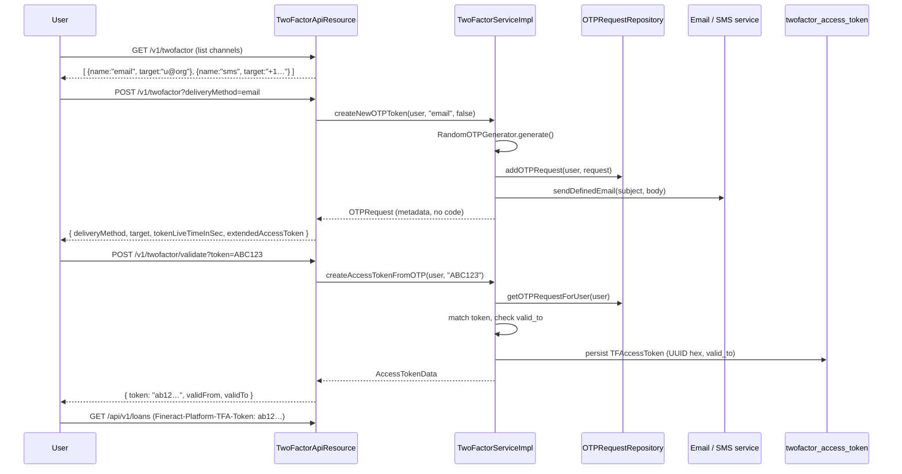

Apache Fineract layers an optional second-factor over either the Basic or OAuth2 authentication chain. When `fineract.security.2fa.enabled=true`, a stateful **access token** must accompany every API call to `/api/**`, granted only after the user proves possession of an OTP delivered by SMS or email. This page covers the runtime classes, configuration keys, OTP-issuance flow, and the integration test that exercises the whole path with GreenMail.

## Feature flag and chain wiring

```properties
# fineract-provider/src/main/resources/application.properties
fineract.security.2fa.enabled=${FINERACT_SECURITY_2FA_ENABLED:false}
```

Both the Basic chain (`SecurityConfig`) and the OAuth2 chain (`AuthorizationServerConfig`) test this flag and, when true, add a `TwoFactorAuthenticationFilter` plus a `hasAuthority("TWOFACTOR_AUTHENTICATED")` constraint on the catch‑all route:

```java
// fineract-provider/.../infrastructure/core/config/SecurityConfig.java
if (fineractProperties.getSecurity().getTwoFactor().isEnabled()) {
    authorizationManagers.add(hasAuthority("TWOFACTOR_AUTHENTICATED"));
}
// …
if (fineractProperties.getSecurity().getTwoFactor().isEnabled()) {
    http.addFilterAfter(twoFactorAuthenticationFilter(), CorrelationHeaderFilter.class);
}
```

The bean is built with the prototype `TwoFactorService` fetched from the application context:

```java
public TwoFactorAuthenticationFilter twoFactorAuthenticationFilter() {
    TwoFactorService twoFactorService = applicationContext.getBean(TwoFactorService.class);
    return new TwoFactorAuthenticationFilter(twoFactorService);
}
```

`TwoFactorService` itself is `@ConditionalOnProperty("fineract.security.2fa.enabled")`, so the bean only exists when 2FA is on:

```java
// fineract-provider/.../infrastructure/security/service/TwoFactorServiceImpl.java
@Service
@ConditionalOnProperty("fineract.security.2fa.enabled")
public class TwoFactorServiceImpl implements TwoFactorService { … }
```

The same flag also gates the API resources (`TwoFactorApiResource`, `TwoFactorConfigurationApiResource`) and the `TwoFactorConfigurationServiceImpl`.

## Classes and packages

All 2FA code lives under `fineract-security/.../infrastructure/security/`, with implementations in `fineract-provider/.../infrastructure/security/service/`.

| Layer | Class | Responsibility |
| ----- | ----- | -------------- |
| Filter | `filter/TwoFactorAuthenticationFilter` | Reads `Fineract-Platform-TFA-Token` header; grants `TWOFACTOR_AUTHENTICATED` or 401s |
| API | `api/TwoFactorApiResource` | `GET /twofactor`, `POST /twofactor?deliveryMethod=…`, `POST /twofactor/validate?token=…`, `POST /twofactor/invalidate` |
| API | `api/TwoFactorConfigurationApiResource` | `GET /twofactor/configure`, `PUT /twofactor/configure` |
| Service | `service/TwoFactorService` | Generates OTPs, exchanges them for access tokens, validates/invalidates |
| Service | `service/TwoFactorConfigurationService` | Reads/updates `twofactor_configuration` rows; renders Mustache email/SMS templates |
| Service | `service/AccessTokenGenerationService` + `UUIDAccessTokenGenerationService` | UUID-hex token generator |
| Service | `service/RandomOTPGenerator` | `SecureRandom`-backed alphanumeric OTP generator |
| Domain | `domain/TFAccessToken` | JPA entity `twofactor_access_token` |
| Domain | `domain/TwoFactorConfiguration` | JPA entity `twofactor_configuration` (key/value rows) |
| Domain | `domain/OTPRequestRepository` | In-memory store of issued OTP tokens (per user) |
| Data | `data/OTPRequest`, `data/OTPMetadata`, `data/OTPDeliveryMethod`, `data/AccessTokenData` | DTOs |
| Constants | `constants/TwoFactorConstants` | `BYPASS_TWOFACTOR`, `sms`, `email`, `TWOFACTOR_ACCESSTOKEN` |
| Constants | `constants/TwoFactorConfigurationConstants` | Configuration keys and parameter-type classification |
| Command handlers | `command/UpdateTwoFactorConfigCommandHandler`, `command/InvalidateTFAccessTokenCommandHandler` | Wrap config update / access-token invalidation as `CommandWrapper`s |
| Exceptions | `exception/AccessTokenInvalidIException`, `exception/OTPTokenInvalidException`, `exception/OTPDeliveryMethodInvalidException` | Standard error responses |

## The filter

`TwoFactorAuthenticationFilter` (`fineract-security/.../infrastructure/security/filter/TwoFactorAuthenticationFilter.java`) is intentionally compact:

```java
public void doFilter(ServletRequest req, ServletResponse res, FilterChain chain) {
    final HttpServletRequest request = (HttpServletRequest) req;
    final HttpServletResponse response = (HttpServletResponse) res;

    SecurityContext context = SecurityContextHolder.getContext();
    Authentication authentication = context != null ? context.getAuthentication() : null;

    if (authentication != null && authentication.isAuthenticated()
            && authentication.getPrincipal() instanceof AppUser) {
        AppUser user = (AppUser) authentication.getPrincipal();
        if (!user.hasSpecificPermissionTo(TwoFactorConstants.BYPASS_TWO_FACTOR_PERMISSION)) {
            String token = request.getHeader("Fineract-Platform-TFA-Token");
            if (token != null) {
                TFAccessToken accessToken = twoFactorService.fetchAccessTokenForUser(user, token);
                if (accessToken == null || !accessToken.isValid()) {
                    response.addHeader("WWW-Authenticate", "Basic realm=\"Fineract Platform API Two Factor\"");
                    response.sendError(HttpServletResponse.SC_UNAUTHORIZED, "Invalid two-factor access token provided");
                    return;
                }
            } else {
                chain.doFilter(req, res); // No TFA header → fall through; authorization layer will reject
                return;
            }
        }
        List<GrantedAuthority> updatedAuthorities = new ArrayList<>(authentication.getAuthorities());
        updatedAuthorities.add(new SimpleGrantedAuthority("TWOFACTOR_AUTHENTICATED"));
        context.setAuthentication(createUpdatedAuthentication(authentication, updatedAuthorities));
    }
    chain.doFilter(req, res);
}
```

Three things to notice:

1. **Bypass permission**: users whose roles include `BYPASS_TWOFACTOR` are granted `TWOFACTOR_AUTHENTICATED` immediately. This is how service accounts and the bootstrap admin keep working when 2FA is enabled tenant-wide.
2. **Header-driven**: the token is read from `Fineract-Platform-TFA-Token`. There is no cookie or query‑string fallback.
3. **Authentication wrapping**: the filter rebuilds the current `Authentication` to carry the extra authority. It handles both `UsernamePasswordAuthenticationToken` (Basic chain) and `FineractJwtAuthenticationToken` (OAuth2 chain):

```java
private Authentication createUpdatedAuthentication(final Authentication currentAuthentication,
        final List<GrantedAuthority> updatedAuthorities) throws ServletException {
    if (currentAuthentication instanceof UsernamePasswordAuthenticationToken) {
        return new UsernamePasswordAuthenticationToken(
            currentAuthentication.getPrincipal(),
            currentAuthentication.getCredentials(), updatedAuthorities);
    } else if (currentAuthentication instanceof FineractJwtAuthenticationToken) {
        FineractJwtAuthenticationToken jwt = (FineractJwtAuthenticationToken) currentAuthentication;
        return new FineractJwtAuthenticationToken(jwt.getToken(), updatedAuthorities,
            (UserDetails) currentAuthentication.getPrincipal());
    }
    throw new ServletException("Unknown authentication type: " + currentAuthentication.getClass().getName());
}
```

That is exactly why `SecurityConfig` retains credentials with `setEraseCredentialsAfterAuthentication(false)`.

## REST surface

### `TwoFactorApiResource`

Path: `/v1/twofactor`. Source: `fineract-security/.../infrastructure/security/api/TwoFactorApiResource.java`.

| Method | Path | Description |
| ------ | ---- | ----------- |
| `GET`  | `/v1/twofactor` | List the OTP delivery methods available to the current user (SMS + email if configured) |
| `POST` | `/v1/twofactor?deliveryMethod=email&extendedToken=false` | Issue a new OTP token; sends OTP via the chosen channel and returns OTP metadata (not the OTP itself) |
| `POST` | `/v1/twofactor/validate?token=ABC123` | Exchange the OTP for a `TFAccessToken` (returned as `AccessTokenData`) |
| `POST` | `/v1/twofactor/invalidate` | Revoke a previously‑issued access token |

The validate endpoint is allowed by the URL rules under `/twofactor/**` so the user can hit it _before_ holding the `TWOFACTOR_AUTHENTICATED` authority:

```java
// SecurityConfig.java
.requestMatchers(API_MATCHER.matcher(HttpMethod.POST, "/api/*/twofactor/validate")).fullyAuthenticated()
.requestMatchers(API_MATCHER.matcher("/api/*/twofactor")).fullyAuthenticated()
```

### `TwoFactorConfigurationApiResource`

Path: `/v1/twofactor/configure`. Source: `fineract-security/.../infrastructure/security/api/TwoFactorConfigurationApiResource.java`.

```java
private static final String RESOURCE_NAME_FOR_PERMISSIONS = "TWOFACTOR_CONFIG";

@GET
public String retrieveAll() {
    this.context.authenticatedUser().validateHasReadPermission(RESOURCE_NAME_FOR_PERMISSIONS);
    Map<String, Object> configurationMap = configurationService.retrieveAll();
    return toApiJsonSerializer.serialize(configurationMap);
}

@PUT
@Consumes({ MediaType.APPLICATION_JSON })
public String updateConfiguration(final String apiRequestBodyAsJson) {
    final CommandWrapper commandRequest = new CommandWrapperBuilder()
        .updateTwoFactorConfiguration().withJson(apiRequestBodyAsJson).build();
    return this.toApiJsonSerializer.serialize(
        this.commandsSourceWritePlatformService.logCommandSource(commandRequest));
}
```

The update PUT goes through the command‑source pipeline and is routed to `UpdateTwoFactorConfigCommandHandler`, ultimately calling `TwoFactorConfigurationServiceImpl.update(JsonCommand)`. Read access requires `READ_TWOFACTOR_CONFIG`; updates require `UPDATE_TWOFACTOR_CONFIG`.

## Configuration keys

`TwoFactorConfigurationConstants` (`fineract-security/.../infrastructure/security/constants/`) defines the schema for the `m_two_factor_configuration` table:

```java
public static final String RESOURCE_NAME = "TWOFACTOR_CONFIGURATION";

public static final String ENABLE_EMAIL_DELIVERY = "otp-delivery-email-enable";
public static final String EMAIL_SUBJECT          = "otp-delivery-email-subject";
public static final String EMAIL_BODY             = "otp-delivery-email-body";

public static final String ENABLE_SMS_DELIVERY   = "otp-delivery-sms-enable";
public static final String SMS_PROVIDER_ID       = "otp-delivery-sms-provider";
public static final String SMS_MESSAGE_TEXT      = "otp-delivery-sms-text";

public static final String OTP_TOKEN_LIVE_TIME   = "otp-token-live-time";
public static final String OTP_TOKEN_LENGTH      = "otp-token-length";

public static final String ACCESS_TOKEN_LIVE_TIME          = "access-token-live-time";
public static final String ACCESS_TOKEN_LIVE_TIME_EXTENDED = "access-token-live-time-extended";
```

The constants classify each key by type so the validator can coerce values correctly:

| Key | Type | Default behaviour |
| --- | ---- | ----------------- |
| `otp-delivery-email-enable` | boolean | Set true to allow email-OTP requests |
| `otp-delivery-email-subject` | string | Mustache template (`Hello {username}.`); defaults to `Fineract Two-Factor Authentication Token` |
| `otp-delivery-email-body` | string | Mustache template; defaults to `Hello {username}.\nYour OTP login token is {token}.` |
| `otp-delivery-sms-enable` | boolean | Set true to allow SMS-OTP requests |
| `otp-delivery-sms-provider` | number | SMS gateway provider id (`m_sms_provider`) |
| `otp-delivery-sms-text` | string | Mustache template; defaults to `Your authentication token for Fineract is {token}.` |
| `otp-token-live-time` | number | OTP code TTL in seconds |
| `otp-token-length` | number | OTP code length (used by `RandomOTPGenerator`) |
| `access-token-live-time` | number | Standard access-token TTL in seconds |
| `access-token-live-time-extended` | number | Extended (`?extendedToken=true`) access-token TTL |

`TwoFactorConfiguration.getObjectValue()` returns the typed value:

```java
public Object getObjectValue() {
    if (TwoFactorConfigurationConstants.NUMBER_PARAMETERS.contains(name)) {
        return NumberUtils.createInteger(value);
    }
    if (TwoFactorConfigurationConstants.BOOLEAN_PARAMETERS.contains(name)) {
        return BooleanUtils.toBooleanObject(value);
    }
    return getValue();
}
```

`TwoFactorConfigurationServiceImpl.retrieveAll()` is cached per tenant (`@Cacheable(value = "tfConfig", …)`), evicted on every successful update.

## Domain entities

### `TFAccessToken`

```java
@Entity
@Table(name = "twofactor_access_token", uniqueConstraints = {
    @UniqueConstraint(columnNames = { "token", "appuser_id" }, name = "token_appuser_UNIQUE") })
public class TFAccessToken extends AbstractPersistableCustom<Long> {
    @Column(name = "token", nullable = false, length = 32) private String token;
    @ManyToOne @JoinColumn(name = "appuser_id", nullable = false) private AppUser user;
    @Column(name = "valid_from", nullable = false)  private LocalDateTime validFrom;
    @Column(name = "valid_to", nullable = false)    private LocalDateTime validTo;
    @Column(name = "enabled", nullable = false)     private boolean enabled;

    public static TFAccessToken create(String token, AppUser user, int tokenLiveTimeInSec) {
        LocalDateTime validFrom = DateUtils.getLocalDateTimeOfTenant();
        return new TFAccessToken().setToken(token).setUser(user).setValidFrom(validFrom)
            .setValidTo(validFrom.plusSeconds(tokenLiveTimeInSec)).setEnabled(true);
    }

    public boolean isValid() {
        return this.enabled
            && !DateUtils.isAfterTenantDateTime(getValidFrom())
            && DateUtils.isAfterTenantDateTime(getValidTo());
    }
}
```

The 32‑char UUID‑hex tokens are produced by `UUIDAccessTokenGenerationService`:

```java
@Service
public class UUIDAccessTokenGenerationService implements AccessTokenGenerationService {
    @Override public String generateRandomToken() {
        return UUID.randomUUID().toString().replaceAll("-", "");
    }
}
```

### `RandomOTPGenerator`

```java
private static final String allowedCharacters = "0123456789ABCDEFGHIJKLMNOPQRSTUVQXYZ";
public String generate() {
    StringBuilder builder = new StringBuilder();
    for (int i = 0; i < tokenLength; i++) {
        builder.append(allowedCharacters.charAt(
            (int) (secureRandom.nextDouble() * allowedCharacters.length())));
    }
    return builder.toString();
}
```

`secureRandom` is a `java.security.SecureRandom`; the token length comes from configuration key `otp-token-length`.

## OTP lifecycle



`TwoFactorServiceImpl#createNewOTPToken` chooses between SMS and email:

```java
if (TwoFactorConstants.SMS_DELIVERY_METHOD_NAME.equalsIgnoreCase(deliveryMethodName)) {
    final OTPRequest request = generateNewToken(smsDelivery, extendedAccessToken);
    final String smsText = configurationService.getFormattedSmsTextFor(user, request);
    SmsMessage smsMessage = SmsMessage.pendingSms(null, null, null, user.getStaff(),
        smsText, user.getStaff().getMobileNo(), null, false);
    this.smsMessageRepository.save(smsMessage);
    smsMessageScheduledJobService.sendTriggeredMessage(Collections.singleton(smsMessage),
        configurationService.getSMSProviderId());
    otpRequestRepository.addOTPRequest(user, request);
    return request;
}
```

Notice the SMS path requires `user.getStaff()` to exist and have a `mobileNo`; otherwise `OTPDeliveryMethodInvalidException` is thrown. Email delivery uses `PlatformEmailService.sendDefinedEmail` with templates rendered by Mustache (`TwoFactorConfigurationServiceImpl.getFormattedEmailBodyFor`).

`createAccessTokenFromOTP` enforces single-use semantics by deleting the pending OTP request and persisting the token in `twofactor_access_token`:

```java
OTPRequest otpRequest = otpRequestRepository.getOTPRequestForUser(user);
if (otpRequest == null || !otpRequest.isValid() || !otpRequest.getToken().equalsIgnoreCase(otpToken)) {
    throw new OTPTokenInvalidException();
}
otpRequestRepository.deleteOTPRequestForUser(user);

int liveTime = otpRequest.getMetadata().isExtendedAccessToken()
    ? configurationService.getAccessTokenExtendedLiveTime()
    : configurationService.getAccessTokenLiveTime();
TFAccessToken accessToken = TFAccessToken.create(token, user, liveTime);
tfAccessTokenRepository.save(accessToken);
```

The method is annotated `@CachePut(value = "userTFAccessToken", …)` keyed on tenant + username + token, so subsequent header lookups hit the cache instead of the database.

## Bypass permission

`TwoFactorConstants.BYPASS_TWO_FACTOR_PERMISSION` is the string `"BYPASS_TWOFACTOR"`. Any role granted that permission will:

- Skip the OTP-issuance step entirely.
- Be granted `TWOFACTOR_AUTHENTICATED` by the filter on every request.
- See `twoFactorAuthenticationRequired: false` in the `AuthenticatedUserData` response.

```java
boolean isTwoFactorRequired = this.twoFactorEnabled
    && !principal.hasSpecificPermissionTo(TwoFactorConstants.BYPASS_TWO_FACTOR_PERMISSION);
```

Use `BYPASS_TWOFACTOR` for service accounts and break-glass admins; leave it off for human users you want to step up.

## End-to-end test (`twofactor-tests`)

`twofactor-tests/src/test/java/org/apache/fineract/twofactortests/TwoFactorAuthenticationTest.java` boots Fineract with 2FA enabled, registers a GreenMail SMTP listener, and walks the entire flow:

```java
@RegisterExtension
static GreenMailExtension greenMail = new GreenMailExtension(ServerSetupTest.SMTP)
    .withConfiguration(GreenMailConfiguration.aConfig()
        .withUser("support@cloudmicrofinance.com", "support81"))
    .withPerMethodLifecycle(true);

@BeforeEach
public void setup() throws InterruptedException {
    initializeRestAssured();
    awaitSpringBootActuatorHealthyUp();
    String json = RestAssured.given().contentType(ContentType.JSON)
        .body("{\"username\":\"mifos\", \"password\":\"password\"}")
        .when().post(LOGIN_URL).asString();
    this.basicAuthenticationKey = JsonPath.with(json).get("base64EncodedAuthenticationKey");
    this.requestSpec.header("Authorization", "Basic " + basicAuthenticationKey);
}
```

The test then:

1. `GET /api/v1/loans/1` → **403** (no TFA token).
2. `GET /api/v1/twofactor` → list of delivery methods.
3. `POST /api/v1/twofactor?deliveryMethod=email` → triggers GreenMail to receive the email.
4. Parse the OTP out of the email body via regex.
5. `POST /api/v1/twofactor/validate?token=<OTP>` → returns `AccessTokenData`.
6. `GET /api/v1/loans/1` with `Fineract-Platform-TFA-Token: <token>` → **200**.

This is the canonical reference implementation for clients that need to integrate the 2FA flow.

## Operational checklist

<Steps>
  <Step title="Enable the flag">
    Set `FINERACT_SECURITY_2FA_ENABLED=true` and restart. The `TwoFactorService` bean now exists, and the filter is added to the chain.
  </Step>
  <Step title="Configure delivery">
    `PUT /v1/twofactor/configure` to set `otp-delivery-email-enable=true` and/or `otp-delivery-sms-enable=true`. For SMS, set `otp-delivery-sms-provider` to a valid `m_sms_provider` row id.
  </Step>
  <Step title="Tune timings">
    Pick `otp-token-length` (typically 6) and `otp-token-live-time` (e.g. 300s). Set `access-token-live-time` to a normal session length (e.g. 28800s = 8h) and `access-token-live-time-extended` for "remember this device" use.
  </Step>
  <Step title="Grant or withhold BYPASS_TWOFACTOR">
    Assign `BYPASS_TWOFACTOR` to break-glass admin roles. Remove it from all regular user roles.
  </Step>
  <Step title="Update clients">
    Clients now obtain a token via `/v1/twofactor/*` and send `Fineract-Platform-TFA-Token` on every subsequent request. Without it, every protected route returns 403 because `TWOFACTOR_AUTHENTICATED` is missing.
  </Step>
</Steps>

<Warning>
Email and SMS delivery rely on the platform's existing infrastructure. Email goes through `PlatformEmailService`; SMS goes through `SmsMessageScheduledJobService` and an `m_sms_provider` row. If either subsystem is misconfigured, OTP requests will fail silently from the client's perspective — check `m_sms_message` and the platform's outbound email log.
</Warning>

<Note>
The OTP request store is **in‑memory** (`OTPRequestRepository` keeps a map keyed by user). Restarting the server invalidates pending OTPs; already-issued `TFAccessToken` rows survive in the database because they are persistent JPA entities.
</Note>
