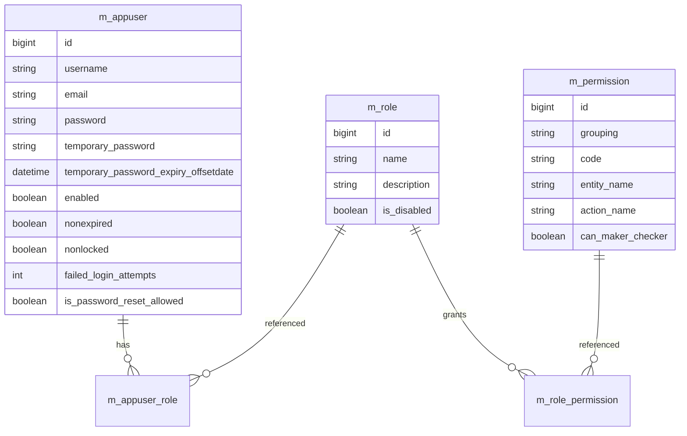
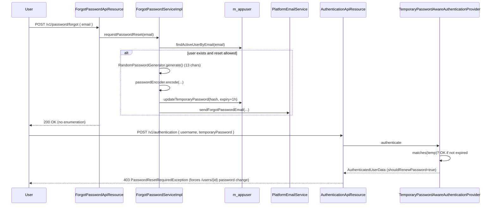

Apache Fineract authorizes every API call against a three-entity model: `AppUser` ⇆ `Role` ⇆ `Permission`. Roles are bundles of permission codes; permissions are pre-installed strings like `READ_LOAN`, `CREATE_LOAN`, `DISBURSE_LOAN`. This page documents the entities, the read/write platform services, the REST resources under `/v1/users`, `/v1/roles`, `/v1/permissions`, the permission-code naming convention, the maker-checker relationship, and the `ForgotPasswordApiResource` flow.

## Entity model



### `AppUser`

Source: `fineract-core/src/main/java/org/apache/fineract/useradministration/domain/AppUser.java`.

```java
@Entity
@Table(name = "m_appuser",
       uniqueConstraints = @UniqueConstraint(columnNames = { "username" }, name = "username_org"))
public class AppUser extends AbstractPersistableCustom<Long> implements PlatformUser {

    @Column(name = "email", nullable = false, length = 100) private String email;
    @Column(name = "username", nullable = false, length = 100) private String username;
    @Column(name = "password", nullable = false) private String password;
    @Column(name = "nonexpired", nullable = false) private boolean accountNonExpired;
    @Column(name = "nonlocked", nullable = false) private boolean accountNonLocked;
    @Column(name = "failed_login_attempts", nullable = false) private int failedLoginAttempts;
    @Column(name = "is_login_retries_enabled", nullable = false) private boolean loginRetryLimitEnabled;
    @Column(name = "nonexpired_credentials", nullable = false) private boolean credentialsNonExpired;
    @Column(name = "enabled", nullable = false) // …

    @ManyToMany(fetch = FetchType.EAGER)
    @JoinTable(name = "m_appuser_role", …)
    private Set<Role> roles;
    @ManyToOne @JoinColumn(name = "office_id", nullable = false) private Office office;
    @ManyToOne @JoinColumn(name = "staff_id") private Staff staff;
}
```

`AppUser` implements Spring Security's `UserDetails` (via the `PlatformUser` interface in `fineract-security`) so it can be returned directly from `TenantAwareJpaPlatformUserDetailsService`. The granted authorities are flattened on demand:

```java
@Override
public Collection<GrantedAuthority> getAuthorities() {
    return populateGrantedAuthorities();
}
private List<GrantedAuthority> populateGrantedAuthorities() {
    final List<GrantedAuthority> grantedAuthorities = new ArrayList<>();
    for (final Role role : this.roles) {
        for (final Permission permission : role.getPermissions()) {
            grantedAuthorities.add(new SimpleGrantedAuthority(permission.getCode()));
        }
    }
    return grantedAuthorities;
}
```

That is what makes the URL rules in `SecurityConfig` (e.g. `hasAnyAuthority("READ_LOAN")`) line up with the `m_permission.code` column.

### `Role`

Source: `fineract-core/.../useradministration/domain/Role.java`.

```java
@Entity
@Table(name = "m_role",
       uniqueConstraints = { @UniqueConstraint(columnNames = { "name" }, name = "unq_name") })
public class Role extends AbstractPersistableCustom<Long> implements Serializable {
    @Column(name = "name", unique = true, nullable = false, length = 100) private String name;
    @Column(name = "description", nullable = false, length = 500) private String description;
    @Column(name = "is_disabled", nullable = false) private Boolean disabled;

    @ManyToMany(fetch = FetchType.EAGER)
    @JoinTable(name = "m_role_permission",
        joinColumns = @JoinColumn(name = "role_id"),
        inverseJoinColumns = @JoinColumn(name = "permission_id"))
    private Set<Permission> permissions = new HashSet<>();
}
```

Roles can be disabled (`is_disabled = true`); a disabled role's permissions are not flattened into the authority list at login.

### `Permission`

Source: `fineract-core/.../useradministration/domain/Permission.java`.

```java
@Entity
@Table(name = "m_permission")
public class Permission extends AbstractPersistableCustom<Long> implements Serializable {
    @Column(name = "grouping", nullable = false, length = 45) private String grouping;
    @Column(name = "code", nullable = false, length = 100) private String code;
    @Column(name = "entity_name", nullable = true, length = 100) private String entityName;
    @Column(name = "action_name", nullable = true, length = 100) private String actionName;
    @Column(name = "can_maker_checker", nullable = false) private boolean canMakerChecker;

    public Permission(final String grouping, final String entityName, final String actionName) {
        this.grouping = grouping;
        this.entityName = entityName;
        this.actionName = actionName;
        this.code = actionName + "_" + entityName; // <-- naming convention
        this.canMakerChecker = false;
    }
}
```

`code` is the deterministic combination `ACTION + "_" + ENTITY`. Permissions are pre-installed by Liquibase; there is no API to create or delete them. The only field that can be updated at runtime is `can_maker_checker`.

## Permission code naming convention

Every Fineract action follows `ACTION_ENTITY` (uppercase). Looking at `0002_initial_data.xml` for a representative cluster:

| `id` | `grouping` | `code` | `entity_name` | `action_name` | `can_maker_checker` |
| ---- | ---------- | ------ | ------------- | ------------- | ------------------- |
| 1  | special   | `ALL_FUNCTIONS`        | _(null)_      | _(null)_ | false |
| 2  | special   | `ALL_FUNCTIONS_READ`   | _(null)_      | _(null)_ | false |
| 3  | special   | `CHECKER_SUPER_USER`   | _(null)_      | _(null)_ | false |
| 103 | portfolio | `READ_LOAN`            | `LOAN`        | `READ`           | false |
| 104 | portfolio | `CREATE_LOAN`          | `LOAN`        | `CREATE`         | false |
| 105 | portfolio | `CREATE_LOAN_CHECKER`  | `LOAN`        | `CREATE_CHECKER` | false |
| 106 | portfolio | `UPDATE_LOAN`          | `LOAN`        | `UPDATE`         | false |
| 107 | portfolio | `UPDATE_LOAN_CHECKER`  | `LOAN`        | `UPDATE_CHECKER` | false |
| 108 | portfolio | `DELETE_LOAN`          | `LOAN`        | `DELETE`         | false |

Loan lifecycle actions get their own verbs (still uppercase, joined to the entity):

| Code | Notes |
| ---- | ----- |
| `APPROVE_LOAN`, `WITHDRAW_LOAN`, `REJECT_LOAN`, `DISBURSE_LOAN`, `REPAYMENT_LOAN` | First-class workflow actions |
| `APPROVEINPAST_LOAN`, `DISBURSEINPAST_LOAN`, `REJECTINPAST_LOAN`, `WITHDRAWINPAST_LOAN`, `REPAYMENTINPAST_LOAN` | Special variants that let an operator backdate the action |
| `BYPASS_LOAN_WRITE_PROTECTION` | Operational override permission |

### Wildcard / super-user codes

| Code | Effect |
| ---- | ------ |
| `ALL_FUNCTIONS` | Grants every permission check on the platform. `AppUser.hasAllFunctionsPermission()` short-circuits the lookup. |
| `ALL_FUNCTIONS_READ` | Grants every `READ_*` permission. |
| `ALL_FUNCTIONS_WRITE` | Grants every non-read mutation (`CREATE_*`, `UPDATE_*`, `DELETE_*`). |
| `CHECKER_SUPER_USER` | Bypasses every `_CHECKER` permission check, so the user can approve any pending maker-checker command. |
| `REPORTING_SUPER_USER` | Bypasses `READ_<reportName>` checks. |
| `BYPASS_TWOFACTOR` | Causes `TwoFactorAuthenticationFilter` to grant `TWOFACTOR_AUTHENTICATED` without an OTP. |

### Resource-level checks

Each Jersey resource class begins endpoint methods with `validateHasReadPermission` / `validateHasCreatePermission` etc. on the authenticated user:

```java
// fineract-provider/.../useradministration/api/UsersApiResource.java
private static final String RESOURCE_NAME_FOR_PERMISSIONS = "USER";
…
this.context.authenticatedUser().validateHasReadPermission(RESOURCE_NAME_FOR_PERMISSIONS);
```

The helpers live in `AppUser`:

```java
public void validateHasReadPermission(final String resourceType)  { validateHasPermission("READ",  resourceType); }
public void validateHasCreatePermission(final String resourceType){ validateHasPermission("CREATE",resourceType); }
public void validateHasUpdatePermission(final String resourceType){ validateHasPermission("UPDATE",resourceType); }
public void validateHasDeletePermission(final String resourceType){ validateHasPermission("DELETE",resourceType); }

private void validateHasPermission(final String prefix, final String resourceType) {
    final String matchPermission = prefix + "_" + resourceType.toUpperCase(Locale.ROOT);
    if (!hasNotPermissionForAnyOf("ALL_FUNCTIONS", "ALL_FUNCTIONS_READ", matchPermission)) {
        return;
    }
    throw new NoAuthorizationException("User has no authority to " + prefix + " " + resourceType.toLowerCase(Locale.ROOT) + "s");
}
```

Notice the `ALL_FUNCTIONS_READ` shortcut: read-only super-users can satisfy `validateHasUpdatePermission` only via `ALL_FUNCTIONS` (full super-user), but reads satisfy both wildcards.

## Maker-checker integration

Permissions whose action ends in `_CHECKER` represent the **approval** side of a maker-checker pair. A non-checker permission with `can_maker_checker = true` causes its corresponding write command to be queued in `m_portfolio_command_source` instead of being executed immediately; the checker (a user holding the matching `_CHECKER` permission, or `CHECKER_SUPER_USER`) then approves or rejects.

Toggling `can_maker_checker` happens through `PermissionsApiResource`:

```java
@PUT
@Operation(summary = "Enable/Disable Maker Checker", description = …)
public String update(…) {
    final CommandWrapper commandRequest = new CommandWrapperBuilder() //
        .updatePermissions() //
        .withJson(apiRequestBodyAsJson) //
        .build();
    return this.toApiJsonSerializer.serialize(
        this.commandsSourceWritePlatformService.logCommandSource(commandRequest));
}
```

…which is routed by `UpdateMakerCheckerPermissionsCommandHandler` (`@CommandType(entity = "PERMISSION", action = "UPDATE")`):

```java
@Transactional
public CommandProcessingResult processCommand(final JsonCommand command) {
    return this.writePlatformService.updateMakerCheckerPermissions(command);
}
```

`PermissionWritePlatformServiceJpaRepositoryImpl#updateMakerCheckerPermissions` walks the JSON map and toggles each `Permission.canMakerChecker`:

```java
final Permission permission = findPermissionInCollectionByCode(allPermissions, entry.getKey());
final boolean changed = permission.enableMakerChecker(isSelected);
```

Validation in `Permission#enableMakerChecker` rejects toggling on non-eligible codes (special codes, pure read codes) by throwing `PermissionCantBeMakerCheckerableException`:

```java
public PermissionCantBeMakerCheckerableException(final String code) {
    super("error.msg.permission.code.not.makercheckerable",
        "Permission with Code " + code + " can't be maker-checkerable", code);
}
```

The checker-side flow uses:

```java
public void validateHasCheckerPermissionTo(final String function) {
    final String checkerPermissionName = function.toUpperCase(Locale.ROOT) + "_CHECKER";
    if (hasNotPermissionTo("CHECKER_SUPER_USER") && hasNotPermissionTo(checkerPermissionName)) {
        throw new NoAuthorizationException("User has no authority to be a checker for: " + function);
    }
}
```

## REST surface

### `UsersApiResource` — `/v1/users`

Source: `fineract-provider/.../useradministration/api/UsersApiResource.java`.

| Method | Path | Permission | Purpose |
| ------ | ---- | ---------- | ------- |
| `GET`  | `/v1/users` | `READ_USER` (or `USER`/owner) | List users |
| `GET`  | `/v1/users/{userId}` | `READ_USER` (or owner) | Retrieve one user |
| `GET`  | `/v1/users/template` | `READ_USER` | Office/role template for the form |
| `POST` | `/v1/users` | `CREATE_USER` | Create user (`CreateUserCommandHandler`) |
| `PUT`  | `/v1/users/{userId}` | `UPDATE_USER` | Update user (`UpdateUserCommandHandler`) |
| `DELETE` | `/v1/users/{userId}` | `DELETE_USER` | Soft delete |
| `POST` | `/v1/users/uploadtemplate` | bulk import | Upload an XLSX of users |
| `GET`  | `/v1/users/downloadtemplate` | bulk import | Download the XLSX template |

`AppUser.delete()` is a soft delete that anonymizes the username:

```java
this.deleted = true;
this.enabled = false;
this.accountNonExpired = false;
this.firstTimeLoginRemaining = true;
this.username = getId() + "_DELETED_" + this.username;
this.roles.clear();
```

The username prefix collision is what lets the unique constraint on `username` tolerate reuse after delete.

### `RolesApiResource` — `/v1/roles`

Source: `fineract-provider/.../useradministration/api/RolesApiResource.java`.

| Method | Path | Permission | Handler |
| ------ | ---- | ---------- | ------- |
| `GET`  | `/v1/roles` | `READ_ROLE` | List roles |
| `GET`  | `/v1/roles/{roleId}` | `READ_ROLE` | Read one |
| `GET`  | `/v1/roles/{roleId}/permissions` | `READ_PERMISSION` | List the role's permissions |
| `POST` | `/v1/roles` | `CREATE_ROLE` | `CreateRoleCommandHandler` |
| `PUT`  | `/v1/roles/{roleId}` | `UPDATE_ROLE` | `UpdateRoleCommandHandler` |
| `PUT`  | `/v1/roles/{roleId}/permissions` | `UPDATE_ROLE` (`PERMISSIONS`) | `UpdateRolePermissionsCommandHandler` |
| `POST` | `/v1/roles/{roleId}?command=disable` | `DISABLE_ROLE` | `DisableRoleCommandHandler` |
| `POST` | `/v1/roles/{roleId}?command=enable`  | `ENABLE_ROLE`  | `EnableRoleCommandHandler` |
| `DELETE` | `/v1/roles/{roleId}` | `DELETE_ROLE` | `DeleteRoleCommandHandler` (rejects if users still hold this role — `RoleAssociatedException`) |

### `PermissionsApiResource` — `/v1/permissions`

Source: `fineract-provider/.../useradministration/api/PermissionsApiResource.java`.

| Method | Path | Permission | Purpose |
| ------ | ---- | ---------- | ------- |
| `GET`  | `/v1/permissions` | `READ_PERMISSION` | List all permissions (optionally filtered by `makerCheckerable=true`) |
| `PUT`  | `/v1/permissions` | `UPDATE_PERMISSION` | Toggle `can_maker_checker` flags (`UpdateMakerCheckerPermissionsCommandHandler`) |

Resource Javadoc explicitly states: _"There is no Apache Fineract functionality for creating or deleting permissions. Permissions come pre-installed."_

## Service layer

### Read services

| Interface | Implementation | Notes |
| --------- | -------------- | ----- |
| `AppUserReadPlatformService` | `AppUserReadPlatformServiceImpl` | JDBC queries for `m_appuser` + joined office/staff |
| `RoleReadPlatformService` | `RoleReadPlatformServiceImpl` | Returns `RoleData` |
| `PermissionReadPlatformService` | `PermissionReadPlatformServiceImpl` | Returns `PermissionData`; can flag those used by a role |
| `PasswordValidationPolicyReadPlatformService` | `PasswordValidationPolicyReadPlatformServiceImpl` | See [Password Preferences](/security/password-preferences) |

### Write services

| Interface | Implementation | Cache invalidations |
| --------- | -------------- | ------------------- |
| `AppUserWritePlatformService` | `AppUserWritePlatformServiceJpaRepositoryImpl` | Evicts `usersByUsername`, `users` |
| `RoleWritePlatformService` | `RoleWritePlatformServiceJpaRepositoryImpl` | Evicts `users` |
| `PermissionWritePlatformService` | `PermissionWritePlatformServiceJpaRepositoryImpl` | `@Caching(evict = { @CacheEvict(value = "users", allEntries = true), @CacheEvict(value = "usersByUsername", allEntries = true) })` |
| `PasswordPreferencesWritePlatformService` | `PasswordPreferencesWritePlatformServiceJpaRepositoryImpl` | None |
| `ForgotPasswordService` | `ForgotPasswordServiceImpl` | Writes temporary password |
| `UserDomainService` | `JpaUserDomainService` | Domain helpers used by the write impl |

Validators:

- `UserDataValidator` (`fineract-provider/.../useradministration/service/`) drives create / update validation, including password complexity (delegates to `PasswordValidationPolicy.findActivePasswordValidationPolicy()`).
- `RoleDataValidator` validates create / update of roles.
- `PermissionsCommandFromApiJsonDeserializer` (`serialization/`) parses the maker-checker toggle map.

### Handlers (command pipeline)

Every mutation arrives through Fineract's `CommandWrapper` pipeline. The `@CommandType(entity = "…", action = "…")` annotation routes commands to the right handler.

| Handler | `@CommandType` | Calls |
| ------- | -------------- | ----- |
| `CreateUserCommandHandler` | `USER` / `CREATE` | `AppUserWritePlatformService.createUser` |
| `UpdateUserCommandHandler` | `USER` / `UPDATE` | `AppUserWritePlatformService.updateUser` |
| `DeleteUserCommandHandler` | `USER` / `DELETE` | `AppUserWritePlatformService.deleteUser` |
| `ChangeUserPasswordCommandHandler` | `USER` / `UPDATE` | `AppUserWritePlatformService.updateUser` (password sub-path) |
| `CreateRoleCommandHandler` / `UpdateRoleCommandHandler` / `DeleteRoleCommandHandler` | `ROLE` | Role lifecycle |
| `EnableRoleCommandHandler` / `DisableRoleCommandHandler` | `ROLE` | Toggle `is_disabled` |
| `UpdateRolePermissionsCommandHandler` | `ROLE` / `UPDATEPERMISSIONS` | Bulk add/remove permissions on a role |
| `UpdateMakerCheckerPermissionsCommandHandler` | `PERMISSION` / `UPDATE` | Toggle `can_maker_checker` |
| `UpdatePasswordPreferencesCommandHandler` | `PASSWORD_PREFERENCES` / `UPDATE` | See [Password Preferences](/security/password-preferences) |

`AppUserWritePlatformServiceJpaRepositoryImpl` evicts the cached `UserDetails` rows so the next request re-loads the authority set:

```java
@Caching(evict = { @CacheEvict(value = "users", allEntries = true),
                   @CacheEvict(value = "usersByUsername", allEntries = true) })
```

Without this, role and permission changes would not take effect until the per-tenant `TenantAwareJpaPlatformUserDetailsService` cache expired.

## Forgot password {#forgot-password}

Source: `fineract-provider/.../useradministration/api/ForgotPasswordApiResource.java`.

```java
@Path("/v1/password")
public class ForgotPasswordApiResource {
    private final ForgotPasswordService forgotPasswordService;

    @POST
    @Path("/forgot")
    public Response forgotPassword(final ForgotPasswordRequest request) {
        this.forgotPasswordService.requestPasswordReset(request.email());
        return Response.ok().build();
    }

    public record ForgotPasswordRequest(String email) {}
}
```

The endpoint is one of the few explicitly `permitAll()` routes:

```java
.requestMatchers(API_MATCHER.matcher(HttpMethod.POST, "/api/*/password/forgot")).permitAll()
```

`ForgotPasswordServiceImpl#requestPasswordReset` (`fineract-provider/.../useradministration/service/ForgotPasswordServiceImpl.java`):

```java
private static final int TEMPORARY_PASSWORD_LENGTH = 13;
private static final int TEMPORARY_PASSWORD_EXPIRY_HOURS = 1;

@Override @Transactional
public void requestPasswordReset(final String email) {
    final AppUser user = this.appUserRepository.findActiveUserByEmail(email);
    if (user == null) {
        log.debug("Password reset requested for non-existent or inactive email: {}", email);
        return;
    }
    if (!user.isPasswordResetAllowed()) {
        log.debug("Password reset is disabled for user: {}", user.getUsername());
        return;
    }
    final String temporaryPassword = new RandomPasswordGenerator(TEMPORARY_PASSWORD_LENGTH).generate();
    final String encodedPassword = this.passwordEncoder.encode(temporaryPassword);
    final OffsetDateTime expiryTime = OffsetDateTime.now(ZoneOffset.UTC).plusHours(TEMPORARY_PASSWORD_EXPIRY_HOURS);

    user.updateTemporaryPassword(encodedPassword, expiryTime);
    this.appUserRepository.saveAndFlush(user);

    this.emailService.sendForgotPasswordEmail(
        user.getOffice().getName(),
        user.getFirstname() + " " + user.getLastname(),
        email, user.getUsername(), temporaryPassword);
}
```

Notable behaviour:

- **No user enumeration**: the endpoint always returns 200 OK, even for unknown emails (just logged at DEBUG level).
- **Per-user opt-out**: `m_appuser.is_password_reset_allowed` lets administrators disable the reset path for service accounts.
- **Hashed storage**: the temporary password is hashed via the same `PasswordEncoder` (bcrypt-by-default) as the permanent one and held in `m_appuser.temporary_password` with a 1‑hour expiry in `temporary_password_expiry_offsetdate`.
- **Dual-credential login**: `TemporaryPasswordAwareAuthenticationProvider` (see [Basic & OAuth2](/security/basic-auth-and-oauth2#temporary-passwords)) accepts either credential while the expiry is valid.



## Login attempts and lockout

`AppUser` exposes the lockout counter:

```java
@Column(name = "failed_login_attempts", nullable = false) private int failedLoginAttempts;
@Column(name = "is_login_retries_enabled", nullable = false) private boolean loginRetryLimitEnabled;
```

`LoginAttemptEventListener` (`fineract-provider/.../infrastructure/security/service/LoginAttemptEventListener.java`) listens on Spring Security's `AuthenticationFailureBadCredentialsEvent` and increments the counter; when the configured threshold is reached it sets `nonlocked = false`. The Basic-auth `BasicAuthenticationEntryPoint` is the surface that prompts again on 401.

## Exceptions

| Exception | Triggered when |
| --------- | -------------- |
| `UserNotFoundException` | `GET /v1/users/{id}` with unknown id |
| `UsernameAlreadyExistsException` | Create user with a duplicate username |
| `UsernameMustBeDifferentException` | Update user with the same username |
| `PasswordMustBeDifferentException` | Update password with the same value |
| `PasswordPreviouslyUsedException` | Password matches a row in `m_appuser_previous_password` |
| `RoleNotFoundException` | Role id unknown |
| `RoleAssociatedException` | Delete role that is still assigned to a user |
| `PermissionNotFoundException` | Unknown permission code |
| `PermissionCantBeMakerCheckerableException` | Toggle maker-checker on a non-eligible permission |
| `PasswordValidationPolicyNotFoundException` | Update password preferences with an unknown policy id |
| `UnAuthenticatedUserException` | `PlatformSecurityContext.authenticatedUser()` called without an authentication |
| `NoAuthorizationException` | `validateHas…Permission(...)` denies the call |

These map to standard Fineract error responses through the existing exception mappers.

## Cheat-sheet: where to look

| You want to … | Open this file |
| ------------- | -------------- |
| Add a new permission check | `fineract-core/.../useradministration/domain/AppUser.java` |
| Reorganize URL rules | `fineract-provider/.../infrastructure/core/config/SecurityConfig.java` |
| See pre-installed permission rows | `fineract-provider/src/main/resources/db/changelog/tenant/parts/0002_initial_data.xml` |
| Wire a new command handler | `fineract-provider/.../useradministration/handler/` |
| Change password policy enforcement | `fineract-provider/.../useradministration/service/UserDataValidator.java` |
| Trace forgot-password flow | `fineract-provider/.../useradministration/service/ForgotPasswordServiceImpl.java` |
