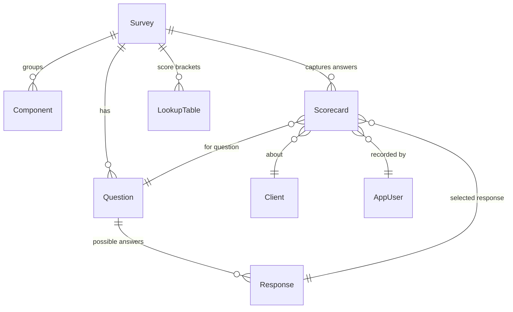

Apache Fineract's Social Performance Management (SPM) module is a small, self‑contained domain under `fineract-provider/src/main/java/org/apache/fineract/spm/` that lets a financial institution attach structured questionnaires — *surveys* — to its client base, capture answers as *scorecards*, and translate raw answer values into normalised scores using *lookup tables*. SPM is not a regulatory module; it is a measurement tool. Institutions use it to track outcomes such as poverty progress, financial inclusion impact, customer satisfaction, or any other indicator that funders, regulators, or the institution's own board care about.

This page is the orientation for the cluster. The companion page [SPM API & Scorecard](/spm/spm-api-and-scorecard) walks the REST endpoints and JSON payloads; [Lookup table](/survey/lookup-table) covers the scoring layer; and the related [Poverty line and likelihood](/survey/poverty-line-and-likelihood) page documents the separate PPI (Progress out of Poverty Index) plumbing under `infrastructure/survey/` that SPM data ultimately feeds.

## What SPM gives you

<CardGroup cols={2}>
  <Card title="Versioned surveys" icon="clipboard-list">
    Each survey carries `key`, `name`, `description`, `countryCode`, and a `validFrom`/`validTo` window so you can publish a new version without disturbing historical scoring data.
  </Card>
  <Card title="Structured questions" icon="list-check">
    A survey owns a list of `Question`s and `Response`s with numeric values. The data shape is fixed: every answer has an integer `value` you can aggregate or thresh.
  </Card>
  <Card title="Per-client scorecards" icon="user-check">
    `Scorecard` rows attach an answer to a client/loan officer/survey/question/response 4‑tuple. They are the audit trail of every assessment.
  </Card>
  <Card title="Lookup tables" icon="table">
    Convert raw response values into a final score using bracketed `(valueFrom, valueTo) → score` rules per survey.
  </Card>
  <Card title="Component grouping" icon="diagram-project">
    Optional `Component`s let you cluster questions under a theme (e.g. "Health", "Education", "Income") and roll up the aggregate later.
  </Card>
  <Card title="Activate / deactivate" icon="toggle-on">
    Surveys flip on and off with a `command=activate|deactivate` query param so a draft can be staged before being made answerable.
  </Card>
</CardGroup>

## The domain model



### `Survey` — `m_surveys`

```java
@Entity
@Table(name = "m_surveys")
public class Survey extends AbstractPersistableCustom<Long> {

    private List<Component> components;
    private List<Question> questions;

    @Column(name = "a_key", length = 32)
    private String key;
    @Column(name = "a_name", length = 255)
    private String name;
    @Column(name = "description", length = 4096)
    private String description;
    @Column(name = "country_code", length = 2)
    private String countryCode;
    @Column(name = "valid_from")
    private LocalDate validFrom;
    @Column(name = "valid_to")
    private LocalDate validTo;
    // ...
}
```

- `key` is a short, stable handle (e.g. `PPI_BD_2019`) that clients can reference.
- `countryCode` is ISO 3166‑1 alpha‑2.
- `validFrom`/`validTo` make `SpmService.fetchValidSurveys()` and the `isActive=true` query param meaningful — out‑of‑window surveys are excluded.

### `Question` — `m_survey_questions`

```java
@Entity
@Table(name = "m_survey_questions")
public class Question extends AbstractPersistableCustom<Long> {
    private Survey survey;
    private List<Response> responses;
    @Column(name = "component_key", length = 32) private String componentKey;
    @Column(name = "a_key", length = 32)         private String key;
    @Column(name = "a_text", length = 255)       private String text;
    @Column(name = "description", length = 4096) private String description;
    @Column(name = "sequence_no", precision = 4) private Integer sequenceNo;
}
```

`componentKey` is the (optional) link to a `Component` for thematic grouping. `sequenceNo` controls UI ordering.

### `Response` — `m_survey_responses`

```java
@Entity
@Table(name = "m_survey_responses")
public class Response extends AbstractPersistableCustom<Long> {
    private Question question;
    @Column(name = "a_text", length = 255)       private String text;
    @Column(name = "a_value", precision = 4)     private Integer value;
    @Column(name = "sequence_no", precision = 4) private Integer sequenceNo;
}
```

The `value` column is what feeds scoring — both the per‑question total and the lookup‑table bracketing.

### `Scorecard` — `m_survey_scorecards`

```java
@Entity
@Table(name = "m_survey_scorecards")
public class Scorecard extends AbstractPersistableCustom<Long> {
    private Survey survey;
    private Question question;
    private Response response;
    private AppUser appUser;
    private Client client;
    @Column(name = "created_on")        private LocalDateTime createdOn;
    @Column(name = "a_value", precision = 4) private Integer value;
}
```

One row per `(client, survey, question, response)`. The `value` is denormalised from `Response.value` so a later edit to the response template doesn't retroactively change the score.

### `LookupTable` — `m_survey_lookup_tables`

```java
@Entity
@Table(name = "m_survey_lookup_tables")
public class LookupTable extends AbstractPersistableCustom<Long> {
    private Survey survey;
    @Column(name = "a_key", length = 32)             private String key;
    @Column(name = "description", length = 4096)      private String description;
    @Column(name = "value_from", precision = 4)       private Integer valueFrom;
    @Column(name = "value_to", precision = 4)         private Integer valueTo;
    @Column(name = "score", precision = 5, scale = 2) private Double score;
}
```

A row maps a half‑open numeric bucket `[valueFrom, valueTo)` to a `score`. Multiple rows under the same `key` form a band table; rows under different keys define independent translations.

## Typical lifecycle

```mermaid
flowchart LR
    A[Author survey<br/>POST /v1/surveys] --> B[Add lookup tables<br/>POST /v1/surveys/&#123;id&#125;/lookuptables]
    B --> C[Activate<br/>POST /v1/surveys/&#123;id&#125;?command=activate]
    C --> D[Loan officer assesses client]
    D --> E[Record answers<br/>POST /v1/surveys/scorecards/&#123;surveyId&#125;]
    E --> F[Read per-client view<br/>GET /v1/surveys/scorecards/&#123;surveyId&#125;/clients/&#123;clientId&#125;]
    F --> G[Roll up via lookup table for reporting]
    C --> H[Re-version survey<br/>create v2, deactivate v1]
```



## REST surface — short index

| Resource | Mounted at | Page |
|---|---|---|
| `SpmApiResource` | `/v1/surveys` | [SPM API & Scorecard](/spm/spm-api-and-scorecard) |
| `ScorecardApiResource` | `/v1/surveys/scorecards` | [SPM API & Scorecard](/spm/spm-api-and-scorecard) |
| `LookupTableApiResource` | `/v1/surveys/{surveyId}/lookuptables` | [Lookup table](/survey/lookup-table) |

### Service layer

| Service | File | Concern |
|---|---|---|
| `SpmService` | `spm/service/SpmService.java` | Survey CRUD, activate/deactivate, fetch by validity. |
| `ScorecardService` | `spm/service/ScorecardService.java` | Persist scorecard entries. |
| `ScorecardReadPlatformService` | `spm/service/ScorecardReadPlatformServiceImpl.java` | Query by survey, client, both. |
| `LookupTableService` | `spm/service/LookupTableService.java` | CRUD on lookup table rows. |
| `SurveyValidator` | `spm/domain/SurveyValidator.java` | JSR‑style validation before save. |

### Mappers

`spm/util/` contains the static mappers that translate JSON DTOs (`SurveyData`, `QuestionData`, `ResponseData`, `ScorecardData`, `LookupTableData`) to entities and back. The mappers are the contract between the REST shape and the domain; if you want to extend SPM with extra fields, add them to the data classes *and* the mapper.

## Exceptions

| Exception | File | When |
|---|---|---|
| `SurveyNotFoundException` | `spm/exception/SurveyNotFoundException.java` | Any `findById` miss. Translated to HTTP 404 by the platform exception mapper. |
| `LookupTableNotFoundException` | `spm/exception/LookupTableNotFoundException.java` | `GET /v1/surveys/{surveyId}/lookuptables/{key}` with no rows for that key. |
| `SurveyResponseNotAvailableException` | `spm/exception/SurveyResponseNotAvailableException.java` | Scorecard creation references a response that doesn't belong to the question / survey. |

## Where SPM fits next to "survey" infrastructure

There are two adjacent but separate things called "survey" in the codebase:

| Module | Path | What it is |
|---|---|---|
| **SPM** (this page) | `spm/` | Generic, free‑form questionnaires with scorecards and lookup tables. Modeled in dedicated tables (`m_surveys`, `m_survey_*`). |
| **Survey infrastructure** | `infrastructure/survey/` | The Progress out of Poverty Index (PPI) plumbing — pre‑baked `ppi_*` tables, the `Likelihood` and `PovertyLine` curves that translate PPI scores into "X% chance the household lives below the national poverty line". |

The two coexist: an institution can author a PPI survey **as an SPM survey** (so it shares the scoring tables and the scorecard API) *and* use the PPI‑specific `LikelihoodApiResource` / `PovertyLineApiResource` for the poverty‑probability conversion. See [Poverty line and likelihood](/survey/poverty-line-and-likelihood) for the PPI side, and [Lookup table](/survey/lookup-table) for the generic SPM mapping.

## Permissions

SPM relies on plain Spring Security authentication. The resources call `securityContext.authenticatedUser()` rather than checking a named permission, so any authenticated user with access to `/api/v1/surveys/**` can read and write surveys, scorecards, and lookup tables. If you need finer control:

- Block the routes at your reverse proxy by role.
- Wrap a custom command handler around `SpmService` and route through `PortfolioCommandSourceWritePlatformService` to inherit Fineract's permission + maker‑checker pipeline.

## When to use SPM

Use SPM when:

- You need to collect *structured, scoreable* data on clients beyond what `m_client` and datatables hold.
- You want to compare cohorts across time using consistent surveys.
- You need to expose the scoring rules (lookup table) without hard‑coding them in application code.

Avoid SPM when:

- The data is unstructured or document‑heavy — use the document store (`/v1/documents`) instead.
- The data is per‑loan rather than per‑client — model it on the loan with a datatable.
- You only need to record an indicator with one number — a single field on a client datatable is simpler.

## Related pages

- [SPM API & Scorecard](/spm/spm-api-and-scorecard) — every endpoint and JSON example.
- [Lookup table](/survey/lookup-table) — the bracket‑to‑score translation.
- [Poverty line and likelihood](/survey/poverty-line-and-likelihood) — PPI‑specific scoring under `infrastructure/survey/`.
