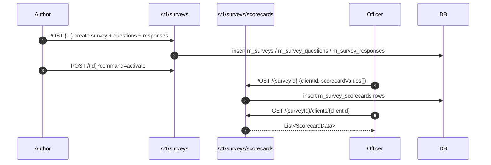

Apache Fineract's Social Performance Management (SPM) module exposes two JAX‑RS resources under `fineract-provider/src/main/java/org/apache/fineract/spm/api/`. The first, `SpmApiResource` at `/v1/surveys`, is the survey‑authoring surface — you list, fetch, create, edit, activate, and deactivate `Survey` rows together with their nested `Question` and `Response` lists. The second, `ScorecardApiResource` at `/v1/surveys/scorecards`, is the data‑capture surface — loan officers POST a `ScorecardData` linking a client, a question, and the response they chose; subsequent GETs return scorecards by survey, by client, or by both. A third resource — `LookupTableApiResource` — completes the picture by translating raw response values into final scores and is documented separately on [Lookup table](/survey/lookup-table).

This page walks both resources in execution order: author a survey, capture answers, then read them back.

For the data model and the domain rationale, see the [SPM Overview](/spm/overview).

## Quick reference

| Method | Path | Purpose |
|---|---|---|
| `GET` | `/v1/surveys?isActive=` | List surveys; `isActive=true` returns only those inside the `validFrom`/`validTo` window. |
| `GET` | `/v1/surveys/{id}` | Fetch one survey with all questions/responses. |
| `POST` | `/v1/surveys` | Create. Returns `{ "resourceId": <id> }`. |
| `PUT` | `/v1/surveys/{id}` | Replace fields, questions, responses. |
| `POST` | `/v1/surveys/{id}?command=activate\|deactivate` | Flip the survey's active state. |
| `GET` | `/v1/surveys/scorecards/{surveyId}` | List all scorecard entries for a survey. |
| `GET` | `/v1/surveys/scorecards/{surveyId}/clients/{clientId}` | List entries for one client within a survey. |
| `GET` | `/v1/surveys/scorecards/clients/{clientId}` | List entries for a client across surveys. |
| `POST` | `/v1/surveys/scorecards/{surveyId}` | Create a scorecard entry. |

## `SpmApiResource` — survey authoring

```java
@Path("/v1/surveys")
@Tag(name = "Spm-Surveys", description = "")
public class SpmApiResource {
    private final PlatformSecurityContext securityContext;
    private final SpmService spmService;
    // ...
}
```

### List surveys

```java
@GET
public List<SurveyData> fetchAllSurveys(@QueryParam("isActive") final Boolean isActive) {
    this.securityContext.authenticatedUser();
    final List<SurveyData> result = new ArrayList<>();
    List<Survey> surveys = null;
    if (isActive != null && isActive) {
        surveys = this.spmService.fetchValidSurveys();
    } else {
        surveys = this.spmService.fetchAllSurveys();
    }
    if (surveys != null) {
        for (final Survey survey : surveys) {
            result.add(SurveyMapper.map(survey));
        }
    }
    return result;
}
```

- No `isActive` (or `false`) → everything in `m_surveys`.
- `isActive=true` → only surveys whose `validFrom <= today <= validTo`.

### Fetch one

```java
@GET
@Path("/{id}")
public SurveyData findSurvey(@PathParam("id") final Long id) {
    this.securityContext.authenticatedUser();
    final Survey survey = this.spmService.findById(id);
    return SurveyMapper.map(survey);
}
```

A miss throws `SurveyNotFoundException` → HTTP 404 (`error.msg.spm.survey.not.found`).

### Create

```java
@POST
public String createSurvey(final SurveyData surveyData) {
    this.securityContext.authenticatedUser();
    final Survey survey = SurveyMapper.map(surveyData, new Survey());
    this.spmService.createSurvey(survey);
    return getResponse(survey.getId());
}
```

The body is a full `SurveyData`. Mandatory fields per the resource's `@Operation` documentation:

> `countryCode, key, name, questions, responses, sequenceNo, text, description`

`SurveyData` itself:

```java
public class SurveyData {
    private Long id;
    private List<ComponentData> componentDatas;
    private List<QuestionData> questionDatas;
    private String key;
    private String name;
    private String description;
    private String countryCode;
    private LocalDate validFrom;
    private LocalDate validTo;
}
```

A worked example:

```http
POST /fineract-provider/api/v1/surveys
Content-Type: application/json

{
  "key":         "FINHEALTH_2024",
  "name":        "Financial Health Indicator",
  "description": "Quarterly client well-being snapshot",
  "countryCode": "ZM",
  "componentDatas": [
    { "key": "INCOME", "text": "Income stability", "description": "", "sequenceNo": 1 }
  ],
  "questionDatas": [
    {
      "key": "Q1", "componentKey": "INCOME", "sequenceNo": 1,
      "text": "How regular is your household income?",
      "description": "",
      "responseDatas": [
        { "text": "Very irregular", "value": 0, "sequenceNo": 1 },
        { "text": "Mostly regular", "value": 5, "sequenceNo": 2 },
        { "text": "Always regular", "value": 10, "sequenceNo": 3 }
      ]
    }
  ]
}
```

Response:

```json
{ "resourceId": 17 }
```

<Note>
`ComponentData` uses the field name `text` (not `name`) — it is mapped to the `m_survey_components.a_text` column. `QuestionData` nests responses under `responseDatas`, not `responses`.
</Note>

<Warning>
`SpmService.createSurvey(...)` **ignores any `validFrom` / `validTo` you supply in the body** and overwrites them with `today` and `today + 100 years`. If a survey with the same `key` is currently valid, the service also auto-deactivates that previous version (it calls `deactivateSurvey(previousSurvey.getId())`). Treat `key` as the version handle: bump it whenever you publish a revision you want to coexist with history.
</Warning>

### Edit

```java
@PUT
@Path("/{id}")
public String editSurvey(@PathParam("id") final Long id, final SurveyData surveyData) {
    this.securityContext.authenticatedUser();
    final Survey surveyToUpdate = this.spmService.findById(id);
    final Survey survey = SurveyMapper.map(surveyData, surveyToUpdate);
    this.spmService.updateSurvey(survey);
    return getResponse(survey.getId());
}
```

The mapper merges the body into the loaded survey, replacing the question/response collections wholesale. Treat edits as *destructive replacements* of the survey's contents — existing scorecards referencing deleted questions or responses become orphaned. The recommended practice is to create a new survey under a new `key` rather than rewriting an in‑production one.

### Activate / deactivate

```java
@POST
@Path("/{id}")
public void activateOrDeactivateSurvey(@PathParam("id") final Long id,
                                       @QueryParam("command") final String command) {
    this.securityContext.authenticatedUser();
    if (command != null && command.equalsIgnoreCase("activate")) {
        this.spmService.activateSurvey(id);
    } else if (command != null && command.equalsIgnoreCase("deactivate")) {
        this.spmService.deactivateSurvey(id);
    } else {
        throw new UnrecognizedQueryParamException("command", command);
    }
}
```

Anything other than `activate` / `deactivate` (case‑insensitive) is a 400. Internally this is implemented by adjusting `validFrom`/`validTo` so the `isActive=true` listing reflects the change: `activateSurvey` sets `validFrom = today` and `validTo = today + 100 years`; `deactivateSurvey` sets `validTo = yesterday`.

```http
POST /fineract-provider/api/v1/surveys/17?command=activate
```

## `ScorecardApiResource` — capturing answers

```java
@Path("/v1/surveys/scorecards")
@Tag(name = "Score Card", description = "")
public class ScorecardApiResource {
    private final SpmService spmService;
    private final ScorecardService scorecardService;
    private final ClientRepositoryWrapper clientRepositoryWrapper;
    private final ScorecardReadPlatformService scorecardReadPlatformService;
    // ...
}
```

### Create

```java
@POST
@Path("{surveyId}")
public void createScorecard(@PathParam("surveyId") final Long surveyId,
                            final ScorecardData scorecardData) {
    final AppUser appUser = this.securityContext.authenticatedUser();
    final Survey survey = this.spmService.findById(surveyId);
    final Client client = this.clientRepositoryWrapper.findOneWithNotFoundDetection(scorecardData.getClientId());
    this.scorecardService.createScorecard(ScorecardMapper.map(scorecardData, survey, appUser, client));
}
```

Mandatory body fields per the `@Operation` annotation:

> `clientId, createdOn, questionId, responseId, staffId`

<Note>
The `@Operation` summary above is what Swagger advertises, but `ScorecardValue` (the entry that actually goes inside `scorecardValues`) only carries `questionId`, `responseId`, `value`, and `createdOn` — there is no `staffId` field on the DTO. The `AppUser` recorded against each `Scorecard` row is the authenticated session user (`securityContext.authenticatedUser()`), not a body field. Treat `staffId` in the swagger comment as documentation drift.
</Note>

`ScorecardData` carries a `scorecardValues` list so you can submit multiple answers in one POST:

```java
public class ScorecardData {
    private Long id;
    private Long userId;
    private String username;
    private Long clientId;
    private Long surveyId;
    private String surveyName;
    private List<ScorecardValue> scorecardValues;
    // ...
}
```

`ScorecardValue` (`spm/data/ScorecardValue.java`) holds the per‑question reference: `questionId`, `responseId`, `value`, `createdOn`. The mapper expands the list into N `Scorecard` rows, attaching the same `AppUser` and `Client` to each. If `scorecardValues` is null or empty, `ScorecardMapper.map(...)` throws `SurveyResponseNotAvailableException` (HTTP 403 with `error.msg.no.survey.response`).

```http
POST /fineract-provider/api/v1/surveys/scorecards/17
Content-Type: application/json

{
  "clientId": 42,
  "scorecardValues": [
    { "questionId": 101, "responseId": 1003, "value": 10,
      "createdOn": "2024-04-15T10:30:00Z" }
  ]
}
```

A 200 with no body indicates success — read back with the `GET` endpoints below. Note that the `createdOn` you supply per row is ignored at write time: `ScorecardMapper` always stamps each `Scorecard` with `DateUtils.getLocalDateTimeOfTenant()`.

### List entries for a survey

```java
@GET
@Path("{surveyId}")
public List<ScorecardData> findBySurvey(@PathParam("surveyId") final Long surveyId) {
    this.securityContext.authenticatedUser();
    this.spmService.findById(surveyId);
    return (List<ScorecardData>) this.scorecardReadPlatformService.retrieveScorecardBySurvey(surveyId);
}
```

Useful for the institution‑level rollup ("how many clients have we assessed against survey 17 so far this quarter?").

### List entries for a client within a survey

```java
@GET
@Path("{surveyId}/clients/{clientId}")
public List<ScorecardData> findBySurveyAndClient(@PathParam("surveyId") final Long surveyId,
                                                 @PathParam("clientId") final Long clientId) {
    this.securityContext.authenticatedUser();
    this.spmService.findById(surveyId);
    this.clientRepositoryWrapper.findOneWithNotFoundDetection(clientId);
    return (List<ScorecardData>) this.scorecardReadPlatformService.retrieveScorecardBySurveyAndClient(surveyId, clientId);
}
```

### List a client's full history

```java
@GET
@Path("clients/{clientId}")
public List<ScorecardData> findByClient(@PathParam("clientId") final Long clientId) {
    this.securityContext.authenticatedUser();
    this.clientRepositoryWrapper.findOneWithNotFoundDetection(clientId);
    return (List<ScorecardData>) this.scorecardReadPlatformService.retrieveScorecardByClient(clientId);
}
```

Returns scorecards across all surveys for that client — useful for a client profile page that needs to show every SPM data point.

## End‑to‑end sequence



## Wiring

| Concern | Class |
|---|---|
| Survey CRUD | `spm/service/SpmService.java` |
| Scorecard writes | `spm/service/ScorecardService.java` |
| Scorecard reads | `spm/service/ScorecardReadPlatformServiceImpl.java` |
| DTO ↔ entity | `spm/util/SurveyMapper.java`, `spm/util/ScorecardMapper.java` |
| Validation | `spm/domain/SurveyValidator.java` |
| Exceptions | `spm/exception/{SurveyNotFoundException,SurveyResponseNotAvailableException}.java` |

`SurveyValidator` runs inside `SpmService.createSurvey(...)` and `updateSurvey(...)`. Reading from `spm/domain/SurveyValidator.java`, it enforces:

- `key`, `name`, `countryCode` are present, non‑blank, and do not exceed `maxKeyLength=32`, `maxNameLength=255`, `maxCountryCodeLength=2`.
- `description` (optional) does not exceed `maxDescriptionLength=4000`.
- `questions` is non‑null and not an empty array.
- For each question: `key` (≤ 32 chars) and `text` (≤ 255 chars) are present; `options` (the `responseDatas` list) is non‑null and non‑empty.
- For each response: `text` is present and ≤ 255 chars; `value` is non‑null and not greater than `maxOptionsValue=9999`.

Notable gaps: there is **no** check that `validFrom <= validTo` (the service overwrites both anyway) and **no** check that `countryCode` is *exactly* two characters — only that it does not exceed two.

Validation failures surface as `PlatformApiDataValidationException` → HTTP 400 with the standard `errors[]` array.

## Permissions and audit

Both resources call `securityContext.authenticatedUser()` rather than `validateHasReadPermission(...)`. That means any authenticated user with route access can create surveys and scorecards. If you need permission‑level control:

- Block routes at your reverse proxy by Fineract role.
- Front the service with a custom command handler dispatched through `PortfolioCommandSourceWritePlatformService` so you can name a permission and gain maker‑checker, audit (`m_portfolio_command_source`), and external‑event publication for free.

## Errors you may see

| HTTP | Condition |
|---|---|
| `404 SurveyNotFoundException` | Any `/v1/surveys/{id}` or `/v1/surveys/scorecards/{surveyId}` referencing an unknown survey. |
| `404 ClientNotFoundException` | Scorecard create with an unknown `clientId`. |
| `403 SurveyResponseNotAvailableException` | Scorecard create with an empty or missing `scorecardValues` list. The mapper raises this before any insert. |
| `400 UnrecognizedQueryParamException` | `?command=` value other than `activate`/`deactivate`. |
| `400 PlatformApiDataValidationException` | A required SurveyData field is missing on create/edit. |
| `409 PlatformDataIntegrityException` | `error.msg.survey.duplicate.key` on a unique‑constraint collision, or `error.msg.survey.cannot.be.modified.as.used.in.client.survey` if an edit would break an existing scorecard FK. |

## Practical tips

- **Author once, reuse forever.** Pin your survey `key` in client documentation; bumping the `key` whenever you re‑version makes downstream analytics straightforward.
- **Pre‑load reference data.** Country‑specific PPI surveys come bundled in `infrastructure/survey/` migration scripts under `ppi_*` tables — they're imported into `m_surveys` so SPM and PPI share the same scorecard pipeline. See [Poverty line and likelihood](/survey/poverty-line-and-likelihood).
- **Don't reuse a `responseId` between unrelated questions.** The validator only checks the response belongs to the question; it can't catch semantic mismatches in your survey design.
- **Batching helps.** Send all of a client's answers in a single POST with multiple `scorecardValues` rather than one request per question — fewer transactions, simpler audit.

## Related pages

- [SPM Overview](/spm/overview) — the data model and how SPM relates to the `infrastructure/survey/` PPI plumbing.
- [Lookup table](/survey/lookup-table) — the bracket‑to‑score translation.
- [Poverty line and likelihood](/survey/poverty-line-and-likelihood) — PPI‑specific scoring that complements SPM.
