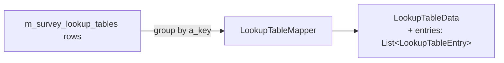

Apache Fineract's SPM module ships a small, generic scoring layer called the **lookup table**. A lookup table is a named collection of `(valueFrom, valueTo) → score` brackets attached to a survey: when a raw response value falls inside a row's `[valueFrom, valueTo]` window, the row's `score` becomes the normalised result. The mechanism is intentionally minimal — it has no formula language, no calculus engine, and no per‑question logic. That smallness is exactly what makes it reusable: a Progress out of Poverty Index (PPI) needs to translate `[0,4]` to "99% chance below the national poverty line"; a financial‑health survey needs to translate a raw score in `[0,30]` to "weak", `[31,70]` to "improving", `[71,100]` to "strong". Both fit the same row layout.

This page documents the `LookupTable` entity (`spm/domain/LookupTable.java`), the REST resource at `/v1/surveys/{surveyId}/lookuptables` (`LookupTableApiResource`), and the service that backs it (`LookupTableService`). For the surrounding SPM context see the [SPM Overview](/spm/overview); for the PPI‑specific scoring tables that complement this generic mechanism see [Poverty line and likelihood](/survey/poverty-line-and-likelihood).

## The entity

```java
@Entity
@Table(name = "m_survey_lookup_tables")
public class LookupTable extends AbstractPersistableCustom<Long> {

    private Survey survey;

    @Column(name = "a_key", length = 32)
    private String key;

    @Column(name = "description", length = 4096)
    private String description;

    @Column(name = "value_from", precision = 4)
    private Integer valueFrom;

    @Column(name = "value_to", precision = 4)
    private Integer valueTo;

    @Column(name = "score", precision = 5, scale = 2)
    private Double score;
}
```

A few design choices worth noting:

- **`key` is the table identifier, not the row identifier.** Many rows share a `key`; together they form the bracket table you look up against. A survey can carry several independent tables under different keys (e.g. `OVERALL_SCORE`, `INCOME_INDEX`, `HEALTH_INDEX`).
- **`valueFrom`/`valueTo` are integers.** Use the response values directly — Fineract uses `Integer` so values like 0–100 (PPI), 0–10 (Likert), 1–5 (Net Promoter) all fit.
- **`score` is `Double`.** The `(5, 2)` precision lets you store percentages with two decimal places (e.g. `99.50`) or normalised scores like `2.75`.
- **One survey owns many lookup tables.** The `survey` foreign key is non‑null; you can't have a "global" lookup table — that's intentional, so the scoring is reproducible per survey version.

## Wire shape

The REST resource exposes a *grouped* view: rather than returning one entity per row, it groups rows by `key` and bundles the brackets into a list of `LookupTableEntry`.

```java
public class LookupTableData {
    private String key;
    private String description;
    private List<LookupTableEntry> entries;
    // ...
}

public class LookupTableEntry {
    private Integer valueFrom;
    private Integer valueTo;
    private Double score;
    // ...
}
```

Translation is done by `spm/util/LookupTableMapper` (called from the resource), which takes a `List<LookupTable>` and emits a `List<LookupTableData>` with one element per distinct `key`.



## The resource

`spm/api/LookupTableApiResource.java`:

```java
@Path("/v1/surveys/{surveyId}/lookuptables")
@Tag(name = "SPM API - LookUp Table",
     description = "The Apache Fineract SPM API provides the ability to create "
                 + "custom surveys to collect social performance measurentment data "
                 + "or any additional questionnaire a financial institute want to collect.")
public class LookupTableApiResource {

    private final PlatformSecurityContext securityContext;
    private final SpmService spmService;
    private final LookupTableService lookupTableService;
    // ...
}
```

Three endpoints — list, fetch one, create — and every one of them goes through `findSurvey(surveyId)` first to ensure the parent survey exists.

### `GET /v1/surveys/{surveyId}/lookuptables`

```java
public List<LookupTableData> fetchLookupTables(@PathParam("surveyId") final Long surveyId) {
    this.securityContext.authenticatedUser();
    final Survey survey = findSurvey(surveyId);
    final List<LookupTable> lookupTables = this.lookupTableService.findBySurvey(survey);
    if (lookupTables != null) {
        return LookupTableMapper.map(lookupTables);
    }
    return Collections.emptyList();
}
```

Example response when a survey carries two tables under different keys:

```json
[
  {
    "key": "OVERALL_SCORE",
    "description": "Composite score bracket → financial-health label",
    "entries": [
      { "valueFrom": 0,  "valueTo": 30,  "score": 1.0 },
      { "valueFrom": 31, "valueTo": 70,  "score": 2.0 },
      { "valueFrom": 71, "valueTo": 100, "score": 3.0 }
    ]
  },
  {
    "key": "INCOME_INDEX",
    "description": "Income-question score → income tier",
    "entries": [
      { "valueFrom": 0,  "valueTo": 5,   "score": 1.0 },
      { "valueFrom": 6,  "valueTo": 10,  "score": 2.0 }
    ]
  }
]
```

### `GET /v1/surveys/{surveyId}/lookuptables/{key}`

```java
public LookupTableData findLookupTable(@PathParam("surveyId") final Long surveyId,
                                       @PathParam("key") final String key) {
    this.securityContext.authenticatedUser();
    findSurvey(surveyId);
    final List<LookupTable> lookupTables = this.lookupTableService.findByKey(key);
    if (lookupTables == null || lookupTables.isEmpty()) {
        throw new LookupTableNotFoundException(key);
    }
    return LookupTableMapper.map(lookupTables).get(0);
}
```

Two things to note:

- The result is the first (and only) element of the mapper's output — `findByKey` returns every row that shares the `key`, the mapper groups them into a single `LookupTableData`.
- The `surveyId` parameter is *only* used to verify the parent survey exists. `lookupTableService.findByKey(key)` queries by `a_key` alone — if you accidentally reuse a key across surveys you'll get back the row set from whichever survey was queried first. Keep keys unique across surveys.

### `POST /v1/surveys/{surveyId}/lookuptables`

```java
public void createLookupTable(@PathParam("surveyId") final Long surveyId,
                              final LookupTableData lookupTableData) {
    this.securityContext.authenticatedUser();
    final Survey survey = findSurvey(surveyId);
    this.lookupTableService.createLookupTable(LookupTableMapper.map(lookupTableData, survey));
}
```

The mapper translates the grouped `LookupTableData` into one `LookupTable` entity per `LookupTableEntry`, all of them linked to the same `survey` and `key`. The repository persists them in one `saveAll`:

```java
public List<LookupTable> createLookupTable(final List<LookupTable> lookupTable) {
    this.securityContext.authenticatedUser();
    return this.lookupTableRepository.saveAll(lookupTable);
}
```

Example request:

```http
POST /fineract-provider/api/v1/surveys/17/lookuptables
Content-Type: application/json

{
  "key":         "OVERALL_SCORE",
  "description": "Composite score bracket → financial-health label",
  "entries": [
    { "valueFrom": 0,  "valueTo": 30,  "score": 1.0 },
    { "valueFrom": 31, "valueTo": 70,  "score": 2.0 },
    { "valueFrom": 71, "valueTo": 100, "score": 3.0 }
  ]
}
```

Mandatory fields per the resource's `@Operation` documentation:

> `key, score, validFrom, validTo`

<Note>
That swagger summary is misleading — `LookupTable` has no `validFrom` / `validTo` columns and `LookupTableData` has no such fields either. In practice the body the mapper actually reads is `{ key, description, entries[] }`, where each `entries[]` row carries `valueFrom`, `valueTo`, and `score`. The `validFrom`/`validTo` reference is documentation drift from the parent `Survey` schema; treat the practical mandatory set as `key` and a non-empty `entries[]` list with `valueFrom`, `valueTo`, `score` per entry.
</Note>

## Lookup workflow

The resource itself doesn't perform a lookup — it only stores and reads the table. The lookup is done by the caller, typically in three steps:

```mermaid
sequenceDiagram
    autonumber
    participant Officer
    participant SC as /v1/surveys/scorecards
    participant LT as /v1/surveys/&#123;id&#125;/lookuptables
    participant App as Scoring code

    Officer->>SC: POST scorecard answers
    App->>SC: GET /v1/surveys/scorecards/&#123;surveyId&#125;/clients/&#123;clientId&#125;
    SC-->>App: scorecards (raw response values)
    App->>App: aggregate response values<br/>(sum / weighted sum)
    App->>LT: GET /v1/surveys/&#123;surveyId&#125;/lookuptables/&#123;key&#125;
    LT-->>App: bracket table
    App->>App: find entry where valueFrom <= total <= valueTo<br/>read score
```



In application code (TypeScript example):

```ts
const total = scorecards
  .flatMap(s => s.scorecardValues)
  .reduce((acc, v) => acc + (v.value ?? 0), 0);

const table = await api.get(`/v1/surveys/${surveyId}/lookuptables/OVERALL_SCORE`);
const bucket = table.entries.find(
  e => total >= e.valueFrom && total <= e.valueTo);
const finalScore = bucket?.score ?? null;
```

The lookup table thus replaces hard‑coded `if (total < 30) ... else if (total < 70) ...` ladders in scoring code: change the rules in the table and every consumer picks up the new brackets on the next call.

## Relationship to PPI

The PPI plumbing under `infrastructure/survey/` solves the *same conceptual problem* — bracket a score, return a percentage — but with a different shape, optimised for "multiple poverty lines per PPI score":

| Concept | Generic SPM | PPI |
|---|---|---|
| Table identity | `key` on `m_survey_lookup_tables` | `ppi_likelihoods_ppi.id` |
| Bracket | `valueFrom` / `valueTo` columns on the same row as the score | Separate `ppi_scores` table joined to `ppi_poverty_line` |
| Output | One `score` per bracket | One `poverty_line` per `(score_id, likelihood_ppi_id)` pair |
| Multi‑dimension | Multiple `key`s per survey | Multiple likelihoods per `ppi_name` |
| API | `/v1/surveys/{id}/lookuptables` | `/v1/povertyLine/{ppiName}` |

The PPI side denormalises further because PPI consumers always want the full grid (every poverty line × every bracket) in one call; the generic SPM table is structured for "give me the brackets under this key".

## The mapper round‑trip

`spm/util/LookupTableMapper`:

- `map(List<LookupTable> entities) -> List<LookupTableData>` — groups by `key`, materialises `entries`.
- `map(LookupTableData dto, Survey survey) -> List<LookupTable>` — expands `entries` into N rows, fans the `key`, `description`, and parent `survey` across them.

Because the persistence shape is one row per bracket, but the API shape is one element per table, the mapper is the only place that knows the grouping rule. If you decide later to expose lookup tables as a flat resource (one URL per row), you'd only touch the mapper and the resource.

## Errors

| HTTP | Exception | When |
|---|---|---|
| `404` | `SurveyNotFoundException` | The parent survey id doesn't exist. |
| `404` | `LookupTableNotFoundException` | `GET .../{key}` with no rows for that key. |
| `400` | `PlatformApiDataValidationException` | POST body missing required fields. |

## Permissions

Like the other SPM resources, the lookup table endpoints call `securityContext.authenticatedUser()` without a named permission check. The `validateHasReadPermission(...)` pattern used by core platform resources is not enforced here, so any authenticated principal with route access can read and create lookup tables. If you need tighter control, gate at the proxy by role or fork the resource to call `validateHasReadPermission("SPM")`.

## Files

| File | Role |
|---|---|
| `spm/domain/LookupTable.java` | JPA entity for `m_survey_lookup_tables`. |
| `spm/domain/LookupTableRepository.java` | Spring Data repository (`findByKey`, `findBySurvey`). |
| `spm/data/LookupTableData.java` | Grouped wire DTO. |
| `spm/data/LookupTableEntry.java` | Per‑bracket DTO. |
| `spm/util/LookupTableMapper.java` | Group/ungroup between rows and the DTO. |
| `spm/service/LookupTableService.java` | Read / write delegate. |
| `spm/api/LookupTableApiResource.java` | REST resource at `/v1/surveys/{surveyId}/lookuptables`. |
| `spm/exception/LookupTableNotFoundException.java` | 404 mapper. |

## Operational tips

- **Treat lookup tables as immutable per survey version.** Editing brackets in place changes how *future* lookups score historical scorecards. If you need to evolve the rules, create a new survey (with a new `key` on `m_surveys`) and add the new lookup tables there.
- **Keep `valueTo` inclusive of the upper bound.** The application code typically does `value >= valueFrom && value <= valueTo`; off‑by‑one bugs in the table will create a "no matching bracket" gap.
- **Cover the entire input range.** Add a final row with `valueTo = Integer.MAX_VALUE` (or your domain's effective max) so unexpectedly high totals still map to something meaningful.
- **Pin the lookup key in your scoring code as a constant**, not a string sprinkled across modules — survey re‑versioning becomes a single‑file change.

## Related pages

- [SPM Overview](/spm/overview) — the broader social‑performance domain.
- [SPM API & Scorecard](/spm/spm-api-and-scorecard) — produce the raw values that feed the lookup.
- [Poverty line and likelihood](/survey/poverty-line-and-likelihood) — the PPI‑specific lookup grid under `infrastructure/survey/`.
