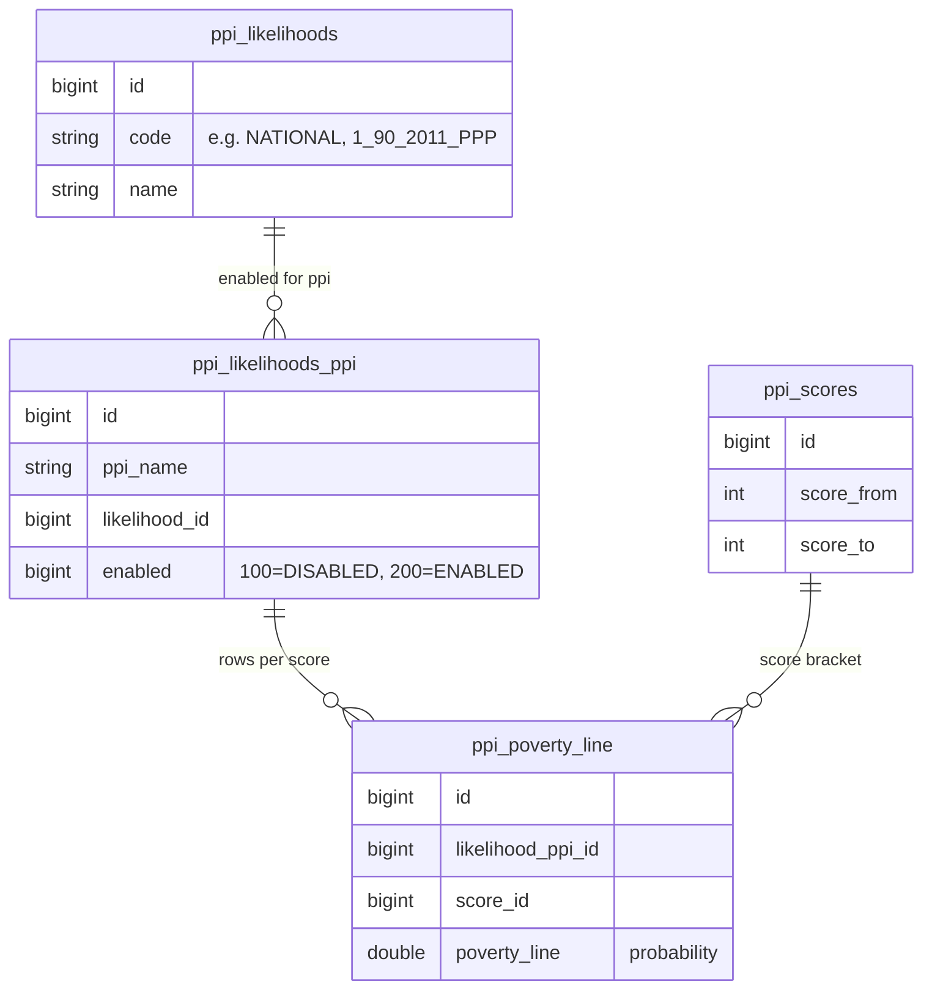

Apache Fineract's `fineract-provider/src/main/java/org/apache/fineract/infrastructure/survey/` package implements the Progress out of Poverty Index (PPI) — Grameen Foundation's framework for converting a short, country‑specific household survey into a *likelihood* that the household lives below a given poverty line. The package layers on top of the platform's generic [SPM](/spm/overview) machinery: a PPI questionnaire is registered as a datatable, the responses are stored against clients, the raw answer scores roll up to a 0–100 PPI score, and then four tables — `ppi_likelihoods`, `ppi_likelihoods_ppi`, `ppi_scores`, `ppi_poverty_line` — turn that score into "X% chance this household lives below national poverty line P".

This page documents the two JAX‑RS resources that expose the PPI conversion (`PovertyLineApiResource` at `/v1/povertyLine` and `LikelihoodApiResource` at `/v1/likelihood`), the supporting `Likelihood` domain entity, and the SQL flow inside `PovertyLineServiceImpl` that does the lookup.

For the questionnaire side — registering a survey as a datatable, filling it in per client — see [Lookup table](/survey/lookup-table) and the generic `SurveyApiResource` at `/v1/survey`.

## Background — what PPI is

The Progress out of Poverty Index publishes country‑specific 10‑question surveys with weighted integer responses. Sum the weights and you get a PPI score in `[0, 100]`. The PPI publishers also publish *likelihood tables* — empirically derived translations that say "a household scoring 35 in country X has a 76% chance of being below the $1.90/day poverty line, a 58% chance of being below the national poverty line, a 22% chance of being below 200% of the national poverty line, etc.". Each of those poverty lines is one *likelihood*; each row of the table is one *poverty line* for one *score bracket*.

Fineract ships the schema for all of this and surfaces the lookup over REST.

## Schema



The table names are visible directly in `PovertyLineServiceImpl`'s SQL:

```java
private SqlRowSet getPovertyLines(final String ppiName) {
    String sql = "SELECT pl.id, sc.score_from, sc.score_to , pl.poverty_line,"
               + "       lkh.code, lkh.name, lkp.ppi_name "
               + "FROM ppi_poverty_line pl "
               + "JOIN ppi_likelihoods lkh on lkh.id = pl.likelihood_ppi_id "
               + "JOIN ppi_likelihoods_ppi lkp on lkp.id = pl.likelihood_ppi_id "
               + "JOIN ppi_scores sc on sc.id = pl.score_id "
               + "WHERE lkp.ppi_name = ?";
    return this.jdbcTemplate.queryForRowSet(sql, new Object[] { ppiName });
}
```

<Note>
Read that `JOIN ppi_likelihoods lkh on lkh.id = pl.likelihood_ppi_id` carefully — it joins on `likelihood_ppi_id`, which is a foreign key pointing at `ppi_likelihoods_ppi.id`, not `ppi_likelihoods.id`. This is how the column is named in the source, and the join works because both id sequences happen to line up in the bundled seed data. The neighbouring `getLikelihoods()` query joins correctly via `lkp.likelihood_id = lkh.id`. Treat the query above as load‑bearing on the seed data layout.
</Note>

(See `infrastructure/survey/service/PovertyLineServiceImpl.java` for the full query.)

## The `Likelihood` entity

```java
@Entity
@Table(name = "ppi_likelihoods_ppi")
public final class Likelihood extends AbstractPersistableCustom<Long> {

    @Column(name = "ppi_name", nullable = false)
    private String ppiName;

    @Column(name = "likelihood_id", nullable = false)
    private Long likelihoodId;

    @Column(name = "enabled", nullable = false)
    private Long enabled;
    // ...
}
```

A row in `ppi_likelihoods_ppi` links a PPI survey (`ppi_name`) to one entry in `ppi_likelihoods` and flags whether that likelihood is currently being computed for clients (`enabled = 200`) or not (`enabled = 100`). The thresholds come from `LikelihoodStatus`:

```java
public final class LikelihoodStatus {
    public static final long ENABLED  = 200;
    public static final long DISABLED = 100;
}
```

Toggling a likelihood on or off is a `PUT` against the entity through `Likelihood.update(...)`, which honours the `LikelihoodApiConstants.ACTIVE` boolean.

## Resource 1 — `/v1/likelihood`

`infrastructure/survey/api/LikelihoodApiResource.java`:

```java
@Path("/v1/likelihood")
@Tag(name = "Likelihood", description = "")
public class LikelihoodApiResource {

    private final ReadLikelihoodService readService;
    private final PortfolioCommandSourceWritePlatformService commandsSourceWritePlatformService;
    // ...
}
```

Every endpoint gates on `POVERTY_LINE_RESOURCE_NAME` (= `"PovertyLine"`).

### `GET /v1/likelihood/{ppiName}`

```java
public String retrieveAll(@PathParam("ppiName") final String ppiName) {
    this.context.authenticatedUser().validateHasReadPermission(PovertyLineApiConstants.POVERTY_LINE_RESOURCE_NAME);
    List<LikelihoodData> likelihoodData = this.readService.retrieveAll(ppiName);
    return this.toApiJsonSerializer.serialize(likelihoodData);
}
```

Returns every likelihood configured for the named PPI (typically several — one per poverty line you want to evaluate):

```json
[
  { "resourceId": 1, "likeliHoodName": "National Poverty Line",          "likeliHoodCode": "NATIONAL", "enabled": 200 },
  { "resourceId": 2, "likeliHoodName": "$1.90/day 2011 PPP",              "likeliHoodCode": "1_90_2011_PPP", "enabled": 200 },
  { "resourceId": 3, "likeliHoodName": "200% of National Poverty Line",   "likeliHoodCode": "NATIONAL_200", "enabled": 100 }
]
```

### `GET /v1/likelihood/{ppiName}/{likelihoodId}`

```java
public String retrieve(@PathParam("likelihoodId") final Long likelihoodId,
                       @PathParam("ppiName") final String ppiName) {
    this.context.authenticatedUser().validateHasReadPermission(PovertyLineApiConstants.POVERTY_LINE_RESOURCE_NAME);
    LikelihoodData likelihoodData = this.readService.retrieve(likelihoodId);
    return this.toApiJsonSerializer.serialize(likelihoodData);
}
```

Single row read.

### `PUT /v1/likelihood/{ppiName}/{likelihoodId}`

```java
public String update(@PathParam("likelihoodId") final Long likelihoodId,
        final String apiRequestBodyAsJson,
        @PathParam("ppiName") final String ppiName) {
    this.context.authenticatedUser().validateHasReadPermission(PovertyLineApiConstants.POVERTY_LINE_RESOURCE_NAME);
    final CommandWrapper commandRequest = new CommandWrapperBuilder()
            .updateLikelihood(likelihoodId)
            .withJson(apiRequestBodyAsJson)
            .build();
    final CommandProcessingResult result = this.commandsSourceWritePlatformService.logCommandSource(commandRequest);
    return this.toApiJsonSerializer.serialize(result);
}
```

The body is a single‑field JSON toggling activity:

```http
PUT /fineract-provider/api/v1/likelihood/PPI-ZMB-2018/3
Content-Type: application/json

{ "active": true }
```

`Likelihood.update(...)` flips `enabled` to `LikelihoodStatus.ENABLED` (200) or `LikelihoodStatus.DISABLED` (100), and the change goes through Fineract's standard command audit path.

## Resource 2 — `/v1/povertyLine`

`infrastructure/survey/api/PovertyLineApiResource.java`:

```java
@Path("/v1/povertyLine")
@Tag(name = "Poverty Line", description = "")
public class PovertyLineApiResource {
    private final PovertyLineService readService;
    // ...
}
```

### `GET /v1/povertyLine/{ppiName}` — full grid

```java
public String retrieveAll(@PathParam("ppiName") final String ppiName) {
    this.context.authenticatedUser().validateHasReadPermission(PovertyLineApiConstants.POVERTY_LINE_RESOURCE_NAME);
    PpiPovertyLineData povertyLine = this.readService.retrieveAll(ppiName);
    return this.toApiJsonSerializer.serialize(povertyLine);
}
```

The returned `PpiPovertyLineData` wraps every likelihood for the PPI together with its full bracket table:

```java
public class PpiPovertyLineData {
    String ppi;
    List<LikeliHoodPovertyLineData> likeliHoodPovertyLineData;
}

public class LikeliHoodPovertyLineData {
    long resourceId;
    String likeliHoodName;
    String likeliHoodCode;
    long enabled;
    List<PovertyLineData> povertyLineData;
}

public class PovertyLineData {
    Long resourceId;
    Long scoreFrom;
    Long scoreTo;
    Double povertyLine;
}
```

Concretely:

```json
{
  "ppi": "PPI-ZMB-2018",
  "likeliHoodPovertyLineData": [
    {
      "resourceId": 1, "likeliHoodName": "National", "likeliHoodCode": "NATIONAL", "enabled": 200,
      "povertyLineData": [
        { "resourceId": 11, "scoreFrom": 0,  "scoreTo": 4,  "povertyLine": 99.5 },
        { "resourceId": 12, "scoreFrom": 5,  "scoreTo": 9,  "povertyLine": 98.6 },
        { "resourceId": 13, "scoreFrom": 10, "scoreTo": 14, "povertyLine": 97.9 }
      ]
    }
  ]
}
```

The `povertyLine` field is a percentage probability — for the row above, a household scoring 0–4 has a 99.5% probability of living below the Zambian national poverty line.

### `GET /v1/povertyLine/{ppiName}/{likelihoodId}` — one likelihood

```java
public String retrieveAll(@PathParam("ppiName") final String ppiName,
                          @PathParam("likelihoodId") final Long likelihoodId) {
    this.context.authenticatedUser().validateHasReadPermission(PovertyLineApiConstants.POVERTY_LINE_RESOURCE_NAME);
    LikeliHoodPovertyLineData likeliHoodPovertyLineData =
            this.readService.retrieveForLikelihood(ppiName, likelihoodId);
    return this.likelihoodToApiJsonSerializer.serialize(likeliHoodPovertyLineData);
}
```

Same shape as one element of the array above — useful when you only need the national line.

## The service layer

`PovertyLineServiceImpl` (`infrastructure/survey/service/PovertyLineServiceImpl.java`) is a pure JDBC implementation — it builds three `SqlRowSet`s, walks them in nested loops, and stitches the result into the data DTOs:

```java
@Override
public PpiPovertyLineData retrieveAll(final String ppiName) {
    final SqlRowSet povertyLines = this.getPovertyLines(ppiName);
    final SqlRowSet likelihoods  = this.getLikelihoods();
    List<LikeliHoodPovertyLineData> listOfLikeliHoodPovertyLineData = new ArrayList<>();

    while (likelihoods.next()) {
        final String codeName = likelihoods.getString("code");
        List<PovertyLineData> povertyLineDatas = new ArrayList<>();

        while (povertyLines.next()) {
            String likelihoodCode = povertyLines.getString("code");
            if (likelihoodCode.equals(codeName)) {
                povertyLineDatas.add(new PovertyLineData()
                    .setResourceId(povertyLines.getLong("id"))
                    .setScoreFrom(povertyLines.getLong("score_from"))
                    .setScoreTo(povertyLines.getLong("score_to"))
                    .setPovertyLine(povertyLines.getDouble("poverty_line")));
            }
        }
        povertyLines.beforeFirst();

        LikeliHoodPovertyLineData likeliHoodPovertyLineData = new LikeliHoodPovertyLineData()
            .setResourceId(likelihoods.getLong("id"))
            .setPovertyLineData(povertyLineDatas)
            .setLikeliHoodName(likelihoods.getString("name"))
            .setLikeliHoodCode(likelihoods.getString("code"))
            .setEnabled(likelihoods.getLong("enabled"));
        listOfLikeliHoodPovertyLineData.add(likeliHoodPovertyLineData);
    }

    return new PpiPovertyLineData()
            .setLikeliHoodPovertyLineData(listOfLikeliHoodPovertyLineData)
            .setPpi(ppiName);
}
```

Because the rowset for `povertyLines` is reused (`beforeFirst()` reset on each outer loop) the cost is one query rather than N+1; the cross‑joining happens in Java rather than SQL.

The `ReadLikelihoodServiceImpl` uses the same pattern with a single query:

```java
private SqlRowSet getLikelihood(final String ppiName) {
    String sql = "SELECT lkp.id, lkh.code , lkh.name, lkp.enabled "
               + "FROM ppi_poverty_line pl "
               + "JOIN ppi_likelihoods_ppi lkp on lkp.id = pl.likelihood_ppi_id "
               + "JOIN ppi_likelihoods lkh on lkp.likelihood_id = lkh.id "
               + "WHERE lkp.ppi_name = ? "
               + "GROUP BY pl.likelihood_ppi_id";
    return this.jdbcTemplate.queryForRowSet(sql, new Object[] { ppiName });
}
```

## End‑to‑end flow

```mermaid
sequenceDiagram
    autonumber
    participant Officer
    participant Survey as /v1/survey
    participant Bridge as PovertyLineService
    participant DB

    Officer->>Survey: POST /survey/&#123;ppiName&#125;/&#123;clientId&#125;<br/>survey answers
    Survey->>DB: insert datatable row (PPI-ZMB-2018)
    Officer->>Bridge: GET /povertyLine/PPI-ZMB-2018
    Bridge->>DB: read ppi_poverty_line + ppi_likelihoods*
    Bridge-->>Officer: PpiPovertyLineData (grid)
    Officer->>Officer: lookup row where score in (from..to)<br/>read poverty_line %
```



The PPI score itself is derived by an in‑app rollup of the survey answers — see `infrastructure/survey/service/ReadSurveyServiceImpl.java` for the per‑client overview.

## Configuring a country PPI

1. Insert one row into `ppi_likelihoods` per poverty line the country pack supports (`$1.90 2011 PPP`, `national`, `2x national`, etc.). The migrations bundled with Fineract preload several.
2. Insert one row into `ppi_likelihoods_ppi` per `(ppi_name, likelihood_id)` combination you want to evaluate.
3. Fill `ppi_scores` with the bucket boundaries the PPI publisher specifies (typically 21 buckets of width 5: `[0,4]`, `[5,9]`, …, `[100,100]`).
4. Insert one row per `(likelihood_ppi_id, score_id)` into `ppi_poverty_line` with the published probability.

Then enable / disable via:

```http
PUT /fineract-provider/api/v1/likelihood/PPI-ZMB-2018/3
Content-Type: application/json

{ "active": true }
```

## Permissions

Every endpoint on both resources calls `validateHasReadPermission(POVERTY_LINE_RESOURCE_NAME)` — note that the PUT also gates on the *read* permission (`READ_PovertyLine`). If you need to restrict who can toggle a likelihood, layer it at the proxy or fork the resource to gate on a dedicated `UPDATE_PovertyLine` permission.

## Files

| File | Role |
|---|---|
| `infrastructure/survey/api/PovertyLineApiResource.java` | Poverty‑line REST surface. |
| `infrastructure/survey/api/PovertyLineApiConstants.java` | Resource name constant. |
| `infrastructure/survey/api/LikelihoodApiResource.java` | Likelihood REST surface. |
| `infrastructure/survey/api/LikelihoodApiConstants.java` | `ACTIVE` parameter name, valid enabled values. |
| `infrastructure/survey/domain/Likelihood.java` | Entity for `ppi_likelihoods_ppi`. |
| `infrastructure/survey/data/{PovertyLineData,LikelihoodData,PpiPovertyLineData,LikeliHoodPovertyLineData,LikelihoodStatus}.java` | DTOs / constants. |
| `infrastructure/survey/service/PovertyLineServiceImpl.java` | Lookup logic. |
| `infrastructure/survey/service/ReadLikelihoodServiceImpl.java` | Likelihood listing. |
| `infrastructure/survey/service/WriteLikelihoodServiceImpl.java` | Likelihood activation handler. |

## Related pages

- [Lookup table](/survey/lookup-table) — the generic key‑bracket‑score mechanism that complements the PPI grid for non‑PPI surveys.
- [SPM Overview](/spm/overview) — the broader social‑performance domain into which PPI surveys plug.
