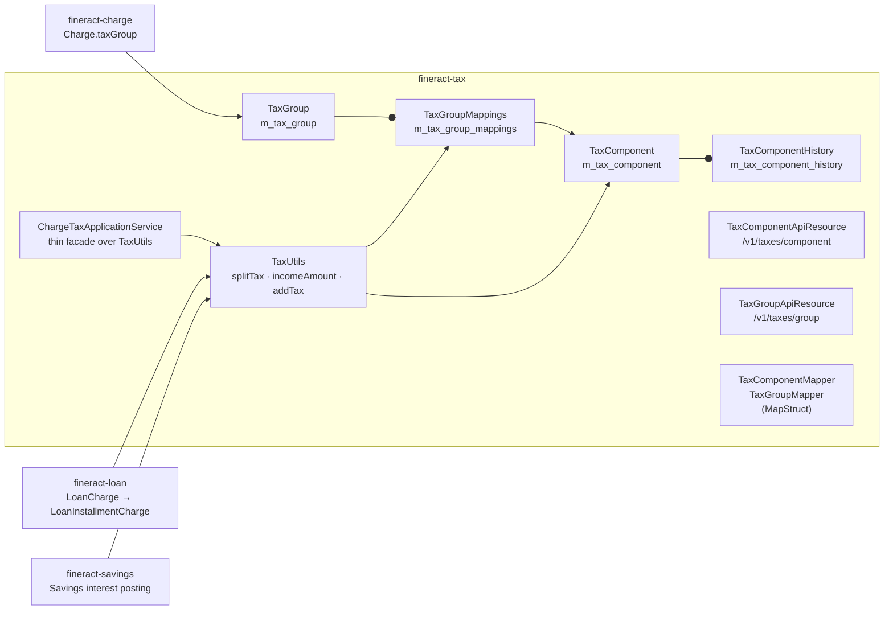
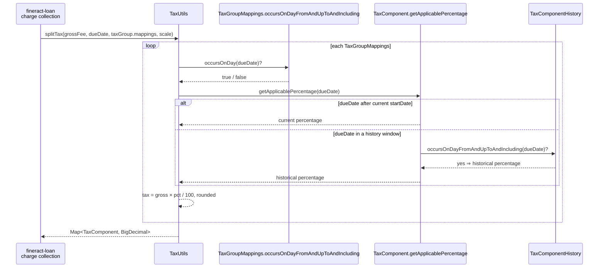

The [`fineract-tax`](https://github.com/apache/fineract/tree/develop/fineract-tax) module is Apache Fineract's solution to a problem every MFI eventually hits: the same fee or interest amount needs to be split across multiple tax buckets (VAT, GST, service tax, cess, etc.), each with its own percentage, its own start/end date, and its own GL posting accounts. A `TaxComponent` is a single such bucket; a `TaxGroup` is an ordered set of components that together decompose one base amount. The module exposes them via two REST resources — `/v1/taxes/component` and `/v1/taxes/group` — and exports the `TaxUtils.splitTax(...)` static helper that **every** consumer (charge collection, savings interest posting, loan fee posting) calls when the time comes to break a gross amount apart.

This page is the map. The next page ([Tax Component and Group](/tax/tax-component-and-group)) drills into the JPA entities and the two API resources.

## What problem it solves

A loan disbursement fee of `100.00 USD` may, in a given jurisdiction on a given date, decompose as:

- `Service Tax` 14% → `14.00`
- `Swachh Bharat Cess` 0.5% → `0.50`
- `Krishi Kalyan Cess` 0.5% → `0.50`
- ⇒ net fee income: `85.00`, tax payable: `15.00`.

Rates change over time. The same `TaxComponent` row must continue to settle historical postings against its old percentage, while new postings use the new percentage. The same `TaxGroup` can swap a deprecated component out for a new one without altering the historical mapping.

`fineract-tax` encodes that with three entities:

| Entity | Role |
|--------|------|
| `TaxComponent` (`m_tax_component`) | One named percentage with a `startDate`, plus an optional debit/credit GL account pair and an audit trail of past `(percentage, start, end)` triples in `m_tax_component_history` |
| `TaxGroup` (`m_tax_group`) | Named bundle (e.g. `"GST 15%"`) that owns a `Set<TaxGroupMappings>` |
| `TaxGroupMappings` (`m_tax_group_mappings`) | Effective-dated link between a `TaxGroup` and a `TaxComponent` with its own `startDate` / `endDate` window |

So a tax group is *not* simply a collection of components — it is a collection of **time windows**, and each window points at a component that itself carries a history of percentage changes. The matching algorithm at posting time walks both: pick the active `TaxGroupMappings` for the effective date, then ask `TaxComponent.getApplicablePercentage(date)` which walks the component's own history.

## Module map



Where consumers plug in:

- **Charges** — `Charge.taxGroup` is a `@ManyToOne` to `TaxGroup`. When a `LoanCharge` is paid, `fineract-loan` consults `Charge.getTaxGroup()` and calls `TaxUtils.splitTax(...)` to derive the per-component tax amounts.
- **Savings products** — `SavingsProduct.taxGroup` (in `fineract-savings`) is the same idea applied to interest credited on savings accounts: when interest posts, the savings module splits the gross interest into `TaxComponent` deductions.
- **Loan products** — `LoanProduct.taxGroup` performs the symmetric job for interest charged on loan installments.

In all three cases the call site is identical: build a `Set<TaxGroupMappings>` from the entity, pass the gross amount and the effective date to `TaxUtils.splitTax(...)`, and receive a `Map<TaxComponent, BigDecimal>` of per-component tax amounts to post.

## Package layout

`fineract-tax/src/main/java/org/apache/fineract/portfolio/tax/`:

| Subpackage | Notable contents |
|------------|------------------|
| `api/` | `TaxComponentApiResource` (`/v1/taxes/component`), `TaxGroupApiResource` (`/v1/taxes/group`), `TaxApiConstants` parameter-name constants, Swagger DTOs |
| `domain/` | `TaxComponent`, `TaxComponentHistory`, `TaxGroup`, `TaxGroupMappings`, plus the `*Repository` / `*RepositoryWrapper` pairs |
| `exception/` | `TaxComponentNotFoundException`, `TaxGroupNotFoundException`, `TaxMappingNotFoundException` |
| `handler/` | `CreateTaxComponentCommandHandler`, `UpdateTaxComponentCommandHandler`, `CreateTaxGroupCommandHandler`, `UpdateTaxGroupCommandHandler` — all wired by `@CommandType(entity, action)` |
| `mapper/` | MapStruct entity → DTO mappers: `TaxComponentMapper`, `TaxGroupMapper`, `TaxGroupMappingsMapper` |
| `serialization/` | `TaxComponentDataValidator`, `TaxGroupDataValidator` (DataValidatorBuilder–based JSON validation) |
| `service/` | `TaxReadPlatformService`, `TaxWritePlatformService`, `TaxUtils` (the static math), `ChargeTaxApplicationService` |

Other modules (loan, savings) hold their own *attachment* and *posting* code; `fineract-tax` only owns the catalogue + the math.

## What a `TaxComponent` looks like

`fineract-tax/.../domain/TaxComponent.java`:

```java
@Entity
@Getter
@Table(name = "m_tax_component")
public class TaxComponent extends AbstractAuditableCustom {
    @Column(name = "name", length = 100)                 private String name;
    @Column(name = "percentage", scale = 6, precision = 19, nullable = false)
                                                         private BigDecimal percentage;
    @Column(name = "debit_account_type_enum")            private Integer debitAccountType;
    @ManyToOne @JoinColumn(name = "debit_account_id")    private GLAccount debitAccount;
    @Column(name = "credit_account_type_enum")           private Integer creditAccountType;
    @ManyToOne @JoinColumn(name = "credit_account_id")   private GLAccount creditAccount;
    @Column(name = "start_date", nullable = false)       private LocalDate startDate;
    @OneToMany(cascade = CascadeType.ALL, orphanRemoval = true, fetch = FetchType.EAGER)
    @JoinColumn(name = "tax_component_id", referencedColumnName = "id", nullable = false)
                                                         private Set<TaxComponentHistory> taxComponentHistories = new HashSet<>();
    @OneToMany(cascade = CascadeType.DETACH, mappedBy = "taxComponent", orphanRemoval = false, fetch = FetchType.EAGER)
                                                         private Set<TaxGroupMappings> taxGroupMappings = new HashSet<>();
}
```

Key behaviours:

- **Percentage** is the *current* value. When `update(...)` receives a new percentage, the old `(percentage, oldStart, newStart)` triple is rolled into a new `TaxComponentHistory` and the current `percentage` + `startDate` are replaced.
- **`getApplicablePercentage(date)`** drives the math:

  ```java
  public BigDecimal getApplicablePercentage(final LocalDate date) {
      BigDecimal percentage = null;
      if (occursOnDayFrom(date)) {
          percentage = getPercentage();
      } else {
          for (TaxComponentHistory componentHistory : taxComponentHistories) {
              if (componentHistory.occursOnDayFromAndUpToAndIncluding(date)) {
                  percentage = componentHistory.getPercentage();
                  break;
              }
          }
      }
      return percentage;
  }
  ```

  `occursOnDayFrom(target)` is `DateUtils.isAfter(target, startDate())`, so the **current** percentage is only applied to dates strictly after the current start date. The history rows cover everything before. A date that predates *all* known start dates returns `null` and the component is effectively absent for that date.

- **GL accounts** (`debitAccount`, `creditAccount`) are optional. When set, they tell the accounting layer where to post the tax debit and the tax credit. The `*_account_type_enum` columns store the `GLAccountType` for templating.

`TaxComponentHistory` (`fineract-tax/.../domain/TaxComponentHistory.java`) is a closed window:

```java
public boolean occursOnDayFromAndUpToAndIncluding(final LocalDate target) {
    return DateUtils.isAfter(target, startDate())
        && (endDate == null || !DateUtils.isAfter(target, endDate()));
}
```

## What a `TaxGroup` looks like

`fineract-tax/.../domain/TaxGroup.java`:

```java
@Entity
@Table(name = "m_tax_group")
public class TaxGroup extends AbstractAuditableCustom {
    @Column(name = "name", length = 100)
    private String name;

    @OneToMany(cascade = CascadeType.ALL, orphanRemoval = true, fetch = FetchType.EAGER, mappedBy = "taxGroup")
    private Set<TaxGroupMappings> taxGroupMappings = new HashSet<>();
}
```

The group is essentially a named container of `TaxGroupMappings`. `update(...)` is **append-only / end-date-only**: existing mappings cannot be removed or have their `taxComponent`, `startDate` changed; only `endDate` can be set, and new mappings (with new components) can be added. That preserves historical accuracy.

`TaxGroupMappings` (`fineract-tax/.../domain/TaxGroupMappings.java`):

```java
@Entity
@Table(name = "m_tax_group_mappings")
public class TaxGroupMappings extends AbstractAuditableCustom {
    @ManyToOne @JoinColumn(name = "tax_group_id", nullable = false)     private TaxGroup taxGroup;
    @ManyToOne @JoinColumn(name = "tax_component_id", nullable = false) private TaxComponent taxComponent;
    @Column(name = "start_date", nullable = false)                      private LocalDate startDate;
    @Column(name = "end_date", nullable = true)                         private LocalDate endDate;

    public boolean occursOnDayFromAndUpToAndIncluding(final LocalDate target) {
        return DateUtils.isAfter(target, startDate())
            && (endDate == null || !DateUtils.isAfter(target, endDate()));
    }
}
```

A `null` `endDate` means *open-ended*.

## The math: `TaxUtils.splitTax(...)`

`fineract-tax/.../service/TaxUtils.java` is the canonical decomposition algorithm. It is stateless and side-effect-free, which is why it is a `final class` with a private constructor and only `static` methods. The core split:

```java
public static Map<TaxComponent, BigDecimal> splitTax(final BigDecimal amount, final LocalDate date,
        final Set<TaxGroupMappings> taxGroupMappings, final int scale) {
    Map<TaxComponent, BigDecimal> map = new HashMap<>(3);
    if (amount != null) {
        final double amountVal = amount.doubleValue();
        double cent_percentage = Double.parseDouble("100.0");
        for (TaxGroupMappings groupMappings : taxGroupMappings) {
            if (groupMappings.occursOnDayFromAndUpToAndIncluding(date)) {
                TaxComponent component = groupMappings.getTaxComponent();
                BigDecimal percentage = component.getApplicablePercentage(date);
                if (percentage != null) {
                    double percentageVal = percentage.doubleValue();
                    double tax = amountVal * percentageVal / cent_percentage;
                    map.put(component, BigDecimal.valueOf(tax).setScale(scale, MoneyHelper.getRoundingMode()));
                }
            }
        }
    }
    return map;
}
```

Three related helpers complete the surface:

- `incomeAmount(amount, date, mappings, scale)` — the *net* amount the institution actually keeps after deducting all components for that date.
- `totalTaxAmount(map)` — sum of component values; symmetrical for `totalTaxDataAmount(...)` over the `TaxComponentData` DTO map.
- `addTax(amount, date, mappings, scale)` — the *gross-up* operation: given an amount that is **net of tax**, compute what the gross would be so that gross × (1 − Σpercentages/100) = net. Used when product config says `chargeIncludesTax=false` and the user-entered amount is the customer-facing net.

The rounding mode used by `setScale(...)` is whatever `MoneyHelper.getRoundingMode()` is configured to return globally (typically `HALF_EVEN`).

### The "percent of charge" sequence



The thin Spring façade `ChargeTaxApplicationServiceImpl` lets non-static callers in other Spring contexts depend on a real bean:

```java
@Service
public class ChargeTaxApplicationServiceImpl implements ChargeTaxApplicationService {
    @Override
    public Map<TaxComponent, BigDecimal> computeTax(final TaxGroup taxGroup, final BigDecimal baseAmount,
            final LocalDate effectiveDate, final int scale) {
        if (taxGroup == null || baseAmount == null || baseAmount.compareTo(BigDecimal.ZERO) == 0) {
            return Collections.emptyMap();
        }
        return TaxUtils.splitTax(baseAmount, effectiveDate, taxGroup.getTaxGroupMappings(), scale);
    }
}
```

## REST surface

Two thin JAX-RS resources, both following the standard Apache Fineract pattern (read = JDBC-backed service, write = `CommandWrapperBuilder` → `PortfolioCommandSourceWritePlatformService`):

| Resource | Path | Permission resource |
|----------|------|---------------------|
| `TaxComponentApiResource` | `/v1/taxes/component` | `TAXCOMPONENT` |
| `TaxGroupApiResource` | `/v1/taxes/group` | `TAXGROUP` |

Each supports:

- `GET /` — list all.
- `GET /{id}` — single (group supports `?template=true` to merge with the create-template dropdowns).
- `GET /template` — dropdown options for the UI.
- `POST /` — create.
- `PUT /{id}` — update. **No DELETE** — tax catalogues are not deleted, only their `endDate` is set.

The four command handlers all live in `fineract-tax/.../handler/`:

| Class | `@CommandType` |
|-------|----------------|
| `CreateTaxComponentCommandHandler` | `TAXCOMPONENT / CREATE` |
| `UpdateTaxComponentCommandHandler` | `TAXCOMPONENT / UPDATE` |
| `CreateTaxGroupCommandHandler` | `TAXGROUP / CREATE` |
| `UpdateTaxGroupCommandHandler` | `TAXGROUP / UPDATE` |

Each is a one-liner delegating to `TaxWritePlatformService.createTaxComponent / updateTaxComponent / createTaxGroup / updateTaxGroup`.

## Mappers (MapStruct)

`fineract-tax/.../mapper/` contains three MapStruct interfaces wired by `MapstructMapperConfig`:

- `TaxComponentMapper` — `TaxComponent → TaxComponentData`, ignoring the dropdown options (those are added later by the read service).
- `TaxGroupMapper` — `TaxGroup → TaxGroupData`, mapping the `taxGroupMappings` set into `taxAssociations`.
- `TaxGroupMappingsMapper` — `TaxGroupMappings → TaxGroupMappingsData`, used by the group mapper.

The mappers are MapStruct-only (no hand-written body), so the conversions are generated at compile time under `build/generated/sources/annotationProcessor/`. See [Tax Component and Group](/tax/tax-component-and-group) for the full mapper definitions and what each `@Mapping` does.

## Where tax plugs in elsewhere

<CardGroup cols={2}>
  <Card title="On a Charge" icon="receipt">
    `Charge.taxGroup` is a `@ManyToOne TaxGroup`. When a fee is posted, `fineract-loan` / `fineract-savings` call `TaxUtils.splitTax(grossFee, effectiveDate, charge.getTaxGroup().getTaxGroupMappings(), currency.scale)`. The `chargeIncludesTax` flag (`TaxApiConstants.chargeIncludesTaxParamName`) on the product mapping controls whether the amount on the charge is gross (use `splitTax`) or net (use `addTax` first).
  </Card>
  <Card title="On a Savings product" icon="piggy-bank">
    `SavingsProduct.taxGroup` lets you tax credited interest. The withholding-tax model: gross interest is split through `TaxUtils.splitTax`, each component amount is debited from the savings customer's interest credit before the net hits the account.
  </Card>
  <Card title="On a Loan product" icon="hand-holding-dollar">
    `LoanProduct.taxGroup` lets you tax interest charged. Per-installment interest is split through `TaxUtils.splitTax`; the per-component result is recorded against `LoanInstallmentCharge`-equivalent tax detail rows and posted via the accounting integration.
  </Card>
  <Card title="On a SavingsAccountCharge" icon="circle-dollar-to-slot">
    The per-account charge inherits the catalogue charge's `taxGroup`. The savings transaction posting layer reads it directly off the snapshot — once a tax group is associated with a transaction, the historical split is locked in.
  </Card>
</CardGroup>

## Exceptions

- `TaxComponentNotFoundException` — `taxComponentId` unknown. Mapped to 404.
- `TaxGroupNotFoundException` — `taxGroupId` unknown.
- `TaxMappingNotFoundException` — used by `TaxGroup.findOneBy(...)` when an inbound update references a `TaxGroupMappings.id` that doesn't belong to the group.

All three extend the `fineract-core` `AbstractPlatform*Exception` hierarchy and are mapped to HTTP status codes by `org.apache.fineract.infrastructure.core.exceptionmapper`.

## What's *not* in `fineract-tax`

- **Withholding-tax posting logic** — lives in `fineract-savings` (interest posting) and `fineract-loan` (installment interest). `fineract-tax` only computes `Map<TaxComponent, BigDecimal>`; the GL postings happen in the accounting integration of the consuming module.
- **The `chargeIncludesTax` flag** is set on `ProductChargeMapping`-style rows in `fineract-loan` / `fineract-savings`, not on `Charge` itself.
- **Tax reporting** — there are no aggregated tax-report endpoints in this module; reports run from the data tables and the standard reporting infrastructure (`fineract-provider/.../infrastructure/dataqueries/`).

## Where to read next

<CardGroup cols={2}>
  <Card title="TaxComponent and TaxGroup" icon="code" href="/tax/tax-component-and-group">
    Full JPA mappings, the two REST resources endpoint-by-endpoint, the MapStruct mappers, and the percent-of-charge calculation worked through.
  </Card>
  <Card title="Charges overview" icon="receipt" href="/charges/overview">
    Where `Charge.taxGroup` plugs in.
  </Card>
</CardGroup>
