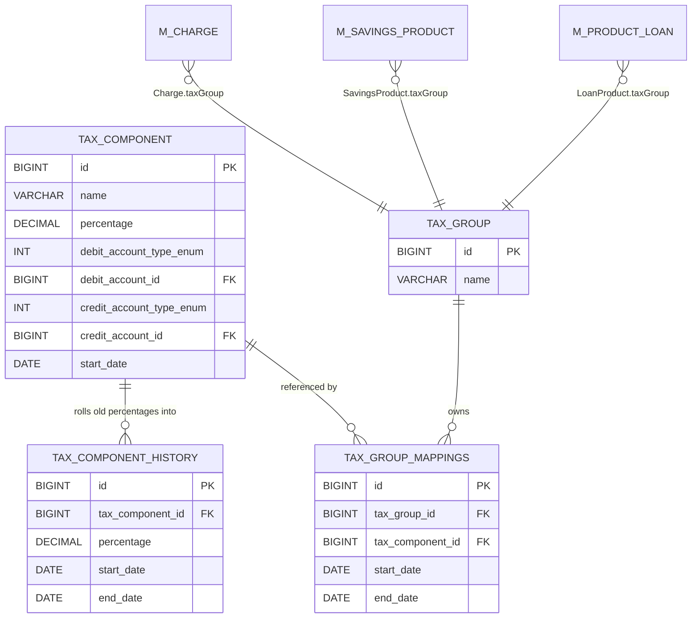

This page is the working reference for the `fineract-tax` module: the entities (`TaxComponent`, `TaxComponentHistory`, `TaxGroup`, `TaxGroupMappings`), the two REST resources (`TaxComponentApiResource`, `TaxGroupApiResource`), the four `@CommandType` handlers, the MapStruct mappers, and the percent-of-charge math taken end-to-end. All paths are relative to `fineract-tax/src/main/java/org/apache/fineract/portfolio/tax/`.

For *why* the module exists and how it plugs into charges / savings / loans, see the [Tax overview](/tax/overview).

## Entity ER diagram



## `TaxComponent` — the field-by-field walkthrough

`fineract-tax/.../domain/TaxComponent.java`:

```java
@Entity @Getter
@Table(name = "m_tax_component")
public class TaxComponent extends AbstractAuditableCustom {

    @Column(name = "name", length = 100)                 private String name;
    @Column(name = "percentage", scale = 6, precision = 19, nullable = false)
                                                         private BigDecimal percentage;
    @Column(name = "debit_account_type_enum")            private Integer debitAccountType;
    @ManyToOne @JoinColumn(name = "debit_account_id")    private GLAccount debitAccount;
    @Column(name = "credit_account_type_enum")           private Integer creditAccountType;
    @ManyToOne @JoinColumn(name = "credit_account_id")   private GLAccount creditAccount;
    @Column(name = "start_date", nullable = false)       private LocalDate startDate;

    @OneToMany(cascade = CascadeType.ALL, orphanRemoval = true, fetch = FetchType.EAGER)
    @JoinColumn(name = "tax_component_id", referencedColumnName = "id", nullable = false)
    private Set<TaxComponentHistory> taxComponentHistories = new HashSet<>();

    @OneToMany(cascade = CascadeType.DETACH, mappedBy = "taxComponent",
               orphanRemoval = false, fetch = FetchType.EAGER)
    private Set<TaxGroupMappings> taxGroupMappings = new HashSet<>();
}
```

Notes:

- Extends `AbstractAuditableCustom` (from `fineract-core`) — gives `id`, `createdBy`, `createdDate`, `lastModifiedBy`, `lastModifiedDate`.
- `percentage` precision: 19 digits, scale 6. The actual numbers stored are e.g. `15.000000` for 15% or `0.500000` for 0.5%.
- `debitAccount` and `creditAccount` are optional. When set, they wire into the accounting layer: tax collected debits one account (typically a tax liability or expense) and credits another (typically tax payable). The `*_account_type_enum` columns store the `GLAccountType` value for templating dropdowns.
- `taxComponentHistories` is `CascadeType.ALL` + `orphanRemoval = true` + eager — saving a component cascades to its history, and the entity owns the history rows. The reverse side (mappings) is `CascadeType.DETACH` because a mapping has its own lifecycle owned by the group.

### Factory and update

```java
public static TaxComponent createTaxComponent(final String name, final BigDecimal percentage,
        final GLAccountType debitAccountType, final GLAccount debitAccount,
        final GLAccountType creditAccountType, final GLAccount creditAccount, final LocalDate startDate) {
    return new TaxComponent(name, percentage, debitAccountType, debitAccount,
            creditAccountType, creditAccount, startDate);
}

public Map<String, Object> update(final JsonCommand command) {
    final Map<String, Object> changes = new HashMap<>();

    if (command.isChangeInStringParameterNamed(TaxApiConstants.nameParamName, this.name)) {
        final String newValue = command.stringValueOfParameterNamed(TaxApiConstants.nameParamName);
        changes.put(TaxApiConstants.nameParamName, newValue);
        this.name = StringUtils.defaultIfEmpty(newValue, null);
    }

    if (command.isChangeInBigDecimalParameterNamed(TaxApiConstants.percentageParamName, this.percentage)) {
        final BigDecimal newValue = command.bigDecimalValueOfParameterNamed(TaxApiConstants.percentageParamName);
        changes.put(TaxApiConstants.percentageParamName, newValue);

        LocalDate oldStartDate = this.startDate;
        updateStartDate(command, changes, true);
        LocalDate newStartDate = this.startDate;

        TaxComponentHistory history = TaxComponentHistory.createTaxComponentHistory(this.percentage, oldStartDate, newStartDate);
        this.taxComponentHistories.add(history);
        this.percentage = newValue;
    }
    return changes;
}
```

This is the key invariant: changing `percentage` always emits a new `TaxComponentHistory(oldPercentage, oldStartDate, newStartDate)` row. Past postings can still query the old rate via `getApplicablePercentage(date)`.

The debit/credit account fields are **immutable** — there is no `update(...)` path for them. The `TaxComponentApiResource.updateTaxCompoent(...)` Swagger description spells this out: *"Updates Tax component. Debit and credit account details cannot be modified. All the future tax components would be replaced with the new percentage."*

### `getApplicablePercentage(date)` walkthrough

```java
public BigDecimal getApplicablePercentage(final LocalDate date) {
    BigDecimal percentage = null;
    if (occursOnDayFrom(date)) {                          // date strictly after current startDate
        percentage = getPercentage();                     // → current rate
    } else {
        for (TaxComponentHistory componentHistory : taxComponentHistories) {
            if (componentHistory.occursOnDayFromAndUpToAndIncluding(date)) {
                percentage = componentHistory.getPercentage();
                break;
            }
        }
    }
    return percentage;
}

private boolean occursOnDayFrom(final LocalDate target) {
    return DateUtils.isAfter(target, startDate());        // exclusive of startDate
}
```

Worked example. Say the `GST` component was created on `2022-01-01` at 18%, then updated on `2024-04-01` to 20%. The current state:

- `percentage = 20`, `startDate = 2024-04-01`.
- one `TaxComponentHistory` row: `percentage = 18`, `startDate = 2022-01-01`, `endDate = 2024-04-01`.

| `date` | branch | result |
|--------|--------|--------|
| `2025-06-10` | `isAfter(date, 2024-04-01)` → true | `20` (current) |
| `2024-04-01` | `isAfter(...)` → false; history `isAfter(2024-04-01, 2022-01-01) && !isAfter(2024-04-01, 2024-04-01)` → true | `18` (boundary day = previous rate) |
| `2023-11-15` | history range hit | `18` |
| `2021-12-30` | history range miss (`isAfter(2021-12-30, 2022-01-01)` is false) | `null` (no rate yet) |

## `TaxComponentHistory`

`fineract-tax/.../domain/TaxComponentHistory.java`:

```java
@Entity
@Table(name = "m_tax_component_history")
public class TaxComponentHistory extends AbstractAuditableCustom {
    @Column(name = "percentage", scale = 6, precision = 19, nullable = false)
    private BigDecimal percentage;

    @Column(name = "start_date", nullable = false)
    private LocalDate startDate;

    @Column(name = "end_date", nullable = false)
    private LocalDate endDate;

    public boolean occursOnDayFromAndUpToAndIncluding(final LocalDate target) {
        return DateUtils.isAfter(target, startDate())
            && (endDate == null || !DateUtils.isAfter(target, endDate()));
    }
}
```

Notes:

- `end_date` is marked `nullable = false` on the column, but the helper allows for `endDate == null` defensively. In practice every history row has both `startDate` and `endDate` because a history row is only created on a percentage change.
- The window is half-open at the left (`isAfter(target, startDate)` — strict) and inclusive at the right (`!isAfter(target, endDate)`), so the right boundary day uses the older rate. This matches the rule that *the new rate is effective the day after the configured start*.

## `TaxGroup`

`fineract-tax/.../domain/TaxGroup.java`:

```java
@Entity
@Table(name = "m_tax_group")
public class TaxGroup extends AbstractAuditableCustom {

    @Column(name = "name", length = 100)  private String name;

    @OneToMany(cascade = CascadeType.ALL, orphanRemoval = true,
               fetch = FetchType.EAGER, mappedBy = "taxGroup")
    private Set<TaxGroupMappings> taxGroupMappings = new HashSet<>();

    public Map<String, Object> update(final JsonCommand command, final Set<TaxGroupMappings> taxGroupMappings) {
        final Map<String, Object> changes = new HashMap<>();
        if (command.isChangeInStringParameterNamed(TaxApiConstants.nameParamName, this.name)) {
            final String newValue = command.stringValueOfParameterNamed(TaxApiConstants.nameParamName);
            changes.put(TaxApiConstants.nameParamName, newValue);
            this.name = StringUtils.defaultIfEmpty(newValue, null);
        }
        List<Long> taxComponentList = new ArrayList<>();
        final List<Map<String, Object>> modifications = new ArrayList<>();

        for (TaxGroupMappings groupMappings : taxGroupMappings) {
            TaxGroupMappings mappings = findOneBy(groupMappings);
            if (mappings == null) {                             // brand-new mapping in the request
                this.taxGroupMappings.add(groupMappings);
                taxComponentList.add(groupMappings.getTaxComponent().getId());
            } else {                                            // existing mapping
                mappings.update(groupMappings.getEndDate(), modifications);
            }
        }
        if (!taxComponentList.isEmpty()) changes.put("addComponents", taxComponentList);
        if (!modifications.isEmpty())    changes.put("modifiedComponents", modifications);
        return changes;
    }
}
```

The update semantics are intentionally restricted:

1. **Add** — any inbound `TaxGroupMappings` whose `id` is unknown is appended (new component starts contributing as of its `startDate`).
2. **End-date existing** — any inbound mapping with a known `id` only causes `endDate` to be set if it wasn't already set (see `TaxGroupMappings.update(...)` below). Once end-dated, a mapping stops contributing on its `endDate + 1`.
3. **No removal, no start-date edits, no component swap** — the entity simply does not expose those mutators. If you got the start date wrong, you fix it via a SQL migration, not the API.

`findOneBy(TaxGroupMappings)` is a lookup by id within the set; throws `TaxMappingNotFoundException` if the inbound id isn't part of the group:

```java
public TaxGroupMappings findOneBy(final TaxGroupMappings groupMapping) {
    if (groupMapping.getId() != null) {
        for (TaxGroupMappings groupMappings : this.taxGroupMappings) {
            if (groupMappings.getId().equals(groupMapping.getId())) return groupMappings;
        }
        throw new TaxMappingNotFoundException(groupMapping.getId());
    }
    return null;
}
```

## `TaxGroupMappings`

`fineract-tax/.../domain/TaxGroupMappings.java`:

```java
@Entity @Getter
@Table(name = "m_tax_group_mappings")
public class TaxGroupMappings extends AbstractAuditableCustom {

    @ManyToOne @JoinColumn(name = "tax_group_id", nullable = false)     private TaxGroup taxGroup;
    @ManyToOne @JoinColumn(name = "tax_component_id", nullable = false) private TaxComponent taxComponent;
    @Column(name = "start_date", nullable = false)                      private LocalDate startDate;
    @Column(name = "end_date", nullable = true)                         private LocalDate endDate;

    public static TaxGroupMappings createTaxGroupMappings(final TaxComponent taxComponent, final LocalDate startDate) {
        return new TaxGroupMappings(taxComponent, startDate, null);
    }
    public static TaxGroupMappings createTaxGroupMappings(final Long id, final TaxComponent taxComponent, final LocalDate endDate) {
        TaxGroupMappings m = new TaxGroupMappings(taxComponent, null, endDate);
        m.setId(id);
        return m;
    }

    public void update(final LocalDate endDate, final List<Map<String, Object>> changes) {
        if (endDate != null && this.endDate == null) {
            this.endDate = endDate;
            Map<String, Object> map = new HashMap<>(2);
            map.put(TaxApiConstants.endDateParamName, endDate);
            map.put(TaxApiConstants.taxComponentIdParamName, this.getTaxComponent().getId());
            changes.add(map);
        }
    }

    public boolean occursOnDayFromAndUpToAndIncluding(final LocalDate target) {
        return DateUtils.isAfter(target, startDate())
            && (endDate == null || !DateUtils.isAfter(target, endDate()));
    }
}
```

The two static factories handle the "new mapping" vs "end-date an existing mapping" cases. `update(...)` is **idempotent and one-way**: it only sets `endDate` if currently `null`. There is no re-opening.

`occursOnDayFromAndUpToAndIncluding(target)` mirrors the history rule — strict on the left, inclusive on the right; a `null` endDate means open-ended.

## REST: `/v1/taxes/component`

`fineract-tax/.../api/TaxComponentApiResource.java`

| Method | Path | Operation |
|--------|------|-----------|
| `GET` | `/v1/taxes/component` | `retrieveAllTaxComponents()` |
| `GET` | `/v1/taxes/component/{id}` | `retrieveTaxComponent(id)` |
| `GET` | `/v1/taxes/component/template` | `retrieveTemplate()` |
| `POST` | `/v1/taxes/component` | `createTaxComponent(TaxComponentRequest)` → `TAXCOMPONENT/CREATE` |
| `PUT` | `/v1/taxes/component/{id}` | `updateTaxCompoent(id, TaxComponentRequest)` → `TAXCOMPONENT/UPDATE` |

Permission resource: `"TAXCOMPONENT"`. Note that the create Swagger op states:

> Mandatory Fields: `name`, `percentage`.
> Optional Fields: `debitAccountType`, `debitAccountId`, `creditAccountType`, `creditAccountId`, `startDate`.

The `startDate` defaults to `DateUtils.getBusinessLocalDate()` if omitted — see `TaxComponent.updateStartDate(...)`.

The write resources delegate uniformly:

```java
final CommandWrapper commandRequest = new CommandWrapperBuilder().createTaxComponent()
    .withJson(toApiJsonSerializer.serialize(taxComponentRequest)).build();
return commandsSourceWritePlatformService.logCommandSource(commandRequest);
```

## REST: `/v1/taxes/group`

`fineract-tax/.../api/TaxGroupApiResource.java`

| Method | Path | Operation |
|--------|------|-----------|
| `GET` | `/v1/taxes/group` | `retrieveAllTaxGroups()` |
| `GET` | `/v1/taxes/group/{id}` | `retrieveTaxGroup(id)`; if `?template=true` merges with `retrieveTaxGroupTemplate()` |
| `GET` | `/v1/taxes/group/template` | `retrieveTemplate()` — dropdowns of components |
| `POST` | `/v1/taxes/group` | `createTaxGroup(TaxGroupRequest)` → `TAXGROUP/CREATE` |
| `PUT` | `/v1/taxes/group/{id}` | `updateTaxGroup(id, TaxGroupRequest)` → `TAXGROUP/UPDATE` |

Permission resource: `"TAXGROUP"`. Swagger:

> Mandatory Fields: `name` and `taxComponents`.
> Mandatory Fields in taxComponents: `taxComponentId`.
> Optional Fields in taxComponents: `id`, `startDate` and `endDate`.

Update op:

> Updates Tax Group. Only end date can be up-datable and can insert new tax components.

— this is the API contract that backs the `TaxGroup.update(...)` invariants.

## Command handlers

All four under `fineract-tax/.../handler/`:

```java
@Service
@CommandType(entity = "TAXCOMPONENT", action = "CREATE")
public class CreateTaxComponentCommandHandler implements NewCommandSourceHandler {
    private final TaxWritePlatformService taxWritePlatformService;
    @Override
    public CommandProcessingResult processCommand(JsonCommand jsonCommand) {
        return this.taxWritePlatformService.createTaxComponent(jsonCommand);
    }
}

@Service
@CommandType(entity = "TAXCOMPONENT", action = "UPDATE")
public class UpdateTaxComponentCommandHandler implements NewCommandSourceHandler {
    @Override
    public CommandProcessingResult processCommand(JsonCommand jsonCommand) {
        return this.taxWritePlatformService.updateTaxComponent(jsonCommand.entityId(), jsonCommand);
    }
}

@Service
@CommandType(entity = "TAXGROUP", action = "CREATE")
public class CreateTaxGroupCommandHandler implements NewCommandSourceHandler {
    @Override
    public CommandProcessingResult processCommand(JsonCommand jsonCommand) {
        return this.taxWritePlatformService.createTaxGroup(jsonCommand);
    }
}

@Service
@CommandType(entity = "TAXGROUP", action = "UPDATE")
public class UpdateTaxGroupCommandHandler implements NewCommandSourceHandler {
    @Override
    public CommandProcessingResult processCommand(JsonCommand jsonCommand) {
        return this.taxWritePlatformService.updateTaxGroup(jsonCommand.entityId(), jsonCommand);
    }
}
```

Each is `@AllArgsConstructor` (Lombok) so the `TaxWritePlatformService` bean is injected via constructor. Routing is via `CommandHandlerProvider` from `fineract-command`, indexed on `(entity, action)`.

## MapStruct mappers

`fineract-tax/.../mapper/` contains three generated mappers:

`TaxComponentMapper`:

```java
@Mapper(config = MapstructMapperConfig.class, uses = { GlAccountMapper.class, GlAccountTypeMapper.class })
public interface TaxComponentMapper {
    @Mapping(target = "creditAccount",       source = "taxComponent.creditAccount")
    @Mapping(target = "debitAccount",        source = "taxComponent.debitAccount")
    @Mapping(target = "creditAccountType",   source = "taxComponent.creditAccountType")
    @Mapping(target = "debitAccountType",    source = "taxComponent.debitAccountType")
    @Mapping(target = "glAccountOptions",     ignore = true)
    @Mapping(target = "glAccountTypeOptions", ignore = true)
    @Mapping(target = "taxComponentHistories", ignore = true)
    TaxComponentData map(TaxComponent taxComponent);

    List<TaxComponentData> map(List<TaxComponent> taxComponents);
}
```

The dropdown options and the history list are **ignored** in the mapper because they are not part of the persistent shape; the read service supplies them when the template query parameter is set.

`TaxGroupMapper`:

```java
@Mapper(config = MapstructMapperConfig.class, uses = { TaxGroupMappingsMapper.class })
public interface TaxGroupMapper {
    @Mapping(target = "taxAssociations", source = "taxGroup.taxGroupMappings")
    @Mapping(target = "taxComponents",   ignore = true)
    TaxGroupData map(TaxGroup taxGroup);

    List<TaxGroupData> map(List<TaxGroup> taxGroups);
}
```

The persisted mappings become the `taxAssociations` field on the DTO; `taxComponents` (the dropdown list for the create UI) is ignored and filled in by the read service.

`TaxGroupMappingsMapper`:

```java
@Mapper(config = MapstructMapperConfig.class, uses = { TaxComponentMapper.class })
public interface TaxGroupMappingsMapper {
    TaxGroupMappingsData map(TaxGroupMappings taxGroupMapping);
    List<TaxGroupMappingsData> map(List<TaxGroupMappings> taxGroupMappings);
}
```

All-default mapping: `id`, `startDate`, `endDate`, and `taxComponent` (recursed via `TaxComponentMapper`).

## `TaxUtils` — the percent-of-charge math

`fineract-tax/.../service/TaxUtils.java` (entire surface):

| Method | Returns | What it does |
|--------|---------|--------------|
| `splitTax(amount, date, mappings, scale)` | `Map<TaxComponent, BigDecimal>` | for each active mapping → component, `tax = amount × pct / 100`, rounded to `scale` |
| `splitTaxData(amount, date, mappings, scale)` | `Map<TaxComponentData, BigDecimal>` | same but over the DTO type, for use in read-side previews |
| `incomeAmount(amount, date, mappings, scale)` | `BigDecimal` | `amount - sum(splitTax)` |
| `incomeAmount(amount, map)` | `BigDecimal` | same, given an already-computed map |
| `totalTaxAmount(map)` | `BigDecimal` | sum of the entity-keyed map values |
| `totalTaxDataAmount(map)` | `BigDecimal` | sum of the DTO-keyed map values |
| `addTax(amount, date, mappings, scale)` | `BigDecimal` | gross-up: `amount × 100 / (100 - Σpct)`, rounded |

### `splitTax` source

```java
public static Map<TaxComponent, BigDecimal> splitTax(final BigDecimal amount, final LocalDate date,
        final Set<TaxGroupMappings> taxGroupMappings, final int scale) {
    Map<TaxComponent, BigDecimal> map = new HashMap<>(3);
    if (amount != null) {
        final double amountVal = amount.doubleValue();
        double cent_percentage = Double.parseDouble("100.0");
        for (TaxGroupMappings groupMappings : taxGroupMappings) {
            if (groupMappings.occursOnDayFromAndUpToAndIncluding(date)) {
                TaxComponent component = groupMappings.getTaxComponent();
                BigDecimal percentage = component.getApplicablePercentage(date);
                if (percentage != null) {
                    double percentageVal = percentage.doubleValue();
                    double tax = amountVal * percentageVal / cent_percentage;
                    map.put(component, BigDecimal.valueOf(tax).setScale(scale, MoneyHelper.getRoundingMode()));
                }
            }
        }
    }
    return map;
}
```

- `scale` is the currency's decimal places (`ApplicationCurrency.decimalPlaces`).
- `MoneyHelper.getRoundingMode()` is a global setting (defaults to `HALF_EVEN`).
- The double arithmetic in the middle is fine for ledger-sized amounts but rounds **once** per component at the end. Sum-of-components is not guaranteed to equal `splitTax(amount).sum`-style rounding — `incomeAmount` recomputes the net by subtraction to keep the totals consistent.

### `addTax` source — the gross-up

```java
public static BigDecimal addTax(final BigDecimal amount, final LocalDate date,
        final List<TaxGroupMappings> taxGroupMappings, final int scale) {
    BigDecimal totalAmount = null;
    if (amount != null && amount.compareTo(BigDecimal.ZERO) > 0) {
        double percentageVal = 0;
        double amountVal = amount.doubleValue();
        double cent_percentage = Double.parseDouble("100.0");
        for (TaxGroupMappings groupMappings : taxGroupMappings) {
            if (groupMappings.occursOnDayFromAndUpToAndIncluding(date)) {
                TaxComponent component = groupMappings.getTaxComponent();
                BigDecimal percentage = component.getApplicablePercentage(date);
                if (percentage != null) {
                    percentageVal = percentageVal + percentage.doubleValue();
                }
            }
        }
        double total = amountVal * cent_percentage / (cent_percentage - percentageVal);
        totalAmount = BigDecimal.valueOf(total).setScale(scale, MoneyHelper.getRoundingMode());
    }
    return totalAmount;
}
```

Used when `chargeIncludesTax=false` — i.e. the operator entered a *net* fee, and the system needs to compute the gross to charge the customer.

## Worked example — percent of charge

Setup:

- `TaxComponent A`: `name="GST"`, `percentage=10`, `startDate=2024-01-01`.
- `TaxComponent B`: `name="Cess"`, `percentage=2`, `startDate=2024-01-01`.
- `TaxGroup G`: `name="GST + Cess"`, with `TaxGroupMappings`
  - `M1: { group=G, component=A, startDate=2024-01-01, endDate=null }`
  - `M2: { group=G, component=B, startDate=2024-01-01, endDate=null }`.

A `Charge` `disbursement-fee` of `amount=100`, `taxGroup=G` is collected on `2025-03-15`, currency scale 2.

```
TaxUtils.splitTax(100, 2025-03-15, G.taxGroupMappings, 2):
  M1.occursOnDayFromAndUpToAndIncluding(2025-03-15) ? isAfter(2025-03-15, 2024-01-01) && null endDate → true
    A.getApplicablePercentage(2025-03-15) → 10 (occursOnDayFrom true)
    tax_A = 100 × 10 / 100 = 10.00
  M2.occursOnDayFromAndUpToAndIncluding(2025-03-15) → true
    B.getApplicablePercentage(2025-03-15) → 2
    tax_B = 100 × 2  / 100 =  2.00
  returns { A → 10.00, B → 2.00 }

TaxUtils.totalTaxAmount(...)   → 12.00
TaxUtils.incomeAmount(100, ...) → 100 - 12 = 88.00
```

Now say on `2024-09-01` `A.percentage` was raised to 12. Same charge collected on `2025-03-15` for `2024-08-01` event date (e.g. a back-dated repayment posting):

```
A.getApplicablePercentage(2024-08-01):
  occursOnDayFrom(2024-08-01) ? isAfter(2024-08-01, 2024-09-01) → false
  scan histories: history{percentage=10, startDate=2024-01-01, endDate=2024-09-01}
    occursOnDayFromAndUpToAndIncluding(2024-08-01) ? isAfter(2024-08-01, 2024-01-01) true,
                                                     !isAfter(2024-08-01, 2024-09-01) true → true
  → 10
```

So a posting back-dated before the rate change uses the old rate.

## End-to-end create example

```http
POST /fineract-provider/api/v1/taxes/component
Content-Type: application/json

{
  "name": "GST",
  "percentage": 18,
  "creditAccountType": 2,
  "creditAccountId": 41,
  "startDate": "2024-01-01",
  "dateFormat": "yyyy-MM-dd",
  "locale": "en"
}
```

Flow:

1. `TaxComponentApiResource.createTaxComponent` → `CommandWrapperBuilder.createTaxComponent()`.
2. `PortfolioCommandSourceWritePlatformService.logCommandSource(...)` audits the command source row.
3. Dispatcher picks `CreateTaxComponentCommandHandler` (`@CommandType(entity="TAXCOMPONENT", action="CREATE")`).
4. Handler calls `TaxWritePlatformService.createTaxComponent(JsonCommand)`.
5. That delegates to `TaxValidator.validateCreateTaxComponent(json)` (`serialization/TaxValidator.java`) then loads the optional `GLAccount`s and invokes `TaxComponent.createTaxComponent(name, percentage, debitType, debit, creditType, credit, startDate)`.
6. Persistence; `{ "resourceId": <new id> }`.

```http
POST /fineract-provider/api/v1/taxes/group
Content-Type: application/json

{
  "name": "Standard Indian GST",
  "taxComponents": [
    { "taxComponentId": 1, "startDate": "2024-01-01" },
    { "taxComponentId": 2, "startDate": "2024-01-01" }
  ],
  "dateFormat": "yyyy-MM-dd",
  "locale": "en"
}
```

`CreateTaxGroupCommandHandler` → `TaxWritePlatformService.createTaxGroup(json)` which builds a `Set<TaxGroupMappings>` from the inbound array and calls `TaxGroup.createTaxGroup(name, mappings)`.

Updating the group later to end-date `taxComponentId=1` on `2025-06-30` and replace with `taxComponentId=5`:

```http
PUT /fineract-provider/api/v1/taxes/group/9
Content-Type: application/json

{
  "taxComponents": [
    { "id": 17, "endDate": "2025-06-30" },                    
    { "taxComponentId": 5, "startDate": "2025-07-01" }        
  ],
  "dateFormat": "yyyy-MM-dd",
  "locale": "en"
}
```

Per `TaxGroup.update(...)`:

- `id=17` is recognised — it's an existing mapping. `mappings.update(2025-06-30, modifications)` sets the `endDate` (only if currently null) and emits a `modifiedComponents` change row.
- `{ taxComponentId=5, startDate=2025-07-01 }` has no `id` — appended as a new mapping; emitted under `addComponents`.

## Exceptions

`fineract-tax/.../exception/`:

| Exception | Trigger | HTTP |
|-----------|---------|------|
| `TaxComponentNotFoundException` | unknown `taxComponentId` (raised by `TaxComponentRepositoryWrapper.findOneWithNotFoundDetection`) | 404 |
| `TaxGroupNotFoundException` | unknown `taxGroupId` | 404 |
| `TaxMappingNotFoundException` | `TaxGroup.findOneBy(...)` got an inbound `id` that doesn't belong to the group | 404 |

All three extend `AbstractPlatformResourceNotFoundException` (from `fineract-core`); status mapping is automatic via `fineract-provider/.../infrastructure/core/exceptionmapper`.

## Summary

- `TaxComponent` is the atomic percentage rule with an embedded history of past percentage windows.
- `TaxGroup` is an append-only / end-date-only bundle of effective-dated `TaxGroupMappings`.
- The pair gives time-correct decomposition of any base amount via `TaxUtils.splitTax(...)` — every charge collection, every interest posting, every fee-debited-from-savings call site uses the same static algorithm.
- The REST surface intentionally omits DELETE because tax catalogues are append-only — fix mistakes by end-dating.
- MapStruct mappers handle the entity→DTO conversion; the read service decorates with dropdowns when `?template=true`.
- Four command handlers (`TAXCOMPONENT/CREATE`, `TAXCOMPONENT/UPDATE`, `TAXGROUP/CREATE`, `TAXGROUP/UPDATE`) route through the standard `PortfolioCommandSourceWritePlatformService` audit + dispatch pipeline.
