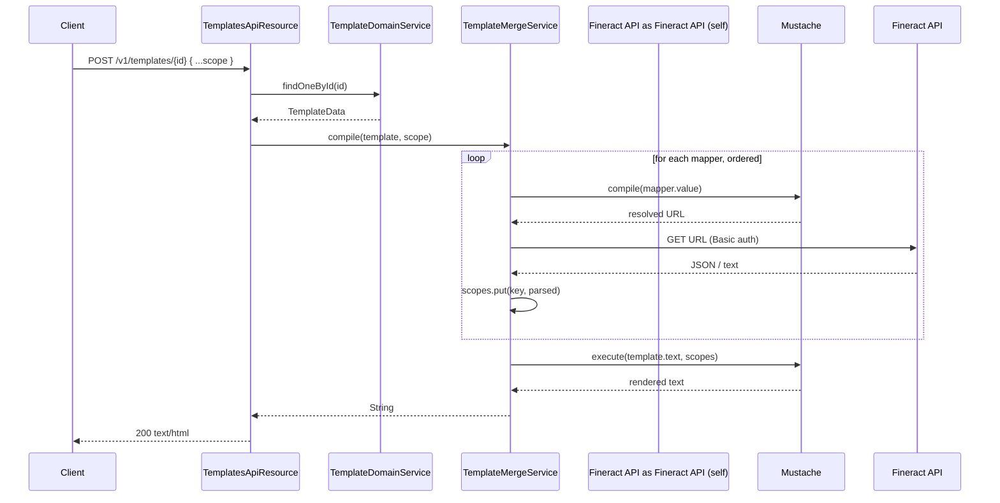

Apache Fineract ships a small but powerful **template engine** that backs user-generated documents (UGDs), SMS bodies, and any other text that needs to be produced by merging a stored snippet with live API data. The implementation lives in `fineract-provider/src/main/java/org/apache/fineract/template/` and is built around three ideas: a JPA-mapped `Template` entity, an ordered list of `TemplateMapper` rows that pull JSON from other Fineract endpoints, and a Mustache renderer (`com.github.mustachejava`) that stitches the pieces together. The REST surface — `TemplatesApiResource` — exposes CRUD plus a synchronous merge endpoint that returns rendered HTML.

This page is the map of the `template/` package. It explains what each sub-package contains, how a request flows through the command dispatcher, and how Mustache scopes are built up before the final write.

## Package layout

```text
fineract-provider/src/main/java/org/apache/fineract/template/
├── api/
│   └── TemplatesApiResource.java          ← JAX-RS endpoint at /v1/templates
├── command/
│   ├── TemplateCreateCommand.java
│   ├── TemplateUpdateCommand.java
│   └── TemplateDeleteCommand.java
├── data/
│   ├── TemplateData.java                  ← read DTO
│   ├── TemplateMapperData.java            ← mapper DTO
│   ├── TemplateCreateRequest.java / Response
│   ├── TemplateUpdateRequest.java / Response
│   └── TemplateDeleteRequest.java / Response
├── domain/
│   ├── Template.java                      ← @Entity m_template
│   ├── TemplateMapper.java                ← @Entity m_templatemappers
│   ├── TemplateEntity.java                ← CLIENT / LOAN
│   ├── TemplateType.java                  ← DOCUMENT / SMS
│   ├── TemplateRepository.java
│   ├── TemplateFunctions.java             ← static helpers exposed to Mustache
│   ├── TemplateEntitySerializer.java
│   └── TemplateTypeSerializer.java
├── exception/
│   ├── TemplateNotFoundException.java
│   ├── TemplateForbiddenException.java
│   └── TemplateTypeInvalidException.java
├── handler/
│   ├── TemplateCreateCommandHandler.java
│   ├── TemplateUpdateCommandHandler.java
│   └── TemplateDeleteCommandHandler.java
├── mapper/
│   ├── TemplateMapper.java                ← MapStruct DTO mapper (NOT the entity!)
│   ├── TemplateMapperDataMapper.java
│   └── TemplateMapperMapper.java
└── service/
    ├── TemplateDomainService.java
    ├── TemplateDomainServiceImpl.java
    ├── TemplateMergeService.java
    ├── TemplateMergeServiceImpl.java      ← the Mustache compiler
    └── TrustModifier.java                 ← TLS trust-all helper for mapper HTTP calls
```

<Note>
The MapStruct DTO mapper class is also named `TemplateMapper` and sits in the `mapper/` sub-package. It is *not* the same thing as the `TemplateMapper` JPA entity in `domain/`. The entity row carries the URL and key used at render time; the MapStruct mapper just converts entities to `TemplateData` DTOs.
</Note>

## What a template actually is

A `Template` row in `m_template` carries:

- a unique `name`
- a `TemplateEntity` enum value (`CLIENT` = 0, `LOAN` = 1) — purely a UI hint
- a `TemplateType` enum value (`DOCUMENT` = 0, `SMS` = 2; e-mail = 1 is reserved but disabled)
- a `text` column (`longtext`) containing the Mustache template source
- a `@OneToMany` list of `TemplateMapper` rows, each with an `mapperkey`, a `mappervalue` (a URL or URL template), and an integer `mapperorder`

From `fineract-provider/src/main/java/org/apache/fineract/template/domain/Template.java`:

```java
@Entity
@Table(name = "m_template", uniqueConstraints = { @UniqueConstraint(columnNames = { "name" }, name = "unq_name") })
public class Template extends AbstractPersistableCustom<Long> {

    @Column(name = "name", nullable = false, unique = true)
    private String name;

    @Enumerated
    @JsonSerialize(using = TemplateEntitySerializer.class)
    private TemplateEntity entity;

    @Enumerated
    @JsonSerialize(using = TemplateTypeSerializer.class)
    private TemplateType type;

    @Column(name = "text", columnDefinition = "longtext", nullable = false)
    private String text;

    @OrderBy(value = "mapperorder")
    @OneToMany(targetEntity = TemplateMapper.class, cascade = CascadeType.ALL, fetch = FetchType.EAGER)
    @JoinTable(name = "m_template_m_templatemappers", joinColumns = {
            @JoinColumn(name = "m_template_id", referencedColumnName = "id") }, inverseJoinColumns = {
                    @JoinColumn(name = "mappers_id", referencedColumnName = "id", unique = true) })
    private List<TemplateMapper> mappers;
}
```

The entity uses `@JsonSerialize` with custom serializers so that `entity` and `type` come back over the wire as `{ id, name }` pairs rather than ordinal integers — which is what the legacy `community-app` UI expects.

### The mapper rows

From `fineract-provider/src/main/java/org/apache/fineract/template/domain/TemplateMapper.java`:

```java
@Entity
@Table(name = "m_templatemappers")
public class TemplateMapper extends AbstractPersistableCustom<Long> {

    @Column(name = "mapperorder")
    private int mapperorder;

    @Column(name = "mapperkey")
    private String mapperkey;

    @Column(name = "mappervalue")
    private String mappervalue;
    // ...
}
```

A mapper essentially says "before you render, GET `mappervalue` and bind the parsed JSON response under `mapperkey` in the Mustache scope." `mappervalue` itself is a Mustache snippet, so URLs can reference path parameters that were posted with the merge request. The mapper rows are eagerly fetched and order-preserved via `@OrderBy("mapperorder")` — order matters because a later mapper can reference data fetched by an earlier mapper.

## Entity and type enums

```java
// fineract-provider/src/main/java/org/apache/fineract/template/domain/TemplateEntity.java
public enum TemplateEntity {
    @SerializedName("client") CLIENT(0, "client"),
    @SerializedName("loan")   LOAN(1, "loan");
}

// fineract-provider/src/main/java/org/apache/fineract/template/domain/TemplateType.java
public enum TemplateType {
    @SerializedName("Document") DOCUMENT(0, "Document"),
    @SerializedName("SMS")      SMS(2, "SMS");
    // EMAIL(1, "E-Mail") is reserved but currently commented out
}
```

The numeric ids leak into the REST query string — clients filter `GET /v1/templates?typeId=2&entityId=0` to find all SMS templates for clients.

## The REST resource

`fineract-provider/src/main/java/org/apache/fineract/template/api/TemplatesApiResource.java` is annotated `@Path("/v1/templates")` and tagged `templates` in the OpenAPI document. Its surface area is intentionally small:

| Method   | Path                              | Purpose                                                                |
| -------- | --------------------------------- | ---------------------------------------------------------------------- |
| `GET`    | `/v1/templates`                   | List all UGDs, optionally filtered by `typeId` and `entityId`.         |
| `GET`    | `/v1/templates/template`          | Return an empty "details" template — used by the UI to seed forms.     |
| `GET`    | `/v1/templates/{templateId}`      | Read a single UGD with its text and mappers.                           |
| `GET`    | `/v1/templates/{templateId}/template` | Same as above, kept for legacy reasons.                            |
| `POST`   | `/v1/templates`                   | Create a UGD (dispatches `TemplateCreateCommand`).                     |
| `PUT`    | `/v1/templates/{templateId}`      | Update a UGD (dispatches `TemplateUpdateCommand`).                     |
| `DELETE` | `/v1/templates/{templateId}`      | Delete a UGD (dispatches `TemplateDeleteCommand`).                     |
| `POST`   | `/v1/templates/{templateId}`      | **Render** the UGD against the supplied JSON. Returns `text/html`.     |

The `retrieveAllTemplates` handler shows how the `typeId` / `entityId` filter resolves to enum constants:

```java
@GET
public List<TemplateData> retrieveAllTemplates(
        @DefaultValue("-1") @QueryParam("typeId") final int typeId,
        @DefaultValue("-1") @QueryParam("entityId") final int entityId) {
    if (typeId != -1 && entityId != -1) {
        return templateService.getAllByEntityAndType(TemplateEntity.values()[entityId], TemplateType.values()[typeId]);
    } else {
        return templateService.getAll();
    }
}
```

### CRUD goes through the command dispatcher

`TemplatesApiResource` does **not** call the domain service directly for mutating operations — it builds a command and hands it to `CommandDispatcher` from `org.apache.fineract.command.core`. This keeps writes inside the platform's retry / transactional outbox / idempotency framework. The create method is representative:

```java
@POST
public TemplateCreateResponse createTemplate(@RequestBody(required = true) @Valid final TemplateCreateRequest request) {
    final var command = new TemplateCreateCommand();
    command.setPayload(request);

    final Supplier<TemplateCreateResponse> response = dispatcher.dispatch(command);

    return response.get();
}
```

The matching handler in `template/handler/TemplateCreateCommandHandler.java` is wrapped with Resilience4j retry and delegates to `TemplateDomainService`:

```java
@Slf4j
@Component
@RequiredArgsConstructor
public class TemplateCreateCommandHandler implements CommandHandler<TemplateCreateRequest, TemplateCreateResponse> {

    private final TemplateDomainService templateService;

    @Retry(name = "commandTemplateCreate", fallbackMethod = "fallback")
    @Override
    // ...
}
```

`TemplateUpdateCommandHandler` and `TemplateDeleteCommandHandler` follow the same shape.

## The domain service

`TemplateDomainServiceImpl` is the JPA-backed implementation; it is only registered when no other bean implements `TemplateDomainService`, via `@ConditionalOnMissingBean`. Its create path is intentionally minimal:

```java
@Transactional
@Override
public TemplateCreateResponse createTemplate(TemplateCreateRequest request) {
    var template = new Template().setName(request.getName())
            .setType(TemplateType.values()[request.getType()])
            .setEntity(TemplateEntity.values()[request.getEntity()])
            .setText(request.getText());

    templateRepository.saveAndFlush(template);

    return TemplateCreateResponse.builder().resourceId(template.getId()).build();
}
```

Update accepts a payload of mappers as well and converts the type id directly:

```java
switch (request.getType()) {
    case 0:
        template.setType(TemplateType.DOCUMENT);
    break;
    case 2:
        template.setType(TemplateType.SMS);
    break;
    default:
        throw new TemplateTypeInvalidException(request.getType());
}

template.setMappers(templateMapperDataMapper.map(request.getMappers()));
```

The mapper conversion uses MapStruct (`template/mapper/TemplateMapperDataMapper.java`) so the JSON list of `{ mapperorder, mapperkey, mappervalue }` becomes a managed `List<TemplateMapper>` that JPA can cascade-save.

Read paths simply hit the repository and project to DTOs through `TemplateMapper` (the MapStruct one, not the entity!). When the requested id does not exist, `TemplateNotFoundException` is thrown — that exception is mapped to HTTP 404 by Fineract's central exception mapper.

## How rendering works

The most interesting endpoint is `POST /v1/templates/{templateId}`. It takes a JSON body of additional scope variables, merges them with the query string, fetches every mapper URL, and pipes the lot through Mustache. The implementation is in `TemplatesApiResource.mergeTemplate`:

```java
@POST
@Path("{templateId}")
@Produces({ MediaType.TEXT_HTML })
public String mergeTemplate(@PathParam("templateId") final Long templateId,
        @Context final UriInfo uriInfo, @RequestBody(required = true) final Map<String, Object> result) {

    var template = templateService.findOneById(templateId);

    final MultivaluedMap<String, String> parameters = uriInfo.getQueryParameters();
    final Map<String, Object> parametersMap = new HashMap<>();
    for (final Map.Entry<String, List<String>> entry : parameters.entrySet()) {
        if (entry.getValue().size() == 1) {
            parametersMap.put(entry.getKey(), entry.getValue().getFirst());
        } else {
            parametersMap.put(entry.getKey(), entry.getValue());
        }
    }

    parametersMap.put("BASE_URI", uriInfo.getBaseUri());
    parametersMap.putAll(result);

    return this.templateMergeService.compile(template, parametersMap);
}
```

### The merge service

`TemplateMergeServiceImpl.compile` does the actual Mustache work:

```java
@Override
public String compile(final TemplateData template, final Map<String, Object> scopes) {
    scopes.put("static", TemplateFunctions.INSTANCE);

    var mf = new DefaultMustacheFactory();
    var mustache = mf.compile(new StringReader(template.getText()), template.getName());

    compiledMapFromMappers(asMap(template.getMappers()), scopes);

    expandMapArrays(scopes);

    var stringWriter = new StringWriter();
    mustache.execute(stringWriter, scopes);

    return stringWriter.toString();
}
```

A `static` key is injected so templates can call `{{static.now}}` to get the system clock from `TemplateFunctions.now()`:

```java
public final class TemplateFunctions {

    public static final TemplateFunctions INSTANCE = new TemplateFunctions();

    private TemplateFunctions() {}

    public static String now() {
        var dateFormat = new DateTimeFormatterBuilder().appendPattern("yyyy/MM/dd HH:mm").toFormatter();
        return dateFormat.format(DateUtils.getLocalDateTimeOfSystem());
    }
}
```

### Mapper resolution

`compiledMapFromMappers` walks the ordered map of `(key, urlTemplate)` pairs, runs each URL through Mustache first (so it can reference scope variables), prepends `BASE_URI` if the URL is relative, fetches the JSON, and binds the parsed object under the mapper key:

```java
private void compiledMapFromMappers(final Map<String, String> data, final Map<String, Object> scopes) {
    final MustacheFactory mf = new DefaultMustacheFactory();

    if (data != null) {
        for (final Map.Entry<String, String> entry : data.entrySet()) {
            final Mustache mappersMustache = mf.compile(new StringReader(entry.getValue()), "");
            final StringWriter stringWriter = new StringWriter();

            mappersMustache.execute(stringWriter, scopes);
            String url = stringWriter.toString();
            if (!url.startsWith("http")) {
                url = scopes.get("BASE_URI") + url;
            }
            try {
                scopes.put(entry.getKey(), getMapFromUrl(url));
            } catch (final IOException e) {
                log.error("getCompiledMapFromMappers() failed", e);
            }
        }
    }
}
```

When a mapper returns `text/plain`, the bytes are wrapped as `{ "src": "<body>" }` so the template can write `{{logo.src}}` and embed it inline. The default authenticated user's Spring Security token is reused for outbound calls via a thread-local `Authenticator`, so mapper requests run with the same identity as the merge request.

### Render flow



## Filtering by entity and type

The `getAllByEntityAndType` repository method is hit when the caller knows what bucket they want — e.g. the SMS gateway looking for any "client SMS" template:

```java
@Override
public List<TemplateData> getAllByEntityAndType(final TemplateEntity entity, final TemplateType type) {
    return templateRepository.findByEntityAndType(entity, type).stream()
            .map(template -> TemplateData.builder().id(template.getId()).build()).toList();
}
```

The repository (`TemplateRepository.java`) extends `JpaRepository<Template, Long>` and exposes `findByEntityAndType` and `findByTemplateMapper`. The list endpoint deliberately projects only `id` for the cheap variant — the consumer is expected to follow up with `GET /v1/templates/{templateId}` to materialise the full mapper graph.

## Exceptions and HTTP mapping

The package only throws three platform exceptions:

<CardGroup cols={3}>
  <Card title="TemplateNotFoundException" icon="circle-question">
    Thrown by the domain service when `findById` is empty. Mapped to **404**.
  </Card>
  <Card title="TemplateForbiddenException" icon="shield-xmark">
    Thrown by the merge service when an outbound mapper request returns 401/403, signalling the rendering user does not have access to the referenced API.
  </Card>
  <Card title="TemplateTypeInvalidException" icon="triangle-exclamation">
    Thrown by the update path when the supplied type id is not `0` (DOCUMENT) or `2` (SMS). Mapped to **400**.
  </Card>
</CardGroup>

## Where templates are used

UGDs are wired into a handful of feature areas:

- **Hooks** — `org.apache.fineract.infrastructure.hooks.processor.*` uses the template engine to render outgoing webhook payloads.
- **SMS notifications** — the SMS campaign module picks templates of type `SMS` (`type=2`) for the chosen `entity` (client or loan).
- **Custom letter generation** — the UI uses the merge endpoint to render disbursement letters, KYC printouts, and similar.
- **`GlobalEntityType.TEMPLATES`** — the bulk import module recognises templates as importable in `fineract-core/.../GlobalEntityType.java`, although the workbook populator for templates is currently not wired.

<Tip>
Because the merge endpoint runs as the current authenticated user and re-uses that identity for mapper HTTP calls, you can safely combine multiple Fineract endpoints in one UGD without exposing service accounts. The TLS trust shortcut lives in `TrustModifier` and is only used when Fineract has been started with a non-validating SSL configuration.
</Tip>

## Mustache tips

A few practical things to remember when writing a template body:

<Steps>
  <Step title="Reference the static helper">
    Use `{{static.now}}` (no parens, that's a Mustache lambda) to stamp the render time.
  </Step>
  <Step title="Mappers run in order">
    Declare a `client` mapper before a `clientImage` mapper if the image URL depends on `{{client.id}}`. The `@OrderBy("mapperorder")` annotation guarantees execution order.
  </Step>
  <Step title="Relative URLs are auto-prefixed">
    A mapper value of `clients/{{clientId}}` becomes `${BASE_URI}/clients/123` at render time. Only URLs starting with `http` are left alone.
  </Step>
  <Step title="Plain text becomes { src }">
    When the mapper response content-type is `text/plain`, the body is wrapped — write `{{logo.src}}` instead of `{{logo}}` for that case.
  </Step>
  <Step title="Arrays are expanded">
    `expandMapArrays` walks the scope and flattens map-of-maps so `{{#clients}}{{firstname}}{{/clients}}` works against the JSON list returned by a list endpoint.
  </Step>
</Steps>

## Next reads

<CardGroup cols={2}>
  <Card title="Bulk import overview" href="/bulkimport/overview">
    Excel-based bulk import — uses Mustache-style sheets in spirit but is otherwise unrelated to templates.
  </Card>
  <Card title="Hooks" href="/events/hooks-framework">
    Where rendered templates become outbound webhook bodies.
  </Card>
</CardGroup>
