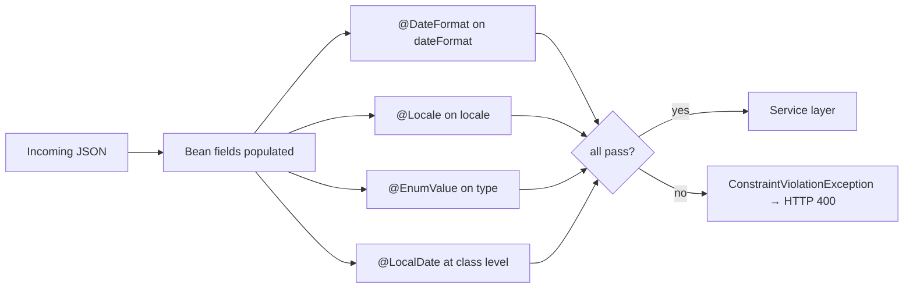

Apache Fineract ships exactly four custom Jakarta Bean Validation constraints in the `fineract-validation` Gradle module. They all sit under `fineract-validation/src/main/java/org/apache/fineract/validation/constraints/` and each follows the same pattern — an `@interface` declaring `message()`, `groups()`, `payload()`, plus any constraint-specific parameters, paired with a `ConstraintValidator<Annotation, T>` implementation that returns the boolean verdict.

This page enumerates all four with the actual source, the validator behaviour, and the message key for each.

## Catalogue

| Annotation                                | Validator                                  | Targets                | Checks                                                                       |
| ----------------------------------------- | ------------------------------------------ | ---------------------- | ---------------------------------------------------------------------------- |
| `@DateFormat`                             | `DateFormatValidator`                      | `FIELD`, `PARAMETER`   | The string is a valid `java.time.format.DateTimeFormatter` pattern.          |
| `@EnumValue(enumClass = X.class)`         | `EnumValueValidator`                       | `FIELD`                | The string matches one of `X`'s enum constants (case-insensitive).           |
| `@Locale`                                 | `LocaleValidator`                          | `FIELD`, `PARAMETER`   | The string is a known JVM BCP-47 locale.                                     |
| `@LocalDate(dateField, formatField, localeField)` | `LocalDateValidator`               | `TYPE` (class-level)   | The three referenced fields together parse into a strict `LocalDate`.        |

The full annotation surface is small enough that the entire module fits on this page.

---

## `@DateFormat`

### Annotation

```java
// fineract-validation/src/main/java/org/apache/fineract/validation/constraints/DateFormat.java
package org.apache.fineract.validation.constraints;

import jakarta.validation.Constraint;
import jakarta.validation.Payload;
import java.lang.annotation.Documented;
import java.lang.annotation.ElementType;
import java.lang.annotation.Retention;
import java.lang.annotation.RetentionPolicy;
import java.lang.annotation.Target;

@Documented
@Constraint(validatedBy = DateFormatValidator.class)
@Target({ ElementType.FIELD, ElementType.PARAMETER })
@Retention(RetentionPolicy.RUNTIME)
public @interface DateFormat {

    String message() default "{org.apache.fineract.validation.date-format}";

    Class<?>[] groups() default {};

    Class<? extends Payload>[] payload() default {};
}
```

### Validator

```java
// fineract-validation/src/main/java/org/apache/fineract/validation/constraints/DateFormatValidator.java
package org.apache.fineract.validation.constraints;

import jakarta.validation.ConstraintValidator;
import jakarta.validation.ConstraintValidatorContext;
import java.time.format.DateTimeFormatter;
import org.apache.commons.lang3.StringUtils;

public class DateFormatValidator implements ConstraintValidator<DateFormat, String> {

    @Override
    public boolean isValid(String value, ConstraintValidatorContext context) {
        if (StringUtils.isBlank(value)) {
            return true; // blank is allowed; use @NotBlank if required
        }
        return isValidPattern(value);
    }

    public static boolean isValidPattern(String pattern) {
        if (StringUtils.isBlank(pattern)) {
            return true;
        }
        try {
            DateTimeFormatter.ofPattern(pattern);
            return true;
        } catch (IllegalArgumentException e) {
            return false;
        }
    }
}
```

### Behaviour

- **Blank is allowed.** If you also want to reject blanks, stack `@NotBlank` on the field.
- The check delegates to `DateTimeFormatter.ofPattern(value)` — anything that throws `IllegalArgumentException` is invalid.
- `isValidPattern(String)` is also exposed as `public static` so non-annotation callers (notably the bulk-import handlers and command serialisers) can reuse the same pattern test on raw JSON values.

### Default message key

`{org.apache.fineract.validation.date-format}` — most call sites override with a more contextual key.

### Example call site

```java
@NotBlank(message = "{org.apache.fineract.businessdate.date-format.not-blank}")
@DateFormat
private String dateFormat;
```

(From `fineract-core/.../BusinessDateUpdateRequest.java`.)

---

## `@EnumValue`

### Annotation

```java
// fineract-validation/src/main/java/org/apache/fineract/validation/constraints/EnumValue.java
package org.apache.fineract.validation.constraints;

import jakarta.validation.Constraint;
import jakarta.validation.Payload;
import java.lang.annotation.Documented;
import java.lang.annotation.ElementType;
import java.lang.annotation.Retention;
import java.lang.annotation.RetentionPolicy;
import java.lang.annotation.Target;

@Documented
@Constraint(validatedBy = EnumValueValidator.class)
@Target({ ElementType.FIELD })
@Retention(RetentionPolicy.RUNTIME)
public @interface EnumValue {

    String message() default "{org.apache.fineract.validation.enum}";

    Class<?>[] groups() default {};

    Class<? extends Payload>[] payload() default {};

    Class<? extends Enum<?>> enumClass();
}
```

Note the required `enumClass()` attribute — that is how the validator knows the legal value set.

### Validator

```java
// fineract-validation/src/main/java/org/apache/fineract/validation/constraints/EnumValueValidator.java
package org.apache.fineract.validation.constraints;

import jakarta.validation.ConstraintValidator;
import jakarta.validation.ConstraintValidatorContext;
import java.util.Arrays;
import java.util.Set;
import java.util.stream.Collectors;

public class EnumValueValidator implements ConstraintValidator<EnumValue, String> {

    private Set<String> acceptedValues;

    @Override
    public void initialize(EnumValue annotation) {
        acceptedValues = Arrays.stream(annotation.enumClass().getEnumConstants())
                .map(e -> e.name().toLowerCase(java.util.Locale.ROOT))
                .collect(Collectors.toSet());
    }

    @Override
    public boolean isValid(String value, ConstraintValidatorContext context) {
        return value != null && acceptedValues.contains(value.toLowerCase(java.util.Locale.ROOT));
    }
}
```

### Behaviour

- Validator caches the lowercased enum names at `initialize(...)` time — a constant-time `Set::contains` is used at runtime.
- Comparison is **case-insensitive** (lower-cased in `Locale.ROOT`).
- `null` is **invalid** — stack `@NotNull` is redundant but harmless.
- Only the enum *name* matches — not any custom `code` / `value` getter you may have defined on the enum. If you need looser matching, write a separate constraint.

### Default message key

`{org.apache.fineract.validation.enum}`

### Example call sites

```java
// fineract-core
@EnumValue(enumClass = BusinessDateType.class, message = "{org.apache.fineract.businessdate.type.invalid}")
@NotNull(message = "{org.apache.fineract.businessdate.type.not-blank}")
private String type;
```

```java
// fineract-provider — portfolio/loanaccount/api/request/ReAgePreviewRequest.java
@EnumValue(enumClass = PeriodFrequencyType.class, message = "{org.apache.fineract.frequency-type.invalid}")
private String frequencyType;
```

```java
// fineract-provider — portfolio/loanaccount/api/request/ReAmortizationPreviewRequest.java
@EnumValue(enumClass = LoanReAmortizationInterestHandlingType.class,
           message = "{org.apache.fineract.interest-handling-type.invalid}")
private String interestHandlingType;
```

---

## `@Locale`

### Annotation

```java
// fineract-validation/src/main/java/org/apache/fineract/validation/constraints/Locale.java
package org.apache.fineract.validation.constraints;

import jakarta.validation.Constraint;
import jakarta.validation.Payload;
import java.lang.annotation.Documented;
import java.lang.annotation.ElementType;
import java.lang.annotation.Retention;
import java.lang.annotation.RetentionPolicy;
import java.lang.annotation.Target;

@Documented
@Constraint(validatedBy = LocaleValidator.class)
@Target({ ElementType.FIELD, ElementType.PARAMETER })
@Retention(RetentionPolicy.RUNTIME)
public @interface Locale {

    String message() default "{org.apache.fineract.validation.locale}";

    Class<?>[] groups() default {};

    Class<? extends Payload>[] payload() default {};
}
```

### Validator

```java
// fineract-validation/src/main/java/org/apache/fineract/validation/constraints/LocaleValidator.java
package org.apache.fineract.validation.constraints;

import jakarta.validation.ConstraintValidator;
import jakarta.validation.ConstraintValidatorContext;
import java.util.Arrays;
import org.apache.commons.lang3.StringUtils;

public class LocaleValidator implements ConstraintValidator<Locale, String> {

    @Override
    public boolean isValid(String value, ConstraintValidatorContext context) {
        if (StringUtils.isBlank(value)) {
            return false; // empty string is invalid
        }

        // Normalize input to use BCP 47 format (e.g., "en-US")
        String languageTag = value.replace('_', '-');

        java.util.Locale inputLocale = java.util.Locale.forLanguageTag(languageTag);

        // If language is empty, it's not a valid locale
        if (inputLocale.getLanguage().isEmpty()) {
            return false;
        }

        // Check if it matches any available locale
        return Arrays.stream(java.util.Locale.getAvailableLocales())
                .anyMatch(available -> available.toLanguageTag().equalsIgnoreCase(inputLocale.toLanguageTag()));
    }
}
```

### Behaviour

- Blank strings are **invalid** (the constraint is strict — unlike `@DateFormat`).
- `_` separators are normalised to `-` so both `en_US` and `en-US` are accepted as input forms.
- The string must produce a non-empty `Locale.getLanguage()` *and* match an entry in `Locale.getAvailableLocales()`. That rules out plausible-looking but unknown tags like `xx-YY`.
- Test cases (`LocaleValidationTest.invalidFormats`) explicitly reject `"invalid-locale"`, `"xx-YY"`, `"random text"`, `"123"`, and `"en-US-extra"`.

### Default message key

`{org.apache.fineract.validation.locale}`

### Example call site

```java
@NotBlank(message = "{org.apache.fineract.businessdate.locale.not-blank}")
@Locale
private String locale;
```

---

## `@LocalDate`

### Annotation

This one is different — it is a **class-level** constraint that reflects across three named fields:

```java
// fineract-validation/src/main/java/org/apache/fineract/validation/constraints/LocalDate.java
package org.apache.fineract.validation.constraints;

import jakarta.validation.Constraint;
import jakarta.validation.Payload;
import java.lang.annotation.Documented;
import java.lang.annotation.ElementType;
import java.lang.annotation.Retention;
import java.lang.annotation.RetentionPolicy;
import java.lang.annotation.Target;

@Documented
@Constraint(validatedBy = LocalDateValidator.class)
@Target({ ElementType.TYPE })
@Retention(RetentionPolicy.RUNTIME)
public @interface LocalDate {

    String message() default "{org.apache.fineract.validation.local-date}";

    String dateField();

    String formatField();

    String localeField();

    Class<?>[] groups() default {};

    Class<? extends Payload>[] payload() default {};
}
```

The three required attributes — `dateField`, `formatField`, `localeField` — are the names of the bean fields the validator should read.

### Validator

```java
// fineract-validation/src/main/java/org/apache/fineract/validation/constraints/LocalDateValidator.java
package org.apache.fineract.validation.constraints;

import static java.time.LocalDateTime.parse;

import jakarta.validation.ConstraintValidator;
import jakarta.validation.ConstraintValidatorContext;
import java.time.format.DateTimeFormatterBuilder;
import java.time.format.ResolverStyle;
import java.time.temporal.ChronoField;
import java.util.Locale;
import lombok.extern.slf4j.Slf4j;
import org.apache.commons.lang3.StringUtils;

@Slf4j
public class LocalDateValidator implements ConstraintValidator<LocalDate, Object> {

    private String dateField;
    private String formatField;
    private String localeField;

    @Override
    public void initialize(LocalDate annotation) {
        this.dateField = annotation.dateField();
        this.formatField = annotation.formatField();
        this.localeField = annotation.localeField();
    }

    @Override
    public boolean isValid(Object value, ConstraintValidatorContext context) {
        try {
            var dateAttr = value.getClass().getDeclaredField(dateField);
            var formatAttr = value.getClass().getDeclaredField(formatField);
            var localeAttr = value.getClass().getDeclaredField(localeField);

            dateAttr.setAccessible(true);
            formatAttr.setAccessible(true);
            localeAttr.setAccessible(true);

            var date = (String) dateAttr.get(value);
            var format = (String) formatAttr.get(value);
            var locale = (String) localeAttr.get(value);

            if (StringUtils.isBlank(date) || StringUtils.isBlank(format) || StringUtils.isBlank(locale)) {
                return false;
            }

            toLocalDate(date, format, locale);

            return true;
        } catch (IllegalAccessException | NoSuchFieldException e) {
            throw new RuntimeException("Invalid configuration for @LocalDate", e);
        } catch (Exception e) {
            return false;
        }
    }

    private void toLocalDate(String date, String format, String locale) {
        var formatter = new DateTimeFormatterBuilder().parseCaseInsensitive().parseLenient()
                .appendPattern(format.replace("y", "u"))
                .optionalStart().appendPattern(" HH:mm:ss").optionalEnd()
                .parseDefaulting(ChronoField.HOUR_OF_DAY, 0)
                .parseDefaulting(ChronoField.MINUTE_OF_HOUR, 0)
                .parseDefaulting(ChronoField.SECOND_OF_MINUTE, 0)
                .toFormatter(Locale.forLanguageTag(locale)).withResolverStyle(ResolverStyle.STRICT);

        parse(date, formatter);
    }
}
```

### Behaviour

- The validator reads three *named* fields from the bean via reflection — invalid field names raise a `RuntimeException` immediately (this is treated as a programming error, not a validation failure).
- All three fields must be non-blank — if any one is blank, the bean is rejected outright.
- The pattern goes through a `parseCaseInsensitive().parseLenient()` formatter with a strict resolver style, so `2024-02-30` is rejected while `2024-FEB-29` (in a leap year) is accepted.
- The `format.replace("y", "u")` step swaps the JVM's "year-of-era" pattern for the strict proleptic-year pattern — that is what makes `ResolverStyle.STRICT` work properly with year-only patterns.
- An optional ` HH:mm:ss` tail is accepted on the date string so callers can pass either `2024-01-15` or `2024-01-15 13:45:00`.

### Default message key

`{org.apache.fineract.validation.local-date}`

### Example call site

```java
// fineract-core/.../BusinessDateUpdateRequest.java
@LocalDate(dateField = "date", formatField = "dateFormat", localeField = "locale")
public class BusinessDateUpdateRequest implements Serializable {

    @NotBlank @DateFormat                              private String dateFormat;
    @NotNull @EnumValue(enumClass = BusinessDateType.class) private String type;
    @NotBlank                                          private String date;
    @NotBlank @Locale                                  private String locale;
}
```

```java
// fineract-provider/.../portfolio/loanaccount/api/request/ReAgePreviewRequest.java
@LocalDate(dateField = "startDate", formatField = "dateFormat", localeField = "locale")
public class ReAgePreviewRequest { /* ... */ }
```

## Composing the four

Most DTOs that accept a free-form date use all four constraints together. The compositional pattern is always the same:



Each constraint is independent: a request with a broken `dateFormat` will produce one violation from `@DateFormat` and one from `@LocalDate` (because the formatter could not be built). That is by design — the more violations a single request produces, the more actionable the 400 response.

## Message internationalisation

The `{...}` braces in each `message()` default mean Hibernate Validator looks up the key in a `MessageSource` instead of returning the literal string. The keys themselves are not bundled with `fineract-validation` — they are defined by the consuming module's `messages.properties` (typically `fineract-core/src/main/resources/messages.properties`). This separation lets a fork override messages without touching the validator JAR.

<Tip>
When stacking `@NotBlank` / `@NotNull` with one of these constraints, give each its own `message` — that way the 400 response tells the caller *which* check failed. The example `BusinessDateUpdateRequest` is a good template: every annotation has a separate message key.
</Tip>

<Note>
`@DateFormat` permits blanks while `@Locale` rejects them. The difference is intentional — `dateFormat` is sometimes legitimately absent (defaulting to a configured platform format), but a `locale` left blank is always ambiguous.
</Note>

## Test exemplar

Every constraint has a matching test in `fineract-validation/src/test/java/org/apache/fineract/validation/constraints/`. The locale test is the most thorough:

```java
@ParameterizedTest
@ValueSource(strings = { "invalid-locale", "xx-YY", "random text", "123", "en-US-extra" })
void invalidFormats(String locale) {
    var request = LocaleModel.builder().locale(locale).build();
    var errors = validator.validate(request);
    // assertThat(errors).hasSize(1);
}
```

Modelled on `LocaleValidationTest.java`. The test class boots a minimal Spring context with `MessageSourceAutoConfiguration` and a plain Hibernate Validator bean — no other Fineract module is needed to exercise the constraint.

## See also

<CardGroup cols={1}>
  <Card title="Validation module overview" href="/validation/overview">
    Why `fineract-validation` is its own Gradle module, how it integrates with Hibernate Validator, and where in the codebase the constraints are applied.
  </Card>
</CardGroup>
